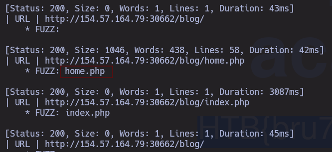
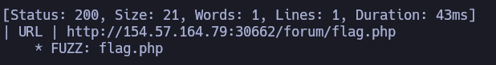
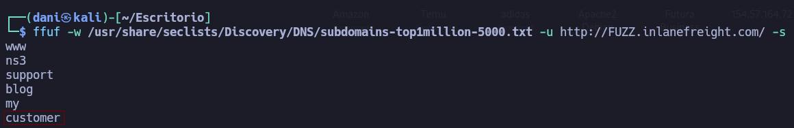
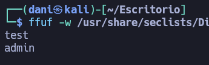
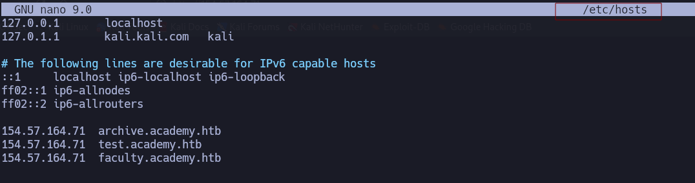
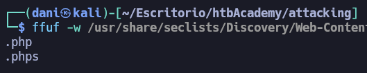
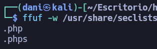
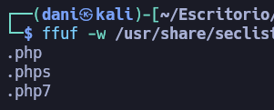
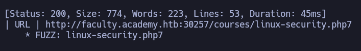

# Attacking Web Applications with Ffuf

## Basic Fuzzing

### Directory Fuzing

1. **In addition to the directory we found above, there is another directory that can be found. What is it?**

```
ffuf -w /usr/share/seclists/Discovery/Web-Content/DirBuster-2007_directory-list-2.3-small.txt -u http://154.57.164.79:32369/FUZZ
```

answer: **forum**

### Page Fuzzing

1. **Try to use what you learned in this section to fuzz the '/blog' directory and find all pages. One of them should contain a flag. What is the flag?**

```
ffuf -ic -w /usr/share/seclists/Discovery/Web-Content/DirBuster-2007_directory-list-2.3-small.txt -u http://154.57.164.79:30662/blog/FUZZ \
     -recursion -recursion-depth 1 \
     -e .php \
     -ic -ac -v
```

1. `ffuf`

Es el nombre de la herramienta. Es un fuzzer web extremadamente rápido escrito en Go.

2. `-ic` (Ignorar comentarios)

_Aparece dos veces en tu comando, solo hace falta ponerlo una vez._ Le indica a `ffuf` que **ignore las líneas de comentarios** dentro del diccionario (wordlist) que empiecen con almohadillas (`#`). Muchas listas de SecLists tienen introducciones con texto; este parámetro evita que `ffuf` intente buscar una carpeta llamada `# Version 2.3`.

3. `-w /usr/share/seclists/...` (Wordlist / Diccionario)

Especifica la ruta del diccionario que vas a usar. En este caso, estás usando `DirBuster-2007_directory-list-2.3-small.txt`, que es una lista clásica y muy efectiva que contiene los nombres de carpetas y archivos más comunes en la web.

4. `-u http://154.57.164.79:30662/blog/FUZZ` (URL del objetivo)

Es la URL que vas a escanear. La palabra **`FUZZ`** (en mayúsculas) es el marcador de posición. `ffuf` irá reemplazando la palabra `FUZZ` por cada una de las líneas del diccionario de forma masiva. Por ejemplo, probará:

- `.../blog/admin` 
- `.../blog/images`
- `.../blog/login`, etcétera.

5. `-recursion -recursion-depth 1` (Recursividad)

- **`-recursion`**: Le dice a `ffuf` que si encuentra un directorio válido (por ejemplo, `/blog/uploads/`), **vuelva a lanzar un escaneo automático dentro de ese nuevo directorio** (`/blog/uploads/FUZZ`).
- **`-recursion-depth 1`**: Limita la profundidad de la recursividad a 1 nivel para que el escaneo no se vuelva infinito ni sature el servidor. Solo entrará en el primer subdirectorio que encuentre.

6. `-e .php` (Extensiones)

Le dice a la herramienta que, además de probar la palabra limpia del diccionario, le añada la extensión `.php` al final. Si en la lista viene la palabra `secret`, `ffuf` probará tanto `/blog/secret` como `/blog/secret.php`. Es ideal para encontrar archivos ejecutables en servidores basados en PHP.

7. `-ac` (Calibración automática)

Este parámetro es vital. Le dice a `ffuf` que haga unas peticiones de prueba antes de empezar para **aprender cómo responde el servidor ante páginas que no existen** (errores 404 personalizados). Una vez que calibra el tamaño y las líneas de un error común, filtra automáticamente esos falsos positivos para que en tu pantalla solo aparezcan resultados reales e interesantes.

8. `-v` (Verbose / Detallado)

Activa el modo detallado. En lugar de mostrarte solo una lista simple, te mostrará la URL completa encontrada y hacia dónde redirige (en caso de que haya un redireccionamiento 301 o 302), lo cual es muy útil para entender la estructura del sitio.

<p align="center"> 

</p>

```
http://154.57.164.79:30662/blog/home.php
```

answer: **HTB{bru73_f0r_c0mm0n_p455w0rd5}**

### Recursive Fuzzing

1. **Try to repeat what you learned so far to find more files/directories. One of them should give you a flag. What is the content of the flag?**

```
ffuf -ic -w /usr/share/seclists/Discovery/Web-Content/DirBuster-2007_directory-list-2.3-small.txt -u http://154.57.164.79:30662/FUZZ \     
     -recursion -recursion-depth 1 \     
     -e .php \                      
     -ic -ac -v
```

<p align="center"> 

</p>

En el navegador escribimos la siguiente url:

```
http://154.57.164.79:30662/forum/flag.php
```

answer: **HTB{fuzz1n6_7h3_w3b!}**

## Domain Fuzzing 

### Sub-domain Fuzzing

1. **Try running a sub-domain fuzzing test on 'inlanefreight.com' to find a customer sub-domain portal. What is the full domain of it?**

He tenido que escribir varias veces  el comando para que funcione

```
ffuf -w /usr/share/seclists/Discovery/DNS/subdomains-top1million-5000.txt -u http://FUZZ.inlanefreight.com/ -s
```

<p align="center"> 

</p>

answer: **customer.inlanefreight.com**

### Filtering Results

1. **Try running a VHost fuzzing scan on 'academy.htb', and see what other VHosts you get. What other VHosts did you get?**

```
ffuf -w /usr/share/seclists/Discovery/DNS/subdomains-top1million-5000.txt -u http://154.57.164.78:30598/ -H 'HOST:FUZZ.academy.htb' -fs 986 -s
```

<p align="center"> 

</p>

answer: **test.academy.htb**

## Parameter Fuzzing

### Parameter Fuzzing - GET

1. **Using what you learned in this section, run a parameter fuzzing scan on this page. What is the parameter accepted by this webpage?**

**Nota**: No olvides agregar “admin.academy.htb” y la IP de destino a “/etc/hosts” antes de ejecutar

```
ffuf -w /usr/share/seclists/Discovery/Web-Content/burp-parameter-names.txt -u http://admin.academy.htb:30598/admin/admin.php?FUZZ=key -fs 798
```

Usamos el parámetro **-fs 798** para filtrar el tamaño en byte para que no aparezca en pantalla.

answer: **user**

### Value Fuzzing

1. **Try to create the 'ids.txt' wordlist, identify the accepted value with a fuzzing scan, and then use it in a 'POST' request with 'curl' to collect the flag. What is the content of the flag?**

En primer lugar, creamos un archivo llamado **ids.txt** que contenga los numeros del 1 al 1000 

```
for i in $(seq 1 1000); do echo $i >> ids.txt; done
```

Luego usaremos el siguiente comando, para saber que id nos sirve.

```
ffuf -w ids.txt -u http://admin.academy.htb:30598/admin/admin.php -X POST -d 'id=FUZZ' -H 'Content-Type: application/x-www-form-urlencoded' -fs 768
```

La herramienta curl la usaremos para conseguir la flag que nos solicita.

```
curl http://admin.academy.htb:30598/admin/admin.php -X POST -d 'id=73' -H 'Content-Type: application/x-www-form-urlencoded'
```

answer: **HTB{p4r4m373r_fuzz1n6_15_k3y!}**

## Skillls Assessment

### Skills Assessment - Web Fuzzing

1. **Run a sub-domain/vhost fuzzing scan on '*.academy.htb' for the IP shown above. What are all the sub-domains you can identify? (Only write the sub-domain name)**

```
ffuf -w /usr/share/seclists/Discovery/DNS/subdomains-top1million-5000.txt -u http://154.57.164.71:30257/ -H 'HOST:FUZZ.academy.htb' -fs 985
```

answer: **archive**, **test**, **faculty**

2. **Before you run your page fuzzing scan, you should first run an extension fuzzing scan. What are the different extensions accepted by the domains?**

**IMPORTANTE**: Tenemos que registrar los dominios descubierto en la actividad anterior en el fichero **/etc/hosts**

<p align="center"> 

</p>

```
ffuf -w /usr/share/seclists/Discovery/Web-Content/web-extensions.txt -u http://archive.academy.htb:30257/indexFUZZ -s
```

<p align="center"> 

</p>

```
ffuf -w /usr/share/seclists/Discovery/Web-Content/web-extensions.txt -u http://test.academy.htb:30257/indexFUZZ -s
```

<p align="center"> 

</p>

```
ffuf -w /usr/share/seclists/Discovery/Web-Content/web-extensions.txt -u http://faculty.academy.htb:30257/indexFUZZ -s
```

<p align="center"> 

</p>

Answer: **.php,.phps,.php7**

3. **One of the pages you will identify should say 'You don't have access!'. What is the full page URL?**

```
ffuf -w /usr/share/dirbuster/wordlists/directory-list-2.3-small.txt -u http://faculty.academy.htb:30257/FUZZ -recursion -recursion-depth 1 -e .php7 -v -fc 403 -ic 
```

<p align="center"> 

</p>

answer: **`http://faculty.academy.htb:PORT/courses/linux-security.php7`**

4. **In the page from the previous question, you should be able to find multiple parameters that are accepted by the page. What are they?**

```
ffuf -w /usr/share/seclists/Discovery/Web-Content/burp-parameter-names.txt -u http://faculty.academy.htb:30257/courses/linux-security.php7?FUZZ=key -fs 774
```

user

```
ffuf -w /usr/share/seclists/Discovery/Web-Content/burp-parameter-names.txt -u http://faculty.academy.htb:30257/courses/linux-security.php7 -X POST -d 'FUZZ=key' -H 'Content-Type: application/x-www-form-urlencoded' -fs 774 -s
```

user,username

answer: **user,username**

5. **Try fuzzing the parameters you identified for working values. One of them should return a flag. What is the content of the flag?**

```
ffuf -w /usr/share/dirb/wordlists/others/names.txt -u http://faculty.academy.htb:30257/courses/linux-security.php7 -X POST -d 'username=FUZZ' -H 'Content-Type: application/x-www-form-urlencoded' -fs 781
```

harry 

```
curl http://faculty.academy.htb:30257/courses/linux-security.php7 -X POST -d 'username=harry' -H 'Content-Type: application/x-www-form-urlencoded'
```

answer: `HTB{w3b_fuzz1n6_m4573r}`