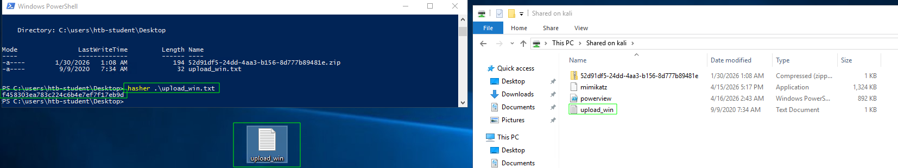

# File Transfers

## File Transfer Methods 

### Windows File Transfer Methods 

1. **Download the file flag.txt from the web root using wget from the Pwnbox. Submit the contents of the file as your answer.**

```
wget http://10.129.201.55/flag.txt
```

answer: **b1a4ca918282fcd96004565521944a3b **

2. **Upload the attached file named upload_win.zip to the target using the method of your choice. Once uploaded, unzip the archive, and run "hasher upload_win.txt" from the command line. Submit the generated hash as your answer.**

RDP to with user "<font color="#00b050">htb-student</font>" and password "<font color="#c00000">HTB_@cademy_stdnt!</font>"

```
xfreerdp /u:htb-student /p:HTB_@cademy_stdnt! /v:10.129.201.55 /size:98% /dynamic-resolution /drive:Shared,/opt/Tools/Windows
```

Con este comando ademas de entrar en conexion RDP, ademas estamos compartiendo una carpeta compartida y dentro esta el archivo comprimido que nos da la actividad

```
wget https://cdn.services-k8s.prod.aws.htb.systems/content/questions/file/52d91df5-24dd-4aa3-b156-8d777b89481e.zip
```

Con el comando anterior descargamos el .zip, la idea es llevar ese archivo a window y obtener su hash. El archivo comprimido lo he puesto en el escritorio del usuario **htb-student** 

```
hasher .\upload_win.txt
```

<p align="center"> 

</p>

answer: **f458303ea783c224c6b4e7ef7f17eb9d**
### Linux File Transfer Methods

1. **Download the file flag.txt from the web root using Python from the Pwnbox. Submit the contents of the file as your answer.**

```
wget http://10.129.12.119/flag.txt
```

answer: **5d21cf3da9c0ccb94f709e2559f3ea50**

2. **Upload the attached file named upload_nix.zip to the target using the method of your choice. Once uploaded, SSH to the box, extract the file, and run "hasher <`extracted file`>" from the command line. Submit the generated hash as your answer.**

SSH to with user "<font color="#00b050">htb-student</font>" and password "<font color="#c00000">HTB_@cademy_stdnt!</font>"

En primer lugar descargamos el .zip y los descomprimimos.

```
wget https://cdn.services-k8s.prod.aws.htb.systems/content/questions/file/82b4928b-6bfa-4da5-9377-5263107d6866.zip
unzip 82b4928b-6bfa-4da5-9377-5263107d6866.zip
```

Luego compartimos el archivo.

```
python3 -m http.server 80 
```

Abrimos sesion en la ip que nos ha dado htb e intentamos descargar el archivo.

```
ssh htb-student@10.129.12.119
curl http://10.10.14.250/upload_nix.txt -o hash.txt
```

Y obtenemos su hash 

```
hasher hash.txt
```

answer: **159cfe5c65054bbadb2761cfa359c8b0**