# Information Gathering Web Edition

## Whois

### Utilizing WHOIS

**¿Que es Whois?**

> **Whois** Es un protocolo que permite consultar bases de datos para determinar quién es el propietario de un nombre de dominio o una dirección IP

1.  **Perform a WHOIS lookup against the paypal.com domain. What is the registrar Internet Assigned Numbers Authority (IANA) ID number?**

```
whois paypal.com | grep IANA
```

<p align="center"> 
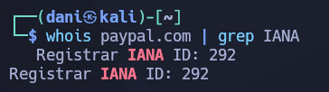
</p>

answer: **292**

2.  **What is the admin email contact for the tesla.com domain (also in-scope for the Tesla bug bounty program)?**

```
whois tesla.com | grep admin
```

<p align="center"> 
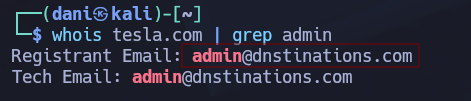
</p>

answer: **`admin@dnstinations.com`**

## DNS & Subdomains

### Digging DNS

1. **Which IP address maps to inlanefreight.com?**

```
nslookup inlanefreight.com
```

> **nslookup** es una herramienta de línea de comandos utilizada para consultar servidores de nombres de dominio (DNS) y obtener mapeos entre nombres de dominio y direcciones IP.

<p align="center"> 
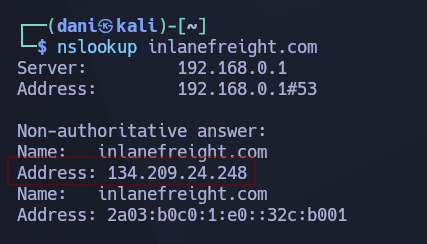
</p>

answer: **134.209.24.248**

2. **Which domain is returned when querying the PTR record for 134.209.24.248?**

```
dig -x 134.209.24.248
```

> El comando `dig -x` es la herramienta de rastreo para ver hacia dónde **apunta una dirección IP** en el sistema de nombres de Internet.

* El parámetro `-x` activa lo que se conoce como una **Búsqueda Inversa de DNS**, es decir, de normal dig sin el parámetro `-x` lo que hace es mostrar la ip de un dominio como lo que hace la herramienta **nslookup**

<p align="center"> 
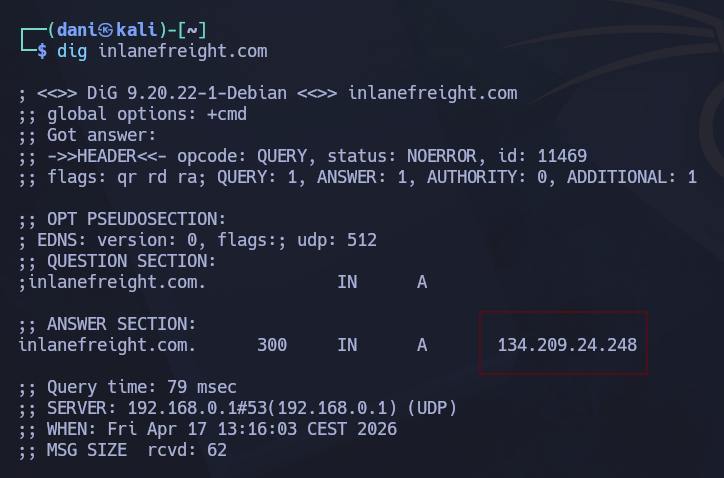
</p>

answer: **134.209.24.248**

3. **What is the full domain returned when you query the mail records for facebook.com?**

```
dig +short MX facebook.com   
```

* `+short`:  Es el parámetro de **limpieza**.
* `MX`: Define qué servidores se encargan de recibir los correos electrónicos para ese dominio

<p align="center"> 
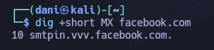
</p>

answer: **smtpin.vvv.facebook.com.**

### Subdomain Bruteforcing

1. **the known subdomains for inlanefreight.com (www, ns1, ns2, ns3, blog, support, customer), find any missing subdomains by brute-forcing possible domain names. Provide your answer with the complete subdomain, e.g., www.inlanefreight.com.**

Tendremos que abrir la maquina de HTBacademy proporcionada e introducer el siguiente comando: 

```
gobuster dns -d inlanefreight.com -w /usr/share/seclists/Discovery/DNS/subdomains-top1million-110000.txt
```

**Gosbuster** le estás pidiendo al programa que pruebe miles de nombres uno por uno para ver cuáles existen realmente bajo el dominio `inlanefreight.com`

* **`gobuster dns`**: Le indica a Gobuster que use el **modo DNS**. En este modo, la herramienta intenta resolver nombres de subdominios consultando a los servidores DNS, en lugar de hacer peticiones HTTP.

* **`-d inlanefreight.com`**: Define el **dominio objetivo** (target domain). Gobuster añadirá cada palabra de tu lista antes de este dominio (ej. `test.inlanefreight.com`).

- **`-w /usr/share/.../subdomains-top1million-110000.txt`**: El flag `-w` (wordlist) indica la ruta al archivo de texto que contiene la **lista de palabras**. En este caso, estás usando una lista muy popular de _SecLists_ que contiene los 110,000 subdominios más comunes.

<p align="center"> 

</p>

answer: **my.inlanefreight.com**

### DNS Zone Transfers

1. **After performing a zone transfer for the domain inlanefreight.htb on the target system, how many DNS records are retrieved from the target system's name server? Provide your answer as an integer, e.g, 123.**

```
dig axfr @10.129.3.139 inlanefreight.htb
```

- **`dig`**: Es la herramienta (Domain Information Groper).
- **`axfr`**: Es el tipo de consulta. Significa "Full Zone Transfer". Le pide al servidor que te envíe **toda** su base de datos de registros DNS.
- **`@10.129.3.139`**: Especifica a qué servidor DNS le estás haciendo la pregunta (en este caso, la IP de tu objetivo).
- **`inlanefreight.htb`**: El dominio del cual quieres obtener toda la información.

<p align="center"> 

</p>

answer: **22**

2. **Within the zone record transferred above, find the ip address for ftp.admin.inlanefreight.htb. Respond only with the IP address, eg 127.0.0.1**

<p align="center"> 
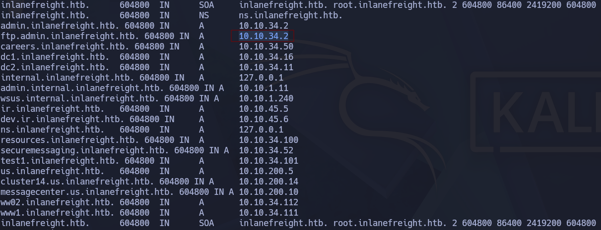
</p>

answer: **10.10.34.2**

3. **Within the same zone record, identify the largest IP address allocated within the 10.10.200 IP range. Respond with the full IP address, eg 10.10.200.1**

<p align="center"> 
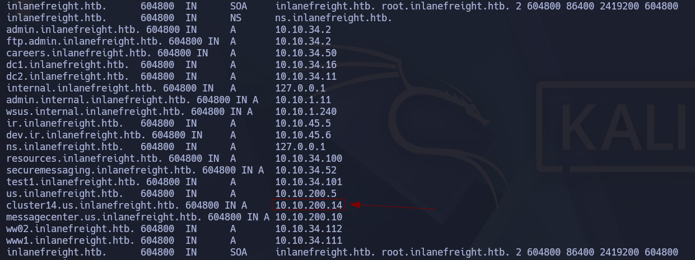
</p>

answer: **10.10.200.14**

### Virtual Hosts

1. **Brute-force vhosts on the target system. What is the full subdomain that is prefixed with "web"? Answer using the full domain, e.g. "x.inlanefreight.htb"**

Antes de nada, una vez iniciado el servidor, en mi fichero **/etc/hosts** añadimos la ip y el nombre  del dominio proporcionado.

```
gobuster vhost -u http://inlanefreight.htb:30482 -w /usr/share/seclists/Discovery/DNS/subdomains-top1million-110000.txt -t 50 
```

- **`vhost`**: El modo "detective de cabeceras". No busca IPs, busca si el servidor responde diferente cuando cambias el nombre del sitio en la petición HTTP.

- **`-u http://inlanefreight.htb:30482`**: El punto de entrada. Es la dirección y el puerto donde el servidor está escuchando.

- **`-w [wordlist]`**: Tu diccionario. Contiene miles de nombres posibles (dev, test, stage, admin...).

- **`--append-domain`**: El pegamento. Agarra "palabra" y le pega ".inlanefreight.htb" para que la consulta sea válida.

- **`-t 50`**: El motor. Lanza 50 peticiones simultáneas para terminar en minutos lo que a mano tardarías días.

<p align="center"> 
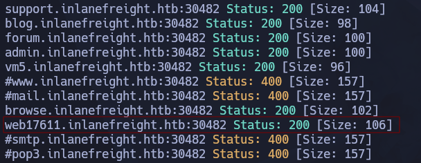
</p>

answer: **web17611.inlanefreight.htb**

2. **Brute-force vhosts on the target system. What is the full subdomain that is prefixed with "vm"? Answer using the full domain, e.g. "x.inlanefreight.htb"**

<p align="center"> 
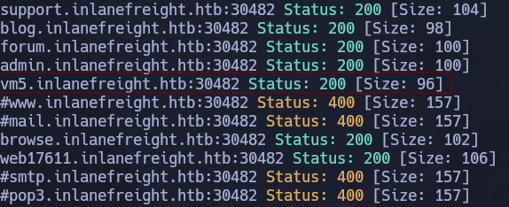
</p>

answer: **vm5.inlanefreight.htb**

3. **Brute-force vhosts on the target system. What is the full subdomain that is prefixed with "br"? Answer using the full domain, e.g. "x.inlanefreight.htb"**

<p align="center"> 
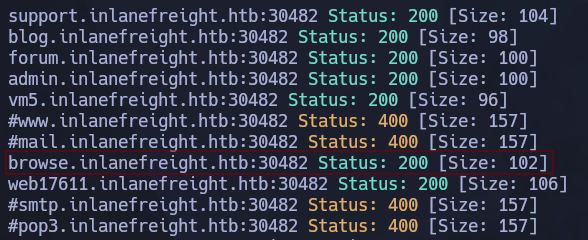
</p>

answer: **browse.inlanefreight.htb**

4. **Brute-force vhosts on the target system. What is the full subdomain that is prefixed with "a"? Answer using the full domain, e.g. "x.inlanefreight.htb"**

<p align="center"> 

</p>

answer: **admin.inlanefreight.htb**

5. **Brute-force vhosts on the target system. What is the full subdomain that is prefixed with "su"? Answer using the full domain, e.g. "x.inlanefreight.htb"**

<p align="center"> 
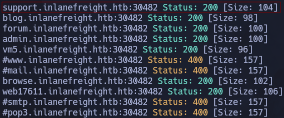
</p>

answer: **support.inlanefreight.htb**

## Fingerprinting

### Fingerprinting

1. **Determine the Apache version running on app.inlanefreight.local on the target system. (Format: 0.0.0)**

En primer lugar, para que nos funcione esta web **app.inlanefreight.local** hay que anotarlo en el fichero **/etc/hosts**, Ojo, tiene que tener permiso de sudo para escribir en en el fichero.

<p align="center"> 
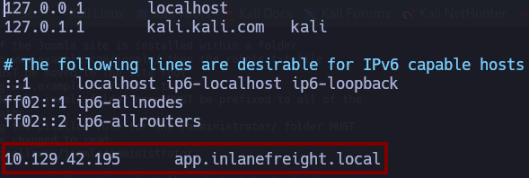
</p>

Luego, hay varias maneras para descubrir que servicio se esta usando, usando herramienta como **whatweb**, **Wappalyzer**, etc.

<p align="center"> 
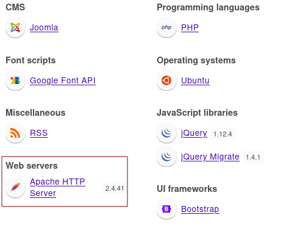
</p>

answer: 2.4.41

2. **Which CMS is used on app.inlanefreight.local on the target system? Respond with the name only, e.g., WordPress.**

<p align="center"> 
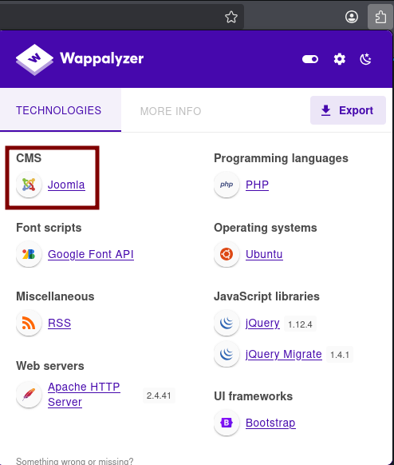
</p>

answer: **Joomla**

3. **On which operating system is the dev.inlanefreight.local webserver running in the target system? Respond with the name only, e.g., Debian.**

<p align="center"> 
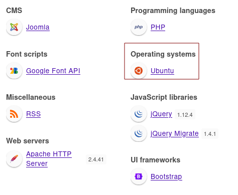
</p>

answer: **ubuntu**

## Crawling 

### Creepy Crawlies

1. **After spidering inlanefreight.com, identify the location where future reports will be stored. Respond with the full domain, e.g., files.inlanefreight.com.**

Usaremos la herramienta **spidering** que es el proceso automatizado de navegación por páginas web mediante un bot que extrae y sigue enlaces para mapear la estructura de un sitio y recopilar datos. Pero a la hora de usarlo, es recomendable hacerlo en un entorno virtual. 

Creación de un entorno virtual 

```
python3 -m venv venv
source venv/bin/activate
```

Una vez creado podemos crear cualquier programa sin que afecte a nuestra kali principal, ya que, es un entorno aislado.

```
wget -O ReconSpider.zip https://academy.hackthebox.com/storage/modules/144/ReconSpider.v1.2.zip
python ReconSpider.py http://inlanefreight.com
```

Toda la info recopilada por la herramienta **ReconSpider.py** a la página **`http://inlanefreight.com`** en un archivo llamado **results.json**

Dentro del archivo nos encontraremos la respuesta:

<p align="center"> 

</p>

answer: **inlanefreight-comp133.s3.amazonaws.htb**

## Web archives

### Web Archives

1. **How many Pen Testing Labs did HackTheBox have on the 8th August 2018? Answer with an integer, eg 1234.**

<p align="center"> 

</p>

Answer: **74 máquinas vulnerables**

2. **How many members did HackTheBox have on the 10th June 2017? Answer with an integer, eg 1234.**

<p align="center"> 
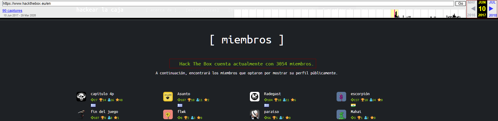
</p>

Answer: **3054 Miembros**

3. **Going back to March 2002, what website did the facebook.com domain redirect to? Answer with the full domain, eg `http://www.facebook.com/`**

<p align="center"> 

</p>

Answer: **`http://site.aboutface.com/`**

4. **According to the paypal.com website in October 1999, what could you use to "beam money to anyone"? Answer with the product name, eg My Device, remove the ™ from your answer.**

<p align="center"> 

</p>

Answer: **Palm 0rganizer**

5. **Going back to November 1998 on google.com, what address hosted the non-alpha "Google Search Engine Prototype" of Google? Answer with the full address, eg `http://google.com`**

<p align="center"> 
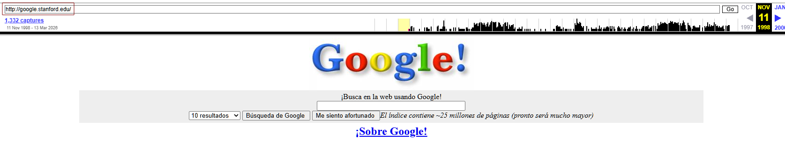
</p>

Answer: **`http://google.stanford.edu/`**

6. **Going back to March 2000 on `www.iana.org`, when exacty was the site last updated? Answer with the date in the footer, eg 11-March-99**

<p align="center"> 
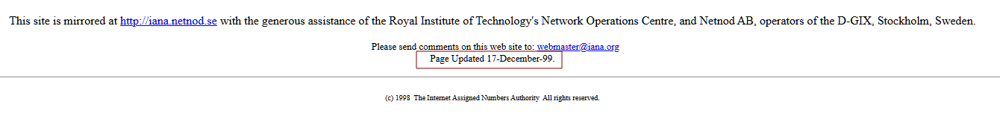
</p>

Answer: **17-December-99**

7. **According to wikipedia.com snapshot taken on February 9, 2003, how many articles were they already working on in the English version? Answer with the number they state without any commas, e.g., 100000, not 100,000.**

<p align="center"> 
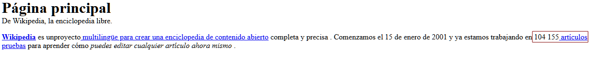
</p>

Answer: **104155**

## Skills Assessment

### Skills Assessment

1. **What is the IANA ID of the registrar of the inlanefreight.com domain?**

```
whois inlanefreight.com | grep IANA
```

<p align="center"> 
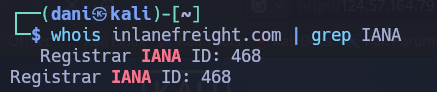
</p>

2. **What http server software is powering the inlanefreight.htb site on the target system? Respond with the name of the software, not the version, e.g., Apache.**

```
curl -I http://inlanefreight.htb:32172/
```

<p align="center"> 
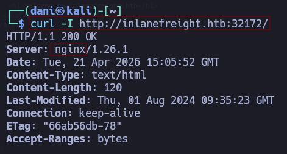
</p>

3. **What is the API key in the hidden admin directory that you have discovered on the target system?**

En esta ocasión tenemos que buscar el subdominio de **inlanefreight.htb** para ello lo intentaremos descubrir mediante fuerza bruta

```
gobuster vhost -u http://inlanefreight.htb:32172 -w /usr/share/seclists/Discovery/DNS/subdomains-top1million-110000.txt --append-domain -t 50
```

Al usar `--append-domain`, Gobuster hace lo siguiente:

1. Toma una palabra del diccionario (ejemplo: `dev`).
2. Le añade un punto `.` y el dominio que especificaste en la URL (`inlanefreight.htb`).
3. Envía la petición con el resultado en la cabecera **Host**.

<p align="center"> 
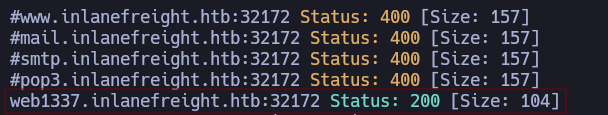
</p>

Visitamos el fichero **/etc/hosts** y añadimos el nuevo dominio.

<p align="center"> 
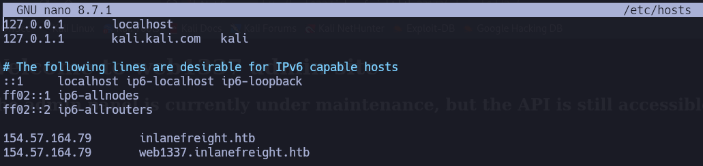
</p>

Luego, siempre cuando tengamos una nueva pagina lo primero que tenemos que mirar si tiene **robots.txt**:

```
http://web1337.inlanefreight.htb:32172/robots.txt
```

<p align="center"> 
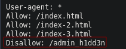
</p>

```
http://web1337.inlanefreight.htb:32172/admin_h1dd3n/
```

<p align="center"> 

</p>

answer: **e963d863ee0e82ba7080fbf558ca0d3f**

4. **After crawling the inlanefreight.htb domain on the target system, what is the email address you have found? Respond with the full email, e.g., `mail@inlanefreight.htb`.**

En esta ocasión, tenemos que usar la herramienta **ReconSpider.py** para poder extraer toda la información de la página **`http://dev.web1337.inlanefreight.htb:32172/`**. Para llevar acabo tenemos que crear un entorno de prueba y una vez dentro creamos el script.

Creación de un entorno virtual 

```
python3 -m venv venv
source venv/bin/activate
```

Una vez creado podemos crear cualquier programa sin que afecte a nuestra kali principal, ya que, es un entorno aislado.

```
wget -O ReconSpider.zip https://academy.hackthebox.com/storage/modules/144/ReconSpider.v1.2.zip
python ReconSpider.py http://dev.web1337.inlanefreight.htb:32172/
```

<p align="center"> 
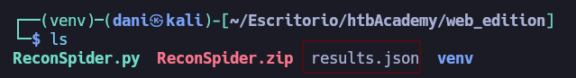
</p>

Dentro del archivo .json encontraremos el email 

answer: **`1337testing@inlanefreight.htb`**

5. **What is the API key the inlanefreight.htb developers will be changing too?**

Tendremos que mirar de nuevo en el fichero .json 

answer: **ba988b835be4aa97d068941dc852ff33**