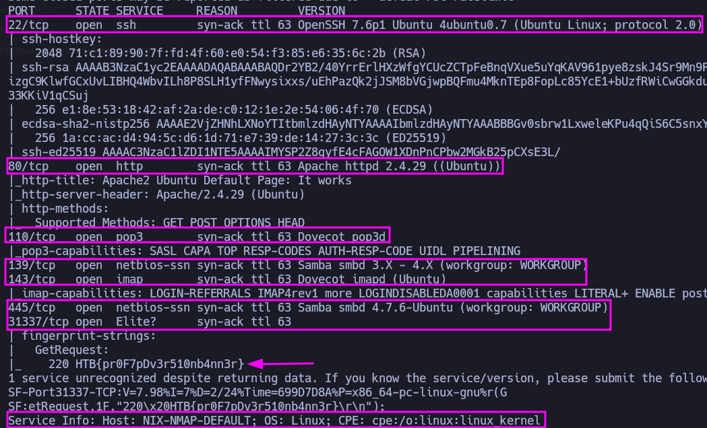
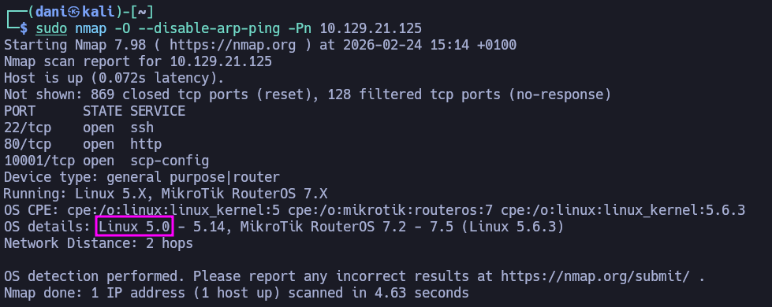
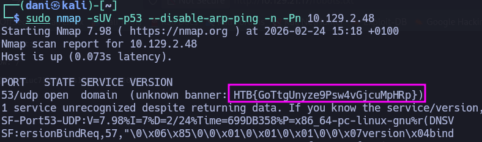
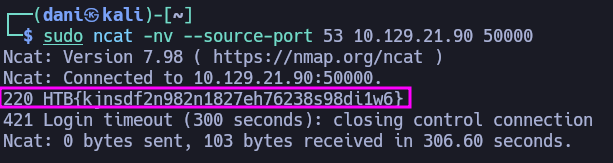

___
Tags: #nmap
___
# Network Enumeration with Nmap

## Host Enumeration

### Escaneo puerto TCP

El comando que uso con nmap es:

```
sudo nmap -p- --open -sS -sC -sV --min-rate 2000 -n -vvv -Pn 10.129.21.17
```

<p align="center"> 

</p>

| Open port | Service     | Version                                                      |
| --------- | ----------- | ------------------------------------------------------------ |
| 22        | ssh         | OpenSSH 7.6p1 Ubuntu 4ubuntu0.7 (Ubuntu Linux; protocol 2.0) |
| 80        | http        | Apache httpd 2.4.29 ((Ubuntu))                               |
| 110       | pop3        | Dovecot pop3d                                                |
| 139       | netbios-ssn | Samba smbd 3.X - 4.X (workgroup: WORKGROUP)                  |
| 143       | imap        | Dovecot imapd (Ubuntu)                                       |
| 445       | netbios-ssn | Samba smbd 4.7.6-Ubuntu (workgroup: WORKGROUP)               |
| 31337     | Elite?      | -                                                            |

### Host Discovery

Based on the last result, find out which operating system it belongs to. Submit the name of the operating system as result.

* **Windows**

### Host and Port Scanning

Find all TCP ports on your target. Submit the total number of found TCP ports as the answer.

* EL numero de puerto TCP total es **7**

Enumerate the hostname of your target and submit it as the answer. (case-sensitive)

* El hostname es **NIX-NMAP-DEFAULT**

### Saving the results

Perform a full TCP port scan on your target and create an HTML report. Submit the number of the highest port as the answer.

* La primera flag lo encontraras facilmente en el nmap

### Service Enumeration

Enumerate all ports and their services. One of the services contains the flag you have to submit as the answer.

* La segunda flag estará también en el nmap escondio.

<p align="center"> 

</p>

### Nmap Scripting Engine

Use NSE and its scripts to find the flag that one of the services contain and submit it as the answer.

* La tercera flag la encontrás en **robots.txt**

## Bypass Security Measures

### Firewall and IDS/IPS Evasion - Easy Lab 

Our client wants to know if we can identify which operating system their provided machine is running on. Submit the OS name as the answer.

```bash
sudo nmap -O --disable-arp-ping -Pn <ip>
```

<p align="center"> 

</p>

Sino funciona la palabra Linux, prueba con **Ubuntu**

### Firewall and IDS/IPS Evasion - Medium Lab

After the configurations are transferred to the system, our client wants to know if it is possible to find out our target's DNS server version. Submit the DNS server version of the target as the answer.

```bash
sudo nmap -sUV -p53 --disable-arp-ping -n -Pn <ip>
```

Ese comando hace un escaneo UDP al puerto 53 (DNS) e intenta identificar el servicio/versión, evitando resoluciones y “pings” previos.

- sudo: lo ejecutas con privilegios (necesario para algunas técnicas de escaneo, especialmente UDP).
- nmap: ejecuta Nmap.
* sU: escaneo de puertos UDP.
* sV (en tu -sUV): intenta detectar el servicio y su versión en el puerto que encuentre abierto.
* p53: escanea solo el puerto 53 (DNS).
* --disable-arp-ping: desactiva el descubrimiento por ARP en redes locales (aunque tu sistema aún puede hacer ARP para resolver MAC si hace falta).
* n: no hace resolución DNS (ni reverse DNS) de las IPs.
* Pn: salta host discovery; asume que el host está “up” y pasa directo al escaneo del puerto.

<p align="center"> 

</p>

### Firewall and IDS/IPS Evasion - Hard Lab 

 Now our client wants to know if it is possible to find out the version of the running services. Identify the version of service our client was talking about and submit the flag as the answer.

```bash
sudo ncat -nv --source-port 53 10.129.21.90 50000
```

Ese comando intenta abrir una conexión TCP desde tu máquina al host 10.129.21.90 en el puerto 50000, pero “fingiendo” que el puerto de origen (tu lado) es el 53.
* sudo: necesario porque usar un puerto de origen bajo (como 53) suele requerir privilegios.
* ncat: cliente tipo netcat para conectar a puertos y leer/escribir datos.
* -n: no resuelve DNS (usa la IP tal cual).
* -v: modo verbose, te muestra más info de la conexión (si conecta, a qué, etc.).
* --source-port 53: fija el puerto local de origen a 53; a veces se usa para saltarse reglas de firewall que permiten tráfico “que viene de” puertos concretos como 53 (DNS).
* 10.129.21.90 50000: destino y puerto al que te conectas.

<p align="center"> 

</p>