# Using Web Proxies

## Web Proxy

### Intercepting Web Requests

1.**Try intercepting the ping request on the server shown above, and change the post data similarly to what we did in this section. Change the command to read 'flag.txt'**

Para conseguir la flag.txt tendremos que usar burpsuite. Activamos foxy proxy desde el lado del navegador.

<p align="center"> 
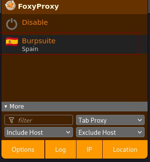
</p>

Y por la parte de burpsuite tenemos que tener activado el **intercept on** 

<p align="center"> 
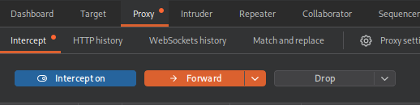
</p>

Luego, para capturar la navegación nos iremos a la siguiente url. 

```
http://154.57.164.82:32303/
```

<p align="center"> 
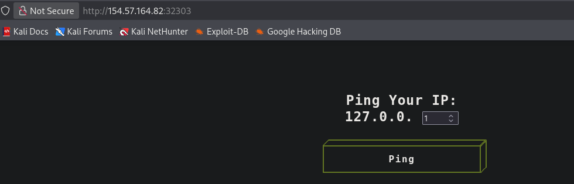
</p>

Establecemos el ping **127.0.0.1** y capturemos en bursuite lo siguiente:

<p align="center"> 

</p>

Llevamos esto al **repeater**, y en el parámetro **ip** escribimos **ip=1;ls**  y le damos a **send**

<p align="center"> 
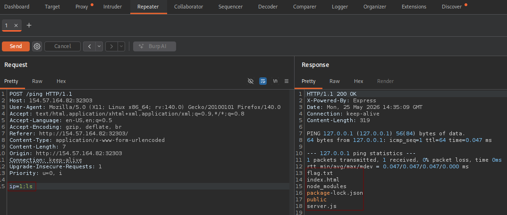
</p>

Por último, en el parámetro ip escribimos **ip=1;cat flag.txt**

<p align="center"> 
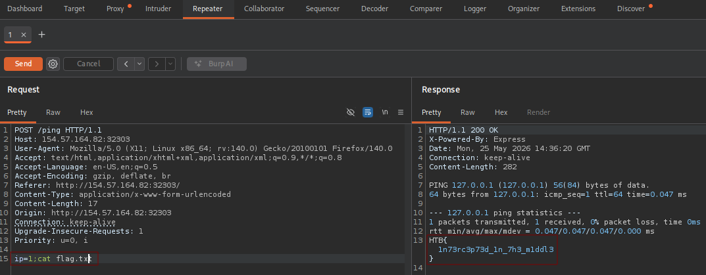
</p>

answer: **HTB{1n73rc3p73d_1n_7h3_m1ddl3}**

### Repeating Requests

1. **Try using request repeating to be able to quickly test commands. With that, try looking for the other flag.**

Continuando con la sesión anterior en el parametro **ip**, llevamos acabo el siguiente comando:

```
ip=1;ls ../../../../../../../
```

<p align="center"> 

</p>

Observamos que hay un flag.txt, por tanto cambiamos el comando a :

```
ip=1;cat ../../../../../../../../flag.txt
```

<p align="center"> 
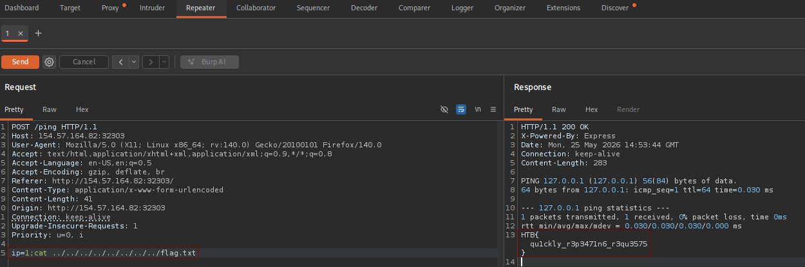
</p>

answer: **HTB{qu1ckly_r3p3471n6_r3qu3575}**

### Encoding/Decoding

1. **The string found in the attached file has been encoded several times with various encoders. Try to use the decoding tools we discussed to decode it and get the flag.**

Descargamos el .zip con el siguiente comando:

```
wget https://cdn.services-k8s.prod.aws.htb.systems/content/questions/file/19a1d573-22a8-4908-971f-ba70e4752223.zip
unzip 19a1d573-22a8-4908-971f-ba70e4752223.zip
```

<p align="center"> 
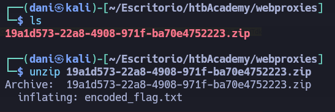
</p>

Una vez descomprimido, observemos el contenido del archivo **encoded_flag.txt**

```
cat encoded_flag.txt 
```

>VTJ4U1VrNUZjRlZXVkVKTFZrWkdOVk5zVW10aFZYQlZWRmh3UzFaR2NITlRiRkphWld0d1ZWUllaRXRXUm10M1UyeFNUbVZGY0ZWWGJYaExWa1V3ZVZOc1VsZGlWWEJWVjIxNFMxWkZNVFJUYkZKaFlrVndWVmR0YUV0V1JUQjNVMnhTYTJGM1BUMD0=

Luego en **burpsuite**, nos iremos al apartado **Decoder** y descodificamos por x4 veces en **base64** y una en **URL**

<p align="center"> 
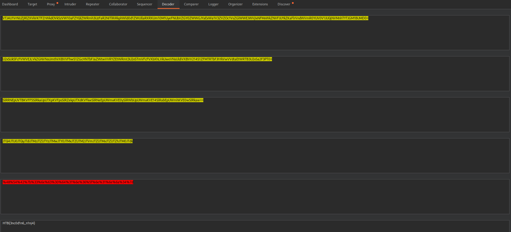
</p>

answer: **HTB{3nc0d1n6_n1nj4}**

### Proxying Tools

1. **Try running 'auxiliary/scanner/http/http_put' in Metasploit on any website, while routing the traffic through Burp. Once you view the requests sent, what is the last line in the request?**

En primer lugar, debemos de tener activado la intercepción en burpsuite, luego activamos metasploit en nuestra kali.

```
msfconsole -q 
use auxiliary/scanner/http/http_put
set Proxies HTTP:127.0.0.1:8080
set RHOSTS 10.10.15.161
run
```

De nuevo, en burpsuite capturamos la intercepción.

<p align="center"> 
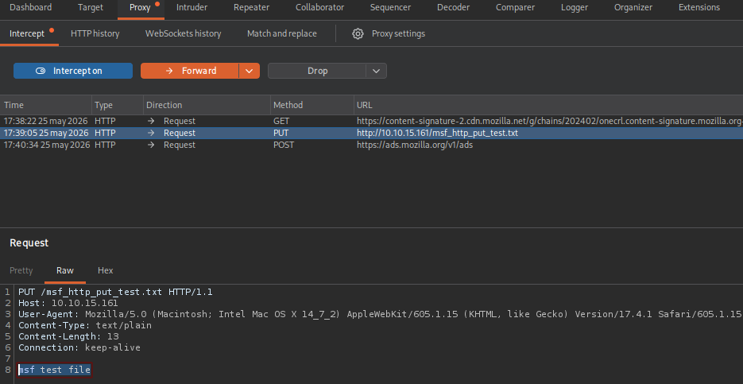
</p>

answer: **msf test file**

## Web Truzer

### Burp Intruder

1. **Use Burp Intruder to fuzz for '.html' files under the /admin directory, to find a file containing the flag.**

Hacerlo por burspuite no nos va a dejar porque el diccionario **common.txt** es muy grande, y como soy pobre y solo uso el como gratuito lo haremos de otra forma diferente, con el siguiente comando:

```
ffuf -u http://154.57.164.72:32283/admin/FUZZ -w /usr/share/seclists/Discovery/Web-Content/common.txt -e .html,.txt,.php -ic
```

<p align="center"> 
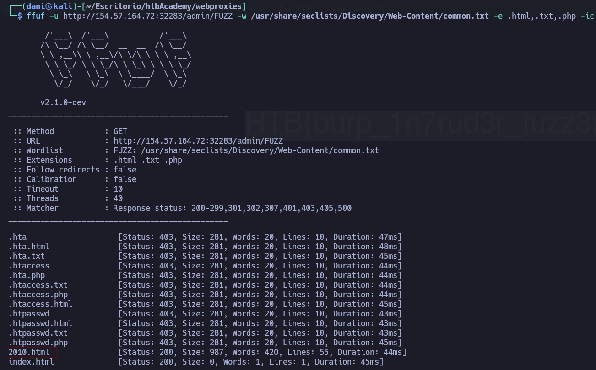
</p>

Por tanto, la URL quedaría de la siguiente forma:

```
http://154.57.164.72:32283/admin/2010.html
```

answer: **HTB{burp_1n7rud3r_fuzz3r!}**

### ZAP Fuzzer

1. **The directory we found above sets the cookie to the md5 hash of the username, as we can see the md5 cookie in the request for the (guest) user. Visit '/skills/' to get a request with a cookie, then try to use ZAP Fuzzer to fuzz the cookie for different md5 hashed usernames to get the flag. Use the "top-usernames-shortlist.txt" wordlist from Seclists.**

En el navegador escribimos lo siguiente: 

```
http://154.57.164.83:30864/skills/
```

Lo interceptamos con **burpsuite**

<p align="center"> 
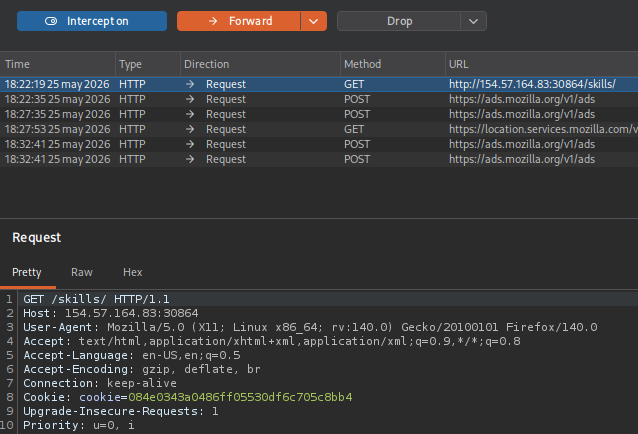
</p>

Trasladamos la intercepción al intruder, y donde va la cookie le ponemos el **Add$** quedaría tal que así:

<p align="center"> 
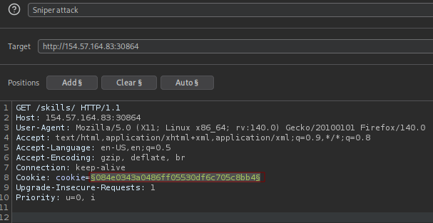
</p>

La cookie esta en md5 si lo descodificamos es **guest**

<p align="center"> 
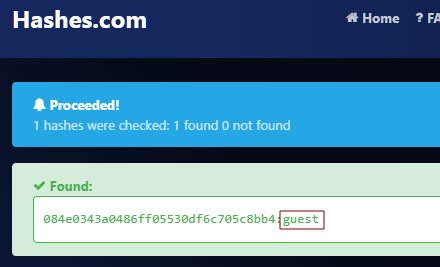
</p>

Por tanto, haremos un ataque de fuerza bruta usando el diccionario **top-usernames-shortlist.txt**, en mi kali se encuentra en la siguiente ruta: **/usr/share/seclists/Usernames/top-usernames-shortlist.txt**, lo añadimos en el apartado de la derecha donde dice **Payloads**

<p align="center"> 
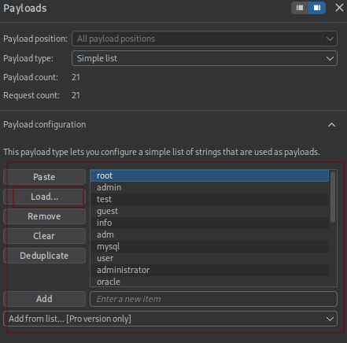
</p>

Una vez cargado el diccionario usando el botón **load** nos vamos hacia abajo donde dice **payload processing** y le a **add**

<p align="center"> 
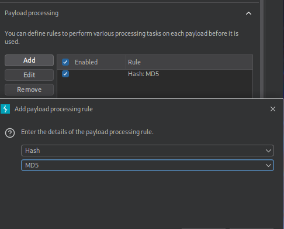
</p>

Se nos añadirá **Hash:MD5**, esto lo que hará que todos los usuarios que aparece en el diccionario **top-usernames-shortlist.txt** este en md5. iniciamos el ataque en **start attack**

<p align="center"> 
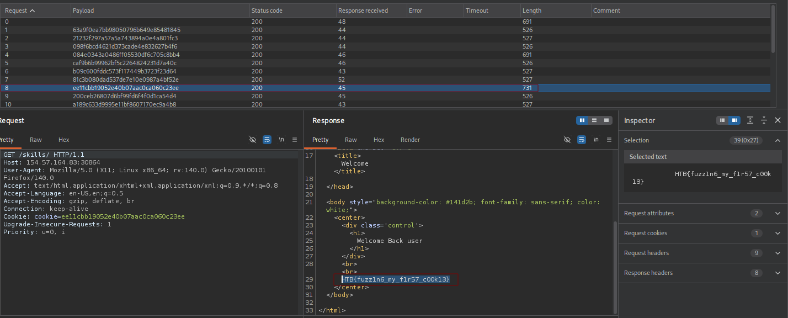
</p>

answer: **HTB{fuzz1n6_my_f1r57_c00k13}**

## Web Scanner

### ZAP Scanner

1. **Run ZAP Scanner on the target above to identify directories and potential vulnerabilities. Once you find the high-level vulnerability, try to use it to read the flag at '/flag.txt'**

No lo voy a hacer con Zap Scanner ya que prefiero BurpSuite. Voy a hacerlo sin necesidad de escaneos.

A continuación realizaré el siguiente comando:

```
dirb http://154.57.164.78:31397/ /usr/share/dirb/wordlists/common.txt
```

<p align="center"> 
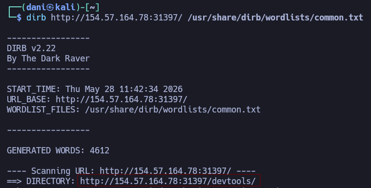
</p>

```
http://154.57.164.78:31397/devtools/
```

Con la siguiente la URL preparamos un curl pero urcoleado, para conseguir la flag.txt

```
curl -s "http://154.57.164.78:31397/devtools/ping.php?ip=127.0.0.1%3Bcat%20/flag.txt" 
```

El comando se divide en la herramienta (`curl`) y la URL con la carga útil (_payload_):

- **`curl -s`**: Es una herramienta de terminal para hacer peticiones HTTP (como un navegador web, pero sin interfaz gráfica). El parámetro `-s` (silent) oculta las barras de carga para que solo veas la respuesta limpia del servidor.
- **`http://154.57.164.78:31397/devtools/ping.php`**: Es la dirección IP y el puerto de un servidor web. Apunta a un archivo PHP llamado `ping.php`, que probablemente fue diseñado para que un administrador web pruebe la conectividad de la red haciendo un "ping" a una IP.
- **`?ip=127.0.0.1%3Bcat%20/flag.txt`**: Aquí está la magia. El script espera recibir una dirección IP, pero el atacante ha inyectado comandos maliciosos usando **codificación URL (URL Encoding)**:
    - `127.0.0.1` es la IP local.
    - `%3B` es el código URL para el punto y coma (`;`). En sistemas basados en Linux, el punto y coma sirve para separar comandos y decirle a la terminal: _"Ejecuta el primer comando y, cuando termines, ejecuta el que sigue"_.
    - `cat%20/flag.txt` se traduce como `cat /flag.txt` (`%20` es el espacio en blanco). El comando `cat` en Linux sirve para abrir y leer el contenido de un archivo. En este caso, un archivo llamado `flag.txt`.

**En resumen:** El servidor web intentó ejecutar algo como `ping -c 4 127.0.0.1`, pero debido a la falta de seguridad, terminó ejecutando:

```
ping -c 4 127.0.0.1 ; cat /flag.txt
```

El servidor hace el ping y justo después **le escupe al atacante el contenido del archivo secreto `/flag.txt`** en la pantalla.

answer: **HTB{5c4nn3r5_f1nd_vuln5_w3_m155}**

## Skills Assessment

### Skills Assessment

1. **The /lucky.php page has a button that appears to be disabled. Try to enable the button, and then click it to get the flag.**

```
http://154.57.164.64:31412/lucky.php
```

Nos iremos al código fuente de la página y borraremos donde pone **disabled=""**, luego le das al botón y aparecerá la **flag.txt** (tienes que darlo varias veces hasta que salga la **flag.txt**) Lo puedes hacer tanto en **burpsuite** como en la pagina web.

<p align="center"> 
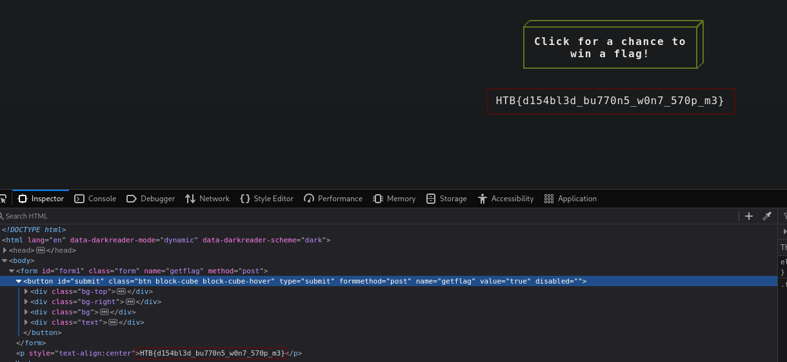
</p>

answer: **HTB{d154bl3d_bu770n5_w0n7_570p_m3}**

2. **The /admin.php page uses a cookie that has been encoded multiple times. Try to decode the cookie until you get a value with 31-characters. Submit the value as the answer.**

Luego, en burpsuite cambiamos el post a /admin.php y la cookie estará cifrado **4d325268597a6b7a596a686a5a4449314d4746684f474d7859544d325a6d5a6d597a63355954453359513d3d**

<p align="center"> 
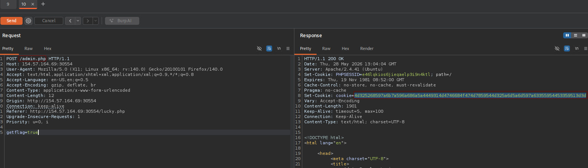
</p>

En Decoder, lo descodificamos en primer lugar en **ASCII hex**, luego en segundo lugar lo descodificamos en **BASE64** y obtenemos la respuesta de la pregunta

<p align="center"> 
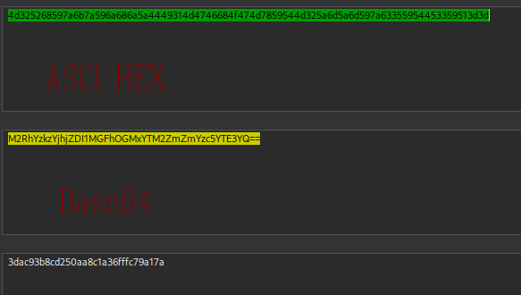
</p>

answer: **3dac93b8cd250aa8c1a36fffc79a17a**

3. **Once you decode the cookie, you will notice that it is only 31 characters long, which appears to be an md5 hash missing its last character. So, try to fuzz the last character of the decoded md5 cookie with all alpha-numeric characters, while encoding each request with the encoding methods you identified above. (You may use the "alphanum-case.txt" wordlist from Seclist for the payload)**

Lo siguiente que hay que hacer es añadir esto al request 

```
Cookie: PHPSESSID=9kpini3t9jf5f657d1dsq91li1; cookie=4d325268597a6b7a596a686a5a4449314d4746684f474d7859544d325a6d5a6d597a6335595445335957513d
```

Quedaría tal que así: 

```
GET /admin.php HTTP/1.1
Host: 154.57.164.69:30554
User-Agent: Mozilla/5.0 (X11; Linux x86_64; rv:140.0) Gecko/20100101 Firefox/140.0
Accept: text/html,application/xhtml+xml,application/xml;q=0.9,*/*;q=0.8
Accept-Language: en-US,en;q=0.5
Accept-Encoding: gzip, deflate, br
Cookie: PHPSESSID=9kpini3t9jf5f657d1dsq91li1; cookie=4d325268597a6b7a596a686a5a4449314d4746684f474d7859544d325a6d5a6d597a6335595445335957513d
Content-Type: application/x-www-form-urlencoded
Content-Length: 12
Origin: http://154.57.164.69:30554
Connection: keep-alive
Referer: http://154.57.164.69:30554/lucky.php
Upgrade-Insecure-Requests: 1
Priority: u=0, i

getflag=true
```

Luego, pasar esta solicitud a **intruder** y las cookie los ponemos entre `$$`

<p align="center"> 
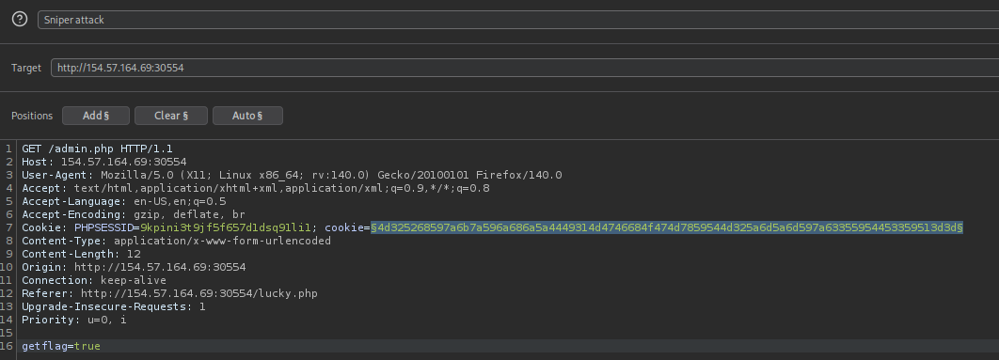
</p>

A la derecha cargamos el diccionario **alphanum-case.txt** que se encuentra en la siguiente dirección en la kali **/usr/share/seclists/Fuzzing/alphanum-case.txt**

<p align="center"> 
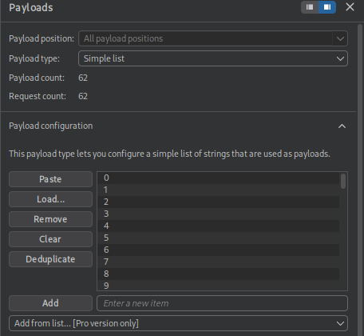
</p>

Luego abajo, en payload añadimos lo siguiente: 

- **add** - **Add prefix** - **prefix** 

<p align="center"> 
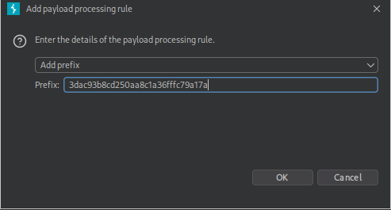
</p>

- **add** - **Encode** - **Base64-emcode**
- **add** - **Encode** - **Encode as ASCII hex

<p align="center"> 
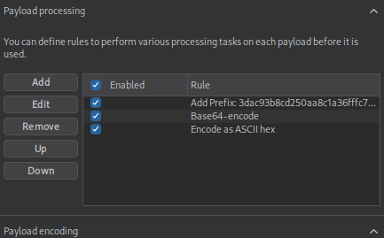
</p>

Por último, iniciamos ataque en **start attack**, luego nos fijamos en la longitud **Length**

<p align="center"> 
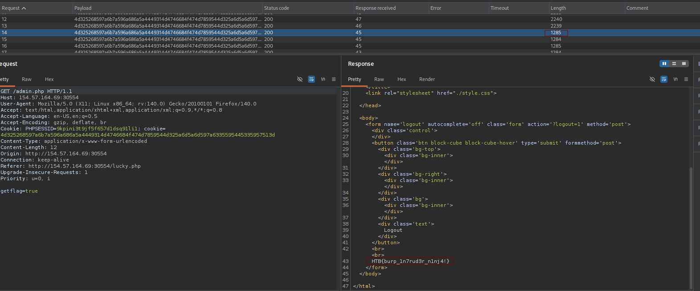
</p>

answer: **HTB{burp_1n7rud3r_n1nj4!}**

4. **You are using the 'auxiliary/scanner/http/coldfusion_locale_traversal' tool within Metasploit, but it is not working properly for you. You decide to capture the request sent by Metasploit so you can manually verify it and repeat it. Once you capture the request, what is the 'XXXXX' directory being called in '/XXXXX/administrator/..'?**

```
msfconsole -q 
use auxiliary/scanner/http/coldfusion_locale_traversal
options
```

<p align="center"> 
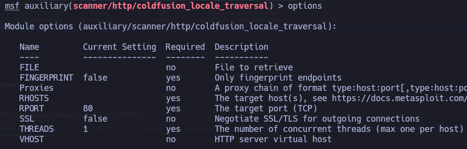
</p>

```
set Proxies http:127.0.0.1:8080
set RHOSTS 10.10.15.1
```

<p align="center"> 
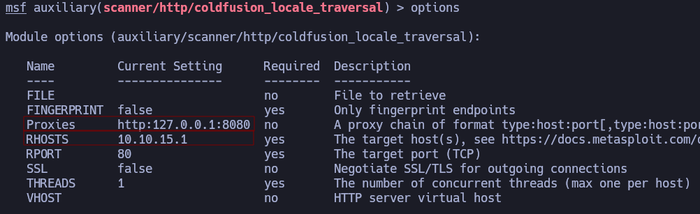
</p>

```
run
```

Nos vamos a burpsuite, y observamos lo siguiente:

<p align="center"> 
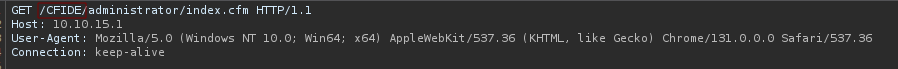
</p>

answer: **CFIDE**