# Vulnerability Assessment

## Nessus

### Nessus Skills Assessment

1. **What is the name of one of the accessible SMB shares from the authenticated Windows scan? (One word)**

Authenticate to 10.129.202.116 (ACADEMY-VA-SCAN01), with user "<font color="#00b050">htb-student</font>" and password "<font color="#c00000">HTB_@cademy_student!</font>"

Para esta ocasión usaremos la MV que nos ofrece HTBAcademy ya que en esa máquina tiene instalado Nessus. Activamos la **target** y en el navegador escribimos lo siguiente:

```
https://10.129.202.116:8834
```

Luego introducimos las credenciales. Una vez dentro en parte izquierda **All Scans** - **Windows_basic_authed**

<p align="center"> 
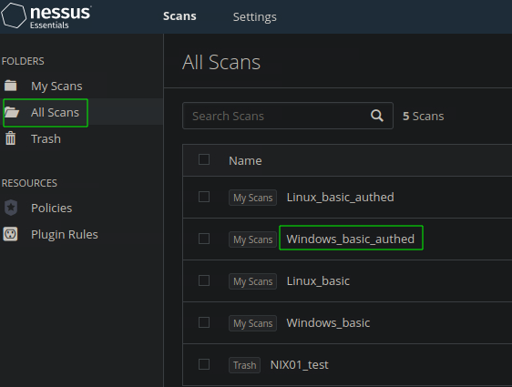
</p>

Luego, nos situamos en **Vulnerabilities** y en el navegador escribimos **smb share** y clikamos en **Microsoft Windows SMB Shares Access**

<p align="center"> 
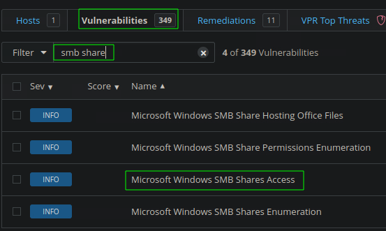
</p>

El nombre de la carpeta compartida estará aquí

<p align="center"> 
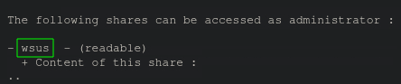
</p>

answer: **wsus**

2. **What was the target for the authenticated scan?**

**Hosts** 

<p align="center"> 
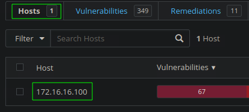
</p>

answer: **172.16.16.100**

3. **What is the plugin ID of the highest criticality vulnerability for the Windows authenticated scan?**

**Vulnerabilities** y luego le damos a la primera vulnerabilidad. 

<p align="center"> 
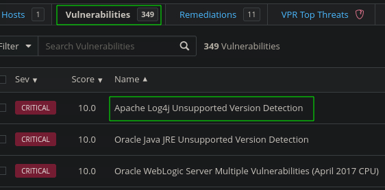
</p>

En columna izquierda esta la ID de la vulnerabilidad. 

<p align="center"> 
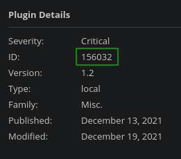
</p>

answer: **156032**

4. **What is the name of the vulnerability with plugin ID 26925 from the Windows authenticated scan? (Case sensitive)**

**Vulnerabilities** - **Filter** 

<p align="center"> 

</p>

answer: **VNC Server Unauthenticated Access**

5. **What port is the VNC server running on in the authenticated Windows scan?**

Por último, limpiamos el filtro y en el navegador escribimos **VNC** 

<p align="center"> 
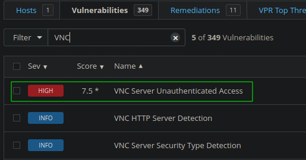
</p>

Una vez dentro 

<p align="center"> 
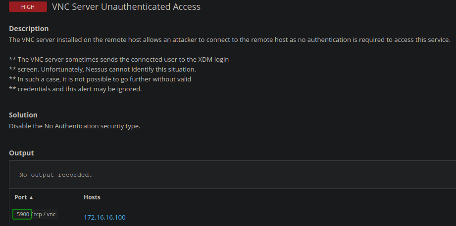
</p>

answer: **5900**

## OpenVAS

### OpenVAS Skills Assessment

1. **What type of operating system is the Linux host running? (one word)**

Authenticate to with user "<font color="#00b050">htb-student</font>" and password "<font color="#c00000">HTB_@cademy_student!</font>"

Para esta ocasión usaremos la MV que nos ofrece HTBAcademy ya que en esa máquina tiene instalado OpenVAS. Activamos la **target** y en el navegador escribimos lo siguiente:

```
https://10.129.12.31:8080/
```

**Scans** - **Linux-basic** - **Operating Systems**

<p align="center"> 

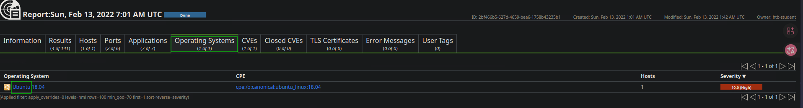
</p>

answer: **Ubuntu**

2. **What type of FTP vulnerability is on the Linux host? (Case Sensitive, four words)**

**Results**

<p align="center"> 
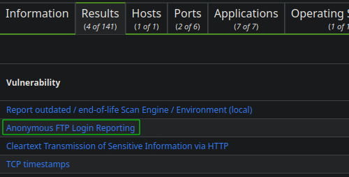
</p>

answer: **Anonymous FTP Login Reporting**

3. **What is the IP of the Linux host targeted for the scan?**

**Results** 

<p align="center"> 
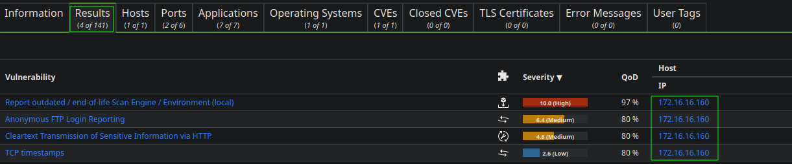
</p>

answer: **172.16.16.160**

4. **What vulnerability is associated with the HTTP server? (Case-sensitive)** 

**Results**

<p align="center"> 
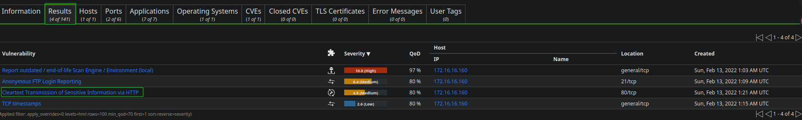
</p>

answer: **Cleartext Transmission of Sensitive Information via HTTP**