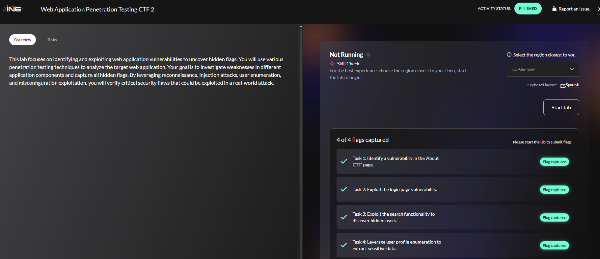
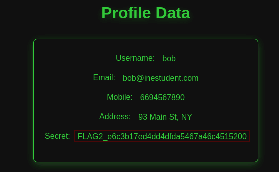
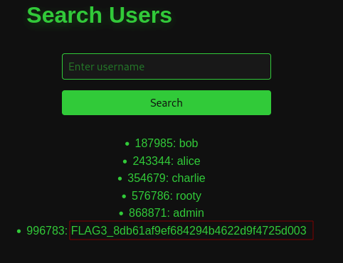
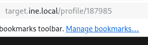
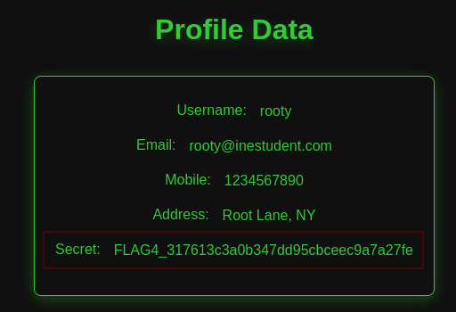

# Web Application Penetration Testing CTF 2

<p align="center"> 

</p>

## Task 1: Identify a vulnerability in the 'About CTF' page

You will find the first flag by analyzing the 'About CTF' page and identifying its root cause. Look for a vulnerable function that may expose critical information.

1. **Task 1: Identify a vulnerability in the 'About CTF' page.**

Para encontrar la primera flag nos tenemos que ir a esta pagina: 

```
http://target.ine.local/
```

Luego, visitamos el apartado **About** y miramos su código fuente.

<p align="center"> 

</p>

answer: **b6013111ddc44c828ba674bcabb317e9**

## Task 2: Exploit the login page vulnerability

The application login mechanism contains an injection vulnerability. Use appropriate techniques to bypass authentication and retrieve the second flag.

2. **Exploit the login page vulnerability.**

En el panel inicio sesión en el apartado **email** escribimos lo siguiente:

```
admin' OR 1=1-- - 
```

En el password escribimos lo que sea. 

<p align="center"> 

</p>

answer: **e6c3b17ed4dd4dfda5467a46c4515200**

## Task 3: Exploit the search functionality to discover hidden users

The search users page may be vulnerable to unintended information disclosure. Find a way to enumerate users and locate the third flag.

3. **Exploit the search functionality to discover hidden users.**

Para explotar el panel de busqueda repetimos el mismo comando de la actividad anterior

```
admin' OR 1=1-- -
```

<p align="center"> 

</p>

answer: **8db61af9ef684294b4622d9f4725d003**
## Task 4: Leverage user profile enumeration to extract sensitive data

Newly discovered user accounts may provide access to sensitive details. Analyze the user profile data page and identify potential weaknesses to capture the fourth flag.

4. **Leverage user profile enumeration to extract sensitive data.**

En la actividad anterior hemos conseguidos unos numeros, usaremos el numero 576786 de **rooty**. En primer lugar tenemos que logearnos otra vez en welcome

```
admin' OR 1=1-- -
```

Nos aparecerá el siguiente pues tenemos que sustituirlo por **576786** que es el de root

<p align="center"> 

</p>

```
http://target.ine.local/profile/576786
```

<p align="center"> 

</p>

answer: **317613c3a0b347dd95cbceec9a7a27fe**